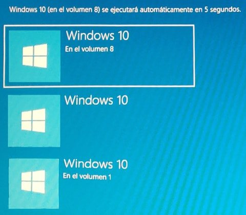
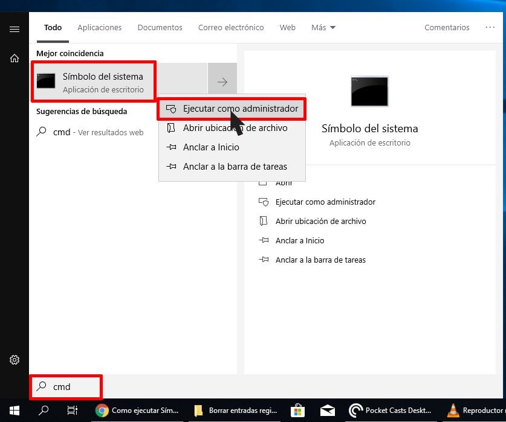
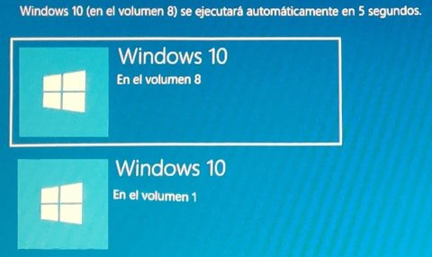
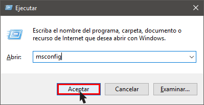
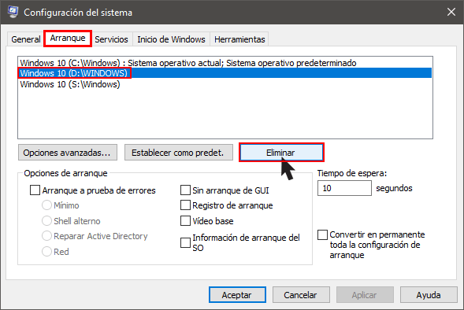

En el siguiente artículo verán como eliminar entradas no útiles del gestor de arranque de Windows. Actualmente tengo distintas versiones de Windows instaladas en mi ordenador. Por lo tanto, cuando aparece el gestor de arranque de Windows me encuentro con la siguiente situación:<!--more-->

[](images/3-entradas-gestor-arranque.jpg)

Si os fijáis, la segunda de las 3 entradas no tiene ningún volumen asignado. Esto es así porque corresponde a una instalación de Windows que ya no está presente en mi disco duro. Para eliminar esta entrada del gestor de arranque disponemos de varios modos. El primero de ellos es el siguiente.

###### Nota: Tienen que ser cautelosos en el momento de eliminar una entrada del gestor de arranque. Si eliminan la entrada equivocada no podrán arrancar su sistema operativo y la única solución que tendrán será reconstruir la configuración de arranque (BCD).

## ELIMINAR ENTRADAS DEL GESTOR DE ARRANQUE DE WINDOWS CON LA CONSOLA

Para eliminar la segunda entrada de nuestro gestor de arranque abrimos una consola con permisos de administrador.

[](images/abrir-consola-permisos-administrador.jpg)

Seguidamente listaremos los identificadores de las entradas presentes en el gestor de arranque de Windows. Para ello ejecutaremos el siguiente comando en la consola:

> ```
> bcdedit /v
> ```

En mi caso el resultado obtenido ha sido el siguiente:

> ```
> Administrador de arranque de Windows
> ----------------------------------
> Identificador {9dea862c-5cdd-4e70-acc1-f32b344d4795}
> device partition=D:
> description Windows Boot Manager
> locale es-ES
> inherit {7ea2e1ac-2e61-4728-aaa3-896d9d0a9f0e}
> default {a9a87667-f416-11e8-abac-896c936fa3ea}
> resumeobject {a9a87666-f416-11e8-abac-896c936fa3ea}
> displayorder {a9a87667-f416-11e8-abac-896c936fa3ea}
> {a9a87663-f416-11e8-abac-896c936fa3ea}
> {0a2775d8-567d-11e8-8d0b-809fffde78e5}
> toolsdisplayorder {b2721d73-1db4-4c62-bf78-c548a880142d}
> timeout 10
> 
> Cargador de arranque de Windows
> -----------------------------
> Identificador {a9a87667-f416-11e8-abac-896c936fa3ea}
> device partition=C:
> path \Windows\system32\winload.exe
> description Windows 10
> locale es-ES
> inherit {6efb52bf-1766-41db-a6b3-0ee5eff72bd7}
> recoverysequence {a9a87668-f416-11e8-abac-896c936fa3ea}
> displaymessageoverride Recovery
> recoveryenabled Yes
> allowedinmemorysettings 0x15000075
> osdevice partition=C:
> systemroot \Windows
> resumeobject {a9a87666-f416-11e8-abac-896c936fa3ea}
> nx OptIn
> bootmenupolicy Standard
> 
> 
> Cargador de arranque de Windows
> -----------------------------
> Identificador {a9a87663-f416-11e8-abac-896c936fa3ea}
> device unknown
> path \Windows\system32\winload.exe
> description Windows 10
> locale es-ES
> inherit {6efb52bf-1766-41db-a6b3-0ee5eff72bd7}
> recoverysequence {a9a87664-f416-11e8-abac-896c936fa3ea}
> displaymessageoverride Recovery
> recoveryenabled Yes
> allowedinmemorysettings 0x15000075
> osdevice unknown
> systemroot \Windows
> resumeobject {a9a87662-f416-11e8-abac-896c936fa3ea}
> nx OptIn
> bootmenupolicy Standard
> 
> Cargador de arranque de Windows
> -----------------------------
> Identificador {0a2775d8-567d-11e8-8d0b-809fffde78e5}
> device partition=D:
> path \WINDOWS\system32\winload.exe
> description Windows 10
> locale es-ES
> inherit {6efb52bf-1766-41db-a6b3-0ee5eff72bd7}
> recoverysequence {00747191-5675-11e8-a8a9-d24cfa6083d9}
> displaymessageoverride Recovery
> recoveryenabled Yes
> allowedinmemorysettings 0x15000075
> osdevice partition=D:
> systemroot \WINDOWS
> resumeobject {0a2775d7-567d-11e8-8d0b-809fffde78e5}
> nx OptIn
> bootmenupolicy Standard
> ```

Analizando los resultados obtenidos vemos que la tercera entrada con el identificador **{a9a87663-f416-11e8-abac-896c936fa3ea}** no dispone de ninguna partición asignada **(device unknown)**. Por lo tanto, esta es la entrada que tenemos que eliminar. Para ello ejecutaremos el siguiente comando en la consola:

> ```
> bcdedit /delete {a9a87663-f416-11e8-abac-896c936fa3ea}
> ```

El significado de cada uno de los parámetros usados para borrar la entrada del gestor de arranque es:

- **bcdedit:** Indicar que queremos editar la configuración del proceso de arranque de Windows.
- **/delete:** Definimos que queremos borrar una de las entradas que aparece en el gestor de arranque.
- **{a9a87663-f416-11e8-abac-896c936fa3ea}:** Corresponde al identificador de la entrada del gestor de arranque que queremos borrar.

En estos momentos ya hemos eliminado una de las entradas del registro de arranque de Windows. En caso que hubiéramos cometido un error aún podríamos deshacer los cambios ejecutando el siguiente comando en la consola:

> ```
> bcdboot
> ```

A partir de estos momentos, la próxima vez que arranque Windows ya solo veré 2 opciones en el gestor de arranque de Windows.

[](images/entrada-gestor-arranque-eliminada.jpg)

Si no os gusta usar la consola también pueden usar el entorno gráfico para eliminar entradas del gestor de arranque. Para ello pueden que usar el método que detallo a continuación.

## ELIMINAR ENTRADAS DEL GESTOR DE ARRANQUE DE WINDOWS CON MSCONFIG

Otra opción más sencilla para eliminar entradas del gestor de arranque de Windows es usando msconfig.

Para ello presionen la combinación de teclas **Win+R**. Cuando aparezca la ventana Ejecutar escriban **msconfig** y seguidamente presionen el botón **Aceptar**.

[](images/acceder-configuración-sistema.png)

En la ventana de configuración del sistema cliquen sobre la pestaña **Arranque**. Seguidamente seleccionen la entrada que quieren borrar y presionen sobre el botón **Eliminar**.

[](images/eliminar-entrada-gestor-arranque.png)

Siguiendo estos simples pasos ya habremos borrado la segunda de las tres entradas del arranque de Windows. Por lo tanto, la próxima vez que arranquemos el ordenador únicamente aparecerán dos entradas en el gestor de arranque.

[](images/entrada-gestor-arranque-eliminada.jpg)

De esta forma tan sencilla podemos eliminar las entradas que queramos de nuestro gestor de arranque. Pero tengan mucho cuidado de no eliminar la entrada equivocada.
