A continuación veremos como podemos eliminar la publicidad en un dispositivo de Apple mediante el uso del archivo hosts. El requisito para aplicar el tutorial que veréis a continuación es el siguiente:

1. Disponer de cualquier dispositivo de Apple con el sistema operativo iOS y con el Jailbreak realizado.

<!--more-->

###### Nota: A medida que evolucionan los sistemas operativos hay menos necesidad de realizar el Jailbreak. No obstante en mi caso lo veo necesario para por ejemplo bloquear la publicidad de forma efectiva y eficiente.

## ¿COMO BLOQUEAREMOS LA PUBLICIDAD DE NUESTRO IPHONE O IPAD?

La forma elegida para bloquear la publicidad en nuestro iPhone o iPad es mediante la introducción de código en el archivo [hosts](https://es.wikipedia.org/wiki/Archivo_hosts "Explicación de lo que es el archivo hosts").

Cuando en un navegador o aplicación aparece un anuncio es por los siguientes motivos:

1. El navegador o aplicación realiza una petición a un servidor externo que almacena los anuncios.
2. Una vez realizada la petición se resuelve y con posteridad se descarga el anuncio del servidor al navegador o aplicación que estamos usando.

Conociendo este mecanismo tan solo tenemos que bloquear las peticiones que nuestro navegador y/o aplicaciones hacen al servidor que proporciona los anuncios. Para ello podemos usar el archivo hosts del siguiente modo:

Si queremos bloquear la publicidad del servidor adsclick.net tan solo tenemos que añadir la siguiente línea en el archivo hosts:

> ```
> 255.255.255.0 adsclick.net
> ```

De esta forma cuando nuestro navegador o aplicación realice una petición al servidor con dominio adsclick.net se intentará conectar a una IP inexistente que es la 255.255.255.0. Como la IP no existe no se podrá descargar el anuncio del servidor adsclick.net

De esta forma tan simple y añadiendo código en el archivo hosts podremos bloquear la gran mayoría de anuncios.

### Ventajas de bloquear la publicidad mediante el archivo hosts

Bloquear la publicidad mediante el archivo hosts proporciona muchas ventajas respecto a los sistemas convencionales de bloqueo. Algunas de las ventajas son las siguientes:

1. No solamente bloquea anuncios en Safari. El método nos permitirá bloquear los anuncios en todas las Apps de nuestro iPhone o iPad.
2. El sistema para bloquear los anuncios es transparente y seguro. El método no implica instalar apps de dudosa reputación que no sabemos lo que hacen o que se dedican a filtrar los anuncios a través de un servicio VPN externo.
3. El consumo de batería y recursos es menor que con los métodos tradicionales. Hay sistemas de bloqueo de anuncios que drenan la batería y consumen nuestros recursos.
4. La navegación y el rendimiento de las apps será mejor. Este método bloquea la publicidad sin tan siquiera llegar a realizar una petición DNS al servidor que contiene la publicidad.

### Inconvenientes de bloquear la publicidad con el archivo hosts

Algunos inconvenientes que tiene el método que detallaremos a continuación son los siguientes:

1. Precisamos de un dispositivo iOS con jailbreak. Si no disponemos de Jailbreak no podremos aplicar el método que veremos a continuación.
2. Periódicamente hay que actualizar el contenido del archivo hosts.
3. Este método quita los anuncios, pero en muchos casos no hace desaparecer el contenedor que contiene los anuncios. Por lo tanto en los sitios donde se bloquea el anuncio aparecerá hueco de color blanco.

Una vez detallado el sistema de bloqueo podemos pasar a la acción y ver los pasos a seguir para eliminar los ads publicitarios en nuestras apps y navegadores.

## BLOQUEAR LA PUBLICIDAD DE NUESTRO IPHONE O IPAD CON UNTRUSTED HOSTS BLOCKER

Los pasos a seguir para bloquear la publicidad mediante el archivo hosts en un dispositivo con el sistema operativo iOS son los siguientes

Añadir el repositorio para instalar Untrusted Hosts Blocker Inicialmente añadimos el repositorio Thireus procediendo del siguiente modo:

1. Abrimos la tienda de aplicaciones Cydia.
2. Una vez dentro de la tienda presionamos encima del botón Fuentes.
3. A continuación presionamos encima del botón Editar.

[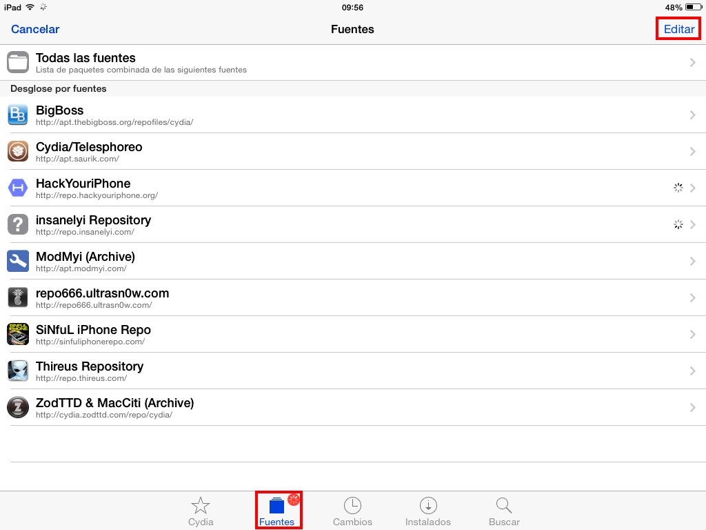](images/editar-las-fuentes-de-cydia.png)

Seguidamente presionamos encima del botón Añadir.

[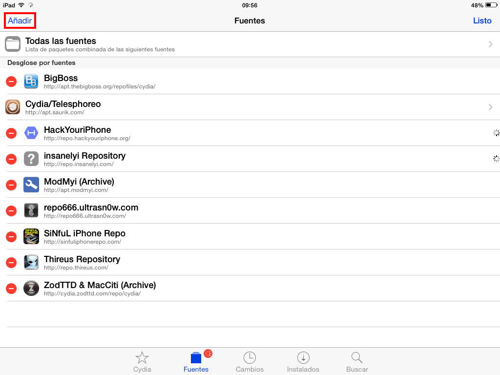](images/anadir-fuente-a-cydia.png)

A continuación, tal y como se puede ver en la captura de pantalla, aparecerá un cuadro de dialogo en el que debemos introducir la URL del repositorio que queremos añadir. En nuestro caso tenemos que introducir la siguiente URL:

> ```
> https://repo.thireus.com
> ```

Finalmente presionamos el botón Añadir fuente para finalizar el proceso.

[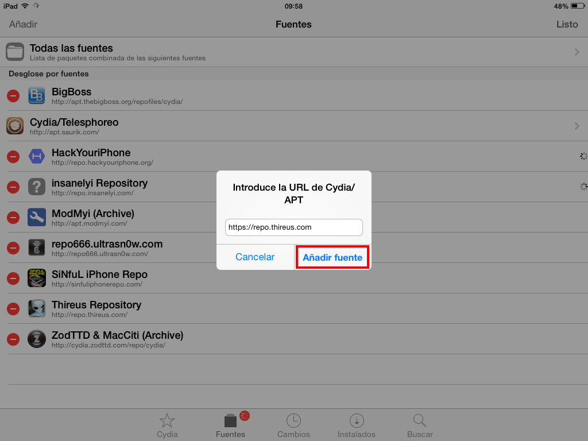](images/introducir-url-repositorio-thireus.png)

### Instalar el tweak Untrusted Hosts Blocker

Una vez añadido del repositorio ya podemos instalar la aplicación Untrusted Hosts Blocker. Para ello dentro de Cydia tenemos que realizar lo siguiente:

1. Presionamos encima del botón Buscar.
2. En el cuadro de búsqueda buscamos el paquete Untrusted Hosts Blocker.
3. Una vez encontrado el paquete tenemos que presionar sobre él.

[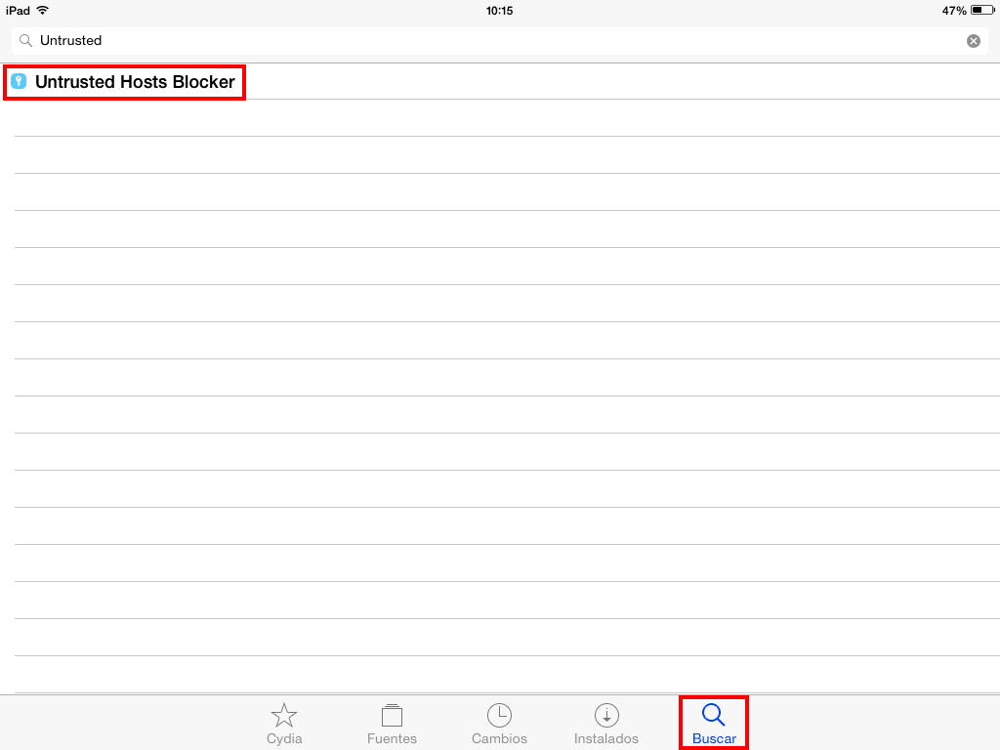](images/buscar-untrusted-hosts-blocker.png)

Seguidamente tendremos que presionar encima de la opción Instalar.

[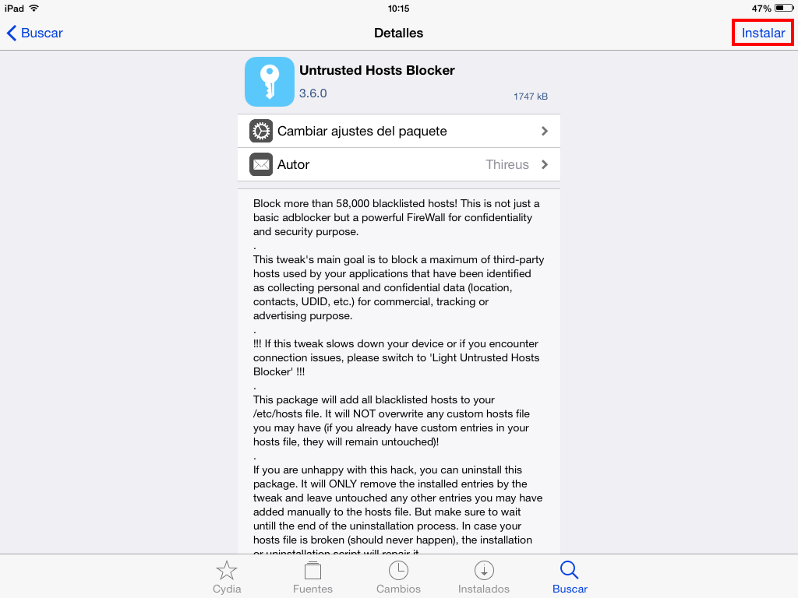](images/instalar-untrusted-hosts-blocker.png)

Finalmente presionaremos sobre el botón Confirmar.

[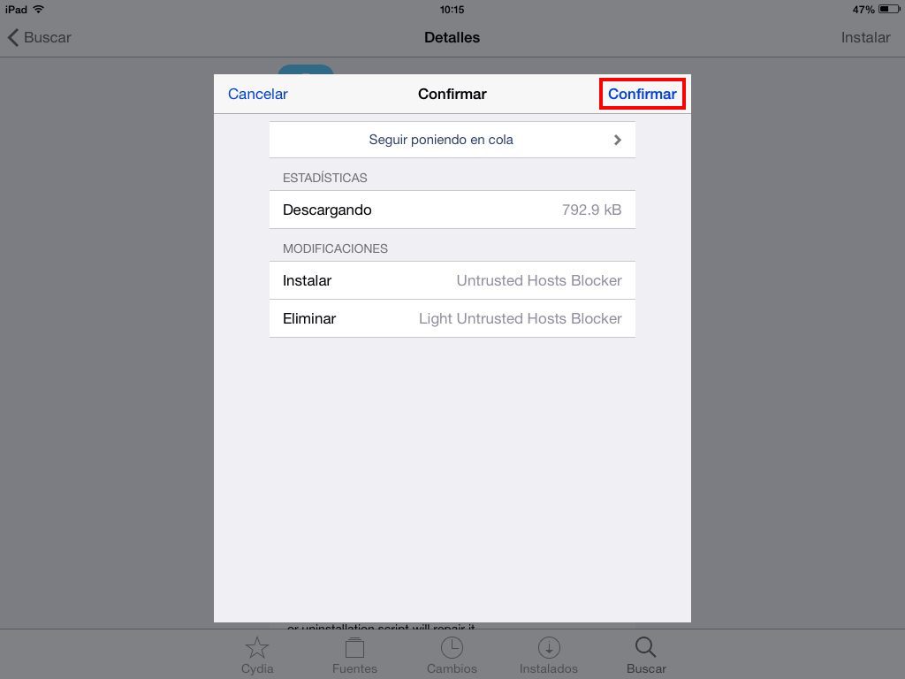](images/confirmar-la-instalacion-untrusted-hosts-blocker.png)

Una vez instalado el Tweak el trabajo ha finalizado. A partir de estos momentos bloquearemos prácticamente la totalidad de la publicidad sin tener que realizar nada en especial.

###### Nota: En el caso que dispongan de un dispositivo extremadamente antiguo pueden notar lentitud en la navegación o que las páginas no cargan. Si es este el caso les recomiendo que en vez de instalar Unstrusted Hosts Blocker instalen Light Untrusted Hosts Blocker.

## BLOQUEAR LA PUBLICIDAD DE NUESTRO IPAD O IPHONE MEDIANTE UN ARCHIVO HOSTS CONSTRUIDO POR NOSOTROS

El método que acabamos de ver es 100% eficaz y fácil de aplicar. No obstante tiene los siguientes inconvenientes.

1. dependemos que el desarrollador del tweak actualice periódicamente el contenido del archivo hosts. No obstante esto no es un punto crítico ya que un archivo hosts se puede usar durante años de forma efectiva.
2. En mi caso uso Unstrusted Hosts Blocker y el dispositivo me funciona a la perfección. No obstante el procedimiento de instalación de cualquier tweak es poco transparente.

Por estos motivos si queremos podemos nosotros mismos podemos hacernos nuestro archivos hosts para bloquear la publicidad.

### Instalar el explorador de archivos iFile

Para reemplazar el archivo hosts actual por el que construiremos nosotros necesitamos usar el explorador de archivos iFile. Para instalarlo deben seguir los siguientes pasos:

https://geekland.eu/instalar-el-explorador-de-archivos-ifile/

Obtener el archivo hosts de nuestro ipadPara obtener el archivo hosts original de nuestro iPad o iPhone abrimos iFile. A continuación clicamos encima del icono de la bola del mundo para activar el servidor WebDAV que trae incorporado iFile.[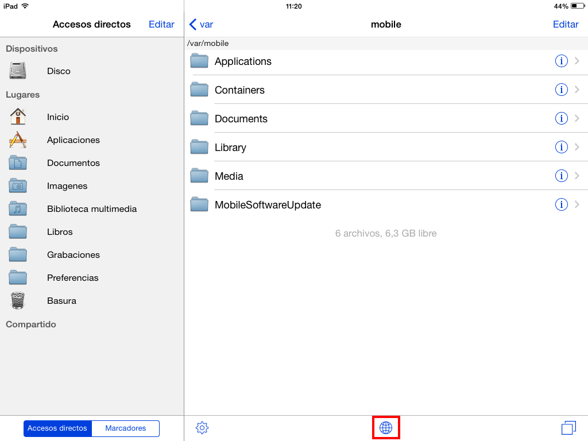](images/conectarse-al-iphone-o-ipad-con-webdav.png)

A continuación se abrirá la siguiente ventana en que podrán ver la URL a usar para conectarnos a nuestro dispositivo. En mi caso la dirección es http://192.168.1.18:1000.

[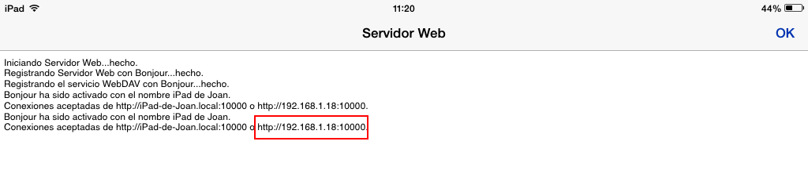](images/direccion-conexion-webdav.png)

Abrimos el navegador web de nuestro ordenador, introducimos la URL que acabamos de ver y presionamos la tecla Enter. Acto seguido podremos ver el contenido de nuestro dispositivo. Una vez veamos el contenido clicamos encima de la carpeta etc/ que es donde está ubicado el archivo hosts.

[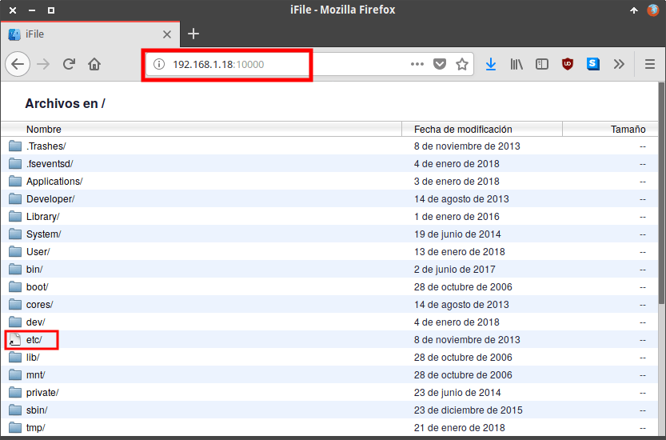](images/conectarse-al-servidor-webdav.png)

###### Nota: Para que la conexión sea satisfactoria, tanto el ordenador como el dispositivo iOS tienen que estar conectados a la misma red local.

Dentro de la ubicación /etc buscamos el archivo hosts y clicamos sobre él. Acto seguido se descargará el archivo hosts en nuestro ordenador.

[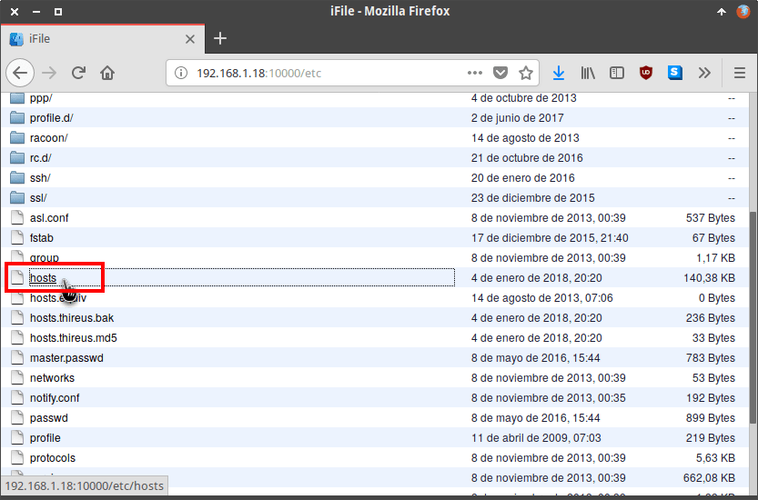](images/descargar-archivo-hosts-ipad.png)

### Elaborar un archivo hosts potente para bloquear la publicidad

Una vez descargado el archivo hosts lo abrimos con un editor de textos. En mi caso el contenido inicial del archivo hosts es el siguiente:

[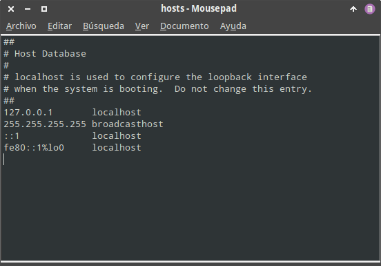](images/contenido-inicial-archivos-hosts.png)

A continuación tenemos que añadir las entradas dentro del archivo hosts para bloquear los servidores que ofrecen publicidad. Las fuentes a usar para introducir los entradas son las siguientes:

[https://adaway.org/hosts.txt](https://adaway.org/hosts.txt "Entradas que podemos usar en el archivo hosts para bloquear la publicidad")

[https://hosts-file.net/ad\_servers.txt](https://hosts-file.net/ad_servers.txt "Entradas que podemos usar en el archivo hosts para bloquear la publicidad")

[https://pgl.yoyo.org/adservers/serverlist.php?hostformat=hosts&showintro=0&mimetype=plaintext](https://pgl.yoyo.org/adservers/serverlist.php?hostformat=hosts&showintro=0&mimetype=plaintext "Entradas que podemos usar en el archivo hosts para bloquear la publicidad")

###### Nota: Con las 3 fuentes que cito es más que suficiente. Si quieren obtener más fuentes pueden consultar la siguiente [URL](https://github.com/AdAway/AdAway/wiki/hostssources "Entradas usadas por AdAway para bloquear la publicidad").

Una vez dentro de las fuentes que he citado copiamos sus entradas:

[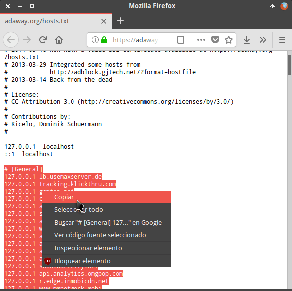](images/copiar-entradas-archivo-hosts.png)

Seguidamente nos vamos al archivo hosts original y pegamos el contenido que acabamos de copiar.

[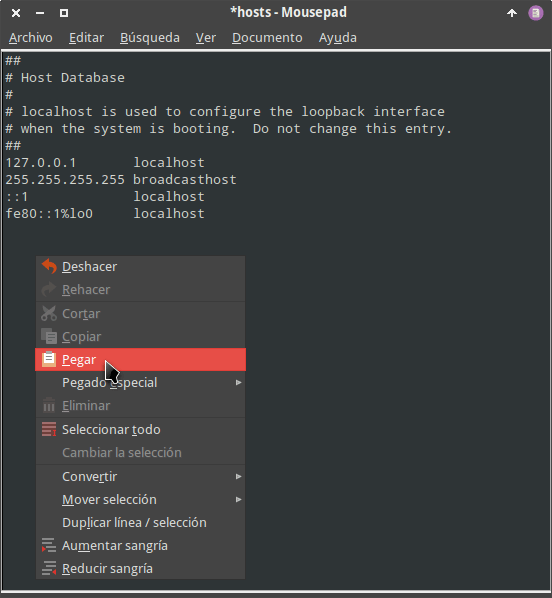](images/pegar-entradas-archivo-hosts.png)

Una vez pegadas la totalidad entradas vuestro archivo hosts tendrá un aspecto similar al siguiente:

[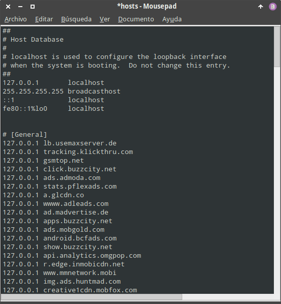](images/archivo-hosts-modificado.png)

Finalmente tan solo tenemos que guardar los cambios y cerrar el archivo. En estos momentos ya disponemos de un archivo hosts para bloquear la publicidad en nuestro dispositivo Apple.

### Reemplazar el archivo hosts original por el modificado

Nos dirigimos de nuevo a nuestro navegador y nos aseguremos que estamos ubicados en la ubicación /etc de nuestro dispositivo iOS. A continuación presionamos encima del botón Examinar.

[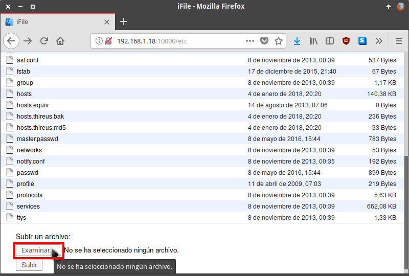](images/seleccionar-archivo-a-subir.png)

Seguidamente seleccionamos el archivo hosts que hemos modificado y presionamos el botón Abrir.

[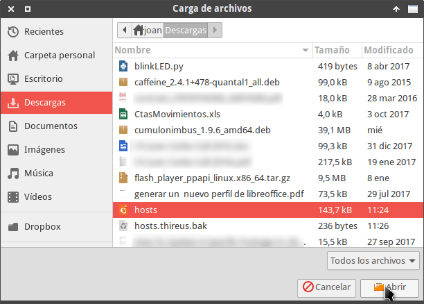](images/seleccionar-archivo-hosts-modificado.png)

Finalmente presionamos el botón Subir para enviar el archivo hosts modificado dentro de nuestro iPad, Iphone o iPod.

[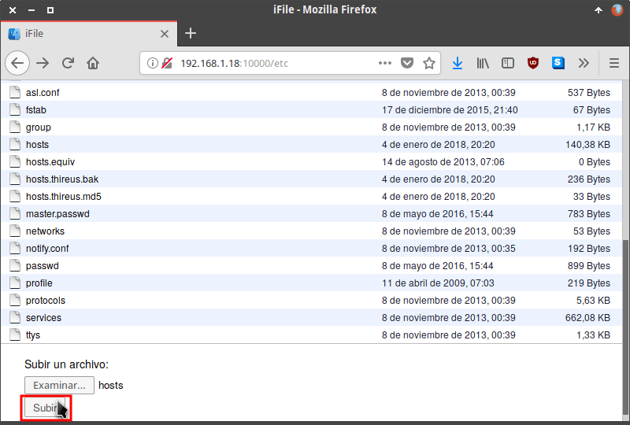](images/subir-el-nuevo-archivo-hosts.png)

Abrimos el gestor de archivos iFile y accedemos la ubicación /etc. Dentro de esta ubicación veremos que tenemos los archivos hosts y hosts(1).

El archivo hosts(1) corresponde al archivo hosts que hemos creado nosotros mismos.

El archivo hosts corresponde al fichero hosts original de nuestro dispositivo. Por lo tanto para usar el archivo hosts que hemos creado deberemos renombrar los nombres de los archivos del siguiente modo:

Inicialmente presionamos encima del icono de información del archivo hosts original.

[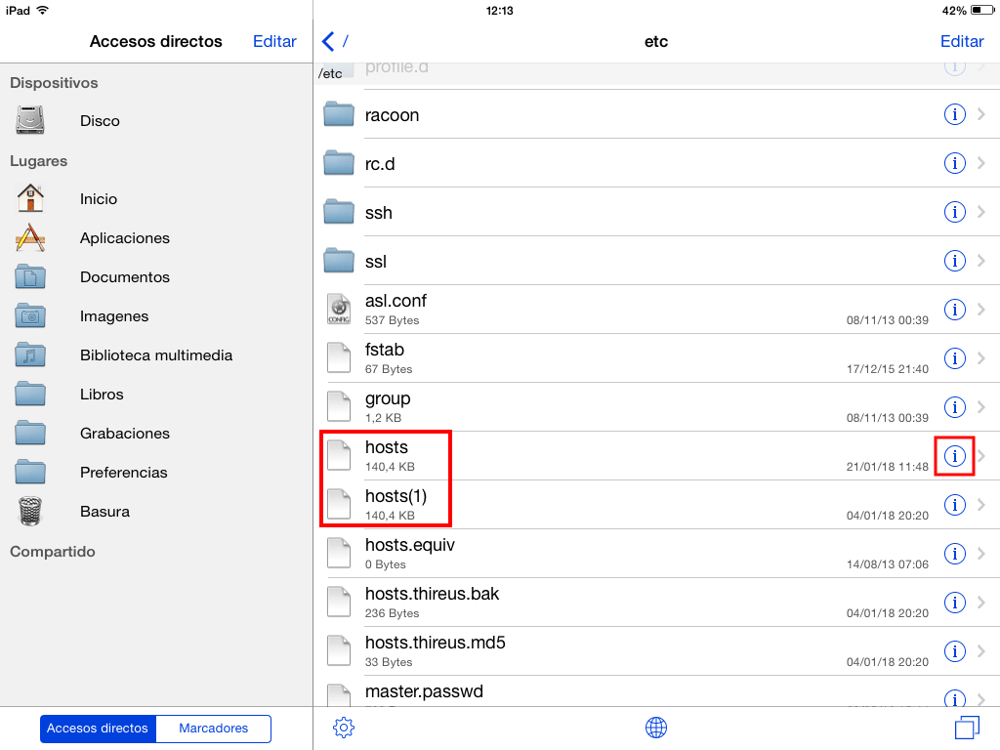](images/cambiar-nombre-archivo-hosts-original.png)

A continuación en el apartado **Nombre** modificaremos el nombre del archivo hosts. En mi caso renombraré el archivo hosts con el nombre hosts.bak.

[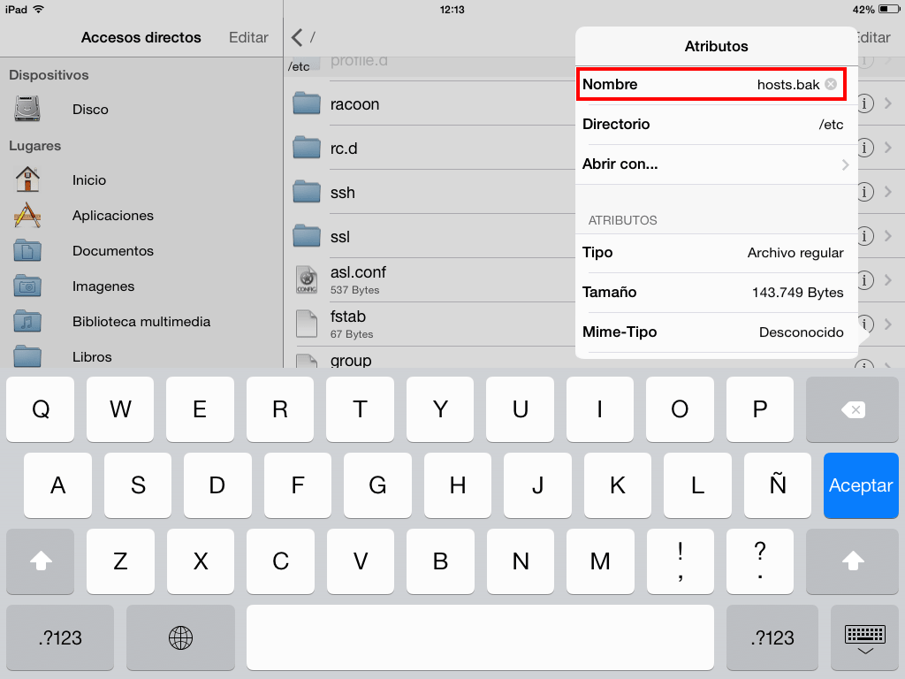](images/renombrar-hosts-hosts-bak.png)

Seguidamente renombraré el archivo hosts(1) a hosts. Para ello clicaré en el icono de información del archivo hosts(1).

[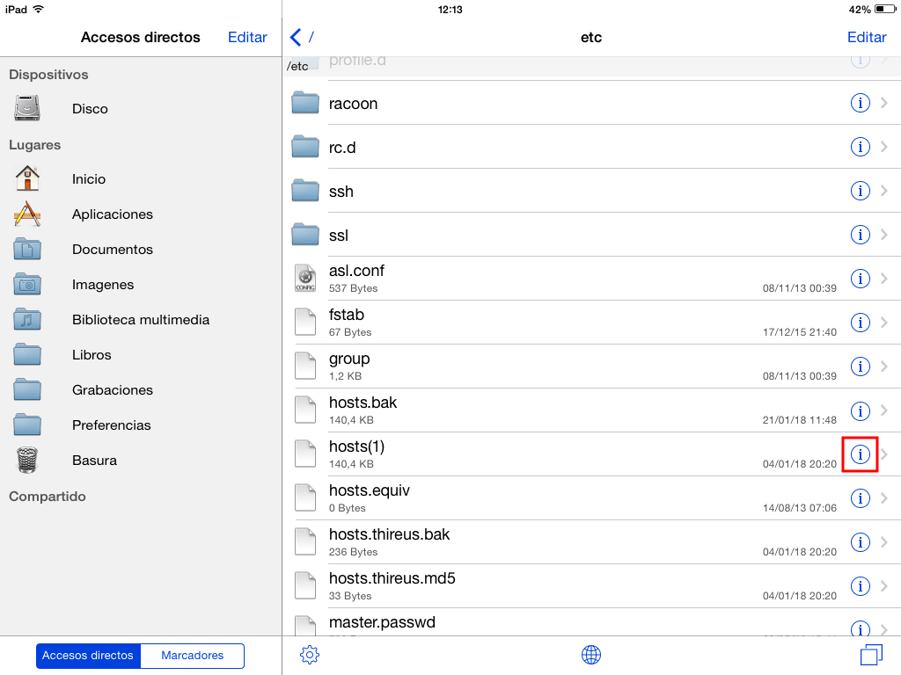](images/cambiar-nombre-archivo-hosts-modificado.png)

Finalmente en el apartado **Nombre** escribiremos el nuevo nombre que queramos que tenga el fichero hosts(1). En nuestro caso deberemos asignarle el nombre hosts.

[ a hosts")](images/renombrar-hosts1-a-hosts.png)

Una vez realizados estos pasos podremos bloquear de forma efectiva y eficiente la publicidad de nuestro dispositivo iOS. Además el método ofrece todas las garantías del mundo porque es un trabajo que hemos realizado nosotros mismos.
