En pasados post pudimos ver detalladamente como podemos conectarnos a un servidor proxy o como podemos crear nuestro propio servidor proxy socks. A raíz de esta serie de post han salido consultas de gente preguntando si **es posible encadenar un proxy detrás de otro para así poder ocultar nuestra identidad y nuestra IP con más garantías**. La respuesta es esta pregunta es que sí.<!--more-->

Antes de proseguir con la lectura del post y entender el 100% del contenido que se detalla se aconseja dar un vistazo a los siguientes post:

[https://geekland.eu/conectarse-a-un-servidor-proxy/]()

[https://geekland.eu/establecer-un-tunel-ssh/]()

## ¿QUÉ NECESITAMOS PARA ENCADENAR SERVIDORES PROXY?

**Para encadenar un proxy tras otro en cualquier sistema operativo** y de este modo poder esconder nuestra identidad es sumamente fácil. Tan solo **tenemos que instalar [Proxychains](http://proxychains.sourceforge.net "Web de proxychains")**. **Proxychains redirigirá la totalidad de peticiones TCP y resoluciones DNS de la aplicación que nosotros queremos a través de una lista de proxy que nosotros podemos especificar**.

## INSTALAR PROXYCHAINS

Para instalar proxychains tan solo tenemos que abrir una terminal y teclear el siguiente comando:

> ```
> sudo apt-get install proxychains
> ```

En la siguiente captura de pantalla pueden observar este paso tan simple:

[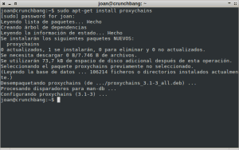](images/1-Instalar-Proxychains.png)

Una vez realizado este paso ya solo nos falta comprender el funcionamiento de proxychains y aprender a configurarlo adecuadamente.

###### Nota: Estoy seguro que existe multitud de opciones alternativas a proxychains como por ejemplo [Socat](http://www.dest-unreach.org/socat/ "Información sobre Socat"). No obstante les recomiendo proxychains por 2 razones fundamentales. Proxychains funciona a la perfección y además es una solución multiplataforma que podremos aplicar en cualquier sistema operativo Windows, Mac o Gnu-Linux. En el caso que quieran usar una solución similar en Android pueden probar [Socat](http://www.dest-unreach.org/socat/ "Información sobre Socat").

## ¿CÓMO FUNCIONA PROXYCHAINS?

El funcionamiento de proxychains es sencillo y es fácil de entender si ponemos un ejemplo:

Supongamos que estamos en nuestra casa. Nuestro ordenador tiene una IP Pública que es la **77.123.21.3** y queremos visitar una página web que está alojada en un servidor web que tiene la IP **80.12.54.23**.

**En el caso que no estemos usando ningún proxy** se establecerá una conexión directa entre nuestro ordenador y el servidor web tal y como se muestra en la siguiente imagen:

[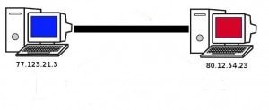](images/2-Conexión-directa.jpg)

**En el caso que estemos usando varios servidores proxy encadenados a través de proxychains** el esquema de conexión al servidor web es el que se muestra en la siguiente imagen:

[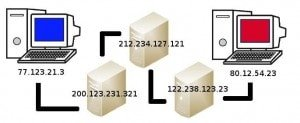](images/3-Conexión-con-proxychains.jpg)

1. La petición inicial de nuestro ordenador con IP (**77.123.21.3**) se dirige a un servidor proxy con IP (**200.123.231.321**).
2. Seguidamente el servidor proxy con IP (**200.123.231.321**) dirige la petición a otro servidor proxy con IP (**212.234.127.121**)
3. Una vez el proxy con IP (**212.234.127.121**) reciba la petición del servidor proxy con IP (**200.123.231.321**) la dirigirá al servidor proxy con IP (**122.238.123.23**)
4. Una vez el proxy con IP (**122.238.123.23**) reciba la petición del servidor proxy (**212.234.127.121**) la dirigirá a otro servidor proxy con IP (**122.238.123.44**)
5. Finalmente el servidor proxy con ip (**122.238.123.44**) dirigirá la petición al servidor web con IP (**80.12.54.23**).

## VENTAJAS QUE OBTENEMOS CON PROXYCHAINS

En el siguiente post se detallan de forma muy detallada las ventajas que podemos obtener de conectarnos a internet a través de un servidor Proxy:

[https://geekland.eu/conectarse-a-un-servidor-proxy/]()

Pero ahora el kit que de la cuestión es... ¿Qué obtenemos encadenando un proxy detrás de otro?

La respuesta es simple. **En el caso que alguien intente localizar nuestra IP, y nosotros estamos conectados a internet a través de una cadena de proxy, le será mucho más difícil identificarnos y atacarnos**. **El motivo por el cual le será más difícil es el siguiente**:

[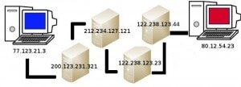](images/4-Ventajas-de-un-servidor-proxy.jpg)

Si volvemos al ejemplo anterior vemos que nosotros hacemos una petición para visitar una página web y esta va pasando por distintos proxy que nosotros podemos definir.

**Si algún atacante analiza el segundo servidor proxy** con IP (**212.234.127.121**) **puede llegar a saber que nos hemos conectado al proxy 1** con IP (**200.123.231.321**), **y** puede llegar a saber que nos hemos conectado **al proxy número 3** con IP (**122.238.123.23**) **pero nunca podrá saber que nos hemos conectado a un proxy número 4** con IP (**122.238.123.44**)

Este simple hecho hará que sea más difícil trazar e identificar nuestra identidad o IP. De este modo conseguiremos más privacidad y anonimato en internet.

###### Nota: El hecho de conectarse a través de un proxy desconocido o de dudosa reputación puede ser peligroso. Hay que decir que en la red existen proxy gratuitos que su principal principal función es capturar nuestros datos y vendérselos a terceros.

## COMO CONFIGURAR PROXYCHAINS

Una vez instalado proxychains, y una vez conocemos como funciona, tan solo tenemos que configurarlo adecuadamente. El primer paso que tenemos que realizar para empezar al configuración de proxychains es definir los servidores proxy que vamos a usar.

### Seleccionar los proxy a que nos queremos conectar

[](images/3-Conexión-con-proxychains.jpg)

###### Nota: Siguiendo el esquema de la figura vamos a seleccionar 3 servidores proxy para encadenarlos uno tras otro.

**SERVIDOR 1:** Elijo que **el primer servidor se trate de un servidor proxy socks local que enviará todo el tráfico a través de un túnel SSH a otro ordenador que tengo ubicado en otra ciudad**. Para poder realizar esta acción tengo que abrir una terminal y teclear el siguiente comando:

> ```
> ssh -p 22 -N -D 8081 joan@geekland.sytes.net
> ```

[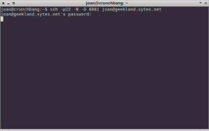](images/5-Tunel-SSH-Establecido.png)

Como se puede ver en la captura de imagen, una vez aplicado el comando nos pide la contraseña de nuestro servidor SSH. Una vez hemos introducido la contraseña se establece la conexión y tan solo tenemos que minimizar la ventana.

###### Nota: Tenéis que minimizar la ventana. Bajo ningún concepto cerréis la ventana ya que se cortaría la conexión entre servidor local y el servidor SSH que actúa de proxy.

**Los datos de nuestro propio servidor proxy local son** los siguientes:

_**IP del servidor proxy:**_ Como se trata de un servidor local la IP del servidor será **127.0.0.1**.

_**Puerto de acceso del servidor proxy:**_ Como el túnel SSH se ha abierto por el puerto 8081, el puerto de acceso al servidor proxy será el **8081**.

**_Tipo del servidor proxy:_** El servidor local es del tipo **socks5**

**SERVIDOR 2:** Quiero que **se trate de un servidor proxy socks del tipo 5**. Para hallar un servidor proxy socks tipo 5 tan solo tienen que visitar el siguiente link y encontrarán numerosas opciones:

[https://hidemyass.com/proxy-list/](https://hidemyass.com/proxy-list/ "Lista de proxy")

[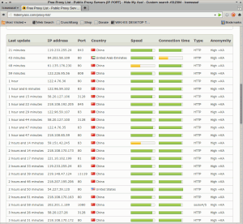](images/6-listado-de-proxy.png)

**Una vez hayáis accedido dentro del link tan solo tenéis que seleccionar uno de los proxy**. Para seleccionar un proxy tenéis que anotar los siguientes datos:

**_IP del servidor proxy:_** En mi caso elijo que quiero conectarme el servidor proxy con IP **180.169.125.49**. **Podéis seleccionar cualquiera de las IP que se muestran en el Campo** **IP address**.

_**Puerto de acceso del servidor proxy:**_ El servidor que tiene la IP 180.169.125.49 tiene acceso por el puerto **8888**. **Para conocer el puerto de acceso tan solo que consultar la columna** **Port**.

_**Tipo del servidor proxy:**_ El servidor proxy que tiene la IP 180.169.125.49 y el puerto 8888 vemos que es de tipo **Socks 5**. **Para conocer este dato tan solo tienen que consultar la columna** **Type**.

Una vez anotados los datos del segundo servidor proxy pasamos a buscar el tercer servidor proxy.

**SERVIDOR 3:** El tercer y último servidor proxy **quiero que se trate de un servidor proxy http**. **Para ello aplicamos el mismo procedimiento que acabamos de aplicar en la selección del servidor 2** obteniendo un resultado parecido al siguiente:

_**IP del servidor proxy:**_ Elegimos un servidor proxy de la lista. Concretamente elijo el servidor que tiene la IP **222.74.98.234**.

_**Puerto de acceso del servidor proxy:**_ El servidor con IP **222.74.98.234** tiene acceso por el puerto **8080**.

_**Tipo del servidor proxy:**_ El proxy con IP **222.74.98.234** y puerto **8080** es el tipo **http**.

Una vez seleccionado el último de los proxy ya podemos abrir el archivo de configuración para configurar proxychains.

###### Nota: Como se puede en el ejemplo he seleccionado 3 tipos de proxy diferentes para que se pueda ver que proxychains es capaz de encadenar proxy de distintos tipos sin ningún problema.

###### Nota: Pueden hallar numerosas listas de servidores proxy diferentes a las de hidemyass. Tan solo hay que acceder a un buscador cualquiera, como por ejemplo [google](https://www.google.es "Buscador Web"), y buscar por la palabra clave proxy list.

### Acceder al fichero de configuración

**Para acceder a la configuración** de proxychains abrimos una terminal y **tecleamos el siguiente comando**:

> ```
> sudo nano /etc/proxychains.conf
> ```

### Seleccionar el modo de funcionamiento de proxychains

**Una vez tecleado el comando** anterior se abrirá el editor de texto donde deberemos configurar proxychains.

**Lo primero que tendremos que seleccionar en el fichero que de configuración es el tipo de cadena que queremos usar**. Los distintos tipos de cadena que podemos seleccionar son son **Strict**, **Random** y **dynamic**.

**El modo de funcionamiento de cada uno de los tipos de cadena es el siguiente:**

_**Strict:**_ **Seguirá exactamente la lista de proxy que estipulo. En el caso que uno de los proxy que figuren en la lista falle no se establecerá la conexión**. Esta opción es buena en el caso que queramos comprobar que la totalidad de proxy que figuran en nuestra lista funcionan. También es buena para asegurar que como mínimo nuestra petición pasará por el número de proxy que nosotros queremos.

###### Nota: Si usamos una lista de proxy muy larga y usamos la opción strict seguramente tendremos problemas ya que es altamente probable que uno de los proxy seleccionados falle.

_**Dinamic:**_ Ofrece el mismo funcionamiento que strict. Por lo tanto también **seguirá exactamente la lista de proxy que estipulo pero, a diferencia de strict, en el caso que uno de los proxy de la lista falle pasará al siguiente y de este modo podremos establecer la conexión sin problemas**. Por lo tanto en el caso de uséis una lista de proxy que sea larga esta es la opción más apropiada ya que no es difícil que uno de los proxy que figure en nuestra lista falle.

_**Random:**_ **En el momento de realizar las peticiones de conexión el orden de los proxy a que nos vamos a conectar será aleatorio**. Así por lo tanto el comportamiento habitual es que cuando hagamos una petición de conexión se realice con una IP determinada y justo la siguiente petición se realice con otra IP completamente distinta a la primera. Esta opción puede ser útil en el caso que en una red queramos testear un [sistema de detección de intrusos (IDS)](https://es.wikipedia.org/wiki/Sistema_de_detecci%C3%B3n_de_intrusos "Explicación de lo que es un sistema de detección de instrusos").

**Una vez visto los tipos de cadena existentes ahora tenemos que seleccionar el tipo que queremos.**

[](images/7-Tipos-de-cadena.png)

**Como se puede ver en la captura de pantalla, en el archivo de configuración, existen tres lineas con el siguiente texto:**

_Linea 1_: **#dynamic\_chain** _Linea 2_: **strict\_chain** _Linea_ 3: **#random\_chain**

**Si se fijan hay una linea que no contiene el carácter #. No contiene el símbolo # porqué es el tipo de cadena seleccionado por defecto.** Por lo tanto el tipo de cadena seleccionado por defecto es Strict. Para el ejemplo que estamos realizando usaremos la opción strict.

**En el caso que quisiéramos seleccionar el tipo de cadena random tan solo tendríamos que modificar las 3 lineas que acabamos de ver para dejarlas de la siguiente forma:**

_Linea 1_: **#dynamic\_chain** _Linea 2_: **#strict\_chain** _Linea 3_: **random\_chain**

**En el caso que quisiéramos seleccionar el tipo de cadena strict deberíamos modificar las 3 lineas que acabamos de ver para dejarlas de la siguiente forma:**

_Linea 1_: **dynamic\_chain** _Linea 2_: **#strict\_chain** _Linea 3_: **#random\_chain**

### Comprobar que la resolución de DNS se haga a través de los servidores de proxy

Una vez seleccionado el tipo de cadena tenemos que asegurarnos que la resolución DNS se haga a través de los servidores proxy para no dejar rastros de nuestra identidad ni perder nuestra privacidad.

[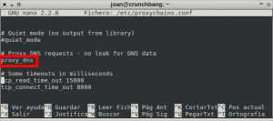](images/8-Proxy-DNS-leak.png)

Para ello, tal y como se puede ver en la captura de pantalla **tenemos que buscar la linea que tiene el siguiente contenido:**

**proxy\_dns**

**Una vez localizada la linea tenemos que asegurarnos que esta linea no está comentada**. La forma de aseguraranos que no está comentada es que esta linea no contenga el símbolo #.

### Introducir los servidores proxy dentro del archivo de configuración

Finalmente ya solo nos falta indicar la lista de servidores proxy que vamos a usar. **Para introducir la lista de proxy tenemos que irnos justo al final del archivo de configuración y añadir los datos que anotamos en el apartado de** **Seleccionar los proxy a que nos queremos conectar**.

[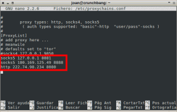](images/9-proxy-introducidos.png)

**Tal y como se puede ver en la captura de pantalla añadimos el siguiente contenido:**

**socks5 127.0.0.1 8081** _“Para introducir el servidor proxy 1”_ **socks5 180.169.125.49 8888** _“Para introducir el servidor proxy 2”_ **http 222.74.98.234 8080** _“Para introducir el servidor proxy 3”_

###### Nota: Como se puede ver en el ejemplo para introducir un servidor proxy tan solo tenemos que indicar el tipo de proxy seguido de un espacio o una tabulación. Después hay que indicar la IP del servidor proxy más un espacio o una tabulación, y finalmente solo hace falta indicar el puerto del servidor proxy.

Para finalizar tan solo tienen que guardar el archivo y ya podmos decir que el proceso ha finalizado.

## COMPROBACIÓN DEL FUNCIONAMIENTO

Una vez realizados todos los pasos tan solo falta comprobar que todo funciona adecuadamente. Para ello tan solo tenemos que abrir una terminal y teclear el siguiente comando:

> ```
> proxychains + nombre del programa que queremos utilizar
> ```

Así por lo tanto **si queremos usar iceweasel tan solo tenemos que introducir el siguiente comando en la terminal**:

> ```
> proxychains iceweasel
> ```

[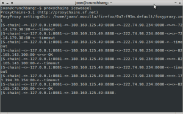](images/10-Ejecutar-Proxychains.png)

###### Nota:  El procedimiento sirve para cualquier programa que queramos usar. Así por lo tanto podremos usar proxychains con [firefox](https://www.mozilla.org/es-ES/firefox/new/ "Web Firefox"), [thunderbird](https://www.mozilla.org/es-ES/thunderbird/ "Web Thunderbird"), [nmap](http://nmap.org/ "Web de Nmap"), [wget](https://es.wikipedia.org/wiki/GNU_Wget "Información sobre wget"), [curl](http://curl.haxx.se/ "Información sobre Curl"), etc.

Una vez introducido el comando se abrirá iceweasel. **Una vez se abierto iceweasel ingresaremos en la siguiente página web:**

[http://www.vermiip.es/](http://www.vermiip.es/ "Averiguar IP Pública")

[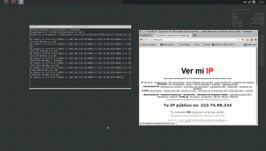](images/11-Comprobación-del-funcionamiento.png)

Como se puede ver en la captura de pantalla **la web de** [vermiip.es](http://www.vermiip.es/ "Averiguar IP Pública") **nos está indicando la IP del último servidor proxy de la lista que introducimos**. Además **como elegimos la opción de cadena estricta y vemos que la conexión se ha realizado** **podemos estar seguros que la totalidad de servidores proxy están funcionando adecuadamente**.

**En el caso que deseemos realizar una comprobación más detallada del correcto funcionamiento de proxychains podemos usar [Curl](http://curl.haxx.se/ "Web Curl")**. **Para poder usar curl primero tenemos que instarlo** en nuestro sistema operativo GNU Linux. Para ello abrimos una terminal e introducimos el comando el siguiente comando para instalar curl:

> ```
> sudo apt-get install curl
> ```

[](images/12-Instalación-de-Curl.png)

**Una vez instalado curl** ahora tan solo tenemos que empezar a usarlo. Para usarlo **en una terminal podemos escribir el siguiente comando**:

> ```
> proxychains curl moddle.org
> ```

###### Nota: Con el comando introducido lo que vamos a obtener es la ruta que sigue nuestra petición para conectarnos a la página web de [www.moddle.org](http://moddle.org/ "página moddle"). El resultado obtenido después de aplicar el comando será el siguiente:

[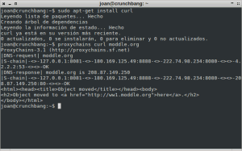](images/13-Curl-funcinando-con-DNS-Response.png)

Como se puede ver en la captura de pantalla el primer paso es realizar resolución DNS de la petición que hemos realizado. **Observamos que para realizar la petición DNS las etapas que se han seguido son**:

1. Nuestro servidor local **127.0.0.1** envía la petición a un servidor **180.168.124.49**.
2. El servidor **180.168.124.49** realiza la misma petición al servidor **222.74.98.234**.
3. Finalmente un servidor DNS con IP **4.2.2.2** hace la resolución DNS de nuestra petición. Concretamente tal y como se puede observar en la captura de pantalla la IP de la web [moddle.org](http://moddle.org/ "web Moddle") es la **208.87.149.250**.

###### Nota: El servidor DNS 4.2.2.2 corresponden a [Level 3 Communications](http://www.level3.com/ "Web de level3 communications") y son completamente ajenos a mi ordenador.

**Una vez realizada la resolución DNS ahora empezará la segunda etapa** **que será la de conectarnos al servidor web [moddle.org](http://moddle.org/)**. Si se observa la captura de pantalla vemos que **para establecer la conexión el camino será el siguiente:**

1. Nuestro servidor local **127.0.0.1** envía la petición a un servidor **180.168.124.49**.
2. El servidor **180.168.124.49** realiza la misma petición al servidor **222.74.98.234**.
3. Finalmente nos conectaremos al servidor moddle que tiene la IP **208.87.149.250**.

## USOS QUE PODEMOS DAR PROXYCHAINS

El uso principal que podemos dar a proxychains es el que acabamos de describir. No obstante existen muchos otros usos. Tan solo tienen que usar vuestra imaginación.

Solo para poner un ejemplo de lo que podemos hacer, simplemente tenéis que imaginar que nos conectamos a la deep web mediante el navegador de Tor. Pero que pasa en el caso que queramos usar [nmap](http://nmap.org/ "Web de nmap") u otra aplicación vía terminal a través de la red Tor?

Muchos de vosotros no sabrías como hacerlo pero con proxychains lo podríamos realizar fácilmente. Como he dicho anteriormente si hacéis el esfuerzo de pensar un poco os vendrán a la mente más utilidades.
