Hoy veremos como encontrar nuestro servidor en internet mediante un servicio de DNS dinamico. El motivo del post es que en las próximas semanas montaremos una serie de servidores en nuestra propia casa. El uso de los servidores que montaremos puede ser dentro de nuestra red local. ¿Pero que pasa si queremos acceder a nuestro servidor estando fuera de nuestra Red de área Local?<!--more-->

La respuesta es sencilla. En vez de usar nuestra IP privada tenemos que usar nuestra IP pública. Vamos a ver un ejemplo simple:

Imaginemos que tenemos un servidor SSH. Si nos queremos conectar a nuestro servidor SSH desde la red local. Simplemente tenemos que teclear el siguiente comando en la terminal:

> ```
> ssh -p 22 joan@192.168.1.188
> ```

[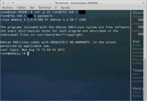](images/1-acceso-ssh-red-local.png)

Como se puede ver en la captura de la imagen la conexión se ha realizado sin ningún problema.

Ahora imaginemos que estamos de viaje y queremos acceder nuestro servidor SSH. Como he sido previsor antes de irme de casa he entrado en la página [http://www.vermiip.es/](http://www.vermiip.es/ "Web para saber la IP Pública") y he anotado que mi IP Pública que es **185.144.255.663**. Por lo tanto en el momento de acceder a mi servidor desde el hotel o cualquier otro sitio utilizare el siguiente comando en la terminal:

> ```
> ssh -p 22 joan@185.144.255.663
> ```

[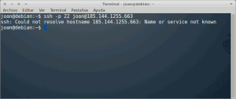](images/2-acceso-SSH-no-posible-por-IP-publica.png)

Como se puede ver en la captura de la imagen la conexión no se puede llevar a término la conexión y os preguntareis ¿Por Qué?

La respuestas es simple. La gran mayoría de ADSL contratadas disponen de IP Dinámica. Esto significa que cada cierto tiempo nuestra IP Pública irá cambiando. Por lo tanto antes de irnos de viaje nuestra IP era la **185.144.255.663** pero actualmente ya no lo es porqué ha cambiado. Y la verdad es que es imposible averiguar nuestra nueva la IP pública. Por lo tanto nos encontraremos fracasados ya que no podremos acceder a nuestro servidor SSH porqué simplemente no podemos conocer su IP.

###### Nota: Una solución poco elegante al problema seria conectarnos por control remoto con teamviewer a nuestro servidor y averiguar la ip que tenemos

En este post explicaremos como hallar la solución a este problema. Lo haremos mediante el servicio de DNS dinamico de NO-IP. Elijo este servicio por ser gratuito y porqué lleva muchísimos años funcionando y es difícil encontrar a alguien que hable algo malo de este servicio.

## COMO FUNCIONA EL SERVICIO DE REDIRECCIONAMIENTO DNS DINAMICO

Básicamente lo que hace un servicio de direccionamiento DNS dinamico es identificar la IP pública de nuestro servidor o PC con un nombre de dominio.

Esto tiene básicamente 2 ventajas:

1. La primera es que no tenemos que recordad cual es nuestra IP para conectarnos desde el exterior a nuestro servidor local. Tan solo tendremos que que recordar un nombre de dominio como podría ser por ejemplo **geekland.sytes.net**
2. La segunda gran ventaja es que el dominio **geekland.sytes.net** siempre estará asociado a nuestra IP Pública. Da igual que la IP Pública sea variable. En el momento que la IP pública del servidor cambie automáticamente el dominio se asociará a la nueva IP.

Así por ejemplo después de usar el servicio de redireccionamiento DNS dinamico seremos capaces de acceder a nuestro servidor mediante el siguiente comando:

> ```
> ssh -p 22 joan@geekland.sytes.net
> ```

###### Nota: En la parte final del tutorial veremos como efectivamente nos podemos conectar.

En el siguiente diagrama podemos ver el funcionamiento del redireccionamiento DNS dinamico:

[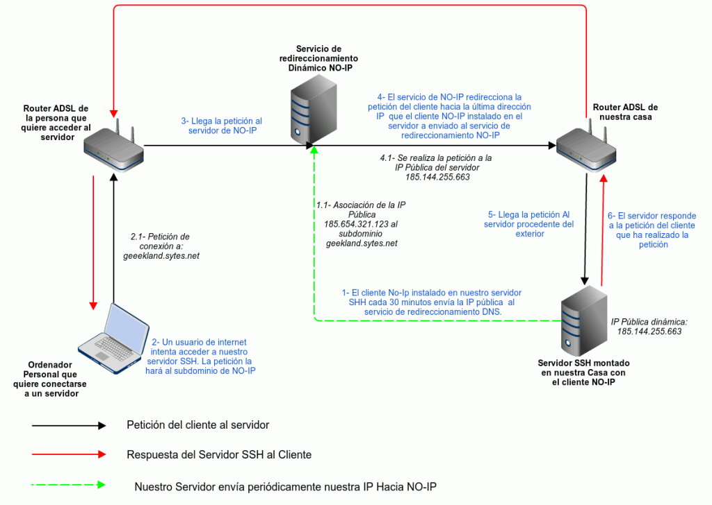](images/3-Funcionamiento-Servicio-direccionamiento-DNS.png) En el diagrama podemos observar los siguientes puntos:

1. Nuestro servidor tiene un cliente NO-IP instalado en su interior. La función del cliente NO-IP que está instalado en nuestro servidor es ir enviado cada cierto tiempo nuestra IP Pública hacia al servicio de DNS dinamico NO-IP. De esta forma nuestro dominio siempre estará asociado a nuestra IP Pública.
2. Un cliente, que podemos ser nosotros mismos, intenta conectarse a nuestro servidor SSH mediante nuestro dominio contratado en NO-IP (**geekland.sytes.net**). La forma de conectarse podría ser introduciendo **ssh -p 22 joan@geekland.sytes.net** en la terminal.
3. Como se puede ver en el esquema, la petición de conexión al servidor SSH llegará al servicio DNS dinamico de NO-IP.
4. Una vez ha llegado la petición lo que pasará es que el servicio DNS dinamico asociará el nombre de dominio con la última IP que el cliente NO-IP mencionado en el punto 1, le ha enviado.
5. El servidor SSH recibe la petición por parte del cliente a través del servicio DNS dinamico.
6. El servidor responde a la petición del cliente y se establece la conexión con el servidor SSH.

Para ver como podemos hacer todo esto tan solo tenemos que seguir adelante con el tutorial.

## COMO USAR EL SERVICIO DE REDIRECCIONAMIENTO DNS DINAMICO

### Darnos de alta al servicio DNS dinamico NO-IP

Lo primero que tenemos que hacer es darnos de alta al servicio de direccionamiento DNS dinamico y crearnos un subdominio. Por lo tanto abriremos el navegador y visitaremos la siguiente página web.

[http://www.noip.com/](http://www.noip.com/ "Web de NO-IP")

###### Nota: En el final del post se citan servicios DNS dinamico alternativos a NO-IP.

Como se puede en la captura de pantalla una vez dentro de la página de NO-IP apretamos el botón de **Sign Up Now**.

[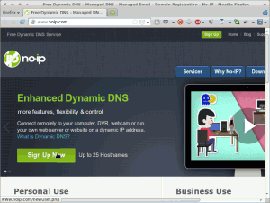](images/4-entrar-en-noip.png)

Seguidamente aparecerá el siguiente formulario para darnos de alta al servicio DNS dinamico:

 [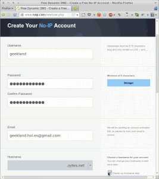](images/5-Formulario-cumplimentado.png)

 

 

 

 

 

Los pasos a seguir para rellenar el formulario son los siguientes:

1. Primeramente introducimos el nombre de usuario que nos servirá para identificarnos en la web de NO-IP.
2. Seguidamente tendremos que introducir una contraseña para poder acceder a la web y al servicio de DNS dinamico de NO-IP.
3. La tercera cosa que tenemos que hacer es volver a introducir nuestra contraseña para verificar que no nos hemos equivocado al escribir la contraseña.
4. A continuación pondremos nuestro correo electrónico para que nos envíen un correo electrónico de confirmación para poder activar el servicio DNS dinamico de NO-IP una vez nos hayamos dados de alta.
5. Finalmente, como se puede ver en la captura de pantalla, en el apartado hostname seleccionaremos la opción “**create my host later**”. Seguidamente apretaremos el botón **Sign Up** que encontrareis al final de la página.

Justo al apretar el botón aparecerá una imagen parecida a la siguiente:

[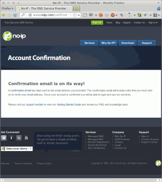](images/6-Confirmación-que-la-cuena-ha-sido-creada.png)

En estos instantes nuestra cuenta ya ha sido creada. El paso siguiente es activar nuestra cuenta. Para ello abrimos nuestro correo electrónico y veremos que nos ha llegado un correo de NO-IP.

[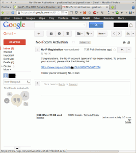](images/7-Activación-del-servicio.png)

Abrimos el correo. Una vez abierto, tal y como se puede ver en la captura de pantalla, tan solo tenemos que clicar al link que nos envían para poder activar la cuenta de DNS dinamico. Justo al clicar sobre el link se abrirá la siguiente pestaña en el navegador:

[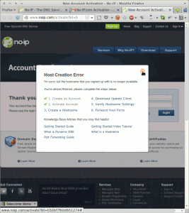](images/8-Activación-del-servicio-2.png)

Como se puede ver en la captura de pantalla nos aparecerá una advertencia de **Host Creation Error**. Esto es normal ya que en el momento de crear la cuenta hemos tildado la opción de crear nuestro dominio más tarde (**create my host later**). Cerramos la advertencia y pasamos a la creación del dominio o subdominio.

### Creación de un dominio

Tal y como se muestra en la captura de pantalla, una vez cerrada la advertencia, introducimos el mail y la contraseña que hemos usado para registrarnos a NO-IP.

[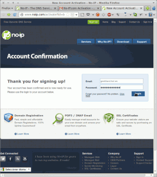](images/9-Entrando-en-NO-IP.png)

Una vez introducido el mail y la contraseña nos aparecerá un entorno gráfico parecido al siguiente:

[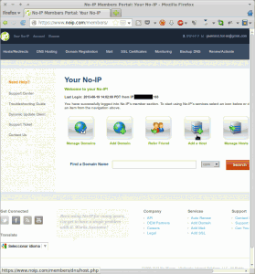](images/10-Presionar-el-botón-Add-a-host.png)

Para crear nuestro dominio, tal y como se puede ver en la captura de pantalla, tenemos que apretar al botón **Add a Host**. Una vez presionado el botón aparecerá la siguiente pantalla en el navegador:

[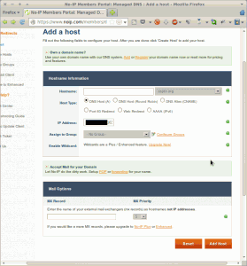](images/11-Pantalla-de-agregar-host.png)

En esta pantalla es donde tenemos que elegir nuestro subdominio. En mi caso las opciones elegidas son las siguientes:

[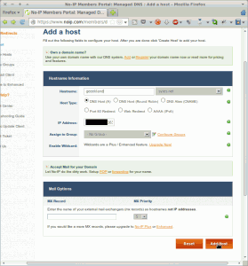](images/12-pantalla-de-agregar-host-cumplimentada.png)

Como se puede ver en la captura de pantalla el nombre de mi subdominio **geekland**.**sytes.net**.

###### Nota: Cuando entréis en el menú desplegable para seleccionar vuestro subdominio tenéis que tener en cuenta que el subdominio elegido sea gratuito. Los subdominio gratuitos aparecen en la parte final del desplegable.

Una vez cumplimentado este paso tan solo tenemos que presionar el botón **Add Host**. Una vez presionado aparecerá las siguiente pantalla. En esto momento ya hemos creado nuestro subdominio.

[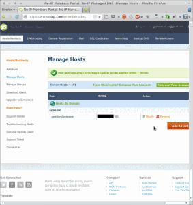](images/13-Host-Creado.png)

### Instalar el cliente NO-IP en nuestro servidor

Si habéis leído el post sabréis que alguien tiene que ir informando de nuestra IP pública al servicio de direccionamiento DNS dinamico. Este alguien puede ser nuestro Router o un cliente NO-IP instalado en nuestro ordenador o servidor.

Por lo tanto lo primero que vamos a realizar es comprobar si nuestro router puede realizar esta operación. Para ello abrimos el navegador y como se puede ver en la imagen introducimos nuestra puerta de entrada en el navegador que en mi caso es **192.168.1.1**.

[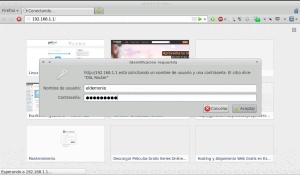](images/14-acediendo-al-router.png)

Seguidamente tendremos que entrar nuestro nombre de usuario y contraseña y podremos acceder a la configuración del Router. Una vez hemos accedido a la configuración del Router buscamos en el menú de nuestro router un apartado que ponga Dynamic DNS.

[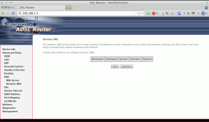](images/15-acceso-a-dynamic-dns.png)

Una vez encontrado el menú, como se puede ver en la captura de pantalla tenemos que apretar el botón **Add**. Una vez presionado el botón aparecerá la siguiente pantalla:

[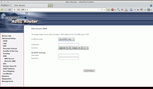](images/16-solo-2-servicios-disponibles.png)

Vemos que hay un campo que pone D-DNS Provider. Si seleccionamos el Menú desplegable veremos que solamente aparecen las opciones [DynDNS](http://dyn.com/dns/ "DynDNS") y [TZO](http://tzodns.com/ "Web TZO"). Por lo tanto nuestro Router puede refrescar la IP periódicamente al servicio DNS dinamico pero solo en los casos que hayamos contratado el servicio en [http://tzodns.com/](http://tzodns.com/ "Web Tzo") o en [http://dyn.com/dns/](http://dyn.com/dns/ "Web DynDNS")

Por lo tanto mi Router no está habilitado para funcionar con NO-IP. La solución a este problema es instalar en un cliente NO-IP que hará la misma función que podría realizar el router.

El primer paso a realizar para instalar el cliente NO-IP es acceder a la ubicación **/usr/local/src/**. Para ello abrimos una terminal y tecleamos:

> ```
> cd /usr/local/src/
> ```

Seguidamente descargaremos el cliente NO-IP que es quien periódicamente irá refrescando la IP de nuestro servicio DNS dinamico. Para descargarlo tenemos que teclear el siguiente comando en la terminal:

> ```
> sudo wget https://www.no-ip.com/client/linux/noip-duc-linux.tar.gz
> ```

Seguidamente descomprimimos el archivo que acabamos de descargar introduciendo el siguiente comando en la terminal:

> ```
> sudo tar xf noip-duc-linux.tar.gz
> ```

Una vez descomprimido el archivo entramos en la carpeta que acabamos de descomprimir. Para entrar en la carpeta tenemos que introducir el siguiente comando en la terminal:

> ```
> cd noip-2.1.9-1/
> ```

Seguidamente compilaremos e instalaremos el cliente NO-IP. Para ello en la terminal tecleamos el siguiente comando:

> ```
> sudo make install
> ```

Durante el proceso de instalación tendremos que contestar a una serie de preguntas.:

**Pregunta 1:** Primeramente tendremos que introducir el email que hemos usado para suscribirnos al servicio de NO-IP. En mi caso será **geekland.hol.es"arroba"gmail.com**.

**Pregunta 2**: Seguidamente tendremos que introducir la contraseña de NO-IP.

**Pregunta 3:** Tendremos que definir la periodicidad con que el cliente NO-IP envía nuestra IP Pública al servicio de direccionamiento DNS. La opción predefinida es cada 30 minutos. Lo voy a dejar tal cual.

**Pregunta 4:** Para finalizar la última pregunta es si después de alguna actualización/modificación de NO-IP requerimos ejecutar algún comando adicional como por ejemplo podría ser reiniciar apache, etc. En mi caso responderé que no.

Al finalizar todos estos pasos nuestro cliente NO-IP ya esta instalado y solamente nos falta ejecutarlo. En la siguiente imagen podréis ver los pasos que he ido siguiendo hasta el momento:

[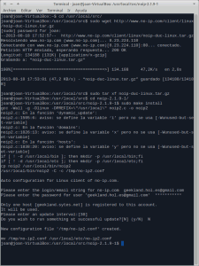](images/17-Detalle-de-la-instalación-de-NO-IPCliente-instalado.png)

Ahora tan solo nos falta ejecutar el cliente NO-IP. Para ejecutarlo tan solo tenemos que teclear el siguiente comando en la terminal:

> ```
> sudo /usr/local/bin/noip2
> ```

El cliente NO-IP en estos momento ya está activo.

Para confirmar que nuestro cliente está activo y que nuestro dominio resuelve nuestra IP, lo que podemos hacer es introducir el siguiente comando en la terminal:

> ```
> nslookup geekland.sytes.net
> ```

Si todo funciona adecuadamente deberíamos obtener un resultado parecido al siguiente:

[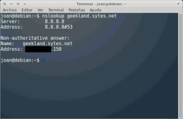](images/18-Respuesta-del-servicio-dinámico-DNS.png)

###### Nota: A priori el servicio funciona correctamente porqué como se puede ver en la imagen en el apartado address figura nuestra IP Pública.

Cada vez que arranquemos nuestro servidor tendremos que ejecutar el cliente de forma manual. En el caso que queramos que el cliente NO-IP arranque de forma automática cada vez que arrancamos nuestro sistema lo podemos realizar de la siguiente manera:

**Paso 1:** Tenemos que abrir un archivo de texto en nuestra ubicación Home. Dentro del archivo de Texto pegamos el siguiente script:

```
#! /bin/sh
# . /etc/rc.d/init.d/functions # uncomment/modify for your killproc
case "$1" in
 start)
 echo "Starting noip2."
 /usr/local/bin/noip2
 ;;
 stop)
 echo -n "Shutting down noip2."
 killall -TERM /usr/local/bin/noip2
 ;;
 *)
 echo "Usage: $0 {start|stop}"
 exit 1
esac
exit 0
```

Guardamos el archivo con el siguiente nombre:

**.noip.sh**

**Paso 2:** Abrimos una terminal y activamos el usuario root introduciendo el siguiente comando:

> ```
> sudo su
> ```

**Paso 3:** Ahora copiamos el archivo .noip.sh dentro de la ubicación **/etc/init.d/**. Para ello en la terminal tecleamos:

> ```
> cp /home/tuusuario/.noip.sh /etc/init.d/noip.sh
> ```

###### Nota: tusuario deberéis sustituirlo por vuestro nombre de usuario.

**Paso 4:** Seguidamente damos los permisos de ejecución necesarios al script que hemos generado. Para ello los comandos que tenemos que introducir en la terminal son:

> ```
> chmod +x /etc/init.d/noip.sh
> ```
> 
> ```
> chmod 0755 /etc/init.d/noip.sh
> ```

**Paso 5:** Finalmente para introducir NO-IP en el proceso de arranque de nuestra computadora tan solo tenemos que introducir el siguiente comando en la terminal:

> ```
> cd /etc/init.d/
> ```
> 
> ```
> update-rc.d noip.sh defaults
> ```

La próxima vez que arranquemos el ordenador, el cliente NO-IP arrancará automáticamente. Para quien quiera ver los pasos que he seguido les dejo la siguiente captura de pantalla:

[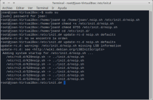](images/19-Detalle-de-los-pasos-para-configurar-el-arranque-aumático-noip.png)

**Paso 6:** En principio ahora el cliente de NO-IP debería arrancar de forma automática. En el caso que llegue el día que queremos eliminar el proceso de nuestro inicio tan solo tentemos que ejecutar los siguientes comandos en la terminal:

> ```
> sudo su
> ```
> 
> ```
> cd /etc/init.d/
> ```
> 
> ```
> update-rc.d -f noip.sh remove
> ```

###### Nota: El proceso descrito tiene que funcionar sin problemas en la totalidad de distros que derivan de Debian como por ejemplo Ubuntu, Linux Mint, Crunchbang, etc.

## OTROS COMANDO ÚTILES DEL CLIENTE NO-IP

Para cambiar la configuración del cliente de NO-IP podemos usar el siguiente comando:

> ```
> sudo /usr/local/bin/noip2 -C
> ```

Al ejecutar este comando nos volverá a preguntar nuestro usuario de NO-IP, la contraseña, la frecuencia de actualización y si queremos ejecutar algún tipo de script cuando haya una actualización. En el caso de añadir nuevos host es necesario aplicar este comando para que el cliente NO-IP se percate de los cambios.

Otro comando que nos puede ser útil para ver los clientes que actualmente tenemos en ejecución es el siguiente:

> ```
> sudo /usr/local/bin/noip2 -S
> ```

## COMPROBACIÓN QUE YA PODEMOS ACCEDER A NUESTRO SERVIDOR SSH

Ya para finalizar vamos a comprobar que todo lo que hemos realizado funciona perfectamente. Para ello intentaremos acceder al servidor SSH que tenemos en nuestra casa desde un hotel ubicado en cualquier parte del mundo.

Abrimos una terminal y tecleamos el siguiente comando para poder acceder a nuestro servidor SSH:

> ```
> ssh -p 22 joan@geekland.sytes.net
> ```

[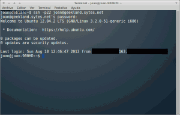](images/20-comprobación-del-fucnionamiento-de-NO-IP.png)

Tal y como se puede ver en la captura de pantalla hemos podido acceder al servidor usando nuestro subdominio creado en NO-IP. Por lo tanto la solución implementada funciona.

###### Nota: Para poder acceder a nuestro servidor desde el exterior tendremos que tener configurados nuestro Router y nuestro Firewall de forma apropiada.

## POSIBLES INCONVENIENTES QUE PUEDE TENER NO-IP

La verdad es que el servicio de NO-IP es excelente. Los únicos inconvenientes o pegas que le podemos encontrar pueden ser las siguientes:

1. En el peor de los casos con la configuración que hemos elegido en el post nuestro servidor puede estar ilocalizable durante 30 minutos. Esto podría suceder en el caso que el cliente NO-IP enviará la IP pública al servicio DNS dinamico y justo después de enviarla, la IP pública de nuestro servidor SSH cambiara. Por lo tanto nuestro servidor no volvería a estar localizable hasta que el cliente NO-IP a los 30 minutos volviera a enviar nuestra IP pública al servicio DNS dinámico de NO-IP. Si esto lo consideras un problema muy importante podéis bajar la frecuencia de actualización del cliente NO-IP de 30 minutos a 10 minutos por ejemplo.
2. Con una cuenta gratuita podremos generar hasta un máximo de 3 hosts. Si queremos disponer de más host deberemos pasar por caja.
3. Cada 30 días tendremos que renovar el servicio. Nos llegaran varios emails de advertencia informándonos que tenemos que actualizar el servicio. El único motivo para este inconveniente es hacer limpieza de hostnames que nunca se usan. Si queremos evitar esta molestia la solución es pasar por caja.

## ALTERNATIVAS A NO-IP

Para quien no le satisfaga el servicio de NO-IP les dejo el link de otras servicios similares:

1. [FreeDNS](http://freedns.afraid.org/ "FreeDNS") (Servicio Gratuito)
2. [EasyDNS](https://web.easydns.com/ "Easy DNS") (Servicio de Pago)
3. [ZoneEdit](http://www.zoneedit.com/ "ZoneEdit") (Servicio Gratuito)
4. [DuckDNS](https://www.duckdns.org/ "DNSPark") (Servicio Gratuito)
5. [NameCheap](http://www.namecheap.com/products/freedns.aspx "Namecheap") (Servicio Gratuito)
6. [ChangeIP](http://www.changeip.com/ "ChangeIP") (Servicio Gratuito)
7. [DynDNS](http://www.dyndns.com/ "DynDNS") (Servicio de Pago)
8. [DynDNS](http://dyndns.dk/ "DynDNS") (Servicio Gratuito)
9. [Dyns.cx](http://dyns.cx/ "Dyns") (Servicio Gratuito)
10. [Static Cling](http://www.staticcling.org/ "Static Cling") (Servicio Gratuito)

###### Nota: Los servicios que se mencionan no los he probado. Además las cuentas Free normalmente acostumbran estar sujetas a restricciones. Para más información podéis consultar las condiciones en las páginas web de cada uno de los servicios. Si googleais encontrareis otros servicios distintos a los mencionados.
