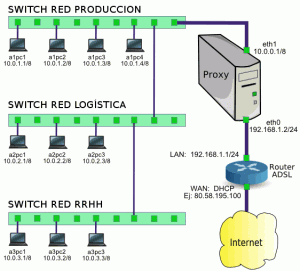
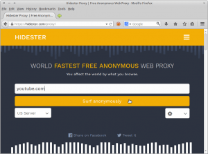
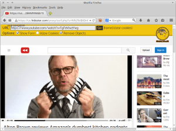
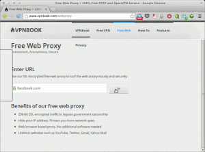
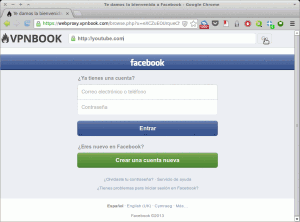
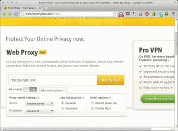
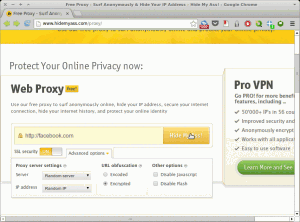
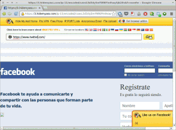
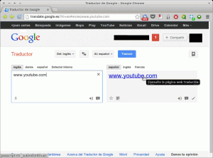
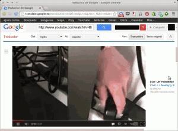

Al final de la lectura del post sabrán como entrar en paginas web restringidas en el entorno laboral. La verdad es que hoy en día en prácticamente la totalidad de empresas acostumbran a bloquear el acceso a determinadas páginas de Internet como por ejemplo nuestro correo personal, Facebook, Google +, Twitter, Youtube, etc.<!--more-->

## ¿POR QUÉ LAS EMPRESAS BLOQUEAN CIERTAS PAGINAS WEB?

El motivo principal por el cual estas páginas están restringidas es bastante simple. Estás páginas son consideradas ladrones de tiempo que hacen disminuir la productividad de los empleados y directivos considerablemente.

De hecho solo tenéis que navegar un poco por internet y encontraréis datos escalofriantes como por ejemplo puede ser los siguientes:

1. Un 26% de personas pierden entre una y dos horas horas diarias navegando por Internet.
2. Un 10% de la gente afirma que consulta su smartphone entre una y dos horas al día.
3. En general un 11% de las personas están en una y dos horas al día a las redes sociales mientras que el 75% de las personas dice estar más de dos horas.

Lógicamente los empresarios, frente a estos y a otros  datos que se pueden encontrar, acostumbran a tomar cartas en al asunto ya que todo el tiempo que nosotros perdamos obviamente repercutirá en su cuenta de resultados.

Por lo tanto normalmente los empresarios acostumbran a ponerse en contacto con su departamento de informática para tomar medidas. Las medidas típicas que se acostumbran a implementar son las siguientes.

###### Nota: En ciertos casos las empresas acostumbran a bloquear el acceso a ciertos servicios, como por ejemplo Dropbox, ya que desgraciadamente en algunos países tenemos un ancho de banda limitado.

## PROTECCIONES QUE SE ACOSTUMBRAN A IMPLEMENTAR EN LAS EMPRESAS

En la mayoría de empresas el sistema de protección que se implementa es el que se puede ver representado en la siguiente imagen:

Como se puede ver en la imagen, y como acostumbra a pasar en la mayoría de empresas, la totalidad de equipos disponen de ip fija y están interconectados entre si mediante switches.

Cuando un usuario de la red que acabamos de describir quiere acceder a internet, normalmente enviará la petición a un servidor proxy. Una vez el servidor proxy ha recibido la petición entonces analiza si la petición que realiza el usuario con una determinada IP cumple con los filtros que el administrador del sistema ha definido en el fichero de configuración del proxy.

Si la petición del usuario cumple con los filtros establecidos entonces el proxy trasladará nuestra petición al router de la empresa. En el caso de no cumplir con los filtros establecido nuestra conexión a internet quedará bloqueada y no nos podremos conectar a la página que queremos conectarnos.

Los filtros que el administrador del sistema introducirá en el fichero del servidor proxy son diversos. Una muestra del tipo de filtros que se pueden aplicar son los siguientes:

1. Todos los ordenadores tienen prohibido el acceso a Youtube excepto los ordenadores con una IP o con un determinado rango de IP.
2. Solo un determinado rango de usuarios o IP tienen acceso a internet.
3. Restringir el acceso a las url que contengan determinadas palabras como por ejemplo porn, sex, etc.

###### Nota: Solo pongo 3 ejemplos de reglas que se pueden crear en el servidor Proxy. La verdad es que se pueden generar otros tipos de reglas.

## PORQUÉ LAS MEDIDAS EMPRENDIDAS NO SIRVEN PARA NADA

Pienso que las medidas emprendidas no sirven prácticamente para nada. Quien quiera perder el tiempo en el trabajo simplemente lo hará de otras formas. Si una persona quiere estar pendiente de las redes sociales y de su mail personal lo puede hacer tranquilamente desde su teléfono móvil o tablet en el caso de peces gordos.

Lo ideal seria que no hubieses restricciones y que cada usuario pudiera gestionar su tiempo y reservando 2 o 3 momentos al día de una duración determinada para poder consultar las redes sociales y su correo personal, etc. Obviamente con un control para que los usuarios no abusen ya que en el trabajo se va a trabajar.

## MÉTODOS PARA PODER ENTRAR EN PAGINAS WEB RESTRINGIDAS

En el caso que algún usuario bajo su propia responsabilidad quiera consultar las redes sociales o tener acceso a webs restringidas por el informático de la empresa puede probar los siguientes métodos.

###### Nota: Existen multitud de métodos o de cosas a intentar para entrar en páginas web restringidas como por ejemplo conectarse directamente al router sin pasar por el proxy, intercambiarse la IP con un compañero que no tenga las mismas restricciones que las tuyas, etc. Pero en principio solo me limitaré a detallar 4 servicios/métodos que en principio considero que funcionan y son facilísimos de aplicar. A veces lo fácil es lo mejor.

### Entrar en páginas web restringidas mediante Hidester

Para usar Hidester tan solo tenemos que clicar encima del siguiente link:

[https://hidester.com/es/proxy/](https://hidester.com/es/proxy/ "Acceso al servicio Hidester")

Una vez clicado el link se abrirá el navegador y veréis una web similar a la siguiente:

Si queremos ver algún vídeo de youtube, tal y como se puede ver en la captura de pantalla, tan solo tenemos que teclear la URL de Youtube y presionar el botón **Navegar Anónimamente**. Una vez presionado el botón, tal y como se puede ver en la captura de pantalla, nos conectaremos a Youtube y podremos ver los vídeos que queramos:

Bajo mi punto de vista algunos de los puntos destacables de Hidester son los siguientes:

1. A día de hoy el servicio es totalmente libre de publicidad.
2. La velocidad que ofrece es aceptable. En mi caso puedo ver vídeos en streaming sin ningún tipo de problema.
3. La totalidad de tráfico generado entre el servidor web proxy y nuestro ordenador está cifrado. Por lo tanto a priori es un servicio seguro.
4. Te permite seleccionar entre servidores web proxy ubicados tanto en Europa como en Estados Unidos. Por lo tanto este webproxy también puede ser útil para acceder a servicios con restricción geográfica.
5. El servicio está disponible en varios idiomas.
6. Ofrecen servicios adicionales como por ejemplo informar sobre nuestra [dirección IP](https://hidester.com/es/cual-es-mi-direccion-ip/ "Saber nuestra dirección IP").

### Entrar en paginas web restringidas mediante VPNBook web proxy

Para acceder a este servicio tan solo tienen que entrar la siguiente url:

[http://www.vpnbook.com/webproxy](http://www.vpnbook.com/webproxy "vpnbook webproxy")

Una vez estamos en la página web de vpnbook veremos una página similar a la siguiente:

Como se puede ver en la captura de pantalla tan solo tenemos que ir a la celda entrar **Enter URL** e introducir el nombre de la página a la que nos queremos conectarnos. Una vez introducida clicamos a **Go** y como se puede ver en al siguiente captura de pantalla nos conectaremos a facebook:

Una vez en facebook si queremos conectarnos a Youtube tan solo tenemos que introducir la dirección de Youtube en el recuadro correspondiente ubicado en la parte superior de la pantalla y darle otra vez al botón de **Go**.

Los puntos que destacaría de VPNbook web proxy son los siguientes:

1. Prácticamente os podréis conectar a la totalidad de páginas web. Si alguna de las páginas web no funciona podéis probar con el servicio de hidemyass [http://www.hidemyass.com/proxy/](http://www.hidemyass.com/proxy/ "Hidemyass") y probablemente el problema se solucionará.
2. La conexión a las páginas es rápida.
3. El tráfico que se genera está cifrado. Por lo tanto el servicio aporta mayor seguridad en comparación con otros servicios.
4. Permite el acceso a páginas con cifrado SSL. Otras servicios similares como por ejemplo [http://anonymouse.org/](< http://anonymouse.org/> "Anonymouse") exigen el pago para acceder a páginas con cifrado SSL.

###### Nota: Al conectarse en determinados servicios os puede dar una advertencia de que alguien ha intentado acceder a vuestra cuenta desde una ubicación nueva. No os preocupéis ya que es normal porqué estamos accediendo a través de un webproxy. Si os pasa esto tan solo tenéis que seguir las instrucciones que os da la advertencia del servicio donde queráis acceder.

### Entrar en paginas web restringidas mediante Hidemyass

El servicio de hidemyass es muy similar al de vpnbook. Para acceder al servicio tan solo se tiene que acceder a la siguiente URL:

[http://www.hidemyass.com/proxy/](http://www.hidemyass.com/proxy/ "Hidemyass")

Una vez hemos hemos accedido a la página web veremos la siguiente pantalla:

El funcionamiento es exactamente igual al de **VPNBook**. Si queremos tan solo tenemos que introducir la URL que queremos visitar en el celda correspondiente y apretar el botón de **Hide my ass !**. Pero además Hidemyass ofrece una serie de configuraciones adicionales interesantes que vale la pena comentar:

Si observamos la captura de pantalla vemos que nos queremos conectar a facebook.com. También observamos que las opciones de configuración las hemos cambiado.

Para empezar podemos ver que hemos activado la celda **SSL Security**. El resultado de activar esta casilla sera que la totalidad del tráfico que generaremos estará cifrado.

También vemos que hemos cambiado el método de **ofuscación de URL a Encriptado**. De esta forma conseguiremos que a priori nadie pueda saber las páginas web que hemos visitado a través del servidor proxy web.

Una vez hayamos introducido la página y la configuración tan solo tenemos que clicar al botón **Hide my ass !** y tal y como se puede ver en la captura de la pantalla nos dirigiremos a facebook:

Una vez en Facebook si queremos conectarnos a Twitter tan solo tenemos que introducir la dirección de Twitter en el recuadro correspondiente ubicado en la parte superior de la pantalla y darle a **GO**.

Bajo mi criterio los puntos que hacen de hidemyass un servicio destacable son los siguientes:

1. Dispone de ofuscación URL lo que hace que sea difícil que alguien consiga averiguar a que páginas web nos hemos conectado.
2. El servicio nos permite conectarnos a páginas que disponen de cifrado SSL gratuitamente.
3. El servicio ofrece distintas opciones de configuración. Podemos disponer de ofuscación de URL, podemos elegir varios servidores proxy web ubicados en distintas ubicaciones geográficas y además, en el caso que lo consideremos oportuno,  permite deshabilitar el contenido flash y javascript de las páginas a las que nos conectamos.
4. Es una muy buena opción alternativa en el caso que el resto de métodos que se comentan en el post no funcionen.

### Entrar en páginas web restringidas mediante el traductor de google

Como cuarto y último método podemos elegir el traductor de google. Para acceder al traductor de google pueden acceder mediante la siguiente URL:

[http://translate.google.es/?hl=es#en/es/www.](http://translate.google.es/?hl=es#en/es/www. "Traductor de google")

Una vez cargado el traductor de google introducís una página web cualquiera tal y como me muestra en la siguiente captura de pantalla:

Una vez introducida la web apretáis el botón de traducir. Como resultado de la traducción obtendréis exactamente la misma web. Tal y como se puede ver en la captura de pantalla, el siguiente paso es dar clic encima del resultado que nos ha dado la traducción. Veremos que después de dar click encima del resultado de la traducción accederemos a la página web que está restringida. En mi caso en la siguiente captura de imagen podéis ver que estoy viendo tranquilamente un vídeo en Youtube:

Particularmente considero que este método es destacable porqué en principio google es un proveedor fiable que no intentará robarnos datos sensibles como contraseñas u otro tipo de datos. Además si el informático de nuestro empresa se dedica a consultar las páginas web a la que nos hemos conectado en principio solo debería ver que nos hemos conectado al traductor de google.

### Otros servicios alternativos distintos para poder acceder a páginas web restringidas

A priori con los servicios descritos hasta el momento tenéis que tener más que suficiente. No obstante quien aun requiera de más servicios pueden consultar los siguientes:

[http://youtubeproxy.org/](http://youtubeproxy.org/ "youtubeproxy") [http://www.polysolve.com/](http://www.polysolve.com/ "polysolve") [http://www.unblock-websense.com/](http://www.unblock-websense.com/ "unblock-websense") [http://www.vpntunnel.net/](http://www.unblock-websense.com/ "unblock-websense") [http://www.safeforwork.net/](http://www.safeforwork.net/ "safeforwork") [http://www.pimpmyip.com/](http://www.pimpmyip.com/ "pimpmyip") [http://www.ninjacloak.com/](http://www.ninjacloak.com/ "ninjacloak") [http://www.24topproxy.com/](http://www.24topproxy.com/ "24topproxy") [http://www.sneakzorz.com/](http://www.sneakzorz.com/ "sneakzorz") [http://www.proxybutton.com/](http://www.proxybutton.com/ "proxybutton") [http://www.wtunnel.net/](http://www.wtunnel.net/ "wtunnel") [http://www.ztunnel.org/](http://www.ztunnel.org/ "ztunnel") [http://anonymouse.org/](http://anonymouse.org/ "anonymouse") [http://proxyweb.com.es/](http://proxyweb.com.es/ "Proxyweb")

La totalidad de servicios que se citan en este apartado básicamente servirán en el caso que el departamento informático haya restringido el acceso a los 3 servicios que hemos mencionado inicialmente.

###### Nota: La totalidad de métodos descritos en este post se basan en saltarse las restricciones de conexión a internet mediante la conexión a través de un proxy web. Para quien quiera saber que es un proxy web y como funciona puede consultar el siguiente enlace:

[https://geekland.eu/conectarse-a-un-servidor-proxy/]()

## ADVERTENCIAS

Cada persona es responsable de sus propios actos. Como bien saben en todas las empresas existen reglas y si no se cumplen se os pueden aplicar penalizaciones que pueden llegar hasta el despido. Además el hecho de conectarse a un servidor proxy que no sea de confianza puede traernos serios problemas. Si nos conectamos a un servidor que no sea fiable nos pueden intentar robar nuestras contraseñas, inyectarnos código malicioso dentro de nuestro ordenador, etc.
