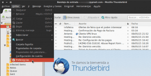
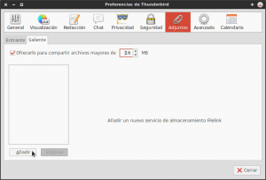
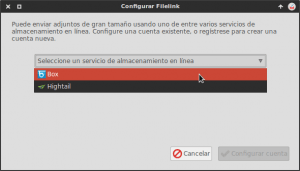
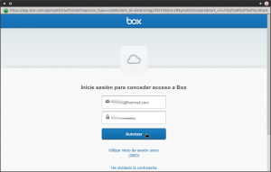
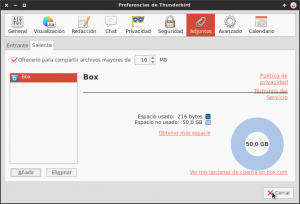
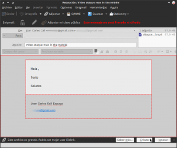
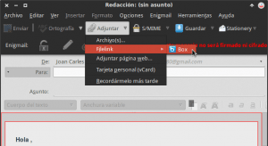
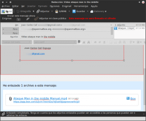
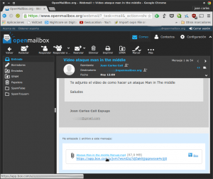
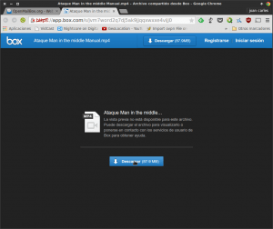

En entornos laborales y familiares es típica la situación en la que queremos enviar un mail con uno o varios archivos adjuntos que ocupan tamaño grande. Muchas veces esto representa un problema ya que la mayoría de servidores de correo electrónico no permiten adjuntar archivos superiores a un determinado tamaño.<!--more-->

Para solucionar este problema muchas personas acostumbran a acudir a servicios de terceros como Mega, Wetransfer, Google Drive, etc. Pero según mi forma de ver la mejor forma de solucionar este problema para la totalidad de usuarios del gestor de correo Thunderbird es la que mostraremos en este post.

###### Nota: Los usuarios de hotmail y de gmail a través de su página web, tienen opciones muy interesantes para enviar archivos de gran tamaño. Disponen de la posibilidad de enviar archivos a través de Google Drive y de Skydrive.

## ¿QUÉ NECESITAMOS PARA ENVIAR ARCHIVOS DE GRAN TAMAÑO POR EMAIL?

Para seguir las instrucciones que se mencionan en este post, únicamente necesitamos disponer de las siguientes herramientas:

1. **El gestor de correo electrónico Thunderbird** instalado y configurado en nuestro ordenador.
2. **Una cuenta de Box o una cuenta de Hightail**. En el caso de que no dispongáis de ninguna cuenta podéis haceros una de forma muy fácil accediendo a los siguientes enlaces:

[Enlace](https://app.box.com/signup/personal) para crear una cuenta de Box

[Enlace](https://es.hightail.com/join?rid=si-19) para crear una cuenta de Hightail

## PROCEDIMIENTO QUE USA THUNDERBIRD PARA ENVIAR ARCHIVOS DE GRAN TAMAÑO POR EMAIL

El procedimiento que usa Thunderbird para enviar archivos de gran tamaño es simple. Cuando intentamos adjuntar un archivo que tiene un tamaño superior al que nosotros podemos especificar, nos preguntará si queremos usar Filelink para enviar este archivo.

Si respondemos que sí, el archivo se subirá a Box, Hightail u un tercer servicio en la nube. En el momento que el archivo acabe de subir aparecerá un enlace en nuestro mail que permitirá a los receptores del email descargarse el archivo.

## CONFIGURAR THUNDERBIRD PARA ENVIAR ARCHIVOS DE GRAN TAMAÑO

Lo primero que haremos para configurar nuestro gestor de correo es abrir Thundebrird. Una vez abierto, tal y como se puede ver en la captura de pantalla, tenemos que **acceder al menú** **Herramientas** y seguidamente **seleccionar la opción** **Preferencias**:

Una vez dentro del menú de preferencias tendremos que **clicar encima del icono** **Adjuntos**. Una vez hayamos clicado sobre el botón aparecerá la siguiente ventana:

En esta ventana lo primero que tenemos que realizar **es clicar la opción** **Ofrecerlos para compartir archivos mayores de**. Seguidamente tendremos que **seleccionar el número de MB a partir del cual Thunderbird nos ofrecerá la posibilidad de usar Box o Higtail para enviar nuestros archivos**. En mi caso, tal y como se puede ver en la captura de pantalla, he seleccionado **16 MB**.

El siguiente pasó es **presionar el botón** **Añadir**. Al presionar el botón añadir aparecerá una ventana en la que tendremos que **seleccionar la nube que queremos usar para realizar el envío de archivos** que tengan un tamaño superior a **16** MB.

Tal y como se puede ver en la captura de pantalla, **en mi caso he seleccionado la nube de Box**.

###### Nota: En mi caso he preferido usar la nube de Box. El único motivo por el cual he decido usar Box es porqué de forma gratuita ofrece 10GB de espacio a sus clientes, mientras que Hightail solo ofrece 2GB. Además por determinadas circunstancias yo dispongo de 50GB de espacio de almacenamiento en box.

Una vez seleccionada la opción hay que **presionar sobre el botón** **Configurar cuenta**. Al presionar el botón aparecerá la siguiente ventana:

En esta ventana, tal y como se puede ver en la captura de pantalla, tenemos que **introducir el usuario y contraseña de nuestra cuenta de Box**. Una vez hayamos introducido estos datos hay que **presionar encima del botón** **Autorizar**. Seguidamente aparecerá otra ventana en la que tendremos que **presionar encima del botón** **Conceder acceso a Box**. En estos momentos el procedimiento ha terminado y les aparecerá una ventana parecida a la siguiente:

## ENVIAR ARCHIVOS DE GRAN TAMAÑO CON THUNDERBIRD

Imaginemos que tengo que enviar un vídeo a un compañero que ocupa aproximadamente 100 MB. Obviamente es imposible adjuntar este vídeo en un correo electrónico ya que su tamaño es demasiado grande.

No obstante si tenemos nuestro gestor de Thunderbird configurado tal y como hemos mostrado en el apartado anterior, tan solo tenemos que **añadir el vídeo dentro de nuestro correo**. Como el tamaño del vídeo es superior a 16MB, tal y como se puede ver en la captura de pantalla, **nuestro gestor de correo electrónico nos preguntará si queremos usar Filelink para enviar el archivo.**

Tal y como se puede ver en la captura de pantalla, como queremos usar Filelink **presionamos encima del botón** **Enlazar**. En el momento de presionar el botón **Enlazar**, el vídeo que queremos enviar empezará a subir a la nube de box.

###### Nota: En el caso que quisiéramos enviar un archivo inferior a 16MB con este método, tal y como se puede ver en la captura de pantalla, tan solo tendríamos que presionar sobre el triangulito pequeño del botón Adjuntar. Seguidamente seleccionaríamos la opción Filelink y a posteriori tendríamos que clicar sobre la nube que queremos usar para realizar el envío, que en mi caso es Box. Al clicar sobre la nube se abrirá nuestro gestor de archivos para que podamos seleccionar el archivo que queremos enviar.

En el momento que el archivo sea completamente cargado a la nube, tal y como se puede ver en la captura de pantalla, en el parte inferior del mail aparecerá un enlace para que el receptor del mail pueda descargarse el vídeo que le queremos enviar.

**En estos momentos ya podemos enviar el mail de forma habitual presionando encima del botón** **Enviar**.

## INSTRUCCIONES PARA QUE EL RECEPTOR DEL EMAIL PUEDA DESCARGAR LOS ARCHIVOS

Una vez el receptor reciba nuestro email verá algo parecido a la siguiente captura de pantalla:

Tal y como se puede ver en la captura de pantalla, para poder descargar y visualizar el vídeo, hay que **clicar encima del link de box que está en la parte inferior del email**. Una vez presionado el link se abrirá la siguiente pestaña en el navegador de Internet:

Una vez abierta la pestaña, tal y como se puede ver en la captura de pantalla, para descargar el vídeo tan solo hace falta **presionar encima del botón Descargar**. Una vez hayamos presionado encima del botón se descargará el vídeo que nos han enviado.

## OPCIONES ALTERNATIVAS A BOX Y A HIGHTAIL

Thunderbird ha llegado a acuerdos con Box y hightail para que los usuarios puedan usar su servicio de nube para poder enviar archivos de tamaño grande. No obstante si a nosotros no nos convence ni Box no Hightail, **podemos usar otros servicios de nube alternativos. Los servicios de nube alternativos que podemos usar son los siguientes**:

**[Dropbox](https://www.dropbox.com/es/)**: Si queremos podemos usar la nube de Dropbox para realizar el envío de archivos. Para ello se deberá instalar la extensión de Thunderbird que encontrarán en el siguiente [enlace](https://addons.mozilla.org/es/thunderbird/addon/dropbox-for-filelink/). **[hubiC](http://www.ovhtelecom.fr/hubiC/)**: Si queremos usar la nube francesa hubiC deberemos instalar la extensión de Thunderbird que encontrarán en el siguiente [enlace](https://addons.mozilla.org/es/thunderbird/addon/hubic-for-filelink/). Okeanos: Si queremos usar la nube de Okeanos deberemos instalar la extensión de Thunderbird que encontrarán en el siguiente enlace. **DL for Thunderbird**: Si no queremos depender de servicios de terceros, como por ejemplo Dropbox, podemos montarnos nuestro propio [servidor DL](http://www.thregr.org/~wavexx/software/dl/README.html). Una vez instalado el servidor tendremos que instalar la extensión de Thunderbird que encontraremos en el siguiente [enlace](https://addons.mozilla.org/es/thunderbird/addon/dl-for-thunderbird/). **WebDAV for Filelink**: Instalando la extensión WebDAV for Filelink del siguiente [enlace](https://addons.mozilla.org/es/thunderbird/addon/webdav-for-filelink/), seremos capaces de usar cualquier servidor WebDAV para poder realizar nuestros envíos. Por lo tanto podremos usar Owncloud tranquilamente para enviar nuestros archivos más pesados.

###### Nota: Si quieren ver otros servicios alternativos a los citados en este apartado pueden consultar el siguiente [enlace](https://support.mozilla.org/es/kb/filelink-para-adjuntos-grandes#w_p-lquae-servicios-de-almacenamiento-admite-thunderbird).

## VENTAJAS DEL MÉTODO USADO FRENTE A OTRAS ALTERNATIVAS

Obviamente existen muchas formas para enviar archivos que ocupen un tamaño grande. No obstante la opción presentada en es post la considero sumamente interesante por los siguiente motivos:

1. **Los links de descarga de los archivos enviados siempre estarán activos**. Otros servicios alternativos como por ejemplo Wetransfer (Cuenta Free) los links solamente están activos durante 7 días.
2. Es muy práctico ya que **podemos enviar el archivo que queramos sin tener abrir el navegador ni salir de nuestro gestor de correo electrónico**. El método es prácticamente el mismo que adjuntar un archivo.
3. Si los servicios de Box o Hightail no nos satisfacen, o no confiamos en ellos, es posible usar otros servicios de nube alternativos. Incluso si nos preocupa enormemente la privacidad, podemos **usar estensiones DL for Thunderbird o WebDAV for Filelink**, que **nos permitiran usar nuestro propio servidor para poder realizar el envío de los archivos**.

## INCONVENIENTES Y PUNTOS DE MEJORA

A pesar de que el método es práctico dispone de limitaciones. Las limitaciones y puntos de mejora que veo son los siguientes:

1. **Usando Box o HighTail solo podremos compartir archivos que tengan un tamaño igual o inferior a 250MB**. Si queremos enviar archivos con un tamaño superior a 250MB deberemos mejorar las cuentas de hightail o box. En el caso de tener este problema siempre podríamos usar otros servicios de nube como por ejemplo Dropbox, u otros que nos permite subir archivos de hasta 10 GB.
2. Cualquier persona que reciba nuestro email será capaz de descargar el archivo. Por lo tanto **no estaría demás que tuviéramos la opción de proteger la descarga de nuestros archivos mediante una contraseña**.
