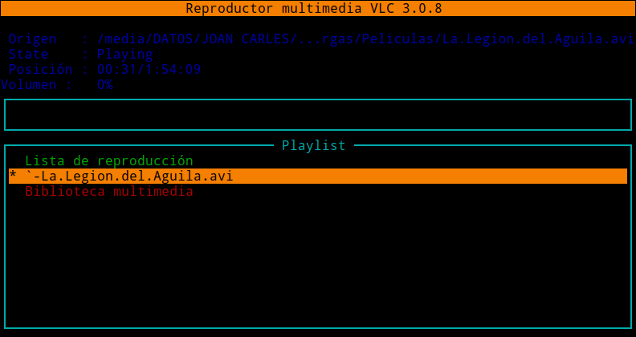
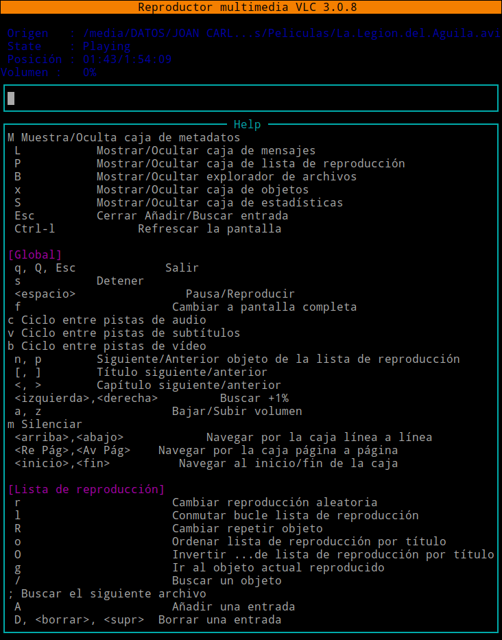
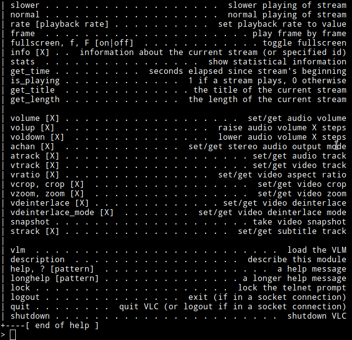
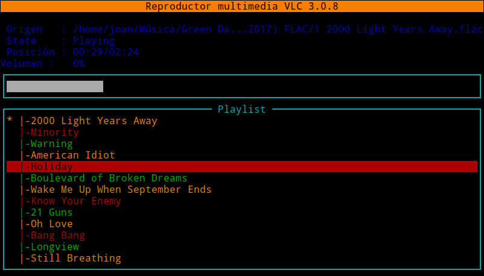
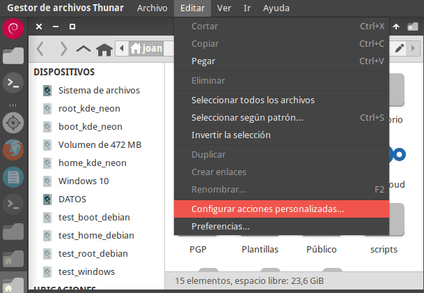
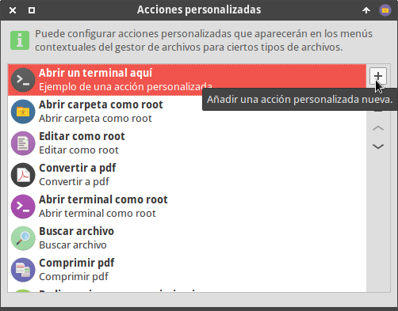
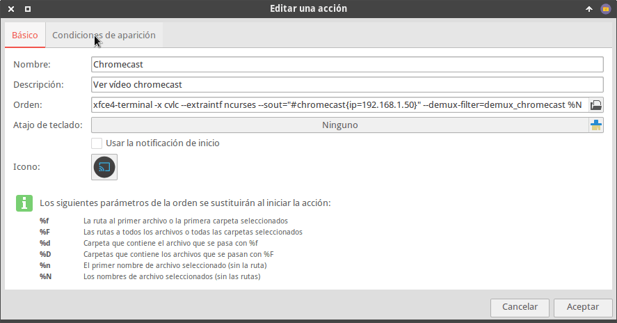
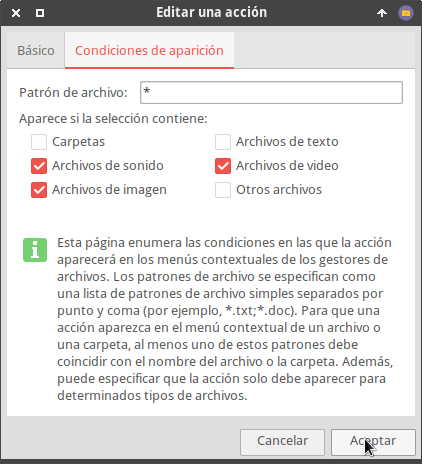
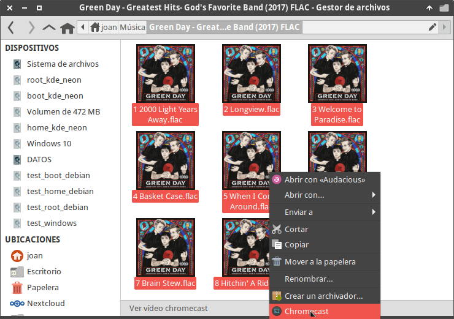
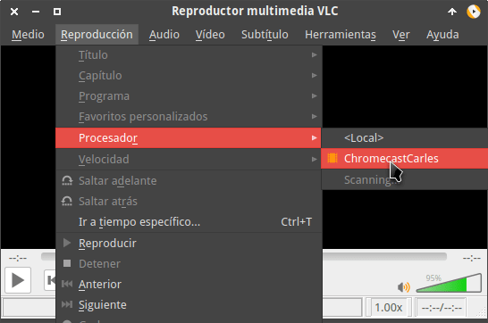

Navegando por la red encontrarán diversos programas para enviar vídeos al Chromecast desde la terminal de Linux. Algunas de las opciones disponibles son:<!--more-->

1. Mkchromecast
2. CastNow

Bajo mi punto de vista estás aplicaciones tienen el inconveniente que no son fáciles de instalar, hay veces que su funcionamiento no es correcto y en ocasiones el mantenimiento de la aplicación no es adecuado. Si quieren una opción sencilla, fiable, funcional y multiplataforma les recomiendo usar VLC.

## ENVIAR VÍDEOS AL CHROMECAST CON LA TERMINAL LINUX Y VLC

A continuación veremos los pasos a realizar para poder reproducir cualquier vídeo, imágen o sonido desde la terminal de Linux a nuestro Chromecast.

### Instalar el reproductor de vídeo VLC

Obviamente el primer paso es tener instalado VLC. Para instalar VLC en Linux tan solo tienen que ejecutar el siguiente comando:

> ```
> sudo apt install vlc
> ```

**Nota:** VLC está disponible en la totalidad de distribuciones Linux. Es mantenido y es estable. Si no usáis el gestor de paquetes apt deberéis reemplazar apt por la sintaxis correspondiente.

Si usan Windows tan solo tienen que descargar el ejecutable de la siguiente [página web](https://www.videolan.org/vlc/) e instalarlo.

### Ver un vídeo de youtube en el chromecast usando la terminal

Una vez finalizada la instalación abrimos una terminal y ejecutamos un comando del siguiente tipo:

> ```
> cvlc --sout="#chromecast{ip=ip_chromecast}" --demux-filter=demux_chromecast contenido_que_queremos_reproducir
> ```

En mi caso la ip del Chromecast es la `192.168.1.50`. El contenido que quiero reproducir es un vídeo de youtube que tiene la siguiente `https://www.youtube.com/watch?v=CDQVTCMNN74`. Por lo tanto ejecutaré el siguiente comando:

> ```
> cvlc --sout="#chromecast{ip=192.168.1.50}" --demux-filter=demux_chromecast https://www.youtube.com/watch?v=CDQVTCMNN74
> ```

Acto seguido empezará a reproducirse el vídeo de youtube en el televisor o dispositivo donde tengamos el Chromecast funcionando.

**Nota:** Pueden averiguar la IP del Chromecast con nmap o accediendo a la configuración de su router. Es conveniente que mediante el servidor DHCP del router asignen siempre la misma IP a su Chromecast.

### Ver un vídeo, escuchar audios o ver imágenes con el Chromecast controlando su reproducción desde la terminal

Con el método visto en el apartado anterior no podréis controlar la reproducción del vídeo, no podréis seleccionar las diferentes pistas de audio y vídeo, etc.

Si queréis controlar la reproducción del vídeo, sonido o imágenes desde la terminal deberéis usar interfaces gráficas en modo terminal como [rc o ncurses](https://wiki.videolan.org/Console/). En mi caso uso ncurses porque a priori la considero más amigable.

**Para ver una película** almacenada en nuestro ordenador **usando ncurses** ejecutaremos el siguiente comando en la terminal:

> ```
> cvlc --extraintf ncurses --sout="#chromecast{ip=192.168.1.50}" --demux-filter=demux_chromecast '/media/joan/DATOS/JOAN CARLES/Descargas/Peliculas/La.Legion.del.Aguila.avi'
> ```

Acto seguido se iniciará la reproducción del vídeo y veremos la siguiente interfaz gráfica:

[](images/reproduciendo-video-con-ncurses.png)

Una vez se inicie el vídeo podrán controlar su reproducción mediante atajos de teclado. Para conocer la funcionalidad de cada uno de los atajos de teclado tan solo tienen que presionar la tecla h. Justo después verán lo que realiza cada uno de los atajos.

[](images/atajos-de-teclado-ncurses.png)

Si no les gusta ncurses **también pueden usar rc**. Para ello tan solo deberán usar un comando del siguiente tipo:

> ```
> cvlc --intf rc --sout="#chromecast{ip=192.168.1.50}" --demux-filter=demux_chromecast '/media/joan/DATOS/JOAN CARLES/Descargas/Peliculas/La.Legion.del.Aguila.avi'
> ```

Una vez iniciado el vídeo podrán controlar su reproducción mediante comandos. Para conocer los comandos disponibles escriban help y presionen la tecla Enter. Acto seguido verán los comandos a usar para controlar la reproducción del vídeo:

[](images/comandos-rc-controlar-reproduccion-video.png)

### Agregar más de un elemento y crear una lista de reproducción

Si lo que pretenden es poder reproducir de forma cómoda una lista de reproducción lo pueden hacer del siguiente modo:

> ```
> cvlc --extraintf ncurses --sout="#chromecast{ip=192.168.1.50}" --demux-filter=demux_chromecast /home/joan/Música/Green\ Day\ -\ Greatest\ Hits-\ God\'s\ Favorite\ Band\ \(2017\)\ FLAC/*.flac
> ```

Acto seguido mediante los cursores y la tecla Enter podrán seleccionar el audio, vídeo o imágen que quieren ver o escuchar.

[](images/crear-lista-de-reproduccion.png)

**Nota:** Si quieren pueden añadir una por una cada una de las canciones o vídeos. O añadirlos todos de golpe con la opción \*.\*. Además de la misma forma que añadimos sonidos también podemos añadir fotos o vídeos.

### Realizar una acción personalizada con Thunar para enviar vídeos al Chromecast

Lanzar vídeos desde la terminal al Chromecast tiene varias ventajas. Por ejemplo podemos generar scripts o alias para lanzar nuestros vídeos de forma más práctica, ver vídeos en el televisor que tenemos almacenados en nuestra Raspberry Pi, etc. Otra de las opciones que tienen los usuarios de XFCE es crear una acción personalizada en Thunar. De este modo con un par de clics podremos lanzar vídeos desde nuestro gestor de archivos al televisor.

Para realizar la acción personalizada en Thunar tan solo tienen que seguir las siguientes instrucciones. Inicialmente abren Thunar y acceden a la configuración de acciones personalizadas:

[](images/configurar-accion-personalizada.png)

Acto seguido clican en la opción de añadir una nueva acción personalizada.

[](images/añadir-nueva-accion-personalizada.png)

A continuación tendréis que aplicar la siguiente configuración para generar la acción personalizada:

[](images/configurar-accion-personalizada-enviar-videos-chromecast.png)

**Nota:** El punto más importante de la configuración es que en el campo Orden figure el siguiente contenido:

> ```
> xfce4-terminal -x cvlc --extraintf ncurses --sout="#chromecast{ip=192.168.1.50}" --demux-filter=demux_chromecast %N
> ```

Seguidamente clicaremos sobre la pestaña Condiciones de aparición, tildaremos las siguientes opciones y presionaremos el botón Aceptar.

[](images/configurar-condiciones-aparicion-accion-personalizada.png)

En estos momentos la acción personalizada está configurada. Para ver si funciona seleccionen un grupo de canciones que quieran reproducir. Presionen el botón derecho del ratón y cuando aparezca el menú contextual cliquen sobre la entrada que hace referencia al Chromecast.

[](images/enviar-videos-al-chromecast-con-accion-personalizada.png)

Si todo funciona de forma adecuada empezará a reproducirse el contenido. Además aparecerá una terminal desde la que podremos controlar la reproducción del contenido.

[](images/crear-lista-de-reproduccion.png)

## ENVIAR VÍDEOS AL CHROMECAST USANDO LA INTERFAZ GRÁFICA DE VLC

Si no les gusta la terminal también pueden usar la interfaz gráfica de VLC para lanzar vídeos y audios a su Chromecast. Para ello tan solo tienen que seguir los siguientes pasos:

1. Abrir VLC
2. Empezar a reproducir el vídeo o sonido que quieren ver.
3. Acceder dentro del menú Reproducción.
4. Dentro del menú reproducción posicionan el puntero del ratón encima del de la opción Procesador.
5. Cuando se despliegue el submenú verán que hay una entrada con el nombre de su Chromecast. Cliquen sobre esta entrada.

[](images/ver-medios-de-reproduccion.png)

De esta forma tan sencilla empezará la reproducción en el dispositivo que tengan enchufado al Chromecast.
