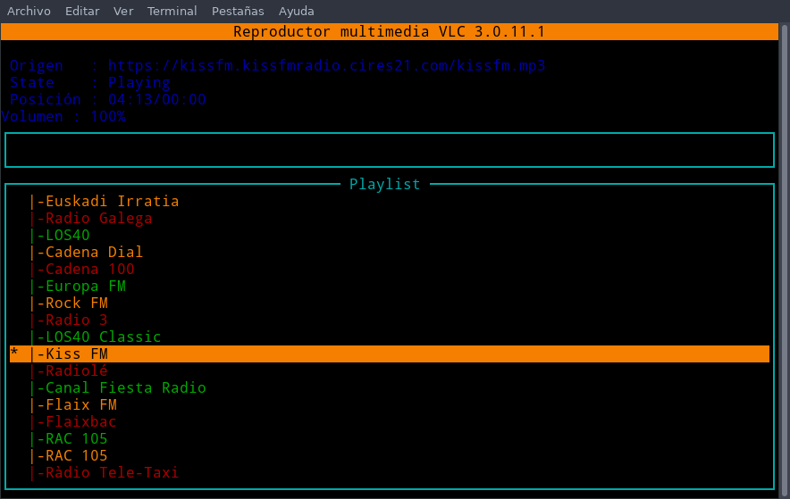
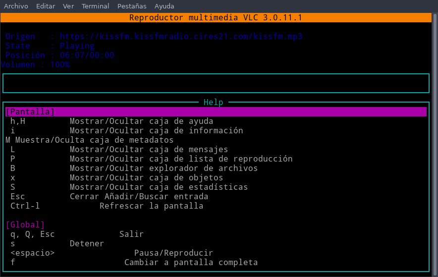

Si queréis una solución simple para escuchar la radio en Linux desde la terminal y que además consuma pocos recursos pueden usar el script de bash que creo Julio Serrano o realizar uno vosotros mismos de forma muy sencilla. Los script de bash que verán hacen uso de mpv o vlc para reproducir cualquier emisora de radio desde la terminal.<!--more-->

## INSTALAR MPV Y/O VLC PARA REPRODUCIR LA RADIO EN STREAMING

Para que las emisoras puedan reproducirse correctamente tenemos que tener instalado VLC y/o MPV. Para probar los script les recomiendo instalar los 2 reproductores ejecutando el siguiente comando:

> ```shell
> joan@debian:~$ sudo apt install mpv vlc
> ```

## ESCUCHAR LA RADIO EN LINUX DESDE LA TERMINAL MEDIANTE UN SCRIPT DE BASH

Las instrucciones para descargar y reproducir las radios en streaming mediante un script de bash en la terminal son las siguientes.

### Descargar el script de bash para escuchar la radio en la terminal

Para que el script funcione es importante que lo descarguemos en nuestra `home`. Para ello ejecuten el siguiente comando en la terminal:

> ```shell
> joan@debian:~$ cd
> ```

A continuación descargamos el script de github ejecutando el siguiente comando en la terminal:

> ```shell
> joan@debian:~$ git clone https://github.com/mhyst/radio
> ```

### Configurar las emisoras que podremos escuchar en nuestra radio

Seguidamente accederemos dentro del directorio que contiene el script para escuchar la radio desde la terminal. Para ello ejecutaremos el siguiente comando:

> ```shell
> joan@debian:~$ cd radio
> ```

A continuación daremos permisos de ejecución al script ejecutando el siguiente comando:

> ```shell
> joan@debian:~/radio$ chmod +x radio
> ```

Ahora si listamos el contenido del directorio `` `**~/radio**` `` veremos que contiene los ficheros `radio` y `radio.conf`:

> ```shell
> joan@debian:~/radio$ ls
> radio  radio.conf
> ```

- El fichero **radio** contiene el código para poder reproducir las emisoras de radio.
- El fichero **radio.conf** contiene las emisoras que estarán disponibles para poder escuchar.

Por lo tanto para tener más emisoras disponibles editaremos el fichero `radio.conf` ejecutando el siguiente comando en la terminal:

> ```shell
> joan@debian:~/radio$ nano radio.conf
> ```

Cuando se abra el editor de textos nano borren todo su contenido y peguen el siguiente:

> ```shell
> COPE|http://net2.cope.stream.flumotion.com/cope/net2.mp3.m3u
> RNE|http://rne.rtveradio.cires21.com/rne/mp3/icecast.audio
> RNE3|http://radio3.rtveradio.cires21.com/radio3.mp3
> RNE5|http://radio5.rtveradio.cires21.com/radio5/mp3/icecast.audio
> RNE Exterior|http://radioexterior.rtveradio.cires21.com/radioexterior/mp3/icecast.audio
> RNE Clásica|http://radioclasica.rtveradio.cires21.com/radioclasica/mp3/icecast.audio
> Euskadi|http://mp3-eitb.stream.flumotion.com/eitb/radioeuskadi.mp3
> RACC1|https://streaming.rac1.cat/;stream.nsv
> RAC105|https://streaming.rac105.cat/;stream.nsv
> CADENASER|http://19983.live.streamtheworld.com/CADENASER.mp3
> 40PRINCIPALES|http://19993.live.streamtheworld.com/LOS40.mp3
> KISS FM|https://kissfm.kissfmradio.cires21.com/kissfm.mp3
> RADIO FLAIXBAC|https://nodo02-cloud01.streaming-pro.com:8005/flaixbac.mp3
> CADENA 100|https://cadena100-cope-rrcast.flumotion.com/cope/cadena100-low.mp3
> ROCKFM|http://rockfm.cope.stream.flumotion.com/cope/rockfm.mp3.m3u
> ABSOLUTE CHILLOUT|https://edge3.peta.live365.net/b05055_128mp3
> CATALUNYA RADIO|https://shoutcast.ccma.cat/ccma/catalunyaradioHD.mp3
> CATALUNYA INFORMACIO|https://shoutcast.ccma.cat/ccma/catalunyainformacioHD.mp3
> FLAIX FM|https://flaixfm.streaming-pro.com:8003/flaixfm.aacp
> SER|https://20853.live.streamtheworld.com/CADENASERAAC.aac
> ```

**Nota**: Pueden añadir tantas emisoras como quieran. Para añadir más emisoras tan solo tienen que escribir el `nombre de la emisora` seguido del símbolo `|` y a continuación la `URL que nos permitirá escuchar la radio en streaming`.

Para obtener nuevas URL para escuchar nuevas emisoras de radio tan solo tienen que seguir las instrucciones que se muestran en el siguiente enlace:

https://geekland.eu/obtener-la-url-para-escuchar-radio-en-streaming/

### Empezar a escuchar la radio desde la terminal en Linux

Una vez añadidas todas las emisoras tan solo tenemos que ejecutar el script. Justo al ejecutarse se nos preguntará que seleccionemos la emisora que queremos escuchar. En nuestro caso seleccionamos la `16` y presionamos la tecla ENTER. Acto seguido empezará a reproducirse la emisora que hayamos seleccionado.

> ```shell
> joan@debian:~/radio$ bash radio
> tv version 3.0.0 - Copyleft (GPL v3) Julio Serrano 2019
> Ver televisión de España en streaming.
> 
> Estaciones de RADIO
> ------------------------
> 0) COPE
> 1) RNE
> 2) RNE3
> 3) RNE5
> 4) RNE Exterior
> 5) RNE Clásica
> 6) Euskadi
> 7) RACC1
> 8) RAC105
> 9) CADENASER
> 10) 40PRINCIPALES
> 11) KISS FM
> 12) RADIO FLAIXBAC
> 13) CADENA 100
> 14) ROCKFM
> 15) ABSOLUTE CHILLOUT
> 16) CATALUNYA RADIO
> 17) CATALUNYA INFORMACIO
> 18) FLAIX FM
> 19) SER
> 
> Seleccione la estación:
> 16
> 
> Ha elegido el canal CATALUNYA RADIO
> Reproduciendo
> joan@debian:~/radio$  (+) Audio --aid=1 (mp3 2ch 44100Hz)
> File tags:
>  icy-title: 
> AO: [pulse] 44100Hz stereo 2ch float
> ```

Para parar la reproducción de la emisora tan solo tendremos que ejecutar el comando:

> ```shell
> joan@debian:~/radio$ killall mpv
> ```

## ESCUCHAR LA RADIO EN LINUX DESDE LA TERMINAL MEDIANTE UNA LISTA DE REPRODUCCIÓN M3U

Otra forma mucho más sencilla de escuchar la radio en Linux es mediante VLC y una lista de reproducción .m3u que podemos descargar de Internet. La forma para hacer lo que acabo de mencionar es la siguiente.

### Crear el script para reproducir el audio en la terminal

Creamos el directorio que almacenará el script. Para ello ejecutamos el siguiente comando en la terminal:

> ```shell
> joan@debian:~$ mkdir radio2
> ```

A continuación entramos dentro del directorio que acabamos de crear y generaremos el fichero que almacenará el script. Para ello ejecutamos los siguientes comandos en la terminal:

> ```shell
> joan@debian:~$ cd radio2
> joan@debian:~/radio2$ nano radio2
> ```

Cuando se abra el editor de textos nano pegamos el siguiente código:

> ```shell
> #!/bin/bash
> curl https://www.tdtchannels.com/lists/radio.m3u > radio.m3u
> cvlc --extraintf ncurses radio.m3u
> ```

**Nota:** El script hace uso de vlc. Por lo tanto tienen que tener VLC instalado en su equipo.

Acto seguido guardamos los cambios, cerramos el fichero y damos permisos de ejecución al script mediante el siguiente comando:

> ```shell
> joan@debian:~/radio2$ chmod +x radio2
> ```

### Usar el script que acabamos de crear para escuchar la radio

Ahora ejecutaremos el script mediante el siguiente comando:

> ```shell
> joan@debian:~/radio2$ bash radio2
> ```

Una vez ejecutado se abrirá una interfaz gráfica vía terminal para seleccionar y escuchar la radio que prefieran:

[](images/escuchar-radio-en-streaming-desde-VLC.png)

Si presionan la tecla `h` obtendrán los atajos de teclado para poder usar el reproductor vía terminal. Podrán cambiar de emisora, buscar emisoras, etc.

[](images/atajos-de-teclado-de-vlc-ncurses.png)

## CONCLUSIONES

Acaban de ver que escuchar la radio desde la terminal de Linux es simple, cómodo y práctico. Además podremos reproducir la radio sin tener que usar programas pesados y nadie podrá capturar nuestros datos y tráfico para construir perfiles de navegación.
