Hace aproximadamente un mes redacte un post en el que comentaba que era un tunel SSH y los usos más habituales que nosotros como usuarios comunes podemos darle. Ahora que conocemos que es y para que sirve un tunel SSH pasaremos a ver como hacer un tunel SSH. Antes de ver como se realiza el tunel es interesante que deis un vistazo al siguiente post para tener los conceptos claros:

[https://geeklandlinux.github.io/posts/que-es-y-para-que-sirve-un-tunel-ssh/]()

<!--more-->Una vez leído el post nos imaginamos la siguiente situación. **Estamos conectados y navegando por Internet en una cafetería y tenemos miedo que alguien que esté conectado en la misma red que nosotros pueda realizarnos un ataque**, como por ejemplo un [Man in the middle](http://es.wikipedia.org/wiki/Ataque_Man-in-the-middle "Descripción de un ataque man in the middle"), para poder obtener datos confidenciales como por ejemplo podrían ser contraseñas, datos bancarios, etc.

**Para minimizar el riesgo en esta situación crearemos un tunel SSH para que la totalidad del tráfico entrante y saliente que generamos dentro de la red local viaje de forma cifrada por el interior del tunel**. De este modo nadie de nuestra red local podrá husmear donde nos estamos conectando en realidad ni robarnos información confidencial. Para ello tenemos que seguir los siguientes pasos:

## DISPONER DE UN SERVIDOR SSH

El servidor SSH lo podemos montar nosotros mismos tranquilamente en nuestra casa. Imaginemos que tenemos un servidor conectado las 24 horas o un ordenador que no le damos ningún uso. Si este es el caso lo encendemos.

Lo primero que tenemos que hacer es **asegurar que nuestro ordenador dispone de un servidor SSH instalado**. En la gran mayoría de distros de Linux el servidor SSH se instala por defecto al instalar el sistema operativo. En el caso que nuestra distro linux no tuviera un [servidor SSH](http://es.wikipedia.org/wiki/Secure_Shell "Explicación de SSH") instalado tan solo tendríamos que abrir una terminal y ejecutar los siguientes comandos:

> ```
> sudo apt-get install openssh-server openssh-client
> ```

[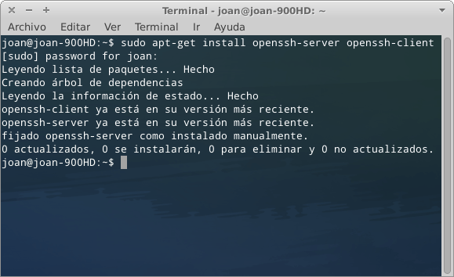](images/1-instalacion-del-servidor-ssh.png)

###### Nota: Es necesario que tanto la parte del servidor como la parte del cliente tengan instalados los 2 paquetes que se acaban de mencionar. En caso contrario no podremos establecer el tunel.

**Una vez instalado el servidor será plenamente funcional**. En principio podríamos entrar dentro del archivo de configuración del servidor para modificar ciertos parámetros introduciendo el siguiente comando en la terminal:

> ```
> sudo gedit /etc/ssh/sshd_config
> ```

El objetivo de modificar ciertos parámetros es hacer más seguro nuestro servidor contra posibles ataques o accesos no deseados. No obstante el hecho de securizar el servidor SSH lo dejaremos para futuros post. La configuración estandard funcionará adecuadamente para el fin que nosotros necesitamos.

## DISPONER DE UN SERVICIO DNS DINÁMICO O UNA IP FIJA

**Una vez instalado el servidor SSH tenemos que hacer que nuestro servidor SSH sea accesible desde el exterior**. En el caso que nuestro servidor no sea accesible desde el exterior nosotros no podríamos crear el tunel SSH desde la cafetería hasta el servidor SSH que tenemos en nuestra casa.

**Si disponemos de una conexión de Internet con IP Fija**, cosa que es poco probable, **tan solo tenemos que averiguar nuestra IP Pública**. Para ello accedemos a la siguiente página web:

[http://www.vermiip.es/](http://www.vermiip.es/ "Averiguar IP Pública")

[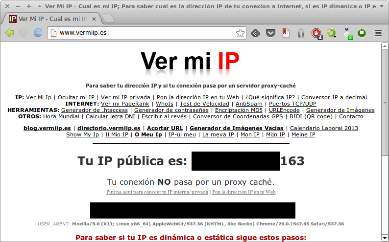](images/2-IP-Publica.png)

Como se puede ver en la captura de pantalla aparecerá nuestra IP Pública y al disponer de un servicio de IP Fija siempre tendremos la misma IP. Desafortunadamente la mayoría de ISP acostumbran a ofrecer sus productos básicos con IP Dinámica.

**En el caso de disponer de una IP Dinámica** para encontrar nuestro servidor SSH **tendremos que usar un servicio DNS Dinámico** tal y como se explica en el siguiente post:

[https://geeklandlinux.github.io/posts/encontrar-servidor-con-dns-dinamico/]()

## REDIRECCIONAR LA PETICIÓN DEL ROUTER AL SERVIDOR SSH

Una vez conocemos nuestra IP Pública o una vez tengamos configurado el servicio dinámico DNS, entonces **tenemos que entrar en la configuración del router y redirigir las peticiones de nuestra IP pública o dominio DNS a la IP interna del servidor SSH**.

**Para ello primero tenemos que conocer la IP interna que tiene nuestro servidor SSH**. Para conocer la IP interna del servidor SSH abrimos una terminal y tecleamos el comando:

> ```
> sudo ifconfig
> ```

El resultado obtenido es el siguiente:

[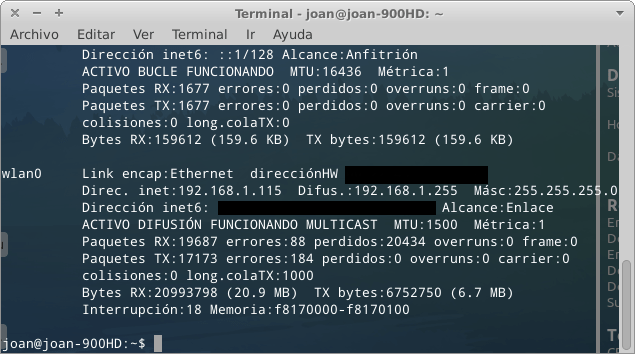](images/3-ip-interna.png)

Como se puede ver en la captura de pantalla la IP interna de nuestro servidor SSH es la 192.168.1.115.

###### Nota: En este paso tenéis que aseguraros que la IP interna de vuestro servidor sea Fija.

**Una vez conocemos la IP interna del servidor SSH accedemos a la configuración del Router abriendo el navegador e introduciendo nuestra puerta de entrada**. Una vez introducida la puerta de entrada, que acostumbra a ser 192.168.1.1, tal y como podemos ver en la captura de pantalla tendremos que introducir nuestro nombre de usuario y contraseña:

[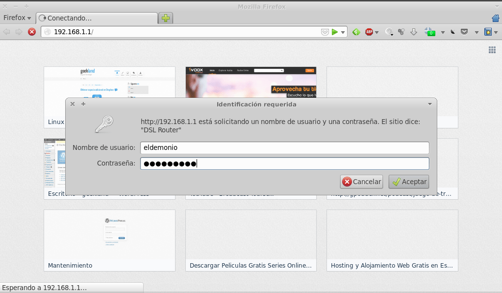](images/4-Accediendo-al-router.png)

Una vez hemos accedido a la configuración del Router **buscamos en el menú de nuestro router un apartado que ponga Virtual Servers**. En mi router como se puede ver en la captura de pantalla se halla en **Advanced Setup / NAT / Virtual Servers**:

[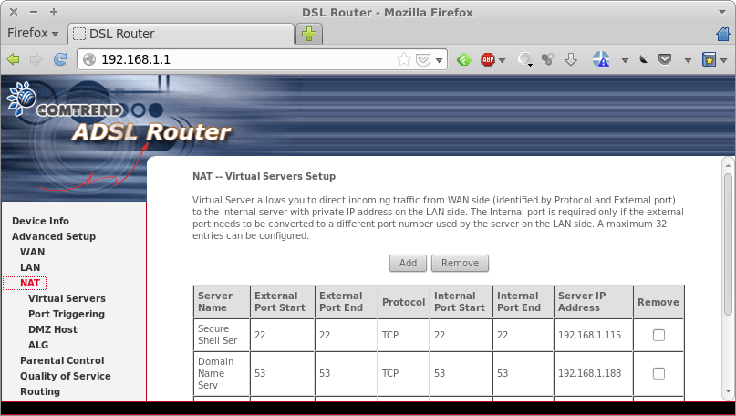](images/5-Nat-virtual-servers.png)

**Una vez dentro de Virtual Servers** **presionamos el botón Add** para añadir nuestro servidor SSH. Una vez presionado el botón Add aparecerá la siguiente pantalla:

[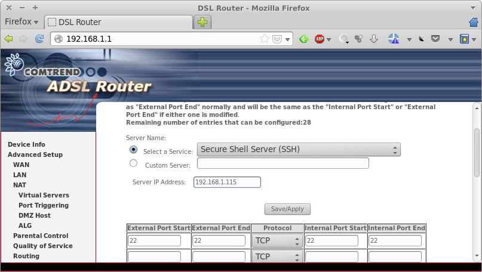](images/6-Configuracion-router-servidor-ssh.png)

Como se puede ver en la captura de pantalla **en Server IP Address tendremos que indicar la IP interna de nuestro servidor SSH**.

**En seleccionar servicio elegimos la opción Secure Sheell Server (SSH)**. Al seleccionar esta opción la configuración de los protocoles y puertos se realizará automáticamente. Como se puede ver en la captura de pantalla el servicio SSH funciona mediante el protocolo TCP y el puerto 22.

###### Nota: En el caso que hagáis modificado el puerto estandard de funcionamiento del servidor SSH tendréis que sustituir el puerto 22 por el que habéis elegido.

Una vez realizados los pasos tan solo tenemos que **apretar el botón Save/Apply**.

## CONFIGURAR EL FIREWALL PARA QUE PERMITA CONEXIONES ENTRANTES POR EL PUERTO 22

**En el caso que nuestro servidor SSH disponga de un firewall tendremos que asegurar que permita conexiones entrantes y salientes por el puerto 22, o por el puerto que hayamos elegido en nuestro servidor SSH.**

Si el proceso lo vais a realizar con gufw pueden consultar al siguiente post para hacer que nuestro servidor permita las conexiones entrantes por el puerto 22.

[https://geeklandlinux.github.io/posts/configurar-el-firewall-gufw/]()

En el caso que prefieran hacerlo directamente con iptables tan solo tienen que usar las siguientes reglas para permitir el trafico entrante y saliente por el puerto 22 en nuestro servidor:

> ```
> iptables -A INPUT -i eth0 -p tcp --dport 22 -m state --state NEW,ESTABLISHED -j ACCEPT
> ```
> 
> ```
> iptables -A OUTPUT -o eth0 -p tcp --sport 22 -m state --state ESTABLISHED -j ACCEPT
> ```

###### Nota: La introducción de las reglas que acabo de mencionar esta permitiendo al totalidad de tráfico y saliente por el puerto 22. Está no es la forma más segura de configurar nuestro servidor. En futuros post se abordará el tema de como securizar un servidor SSH.

## ESTABLECER EL TUNEL SSH

###### Nota: Antes de iniciar el proceso tenemos que asegurarnos que nuestro ordenador (cliente) tenga los paquetes necesarios para poder poder establecer el tunel. Por lo tanto lo primero que tenéis que hacer es asegurar que tenéis instalado el paquete openssh-client.

Una vez realizados todos los pasos correctamente ya podemos establecer el tunel SSH. Por la tanto una vez estamos conectados a la red local de la cafetería abriremos una terminal e introduciremos el siguiente comando:

> ```
> ssh -p 22 -N -D 8081 joan@geekland.sytes.net
> ```

[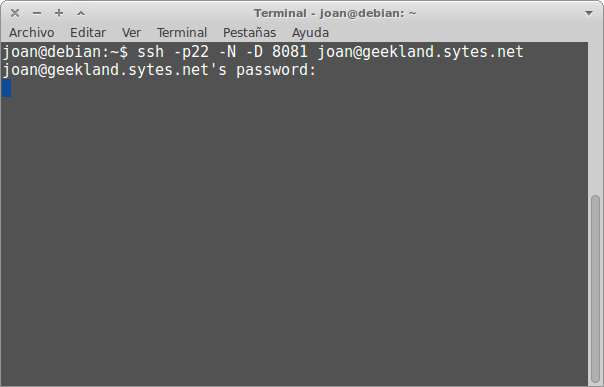](images/7-Conectando-con-el-servidor.png)

Una vez introducido el comando en la terminal nos pedirá la contraseña de la cuenta de usuario del servidor SSH. Una vez introducida la contraseña el tunel se establecerá. Ahora tan solo tenemos que mantener la terminal abierta y sin cerrarla.

El significado de los términos introducidos en la terminal para establecer el tunel SSH es el siguiente:

**\-p 22:** Con este parámetro indicamos el **puerto de escucha de nuestros servidor SSH**. El puerto de escucha estándard acostumbra a ser el 22 para los servidores SSH. En el caso que hayamos modificado el puerto de escucha deberemos sustituir el 22 por nuestro puerto real de escucha.

**\-D 8081:** **Estamos especificando que se realice un reenvio dinámico de puertos o tunel dinámico**. Por lo tanto con este comando estamos indicando que el tunel SSH se establezca a través del puerto local 8081. En el puerto 8081 habrá un servidor proxy socks que escuchará las conexiones del puerto 8081. Cuando el servidor proxy socks detecte una solicitud o conexión en el puerto 8081 enviará el tráfico cifrado a través del tunel SSH que creamos entre la cafetería y nuestra casa. Una vez la petición/información llegue a nuestra casa o servidor SSH, como hemos establecido un tunel dinámico, se redirigirá al sitio de Internet que queremos conectarnos que por ejemplo podría ser [Facebook](https://www.facebook.com/ "Facebook") o [Twitter](https://twitter.com/ "Twitter").

###### Nota: Estamos usando el puerto 8081 pero se puede usar cualquiera de los puertos no privilegiado que van desde el 1025 al 65535. En el caso de querer usar un puerto privilegiado deberemos hacerlo como root añadiendo sudo al inicio comando para establecer el tunel SSH.

###### Nota: El servidor local Proxy Socks es quien realmente está enviando el trafico de nuestro ordenador al servidor SSH que está en una red local segura. Por lo tanto la información que reciba el servidor proxy socks a través del cliente, que en este caso es Firefox, debe enviarse con el protocolo Socks. Por lo tanto los clientes como Firefox u otros deberán ser capaces de enviar sus peticiones a través del protocolo socks. En el caso que la aplicación no soporte la comunicación con el protocolo socks no se podrá establecer la conexión. Para aplicaciones que no soporten socks tenemos la opción de usar tsocks en nuestro ordenador. En futuros post comentaremos como usar tsocks.

**\-N:** **Permite que se establezca el tunel SSH pero que no se abra una sesión interactiva con el servidor SSH**. En el caso de no usar esta opción, nuestra conexión SSH estará permanentemente abierta y si alguien nos robará el ordenador o nos despistaros y alguien malintencionado tuviera acceso al ordenador nos podría por ejemplo borrar completamente la información que tenemos almacenada en nuestro servidor SSH.

**joan:** Es simplemente **la cuenta de usuario del servidor SSH**.

**geekland.sytes.net:** Simplemente **es el dominio de nuestro servicio dinámico DNS el cual apunta a la IP Pública del servidor SSH**. En el caso de tener IP Fija en vez del dominio tendréis que introducir vuestra IP Pública.

## CONFIGURAR EL NAVEGADOR PARA QUE FUNCIONE ADECUADAMENTE

A estas alturas el tunel ya se ha establecido. Ahora **el siguiente paso es configurar cada una de las aplicaciones que queremos que funcionen a través del tunel SSH**. En este caso nosotros vamos a usar el navegador Firefox.

**Para conseguir que Firefox funcione a través de un proxy socks** y la totalidad de tráfico generado y recibido se envíe a través del tunel SSH **lo vamos a realizar a través de una extensión que se llama [FoxyProxy](https://addons.mozilla.org/es/firefox/addon/foxyproxy-standard/ "Addon Foxyproxy")**.

###### Nota: En el caso que uséis Chrome o Chromium solo comentar que también existe Foxyproxy. Para Chrome o Chromium existe una alternativa similar a Foxyproxy que se llama [Proxy Switchy](https://chrome.google.com/webstore/detail/proxy-switchy/caehdcpeofiiigpdhbabniblemipncjj "Introducción de proxy Switchy"). Con Proxy Switchy el procedimiento es muy similar a FoxyProxy.

El primer paso que haremos es **abrir el navegador Firefox**. Tal y como podemos ver en la captura de pantalla accedemos al menú de **Complementos**:

[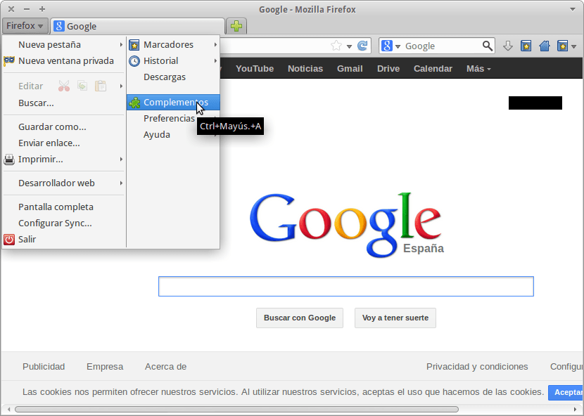](images/8-Instalar-Complementos-Firefox.png)

Una vez estamos dentro del menú de complementos **nos ubicamos encima del cuadro de búsqueda del extremos superior derecho y escribimos Foxy Proxy**. Seguidamente presionamos Enter:

[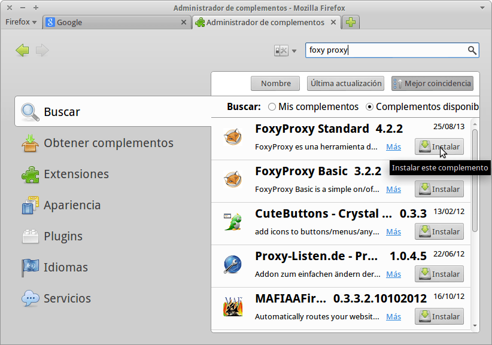](images/9-Instalar-Foxy-Proxy.png)

Como se puede ver en la captura de pantalla una vez terminada la búsqueda tan solo tenemos que **presionar el botón de Instalar y seguidamente reiniciaremos el navegador**. Una vez reiniciado el navegador veremos que aparece el icono que selecciono con el puntero del mouse en la captura de pantalla:

[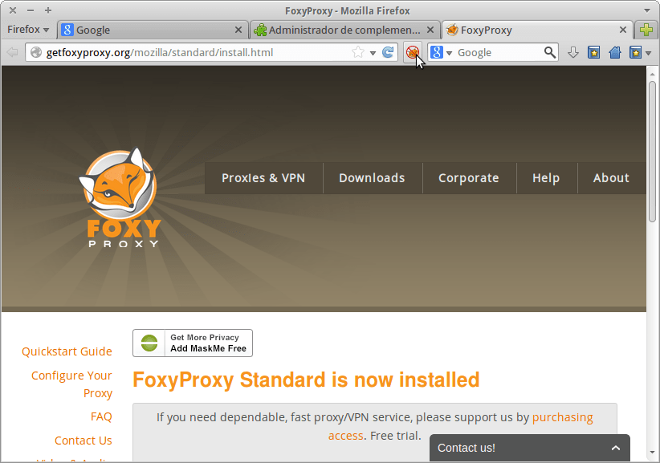](images/10-Icono-de-Foxy-Proxy.png)

**Presionamos el botón de FoxyProxy con el botón izquierdo del mouse**. Una vez presionado el botón aparecerá la siguiente pantalla:

[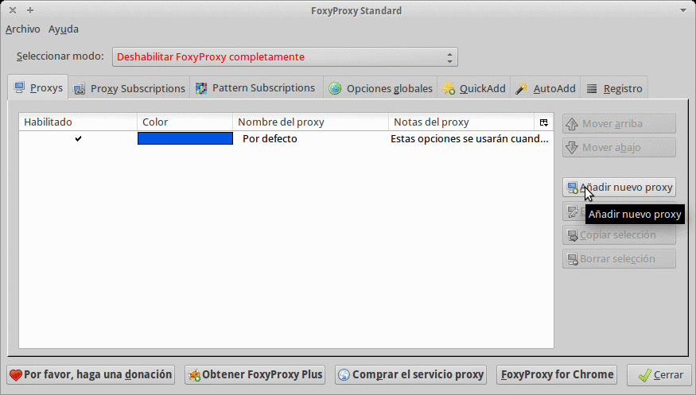](images/11-Configurar-Foxyproxy.png)

Como se puede ver en la captura de pantalla anterior **apretamos el botón de Añadir nuevo Proxy**. Una vez presionado el botón aparecerá la siguiente pantalla que es donde vamos a configurar Firefox:

[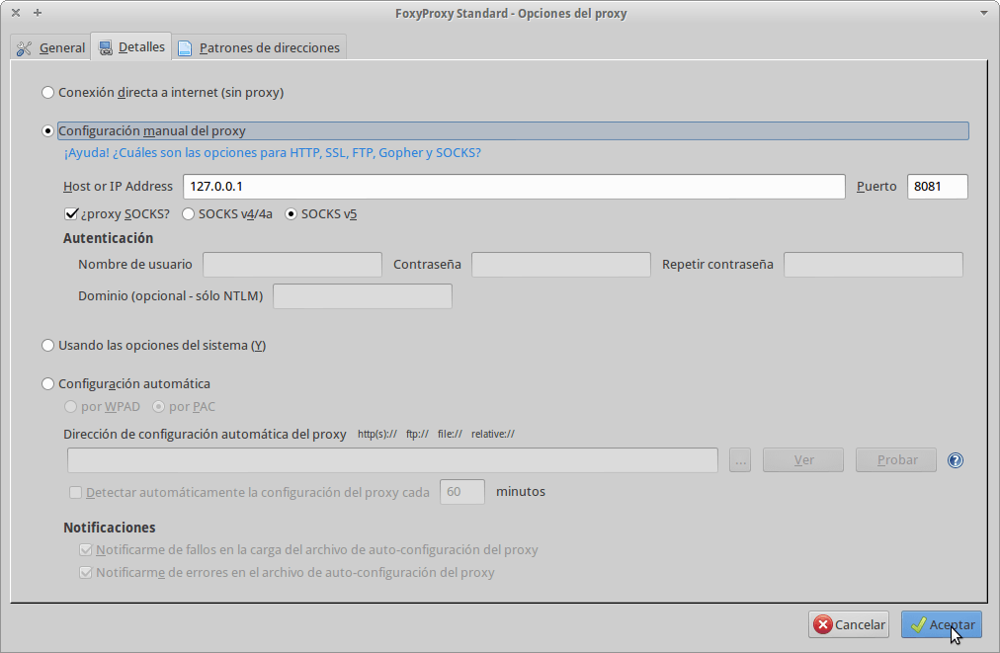](images/12-Proxy-Socks-Configurado.png)

Si observamos la captura de pantalla podremos ver la configuración que tenemos que introducir. Primero de todo tenemos que **tildar la casilla de configuración manual del proxy**. A continuación como el servidor proxy socks actuará localmente en nuestro ordenador **en el apartado Host or IP address tenemos que introducir 127.0.0.1**. Como el tunel SSH lo hemos abierto a través del puerto 8081 **en la celda puerto tenemos que introducir el número de puerto 8081**. Para finalizar tan solo tenemos que **tildar la opción ¿proxy socks? y seleccionar la opción Socks v5** ya que la versión 5 del protocolo socks es más moderna y ofrece mayor seguridad que la versión 4.

Una vez realizados todos los pasos **presionamos el botón Aceptar**. **Seguidamente aparecerá una ventana adicional en la cual tendremos que seleccionar la opción Aceptar de nuevo**. Una vez realizado este paso el proceso de configuración a finalizado. Cerramos el navegador y lo volvemos abrir de nuevo.

Justo al abrir el navegador analizamos cual es nuestra IP. Para ello accedemos a la siguiente página web:

[http://www.vermiip.es/](http://www.vermiip.es/ "Averiguar IP Pública")

El resultado obtenido es el siguiente:

[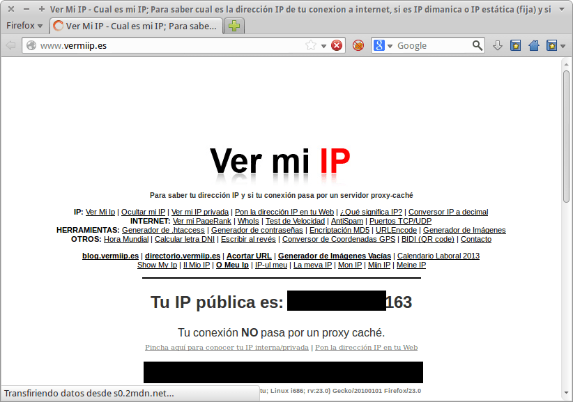](images/13-IP-sin-porxy-Socks.png)

Como se puede ver en la captura de pantalla nuestra IP es XX.XX.XX.163 . S**eguidamente nos conectamos a través del tunel SSH y comprobamos de nuevo nuestra IP**.

[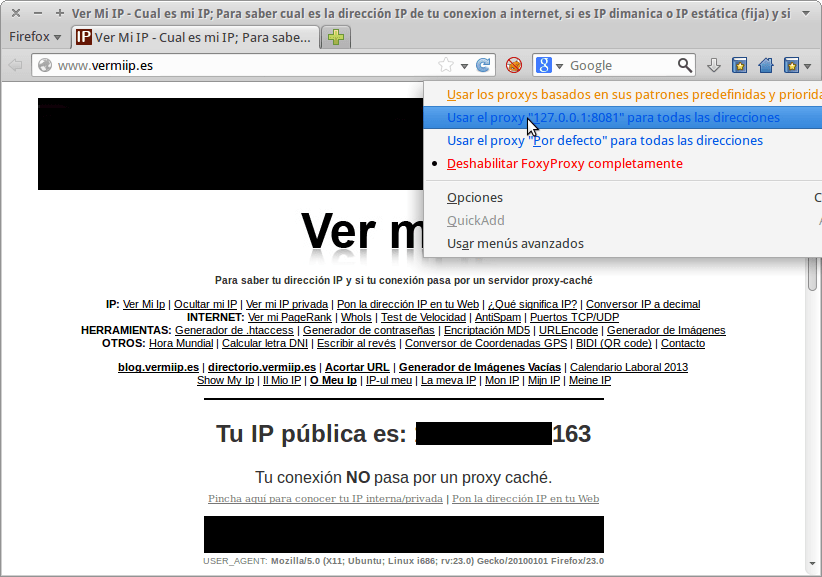](images/14-Activación-del-proxy-Socks1.png)

**Para hacer que el tráfico entrante y saliente de Firefox circule por el tunel SSH**, como se puede ver en la captura de pantalla lo único que tenemos que hacer es **dar click con el botón derecho encima del icono de Foxy Proxy y seleccionar la opción que contiene los datos 127.0.0.1:8081**. Una vez seleccionada la opción pasamos de nuevo a comprobar nuestra IP y el resultado es el siguiente:

[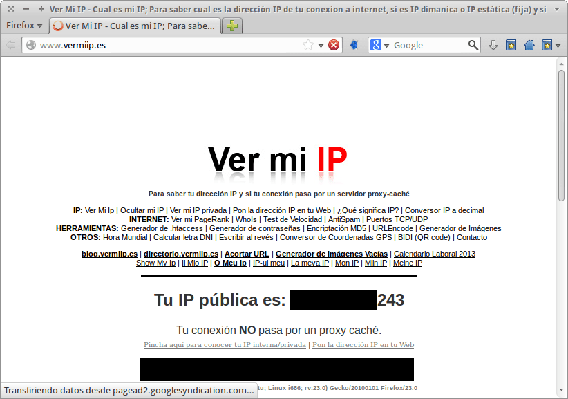](images/15-IP-a-través-del-proxy-Socks.png)

Como se puede ver **ahora nuestra IP pública ahora es diferente. Antes terminaba en 163 y ahora termina en 243**. **Este hecho es indicativo que todo está funcionando a la perfección**. La IP que podréis visualizar es la IP de vuestro servidor SSH.

En el caso que queramos que Firefox vuelva a utilizar la configuración estándard y que no se use el tunel SSH para enviar y recibir nuestro tráfico, como se puede ver la captura de pantalla, tan solo tenemos que volver a presionar el botón derecho del mouse encima del icono de FoxyProxy y seleccionar la opción **Deshabilitar FoxyProxy completamente** :

[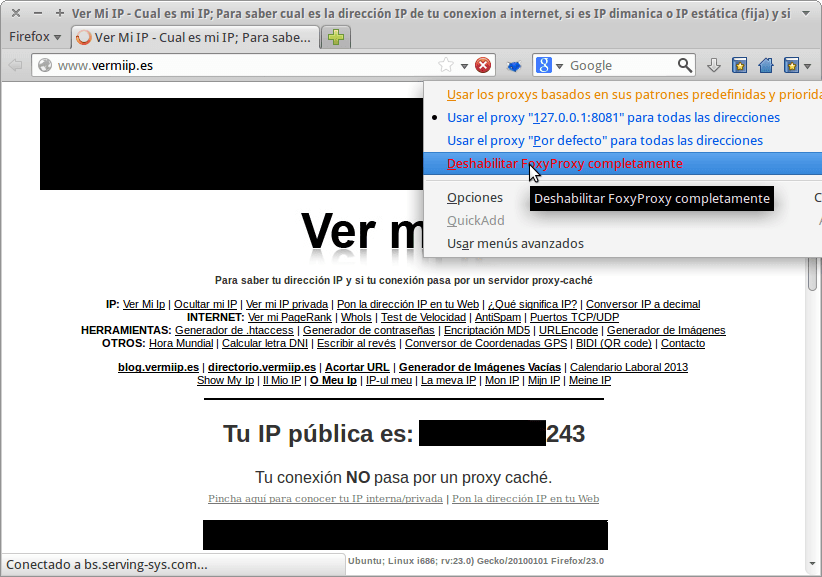](images/16-Deshabilitar-proxy-Socks.png)

###### Nota: En el caso que estemos navegando y nuestro servidor SSH se cayera no hay que temer por nada. En el momento que se cayera el servidor SSH simplemente no podríamos navegar. Por lo tanto en principio nunca estaremos expuestos a los ataques que nos puedan lanzar otros usuario de la red local dónde estemos.

###### Nota: Lo que se puede hacer es dejar configurado permanentemente Firefox para navegar a través del tunel SSH y siempre que tengamos necesidad de navegar en una red insegura usaremos Firefox. Si estamos navegando en una red local segura podemos usar Chrome, Chromium, Opera u otro navegador.

## COMPROBACIÓN DE LOS BENEFICIOS DEL TUNEL SSH

Por si os queda alguna duda de si puede ser efectivo un tunel SSH os voy a enseñar un fácil ejemplo de lo efectivo que puede llegar a ser.

**Imaginemos que estamos conectados en la cafetería y queremos entrar en un foro de Lubuntu**.

[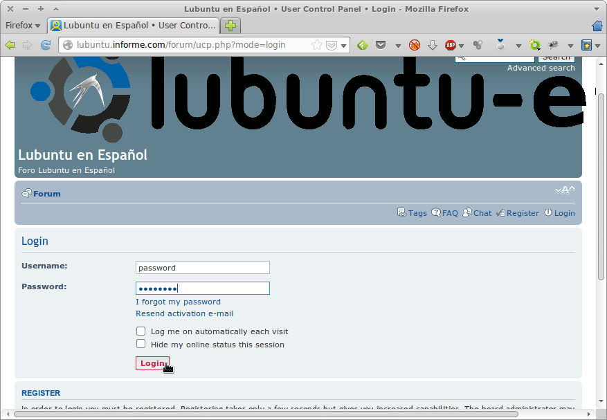](images/17-accediendo-al-forum-de-lubuntu.png)

Como se puede ver en la captura de pantalla, **para acceder al foro de Lubuntu estamos introduciendo nuestro número de usuario y contraseña**. Una vez introducidos accederemos dentro del foro. **¿Pero que pasa si alguien esta esnifando el tráfico que generamos?** Pues pasará lo siguiente:

[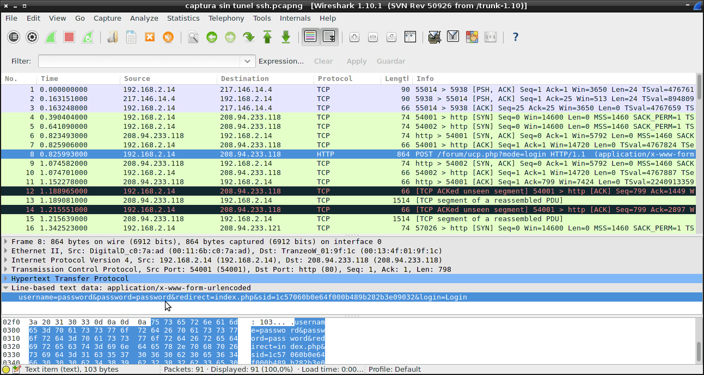](images/18-Robo-de-Contaseña.png)

Como se puede ver en la captura de pantalla alguien ha estado esnifando nuestro tráfico con el [sniffer](http://es.wikipedia.org/wiki/Analizador_de_paquetes "Explicación de que es un sniffer") [wireshark](http://www.wireshark.org/ "Wireshark"). Si observamos la captura de pantalla **podemos ver que el paquete 8 contiene nuestro usuario y contraseña del foro de Lubuntu**. **Por lo tanto un atacante real se podría haber apoderado de nuestro usuario (password) y contraseña (password) de forma muy simple**.

###### Nota: Muchos pensarán que la página web no disponía de cifrado SSL por ejemplo, pero la verdad es que hoy en día incluso con páginas cifradas con SSL nos pueden llegar a robar nuestras contraseñas con  SSLstrip.

Ahora llega el momento de preguntarnos **que pasaría si alguien se dedicara a esnifar el tráfico cuando nosotros estamos navegando a través del tunel SSH**.

Para hacer la comprobación volveremos a entrar en el Foro de Lubuntu. Igual que como hicimos con anterioridad al acceder al foro introduciremos nuestro nombre y contraseña y accederemos al foro.

Ahora pasaremos a ver lo que un posible atacante podría haber capturado:

[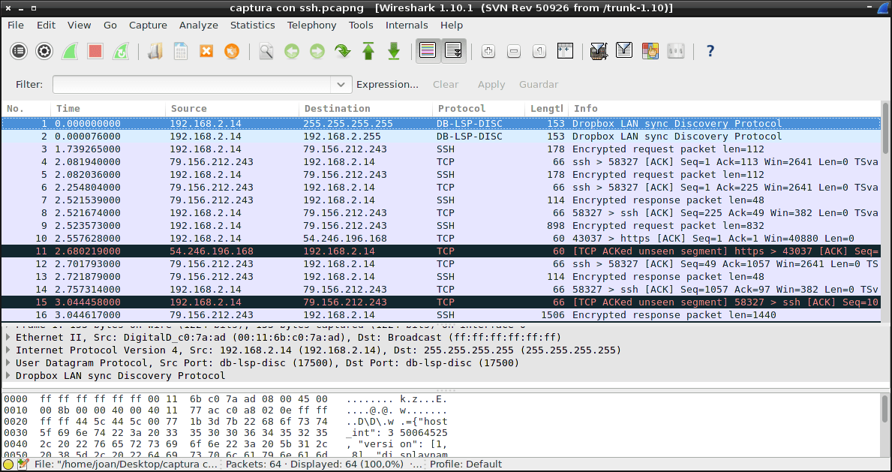](images/19-Trafico-capturado-con-tunel-ssh.png)

Como se puede ver en la captura de pantalla **de la totalidad de paquetes esnifados no hay ninguno de color verde que son los que corresponden al protocolo http**. Lo que si podemos observar es que ahora **la mayoría de paquetes usan el protocolo SSH** **y además en información podemos leer la palabra** **Encrypted Response**. Además si intentáramos reconstruir cualquiera de los paquetes con el protocolo SSH el resultado seria completamente ilegible.

Además si realizamos un filtro por tipo de paquete podemos ver que no se ha capturado ni un solo paquete http que son los que acostumbran a contener información en texto plano como por ejemplo passwords, nombres de usuario, etc.

[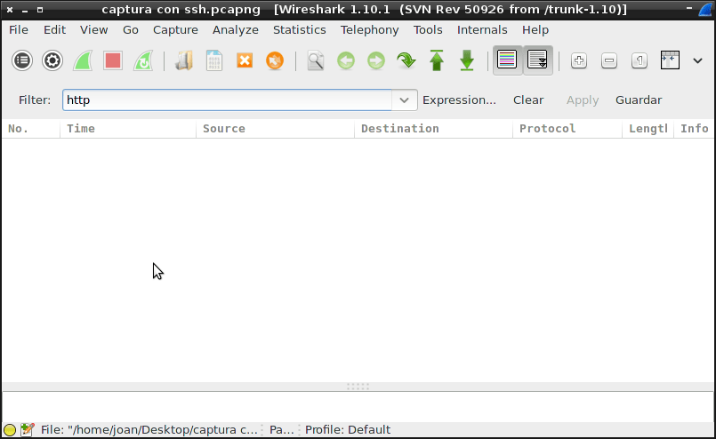](images/20-No-hay-paquetes-Http.png)

Por lo tanto realizada esta pequeña prueba podemos afirmar que en estos momentos es mucho más difícil ser espiado y ser atacado por usuarios que están conectados dentro de nuestra misma red local.

## SOLUCIÓN PARA APLICACIONES QUE NO SOPORTAN SOCKS

Como se ha visto en el post tenemos que configurar cada una de nuestras aplicaciones para que funcione a través del tunel SSH que hemos creado, pero ¿qué pasa en el caso que ciertas aplicaciones como por ejemplo [Midori](http://es.wikipedia.org/wiki/Midori_\(navegador\) "Navegador Midori") o [Pidgin](http://www.pidgin.im/ "Mensajería Pidgin") no tengan esta opción?

La solución a este problema se llama [tsocks](http://sourceforge.net/p/tsocks/wiki/Home/ "Tsocks"). En futuros post veremos que utilizar tsocks para enviar la totalidad del tráfico entrante y saliente a través de nuestro tunel SSH para la totalidad de aplicaciones instaladas en nuestro ordenador.
