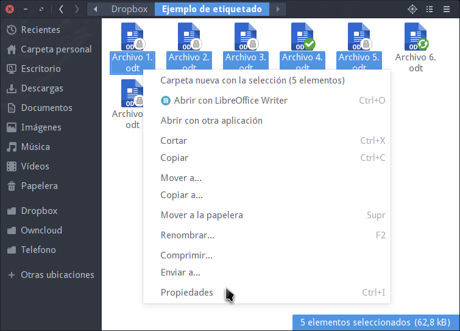
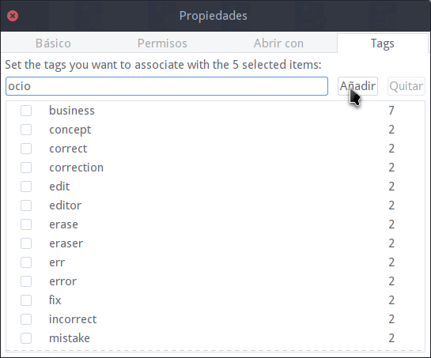
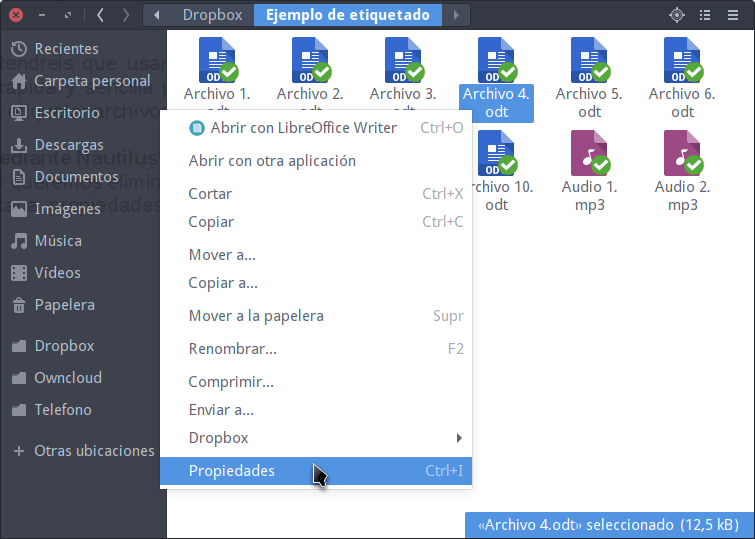
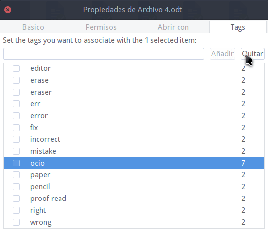
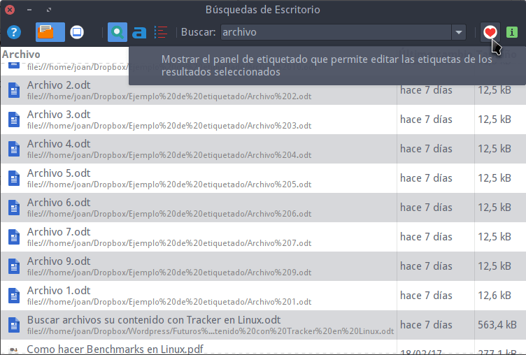
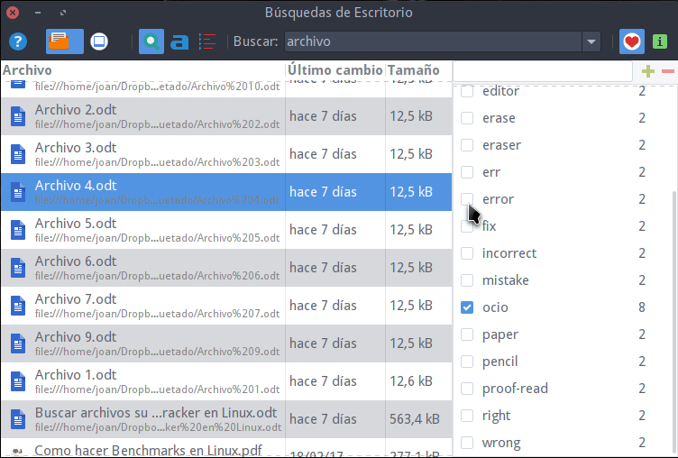
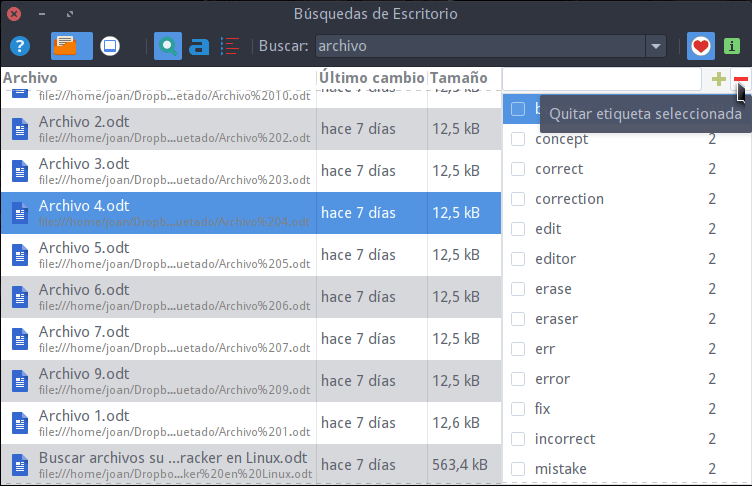

Hace pocos días vimos el procedimiento para etiquetar archivos con tracker [mediante la terminal](). La gente a la que no le guste usar la terminal tiene que saber que también tiene la opción de usar las interfaces gráficas para etiquetar sus archivos y carpetas.<!--more-->

## ETIQUETAR ARCHIVOS Y CARPETAS MEDIANTE UNA INTERFAZ GRÁFICA

Existen varias interfaces gráficas que permiten etiquetar archivos y carpetas. A continuación veremos algunas de ellas.

###### Nota: Para etiquetar archivos y carpetas con el método que verán en este articulo tiene que [instalar y configurar tracker]() de forma adecuada.

### Etiquetar archivos y carpetas mediante Nautilus

Si disponemos del gestor de archivos nautilus lo abrimos y seguimos los siguientes pasos:

1- Seleccionamos los archivos y/o carpetas que queremos etiquetar.

2- Presionamos el botón derecho del ratón y cuando aparezca el menú contextual clicamos en la opción Propiedades.

[](images/acceder-propiedades-archivos.png)

3- Al abrirse la ventana de Propiedades clicamos en la pestaña Tags.

4- A continuación tildamos las etiquetas que queremos asignar a nuestro/s archivo/s o carpeta/s.

5- En el caso que que la etiqueta que queramos asignar no exista, la escribimos en el cuadro de diálogo y presionamos el botón Añadir.

[](images/asignar-etiquetas-archivos-carpetas.png)

De esta forma tan simple y tan rápida podremos etiquetar nuestros archivos y carpetas.

###### Nota: En el caso que no es uséis Nautilus tendréis que usar la terminal o buscar soluciones alternativas. Una solución rápida y sencilla para XFCE es crear una acción personalizada en Thunar para etiquetar archivos.

### Eliminar etiquetas de archivos y carpetas mediante Nautilus

Eliminar etiquetas es tan fácil como crearlas. Tan solo tenemos que seleccionar los archivos o carpetas en que queremos eliminar las etiquetas. Presionamos el botón derecho del ratón y cuando aparezca el menú contextual clicamos en la opción Propiedades.

[](images/seleccionar-archivo-para-eliminar-etiqueta.png)

En la ventana propiedades clicamos en la pestaña Tags y destildamos las etiquetas que queremos eliminar de nuestros archivos o carpetas.

[](images/Eliminar-una-etiqueta-de-forma-completa.png)

En el caso que nuestro objetivo sea eliminar complemente una de las etiquetas, tan solo la tenemos que seleccionarla y presionar el botón Quitar.

[](images/eliminar-una-etiqueta-de-forma-completa.png)

De este modo se eliminará por completo la etiqueta de nuestro sistema operativo, de nuestros archivos y de nuestras carpetas.

### Etiquetar archivos y carpetas mediante Tracker-Needle

Otra opción para etiquetar archivos es mediante el entorno gráfico de búsqueda de Tracker.

Por lo tanto accedemos al entorno gráfico de búsqueda a través del menú de aplicaciones de nuestra distro, mediante un atajo de teclado o ejecutando el siguiente comando en la terminal:

> ```
> tracker-needle
> ```

Una vez se abra la interfaz gráfica realizamos una búsqueda del archivo o carpeta que queremos etiquetar. Seguidamente clicamos encima del icono del corazón para que aparezca el panel de etiquetado.

[](images/ver-las-etiquetas-disponibles.png)

Seleccionamos el archivo o carpeta que queremos etiquetar. A continuación vamos al panel de etiquetado y tildamos la/s etiqueta/s que queremos asignar a nuestro archivo o carpeta. En el caso que la etiqueta que queramos asignar no exista, la creamos escribiendo su nombre en el cuadro de diálogo y presionando en el botón +.

[](images/etiquetar-archivos-tracker-needle.png)

###### Nota: Que sepa ninguna de las interfaces gráficas permite introducir comentarios en las etiquetas.

###### Nota: A diferencia de la terminal y Nautilus, Tracker-needle solo te permite etiquetar archivos de forma individual. Esto es una limitación muy grande y por lo tanto es de largo la peor opción que podemos usar.

### Eliminar las etiquetas de un archivo o carpeta mediante Tracker-Needle

Inicialmente tenemos que buscar el archivo o carpeta en el que queremos eliminar la etiqueta. A continuación abrimos el panel de etiquetado clicando encima del icono del corazón.

[](images/ver-las-etiquetas-disponibles.png)

Finalmente seleccionamos el archivo o carpeta en el que queremos eliminar la etiqueta y destildamos las etiquetas que queramos eliminar del panel de etiquetado. De esta forma podemos eliminar etiquetas de archivos y carpetas de forma sencilla.

[](images/etiquetar-archivos-tracker-needle.png)

Si lo que pretendemos es eliminar complemente una de las etiquetas, nos vamos al panel de etiquetado, seleccionamos la etiqueta que queramos eliminar y finalmente presionamos el botón \-.

[](images/eliminar-etiqueta-con-tracker-needle.png)
