Visitando una web me he encontrado con la sorpresa que no podía leer el artículo porque sus administradores han decidido instalar un plugin que bloquea la lectura de sus artículos a los usuarios que utilizan un bloqueador de publicidad como por ejemplo Adblock Plus o uBlock Origin. Afortunadamente en la actualidad existen soluciones para solucionar este problema como por ejemplo anti adblock killer.<!--more-->

[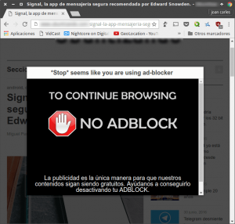](images/Web-que-usa-anti-adblock.png)

Por lo tanto en el caso que se encuentren en una situación parecida a la mia pueden intentar usar los siguientes métodos para intentar solucionar este problema.

## USAR ANTI ADBLOCK KILLER A TRAVÉS DE UBLOCK-ORIGIN

La solución más cómoda es usar el bloqueador de anuncios uBlock Origin con el filtro Anti adblock Killer.

En el caso que no estén usando el bloqueador de anuncios uBlock Origin, les recomiendo encarecidamente que lo hagan.

Según lo que he podido experimentar ublock Origin es el mejor bloqueador de publicidad existente en la actualidad.

### Instalar el bloqueador de anuncios uBlock Origin

En el caso que no tengan instalado el bloqueador de publicidad mencionado, pueden instalarlo siguiendo las siguientes instrucciones:

https://geekland.eu/instalar-ublock-origin-chrome-firefox/

###### Nota: Las instrucciones de instalación que encontrarán en la URL son para el navegador Google Chrome y para Firefox.

### Acceder a la configuración de uBlock Origin

Las pasos a seguir para acceder a la configuración de uBlock origin varían en función del navegador que usamos.

#### Acceder a la configuración de uBlock en Chrome

Una vez instalado el bloqueador de publicidad lo tenemos que configurar para hacer que sea indetectable por parte de las webs que estamos visitando.

Para ello posicionamos el puntero del ratón encima del icono de ublock origin y presionamos botón derecho de nuestro ratón.

Seguidamente se abrirá una ventana en la que deberemos clicar encima de la opción **Configuración**.

[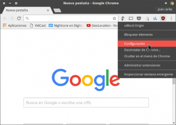](images/3-Acceder-a-la-configuración-de-uBlock-Origin.png)

Después de clicar sobre el botón accederán a las opciones de configuración de uBlock Origin.

#### Acceder a la configuración de uBlock en Firefox

En la barra de direcciones del navegador introducimos el siguiente texto:

> ```
> about:addons
> ```

Seguidamente presionamos la tecla enter para poder acceder a la ventana de configuración de las extensiones.

En la ventana de configuración de los plugins clicamos en el botón **Preferencias** de la extensión uBlock Origin.

[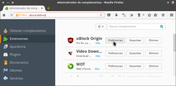](images/4-Acceder-a-la-configuración-de-las-extensiones-en-Firefox.png)

Una vez dentro de las preferencias de uBlock origin clicamos encima del botón **Mostrar Panel de Control**.

[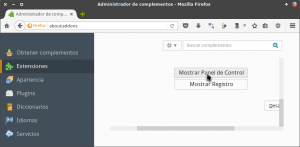](images/5-Acceder-a-la-configuración-de-ublock-en-Firefox.png)

Después de clicar sobre el botón accederán a las opciones de configuración de uBlock Origin.

### Configurar uBlock Origin para activar el filtro anti adblock killer

Una vez dentro de las opciones de configuración deberán clicar encima de la pestaña **Filtros de terceros**.

Seguidamente en el apartado de anuncios deberán activar el filtro **Anti Adblock Killer | Reek**  y finalmente deberán presionar sobre el botón **Aplicar cambios**.

[](images/6-Suscribirse-a-la-lista-de-Anti-Block-Killer.png)

Después de realizar estos simples pasos el bloqueador de anuncios uBlock Origin será indetectable para la mayoría de webs que visitamos.

### Comprobar que nuestro bloqueador de publicidad no es detectado

Después de seguir estos simples pasos volveremos a intentar visitar la página web que nos bloqueaba el acceso y veremos que ahora la podemos leer sin ningún tipo de problema.

[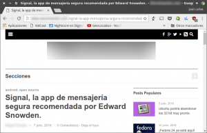](images/7-Podemos-navegar-sin-que-sepan-si-tenemos-adblock-instalado.png)

Mediante el uso ublock Origin y anti adblock killer hemos conseguido que la web en cuestión no detecte que estamos usando un bloqueador de publicidad y además el proceso es completamente automático y no requiere de ninguna acción por nuestra parte.

###### Nota: El método mostrado es válido para la totalidad de navegadores que permiten el uso de ublock Origin. Por lo tanto el método es aplicable en Firefox, Chrome, Firefox para Android, Opera, Sea Monkey y Pale Moon.

###### Nota: Este método también se puede aplicar con otros bloqueadores de publicidad como por ejemplo Adblock, Adblock Plus y Adguard AdBlocker.

Para finalizar este apartado les dejo la URL correspondiente a la plataforma de desarrollo de anti adblock Killer:

[Plataforma de desarrollo de anti-adblock-killer](https://github.com/reek/anti-adblock-killer "Link a la plataforma de desarrollo de anti adblock killer")

A través de la plataforma de desarrollo de anti adblock killer podrán plantear sugerencias de mejora y reportar problemas de forma rápida y fácil.

## LEER LA NOTICIAS A TRAVÉS DE UN LECTOR DE FEEDS

Una opción alternativa a la anterior es leer la noticia a través de un lector de feeds. En mi caso utilizo Inoreader, pero pueden usar Feedly, Liferea, Akregator o cualquier otro lector de feeds.

Si usamos un lector de feeds, tal y como se puede ver en la captura de pantalla, podremos visualizar el contenido de la web que está rastreando si usamos un bloqueador de publicidad con total normalidad y sin tener que visualizar ningún tipo de anuncio.

[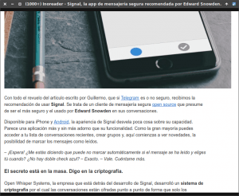](images/8-Usar-un-lector-de-feeds-para-leer-un-contenido-vetado-a-los-usuarios-de-adblock.png)

Por lo tanto usar un lector de feeds también es plenamente efectivo. No obstante tenéis que tener en cuenta los siguientes aspectos:

1. Algunos administradores web solo permiten que se puedan leer las 10 o 15 primeras líneas de cada artículo a través del lector de feeds.
2. Existen Webs que incluyen publicidad en los feeds.

## BLOQUEAR EL JAVASCRIPT DE LA PÁGINA WEB QUE VISITAMOS

En el caso poco probable que ninguna de las opciones anteriores les funcionará, aún existe una tercera vía.

Es más que posible que la web que visitamos haya detectado que estamos usando un bloqueador de publicidad mediante un algoritmo de Javascript.

Por lo tanto lo único que tenemos que realizar es desactivar la ejecución de javascript en nuestro navegador mediante la instalación de una simple extensión.

Existen numerosas extensiones que deshabilitan la ejecución de Javascript. En mi caso acostumbro a utilizar **Quick JavaScript Switcher** en Chrome y **JavaScript Toggle On and Off** en Firefox.

### Instalación de la extensión para bloquear Javascript en nuestro navegador

#### Instalar Quick JavaScript Switcher en Chrome

Para instalar Quick JavaScript Switcher en Google chrome accedemos a la siguiente URL:

[https://chrome.google.com/webstore/detail/quick-javascript-switcher/geddoclleiomckbhadiaipdggiiccfje?hl=es](https://chrome.google.com/webstore/detail/quick-javascript-switcher/geddoclleiomckbhadiaipdggiiccfje?hl=es "Link instalar quick javascript switcher")

Una vez dentro de la URL clicamos encima de del botón **Añadir a Chrome**.

[](images/9-Añadir-Quick-Javascript-Switcher-en-Chrome.png)

Finalmente aparecerá la siguiente ventana en la que simplemente tenemos que presionar encima del botón **Añadir extensión**.

[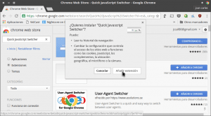](images/10-Añadir-Extension.png)

#### Instalar el complemento JavaScript Toggle On and Off en Firefox

Para instalar JavaScript Toggle On and Off en Firefox tenéis que acceder a la siguiente URL:

[https://addons.mozilla.org/es/firefox/addon/javascript-toggler/](https://addons.mozilla.org/es/firefox/addon/javascript-toggler/ "Link para instalar javascript toogle on and off")

Una vez dentro de la URL clicamos encima del botón **Agregar a Firefox**.

[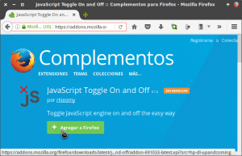](images/11-Agregar-JavaScript-Toggle-On-and-Off-en-Firefox.png)

Seguidamente aparecerá la siguiente ventana en la que deberemos clicar encima del botón **Instalar**.

[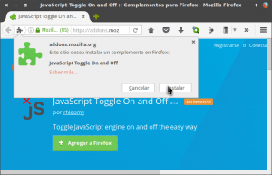](images/12-Instalar-JavaScript-Toggle-On-and-Off-en-Firefox.png)

Después de seguir estos simples pasos ya tenemos instalado JavaScript Toggle On and Off en nuestro navegador.

### Bloquear la ejecución de Javascript

Una vez instalada la extensión entramos de nuevo en la página web y cuando no sale el bloqueo cliamos encima del icono de Quick JavaScript Switcher y presionamos la tecla F5 para recargar el contenido de la página web.

[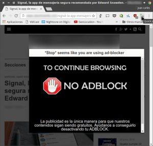](images/Desactivar-Javascript.png)

 

Después de desactivar Javascript y recargar el contenido, podremos leer el contenido de la página web sin ningún tipo de problema.

[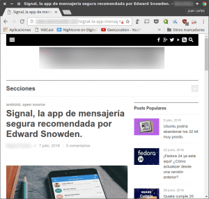](images/14-Leyendo-página-web-sin-problemas.png)

###### Nota: El procedimiento para deshabilitar Javascript con el plugin de Firefox es idéntico al de Google Chrome

Al igual que en los casos anteriores este último método también funciona a la perfección. No obstante tenemos que tener en cuenta los siguientes aspectos:

1. Es posible que hayan sistemas de detección que no usen Javascript. En tal caso este método no funcionará.
2. Es posible que una vez se haya desactivado javascript no se pueda mostrar el contenido de la web o hayan ciertas partes de la página web que no funcionen de forma adecuada.

## REFLEXIÓN SOBRE LAS HERRAMIENTAS PARA DETECTAR LOS BLOQUEADORES DE PUBLICIDAD

Mi opinión es que las herramientas para vetar las visitas a la gente que utiliza un bloqueador de publicidad son completamente inútiles. Algunos de los motivos son los siguientes:

1. Es inútil pedir que se desactive el bloqueador de publicidad. Un usuario que utiliza un bloqueador de publicidad lo hace por convicción y porque están cansados de las prácticas abusivas de la publicidad.
2. La forma en que se pide que desactives el bloqueador es poco efectiva y poco educada. Es más efectivo pedir que se que desactive el bloqueador de publicidad sin privar a nadie de los contenidos.
3. La gente que aplica este tipo de técnicas perderá lectores y seguidores. Si a una persona no le permites ver tu contenido actuará de forma reactiva y es más que posible que no te visite nunca más.
4. Si se generalizan este tipo de prácticas aparecerá una nueva generación de bloqueadores de publicidad que serán imposibles de detectar.
5. Luchar contra los bloqueadores de publicidad es una guerra perdida. Incluso Google, que vive de la publicidad, permite la instalación de bloqueadores de publicidad en su navegador porque es posible que piensen que hacer lo contrario seria peor.

Por lo tanto queda clara mi opinión. Es totalmente inútil usar herramientas para hacer que los usuarios que utilicen un bloqueador de publicidad no puedan acceder a un contenido. Es mucho más efectivo pedir que se que desactive el bloqueador de publicidad sin privar a nadie de los contenidos.

Otra iniciativa que parece que me interesante es la propuesta realizada por la IAB (organización que representa al sector de la publicidad digital). La IAB propone establecer normas para la inserción de publicidad en las páginas web con el fin de conseguir que la publicidad sea menos molesta y menos intrusiva.
