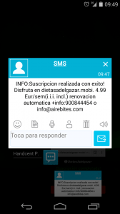
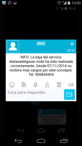

A raíz de una mala experiencia que he tenido recientemente he decidido a escribir este post para evitar que terceras personas sufran el mismo tipo de estafa que yo. La mala experiencia que acabo de citar es que sin quererlo ni beberlo fui suscrito a un servicio Premium.<!--more-->

## ¿EN QUÉ CONSISTE LA ESTAFA DE LAS SUSCRIPCIONES PREMIUM Y SMS PREMIUM?

El fraude de las suscripciones Premium y de los SMS Premium consisten en lo siguiente:

**La persona/organización encargada de perpetrar la estafa intenta conseguir nuestro número de teléfono móvil y los permisos necesarios para suscribirnos a este tipo de servicios**. **Algunas de las formas** para conocer nuestro número de teléfono y adquirir los permisos **para suscribirnos a este tipo de servicios son las siguientes**:

1. Cuando navegamos en nuestro ordenador personal vemos infinidad de **banners de publicidad** presentes en las páginas web. Tan solo basta clicar en uno de estos banners, que por ejemplo nos está ofreciendo participar en un sorteo, introducir nuestros datos personales y número de teléfono para recibir un código de participación/suscripción, y finalmente introducir este código de participación en un formulario. Una vez realizados estos pasos sin ser consciente de ello es probable que nos hayamos suscrito a un servicio Premium o de SMS Premium.
2. Cuando navegamos por internet con nuestro teléfono móvil es posible que sin querer presionemos encima de un **banner de publicidad**. El banner de publicidad nos pedirá directamente si aceptamos suscribirnos a un determinado servicio Premium. Tan solo basta que por error aceptemos suscribirnos al servicio Premium. Hay que tener en cuenta que los banners y botones de aceptar y rechazar se colocan de forma estrategia para maximizar los beneficios de los estafadores.
3. Existen ocasiones en las que para **obtener la clave de descompresión de un archivo .rar** que hemos encontrado en Internet, se nos invita a enviar un determinado SMS para obtener la clave. Tan solo hace falta enviar este SMS para suscribirnos automáticamente a un servicio de SMS Premium.
4. Existen **Apps de teléfono maliciosas** que en el momento de instalarlas estamos dando permisos al atacanta para el envío y recepción de SMS, permisos para llamar a números de teléfono directamente, etc. Al conceder este tipo de permisos estamos dando a la App los permisos necesarios para que nos suscriba a un servicio de SMS Premium sin que nosotros seamos conscientes de ello.
5. Existen **Apps de teléfono móvil que traen banners o publicidad maliciosa**. Si queréis ver un ejemplo detallado de una App que te suscribe a servicios Premium de forma fraudulenta pueden consultar el el siguiente [enlace](http://www.pandasecurity.com/spain/mediacenter/malware/identificadas-aplicaciones-de-google-play-que-suscriben-a-sms-premium-sin-permiso/ "Muestra de App de teléfono con banners maliciosas").

Una vez suscrito a un servicio SMS Premium o a un servicio Premium se nos cobrará un importe adicional a nuestra tarifa de teléfono. Así por lo tanto a final de mes nos encontraremos con una sorpresa desagradable en nuestra factura telefónica.

**En el caso de ser suscrito a un servicio de SMS Premium o servicio Premium empezaremos a recibir mensajes de una temática determinada. Por cada mensaje recibido el importe de nuestra factura telefónica se incrementará. También es posible que se aplique una cantidad fija a nuestra factura telefónica independientemente del número de SMS recibidos.**

###### Nota: Existen otras formas de estafa diferentes a las citadas en este apartado. Por ejemplo otra forma de estafa común es recibir un SMS de un presunto amigo que te esta escribiendo por Whatsapp y te pide que le confirmes vía SMS si te están llegando los mensajes. En el momento de responder el mensaje nos suscribiremos a un servicio Premium.

###### Nota: En la mayoría de casos si leemos la letra pequeña se nos está informando que en el momento de proporcionar nuestros datos y aceptar las condiciones nos estamos suscribiendo a un servicio de SMS Premium. Pero obviamente la letra es tan pequeña que es prácticamente imposible darnos cuenta del engaño.

## ¿QUÉ HACER SI SOMOS VÍCTIMAS DE UNA ESTAFA SMS PREMIUM?

**Lo primero que hay que hacer** cuando nos hemos dado cuenta que estamos suscritos a este tipo de servicio **es darnos de baja**. Normalmente en los SMS que te informan de la suscripción al servicio se acostumbra a proporcionar la siguiente información:

1. Se detalla el procedimiento para darnos de baja del servicio.
2. Se informa de un número de teléfono y de una dirección de email para proporcionar un “servicio de atención al cliente”

Una vez nos hemos dado de baja tenéis que **reclamar el reintegro del dinero a vuestra compañía telefónica, o a quien nos ha vendido el servicios SMS Premium**, alegando que habéis sido suscritos a un servicio que nunca habéis solicitado.

Una vez nos hemos dado de baja tenéis que **reclamar el reintegro del dinero a vuestra compañía telefónica, o a quien nos ha vendido el servicios SMS Premium**, alegando que habéis sido suscritos a un servicio que nunca habéis solicitado.

**Si nadie os quiere reembolsar el dinero** tenemos varias formas para poder seguir reclamando. La primera de ellas es **presentar una reclamación a la oficina de Atención al Usuario de Telecomunicaciones**. Se puede presentar una reclamación electrónica mediante el siguiente [enlace](https://usuariosteleco.mineco.gob.es/reclamaciones/telecomunicaciones/tramitacion-electronica/Paginas/tramitacion-electronica.aspx "Link para realizar reclamación a la oficina de Atención al Usuario de Telecomunicaciones"). Si antes de presentar la reclamación requieren de atención personalizada y aclaración de dudas pueden llamar a los teléfonos 968 010 362 o 901 33 66 99.

Igualmente **también podéis presentar una reclamación a la autoridad de consumo de vuestra comunidad autónoma**. Para contactar con ellos pueden usar el siguiente [enlace](https://www.facua.org/es/noticia.php?Id=7520 "direcciones de las autoridades de consumo en España").

**Otra de las acciones que podemos iniciar en el caso de haber sido estafados es contactar con la Oficina del Consumidor (OMIC)** más cercana con el fin de denunciar lo que nos ha pasado. También podemos **denunciar estos hechos a organizaciones como la** [OCU](http://www.ocu.org/ "Web de la OCU") o la [FACUA](http://www.facua.org/ "Web de la Facua").

**Como último recurso siempre podemos interpelar una denuncia contra lo sucedido en el juzgado más cercano**.

## ¿QUÉ HACER PARA PREVENIR LA ESTAFA DE LOS SMS PREMIUM?

### Bloquear los servicios Premium con vuestro operador telefónico

Prevenir este tipo de acciones es fácil. Lo único que tenemos que hacer es **llamar al teléfono de información de vuestra compañía telefónica. Una vez estáis en contacto con ellos tenéis que pedirles que queréis restringir el pago a terceros por medio de vuestra factura telefónica.**

En el caso de hacer esto podemos estar relativamente tranquilos. En el caso de ser víctimas de una estafa en principio estaremos salvados ya que en el momento de suscribirnos al servicio se nos pedirá que elijamos un método de pago que por ejemplo puede ser introduciendo el número de nuestra tarjeta de crédito u débito, etc. Por lo tanto la suscripción ya no es automática a través de nuestra factura telefónica y podemos cancelar tranquilamente el proceso.

El hecho de realizar este paso no supondrá ningún cambio contractual con su compañía telefónica. Por lo tanto tendremos las mismas prestaciones, los mismos derechos, y las misma obligaciones de siempre, pero con mayor seguridad.

### Aplicar el sentido común cuando estamos en Internet

Aparte de desactivar los servicios Premium también se recomienda realizar una navegación responsable. Una pequeña y modesta guía para realizar una navegación responsable es la siguiente:

1. **No cliquéis encima de los banners de publicidad**, y menos encima de los banners sospechosos que por ejemplo ofrecen premios, politonos gratis, etc.
2. **Nunca debéis proporcionar datos personales como vuestro número de teléfono, vuestro número de tarjeta de crédito, etc**. Únicamente se deben proporcionar los datos mencionados cuando existan unas condiciones mínimas de seguridad.
3. **En el caso de instalar aplicaciones en vuestro teléfono móvil analizad siempre los permisos que estamos dando a la aplicación**. Si por ejemplo un juego o una App de linterna nos está pidiendo permisos para el envío y recepción de SMS tenéis que desconfiar y no instalar la aplicación.
4. **Antes de contestar este SMS se recomienda encarecidamente mirar la procedencia de este SMS**. En el caso de que la procedencia sea desconocida se recomienda eliminarlo y no contestar.
5. **En el caso de contratar un servicio por Internet intentad buscar y leer las condiciones de de la suscripción**. En el caso de no encontrar en ningún sitio las condiciones de suscripción se recomienda no contratar este servicio.

## REFLEXIÓN SOBRE LOS SMS PREMIUM Y LOS SERVICIOS PREMIUM

Las compañías telefónicas deberían aplicar restricciones a los servicios Premium al 100% de sus usuarios de serie. Como no lo hacen afirmo que **las compañías telefónicas son cómplices de las estafas que reciben sus usuarios**.

Por cada estafa realizada y por cada suscripción a un servicio Premium tenéis que tener muy presente que no solamente se lucra el estafador. **Aparte del estafador se estarán lucrando los siguientes actores**:

1. **Vuestro operador telefónico** (Movistar, Orange, Vodafone,etc)
2. **Las empresas que ofrecen el contenido que hace de cebo** para que nosotros nos suscribamos de forma accidental a un servicio Premium.
3. **Los Webmasters que acceden a poner los banners de publicidad maliciosos, y las empresas de publicidad** que contactan con los Webmasters para introducir este tipo de banners en sus webs.

Por lo tanto creo que no me equivoco al decir que este tipo de estafas existen y continuarán existiendo porqué la gente que tendría que parar esto simplemente no hace nada para hacerlo.

También os recomiendo que **no penséis que este tipo de problemas solo lo pueden tener personas inexpertas con la informática o que no sepan lo que están tocando**. Si miran en Google podrán encontrar multitud de páginas de gente que denuncia haber sido estafada por este tipo de servicios. Además **económicamente hablando este tipo de estafas pueden ser peligrosas ya que en el caso que la víctima sea un menor de edad o una persona mayor que no es amiga de las nuevas tecnologías es posible que se reaccione lentamente ocasionando facturas telefónicas muy elevadas**.

Para finalizar con este apartado simplemente me gustaría citar nombres de empresas que se dedican ha propiciar este tipo de engaños:

Airebites, Delecom, Datatalk, Nvia, Billinfo, Contntastic, Dindotrusted, GKMServices, Instantoo, Jokoo, JPA Comunicaciones SAS, KKO-STORE, Mihoróscopo, Mobapps, Mobilecloudapp, Mobile Trend, MOV111, Movilfun, Movilisto, Muromusical, Neomedia, Neomobile, Nvia SMS, OnlinemusicTV, SexyTV, Solojugones, etc.

## ¿CUÁL HA SIDO MI CASO?

Finalmente y solo para los curiosos les comento la estafa que sufrí en mis carnes. Estaba tranquilamente navegando con mi teléfono y de repente se me ocurrió visitar la página http://tecno4all.com/ (Página que no he seguido, ni sigo ni seguiré)

Justo al entrar en esta página hubo una redirección a otra página web que estaba plagada de publicidad y sin realizar absolutamente ninguna acción recibí este mensaje SMS:

Obviamente a estas altura sin realizar absolutamente nada estaba suscrito a un servicio Premium en el que semanalmente se cobraban 5 Euros.

###### Nota: Me extraña mucho lo sucedido porqué para suscribirte a este tipo de servicios pensaba que era necesario una mínima intervención por mi parte. Quizás lo realice algún tipo de acción sin yo darme cuenta.

Después de pasarme esto lo primero que realice es iniciar el proceso para darme de baja. Para ello llamé al teléfono que figura en el mensaje de SMS y a los pocos segundo de llamar recibí otro mensaje:

Durante la llamada también pedí que no se cobraran los 5 Euros de la suscripción a este servicio porqué yo no me suscribí conscientemente a él y además tampoco lo había usado. La respuesta a este requerimiento fue que ellos no podían hacer nada porque el número al que estaba llamando era simplemente una empresa subcontratada para proporcionar atención telefónica a gente como por ejemplo yo.

Amablemente me proporciono la dirección de correo electrónico de Airebites que es la empresa que estaba detrás de toda la estafa.

Seguidamente contacte con Vodafone les expuse lo que me había sucedido y me confirmaron que efectivamente me había dado de alta en este servicio SMS y que a posteriori me había dado de baja. Me confirmaron que las accionas realizadas tendrían un importe adicional en mi tarifa telefónica de 5 Euros. Aparte remarcaron muy claramente que el importe de los 5 Euros pertenecía a un servicio externo a Vodafone y por lo tanto no se harían cargo de este importe ni tampoco me lo podían deducir de mi factura. Lo único que dijeron que podían hacer es restringir el pago a terceros por medio de la factura telefónica para evitar que me volviera a pasar en un futuro.

Después de la llamada a Vodafone envíe un email a la compañía Eurobites que es realmente quien perpetuo la estafa en complicidad con Vodafone y el servicio de dietas de adelgazamiento. La verdad no pensé que iban a contestar pero después de intercambiar un par de emails me dijeron que no se podía deducir el importe de mi factura telefónica pero si me podían realizar un abono de los 5 Euros. Para ello les debía entregar mi factura telefónica y un número de cuenta bancaria. Obviamente no acepte la propuesta ya que no es ser muy cauto dar tu número de cuenta bancaria a unos estafadores profesionales.

###### Nota: Dar el número de cuenta bancaria en principio no tiene porqué suponer un peligro. Lo peor que me podría pasar es que esta empresa realizará algún giro con mi número de cuenta que yo a posteriori tendría el derecho de rechazar.

Por lo tanto en mi caso preferí no realizar nada más y perder 5 Euros. Si el importe hubiera sido mayor tendría que haberme puesto en contacto con la oficina de Atención al Usuario de Telecomunicaciones y seguir el resto de puntos citados en este artículo pero creo que por 5 Euros no vale la pena invertir mas tiempo en ello.

Para finalizar solo comentar que en mi caso también intenté ponerme en contacto con el Webmaster de la página web que perpetro la estafa pero ni corto ni perezoso ignoro el mensaje que le envíe. Si alguien tiene curiosidad en conocer como se pudo perpetrar la estafa les dejo la siguiente información.

1. El código fuente de la página tecno4all en el momento de perpetrarse la estafa
2. El código fuente de la web de dietas adelgazar. Este código fuente ha sido extraído de la versión de escritorio y días después de perpetrarse la estafa. Es probable que la versión móvil de la web es la que tenga los mecanismos necesarios para suscribirte de forma automática a su servicio.

El contenido citado lo pueden descargar del siguiente [enlace](<https://dl.dropboxusercontent.com/u/28211209/Código%20Fuente Dietas estafas sms.zip> "Descarga del código fuente de las webs atacantes").
