En el siguiente artículo veremos como usar el software [Stellar Converter for EDB](https://www.stellarinfo.com/es/conversion-de-edb-a-pst.htm) para convertir bases de datos de servidores Exchange al formato .pst. Pero antes de iniciar la explicación del proceso veremos la utilidad que tiene convertir bases de datos del formato .edb al formato .pst.<!--more-->

## ¿EN QUÉ CASOS PUEDE SER NECESARIO EXPORTAR CONTENIDO DE UNA BASE DE DATOS .EDB A UN FICHERO CON FORMATO .PST?

Algunos casos en que puede ser útil usar Stellar Converter para convertir una base de datos Exchange con el formato .edb al formato .pst son los siguientes:

1. Cuando las utilidades de Exchange integradas, como ExMerge, Exchange Admin Center o Exchange Management Shell, no pueden exportar la base de datos o los buzones de correo a PST.
2. Para recuperar información de una base de datos Exchange corrupta. En caso que tengamos una base de datos con las bandejas de correo electrónico de 100 usuarios podemos ir creando un archivo .pst para cada uno de los usuarios y de esta forma podemos intentar recuperar la información para por ejemplo migrarla a un servidor Live Exchange o a un servidor Office 365.
3. Para deshacerse de buzones de correo que no son necesarios y de este modo reducir el espacio que ocupa nuestra base de datos .edb. Si tenemos una base de datos con el formato .edb que contiene 100 buzones de correo electrónico podemos generar 100 ficheros .pst de los buzones de correo. Una vez generados podemos borrar los ficheros .pst no nos interesan y migrar los que nos interesan a un nuevo servidor.
4. Extraer información de forma concreta y concisa de un buzón de correo electrónico. Si lo precisamos Stellar Converter for EDB permite filtrar información por buzón de correo, por Asunto, por Fecha, etc. Una vez filtrado el contenido podemos generar un fichero .pst únicamente con la información que necesitamos.
5. Transferir datos de una versión antigua de servidor Exchange a una versión más nueva.
6. Archivar los datos de un buzón de correo en concreto sin que tener que interrumpir el servicio de correo al resto de usuarios.
7. Etc.

## CARACTERISTICAS DEL SOFTWARE Stellar Converter for EDB

Algunas características interesantes a mencionar del software son las siguientes:

1. Permite la migración de la información almacenada en ficheros .edb de gran tamaño, sin conexión y alojados a ficheros .pst sin ninguna limitación de tamaño. Por ejemplo podemos generar ficheros .pst que tengan el tamaño de 20GB.
2. Permite trabajar y realizar operaciones en modo online y en modo offline. Por lo tanto no hace falta que el servidor esté levantado para conseguir nuestro propósito.
3. Soporta las siguientes versiones de servidor Exchange: 5.5, 2000, 2003. 2007, 2010, 2013, 2016 y 2019.
4. Puede exportar bases de datos .edb fuera de línea a servidores Live Exchange.
5. Puede [exportar bases de datos .edb a Office 365.](https://www.stellarinfo.com/es/conversion-de-edb-a-pst.htm)
6. Dispone de conversión selectiva. El software permite exportar solamente los ficheros seleccionados a un fichero .pst
7. No tiene las limitaciones que tienen herramientas como por ejemplo Exmerge y NewMailboxExportRequest. Por ejemplo Exmerge no puede manejar ficheros .pst más grandes de 2 GB.
8. Tiene la funcionalidad de exportar los contactos almacenados a un fichero .csv
9. Etc.

## INSTALAR STELLAR CONVERTER

Si disponen de un sistema operativo Windows tan solo tiene que dirigirse al siguiente enlace para proceder a la descargar el programa.

[https://www.stellarinfo.com/es/conversion-de-edb-a-pst.htm](https://www.stellarinfo.com/es/conversion-de-edb-a-pst.htm)

Una vez dentro de la página presionan el botón de descarga Gratuita y se iniciará la descarga

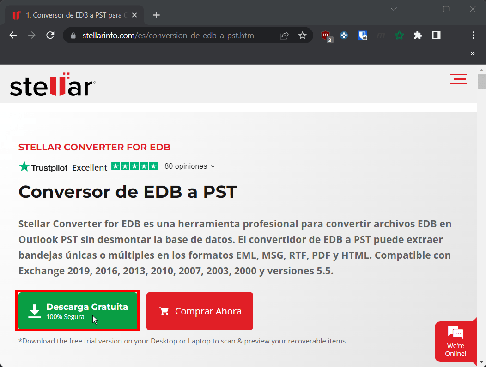

Finalmente ejecutan el archivo .exe que acaban de descargar y la instalación es supersencilla. Tan solo tendrán que seleccionar el idioma y entre ellos obviamente estará el español. A partir de aquí aceptamos las condiciones de la licencia y siguiente siguiente, siguiente.

En caso que tengan problemas pueden [seguir la siguiente guía de instalación](https://www.stellarinfo.com/pdf/installation-uninstallation/installation.php?product_id=252)

## TRANSFERIR CONTENIDO DE UN FICHERO DE BASE DE DATOS EXCHANGE CON EXTENSIÓN .EDB A UN FICHERO CON EXTENSIÓN .PST

En mi caso dispongo de una base de datos offline con el nombre `MY_DB16.edb`. Esta base de datos tan solo contiene el buzón de correo, contactos, calendario, tareas, etc de tres usuarios. En mi caso quiero almacenar el buzón de correo del usuario Mark Spencer a un fichero con extensión .pst. Para conseguir mi propósito procederé del siguiente modo.

### Seleccionar si trabajaremos con una base de datos online u offline

Justo al abrir la el programa tendremos que seleccionar entre la opción `Exchange alojado` o `EDB sin conexión`. En nuestro caso queremos extraer información de una base de datos que no está alojada en el servidor. Por lo tanto clicaremos encima de la opción `EDB sin conexión`.

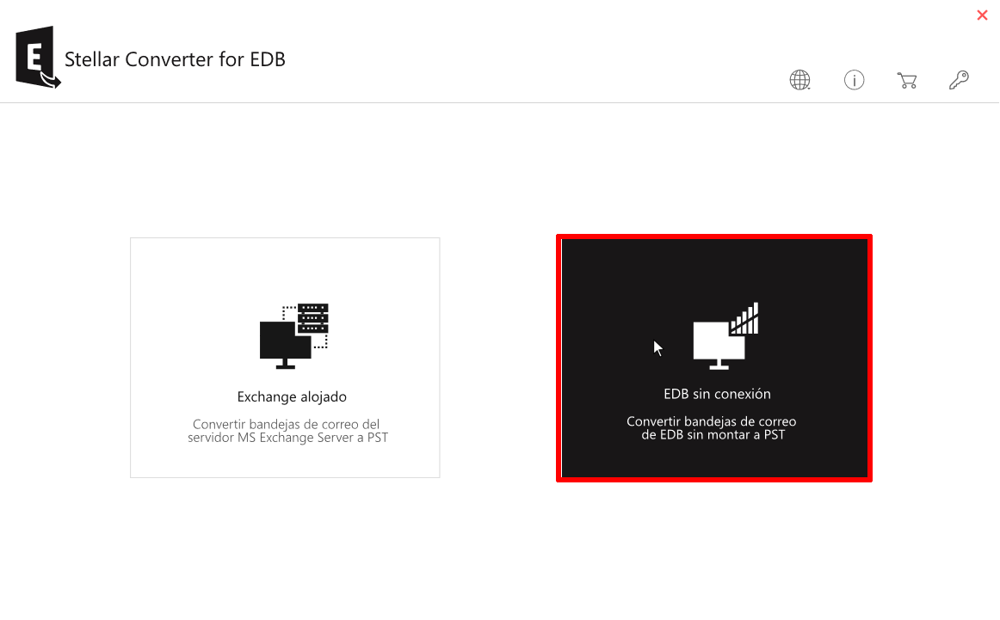

### Abrir el contenido de la base de datos

A continuación presionaremos los botones `Encontrar` o `...` En mi caso clicado en el botón `...`

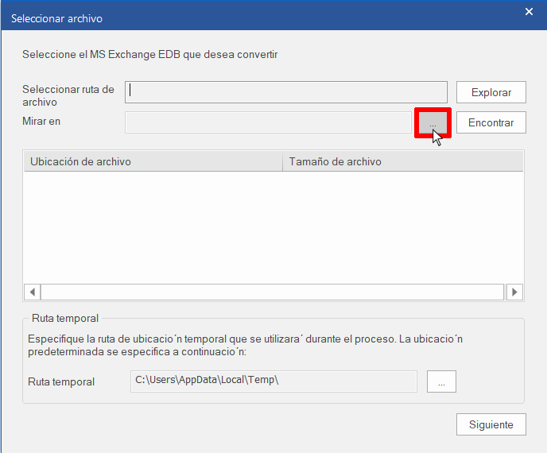

Una vez presionado el botón se abrirá un explorador de archivos en el que tendremos que buscar la ruta donde se encuentra la base de datos presionar el botón `Aceptar`.

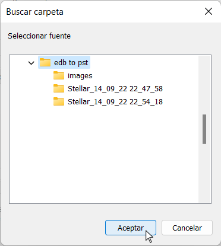

Acto seguido me aparecen 4 bases de datos que son las que en mi caso tengo alojadas en la ubicación seleccionada. Finalmente clicaremos encima de la base de datos con nombre `MY_DB16.edb` para que se abra.

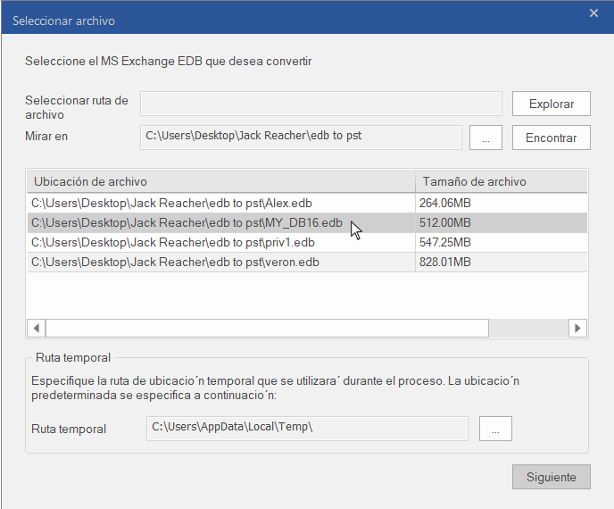

### Visualizar el contenido presente en las bases de datos .edb

Una vez abierta la base de datos podremos ver la totalidad de buzones de correo almacenados en la base de datos .edb. Tal y como se puede ver en la captura de pantalla puedo visualizar la totalidad de contenido que cada uno de los usuarios almacena en el servidor exchange. Por lo tanto puedo ver la totalidad de correos de la bandeja de entrada de un usuario determinado.

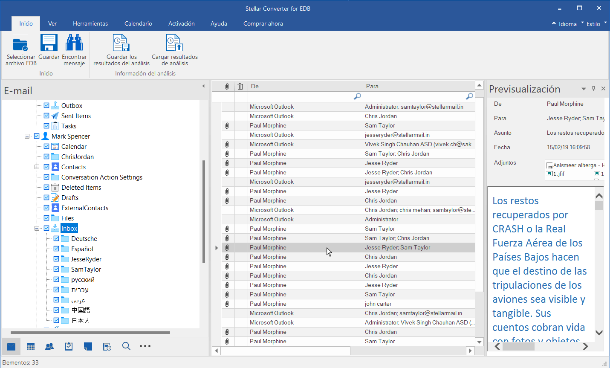

También puedo buscar emails mediante el uso de filtros. Podemos buscar emails:

1. Que tengan un determinado `Asunto`.
2. Que hayan sido enviados de una persona determinada. (Campo `De`)
3. Que hayan sido enviados a una persona determinada. (Campo `Para`)
4. Que hayan sido enviados o recibidos en una fecha determinada. (Campo `Fecha`)
5. Etc.

Por ejemplo en mi caso he buscado la totalidad de correos que en su Asunto figure la palabra `html` del siguiente modo:

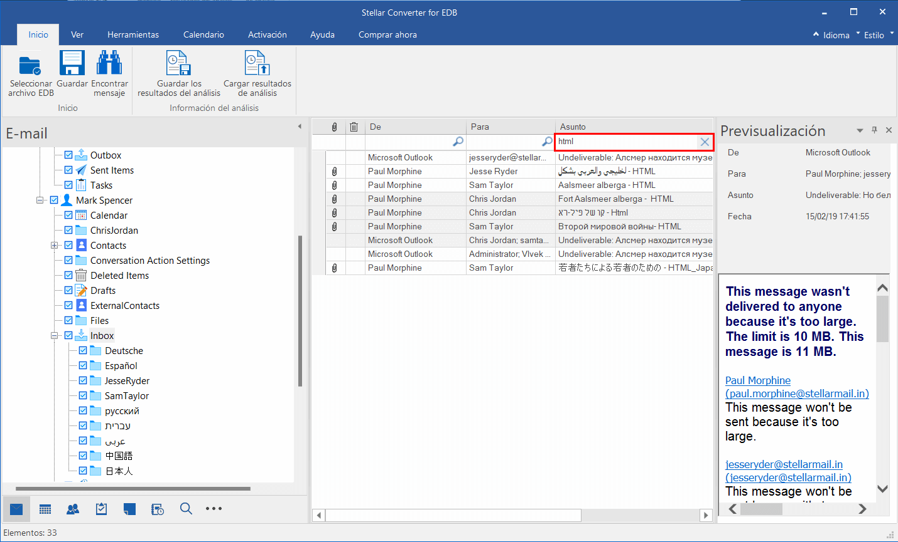

Una vez encontrado el correo que busco puedo previsualizarlo e incluso abrir el contenido que está adjunto en el correo.

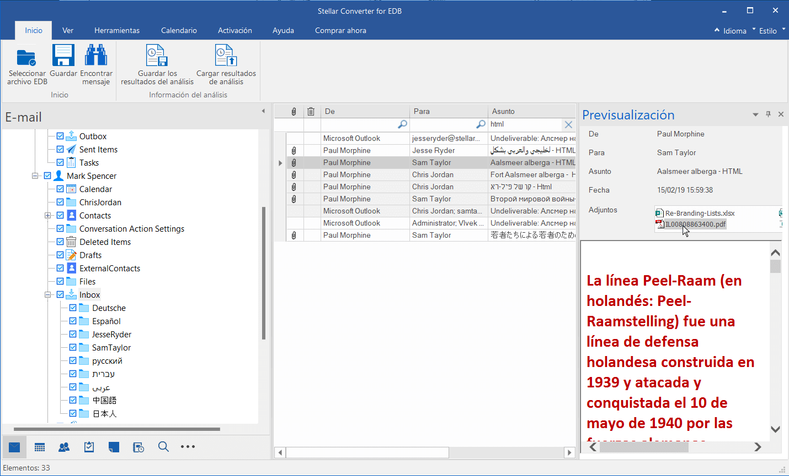

Stellar Converter for EDB también permite visualizar el calendario de un usuario en concreto.

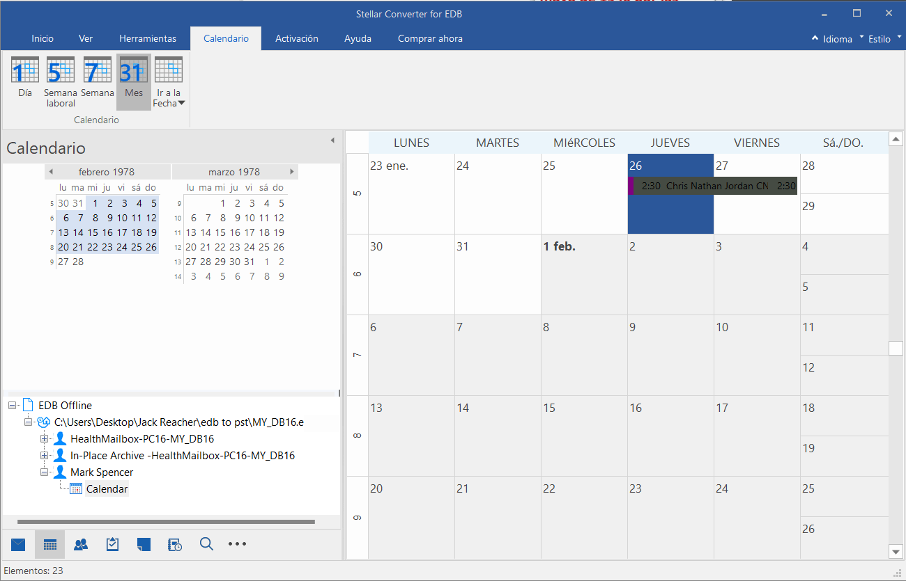

O ver y exportar los contactos de un usuario en concreto.

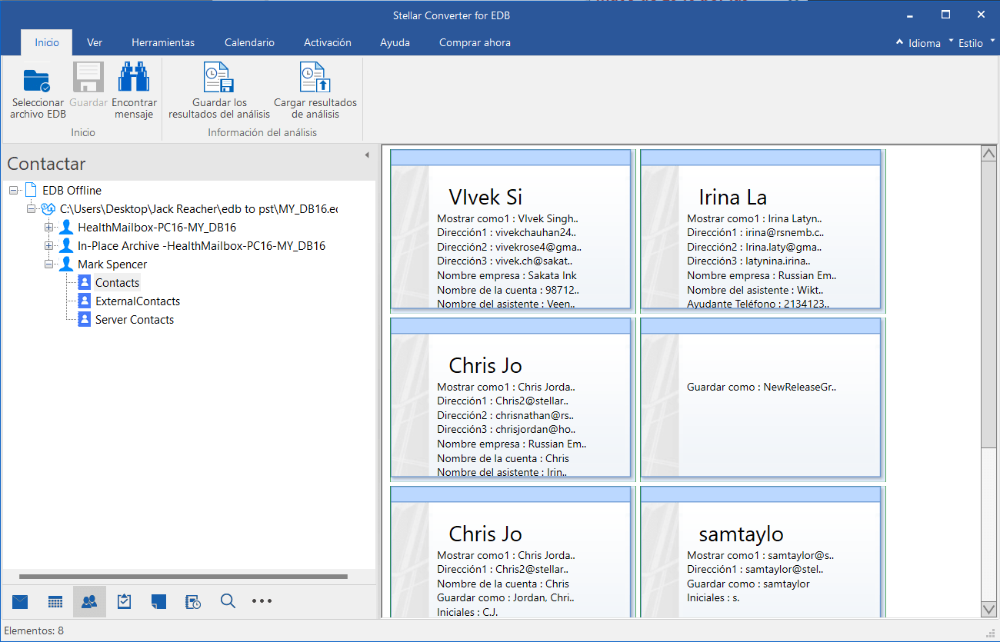

### Seleccionar el contenido que queremos exportar a la nueva base de datos

Aparte de previsualizar el contenido también podemos exportar el contenido que necesitemos a un fichero .pst. En mi caso exportaré el contenido del usuario Mark Spencer. Para ello tildaré la carpeta de `Mark Spencer` del siguiente modo:

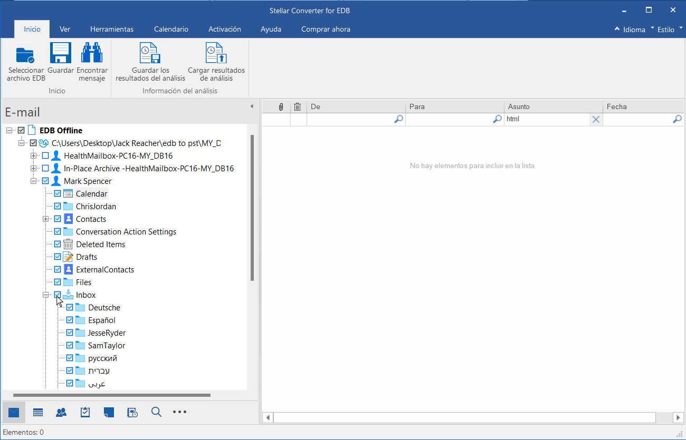

### Exportar el contenido de edb a pst

A continuación presionamos encima del botón `Guardar`

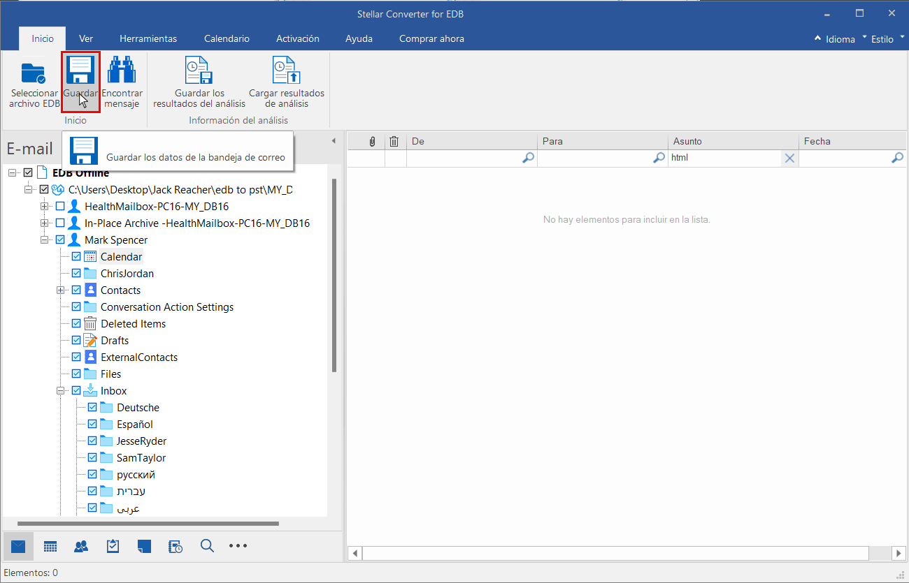

Acto seguido aparecerá la siguiente ventana en la que deberemos seleccionar la opción que más nos interesa. En mi caso he seleccionado la opción `Guardado como PST` y acto seguido he presionar el botón `Siguiente`

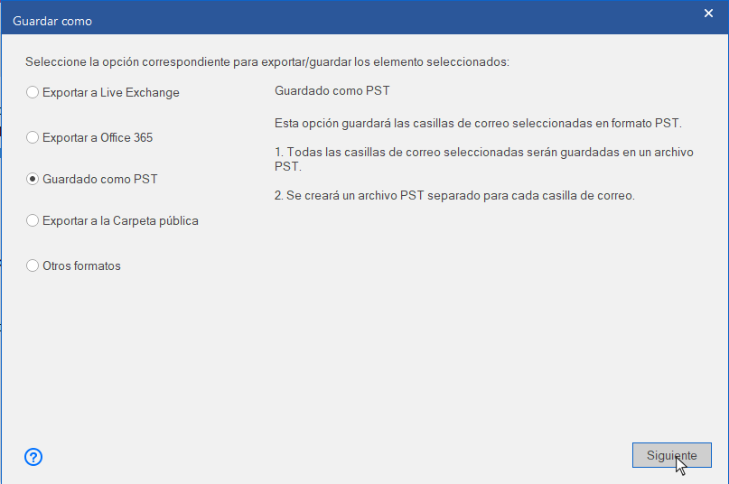

**Nota:** Para conocer el uso del resto de opciones pueden consultar al siguiente [enlace](https://www.stellarinfo.com/help/stellar-converter-for-edb-10-windows-technician-es-save-scanned-files.html).

Seguidamente hay que seleccionar la ubicación en la que queremos almacenar el fichero .pst y presionar el botón `OK`.

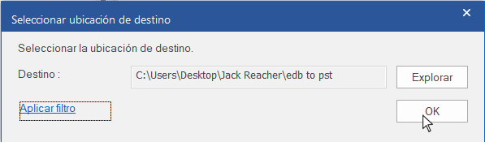

A continuación aparecerá la siguiente pantalla que nos permitirá delimitar más el contenido que exportaremos al fichero .pst. Por ejemplo aquí podremos configurar que únicamente se almacenen los emails que estén comprendidos entre 2 fechas determinadas. Acto seguido presionaremos sobré el botón `Siguiente`

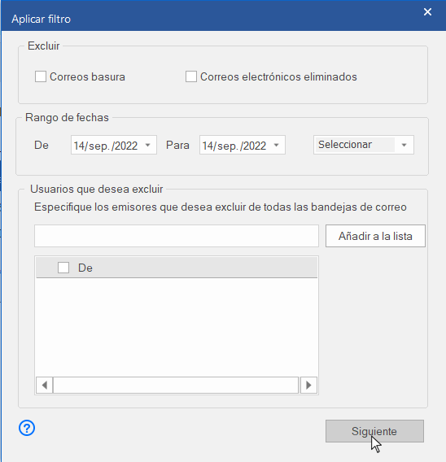

Finalmente, en el caso que exportemos más de un buzón de correo podremos ordenarlos por prioridad. Una vez ordenados tan solo hay que presionar el botón `Siguiente` para que se genere el fichero .pst.

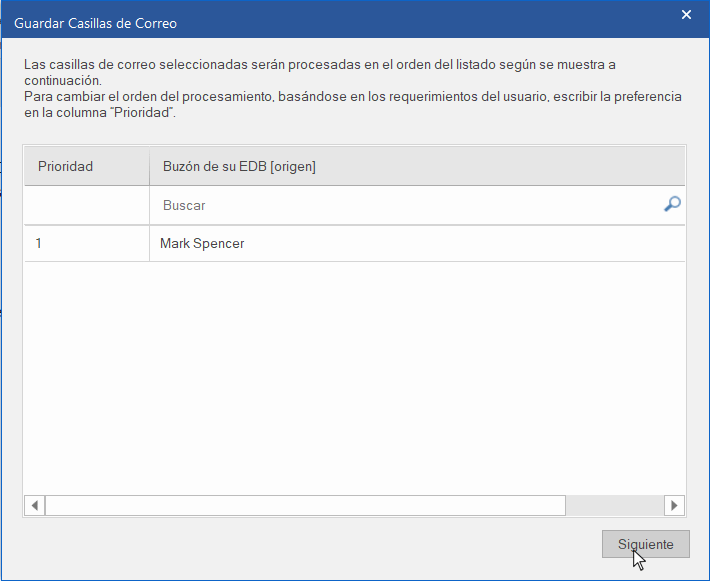

Una generado el archivo .pst ya podremos proseguir con algunos de los usos mencionados al inicio del artículo.

## CONCLUSIONES FINALES

El software es intuitivo, fácil de usar, funciona a la perfección y la velocidad de conversión es rápida. La documentación para el uso del programa está muy bien realizada y en diversos idiomas incluyendo el español. Además comparativamente con otros software dispone de características claramente diferenciales. No obstante el [precio de su licencia](https://www.stellarinfo.com/es/email/edb-pst-comprar-ahora.php) lo considero elevado. También estaría realmente bien que el software estuviera disponible para otros sistemas operativos como Linux o MacOS.

#### FUENTES

[https://www.stellarinfo.com/help/stellar-converter-for-edb-10-windows-technician-es-about-stellar-converter-for-edb.html](https://www.stellarinfo.com/help/stellar-converter-for-edb-10-windows-technician-es-about-stellar-converter-for-edb.html)
