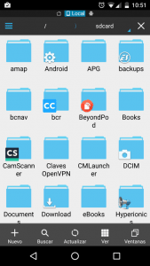
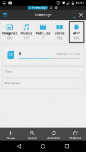
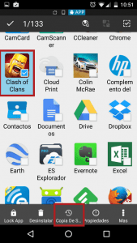
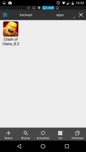

Cuando compramos una aplicación a través de la Google Play Store se instala en nuestro dispositivo y no queda ni rastro del archivo binario .apk usado para realizar la instalación. No obstante en determinadas ocasiones puede ser útil disponer del archivo binario .apk y por este motivo a continuación detallaré una forma fácil y sencilla para extraer el archivo apk de cualquier aplicación instalada en nuestro dispositivo móvil.<!--more-->

## UTILIDADES DE DISPONER DE UN ARCHIVO APK

El hecho de poder disponer de un archivo binario apk nos puede ser útil para los siguientes fines:

1. **Para realizar una copia de seguridad de nuestras aplicaciones** y no tener que depender de la copia de seguridad de Google Play. Cabe recordar que Google guarda una copia de seguridad de nuestras aplicaciones, pero si alguna de las aplicaciones de la copia de seguridad desaparece de la Google Play Store, cuando restauremos nuestro teléfono no se instalará y la perderemos para siempre.
2. En ocasiones hay desarrolladores que actualizan sus programas para quitarles funcionalidades. Por lo tanto tener un archivo apk de la versión antigua nos permitirá **volver a la versión antigua de una aplicación de forma muy fácil.**
3. En el momento que dispongamos de un archivo apk lo podemos **pasar a una tercera persona** **para que pueda instalar una aplicación determinada de forma segura y gratuita** en su dispositivo.
4. Nos podemos encontrar **en situaciones en las que Google Play no nos deje instalar una App** porque por equivocación nos dice que no es compatible con nuestro dispositivo. **Si este es el caso** tan solo tenemos que **pedir a un compañero que nos pase el archivo apk de esta aplicación para poderla instalar manualmente**.
5. **Para compartir aplicaciones entre compañeros** **que no estan disponibles en las tiendas de aplicaciones** más comunes. De este modo en el caso que un compañero me pida como instalar la aplicación seriesdroid, generaré un archivo .apk y se lo pasaré sin necesidad de tener que recordar la fuente de la descarga.

## EXTRAER EL ARCHIVO APK DE UNA APLICACIÓN INSTALADA

**Hay varias formas para extraer el archivo apk** de una aplicación instalada en nuestro dispositivo móvil. **En mi caso utilizo el gestor de archivos ES Explorador de archivos** porque el proceso es muy sencillo y además porque es el mejor explorador de archivos existente para Android.

### Instalar Es Explorador de archivos

Si no disponen del gestor de archivos ES Explorador de archivos lo pueden instalar muy fácilmente a través de la tienda Google Play.

En Google play verán que existe la versión gratuita y la versión Pro. Podéis instalar cualquiera de las dos aunque aconsejo usar la versión Pro ya que la gratuita lleva adware que empeora la experiencia de usuario.

**En el caso que se decidan a instalar la App Gratuita lo pueden hacer a través del siguiente enlace**: [https://play.google.com/store/apps/details?id=com.estrongs.android.pop&hl=es](https://play.google.com/store/apps/details?id=com.estrongs.android.pop&hl=es "Link para la instalación de ES Explorer")

**En el caso que se decidan a instalar la versión Pro de la App lo pueden hacer a través del siguiente enlace**: [https://play.google.com/store/apps/details?id=com.estrongs.android.pop.pro&hl=es](https://play.google.com/store/apps/details?id=com.estrongs.android.pop.pro&hl=es "Link para la instalación de ES Explorer Pro")

### Extraer el archivo apk de la App que queremos

Una vez instalada la aplicación ya la podemos usar por primera vez. Justo al abrir la aplicación veremos la siguiente pantalla:

En la pantalla inicial **posicionamos el dedo en el centro de la pantalla y lo deslizamos de izquierda a derecha**. Justo después de deslizarlo aparecerá la siguiente pantalla en la que deberemos **presionar encima del icono APP**:

Después de presionar el icono APP aparecerá la siguiente pantalla en la que deberemos **marcar la totalidad de Aplicaciones de las cuales queremos obtener el archivo apk**. Para marcar o seleccionar las aplicaciones tan solo tenemos mantener pulsada la aplicación deseada durante unos segundos.

Una vez seleccionada/s la aplicación o las aplicaciones, **presionaremos encima de la opción Copia de seguridad** que está presente en la parte inferior de la pantalla.

Una vez presionado el botón, tal y como se puede ver en la captura de pantalla, **en la ubicación /sdcard/backups/apps encontraremos los apk de los archivos que marcamos en el paso anterior**.

**Una vez extraídos los archivos .apk podemos hacer lo que queramos con ellos**. Los podemos pasar a una tercera persona, los podemos almacenar en la nube, los podemos almacenar en nuestro ordenador, etc.
