Hace semanas escribí un par de artículos relacionados con el reconocimiento de texto OCR y de como poder extraer texto de una imagen:

1. [En el primero artículo]() explique de forma detallada que es el OCR, los usos que se le da actualmente, las ventajas que nos puede proporcionar y sus limitaciones.
2. [En el segundo artículo]() detalle como instalar y como usar un software de reconocimiento OCR llamado OCRfeeder en GNU-Linux.

Ahora **en este artículo detallaremos como instalar y usar** un segundo software de reconocimiento OCR para poder extraer texto de una imagen en GNU-Linux. El software en cuestión se llama [gscan2pdf](http://gscan2pdf.sourceforge.net/ "Información adicional del Software Gscan2pdf") y según mi punto de vista a día de hoy es el mejor cliente de escritorio para reconocimiento OCR que existe en GNU-Linux.<!--more-->

## INSTALACIÓN DE GSCAN2PDF

Lo primero que tenemos que hacer es instalar gscan2pdf y los motores de búsqueda OCR como por ejemplo [tesseract](https://code.google.com/p/tesseract-ocr/ "Web de desarrollo de Tesseract"), [gocr](http://jocr.sourceforge.net/ "Información sobre el motor de búsqueda Gocr"), [ocropus](https://code.google.com/p/ocropus/ "Información sobre el motor de búsqueda Ocropus"), [ocrad](https://www.gnu.org/software/ocrad/ocrad.html "Información sobre el motor Ocrad") o [cuneiform](https://www.gnu.org/software/ocrad/ocrad.html "Web del motor OCR Cuneiform"). Para ello **abrimos una terminal y tecleamos** el siguiente comando:

> ```
> sudo apt-get install gscan2pdf tesseract-ocr tesseract-ocr-spa tesseract-ocr-eng gocr cuneiform
> ```

###### Nota: El paquete gscan2pdf corresponde al software de reconocimiento OCR. Los paquetes tesseract-ocr, gocr y cuneiform corresponden a los distintos motores de reconocimiento OCR. Los paquetes tesseract-ocr-spa y tesseract-ocr-eng corresponden a los motores de búsqueda español e inglés de tesseract.

###### Nota: Para la instalación los usuarios de fedora tienen que reemplazar sudo apt-get install por sudo yum install

En tesseract no solo están disponibles los motores de búsqueda en inglés y en Español. **En tesseract tenemos una gran cantidad de idiomas disponibles**. Para que otros idiomas estén disponibles tan solo tendremos que instalar los paquetes pertinentes. **Para saber los paquetes que equivalen a cada idioma tan solo tienen que abrir la terminal y teclear el siguiente comando en la terminal:**

> ```
> apt-cache search tesseract-ocr
> ```

###### Nota: Los usuarios que usen distros con el gestor de paquetes yum deberán sustituir este comando por yum search tesseract-ocr.

###### Nota: Lo normal es que encuentren el software gscan2pdf en los repositorios de la distribución que usan. En caso contrario lo pueden descargar del siguiente [enlace](http://sourceforge.net/projects/gscan2pdf/files/gscan2pdf/ "Web de descarga de Gscan2pdf"). En esta ubicación encontrarán tanto los archivos binarios como el código fuente para poder compilar este software.

## EJECUTAR EL PROGRAMA

Para ejecutar el programa tan solo tenemos que **abrir la terminal y teclear el siguiente comando**:

> ```
> gscan2pdf
> ```

Presionamos la tecla **Enter** y gscan2pdf se ejecutará. Si no lo quieren arrancar vía terminal siempre pueden hacerlo a través del menú de su entorno de escritorio o desde cualquier lanzador de aplicaciones.

## IMPORTAR LAS IMÁGENES O ARCHIVOS A GSCAN2PDF

Después de finalizar con la instalación, ejecutar el programa y procesar la imagen ya podemos empezar con la acción. Para ello tal y como se puede ver en la captura de pantalla **presionamos el icono de **Abrir archivos de imagen****:

[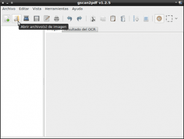](images/1-Importar-imagenes.png)

Después de presionar el icono de abrir archivos de imagen aparecerá una ventana en la que tendremos que **seleccionar el archivo de imagen en el que queremos reconocer y extraer texto**. En mi caso he seleccionado un archivo pdf que tiene el nombre de apagar.pdf. **Una vez seleccionado presionan el botón de** **Aceptar**.

Como el archivo que queremos abrir contiene más de una página al presionar el botón abrir les aparecerá la siguiente ventana:

[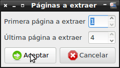](images/2-Páginas-a-extraer.png)

Tal y como se puede ver en la captura de pantalla mi archivo pdf tiene cuatro páginas y selecciono abrir las 4. Una vez seleccionadas las 4 presiono la tecla **Aceptar**. Una vez presionado el botón de aceptar tan solo hay que esperar que se abra el documento pdf que hemos seleccionado.

###### Nota: Si por ejemplo solo quisiera abrir la segunda página del pdf en primera página a extraer pondría 2 y en última página a extraer pondría 2.

###### Nota: En el caso que sea necesario, el software Gscan2psf permite escanear imágenes con nuestro propio escáner y hacer el postprocesado y reconocimiento de texto de forma automática. Para ello tan solo tendríamos que presionar encima del icono de escanear e ir rellenando las opciones de configuración que nos aparecen.

## PROCESADO DE LA IMAGEN ANTES DEL RECONOCIMIENTO

El procesado de la imagen tiene como fin retocar la imagen para obtener mejor resultado en el reconocimiento óptico de caracteres. Las veces que he usado Gscan2pdf sin hacer el postprocesado de la imagen he obtenido unos resultados excelentes, por lo tanto si no se realiza este paso en principio deberíamos seguir obteniendo unos resultados adecuados.

Si alguien considera necesaria su realización tan solo tienen que **acceder al menú** **Herramientas**. Una vez dentro del menú Herramientas **seleccionan la opción** **Limpiar**. Una vez seleccionado la opción Limpiar se ejecutará unpaper y aparecerá la siguiente pantalla:

[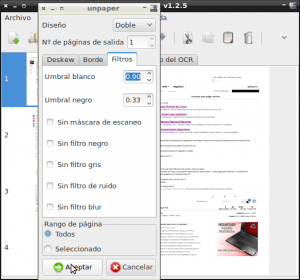](images/3-Procesamiento-imagen.png)

En la pantalla **encontraran distintas opciones y filtros para retocar la imagen en la que queremos realizar el reconocimiento óptico caracteres. Recomiendo no complicarse la vida y usar los valores predeterminados** de la aplicación. Una vez seleccionados los valores **presionamos el botón de** **Aceptar**.

###### Nota: Si los resultados del reconocimiento de texto no son buenos podemos intentar modificar los valores estándar de unpaper para ver si podemos conseguir mejores resultados.

## INICIAR EL RECONOCIMIENTO DE TEXTO OCR

Una vez abierto el archivo ya podemos iniciar el reconocimiento del texto. Para ello, tal y como se puede ver en la captura de pantalla, tienen que **acceder al menú** **Herramientas** **y seguidamente seleccionar la opción** **OCR**.

[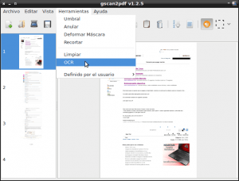](images/4-Acceso-a-OCR.png)

Una vez seleccionada la opción OCR aparecerá la siguiente ventana:

[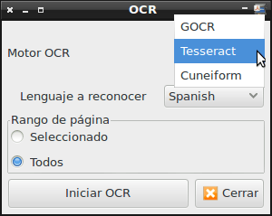](images/5-Selección-opciones-ocr.png)

En este ventana tienen que configurar los siguientes parámetros:

1. **Motor de reconocimiento OCR**: Tal y como se puede ver en la captura de pantalla **seleccionamos el motor de reconocimiento** **Tesseract**. Pueden usar otros motores pero con diferencia Tesseract es el motor de reconocimiento que les dará mejores resultados.
2. **Lenguaje a reconocer**: En este apartado tenemos que **seleccionar el idioma en que se halla el texto que queremos reconocer**. En mi caso el idioma a reconocer es **Español**, por lo tanto selecciono Spanish.
3. **Rango de la página**: En este campo **selecciono la opción** **Todos**. Al seleccionar la opción ****Todos**** se **reconocerá el texto de la totalidad de páginas que mi archivo de imagen en formato pdf**. Si hubiera elegido la opción **Seleccionado** solamente se habría reconocido el texto de la páginas del pdf que hubiera seleccionado previamente.

Una vez configurados los parámetros **presionamos** **Iniciar OCR**. Una vez iniciado el reconocimiento tendrán que esperar unos segundos o minutos en función del número de páginas y de la cantidad de texto a reconocer.

###### Nota:  [Tesseract](https://es.wikipedia.org/wiki/Tesseract_OCR "Información Wikipedia del motor Tesseract") es un motor OCR libre. Originariamente fue creado por Hewlett Packard en el año 1985, y en el año 2005 se libero su código para la comunidad. Actualmente Tesseract es desarrollado por google y es distribuido bajo licencia [apache 2.0](https://es.wikipedia.org/wiki/Apache_License "Información sobre las licencias apache").

## EXPORTAR LOS RESULTADOS A UN PDF

Una vez finalizado el reconocimiento, tal y como se observa en la captura de pantalla, podemos **clicar en la pestaña **Resultados del OCR** para ver los resultados que hemos obtenido** en el reconocimiento óptico de caracteres OCR.

[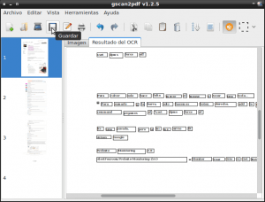](images/6-Guardar.png)

Una vez realizado el reconocimiento de texto **si observamos algún error lo podemos modificar fácilmente**. Tan solo tienen que dar doble click encima de la palabra que quieran modificar y se abrirá un editor de texto para proceder a la modificación.

Seguidamente tal y como se puede ver en la captura de pantalla anterior **clicamos encima del icono de** **Guardar**. Tal y como se puede ver en la captura de imagen **seleccionamos el formato de archivo al que queremos exportar que en mi caso es **pdf****:

[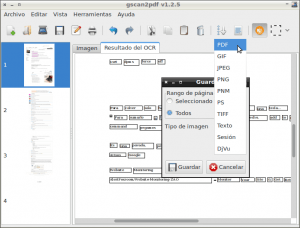](images/7-Selección-formato-a-exportar.png)

###### Nota:  Observen que la cantidad de formatos en los que podemos exportar los resultados es importante. (DjVu, tiff, jpeg, etc)

Una vez seleccionada la opción pdf **presionamos el botón** **Guardar** **y elegimos el nombre del archivo en que queremos que se guarde** que en mi caso es prueba pdf.

Una vez realizados todos los pasos podemos **ir a la ubicación donde hemos guardado el archivo pdf y abrirlo**. Los resultados obtenidos son los siguientes:

[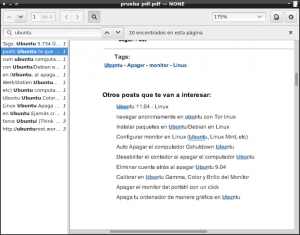](images/8-Comprobación-efectividad-del-reconocimiento-de-texto.png)

Como se puede ver en la imagen **he abierto el pdf que acabamos de generar y realizado una búsqueda de texto por la palabra Ubuntu**. Se puede observar que **el reconocimiento de la palabra es bueno y además la capa de texto y la capa de imagen del pdf están completamente sincronizadas**. Por lo tanto en este caso Gscan2pdf soluciona uno de los problemas que tenia OCRfeeder y significa que gscan2pdf es una herramienta ideal para hacer el reconocimiento ocr de documentos extensos, guardarlos en formato pdf y hacer búsquedas a posteriori por palabras clave para poder acceder al contenido que nos interesa de forma inmediata.

## EXTRAER TEXTO A UN ARCHIVO CON FORMATO EDITABLE

Ahora **lo que haremos es extraer el texto reconocido en un archivo de texto para poder editarlo y hacer lo que queramos con él**. Para ello seguimos los siguientes pasos:

1. **Apretamos de nuevo al icono** **Guardar** que aparece en la barra de herramientas de Gscan2pdf.
2. Seguidamente **seleccionamos el formato de archivo al que queremos exportar los resultados** que en mi caso es **Texto**.
3. El siguiente paso es **elegir la ubicación donde queremos guardar el archivo de texto y ponerle un nombre**. En mi caso guardaré el archivo en el escritorio con el nombre prueba texto.
4. Para finalizar ya solo tenemos que **presionar el botón** **Guardar**.

Seguidamente **vamos a la ubicación donde se ha guardado el archivo de texto y lo abrimos**. Pero resulta que la última versión de Gscan2pdf (la 1.2.5) está “mal diseñada” porqué le hemos indicado que queríamos la salida en formato texto y el formato real **en el caso de los motores tesseract, OCRopus y cuneiform** es hocr. Como consecuencia **al abrir el archivo que tenemos en el escritorio solo veremos código y no veremos ningún fragmento del texto que estamos buscando**.

###### Nota: Según ha indicado el desarrollador de la aplicación este problema será solucionado en futuras versiones incluyendo 2 nuevas opciones en el menú de guardar. Una  de las opciones será para guardar en formato texto y la otra para guardar en formato hocr.

###### Nota: Si el reconocimiento se ha realizado con Gocr no hay problema alguno y podrán abrir el archivo de texto sin ningún tipo de problema.

En el caso que el reconocimiento lo hayan realizado con los motores Tessract, OCRopus o Cuneiform hay una solución simple. **Para solucionar el pequeño inconveniente** que acabamos de citar tienen que ir a la ubicación donde guardaron el archivo de texto. Una vez estén en la ubicación, tal y como se puede ver en la captura de pantalla, **cambian la extensión del archivo de **.txt** a **.html****.

[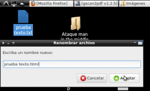](images/9-Renombrar-archivo-de-texto.png)

Una vez cambiada la extensión **hacen doble clic encima del archivo y verán que su navegador web predeterminado se abre con los resultados del reconocimiento óptico de caracteres**:

[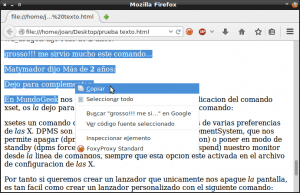](images/10-Comprobación-de-la-efectividad-en-texto.png)

Como podemos observar en la imagen los resultados son buenos. **Ahora podemos copiar el texto y pegarlo en cualquier editor de texto como** [Writer](http://es.libreoffice.org/ "Web de Libreoffice") o **Microsoft Word** para hacer lo que necesitemos con el.

**En el caso que reconocimiento óptico de caracteres se haya realizado con el motor** [cuneiform](https://www.gnu.org/software/ocrad/ocrad.html "Web del motor OCR Cuneiform") podemos abrir el fichero ****.html**** **directamente con Libreoffice (writer) y obtendremos el siguiente resultado**:

[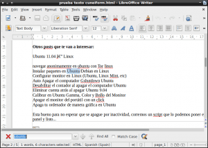](images/11-Comprobación-en-cuneiform.png)

Obviamente Gscan2pdf ofrece más funcionalidades que las que describo en el post, pero con lo detallado hasta el momento tenemos mas que suficiente para ir descubriendolas nosotros mismos poco a poco mientras usamos este software. Para finalizar el post les dejo con unas notas de piano del creador de gs2can2pdf. Espero que las disfruten.

[http://www.youtube.com/watch?v=WmYeFM6u6Y8](http://www.youtube.com/watch?v=WmYeFM6u6Y8 "Notas de piano de Jeffrey Radcliffe")
