En pasados vimos que es el OCR o reconocimiento óptico de caracteres. Además analizamos los usos que le podemos dar, las ventajas que nos proporciona y las limitaciones que tiene hoy en día. Sin entrar en mucho detalle también vimos que existen varios software de reconocimiento OCR libres. Para quien considere releer el post que menciono les dejo el siguiente [link](). En este post nos centraremos en explicar el funcionamiento de OCRfeeder que es uno de los software que en su día nombramos.<!--more-->

He preferido empezar por [OCRfeeder](https://wiki.gnome.org/action/show/Apps/OCRFeeder?action=show&redirect=OCRFeeder "Información sobre OCRFeeder") ya que **su funcionamiento es muy simple, requiere de pocas dependencias de instalación y además me parece una opción aceptable**. Cabe decir que en GNU-Linux existen otras opciones muy aceptables e incluso me atrevería a decir de mayor calidad como por ejemplo gscan2pdf o xsane. Quien en vez de usar OCRfeeder quiera usar la aplicación Gscan2pdf puede consultar el siguiente [enlace]().

## INSTALACIÓN DE OCRFEEDER

Lo primero que tenemos que hacer es instalar ocrfeeder y los motores de búsqueda OCR como por ejemplo [tesseract](https://code.google.com/p/tesseract-ocr/ "Web de desarrollo de Tesseract"), [gocr](http://jocr.sourceforge.net/ "Información sobre el motor de búsqueda Gocr"), [ocropus](https://code.google.com/p/ocropus/ "Información sobre el motor Ocropus"), [ocrad](https://www.gnu.org/software/ocrad/ocrad.html "Información sobre el motor Ocrad") o [cuneiform](http://en.openocr.org/ "Web del motor OCR Cuneiform"). Para ello **abrimos una terminal y tecleamos** el siguiente comando:

> ```
> sudo apt-get install ocrfeeder tesseract-ocr tesseract-ocr-spa tesseract-ocr-eng gocr cuneiform ocropusocrad
> ```

###### Nota: El paquete ocrfeedor corresponde al software de reconocimiento OCR. Los paquetes tesseract-ocr, gocr, cuneiform, ocrad y ocropus corresponden a los distintos motores de reconocimiento OCR. Los paquetes tesseract-ocr-spa y tesseract-ocr-eng corresponden a los motores de búsqueda español e inglés de tesseract.

En tesseract no solo están disponibles los motores de búsqueda en Inglés y en Español. **En tesseract tenemos una gran cantidad de idiomas disponibles**. Para que otros idiomas estén disponibles tan solo tendremos que instalar los paquetes pertinentes. **Para saber los paquetes que equivalen a cada idioma tan solo tienen que abrir la terminal y teclear el siguiente comando en la terminal:**

> ```
> apt-cache search tesseract-ocr
> ```

## EJECUTUAR OCRFEEDER

Para ejecutar el programa tan solo tenemos que abrir la terminal y **teclear el siguiente comando**:

> ```
> ocrfeeder
> ```

Presionamos la tecla **Enter** y ocrfeeder de se ejecutará. Si lo prefieren también pueden ejecutar el programa desde cualquier lanzador de aplicaciones o desde el menú del entorno de escritorio que usen.

## SELECCIONAR EL MOTOR DE RECONOCIMIENTO EN OCRFEEDER

Una vez se abra el programa, lo primero que tenemos que hacer es seleccionar el motor de búsqueda que queremos usar. Para ello tenemos **acceder al menú** **Editar** y seguidamente cuando aparezca el menú desplegable **seleccionar** **Preferencias**.

Se abrirá una ventana. Una vez abierta la ventana **seleccionamos la pestaña** **Herramientas**. En la pestaña herramientas veremos una opción que pone motor favorito. En esta opción, tal y como se puede ver en la captura de pantalla, seleccionaremos **Tesseract** y seguidamente presionaremos el botón **Aceptar**.

[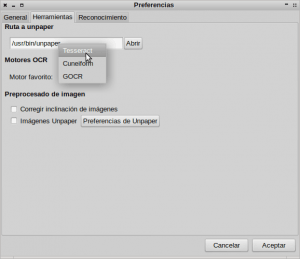](images/1-Seleccionar-motor-de-búsqueda.png)

###### Nota:  De la totalidad de motores disponibles usaremos el Tesseract. Elegimos Tesseract porqué es el motor OCR con el que se acostumbra a obtener mejores resultados de salida. Quien lo considere oportuno puede experimentar con otros motores.

###### Nota:  [Tesseract](https://code.google.com/p/tesseract-ocr/ "Web de desarrollo de Tesseract") es un motor OCR libre. Originariamente fue creado por Hewlett Packard en el año 1985, y en el año 2005 se libero su código para la comunidad. Actualmente Tesseract es desarrollado por google y es distribuido bajo licencia apache 2.0.

## SELECCIONAR EL IDIOMA DE TESSERACT

Tesseract por defecto hace el reconocimiento de texto considerando que el texto a reconocer está en Inglés. Por lo tanto, si no hacemos nada al respecto, cuando hagamos un reconocimiento de texto en español habrán ciertos caracteres que no aparecerán de forma adecuada como por ejemplo la ñ, y otras letras típicas del alfabeto español.

Para solucionar este problema tan solo **tenemos que activar el motor de reconocimiento en español**. Para ello nos **vamos al menú** **Herramientas**. Cuando se despliegue el submenú **seleccionamos la opción** **Motores OCR**. Tal y como se puede ver en la captura de pantalla **seleccionamos el motor** **Tesseract** y **presionamos el botón** de **Editar**:

[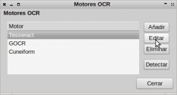](images/2-Editar-motor.png)

Una vez presionado el botón aparecerá una ventana para poder definir los argumentos de búsqueda del motor. **Lo único que tenemos que modificar es el texto que aparece en argumentos del motor**.

[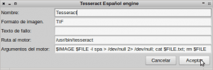](images/3-Tesseract-en-español.png)

Como se puede ver en la captura de pantalla, **el texto a introducir para cambiar el motor de búsqueda de inglés a español, es el siguiente**:

> ```
> $IMAGE $FILE -l spa > /dev/null 2>; cat $FILE.txt ; rm $FILE
> ```

Una vez modificados los argumentos del motor **presionamos la botón** **Aceptar** **y seguidamente** **Cerrar**.

Si en un futuro tenemos la necesidad de reconocer un texto en inglés, tendremos que sustituir solo la parte de color rojo del texto que acabamos de introducir. Así por lo tanto si quisiéramos reconocer texto en inglés en vez de español tendríamos que poner el siguiente comando en los argumentos del motor de Tesseract:

> ```
> $IMAGE $FILE -l eng > /dev/null 2>; cat $FILE.txt ; rm $FILE
> ```

## IMPORTAR IMÁGENES O ARCHIVOS A OCRFEEDER

Después de finalizar la configuración ya podemos empezar con la acción. En mi caso tengo un archivo jpg que tiene un texto escaneado en modo de imagen. Quiero que el texto en modo imagen se reconozca como texto editable para a posteriori poder editar el texto.

Para ello tal y como se puede ver en la captura de pantalla **presionaremos el símbolo** **+**:

[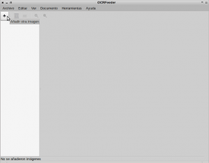](images/4-Añadir-archivo-de-imagen.png)

Seguidamente **seleccionamos el archivo de imagen que queremos abrir**. En mi caso he seleccionado abrir el archivo ejemplo.jpg

###### Nota: En el caso que sea necesario el software OCRfeeder permite escanear imágenes con nuestro propio escáner. Para ello tan solo tendríamos que acceder al menú **Archivo** y a posteriori tendríamos que seleccionar **Importar página del escáner**.

###### Nota: La opción mostrada en este apartado solo sirve para importar o abrir archivos de imagen (jpeg, tiff, gif, etc). En el caso que queramos abrir o importar un archivo en formato pdf tenemos que hacer lo siguiente. Accedemos al menú **Archivo**. Seguidamente seleccionamos la opción **Importar PDF**. Se abrirá una ventana en la que simplemente tendremos que seleccionar el pdf que queremos abrir.

## POSTPROCESADO DE IMAGEN ANTES DE RECONOCER EL TEXTO EN OCRFEEDER

El procesado de la imagen tiene como fin retocar la imagen para obtener mejor resultado en el reconocimiento óptico de caracteres. Las veces que he usado OCRfeeder sin hacer el postprocesado de la imagen he obtenido unos resultados excelentes, por lo tanto si no se realiza este paso en principio deberíamos seguir obteniendo unos resultados adecuados.

Si alguien considera necesaria su realización tan solo tienen que **acceder al menú** **Herramientas**. Una vez dentro del menú Herramientas **seleccionan la opción** **Unpaper**. Una vez seleccionado la opción unpaper aparecerá la siguiente pantalla:

[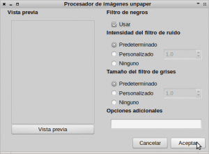](images/5-Configuración-de-unpaper.png)

En la pantalla **encontraran distintas opciones y filtros para retocar la imagen en la que queremos realizar el reconocimiento óptico de caracteres. Recomiendo no complicarse la vida y usar los valores predeterminados** de la aplicación. Una vez seleccionados los valores **presionamos  el botón de** **Aceptar**.

###### Nota: Si los resultados del reconocimiento de texto no son buenos podemos intentar modificar los valores estándar de unpaper para ver si podemos conseguir mejores resultados.

## RECONOCIMIENTO DE TEXTO

Una vez abierto el archivo ya podemos iniciar el reconocimiento del texto. Para ello, tal y como se puede ver en la captura de pantalla, tienen que **pulsar sobre el icono de** **Detectar y reconocer automáticamente todas las páginas**:

[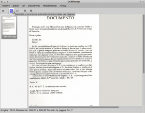](images/6-Reconocimiento-de-texto.png)

###### Nota:   En el caso que el documento tenga muchas páginas es posible realizar el OCR solo de determinadas áreas. Para ello tan solo tienen que seleccionar la área en la que se quiere reconocer el texto. En la parte derecha de la pantalla aparecerá un cuadro. En la opción Tipo seleccionan texto y en el campo Motor OCR seleccionan el motor que queremos y presionamos el botón OCR. En el vídeo que encontraran al final del articulo podrán ver claramente como se realiza este paso.

Una vez iniciado el reconocimiento tendrán que esperar unos segundos o minutos en función del número de páginas y de la cantidad de texto a reconocer.

## EXPORTAR EL TEXTO A FORMATO ODT

Una vez terminado el reconocimiento tan solo nos falta exportar el resultado al formato de archivo que mas nos convenga.

En el caso que se necesite exportar el archivo a la extensión .odt, tal y como se puede ver en la captura de imagen, tan solo tienen que **presionar encima del icono de** **Exportar a ODT**:

[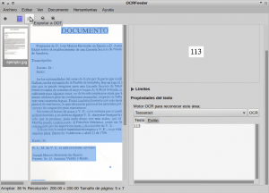](images/7-Exportar-a-ODT.png)

Una vez presionado el botón tendremos que **definir el nombre con el que queremos guardar el archivo, y la ubicación donde lo queremos guardar**. En mi caso el nombre seleccionado ha sido resultado final odt.odt y lo he guardado en mi home.

**Una vez guardado el archivo tan solo tenemos que abrirlo y comprobar el resultado obtenido.**

[](images/Comprobación-de-los-resultados-OCR.png)

Como se puede observar en la captura de pantalla, el resultado obtenido es excelente reconociendo a la perfección la totalidad del texto.

## EXPORTAR EL TEXTO RECONOCIDO A FORMATO PDF, TEXTO PLANO O HTML

Si por lo contrario queremos exportar el texto reconocido a otro formato de archivo diferente al formato odt, lo podemos realizar de la siguiente forma:

Una vez reconocido el texto, tal y como se puede ver en la captura de pantalla, **accedemos al menú** **Archivo** **y** a posteriori **seleccionamos la opción** **Exportar**.

[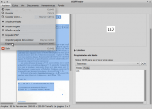](images/9-Exportar-pdf.png)

Una vez seleccionada la opción exportar, aparecerá una ventana en la que que deberemos **seleccionar el formato de archivo que queremos**. Para elegir tenemos las opciones PDF, ODT, Texto plano y HTML. **En mi caso** tal y como se puede ver en la captura de pantalla **he seleccionado pdf y he presionado la tecla** **Aceptar**. Si queréis exportarlo a otro formato de archivo tan solo tenéis que seleccionar la opción que más os convenga.

[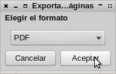](images/10-Seleccionar-pdf.png)

Seguidamente nos aparecerá otra ventana en la que **se nos ofrece 2 opciones a elegir**:

[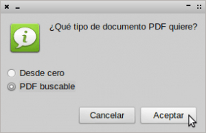](images/11-PDF-buscable.png)

Como se puede ver en la captura de pantalla las opciones a elegir son **Desde Cero** o **PDF Buscable**. **Elegiremos la opción** **PDF Buscale** **y presionaremos el botón** **Aceptar**. He seleccionado esta opción porqué nos permitirá tener un pdf en modo de imagen, pero debajo de la capa de imagen habrá una capa de texto que nos permitirá hacer búsquedas de texto en el pdf.

Una vez apretado el botón Aceptar tan solo resta **definir donde guardaremos el archivo y con que nombre lo guardaremos**. Una vez realizado esto ya podemos observar el resultado que hemos obtenido:

[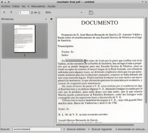](images/12-Resultado-del-pdf.png)

Como se puede ver en la imagen el resultado obtenido en este caso es más que aceptable. Dispongo de un pdf en modo imagen y por detrás de la imagen dispongo de una capa de texto que me permite realizar búsquedas en el pdf.

###### Nota: En esta última opción que acabamos de ver OCRfeeder para mi gusto tiene un inconveniente gordo. En la mayoría de casos la capa de texto y la capa de imagen del pdf no se sincroniza. Esto significa es posible que cuando hagamos una búsqueda de una palabra, el texto real esté en la mitad de la página del pdf mientras que la palabra en modo imagen esté justo al final. Me puse en contacto con el desarrollador y pienso que por la respuesta que me dio no esta muy dispuesto a corregir este punto ya que me dio una respuesta para escurrir el bulto. Otras opciones como Gscan2pdf no tienen este problema. Para quien este interesado en usar Gscan2pdf puede clicar en el siguiente [enlace](),

## VIDEO DEMOSTRATIVO POR PARTE DEL CREADOR DE OCRFEEDER

He intentado que la explicación fuera clara. No obstante pienso que hay detalles que se pueden apreciar mejor en el vídeo que se muesta a continuación:

[http://vimeo.com/3760126](http://vimeo.com/3760126 "Vídeo demostrativo del funcionamiento de OCRFEEDER")

El vídeo tiene sus años pero me parece aún útil para entender el funcionamiento de OCRfeeder. Además el vídeo tiene la ventaja que ha sido realizado por el mismo creador del software.
