A continuación veremos el uso que tiene y como podemos configurar y utilizar la extensión Firefox Multi-Account Containers. Verán que es un extensión extremadamente útil y que además nos ofrece la garantía que ha sido desarrollada por la fundación Mozilla.<!--more-->

## UTILIDAD DE LA EXTENSIÓN FIREFOX MULTI-ACCOUNT CONTAINERS

La extensión Firefox multi-account container n**os permitirá tener varios navegadores en un solo navegador**. Entre otras cosas la extensión nos proporcionará las siguientes funciones y ventajas:

1. Permite **loguearse y usar varias cuentas de un mismo servicio de forma simultanea** en nuestro navegador Firefox. De este modo podremos tener varias cuentas de Gmail abiertas y usarlas de forma simultánea evitando tener que cambiar de cuenta constantemente. Ya no será nunca más necesario tener un navegador para consultar un determinado servicio y otro navegador para consultar el mismo servicio con otra cuenta.
2. Todos los servicios y web que se abran en un contenedor quedarán confinados en el contenedor en el que está abierto. Por lo tanto todas las cookies que se descarguen en un contenedor no estarán disponibles en otros contenedores. Esto es positivo en términos de privacidad ya que **en cierto modo podremos evitar los problemas generados por las cookies de terceros**. Además si segmentamos nuestras actividades por contenedores las compañías que nos rastrean no podrán obtener un perfil completo de nosotros. Si no usamos contenedores las compañías que recopilan información obtendrán un perfil único sobre nosotros, pero si segmentamos nuestra actividad en por ejemplo 10 contenedores obtendrán 10 perfiles distintos y no podrán asociar que estos 10 perfiles pertenecen a una misma persona.
3. Permite **clasificar y organizar las actividades que realizamos en el navegador**. Por lo tanto podemos crear un contenedor para realizar las compras, otro para acceder a la totalidad de servicios de Facebook, uno dedicado a labores profesionales, etc.

Como ven se trata de una extensión interesante y además puedo decir que está bien implementada y es muy fácil y práctica de usar.

## INSTALAR LA EXTENSIÓN FIREFOX MULTI-ACCOUNT CONTAINERS

El procedimiento para instalar la extensión es extremadamente sencillo. Tan solo tenemos que acceder a la siguiente URL:

[https://addons.mozilla.org/es/firefox/addon/account-containers/](https://addons.mozilla.org/es/firefox/addon/multi-account-containers/)

Una vez dentro de la URL clicaremos encima del botón **Agregar a Firefox**.

[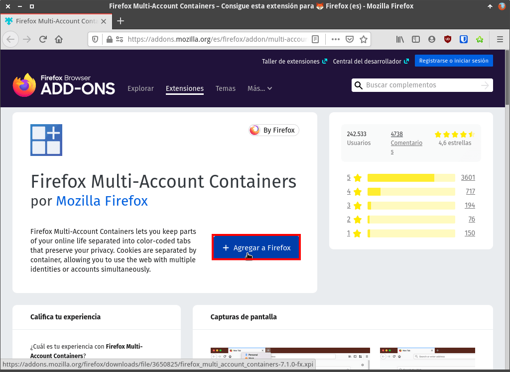](images/Agregar-Fifefox-Multi-account-containers-a-Firefox.png)

Finalmente tendremos que presionar encima del botón **Añadir** para dar permiso a la instalación de la extensión.

[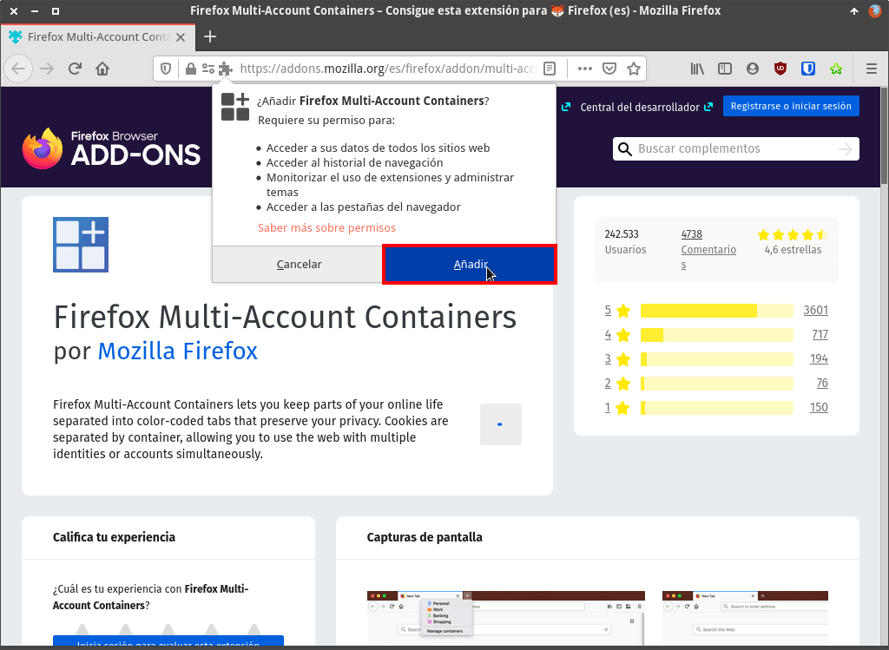](images/dar-permiso-de-instalacion-a-firefox-multiaccount-containers.png)

## COMO CONFIGURAR Y USAR LA EXTENSIÓN FIREFOX MULTI-ACCOUNT CONTAINERS

En estos momentos ya podemos empezar a utilizar la extensión. La forma en que podéis empezar a usar la extensión se detalla a continuación.

### Crear un contenedor para abrir las pestañas que consideremos oportunas

La extensión tiene 4 contenedores preconfigurados. No obstante en mi caso crearé un nuevo contenedor en el que abriré todos los servicios y webs relacionados con el blog Geekland. Para ello posicionaré el puntero del ratón encima del botón **Abrir pestaña**. Acto seguido presionaré el botón derecho del ratón y cuando aparezca el menú contextual clicaré encima de la opción **Administrar contenedores**.

[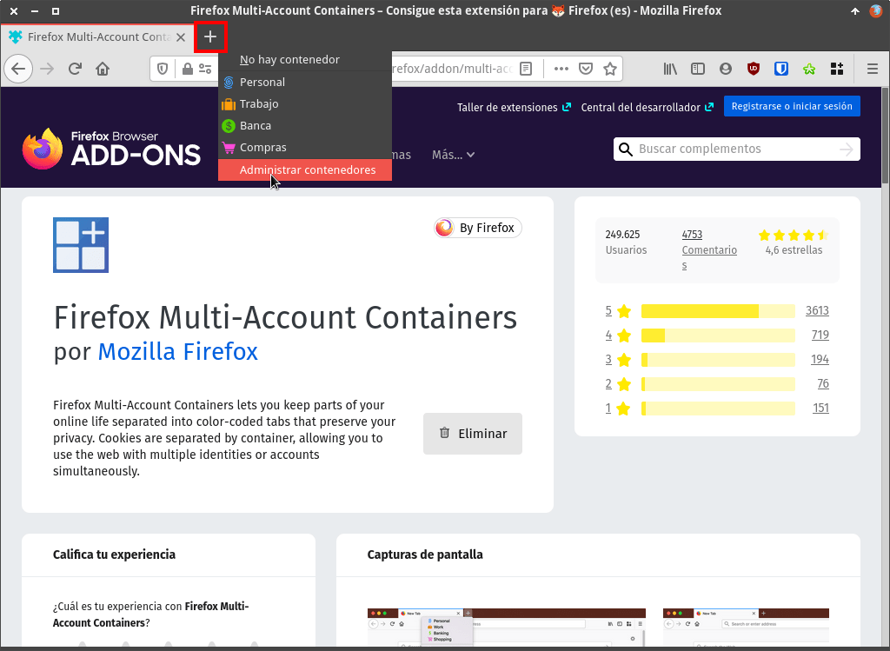](images/administrar-contenedores.png)

A continuación clicaremos sobre el botón **Añadir nuevo contenedor**.

[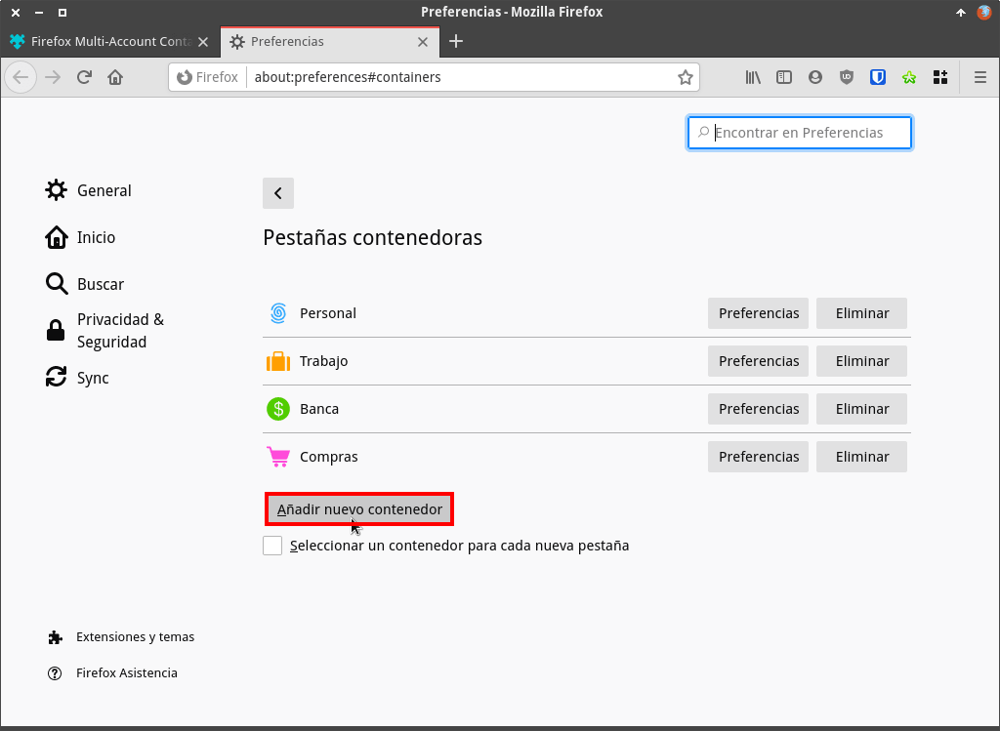](images/anadir-nuevo-contenedor.png)

Finalmente seleccionaremos un nombre, un color y un icono para el contenedor. Una vez lo hayamos definido todo presionamos encima del botón **Hecho** y se creará el contenedor.

[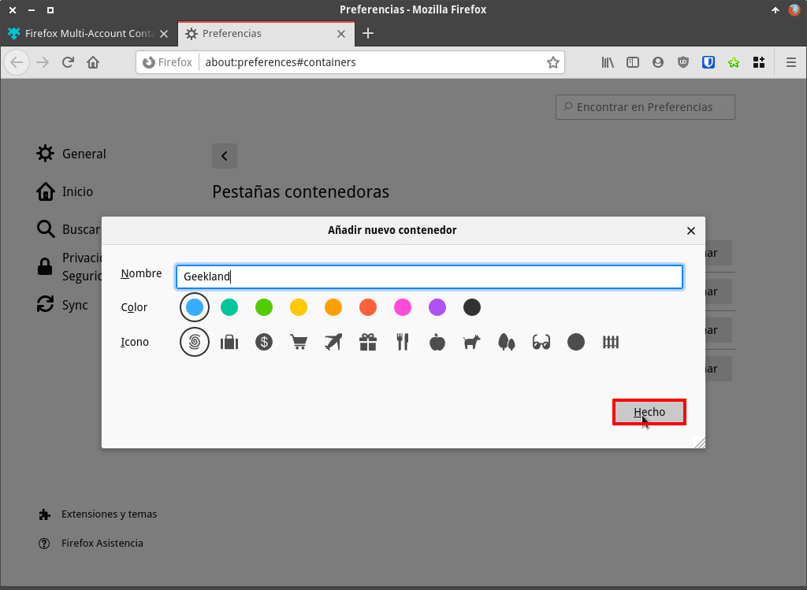](images/crear-contenedor.png)

### Abrir una determinada web en el contenedor que acabamos de crear

A continuación ya podemos abrir el primera pestaña dentro del contenedor Geekland que acabamos de crear. Para ello posicionaré el puntero del ratón encima del botón Abrir pestaña. Acto seguido presionaré el botón derecho del ratón y cuando aparezca el menú contextual clicaré encima del nombre del contenedor Geekland.

[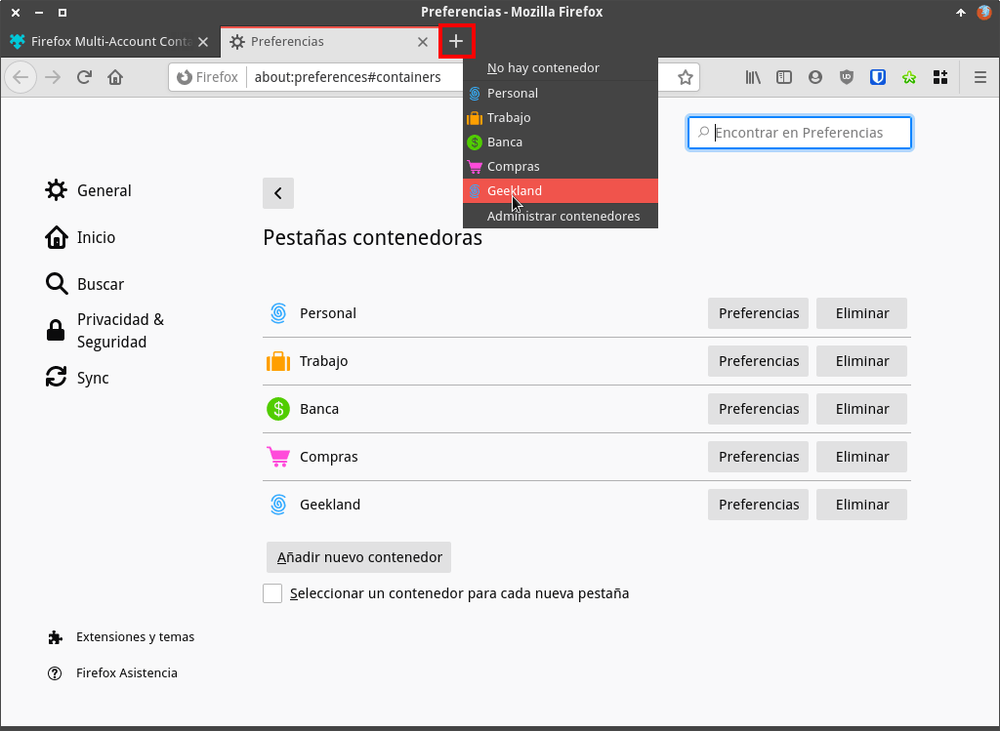](images/abrir-pestana-dentro-del-contenedor.png)

Acto seguido se abrirá una nueva pestaña dentro del contenedor Geekland. Si se fijan la pestaña será coloreada y en la barra de búsqueda se indicará claramente que estamos en el contenedor Geekland. Una vez dentro de la pestaña accedemos a nuestra cuenta de Gmail.

[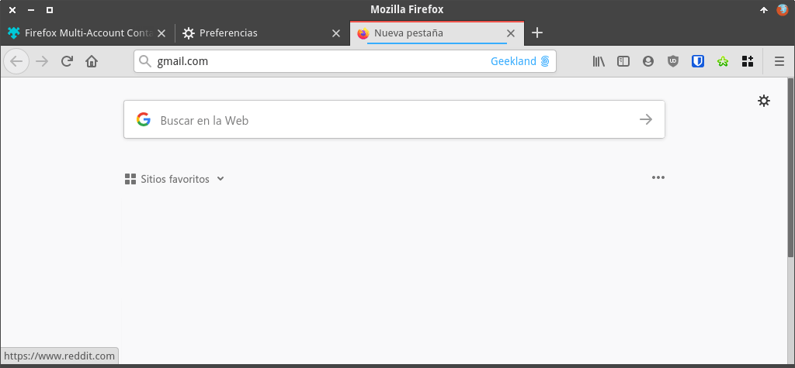](images/acceder-a-gmail.png)

En el contenedor Geekland nunca antes hemos accedido a una cuenta de Gmail. Por lo tanto en el momento de acceder a la cuenta de gmail nos tendremos que loguear.

[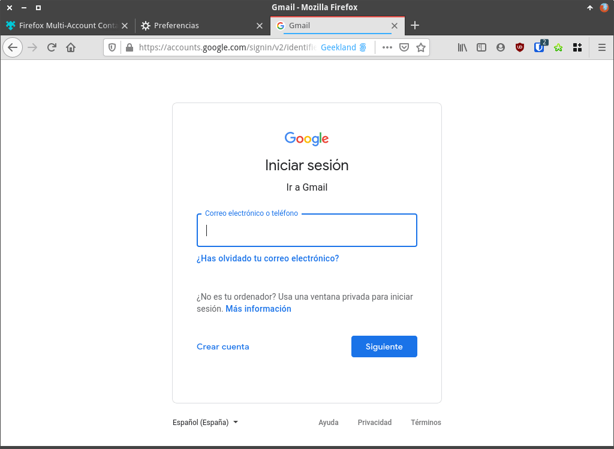](images/loguearse-a-gmail.png)

Justo después de loguearnos podremos ver el contenido de nuestro correo electrónico.

[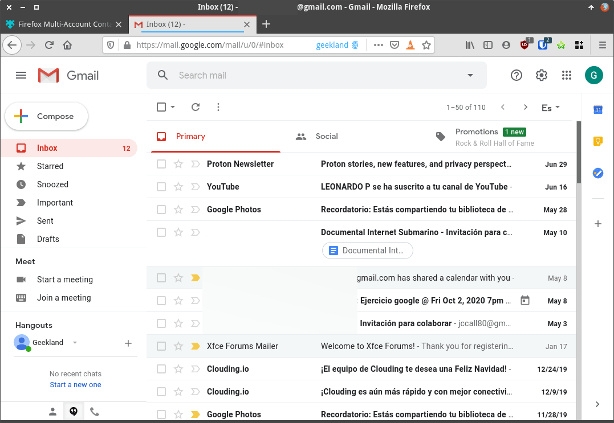](images/dentro-de-gmail.png)

Si ahora abrimos el servicio Gmail en otro contenedor o fuera de un contenedor veremos que podremos acceder con otra cuenta diferente a la que hemos usado en el contenedor Geekland. En la siguiente captura de pantalla pueden ver que que tengo abiertas 2 cuentas de Gmail de forma simultanea en Firefox.

[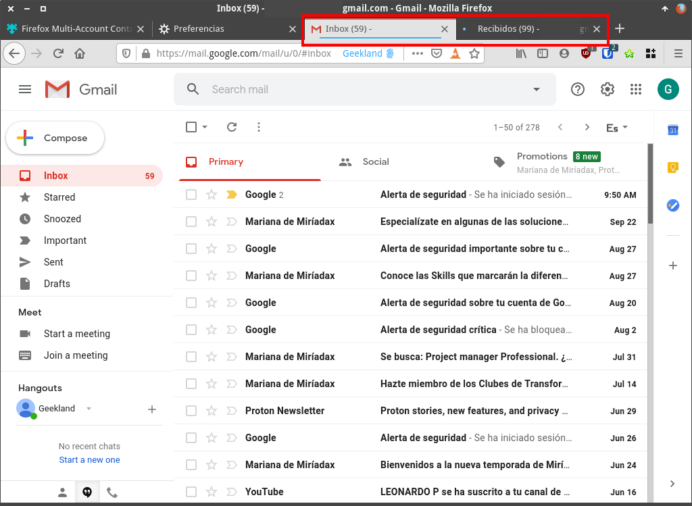](images/2-cuentas-email-forma-simultanea.png)

### Hacer que un servicio se abra siempre en un contenedor determinado

La extensión Firefox multi-account containers permite abrir el servicio que nosotros queramos dentro del contenedor que nosotros queramos. Por lo tanto si queremos que siempre que accedamos a Gmail se abra la cuenta de correo de mi blog y además lo haga dentro del contenedor Geekland procederé del siguiente modo.

Una vez tengamos abierta la cuenta de gmail de mi blog dentro del contenedor de Geekland presiono el botón Multi-Account containers. Cuando se despliegue el menú clico en el botón **Always Open This Site in...**

[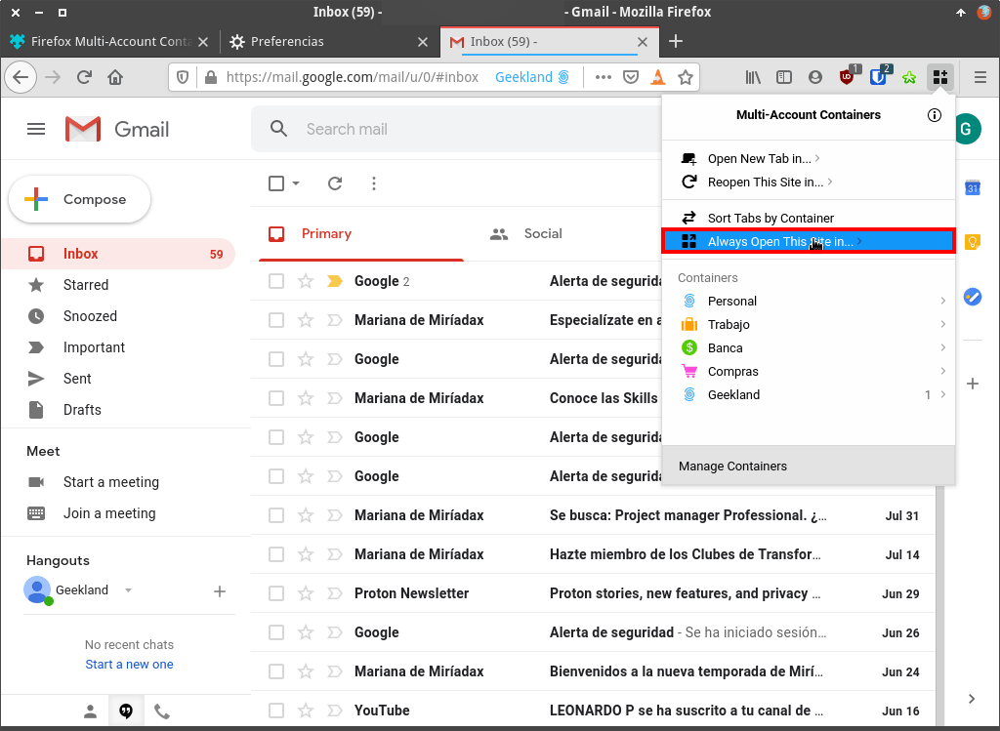](images/Siempre-abrir-con-este-contenedor.png)

A continuación clico encima del contenedor con el que quiero abrir el servicio de Gmail al que estoy actualmente logueado. En mi caso clico encima del contenedor Geekland.

[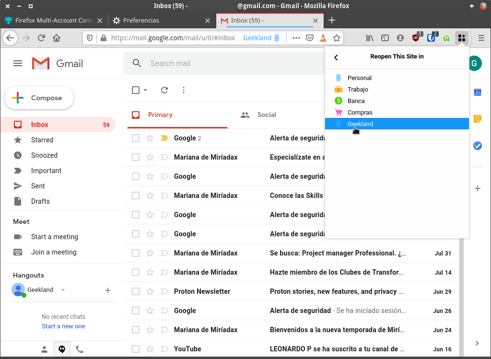](images/siempre-abrir-en-geekland.png)

A partir de estos momentos si abro una pestaña cualquier y accedo a Gmail veré la siguiente pantalla. Cuando no salga tendremos que tildar la opción **Remember my decision for this site** y presionar encima del botón **Open in Geekland Container**.

[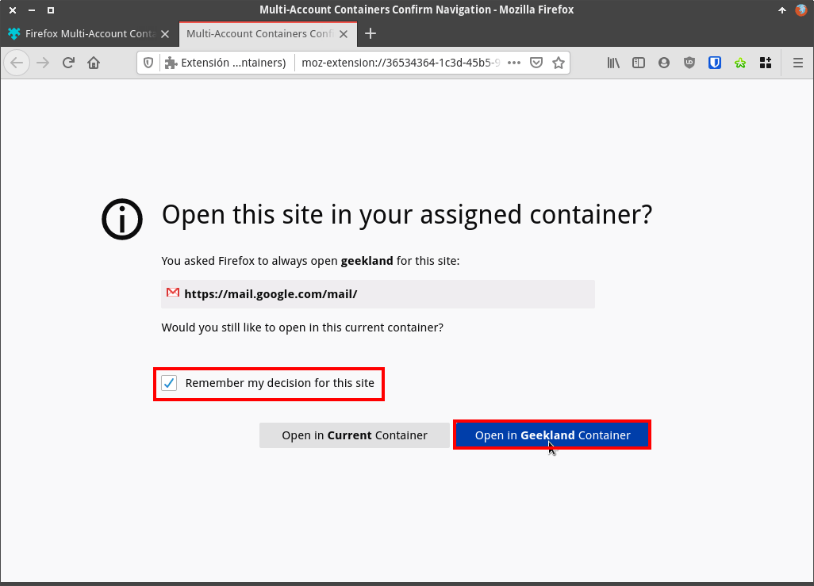](images/confirmar-que-un-servicio-se-abra-en-un-determinado-contenedor.png)

Acto seguido se abrirá gmail. A partir de ahora siempre que accedamos a gmail se abrirá el contenedor Geekland y estaremos automáticamente logueados a la cuenta de Geekland.

### Hacer que cada vez que abramos una pestaña nos pida seleccionar un contenedor

Una forma para abrir el contenedor que nosotros queremos es posicionar el puntero del ratón encima del botón Abrir pestaña y presionar el botón derecho del ratón. Acto seguido aparecerá un menú y clicamos encima del contenedor en que queremos abrir la pestaña.

Si queremos modificar este comportamiento y que cada vez que abramos una pestaña de forma natural nos pida al contenedor que queremos acceder tendremos que hacer lo siguiente.

Acto seguido tildamos la opción **Seleccionar un contenedor para cada nueva pestaña**.

[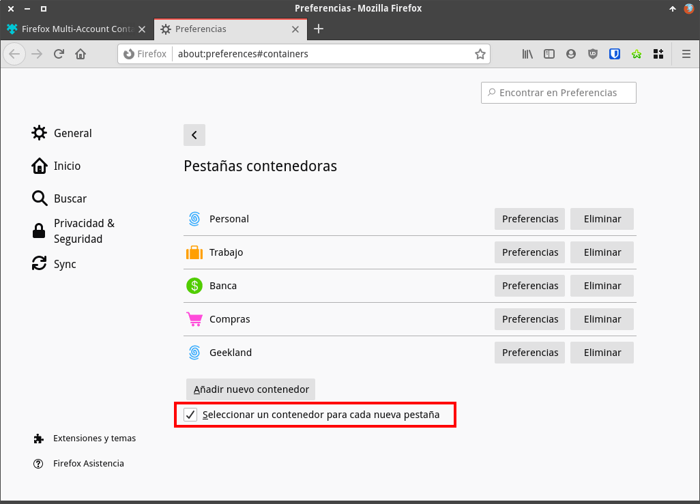](images/seleccionar-contenedor-para-nueva-pestana.png)

A partir de ahora si abrimos una pestaña tal presionando el botón de abrir ventana se desplegará un menú para que seleccionamos el contenedor con el que queremos abrir la nueva pestaña.

### Agrupar las pestañas por contenedores

Si tenemos abiertas muchas pestañas y las queremos agrupar por contenedores tan solo tenemos que clicar encime del botón Multi-Account containers y cuando se abra el menú presionar encima de la opción Sort Tabs by Container.

[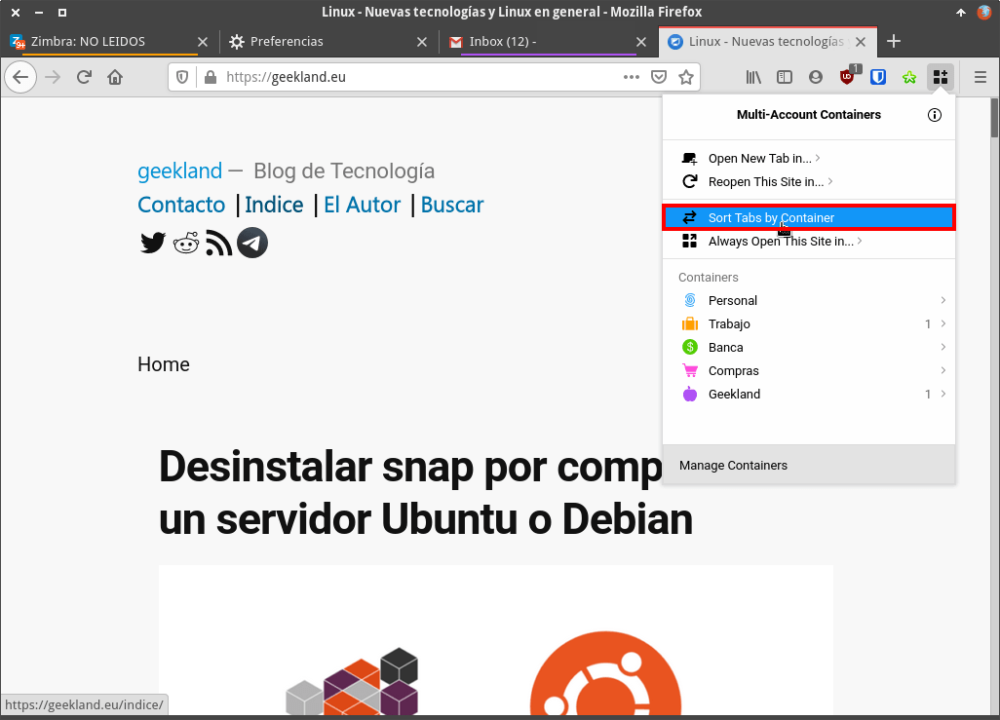](images/ordenar-pestanas-por-contenedor.png)

**Nota**: La extensión tiene otras opciones que no se detallan en el artículo. No obstante no hace falta explicación que que probando la extensión vosotros mismos podréis descubrir la totalidad de funcionalidades.

## CONCLUSIONES SOBRE LA EXTENSIÓN FIREFOX MULTI-ACCOUNT CONTAINERS

Como han visto en el artículo Firefox multi-account containers es una extensión realmente útil y que en mi caso le daré una oportunidad. A partir de hoy me forzaré a configurarla y a usarla e intuyo que se quedará en mi navegador.

Quien no use Firefox y por ejemplo use Google Chrome podrá hacer algo similar mediante los perfiles de Google Chrome o mediante la extensión SessionBox. No obstante ninguna de las 2 opciones mencionadas llegará a ser lo mismo que Firefox multi-account containers.
