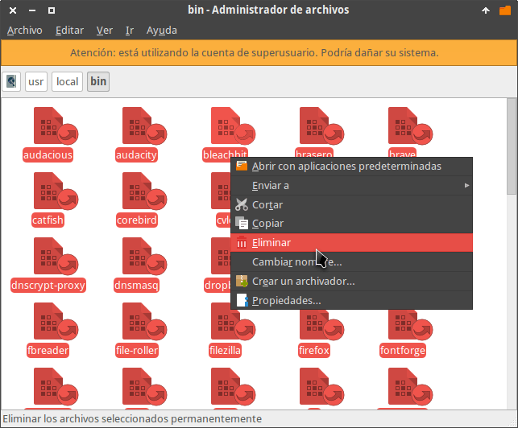

En el pasado explicamos de forma simplificada [que es un sandbox y los posibles]() usos que le podemos dar. A raíz de este post, a continuación veremos como usar un sandbox llamado Firejail en Linux.<!--more-->

## ALGUNOS DATOS SOBRE EL SANDBOX FIREJAIL

Firejail en un programa que utiliza SUID (Set user ID), los espacios de nombres del kernel Linux (Linux Namespaces) y seccomp-bpf para crear un sandbox. De esta forma podremos ejecutar cualquier tipo de programa de forma segura en un entorno controlado.

Podemos usar Firejail en multitud de programas y aplicaciones. Algunos ejemplos son los siguientes:

1. En aplicaciones gráficas como por ejemplo un navegador web, un programa para descargar Torrent, en Skype, en un reproductor de vídeo como VLC, etc.
2. En programas que se ejecutan en un servidor y a través de la terminal como por ejemplo el servidor web apache.

Por la experiencia que he tenido con este sandbox puedo afirmar lo siguiente:

1. Es ligero. La velocidad de ejecución de los programas dentro del sandbox es la misma que fuera del sandbox.
2. Al arrancar el ordenador no se cargan procesos adicionales en memoria. Por lo tanto podemos instalar Firejail con total tranquilidad porque únicamente consumirá recursos en el momento de generar y cargar el programa en el sandbox.
3. El programa prácticamente no tiene dependencias. Por lo tanto la cantidad de paquetes que instalaremos será mínima.
4. Su uso es extremadamente sencillo. Incluso un usuario básico puede usar este sandbox.

## INSTALAR EL SANDBOX FIREJAIL EN LINUX

Para instalar el sandbox y usarlo exclusivamente a través de la terminal tenemos que ejecutar el siguiente comando en la terminal:

> ```
> sudo apt-get install firejail
> ```

Si además queremos disponer de una interfaz gráfica para gestionar nuestro sandbox ejecutaremos el siguiente comando en la terminal:

> ```
> sudo apt-get install firetools
> ```

###### Nota: En este artículo nos focalizaremos en el uso de Firejail a través de la terminal. El motivo es sencillo, la terminal ofrece muchas más opciones que la interfaz gráfica.

## INSTRUCCIONES PARA USAR FIREJAIL EN LA TERMINAL

Las instrucciones a seguir para gestionar nuestro sandbox a través de la terminal son las siguientes:

### Los perfiles de configuración de Firejail

Firejail incluye perfiles de configuración predeterminados para multitud de programas en Linux. En estos perfiles de configuración es donde se definen las propiedades para aislar el programa del resto del sistema operativo. En estos ficheros de configuración podemos definir parámetros como por ejemplo:

1. Las carpetas de nuestro sistema de archivos a las que tendrá acceso el programa que se ejecuta en el sandbox.
2. Los permisos que tendrá el programa sobre ciertos directorios de nuestro sistema operativo.
3. Si lo programas tienen acceso al servidor de sonido.
4. Deshabilitar la aceleración 3D de un programa en concreto.
5. Usar unos DNS específicos para un programa usado dentro del sandbox.
6. Determinar si el programa tendrá acceso a Internet.
7. Etc.

Para ver la totalidad de perfiles disponibles podemos ejecutar el siguiente comando en la terminal:

> ```
> ls /etc/firejail/
> ```

### Modificar los perfiles de configuración estándar

Si queremos modificar alguna característica de un perfil estándar tenemos que acceder a su código y modificarla. A modo de ejemplo, para modificar el código del perfil de Firefox deberíamos ejecutar el comando:

> ```
> sudo nano /etc/firejail/firefox.profile
> ```

Una vez abierto el editor de texto deberemos modificar los parámetros pertinentes. Para conocer la totalidad de parámetros existentes y su funcionalidad les recomiendo que abran un terminal y ejecuten el siguiente comando:

> ```
> man 5 firejail-profile
> ```

Después de ejecutar el comando obtendrán una explicación detallada de todos los parámetros de configuración que podemos usar con Firejail.

### Crear perfiles de programas que están no disponibles

Firejail dispone de perfiles de configuración para más de 300 programas. No obstante, puede darse el caso que tengamos que ejecutar un programa que no no disponga de ningún perfil. En tal caso se usará un perfil estándar.

Si el perfil estándar no es de nuestro agrado podemos crear/modificar un perfil de configuración para el programa en cuestión. Para ello les recomiendo que sigan las instrucciones de los siguientes enlaces:

- [Crear perfiles personalizados](https://firejail.wordpress.com/documentation-2/building-custom-profiles/ "Crear un perfil a partir de un perfil")

De esta forma relativamente simple crearemos perfiles de configuración adaptados a nuestras necesidades para la totalidad de nuestros programas.

Si no queremos crear nuestros propios perfiles podemos usar los que podéis encontrar en los siguientes enlaces:

- [https://github.com/chiraag-nataraj/profiles](https://github.com/chiraag-nataraj/firejail-profiles "URL que contiene perfiles de Firejail")
- [https://github.com/nyancat18/fe](https://github.com/nyancat18/fe "URL que contiene perfiles de Firejail")

### Ejecutar un programa dentro del sandbox

Ejecutar un programa en el sandbox es fácil gracias a los perfiles de configuración que hemos visto en el apartado anterior.

Para abrir un programa en el sandbox tan solo tenemos que abrir una terminal y teclear firejail seguido del comando que usaríamos para ejecutar el programa desde la terminal. Por lo tanto, para ejecutar Firefox en el sandbox ejecutaríamos el siguiente comando en la terminal:

> ```
> firejail firefox
> ```

Al ejecutar el comando arrancará Firefox dentro dentro del sandbox. Al no indicar ningún tipo de parámetro se iniciará con la configuración predeterminada de Firefox.

### Ejecutar un programa modificando la configuración estándar

Es posible iniciar un programa añadiendo/modificando algunas de las configuraciones que figuran en el perfil de configuración.

Para ello ejecutaremos el comando firejail seguido las opciones para modificar provisionalmente el perfil del programa más el comando para ejecutar el programa en la terminal. Por lo tanto, si queremos ejecutar VLC sin que tenga acceso a internet ejecutaremos el siguiente comando:

> ```
> firejail --net=none vlc
> ```

Si queremos que vlc siempre arranque de este modo podríamos realizar las siguientes modificaciones.

Primero creamos la carpeta que alojará los ficheros que modificaran la configuración estándar de un programa determinado. Para ello ejecutamos el siguiente comando en la terminal:

> ```
> mkdir ~/.config/firejail/
> ```

Seguidamente creamos el fichero que modificará la configuración predeterminada de VLC ejecutando el siguiente comando en la terminal:

> ```
> nano ~/.config/firejail/vlc.profile
> ```

###### Nota: El nombre del fichero tiene que ser el mismo que el nombre del perfil estándar.

Una vez se abra el editor de textos pegamos el siguiente código:

> ```
> include /etc/firejail/vlc.profile
> net none
> ```

La primera línea contiene la palabra include seguida de la ruta que contiene el perfil estándar que queremos modificar. La segunda línea contiene los nuevos parámetros de configuración que queremos aplicar. Una vez realizados los cambios los guardamos y cerramos el fichero.

La próxima vez que arranquemos VLC en el sandbox, no tendrá acceso a internet. Por lo tanto, VLC únicamente será útil para reproducir ficheros de vídeo y sonido locales.

### Ejecutar un programa en modo privado

Firejail nos permite ejecutar programas en modo privado. Este modo tiene las siguientes particularidades:

1. Es la opción que ofrece más seguridad para ejecutar un programa o para acceder a nuestras cuentas bancarias.
2. El modo privado utiliza la configuración estándar de un programa. Por lo tanto, si abrimos Google Chrome en modo privado dispondremos de la configuración estándar de Chrome sin ninguna extensión instalada. Esto puede resultar útil porque cuantas más extensiones usemos y más modifiquemos la configuración, más inseguro estamos haciendo nuestro navegador.
3. El programa se ejecuta en un sistema de ficheros temporal (tmpfs). Por lo tanto absolutamente todos los ficheros que se almacenen en el sistema de archivos temporal serán borrados al cerrar nuestro sandbox.
4. Este modo permite ejecutar programas sin necesidad de modificar ningún archivo en nuestro disco duro.

Para ejecutar el navegador Google Chrome en modo privado y forzando que se utilicen por defecto los dns de Google ejecutaremos el siguiente comando en la terminal:

> ```
> firejail --private --dns=8.8.8.8 --dns=8.8.4.4 google-chrome
> ```

Este ejemplo que acabamos de ver es una buena solución en el caso que queramos acceder nuestras cuentas bancarias de forma segura a través de Internet.

### Hacer que los programas dentro del sandbox tengan su propia red

Mediante Macvlan existe la posibilidad que los programas ejecutados en el sandbox tengan una ip interna distinta a la de nuestro ordenador, un firewall propio, su propia tabla ARP, etc.

Para ello tenemos que ejecutar un comando del siguiente estilo:

> ```
> firejail --net=nombre_interfaz_de_red nombre_del_programa
> ```

Por lo tanto, si nuestra interfaz de red es eth0 y queremos ejecutar Firefox con una IP interna distinta a la de nuestro ordenador ejecutaremos el siguiente comando:

> ```
> firejail --net=eth0 firefox
> ```

Si además queremos definir una IP concreta podemos ejecutar el siguiente comando:

> ```
> firejail --net=eth0 --ip=192.168.1.80 firefox
> ```

###### Nota: Esta opción únicamente funciona para redes cableadas. Actualmente no está soportado en redes inalámbricas.

### Limitar el ancho de banda de un programa que se ejecuta dentro del sandbox

Si nos apetece también podemos limitar el ancho de banda que consumen los programas que se ejecutan dentro del sandbox. Para ello deberemos seguir las siguientes instrucciones:

Primero crearemos una sandbox con nombre navegador y una interfaz de red propia para arrancar Firefox. Para ello ejecutaremos el siguiente comando en la terminal:

> ```
> firejail --name=navegador --net=eth0 firefox
> ```

A continuación abriremos otra terminal y limitaremos el ancho de banda del sandbox navegador ejecutando el siguiente comando en la terminal:

> ```
> firejail --bandwidth=navegador set eth0 80 20
> ```

De este modo estamos aplicando la siguiente limitación:

1. La velocidad máxima de descarga de Firefox será de 80 kilobytes.
2. La velocidad de subida máxima será de 20 kilobytes por segundo.

Si en algún momentos queremos eliminar los límites de velocidad impuestos, tan solo tenemos que ejecutar el siguiente comando:

> ```
> firejail --bandwidth=navegador clear eth0
> ```

### Comprobar que un programa se está ejecutando dentro del sandbox

Para comprobar que un programa se está ejecutando dentro del sandbox tan solo tenemos que ejecutar el siguiente comando:

> ```
> firejail --list
> ```

Después de ejecutar el comando obtendréis un resultado parecido al siguiente:

> ```
> joan@debian:~$ firejail --list
> 5394:joan:firejail firefox 
> 5628:joan:firejail vlc 
> 5735:joan:firejail --list
> ```

Observando el resultado podemos ver que los programas que estamos ejecutando son firefox y vlc.

### Ver los recursos que está consumiendo un programa dentro del Sandbox

Si queremos monitorizar el uso de recursos de estos dos programas podemos ejecutar el siguiente comando:

> ```
> firejail --top
> ```

El resultado obtenido será el siguiente:

|   ``` PID    User   RES(KiB)  SHR(KiB)   CPU%   Prcs    Uptime       Command 5394   joan   575692    253608     99.0   4       00:04:35     firejail firefox 5628   joan   60380     47372      0.0    3       00:04:22     firejail vlc 6360   joan   8028      6968       0.0    3       00:02:21     firejail top 7162   joan   2148      1984       0.0    1       00:00:04     firejail --top ```   |
| :-- |

### Acceder dentro de un un Sandbox para administrarlo

Si tenemos necesidad de acceder dentro de un sandbox para modificar ciertos parámetros, como por ejemplo comprobar una configuración de red, tenemos que seguir las siguientes instrucciones:

Tan solo tenemos que ejecutar el comando firejail --join= seguido del número de PID del programa que se ejecuta en el sandbox. Si miramos las salidas de los comandos los anteriores apartados vemos que Firefox tiene el PID número 5394. Por lo tanto para acceder dentro del sandbox de Firefox ejecutaremos el siguiente comando en la terminal:

> ```
> sudo firejail --join=5394
> ```

El resultado obtenido es el siguiente:

> ```
> Switching to pid 5395, the first child process inside the sandbox
> Child process initialized in 2.61 ms
> root@debian:/home/joan#
> ```

Una vez dentro del sandbox podremos realizar las tareas de administración que consideremos oportunas.

### Usar el sandbox de forma predeterminada.

Para usar firejail de forma predeterminada en todas las aplicaciones que dispongan de un perfil tenemos que ejecutar el siguiente comando en la terminal:

> ```
> sudo firecfg
> ```

Este comando creará enlaces simbólicos de todas las aplicaciones que dispongan de un perfil de Firejail en la ubicación /usr/local/bin y apuntarán a /usr/bin/firejail. De este modo, cada vez que arranquemos un programa que disponga de un perfil arrancará dentro del sandbox

Para hacer que los programas vuelvan arrancar fuera del sandbox deberán acceder en la ubicación /usr/local/bin y borrar la totalidad de enlaces simbólicos que se crearon con el comando firecfg.

[](images/eliminar-accesos-a-firejail.png)

Podemos usar Firejail de forma predeterminada en una sola aplicación creando un enlace simbólico de forma manual. Para ello ejecutamos un comando del siguiente tipo:

> ```
> sudo ln -s /usr/bin/firejail /usr/local/bin/nombre_programa
> ```

Por lo tanto si queremos que Firefox arranque de forma predeterminada en el sandbox deberemos ejecutar el siguiente comando en la terminal:

> ```
> sudo ln -s /usr/bin/firejail /usr/local/bin/firefox
> ```

Si algún día queremos deshacer esta configuración, tan solo tenemos que acceder en la ubicación /usr/local/bin/ y borrar el enlace simbólico de Firefox.

### Usar servidores gráficos alternativos a X11

Firejail permite usar servidores gráficos alternativos a X11. Concretamente permite utilizar los servidores gráficos Xpra and Xephyr.

Al usar estos servidores gráficos alternativos podremos protegernos contra Keyloggers y capturadores de pantalla.

Si queréis hacer uso de esta funcionalidad, lo primero que tendréis que realizar es instalar estos servidores gráficos ejecutando el siguiente comando en la terminal:

> ```
> sudo apt-get install xpra xserver-xephyr
> ```

Una vez instalados los servidores ejecutaremos los programas usando comando similares a los siguientes:

> ```
> firejail --x11=nombre_servidor comando_arrancar_programa
> ```

Por lo tanto, si quiero arrancar vlc sin tener conexión de red mediante el servidor gráfico Xephyr ejecutaré el siguiente comando en la terminal:

> ```
> firejail --x11=xephyr --net=none vlc
> ```

En el caso que quisiéramos usar el servidor Xpra debe riamos haber usado el siguiente comando:

> ```
> firejail --x11=xpra --net=none vlc
> ```

## ¿CÓMO OBTENER MÁS INFORMACIÓN?

Si quieren más información sobre el uso de este sandbox les recomiendo que visiten la [web de su autor](https://firejail.wordpress.com/ "Web del autor de Firejail") y su página de [github](https://github.com/netblue30/firejail "Web de desarrollo del proyecto").
