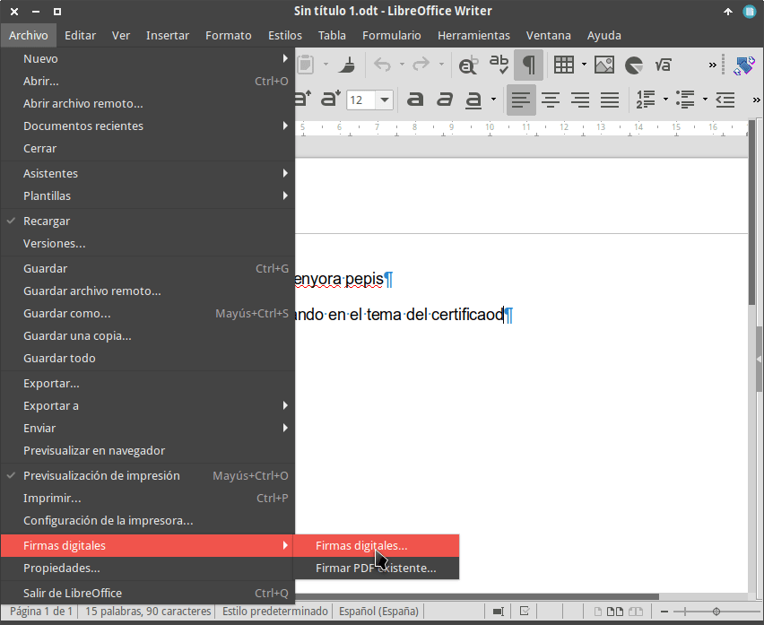
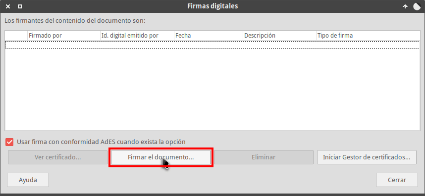
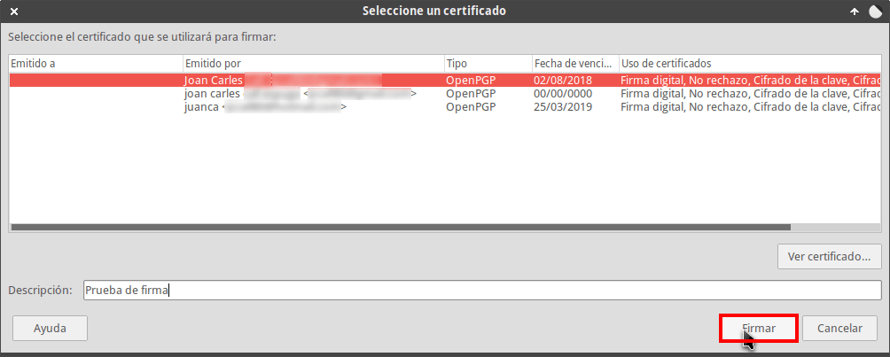
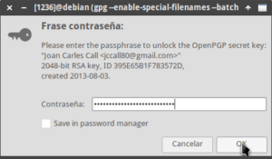
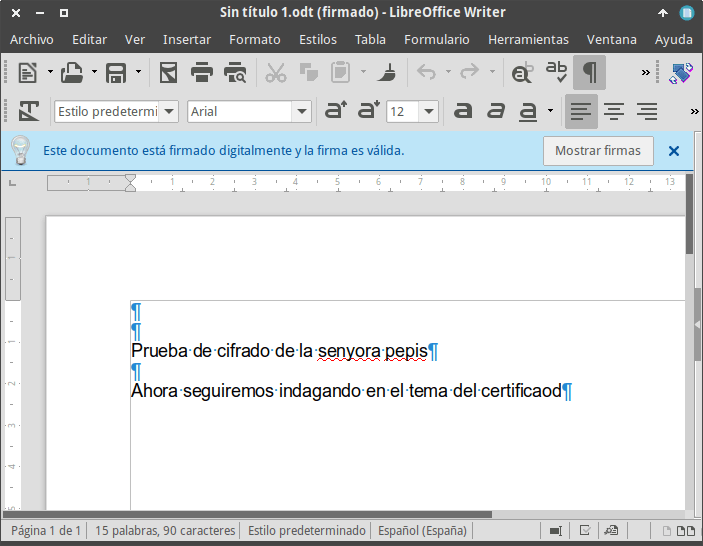
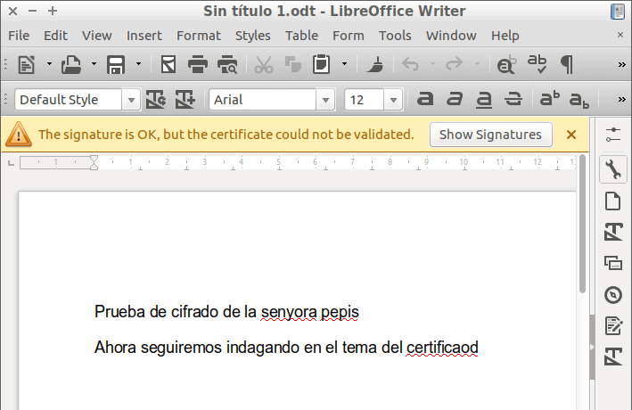
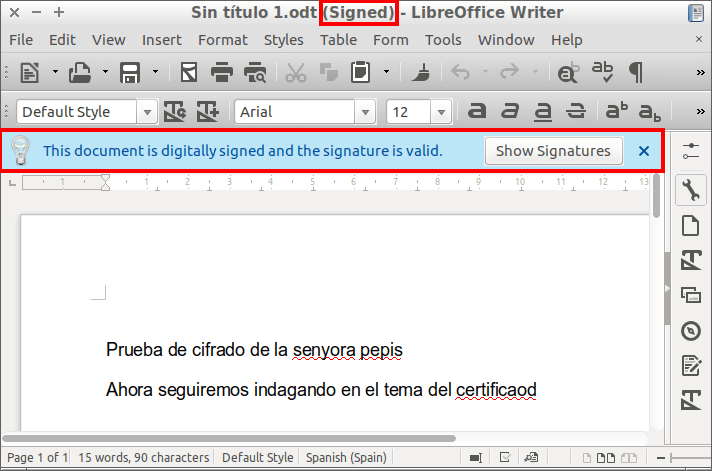

Desde la versión 5.4, LibreOffice permite firmar digitalmente documentos con OpenPGP. Por este motivo en el siguiente artículo veremos:

1. Las utilidades que tiene firmar un documento.
2. El procedimiento para firmar digitalmente un documento en LibreOffice.

<!--more-->

###### Nota: Libreoffice permite firmar documentos con pares de claves generadas con PGP, Enigmal, GPA, Kgpg, Kleopatra, etc.

###### Nota: LibreOffice únicamente permite firmar digitalmente documentos con el formato .odt (OpenDocument).

## UTILIDADES QUE TIENE FIRMAR DIGITALMENTE UN DOCUMENTO

Las utilidades de firmar digitalmente un documento de LibreOffice son las siguientes:

1. Garantizar que el documento lo ha escrito una persona determinada.
2. Garantizar la integridad del documento firmado. Mediante la firma digital podemos asegurar que el contenido del documento no ha sido modificado por una tercera persona.

En otras palabras, si yo firmo un documento y el receptor comprueba que mi firma es correcta, tendrá garantías que soy yo quien ha realizado el documento y que nadie más que no sea yo ha modificado su contenido.

## FIRMAR DIGITALMENTE UN DOCUMENTO DE LIBREOFFICE

Las instrucciones a seguir para firmar digitalmente un documento de LibreOffice son las siguientes.

### Crear un par de claves para firmar digitalmente el documento

Si ya tenéis creadas un par de claves entonces no es necesario seguir las instrucciones de este apartado.

En caso que no tengáis ningún par de claves deberemos seguir las siguientes instrucciones. Para crear un par de claves PGP abran una terminal ejecuten el siguiente comando para instalar la utilidad que nos permitirá generar el par de claves:

> ```
> sudo apt-get install gnupg
> ```

Una vez finalizada la instalación ya podemos crear el par de claves ejecutando el siguiente comando en la terminal:

> ```
> gpg --gen-key
> ```

###### Nota: Con el comando usado se generarán un par de claves usando los parámetros por defecto de gpg.

Durante el proceso de creación del par de claves se nos preguntará:

1. Nuestro nombre y apellidos para crear un id de usuario. En mi caso he usado el nombre joan geekland.
2. Una dirección de email. En mi caso he usado la dirección geeklandmail.com
3. Una descripción del uso que le daremos a nuestra clave.
4. La clave de nuestra contraseña privada. Esta clave debe ser una clave segura y la tendremos que recordar siempre.

Una vez introducidos estos parámetros se creará el par de claves. Una vez creadas las claves vamos a identificar el fingerprint de la clave pública que hemos creado. Para ello ejecutamos el siguiente comando en la terminal:

> ```
> gpg --list-public-keys
> ```

El resultado obtenido es el siguiente:

|   joan@debian:~$ gpg --list-public-keys /home/joan/.gnupg/pubring.gpg ----------------------------- pub rsa4096 2010-10-07 \[SC\] \[caducó: 2015-02-05\] 0D24B36AA9A2A651787876451202821CBE2CD9C1 uid \[ caducada \] Tails developers (signing key) <tailsboum.org> uid \[ caducada \] T(A)ILS developers (signing key) <amnesiaboum.org>  pub rsa2048 2013-08-03 \[SCA\] \[caduca: 2018-08-02\] 42E998565B27AFDBEDF97394395E65B1F783572D uid \[ absoluta \] joan geekland <geeklandmail.com> sub rsa2048 2013-08-03 \[E\] \[caduca: 2018-08-02\] |
| --- |

De entre todas las claves que aparecerán en la pantalla tenemos que identificar la que acabamos de crear. Una vez identificada vemos que en mi caso el [fingerprint]() de la clave pública que acabo de crear es el 42E998565B27AFDBEDF97394395E65B1F783572D . Este dato me será de utilidad para que las personas que reciban mi fichero de LibreOffice puedan validar su firma sin problemas.

### Firmar digitalmente el documento

El proceso para firmar digitalmente el documento es extremadamente sencillo. Una vez finalizado el documento nos vamos al menú Archivo, cuando se despliegue el menú posicionamos el puntero del mouse en la opción Firmas digitales y finalmente clicamos en la opción Firmas digitales...

[](images/agregar-firma-digital-a-un-documento.png)

A continuación clicamos encima de la opción Firmar el documento...

[](images/ver-firmas-digitales-disponibles.png)

Seguidamente seleccionamos la firma con la que queremos firmar el documento y presionamos encima del botón Firmar.

[](images/seleccionar-clave-y-firmar-documento.png)

Finalmente tenemos que introducir la clave de nuestra contraseña privada para firmar el documento y presionar el botón OK.

[](images/introducir-contrasena-clave-privada.png)

A estas alturas el documento está firmado. Tal y como pueden ver en la siguiente captura de pantalla, el documento tiene una franja azul adicional que indica que el documento está correctamente firmado.

[](images/documento-libreoffice-firmado-digitalmente.png)

Una vez firmado el documento lo podemos cerrar y enviar a una tercera persona.

## ¿CÓMO COMPROBAR LA VALIDEZ DE UNA FIRMA DIGITAL DE UN DOCUMENTO DE LIBREOFFICE?

Ahora supongamos que una tercera persona abre el documento firmado que acabamos de enviar. Cuando esta tercera persona abra el documento en su ordenador se encontrará con la siguiente situación:

[](images/firma-no-se-puede-validar.png)

En la captura de pantalla pone claramente que el documento dispone de una firma digital, pero no puede ser validada.

### Validar la firma digital que trae incrustada el documento de LibreOffice

Para validar la firma abriremos una terminal y ejecutaremos el siguiente comando:

> ```
> gpg --list-keys
> ```

El resultado obtenido será parecido al siguiente:

|   joan@ubuntu:~$ gpg --list-keys /home/joan/.gnupg/pubring.kbx ----------------------------- pub rsa2048 2018-02-11 \[SC\] 2C8D340539699A48484B94E36919B1F4C38233AB uid \[ absoluta \] Giancarlo Callo <callmail.com> sub rsa2048 2018-02-11 \[E\]  pub rsa2048 2013-08-03 \[SCA\] \[caduca: 2018-08-02\] 42E998565B27AFDBEDF97394395E65B1F783572D uid \[desconocida\] joan geekland <geeklandmail.com> sub rsa2048 2013-08-03 \[E\] \[caduca: 2018-08-02\] |
| --- |

La clave pública de color azul es la correspondiente al documento de LibreOffice. Para su validación procederemos del siguiente modo:

Abriremos una terminal y ejecutaremos el siguiente comando:

> ```
> gpg --edit-key “joan geekland”
> ```

###### Nota: En vuestro caso deberéis reemplazar la parte de color rojo por el nombre de usuario de quien genero la clave pública.

La salida del comando será parecida a la siguiente:

|   joan@ubuntu:~$ gpg --edit-key "joan geekland" gpg (GnuPG) 2.1.15; Copyright (C) 2016 Free Software Foundation, Inc. This is free software: you are free to change and redistribute it. There is NO WARRANTY, to the extent permitted by law.  pub rsa2048/395E65B1F783572D creado: 2013-08-03 caduca: 2018-08-02 uso: SCA confianza: nunca validez: total sub rsa2048/1CE0E23FC0D9908B creado: 2013-08-03 caduca: 2018-08-02 uso: E \[ total \] (1). joan geekland <geeklandmail.com> |
| --- |

Para ver el fingerprint de la clave ejecutaremos el comando **fpr** obteniendo el siguiente resultado:

|   gpg> fpr pub rsa2048/395E65B1F783572D 2013-08-03 joan geekland <geeklandmail.com> Huella clave primaria: 42E9 9856 5B27 AFDB EDF9 7394 395E 65B1 F783 572D   |
| --- |

Una vez conocemos el fingerprint de nuestra clave deberemos contactar con la persona que ha enviado el documento pare preguntarle el fingerprint de su clave pública. Si el fingerprint de su clave pública es el 42E9 9856 5B27 AFDB EDF9 7394 395E 65B1 F783 572D entonces estaremos seguros que la clave es válida y confiable.

Como ahora estamos completamente seguros que la firma es válida ejecutamos el comando **trust** para asignar un valor de confianza a la clave pública. Después de ejecutar el comando trust deberemos proceder tal y como se detalla a continuación:

|   gpg> trust pub rsa2048/395E65B1F783572D creado: 2013-08-03 caduca: 2018-08-02 uso: SCA confianza: nunca validez: total sub rsa2048/1CE0E23FC0D9908B creado: 2013-08-03 caduca: 2018-08-02 uso: E \[ total \] (1). joan geekland <geeklandmail.com>  Por favor, decida su nivel de confianza en que este usuario verifique correctamente las claves de otros usuarios (mirando pasaportes, comprobando huellas dactilares en diferentes fuentes...)  1 = No lo sé o prefiero no decirlo 2 = NO tengo confianza 3 = Confío un poco 4 = Confío totalmente 5 = confío absolutamente m = volver al menú principal  ¿Su decisión? 4  pub rsa2048/395E65B1F783572D creado: 2013-08-03 caduca: 2018-08-02 uso: SCA confianza: total validez: total sub rsa2048/1CE0E23FC0D9908B creado: 2013-08-03 caduca: 2018-08-02 uso: E \[ total \] (1). joan geekland <geeklandmail.com> Por favor, advierta que la validez de clave mostrada no es necesariamente correcta a menos de que reinicie el programa.  gpg> quit |
| --- |

Después de ejecutar el comando trust deberemos realizar las siguientes acciones:

1. Inicialmente deberemos definir el nivel de confianza que queremos asignar a la clave pública. En mi caso asigno el nivel 4.
2. Cuando haya finalizado el proceso de validación de la clave deberemos ejecutar el comando quit.

Después de realizar estos pasos la firma del documento estará validada para siempre. Si en un futuro nos envían otro documento con la misma firma no tendremos que realizar absolutamente nada. Tan solo tendremos que abrir el documento y comprobar si la firma del documento es de confianza.

### Comprobación de la validez de la firma digital

Una vez validada la firma ya podemos abrir el documento de nuevo. Tal y como se puede ver en la captura de pantalla, ahora la firma es completamente válida.

[](images/firma-digital-validada-correctamente.png)

Por lo tanto podemos estar seguros de lo siguiente:

1. El mensaje lo envía quien realmente dice enviarlo.
2. El mensaje no ha sido modificado por una tercera persona. Por lo tanto podemos estar seguros que el contenido del fichero no ha sido manipulado por un tercero.
