En el pasado hable de como firmar y cifrar documentos en [Libreoffice con OpenPGP](). Como continuación de estos artículos veremos como podemos firmar todo tipo de documentos e emails usando certificados X509 obtenidos a través de una autoridad certificadora de confianza como es Comodo.<!--more-->

## UTILIDADES QUE TIENE FIRMAR DOCUMENTOS E EMAILS

Las utilidades que puede tener firmar un pdf, un documento o un email son varias. Algunas de ellas son las que se detallan a continuación:

1. **Garantizar la integridad** del contenido de un email o de un documento. Si la firma de un documento o de un email es correcta tendremos garantías que nadie ha manipulado su contenido.
2. **Asegurar la autenticidad**. Si un documento está firmado correctamente podemos tener la garantía que proviene de quien realmente dice ser. Este aspecto puede ser útil cuando una persona o entidad nos envía una factura.
3. **Responsabilidad** por parte del firmante. Si una persona o entidad firma un email o un documento, no podrá negar que en su día tomo ciertos compromisos.

## ¿QUÉ NECESITAMOS PARA FIRMAR UN DOCUMENTO O UN EMAIL?

Existen una serie de condiciones para seguir las instrucciones de este artículo y poder firmar documentos y emails. Estas condiciones son las siguientes:

1. Disponer de un certificado criptográfico con el estándar X509. El certificado criptográfico X509 nos servirá para firmar los documentos y los e emails.
2. Disponer del siguiente software: La suite ofimática Libreoffice, Thunderbird y Firefox.

## OBTENER UN CERTIFICADO X509 DE UNA AUTORIDAD CERTIFICADORA

Existen varias autoridades de certificación que emiten certificados X509. Lo habitual es que la gran mayoría de autoridades de certificación sean de pago, pero afortunadamente existen algunas que son gratuitas. Algunas de ellas son las siguientes:

1. [Comodo](https://www.comodo.com/home/email-security/free-email-certificate.php "URL para obtener un certificado digital de Comodo"): Conocida compañía que emite certificados SSL.
2. [Cacert](https://www.cacert.org/ "URL para obtener un certificado digital X509 de CAcert"): Proyecto de código abierto cuyo objetivo es promover el conocimiento y la educación sobre la seguridad informática.

En mi caso uso la opción de Comodo porque Libreoffice, Microsoft Office y la gran mayoría de clientes de email son capaces de validar las firmas de Comodo sin ningún tipo de problema.

## GENERAR E INSTALAR UN CERTIFICADO X509 DE COMODO

Para crear el certificado X509 de Comodo tan solo tenemos que acceder a la siguiente [URL](https://www.comodo.com/home/email-security/free-email-certificate.php "Obtener cetificado digital Comodo") y clicar en el botón **Sign Up Now**.

[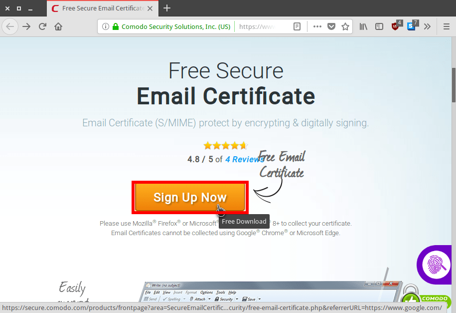](images/conseguir-certificado-x509-comodo.png)

Acto seguido se abrirá el formulario para crear el certificado. Una vez aparezca el formulario lo rellenamos y presionamos el botón **Next**.

[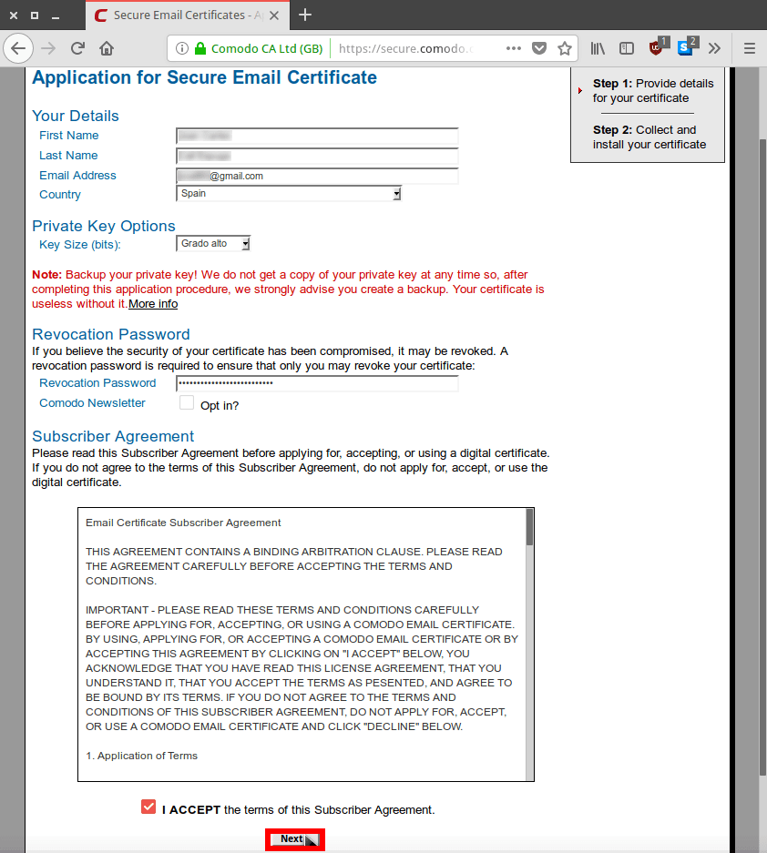](images/formulario-obtencion-certificao-comodo.png)

Seguidamente aparecerá la siguiente pantalla informando que se nos han enviado las instrucciones de instalación del certificado vía email.

[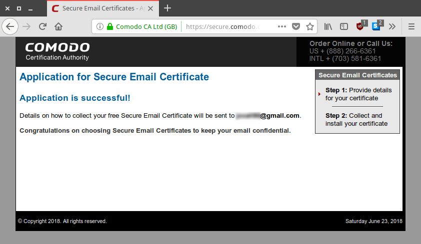](images/peticion-certificado-como-finalizada.png)

Por lo tanto abrimos nuestro correo, localizamos el email enviado por Comodo, lo abrimos y clicamos en el botón **Click & Install Comodo Email Certificate**.

[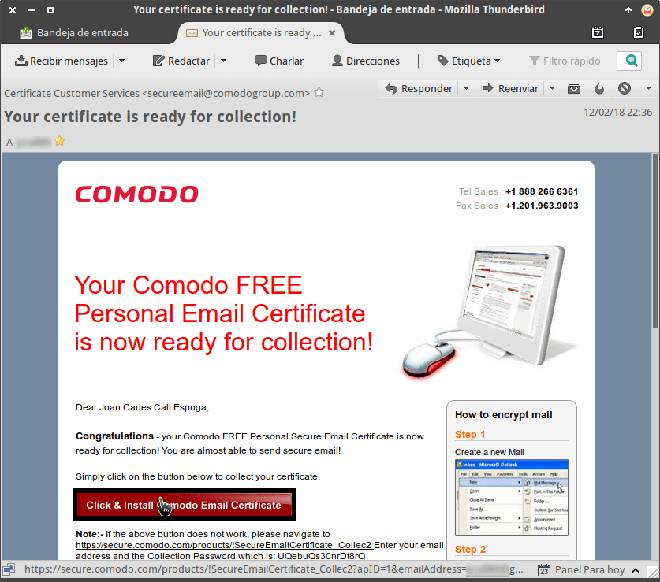](images/instalar-certificado-comodo-x509-firefox.png)

Acto seguido se abrirá nuestro navegador predeterminado, que en mi caso es Firefox, y nos debería salir un mensaje informando que el certificado se ha instalado.

[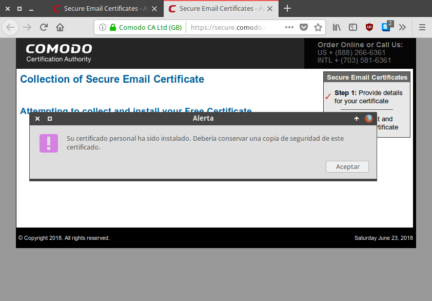](images/certificado-x509-instalado-en-firefox.png)

###### Nota: Para no tener ningún problema en la aplicación de este apartado recomiendo usar Firefox como navegador predeterminado.

## REALIZAR UNA COPIA DE SEGURIDAD DE NUESTRO CERTIFICADO

En estos momentos el certificado está instalado. Ahora tan solo tenemos que realizar una copia del certificado que acabamos de instalar. Los motivos para realizar la copia son los siguientes:

1. Poder **instalar y usar el certificado en otros programas** como por ejemplo Thunderbird.
2. Tener la posibilidad de **instalar el certificado en otros equipos**.
3. Disponer de una copia de seguridad del certificado.

Para realizar la copia de seguridad abrimos Firefox. Seguidamente clicamos en el icono de **Abrir menú**, y cuando se despliegue el menú clicamos en **Preferencias**.

[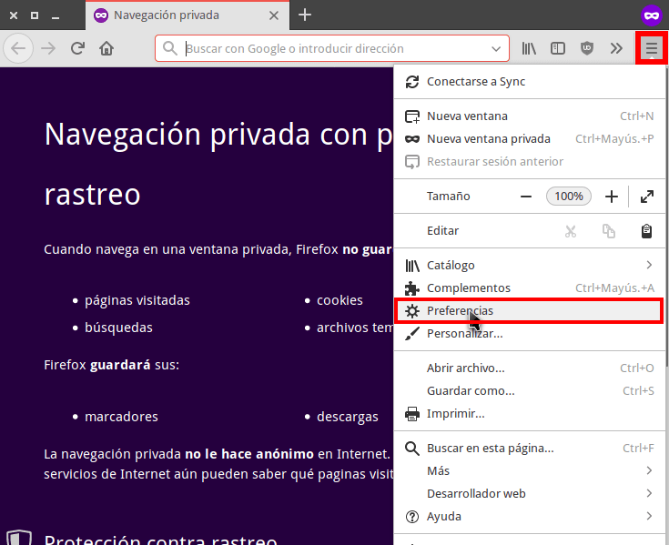](images/acceder-preferencias-firefox.png)

A continuación, en el cuadro de búsqueda escribimos **certificados**. Seguidamente tenemos que presionar en el botón **Ver certificados...**

[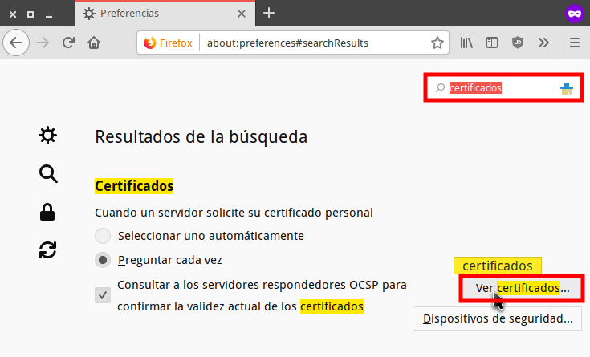](images/gestionar-certficados-digitales-firefox.png)

Seguidamente, en la pestaña **Sus certificados** seleccionamos el certificado Comodo que acabamos de instalar y presionamos el botón **Hacer copia...**

[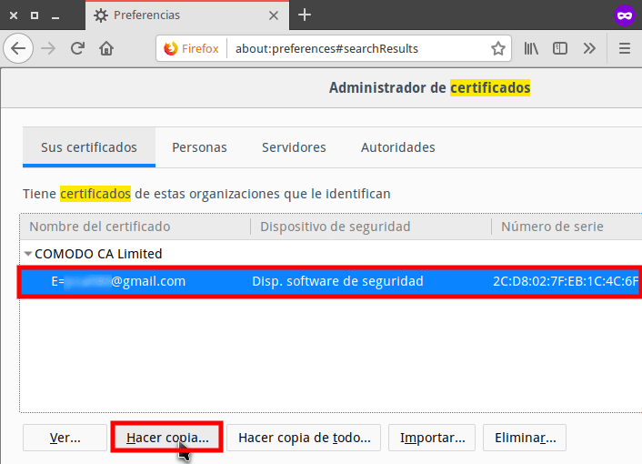](images/copia-seguridad-certificado-x509.png)

El siguiente paso consiste en dar un nombre a la copia del certificado y seleccionar la ubicación donde queremos guardarla. A continuación presionamos el botón **Guardar**.

[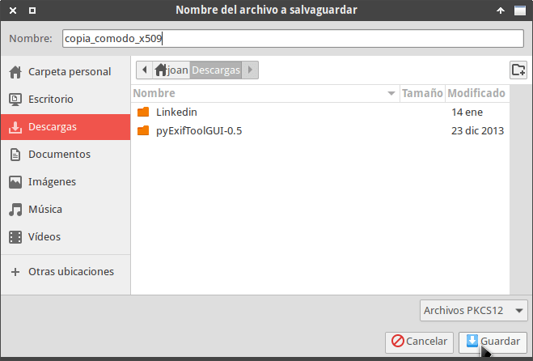](images/guardar-copia-seguridad-certificado-x509.png)

Finalmente escribimos la contraseña que tendremos que usar para instalar la copia del certificado en otros programas y/o equipos y presionamos el botón **Aceptar**.

[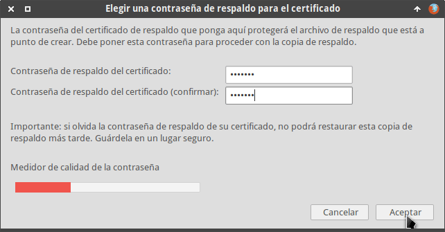](images/contraseña-respaldar-copia-de-seguridad.png)

## INSTALAR UN CERTIFICADO X509 EN THUNDERBIRD

Para instalar el certificado X509 en Thunderbird usaremos la copia de seguridad que acabamos de realizar. Para ello accedemos en la **Preferencias** de nuestro gestor de correo.

[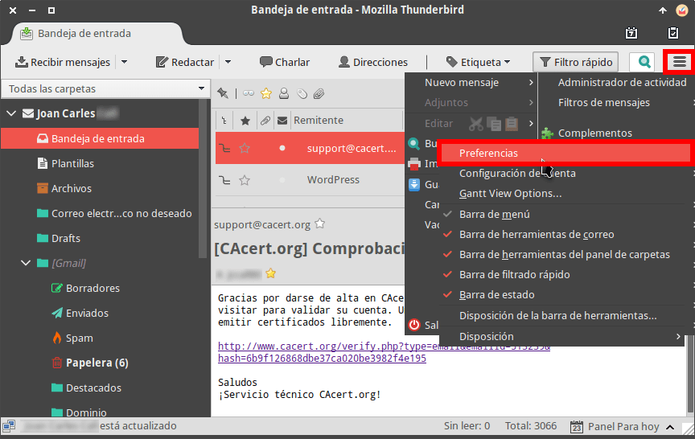](images/acceder-preferencias-thunderbird.png)

Acto seguido, en preferencias de Thunderbird clicamos encima de la opción **Avanzado**. A continuación clicamos encima del botón **Administrar certificados**.

[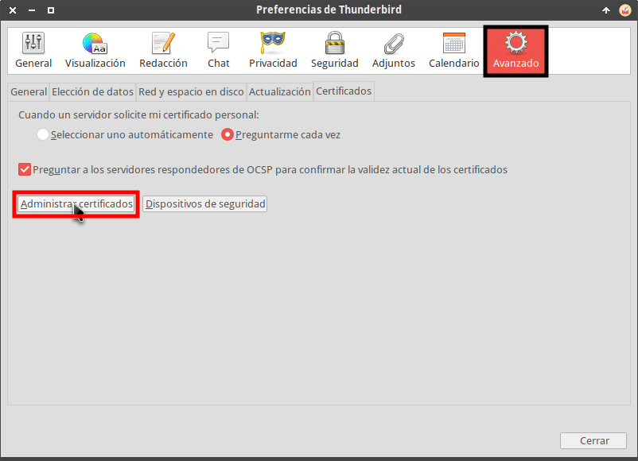](images/administrar-certificados-thunderbird.png)

Seguidamente, clicamos en el botón **importar…** para importar el certificado.

[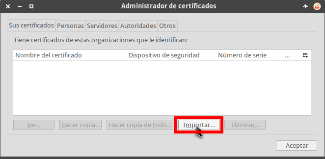](images/importar-certificado-digital-thunderbird.png)

A continuación seleccionamos la copia de seguridad del certificado que hicimos en el apartado anterior. Acto seguido presionamos en el botón **Abrir**.

[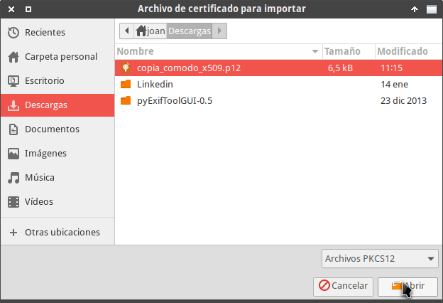](images/seleccionar-certificado-a-instalar.png)

Finalmente escribimos la contraseña para importar el certificado que definimos en el apartado anterior y presionamos el botón **Aceptar**.

[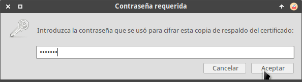](images/introducir-contraseña-instalar-certificado.png)

A partir de estos momentos el certificado se ha importado. Por lo tanto la próxima vez que abramos nuestro gestor de correo Thunderbird seremos capaces de firmar emails sin ningún tipo de problema.

## CONFIGURAR LIBREOFFICE PARA FIRMAR DOCUMENTOS PDF Y ODT

Al igual que Thunderbird también tenemos que configurar Libreoffice para que sea capaz de firmar documentos .odt y .pdf. Para ello accedemos al menú **Herramientas** de Libreoffice y clicamos encima de **Opciones…**

[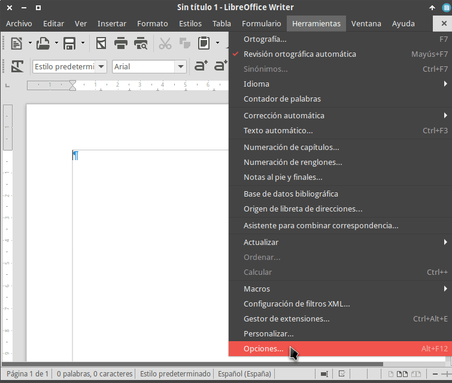](images/acceder-opciones-configuracion-libreoffice.png)

A continuación en el menú de la izquierda clicamos encima de la opción **Seguridad** y acto seguido clicamos sobre el botón **Certificado...**

[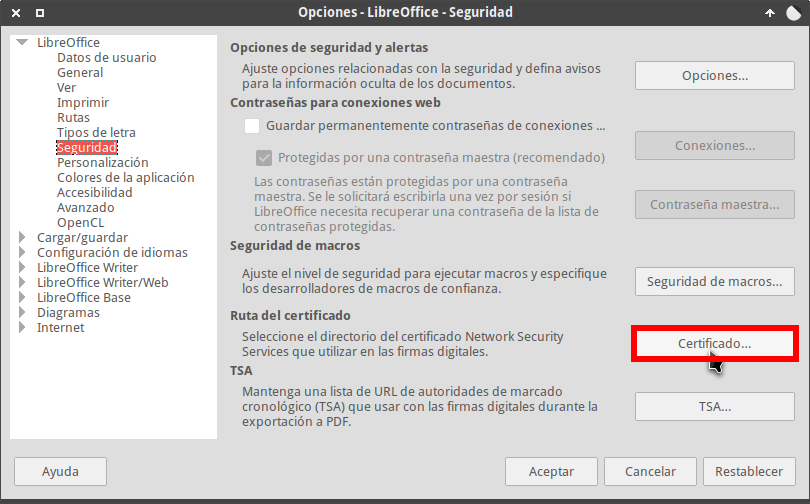](images/seleccionar-ruta-certificado-x509.png)

Finalmente seleccionamos la ruta de Firefox que almacena el certificado X509 que instalamos momentos atrás y presionamos el botón **Aceptar**.

[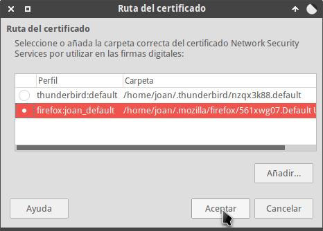](images/ruta-del-certificado-seleccionada.png)

En estos momentos la próxima vez que reiniciemos Libreoffice estaremos en disposición de firmar documentos .odt y .pdf sin ningún tipo de problema.

## INSTRUCCIONES A SEGUIR PARA FIRMAR UN DOCUMENTO PDF U ODT CON LIBREOFFICE

Firmar un documento .odt o .pdf en Libreoffice es extremadamente sencillo. Tal y como pueden ver en la captura de pantalla, tienen que realizar los siguientes pasos:

1. Abrir el archivo .pdf o .odt que necesitamos firmar.
2. Acceder dentro del menú **Archivo**.
3. Dentro del menú Archivo posicionar el puntero del ratón en la opción **Firmas digitales**.
4. Cuando se despliegue el submenú clican encima de la opción **Firmas digitales...**

[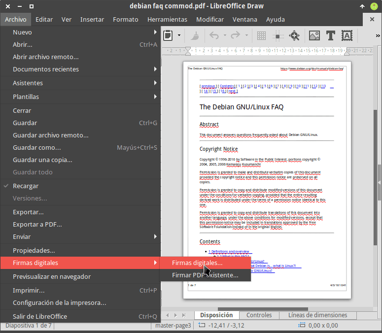](images/acceder-apartado-firmas-digitales-libreoffice.png)

A continuación clicamos encima del botón **Firmar documento...**

[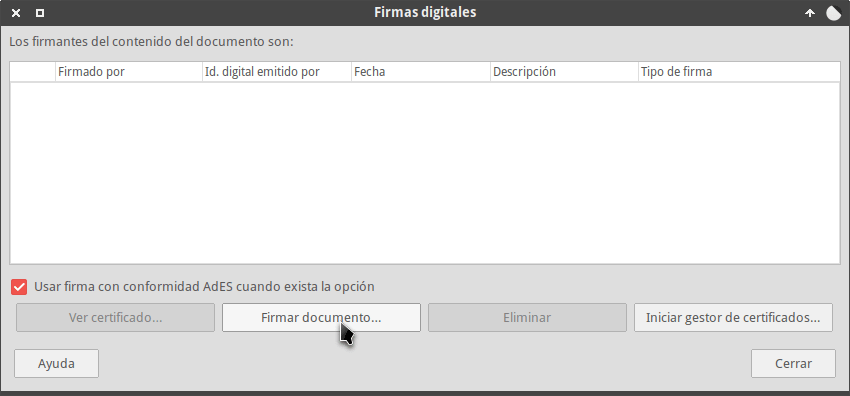](images/firmar-documento-libreoffice.png)

Finalmente seleccionamos el certificado que queremos usar para la firma, introducimos una descripción y presionamos el botón **Firmar**.

[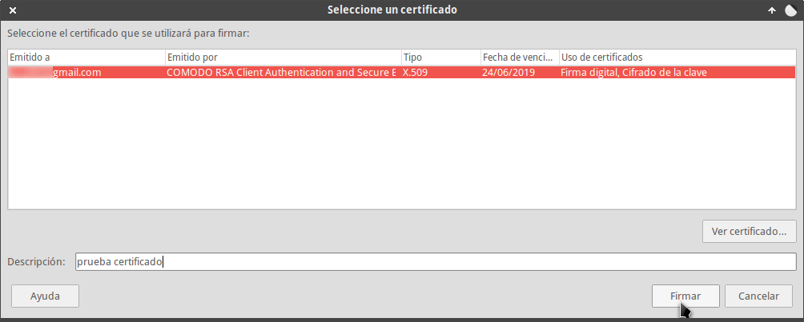](images/seleccionar-certificado-para-firmar.png)

De esta forma tan simple y sencilla el documento ya estará firmado.

###### Nota: Siguiendo las instrucciones de este apartado podremos firmar documents .pdf y .odt

## INSTRUCCIONES A SEGUIR PARA FIRMAR UN EMAIL CON THUNDERBIRD

Firmar un email también es muy simple y práctico. Tan solo tenemos que escribir el email de forma habitual. Justo antes de enviar el email clicamos en la pestaña **Seguridad** y tildamos la opción **Firmar digitalmente** este mensaje. Una vez tildada la opción ya podemos enviar el email con total normalidad.

[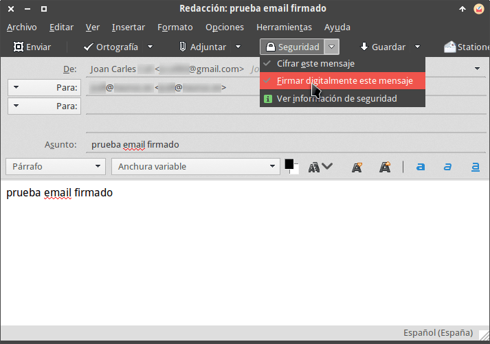](images/firmar-email-con-thunderbird.png)

## ¿CÓMO COMPRUEBAN LOS CLIENTES QUE LAS FIRMAS SON VÁLIDAS?

En el momento que el receptor de nuestro documento o email abra nuestro correo o documento, tal y como se puede ver en las capturas de pantalla, se verá alguna evidencia que el documento está firmado y además su firma es válida.

\[caption id="attachment\_9676" align="alignnone" width="430"\][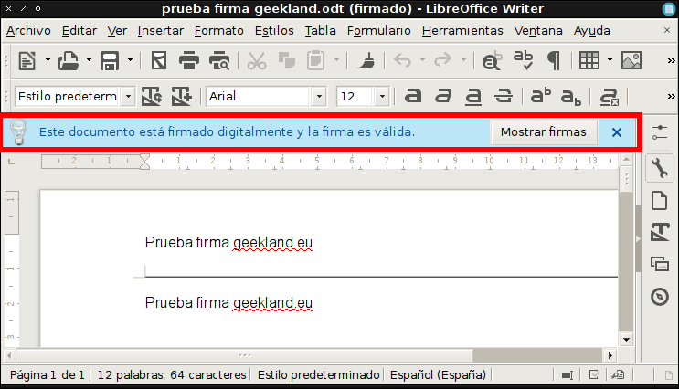](images/odt-firmado.png) Muestra de un documento .odt validado por Libreoffice\[/caption\]

\[caption id="attachment\_9677" align="alignnone" width="430"\][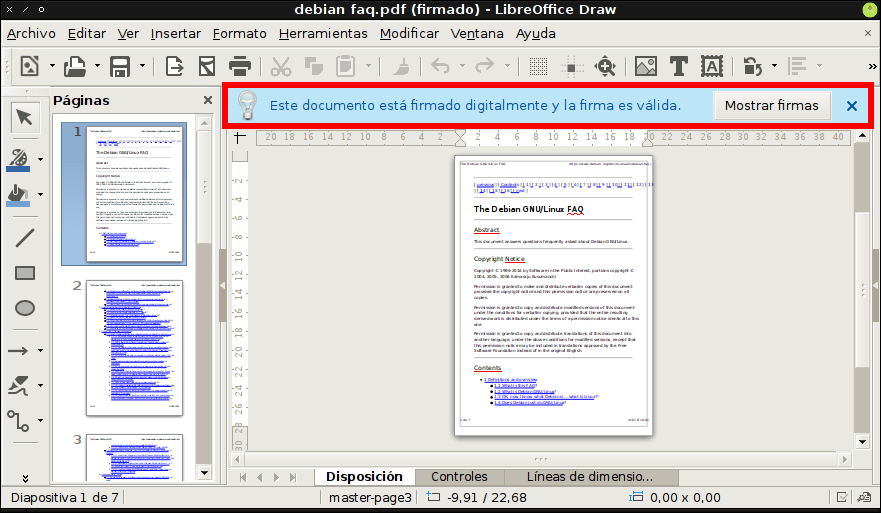](images/pdf-firmado.png) Muestra de un documento .pdf validado por Libreoffice\[/caption\]

\[caption id="attachment\_9681" align="alignnone" width="430"\][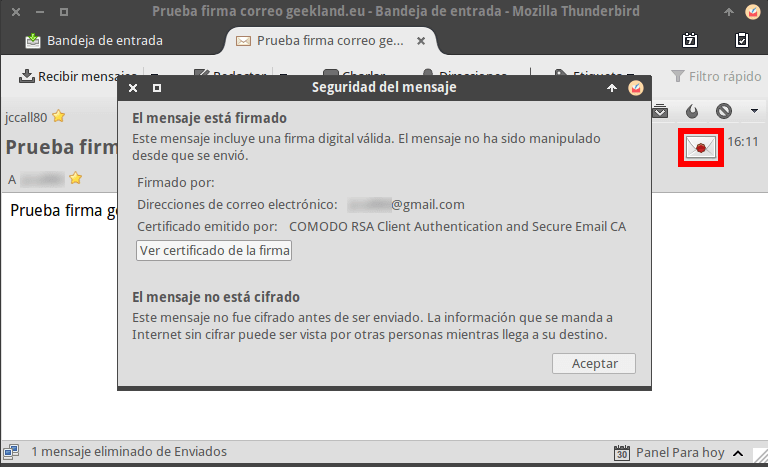](images/firma-correo-validada.png) Ejemplo de validación de un correo electrónico firmado\[/caption\]

A pesar que la verificación sea correcta es recomendable que además realicen las siguientes comprobaciones:

1. Verificar que la firma sea válida.
2. Que el certificado con que se firmado el documento o email no esté caducado.
3. Que la firma pueda ser validada por el software que usamos para leer el email o documento.

Si se cumplan las 3 premisas podemos garantizar la autenticidad e integridad del mensaje o documento.

En el caso que el software que abre el documento no pueda validar la firma no hay que alarmarse. Los software con que abrimos los documentos firmados no son capaces de validar los certificados de todas las autoridades certificadoras. En estos casos, programas como por ejemplo Adobe Acrobat, permiten añadir autoridades certificadoras de forma manual para que se puedan validar los certificados de una entidad concreta como por ejemplo Comodo.
