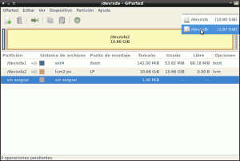
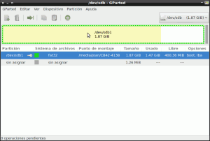
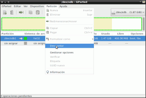
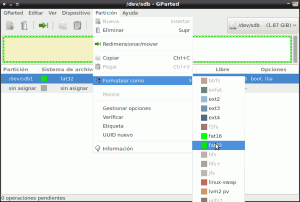
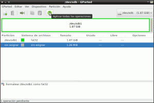

En próximas semanas tengo planeado publicar una serie de tutoriales en los que será necesario formatear una memoria USB. Por esto motivo me he decido a publicar este post en que se detalla con todo detalle como formatear una memoria USB en GNU Linux.<!--more-->

Hay muchas formas de formatear una memoria USB en Linux. Quizás el método que vaya a usar no es ni el más intuitivo ni el más rápido pero es el método que acostumbro a utilizar.

Los pasos para poder formatear la memoria con gparted son los siguientes:

## INSTALAR GPARTED

Es posible que muchos de vosotros ya tengáis instalado [gparted](http://gparted.org/ "Web de Gparted") en vuestro ordenador. En el caso que no lo tengan instalado tan solo tienen que **abrir una terminal y teclear el siguiente comando**:

> ```
> sudo apt-get install gparted
> ```

**Una vez instalado gparted tenéis que conectar la memoria USB en vuestro ordenador**. Una vez introducida al memoria lo más probable es que se automonte automáticamente.

## EJECUTAR GPARTED

Una vez instalado el programa tenemos que ejecutarlo. Para ejecutar [gparted](http://gparted.org/ "Web de gparted") hay muchos métodos pero el más fácil es **abrir una terminal y teclear lo siguiente**:

> ```
> sudo gparted
> ```

## SELECCIONAR LA UNIDAD A FORMATEAR

Una vez se ha ejecutado gparted les aparecerá la siguiente ventana en frente de su pantalla:

[](images/1-Seleccionar-unidad-USB.png)

Lo primero que tenemos que realizar es **seleccionar la unidad que queremos formatear**. Para ello tal y como se muestra en la captura de pantalla clicamos encima del desplegable superior izquierdo y **seleccionamos la unidad que corresponde a vuestra memoria USB. En mi caso la /dev/sdb (de 1,87 GiB)**

## SELECCIONAR EL ESPACIO A FORMATEAR

Tal y como se puede ver en la captura de pantalla con el puntero mouse tienen que ponerse encima de la representación física de nuestra memoria USB y clicar encima.

[](images/2-Seleccionar-espacio-a-formatear.png)

Una vez hayan clicado ya tienen seleccionado el espacio a formatear.

## DESMONTAR LA UNIDAD QUE SE QUIERE FORMATEAR

Un requisito para poder formatear una unidad es que esté desmontada. Lo más probable es que cuando introduzcan su memoria en el puerto USB se automonte automáticamente. Por lo tanto ahora la desmontaremos para posteriormente poderla formatear.

Para desmontar nuestra unidad USB, tal y como se puede ver en la captura de pantalla tienen que **ir al menú Partición y seleccionar la opción Desmontar.**

[](images/3-desmontar-USB.png)

## SELECCIONAR EL ESPACIO A FORMATEAR

Una vez hemos desmontado la unidad tenemos que seleccionar el espacio a formatear de la misma forma que lo hicimos anteriormente. Por lo tanto, como se puede ver en la captura de pantalla, con el puntero mouse tienen que ponerse encima de la representación física de nuestra memoria USB y clicar encima.

[](images/2-Seleccionar-espacio-a-formatear.png)

## SELECCIONAR EL TIPO DE FORMATO QUE DAREMOS A LA MEMORIA USB

Ahora ya estamos en condiciones de formatear nuestra memoria USB. Para ello tal y como pueden ver en la captura de pantalla **acceden al menú** **Partición**. **En el menú** **Partición** **tienen que seleccionar la opción** **Formatear como**.

[](images/4-Seleccionar-tipo-de-formato.png)

Tal y como pueden ver en la captura de pantalla una vez elegida la opción formatear como les aparecerá otro menú en el que tienen que **seleccionar el formato con el que quieren formatear la memoria USB. En mi caso elegiré el formato** **fat32** clicando encima de fat32.

## FORMATEAR LA MEMORIA USB

Para finalizar tan solo nos falta dar el formato a nuestra memoria USB. Para ello tal y como se puede ver en la captura de pantalla **apretamos el Botón de** **Aplicar todas las operaciones**.

[](images/5-Aplicar-operaciones.png)

Una vez presionado el botón tan solo nos hace falta esperar hasta que todo el proceso haya finalizado.
