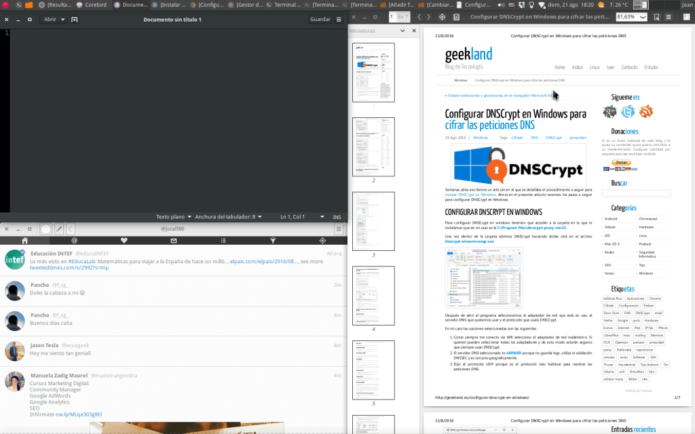
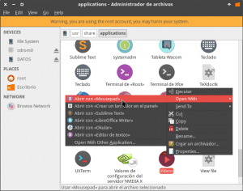

A continuación veremos como podemos forzar que un programa use un tema GTK distinto al configurado. De esta forma podremos conseguir lo que podéis observar en la captura de pantalla:<!--more-->

[](images/Programas-abiertos-usando-temas-GTK-distintos.png)

Si observáis la captura de pantalla veréis que hay tres programas abiertos y cada uno de ellos está usando un tema GTK diferente:

- El primero de los programas es Gedit y está usando el tema Adwaita Dark.
- El segundo de los programas es Corebird y el tema que está usando es el Adwaita claro.
- Finalmente el tercer programa es Evince y usa tema Numix.

## UTILIDADES DE FORZAR QUE UN PROGRAMA USE UN TEMA GTK DISTINTO AL PREDETERMINADO

Las utilidades que puede tener la funcionalidad que acabamos de ver son las siguientes:

En ocasiones existen temas que no se visualizan correctamente en determinados programas. Si este es nuestro caso podemos forzar que el programa que se visualiza de forma incorrecta se abra con un tema GTK distinto al que tenemos configurado en nuestro sistema operativo.

Otra utilidad que puede tener es simplemente estética. Puede darse el caso que un determinado programa luzca mucho mejor con un tema claro que con un tema oscuro.

## FORZAR QUE UN PROGRAMA SE ABRA CON EL TEMA GTK QUE QUERAMOS DESDE LA TERMINAL

Los pasos a seguir para forzar que un programa se abra con el tema GTK que queremos son los siguientes:

### Averiguar el tipo de librerías que usa el programa

Para averiguar el tipo de librerías que usa un programa les recomiendo que lean y apliquen los consejos que se muestran en el siguiente enlace:

https://geekland.eu/que-son-librerias-gtk-version-usamos/

### Forzar que un programa que usa librerías GTK3 se abra con el tema que queramos

En el caso que el programa que queramos abrir use librerías GTK3, tan solo tenemos que abrir una terminal y teclear un comando del siguiente tipo:

> ```
> GTK_THEME=nombre_del_tema_gtk nombre_del_programa
> ```

Por lo tanto si queremos abrir Libreoffice Writter con el tema Adwaita tenemos que ejecutar el siguiente comando en la terminal:

> ```
> GTK_THEME=Adwaita libreoffice --writer
> ```

En el caso que nuestro objetivo sea abrir Corebird con el tema Adwaita oscuro tenemos que ejecutar el siguiente comando en la terminal:

> ```
> GTK_THEME=Adwaita:dark corebird
> ```

###### Nota: Como habréis observado, en el comando que acabamos de ejecutar las variables de un tema se indican con el símbolo **:** seguido del nombre de la variante del tema.

Finalmente si queremos abrir el programa Catfish con el tema Numix tan solo tenemos que ejecutar el siguiente comando en la terminal:

> ```
> GTK_THEME=Numix catfish
> ```

De esta forma tan fácil y tan sencilla conseguiremos forzar que un programa use el tema GTK que nosotros queramos.

### Forzar que un programa que usa librerías GTK2 o QT se abra con el tema que queramos

Para forzar que un programa que utiliza librerías QT o GTK2 se abra con un tema en concreto tenemos que abrir una terminal y aplicar un comando del siguiente tipo:

> ```
> GTK2_RC_FILES=ruta_del_fichero_gtkrc nombre_del_programa
> ```

###### Nota: La ruta del fichero gtkrc se encuentra dentro de la ubicación /usr/share/themes en cada una de las carpetas que contienen los temas.

Por lo tanto si nuestro objetivo es abrir el programa Gimp con el tema Xfce-flat tenemos que ejecutar el siguiente comando en la terminal:

> ```
> GTK2_RC_FILES=/usr/share/themes/Xfce-flat/gtk-2.0/gtkrc gimp
> ```

En el caso que queramos abrir el programa Okular con el tema Numix tenemos que ejecutar el siguiente comando en la terminal:

> ```
> GTK2_RC_FILES=/usr/share/themes/Numix/gtk-2.0/gtkrc okular
> ```

De esta forma tan sencilla podemos aplicar el tema que queramos en una aplicación GTK2 o QT sin cambiar el tema GTK global de nuestro escritorio.

## FORZAR QUE UN PROGRAMA USE UN TEMA GTK DETERMINADO DE FORMA PERMANENTE

Para que un programa determinado se abra de forma permanente con el tema que queramos, tan solo tenemos que modificar el contenido del archivo .desktop que usamos para abrir el programa.

Para ello en la terminal ejecutamos el comando:

> ```
> gksudo thunar
> ```

Una vez se abra gestor de archivos thunar navegamos a la ubicación **/usr/share/applications**.

Seguidamente buscan el archivo .desktop del programa que quieren abrir con un tema GTK diferente al configurado y lo abren con su editor de textos preferido.

[](images/Acceder-a-los-ficheros-.desktop.png)

### Modificaciones en el archivo .desktop para aplicaciones que usen GTK3

Una vez abierto el fichero .desktop buscan la línea que empieza por las letras **Exec=**

Como en mi caso seleccione el archivo .desktop de Totem, la línea completa que empieza por **Exec=** es la siguiente:

> ```
> Exec=totem %U
> ```

Una vez encontrada la línea la modifican añadiendo el texto **env GTK\_THEME=nombre\_del\_tema** quedando del siguiente modo:

> ```
> Exec=env GTK_THEME=Adwaita totem %U
> ```

Una vez realizadas las modificaciones guardamos los cambios y cerramos el fichero. A partir de ahora cada vez que abramos Totem se visualizará con el tema GTK Adwaita.

### Modificaciones en el archivo .desktop para aplicaciones que usen GTK2 o QT

Una vez abierto el fichero .desktop buscan la línea que empieza por las letras **Exec=**.

Como en mi caso seleccione el archivo .desktop de VLC, la línea completa que empieza por Exec= es la siguiente:

> ```
> Exec=/usr/bin/vlc --started-from-file %U
> ```

Una vez encontrada la línea la modifican añadiendo el texto **env GTK2\_RC\_FILES=ruta\_del\_fichero\_gtkrc\_del\_tema** quedando del siguiente modo:

> ```
> Exec=env GTK2_RC_FILES=/usr/share/themes/Clearlooks/gtk-2.0/gtkrc /usr/bin/vlc --started-from-file %U
> ```

Una vez realizadas las modificaciones guardamos los cambios y cerramos el fichero. A partir de ahora cada vez que abramos VLC se visualizará con el tema Clearlooks.

## LIMITACIONES DEL MÉTODO MENCIONADO EN EL POST

El método para abrir programas con el tema GTK que queramos solo se puede aplicar bajo las siguientes condiciones:

1. Los temas que asignamos a un programa GTK3 tienen que ser compatibles con GTK3.
2. Los temas que asignamos a un programa GTK2 tienen que ser compatibles con GTK2.
3. La versión de las librerías GTK3 instaladas en nuestro ordenador tienen que ser iguales o superiores a la versión 3.12.

Además hay que tener en cuenta que el cambio de tema en la barra de título únicamente se aplicará en los programas que son de Gnome.
