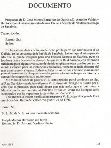
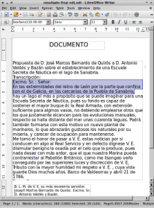

**Hoy en día en el mundo empresarial, en la educación y en otros ámbitos se están aplicando técnicas de reconocimiento óptico de caracteres OCR para incrementar la competitividad, para reducir costes, para ofrecer servicios de mayor calidad, etc**. Por todos estos motivos he decido redactar un conjunto de artículos relacionados con el reconocimiento ópticos de caracteres OCR. A modo introductorio empezaremos con el siguiente articulo:<!--more-->

## ¿QUÉ ES EL OCR O RECONOCIMIENTO ÓPTICO DE CARACTERES?

**La función** del reconocimiento óptico de caracteres u OCR (optical character recognition) **es** **identificar y reconocer el texto que hay contenido en una imagen o documento escaneado. Una vez reconocido el texto que está en modo de imagen, se almacenará en forma de texto y por lo tanto lo podremos editar sin ningún problema** con un procesador de textos común como por ejemplo Writer, Word Pages, etc.

En el caso que después de la explicación aún exista algún tipo de duda, les mostraremos un ejemplo real ya que siempre he escuchado decir que una imagen vale más que mil palabras.

Supongamos que en nuestras manos ha llegado un archivo pdf que contiene texto escaneado. El archivo que hemos recibido es el siguiente:

Ahora mediante técnicas OCR convertiremos el texto en formato de imagen a texto real que podremos editar. Después de aplicar técnicas de reconocimiento óptico de caracteres (OCR) en la imagen que acabamos de mostrar obtendremos el siguiente resultado:

Como se puede ver en la captura de imagen, después de finalizar el reconocimiento óptico de caracteres tendremos la totalidad de texto que contenía la imagen inicial en un procesador de texto. Ahora con este texto podemos hacer lo que queramos. Lo podemos borrar, modificar, copiar, pegar, etc.

## USOS DEL RECONOCIMIENTO ÓPTICO DE CARACTERES OCR

Hoy en día **podemos dar numerosos usos al OCR o al reconocimiento óptico de caracteres**. Algunas de las utilidades prácticas que podemos dar al reconocimiento óptico de caracteres son las siguientes:

1. **En el entorno laboral y estudiantil** es frecuente recibir documentos o libros escaneados o impresos en formato pdf, tiff o jpg. En multitud de ocasiones los estudiantes y trabajadores necesitaran escribir a mano o teclear en su ordenador parte del contenido que nos han entregado como una imagen y esto obviamente representa una pérdida de tiempo. Con técnicas de OCR podremos **transformar el texto de imagen a texto real de forma prácticamente automática.**
2. Los estudiantes y ciertas personas **en** el entorno laboral, tienen que lidiar con **documentos y certificados que se entregan escaneados como imagen**. Los ficheros acostumbran a ser largos y extensos, por lo tanto en muchas ocasiones seria interesante **hacer una búsqueda por palabras clave para de esta forma acceder al contenido que nos interesa de forma directa, rápida y sin tener que perder tiempo leyendo de forma detallada el documento**. Con técnicas OCR podremos realizar las búsquedas por palabras clave sin ningún tipo de problema y acceder al cotenido que nos interesa de forma inmediata.
3. **Digitalización y transformación a texto de documentos y libros históricos** que solo están disponibles en soporte de papel.
4. El OCR, combinado con otras técnicas, **es una herramienta ideal para que personas con deficiencias visuales o auditivas puedan tener acceso a documentos e información**. Hoy en día existen herramientas que transforman el texto resultante del reconocimiento OCR a Braile o archivos de audio.
5. Hoy en día existen numerosas bases de datos que contienen imágenes. Cuando los usuarios suben contenido a la base de datos suelen introducir frases o palabras (metadatos) que sirven para organizar, ordenar y clasificar adecuadamente estas imágenes. Estos metadatos también se usan como palabra clave para que los usuarios puedan realizar búsquedas en la base de datos. Hoy **en** día existen **bases de datos que contienen imagenes** que **disponen buscadores DIRS (Document Image Retrieval system)**. **Estos buscadores disponen de reconocimiento óptico de caracteres. Por lo tanto cuando un usuario sube una imagen a la base de datos se realizará un reconocimiento óptico de caracteres de la imagen que se sube. Este reconocimiento óptico de caracteres servirá**, como en el caso anterior, **para organizar, ordenar y clasificar las imágenes de la base de datos** pero en este caso se hará todo **de forma automática**. Además el texto reconocido de la imagen que se sube se podrá usar para facilitar la búsqueda de imágenes en la base de datos.
6. Aplicación de técnicas OCR en distintos ámbitos como por ejemplo el bancario a la hora de **realizar ingresos de cheques de forma automática**, en el sector médico para escanear e **introducir formularios con datos de los pacientes a la base de datos**, **reconocimiento de matrículas de coche en un parking o en un radar de tráfico**, etc.
7. **Ciertas aplicaciones móviles utilizan técnicas de OCR**. Una de estas aplicaciones es la conocida camcard. Esta aplicación sirve para almacenar y clasificar tarjetas comerciales o de negocios. Tan solo tenemos que capturar la imagen de una tarjeta y [camcard](https://www.camcard.com/ "Web de la aplicación móvil que usa OCR") mediante técnicas OCR podrá extraer la totalidad de contenidos que contiene la tarjeta como por ejemplo mails, teléfonos, nombres, etc.
8. Actualmente existe software de reconocimiento óptico OCR capaz de **leer y reproducir las notas musicales representadas en un pentagrama**. Imagino que este software puede ser una herramienta de utilidad para compositores o para personas como nosotros que queremos escuchar como suenan ciertas notas musicales.

## VENTAJAS QUE PROPORCIONA EL RECONOCIMIENTO ÓPTICOS DE CARACTERES OCR

Hoy en día es habitual que se genere gran cantidad de contenido en multitud de soportes distintos. Entre esta multitud de tipos de soportes es habitual crear contenido en soporte manuscrito u tipográfico, por lo tanto **las ventajas competitivas que nos puede ofrecer el reconocimiento óptico de caracteres son muchas**. Algunas de ellas son las siguientes:

1. En la digitalización de documentos supone un **ahorro importante de tiempo**, ya que la diferencia de tiempo entre entrar un texto de forma manual a reconocerlo de forma automática es muy grande.
2. El reconocimiento de texto OCR transforma a los archivos escaneados en algo más que archivos de imagen. Aparte de la imagen escaneada, **los archivos contendrán una parte de texto que podremos usar para muchos fines**. Algunos de los fines pueden ser la clasificación y ordenación de un archivo fotográfico o de imagen, facilitar la búsqueda de información en un archivo fotográfico o de imagen, etc. De esta forma podremos ofrecer un mejor servicio a terceros.
3. El hecho de automatizar la transformación de imagen a texto implica un **ahorro de recursos humanos, un incremento de la productividad** y además puede ayudar a **mejorar la calidad de algunos servicios** que se ofrecen ya que por ejemplo quien se dedica a entrar texto de forma manual es fácil que cometa errores.
4. El reconocimiento OCR y la digitalización de contenido suponen un **ahorro importante de almacenamiento**. Sin duda alguna almacenar los documentos en formato digital supone un **ahorro de espacio y de coste de almacenamiento muy importante.**

## LIMITACIONES DEL RECONOCIMIENTO DE TEXTO OCR

Sin duda el reconocimiento óptico de caracteres es una herramienta potente, pero **para sacarle partido y para que la experiencia sea satisfactoria hay que tener muy en cuenta como mínimo los siguientes factores**:

1. **La calidad de la imagen que contiene el texto a reconocer tiene que ser aceptable**. Si el texto que queremos reconocer es borroso, tiene poca resolución o presenta algún otro tipo de problema los resultados no serán satisfactorios.
2. Para poder obtener resultado satisfactorios **la resolución mínima de las imágenes escaneadas tiene que ser 300 ppp** (puntos por pulgada). **En ciertos casos**, como por ejemplo si la la letra a reconocer es pequeña, **puede ser necesario llegar a resoluciones de 600 ppp**.
3. **En el caso que la tipografía a reconocer como texto sea poco común es posible que los resultados obtenidos no sean los más adecuados**. Además en el caso de tipografía manuscrita pueden aparecer nuevos problemas como por ejemplo que la distancia entre caracteres no sea constante, etc.
4. **Los software y motores de reconocimiento OCR no son perfectos**. Existen software de reconocimiento OCR que dan mejores resultados o mayor efectividad que otros. Por lo tanto **si los resultados que obtenemos no son satisfactorios una de las opciones que tenemos es buscar otras alternativas de software o utilizar distintos motores de conversión**.
5. **En el caso que el texto a reconocer se trate de un texto manuscrito la dificultad se incrementa enormemente**. En función de varios factores es posible obtener resultados aceptables pero a día de hoy el reconocimiento de texto manuscrito sigue siendo un reto. En el caso que se precise realizar un reconocimiento de texto manuscrito seria recomendable que en el impreso donde se escriba este diseñado de forma que el interlineado, la separación entre caracteres y el tamaño de las letras sea constante. Además es recomendable forzar a que el texto se escriba en mayúsculas. A pesar de la dificultad existente cabe decir que las metodologías de OCR están en evolución constante.
6. **Para realizar un reconocimiento óptico de texto se recomienda un texto en escala de gises**. Los software y motores de reconocimiento de texto acostumbran a distinguir mejor el texto de imágenes en escala de grises o en blanco y negro que no en colores. Para ello en ocasiones es adecuado un tratamiento de la imagen antes de proceder al reconocimiento óptico de caracteres. Algunos aspectos de la imagen que se pueden mejorar son quitar puntos y manchas de la imagen escaneada, trabajar con los brillos de la imagen, etc. Muchos software existentes realizan estas operaciones de forma automática y no nos damos ni cuenta.

**Por todo ello cuando se escaneen documentos es importante revisar la configuración del escáner, asegurar que los parámetros de configuración del escáner son los óptimos y que una vez escaneada la imagen tenga una calidad aceptable**.

## HERRAMIENTAS DISPONIBLES PARA EL RECONOCIMIENTO DE TEXTO OCR

En el mercado **existen numerosas herramientas de reconocimiento óptico de caracteres OCR. Pero nos centraremos en soluciones libres y que no requieran pagar por una licencia**. En los próximo meses escribiré una serie de artículos en que explicaré de forma detallada el uso distintos software OCR.

Algunos de los software OCR que se detallaremos su funcionamiento son los siguientes:

1. [OCRfeeder](): Su funcionamiento es correcto pero según mi forma de pensar el programa tiene puntos mejorables. Después de transmitir los puntos de mejora al desarrollador me ha dado la impresión que no está muy motivado en la mejora del programa. Para ver el funcionamiento de OCRfeeder tan solo tienen que presionar en el siguiente [link]().
2. [Gscan2pdf](http://gscan2pdf.sourceforge.net/ "Web de Gscan2pdf"): **Bajo mi punto de vista la mejor opción disponible para Gnu-Linux**. Además puedo dar fe que el desarrollador de la aplicación escucha y tiene en cuenta las peticiones de los usuarios. Para ver el funcionamiento de gscan2pdf tan solo tienen que presionar en el siguiente [link]().
3. **Soluciones disponibles vía web**: Para consultar las distintas alternativas online disponibles tan solo tienen que presionar en el siguiente link.

###### Nota: Si los links no están disponibles es porqué aun está pendiente redactar el artículo.
