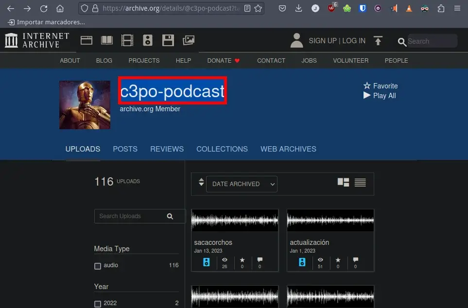
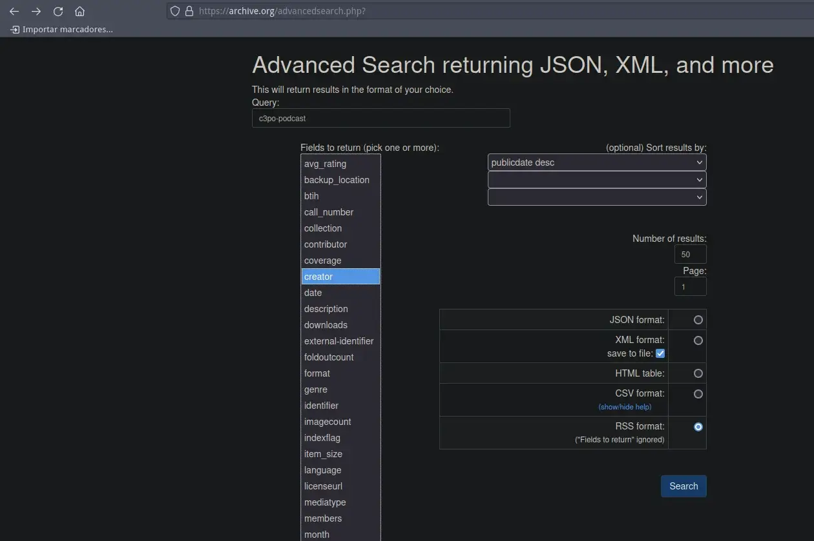
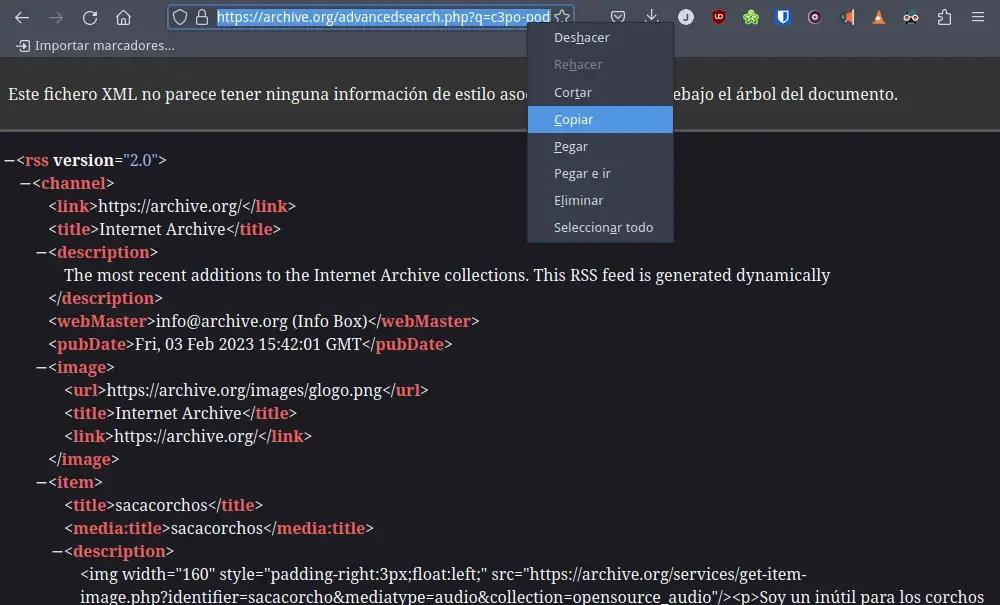
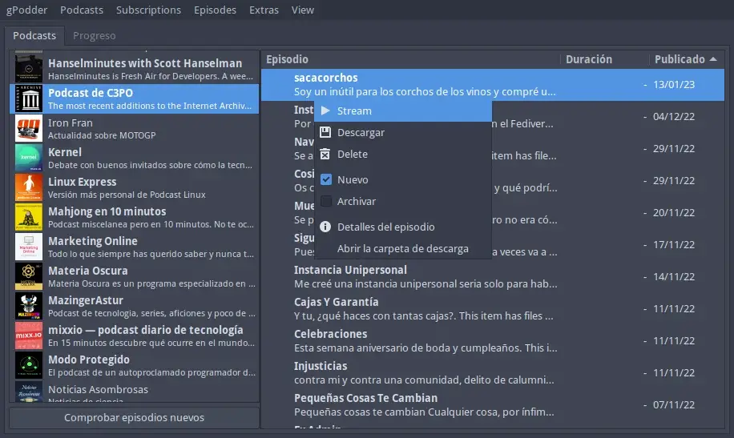

Existen ocasiones en que el creador de un podcast sube sus audios a archive.org y no genera ningún feed para que los usuarios puedan escuchar sus podcast cómodamente. Este es el caso del [podcast de C3PO](https://archive.org/details/@c3po-podcast?tab=uploads). Para solucionar este pequeño problema mostraré el procedimiento para generar un feed de los audios alojados en una cuenta de archive.org<!--more-->

## GENERAR UN FEED DE LOS FICHEROS DE AUDIO ALOJADOS EN ARCHIVE.ORG

Para generar un feed de una serie de audios alojados en archive.org tienen que realizar los siguientes pasos.

### Averiguar quien es el creador de los audios

El primer paso es anotar el nombre del creador del podcast o del audio. Para ello se dirigen a la URL en que se alojan los audios y en la zona marcada en la siguiente captura de pantalla verán el nombre del creador. En este caso el creador es `c3po-podcast`

### Generar un feed mediante las búsquedas avanzadas

Nos dirigimos al apartado de [búsquedas avanzadas de archive.org](https://archive.org/advancedsearch.php). Una vez dentro hacemos scroll hacia el apartado de las búsquedas avanzadas. En este apartado realizaremos una búsqueda considerando los siguientes criterios:

1. En el campo `query` escribiremos el nombre del creador de los audios. En el apartado anterior hemos visto que el autor era `c3po-podcast`
2. En el apartado `Fields to return` seleccionamos en campo `Creator`
3. A continuación seleccionamos que queremos ordenar los resultados por fecha de publicación descendente. Por lo tanto seleccionamos la opción `publicdate desc`
4. Seguidamente clicamos la opción `RSS format` para que los resultados de la búsqueda sean mostrados en formato RSS. Finalmente clicamos el botón Search. Justo después de clicar se generará un feed los audios de CP3PO.

### Empezar a reproducir podcast en su reproductor de podcast habitual

Al presionar el botón Search se mostrarán los resultados de la búsqueda en formato RSS. A continuación tan solo tendrán que seleccionar y copiar la URL de la barra de direcciones del navegador.

Finalmente usarán la URL copiada para suscribirse al podcast en su aplicación de podcast habitual. En mi caso uso [gpodder]() para gestionar los podcast en mi ordenador.

A partir de estos momentos podremos escuchar los podcast publicados siempre que queramos. Además cuando el autor del podcast publique un nuevo audio nos llegará sin ningún tipo de problema a nuestro Podcatcher. De este modo podremos escuchar audios almacenados en una cuenta de archive.org de forma cómoda y sin complicación alguna.
