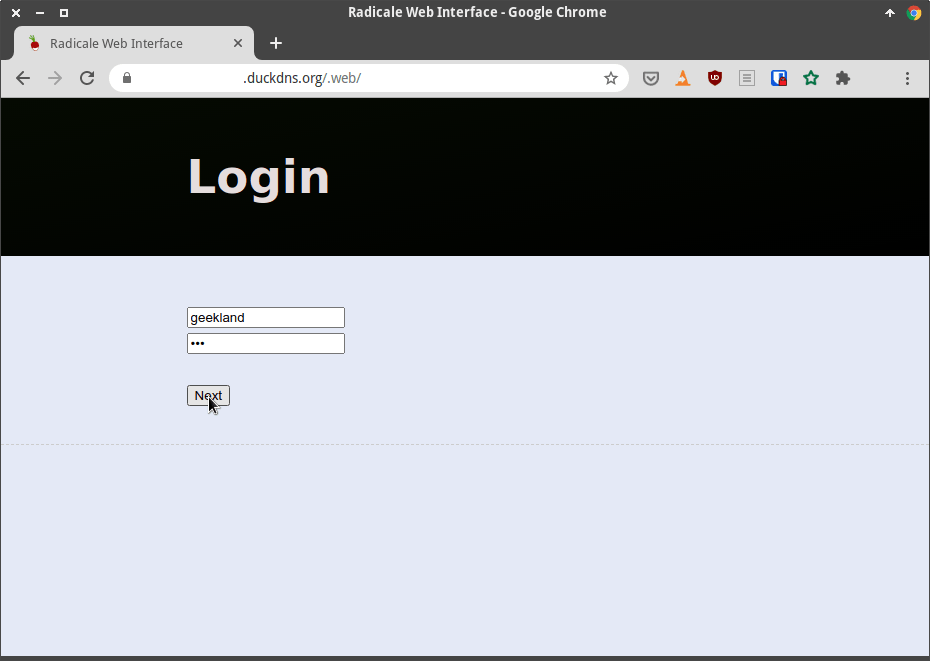
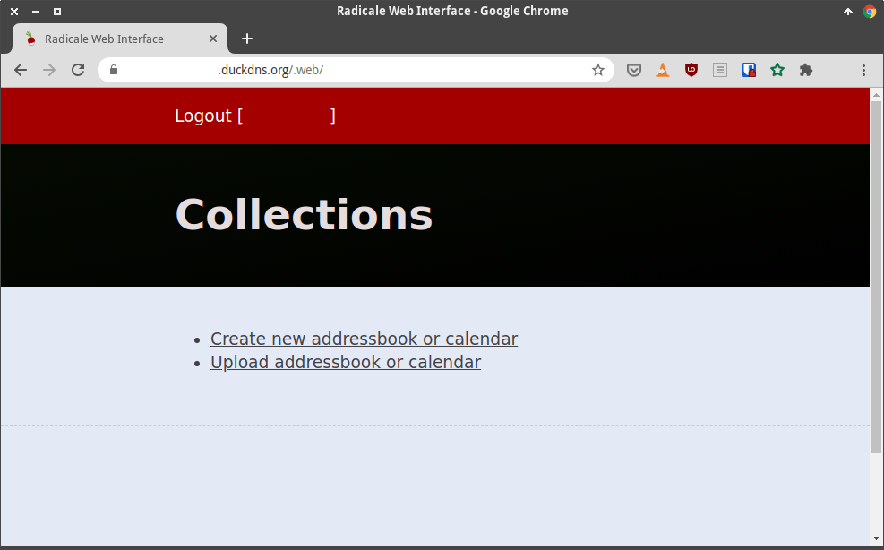

En el caso que quieran disponer de un sistema autoalojado para gestionar sus contactos, calendarios y tareas les recomiendo Radicale. Los motivos son los siguientes.<!--more-->

1. Toda la comunicación entre cliente estará cifrada si lo configuramos correctamente.
2. Podemos usar Radicale a nivel local o abrirlo al exterior.
3. Es extremadamente ligero, rápido y desarrollado en Python. Prácticamente no consume recursos y no usa base de datos.
4. Es software libre y lo podemos autoalojar. Por lo tanto es una buena opción para preservar nuestra privacidad y para dejar de depender de terceros.
5. Permite crear tantos usuarios como sea necesario. De esta forma podemos dar el servicio de gestión de calendario, contactos y tareas a multitud de personas.
6. Existen buenos clientes para la totalidad de sistemas operativos y clientes de correo que acostumbro a usar.

Es verdad que existen alternativas como Etesync o Baikal. Etesync funciona perfectamente y era mi primera opción, pero a día de hoy su principal problema es que no tiene clientes de sincronización. Por ejemplo si usáis el gestor de correo Thunderbird no existe ningún cliente de sincronización. Por este motivo en mi caso estoy usando Radicale. Para instalar y configurar Radicale deberán seguir los siguientes pasos.

**Nota**: Baikal es una opción que aún no he testeado y no tengo claro que lo haga porque al igual que Etesync funciona a través de una base de datos.

## MATERIAL QUE NECESITAMOS PARA GESTIONAR NUESTROS CONTACTOS, CALENDARIOS Y TAREAS CON RADICALE

El único material que necesitamos para seguir el tutorial es un dispositivo que funcione a modo de servidor. Este dispositivo puede ser un ordenador personal, un mini pc, una Raspberry Pi, un servidor VPS, etc.

Si disponen de un servidor y una conexión a internet pueden seguir las instrucciones que encontrarán a continuación.

## COMO INSTALAR Y CONFIGURAR RADICALE PARA GESTIONAR NUESTROS CONTACTOS, CALENDARIOS Y TAREAS

Los pasos a seguir para instalar y configurar Radicale son los que se detallan a continuación.

### Instalar Docker y Docker Compose

En mi caso he decidido instalar Radicale mediante Docker. Por lo tanto lo primero que tendremos que realizar es instalar Docker siguiendo las instrucciones del siguiente enlace:

https://geekland.eu/instalar-docker-y-docker-compose-en-linux/

### Abrir los puertos necesarios para que funcione Radicale

Para usar Radicale únicamente tenemos que abrir los puertos 80 y el 443. Los puertos los pueden abrir mediante iptables, ufw, etc. Para abrirlos con ufw tan solo tendrán que ejecutar los siguiente comandos:

Para instalar el firewall ufw tendrán que ejecutar el siguiente comando:

> ```shell
> sudo apt install ufw
> ```

Una vez finalizada la instalación activan el Firewall mediante el siguiente comando:

> **`sudo ufw enable`**

Finalmente abriremos los puertos 80 y 443 ejecutando los siguientes comandos:

> ```bash+
> sudo ufw allow http
> sudo ufw allow https
> ```

### Instalar el proxy inverso Traefik y disponer de un dominio

Para poder acceder al servicio Radicale de forma adecuada es necesario disponer de un dominio y de un proxy inverso que nos permita acceder a varios servicios a través del puerto 80 y 443. Para conseguir el dominio e instalar el proxy inverso sigan las instrucciones que se detallan en el siguiente enlace:

https://geekland.eu/instalar-y-configurar-el-proxy-inverso-traefik-en-docker/

Una vez seguidas todas las instrucciones tendrán un proxy inverso instalado y configurado en el equipo que actuará como servidor. Además dispondrán del siguiente dominio para poder acceder al servidor que alojará Radicale.

> ```shell
> geekland.duckdns.org
> ```

### Instalar Radicale usando Docker

Una vez tenemos instalado Docker nos dirigiremos a la partición `home` de nuestro equipo. Para ello ejecutaremos el comando `cd`

> ```shell
> ubuntu@ubuntu-20-04:~$ cd
> ```

A continuación crearemos los directorios que almacenarán los volúmenes de persistencia de Radicale. Concretamente crearemos los directorios `~/services/radicale/data` y `~/services/radicale/config`. Para ello ejecutaremos los siguiente comandos:

> ```shell
> ubuntu@ubuntu-20-04:~$ mkdir services
> ubuntu@ubuntu-20-04:~$ cd services
> ubuntu@ubuntu-20-04:~$ mkdir radicale
> ubuntu@ubuntu-20-04:~$ cd radicale
> ubuntu@ubuntu-20-04:~$ mkdir data
> ubuntu@ubuntu-20-04:~$ mkdir config
> ```

**Nota:** El directorio `~/services/radicale/data` almacenará los datos de nuestros calendarios, tareas y contactos. Además también contendrá los usuarios y los hash de las contraseñas de los usuarios.

**Nota:** El directorio `~/services/radicale/config` almacenará el archivo de configuración de Radicale.

Seguidamente accederemos al directorio que almacenará el fichero de configuración de Radicale:

> **`ubuntu@ubuntu-20-04:~$ cd config`**

A continuación ejecutaremos el siguiente comando para crear el archivo de configuración:

> **`ubuntu@ubuntu-20-04:~$ nano config`**

Una vez se abra el editor de textos nano pegan el siguiente código que definirá la configuración inicial de Radicale:

> ```shell
> # -*- mode: conf -*-
> # vim:ft=cfg
> 
> # Config file for Radicale - A simple calendar server
> #
> # Place it into /etc/radicale/config (global)
> # or ~/.config/radicale/config (user)
> #
> # The current values are the default ones
> 
> 
> [server]
> 
> # CalDAV server hostnames separated by a comma
> # IPv4 syntax: address:port
> # IPv6 syntax: [address]:port
> # For example: 0.0.0.0:9999, [::]:9999
> #hosts = 127.0.0.1:5232
> hosts = 0.0.0.0:5232
> 
> # Max parallel connections
> #max_connections = 8
> 
> # Max size of request body (bytes)
> #max_content_length = 100000000
> 
> # Socket timeout (seconds)
> #timeout = 30
> 
> # SSL flag, enable HTTPS protocol
> #ssl = False
> 
> # SSL certificate path
> #certificate = /etc/ssl/radicale.cert.pem
> 
> # SSL private key
> #key = /etc/ssl/radicale.key.pem
> 
> # CA certificate for validating clients. This can be used to secure
> # TCP traffic between Radicale and a reverse proxy
> #certificate_authority =
> 
> 
> [encoding]
> 
> # Encoding for responding requests
> #request = utf-8
> 
> # Encoding for storing local collections
> #stock = utf-8
> 
> 
> [auth]
> 
> # Authentication method
> # Value: none | htpasswd | remote_user | http_x_remote_user
> #type = none
> 
> # Htpasswd filename
> #htpasswd_filename = /etc/radicale/users
> 
> # Htpasswd encryption method
> # Value: plain | bcrypt | md5
> # bcrypt requires the installation of radicale[bcrypt].
> #htpasswd_encryption = md5
> 
> # Incorrect authentication delay (seconds)
> #delay = 1
> 
> # Message displayed in the client when a password is needed
> #realm = Radicale - Password Required
> 
> 
> [rights]
> 
> # Rights backend
> # Value: none | authenticated | owner_only | owner_write | from_file
> #type = owner_only
> 
> # File for rights management from_file
> #file = /etc/radicale/rights
> 
> 
> [storage]
> 
> # Storage backend
> # Value: multifilesystem
> #type = multifilesystem
> 
> # Folder for storing local collections, created if not present
> #filesystem_folder = /var/lib/radicale/collections
> filesystem_folder = /data/collections
> 
> # Delete sync token that are older (seconds)
> #max_sync_token_age = 2592000
> 
> # Command that is run after changes to storage
> # Example: ([ -d .git ] || git init) && git add -A && (git diff --cached --quiet || git commit -m "Changes by "%(user)s)
> #hook =
> 
> 
> [web]
> 
> # Web interface backend
> # Value: none | internal
> #type = none
> #type = internal
> #type = radicale_infcloud
> 
> 
> [logging]
> 
> # Threshold for the logger
> # Value: debug | info | warning | error | critical
> #level = warning
> 
> # Don't include passwords in logs
> #mask_passwords = True
> 
> 
> [headers]
> 
> # Additional HTTP headers
> #Access-Control-Allow-Origin = *
> ```

Una vez pegado el código guardan los cambios y cierran el fichero. A continuación se dirigen a la partición `/home` ejecutando el siguiente comando:

> ```shell
> ubuntu@ubuntu-20-04:~$ cd
> ```

Seguidamente crearemos y accederemos al directorio `radicale` que almacenará el docker-compose que creará el contenedor de radicale:

> ```shell
> ubuntu@ubuntu-20-04:~$ mkdir radicale && cd radicale
> ```

El siguiente paso consistirá en crear y editar el docker-compose que construirá el contenedor de radicale. Para ello ejecutamos el siguiente comando en la terminal:

> ```shell
> ubuntu@ubuntu-20-04:~$ nano docker-compose.yml
> ```

Cuando se abra el editor de texto nano pegaremos el siguiente código:

> ```shell
> version: '3'
> 
> services:
>   radicale:
>     container_name: radicale
>     image: tomsquest/docker-radicale
>     restart: unless-stopped
> 
>     networks:
>       - web
> 
>     ports:
>       - "5232:5232"
> 
>     volumes:
>       - /home/ubuntu/services/radicale/data:/data
>       - /home/ubuntu/services/radicale/config:/config:ro
> 
>     labels:
>       - traefik.enable=true
>       - traefik.port=5232
>       - traefik.backend=radicale
>       - traefik.docker.network=web
>       - traefik.frontend.rule=Host:radicale.geekland.duckdns.org
> 
> networks:
>   web:
>     external: true
> ```

**Nota:** Si han seguido los pasos al pie de la letra unicamente deberán sustituir `radicale.geekland.duckdns.org` por el dominio que estén usando en su caso. También aseguren que la ruta de los volúmenes persistentes sea la correcta.

Una vez generada la configuración guardamos los cambios y cerramos el fichero. Finalmente ya podemos levantar el contenedor ejecutando el siguiente comando en la terminal:

> ```shell
> ubuntu@ubuntu-20-04:~/radicale$ docker-compose up -d
> ```

### Crear los usuarios de Radicale y definir una contraseña para ellos

En estos momentos Radicale es plenamente funcional, pero el problema es que cualquier persona que conozca la URL para acceder a Radicale podrá usar el servicio. Para que únicamente puedan acceder al servidor los usuarios autorizados tendremos que seguir el siguiente proceso:

Inicialmente accederemos dentro del contenedor de Radicale ejecutando el siguiente comando en la terminal:

> ```shell
> ubuntu@ubuntu-20-04:~/radicale$ docker exec -it radicale bash
> ```

Una vez dentro del contenedor instalaremos el paquete `apache2-utils` para poder autenticar a los usuarios que usan Radicale. Para ello ejecutaremos el siguiente comando:

> ```shell
> bash-5.0# apk update
> bash-5.0# apk --no-cache add apache2-utils
> ```

A continuación crearemos el fichero `users` en la ubicación `/data/radicale` que almacenará los usuarios y las contraseñas hasheadas de los usuarios que crearemos. Para ello ejecutaremos los siguientes comandos:

> ```shell
> bash-5.0# cd data
> bash-5.0# mkdir radicale
> bash-5.0# cd radicale
> bash-5.0# touch users
> ```

Seguidamente crearemos un usuario llamado `geekland` y definiremos una contraseña para este usuario. Para ello ejecutaremos el siguiente comando en la terminal:

> ```shell
> bash-5.0# htpasswd -c /data/radicale/users geekland
> New password: micontraseña
> Re-type new password: micontraseña
> Adding password for user geekland
> ```

**Nota**: Observen que una vez ejecutado el comando tendremos que definir la contraseña para el usuario geekland.

Acto seguido limpiaremos toda la cache de apk y el historial de la terminal para que el contenedor pese lo menos posible. Para ello ejecutaremos los siguientes comandos:

> **`bash-5.0# rm -rf /var/cache/apk/* bash-5.0# history -c`**

Finalmente saldremos del contenedor mediante el comando `exit`.

> ```shell
> bash-5.0# exit
> ```

### Modificar el archivo de configuración de Radicale

Desde del sistema operativo que corre Docker modificaremos el archivo de configuración para que se puedan autenticar los clientes. Si han seguido los pasos al pie de la letra podrán acceder al archivo de configuración ejecutando el siguiente comando:

> ```shell
> ubuntu@ubuntu-20-04:~$ nano ~/services/radicale/config/config
> ```

Cuando se abra el archivo de configuración tienen que dejar la sección `[auth]` del modo que pueden ver a continuación:

> ```shell
> [auth]
> 
> # Authentication method
> # Value: none | htpasswd | remote_user | http_x_remote_user
> type = htpasswd
> 
> # Htpasswd filename
> htpasswd_filename = /data/radicale/users
> 
> # Htpasswd encryption method
> # Value: plain | bcrypt | md5
> # bcrypt requires the installation of radicale[bcrypt].
> htpasswd_encryption = md5
> 
> # Incorrect authentication delay (seconds)
> #delay = 1
> 
> # Message displayed in the client when a password is needed
> #realm = Radicale - Password Required
> ```

**Nota**: Aseguren que la variable `htpasswd_filename` apunte a la ruta que almacena los usuarios y los passwords hasheados de los usuarios. Si han seguido las indicaciones al pie de la letra la ruta debería ser `/data/radicale/users`

A continuación guardamos los cambios y cerramos el fichero. Finalmente reiniciaremos el contenedor de Radicale ejecutando el siguiente comando:

> ```shell
> ubuntu@ubuntu-20-04:~$ docker restart radicale
> ```

## ACCEDER AL SERVICIO RADICALE VIA WEB PARA CREAR CALENDARIOS Y LIBROS DE CONTACTOS

A partir de estos momentos ya podemos acceder a la interfaz web de Radicale. Para ello tan solo tenemos que introducir la URL que definimos para acceder a Radicale e introducir nuestro usuario y contraseña.

[](images/pantalla-login-radicale.png "Pantalla de Login para Radicale")

Una se hayan logueado verán lo siguiente:

[](images/logueado-en-radicale.png "Panel de control de Radicale")

Como pueden ver la interfaz web es extremadamente sencilla y solo permite las siguientes operaciones:

1. Crear calendarios y listados de tareas.
2. Crear libros de direcciones y contactos.
3. Subir o importar calendarios y listados de tareas.
4. Subir o importar libros de direcciones y contactos.

La interfaz web no permite crear usuarios ni introducir datos a los libros de contactos y calendarios. Los usuarios los tendremos que crear manualmente en la terminal y las entradas en los calendarios y libros de direcciones y tareas lo haremos mediante clientes.

## CLIENTES QUE PODEMOS USAR PARA GESTIONAR NUESTROS CONTACTOS, CALENDARIOS Y TAREAS CON RADICALE

Existen clientes de Radicale para la totalidad de sistemas operativos. A continuación detallaremos algunas de las opciones disponibles.

| Sistema operativo o Programa | Clientes que podemos usar |
| --- | --- |
| Android | Usad las aplicaciones [Davx5](https://play.google.com/store/apps/details?id=at.bitfire.davdroid "Link para instalar Davx5") o [OpenSync](https://play.google.com/store/apps/details?id=com.deependhulla.opensync "Link para instalar OpenSync"). Existen otros clientes como aCal, CalDAV-Sync, CardDAV-Sync, etc. Pero bajo mi punto les recomiendo las 2 primeras, porque las he probado y funcionan. |
| Windows, MacOS, Linux | Usar Thunderbird con los plugin [Cardbook](https://addons.thunderbird.net/es/thunderbird/addon/cardbook/ "Link para instalar Cardbook") para los contactos y [Lightning](https://addons.thunderbird.net/es/thunderbird/addon/lightning/ "Link para instalar Lightning") para los calendarios y tareas. |
| Navegador Web | Instalar [Infcloud](https://www.inf-it.com/open-source/clients/infcloud/ "Web del proyecto Infcloud"). Infcloud es una interfaz web que nos permitirá gestionar los calendarios y contactos de Radicale vía navagador web estemos donde estemos. |
| Linux | Existen diversas opciones. Algunas de ellas son Korganizer, Gnome Calendar, Gnome contacts, usar el cliente de correo Evolution, etc. |
| MacOS y iOS | Las aplicaciones de contactos y calendarios predeterminadas del sistema operativo de iOS y MacOS funcionan. |

Para instalar el cliente web InfCloud deberán seguir las instrucciones que les dejo en el siguiente enlace:

https://geekland.eu/instalar-infcloud-para-gestionar-nuestros-contactos-calendarios-y-tareas/

En futuros artículos les mostraré como instalar y sincronizar nuestros calendarios, contactos y tareas con el resto de los clientes citados en la tabla.

#### Fuentes

[https://radicale.org/3.0.html](https://radicale.org/3.0.html) [https://hub.docker.com/r/tomsquest/docker-radicale/](https://hub.docker.com/r/tomsquest/docker-radicale/) [https://github.com/tomsquest/docker-radicale](https://github.com/tomsquest/docker-radicale)
