A continuación veremos una solución para poder gestionar contraseñas con software libre y sin depender de una infraestructura de terceros. La solución que propongo es la siguiente:<!--more-->

1. Utilizar **la nube Nextcloud** para alojar la base de datos que contendrá nuestras contraseñas. De esta forma podremos sincronizar las contraseñas en la totalidad de nuestros dispositivos.
2. Usar la **aplicación Keeweb en Nextcloud**. De esta forma estemos donde estemos podremos consultar, almacenar y gestionar nuestras contraseñas mediante una interfaz web.
3. En nuestro ordenador personal usaremos el **gestor de contraseñas KeepassXC**. KepassXC se conectará y trabajará con la base de datos de contraseñas alojada en Nextcloud. KeepassXC está disponible para Windows, Linux y MacOS.
4. En Android usaremos el **gestor de contraseñas Keepass2Android**. Al igual que KeepassXC, Keepass2Android se conectará y trabajará con el archivo de contraseñas almacenado en Nextcloud.
5. En Firefox y en chrome usaremos la **extensión KeePassXC-Browser**. De esta forma podremos autorellenar las contraseñas para acceder a nuestros servicios mientras navegamos.

###### Nota: Keeweb, KeepassXC, Kepass2Android y KeePassXC-Browser son programas distintos que trabajan con un mismo formato de base de datos. Por esto motivo con software diferentes podremos usar una base de datos de contraseñas común.

La opción mencionada en el artículo es la más sencilla si nuestro objetivo es gestionar nuestras contraseñas con software libre y sin depender de una infraestructura de terceros.

Si queremos gestionar nuestras contraseñas con software libre dependiendo de una infraestructura de terceros les recomiendo el uso de Bitwarden. Bitwarden funciona de forma muy similar a LastPass, pero con la ventaja que es Software Libre.

## VENTAJAS DE GESTIONAR CONTRASEÑAS CON NUESTRA NUBE Y SOFTWARE LIBRE

La solución que aplicaremos a continuación implica el uso de software libre y alojar la base de datos en nuestra propia nube. Si aplicamos la solución propuesta dispondremos de las siguientes ventajas y prestaciones:

1. **Tendremos el control total** de nuestras contraseñas. Las contraseñas estarán alojadas en nuestro propio servidor y no estarán en un servidor de terceros. ¿Os fiáis de almacenar contenido sensible en un servidor que no está gestionado por nosotros?
2. Aunque estemos en un ordenador ajeno **podremos gestionar y disponer de nuestras contraseñas desde cualquier lugar**.
3. Las **contraseñas se sincronizarán entre dispositivos**.
4. Podremos **autocompletar de forma automática las contraseñas** en nuestro ordenador y en nuestro teléfono.
5. El software utilizado será 100% software libre. Por lo tanto **podemos estar seguros de nuestra privacidad**.
6. Las **contraseñas estarán cifradas**. Por lo tanto aunque alguien consiga acceder a nuestra nube no podrá conseguir fácilmente nuestras contraseñas.
7. Podremos **generar contraseñas seguras** sin necesidad de tener que recordarlas.
8. **Clasificar y realizar búsquedas de nuestras contraseñas** de forma sencilla.

## INFRAESTRUCTURA NECESARIA PARA GESTIONAR CONTRASEÑAS DE FORMA SEGURA

Los 2 únicos requisitos para seguir las instrucciones del tutorial son:

1. Disponer de una Raspberry Pi o un ordenador Personal en el que instalaremos Nextcloud.
2. Tener conexión a Internet.

## PASOS A SEGUIR PARA GESTIONAR CONTRASEÑAS DE FORMA AUTÓNOMA Y SEGURA

Los pasos a seguir para poder gestionar nuestras contraseñas en la totalidad de nuestros dispositivos son los siguientes:

### INSTALAR Y CONFIGURAR UNA NUBE NEXTCLOUD

El paso más importante es instalar Nextcloud. Nextcloud se encargará que las contraseñas estén disponibles en cualquier lugar y asegurará la sincronización de contraseñas entre dispositivos.

Para instalar y configurar Nextcloud en una Raspberry Pi pueden seguir los enlaces que les dejo a continuación:

https://geekland.eu/instalar-nextcloud-mariadb-lighttpd/

https://geekland.eu/configurar-optimizar-rendimiento-nextcloud/

Si por lo contrario pretenden instalar Nextcloud en un ordenador o servidor que use el sistema operativo Ubuntu pueden seguir las instrucciones detalladas a continuación:

https://geekland.eu/instalar-nextcloud-en-ubuntu/

###### Nota: Si quieren pueden usar otras nubes como Google Drive, Dropbox, OneDrive, etc. Pero en el momento de hacerlo almacenarán sus contraseñas en un servidor que no sabemos que hará con nuestra información.

### INSTALAR Y CONFIGURAR KEEPASSXC EN NUESTRO ORDENADOR

En función del sistema operativo que usen deberán instalar KeepassXC del siguiente modo.

#### Instalar el gestor de contraseñas KeepassXC en Debian, Ubuntu y distribuciones derivadas

Para instalar KeepassXC en Debian, Ubuntu y distribuciones derivadas de Debian y Ubuntu tienen que ejecutar el siguiente comando en la terminal:

> ```
> sudo apt install keepassxc
> ```

#### Instalación del gestor de contraseñas KeepassXC en Windows

Si usan Windows pueden descargar KeepassXC de la siguiente web:

[https://keepassxc.org/download/#windows](https://keepassxc.org/download/#windows)

Una vez descargado el archivo de instalación lo instalarán de forma habitual.

#### Instalar el gestor de contraseñas KeepassXC en MacOS

Si por lo contrario quieren instalar KeepassXC en MacOS deberán dirigirse a la siguiente URL para descargar el programa:

[https://keepassxc.org/download/#mac](https://keepassxc.org/download/#mac)

Una vez descargado el archivo de instalación tan solo tendrán que instalarlo de la forma habitual.

#### Crear una base de datos en la nube para gestionar contraseñas

Abrimos la aplicación KeepassXC. Una vez abierta clicamos en la opción Crear una nueva base de datos.

[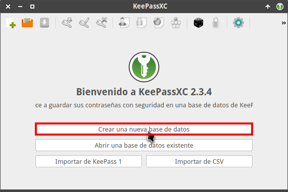](images/crear-base-de-datos-keepassxc.png)

Suponiendo que tenemos instalado y configurado un [cliente de Nextcloud]() definimos un nombre para la base de datos y **la guardamos en la ubicación que queramos dentro de la carpeta que está constantemente sincronizándose con Nextcloud**.

[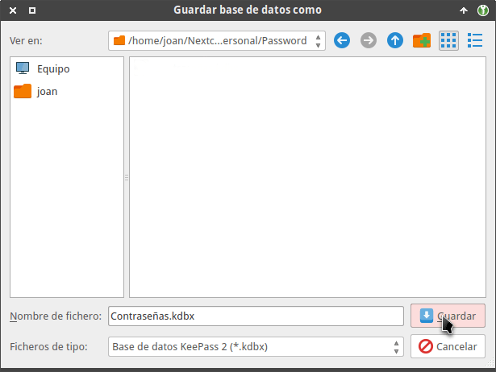](images/definir-nombre-y-ubicacion-base-datos.png)

###### Nota: En el caso que no quieran usar un cliente de Nextcloud pueden sincronizar la base de datos mediante el protocolo WebDav.

Finalmente definimos la contraseña que queremos que tenga nuestra base de datos y presionamos el botón Aceptar.

[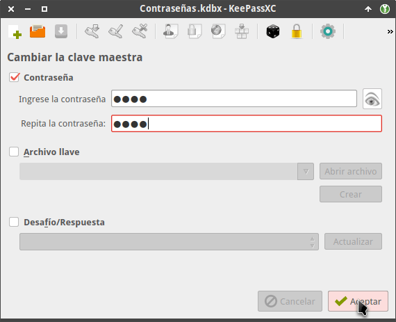](images/definir-contraseña-base-datos.png)

En estos momentos ya disponemos de una base de datos en la nube. Además, la base de datos podrá sincronizarse con el resto de nuestros equipos.

#### Introducir las primeras entradas a la base de datos de contraseñas

Para introducir contenido a nuestra base de datos clicamos encima del icono Añadir nueva entrada.

[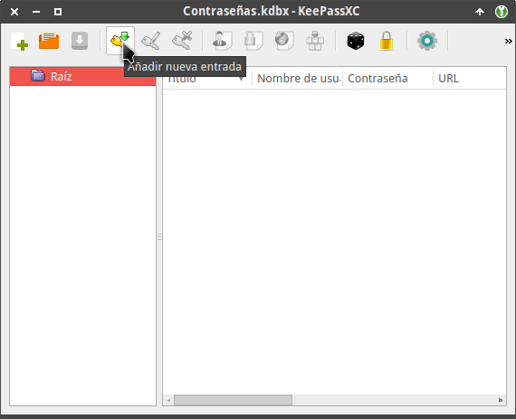](images/añadir-nueva-entrada.png)

A continuación introducimos la información necesaria para loguearnos a un determinado servicio que en mi caso será Dropbox. La información necesaria será la siguiente:

- **Título:** Podemos poner el nombre del servicio que en mi caso será Dropbox.
- **Nombre de usuario:** Corresponde al usuario o email que introducimos para loguearnos a nuestra cuenta de Dropbox.
- **Contraseña** y **Repetir:** En los campos Contraseña y Repetir tenemos que introducir la contraseña que usamos para loguearnos al servicio de Dropbox.
- **URL:** En el campo URL tenemos que introducir la dirección web que aparece en el navegador en el momento de introducir el usuario y la contraseña de Dropbox.

Una vez introducidos todos los datos presionamos el botón Aceptar.

[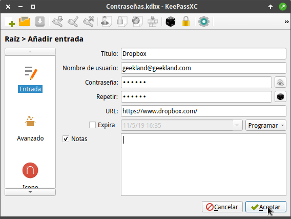](images/rellenar-informacion-credenciales.png)

###### Nota: Si queremos podemos configurar muchas más opciones como por ejemplo añadir fecha de caducidad a la contraseña, poner notas, clasificar las contraseñas por grupos, etc.

### INSTALAR Y CONFIGURAR KEEWEB EN NEXTCLOUD

**Disponemos de 2 opciones para instalar Keeweb**. **La más sencilla es accediendo al apartado de** Aplicaciones de Nextcloud.

[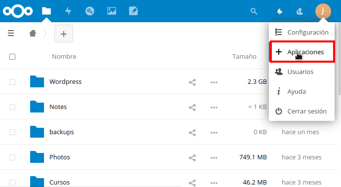](images/acceder-aplicaciones-nextcloud.png)

Una vez dentro, en el cuadro de búsqueda escribimos Keeweb y presionamos enter. Una vez finalizada la búsqueda clicamos en el botón Descargar y Activar.

[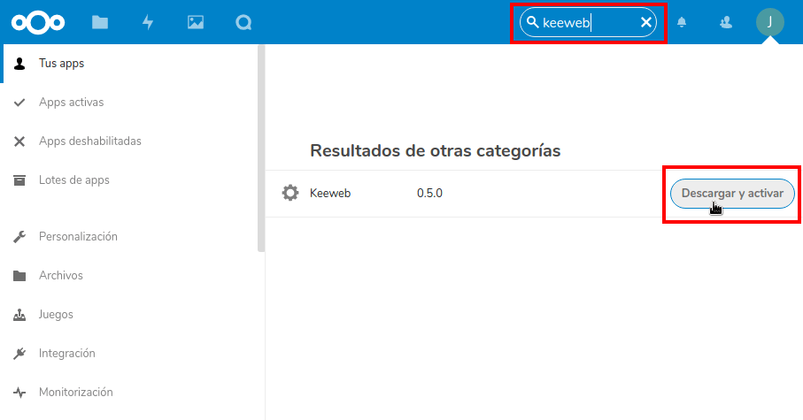](images/descargar-y-activar-keeweb.png)

De este forma tan sencilla ya hemos instalado Keeweb en Nextcloud.

**Si pretendemos realizar una instalación manual** deberemos ejecutar el siguiente comando en la terminal del sistema operativo donde tenemos instalado Nextcloud:

> ```
> wget https://github.com/jhass/nextcloud-keeweb/releases/download/v0.5.0/keeweb-0.5.0.tar.gz
> ```

Acto seguido descomprimiremos el fichero que acabamos de descargar en la carpeta de Apps de Nextcloud. Para ello en mi caso ejecutaré el siguiente comando en la terminal:

> ```
> sudo tar xvf keeweb-0.5.0.tar.gz -C /var/www/html/nextcloud/apps/
> ```

Una vez descomprimido el archivo lo podemos borrar ejecutando el siguiente comando en la terminal:

> ```
> rm keeweb-0.5.0.tar.gz
> ```

#### Configurar Nextcloud para que pueda detectar la extensión de archivo .kdbx

Para que Nextcloud sea capaz de detectar la extensión de archivo .kdbx que contendrá la base de datos ejecutaremos el siguiente comando en la terminal:

> ```
> sudo cp /var/www/html/nextcloud/resources/config/mimetypemapping.dist.json /var/www/html/nextcloud/config/mimetypemapping.json
> ```

A continuación editaremos el archivo **mimetypemapping.json** ejecutando el siguiente comando en la terminal:

> ```
> sudo nano /var/www/html/nextcloud/config/mimetypemapping.json
> ```

Cuando se abra el editor de archivos nano añadiremos el siguiente código en la penúltima línea:

> ```
>         "kdbx": ["application/x-kdbx"]
> ```

[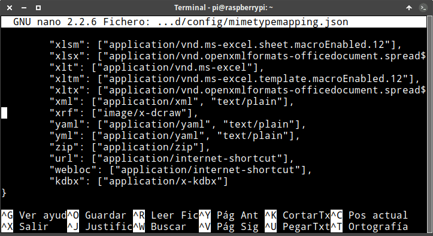](images/configurar-extension-keeweb-en-nextcloud.png)

Una vez introducida la línea guardamos los cambios y cerramos el fichero.

Seguidamente aseguramos que los grupos y los permisos de la aplicación Keeweb son los correctos. Para ello en mi caso ejecutaré el siguiente comando en la terminal:

> ```
> sudo chown -R www-data:www-data /var/www/html/nextcloud/apps/keeweb
> ```

A continuación accederemos a la ubicación raíz de Nextcloud ejecutando el siguiente comando en la terminal:

> ```
> cd /var/www/html/nextcloud/
> ```

Acto seguido ejecutaremos el siguiente comando para asegurar que se apliquen las configuraciones que acabamos de realizar:

> ```
> sudo -u www-data php occ files:scan --all
> ```

Finalmente nos dirigimos al menú de apps de Nextcloud.

[](images/acceder-aplicaciones-nextcloud.png)

Una vez dentro del apartado de aplicaciones comprobamos que la aplicación Keeweb esté activada. En el caso que no esté activada presionen sobre el botón Activar.

[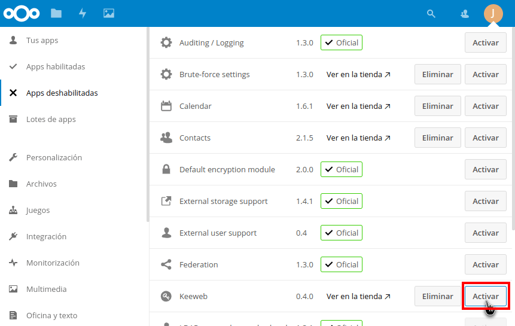](images/activar-keeweb.png)

#### Consultar e introducir contraseñas en KeeWeb

Una vez instalado Keeweb podemos consultar y añadir nuevas entradas a nuestra base de datos. Para ello abrimos Nextcloud, nos dirigimos a la ubicación donde almacenamos la base de datos y clicamos sobre la base de datos:

[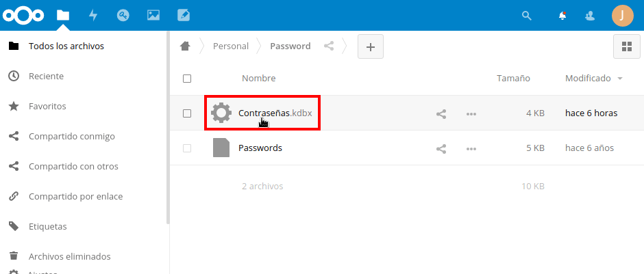](images/acceder-a-keeweb.png)

A continuación tenemos que introducir la contraseña de nuestra base de datos y presionar Enter:

[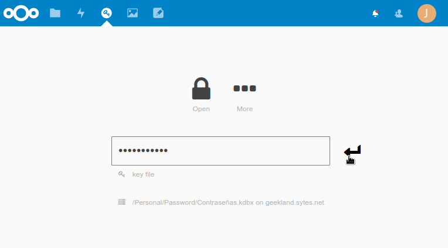](images/introducir-contraseña-base-de-datos.png)

Seguidamente podremos ver y consultar la totalidad de nuestras contraseñas:

[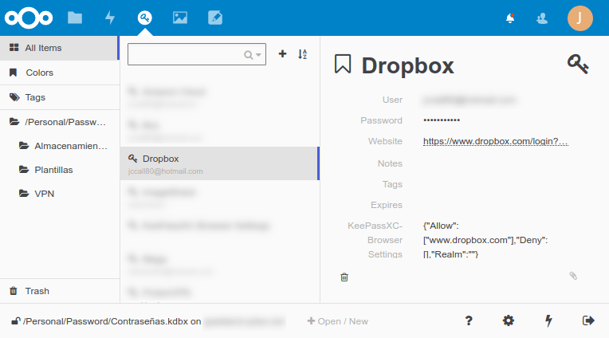](images/gestionar-contraseñas-en-la-nube.png)

También podremos añadir nuevas contraseñas. Para ello presionamos el botón + y cuando se despliegue el menú clicamos encima de la opción Entry.

[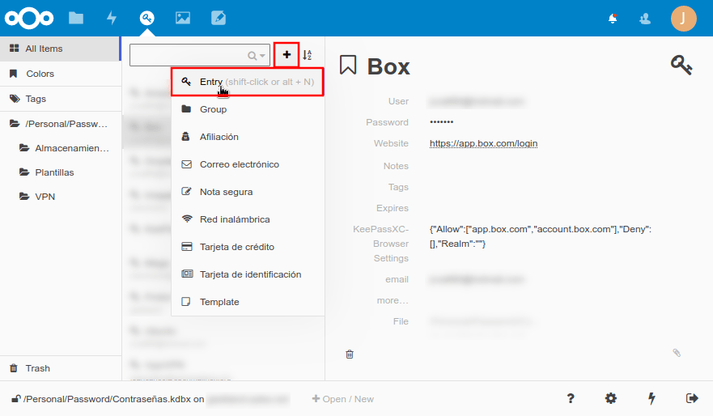](images/añadir-nueva-contraseña-a-base-de-datos.png)

Acto seguido tan solo tenemos que introducir la totalidad de información y credenciales para acceder al servicio que queramos:

[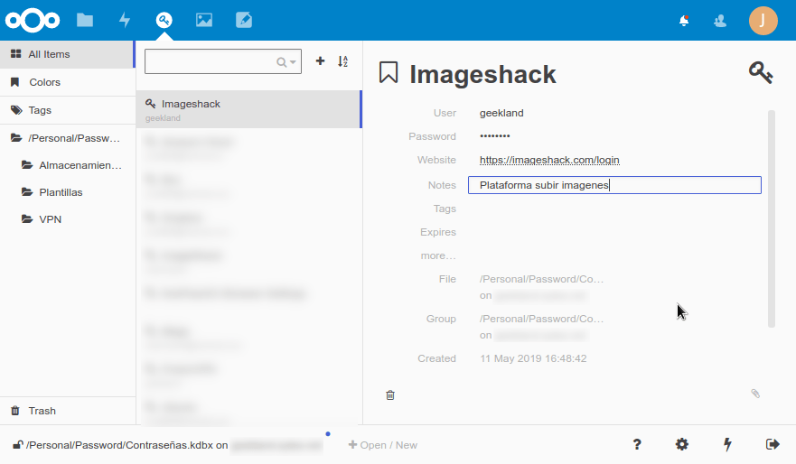](images/entrada-creada.png)

Las opciones para introducir y clasificar las contraseñas serán equivalentes a KeePassXC.

### INSTALAR Y CONFIGURAR KEEPASS2ANDROID EN NUESTRO DISPOSITIVO ANDROID

Para instalar Keepass2Android cliquen en el siguiente enlace:

[https://play.google.com/store/apps/details?id=keepass2android.keepass2android&hl=es](https://play.google.com/store/apps/details?id=keepass2android.keepass2android&hl=es "Link para la instalación de KeePass2Android")

Acto seguido pulsen encima del botón Instalar.

[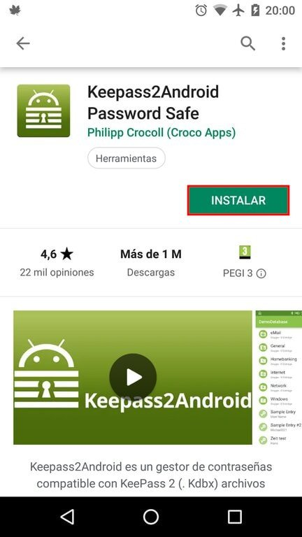](images/instalar-keepass2android.jpg)

A continuación abrimos la aplicación y presionamos encima de la opción Abrir archivo...

[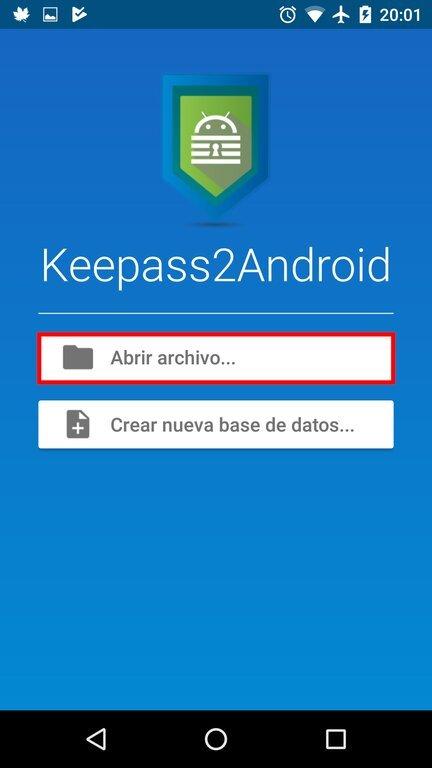](images/abrir-base-de-datos.jpg)

La base de datos de contraseñas está ubicada en nuestra nube Nextcloud. Por lo tanto el siguiente paso consiste en clicar encima de la opción Nextcloud.

[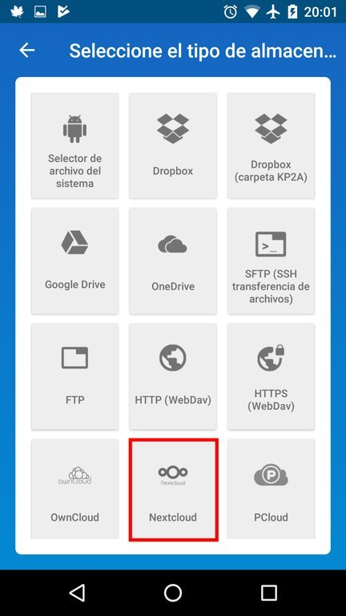](images/seleccionar-nextcloud.jpg)

Acto seguido ingresamos la URL y las credenciales que usamos para acceder a Nextcloud vía navegador web. A continuación presionamos en el botón Aceptar.

[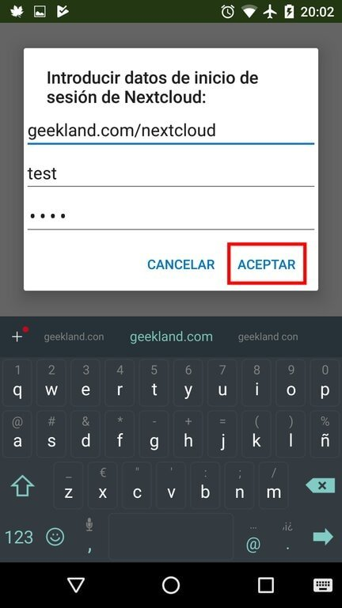](images/credenciales-para-nube-nextcloud.jpg)

Seguidamente navegamos hacia la ubicación donde guardamos la base de datos de contraseñas. Una vez encontrada la base de datos presionamos sobre ella.

[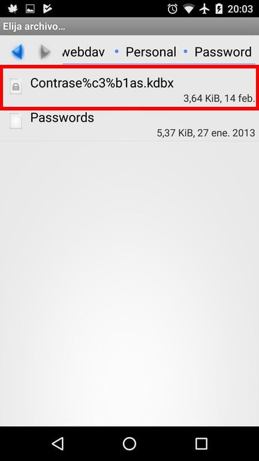](images/clicar-base-datos-contraseñas.jpg)

Finalmente tan solo tenemos que escribir la contraseña para desbloquear la base de datos y presionar el botón Desbloquear.

[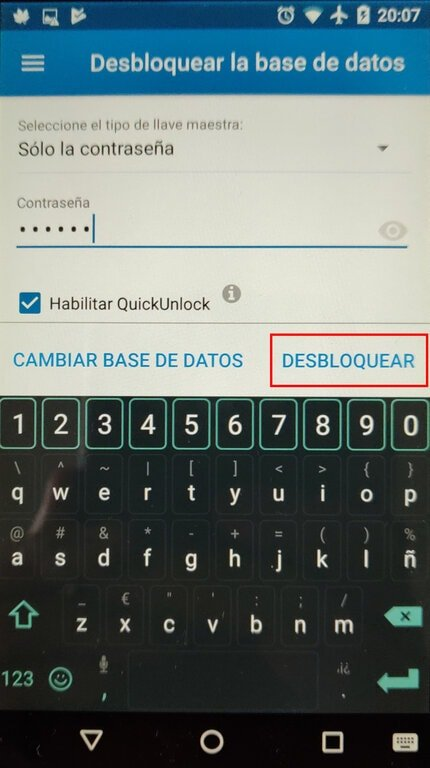](images/desbloquear-base-de-datos.jpg)

A partir de estos momentos podremos consultar y gestionar nuestras contraseñas con nuestro dispositivo Android. Además cualquier cambio que hagamos en la base de datos se sincronizará en la totalidad de nuestros dispositivos.

[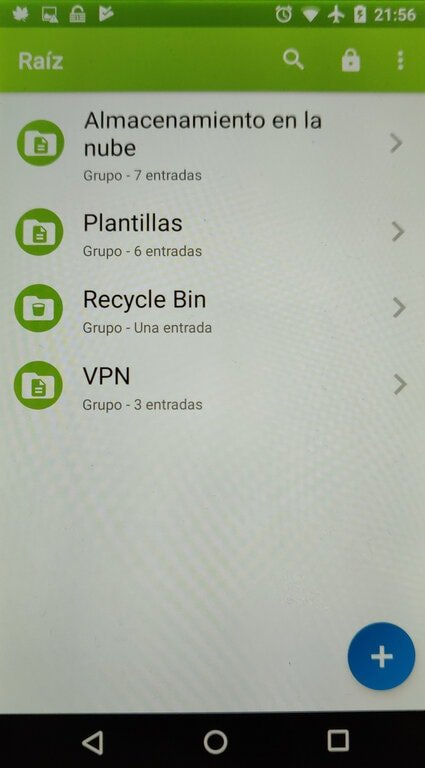](images/acceso-a-contraseñas.jpg)

Una vez dentro de la aplicación podremos configurar el autocompletado, usar nuestra huella dactilar para desbloquear la base de datos, introducir nuevas contraseñas, consultar, crear y agrupar contraseñas, etc.

### INSTALAR Y CONFIGURAR KEEPASSXC-BROWSER EN FIREFOX, CHROME, CHROMIUM Y VIVALDI

Para autocompletar las contraseñas de las webs que visitamos tenemos que acceder a KeepassXC y dar los permisos pertinentes.

#### Dar autorización a nuestro navegador para que pueda conectarse a la base de datos de contraseñas

Abrimos la aplicación KeePassXC y clicamos en el botón de Configuración:

[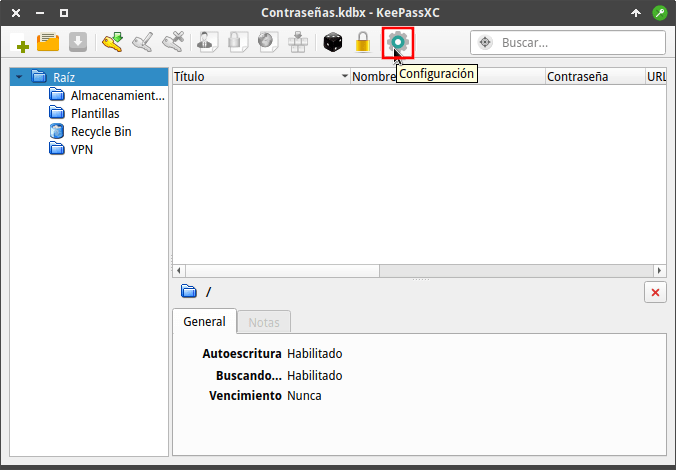](images/acceder-configuracion-keepassXC.png)

Acto seguido presionamos en la opción Integración con Navegadores. A continuación marquen la opción Permitir la integración de KeepassXC con el navegador. Finalmente tan solo hay que seleccionar los navegadores que usan habitualmente y presionar sobre el botón Aplicar.

[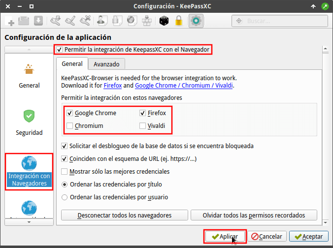](images/activar-integracion-navegadores.png)

A partir de estos momentos, los navegadores seleccionados tendrán permiso para conectarse a la base de datos que contienen las contraseñas.

#### Instalar y configurar la extensión KeePassXC-Browser en nuestro navegador

El siguiente paso consiste en instalar la extensión de KeePassXC-Browser en nuestro navegador. Para ello, si usamos Firefox clicaremos en el siguiente enlace para dirigirnos a la web que nos permitirá instalar la extensión:

[https://addons.mozilla.org/en-US/firefox/addon/keepassxc-browser/](https://addons.mozilla.org/en-US/firefox/addon/keepassxc-browser/ "Link para instalar KeePassXC-Browser en Firefox")

Si por lo contrario usamos Google Chrome, Chromium o Vivaldi tendremos que clicar en el siguiente enlace:

[https://chrome.google.com/webstore/detail/keepassxc-browser/oboonakemofpalcgghocfoadofidjkkk](https://chrome.google.com/webstore/detail/keepassxc-browser/oboonakemofpalcgghocfoadofidjkkk "Link para instalar KeePassXC-Browser en Chrome")

Una vez dentro de la página que nos permitirá instalar la extensión clican sobre el botón Add to Firefox o Añadir a Chrome. Acto seguido se procederá a la instalación de la extensión.

Al finalizar la instalación aparecerá el icono de Kepass en el panel de extensiones del navegador. Posicionamos el puntero del ratón sobre el icono de KeePassXC-Browser, clicamos el botón izquierdo del ratón y cuando aparezca el menú contextual presionamos encima del botón Conectar.

[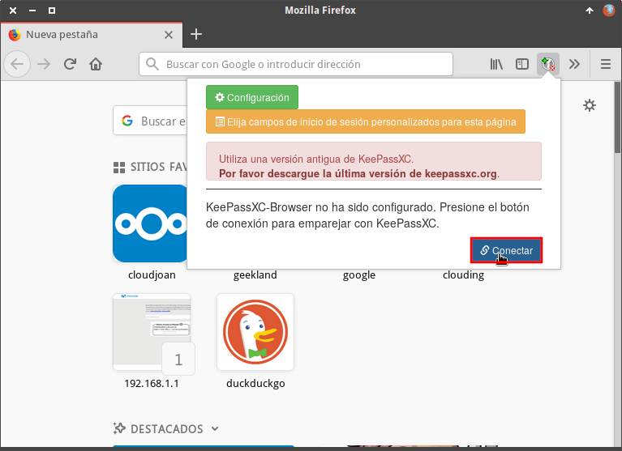](images/conectar-KeePassXC-con-KeePassXC-browser.png)

A continuación introducimos un nombre único que se usará como identificador al conectarnos a nuestra base datos. En mi caso uso el nombre geekland y presiono el botón Guardar y permitir acceso.

[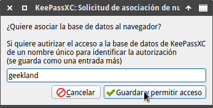](images/asociar-base-datos-al-navegador.png)

A partir de estos momentos nuestro navegador tendrá acceso a la totalidad de contraseñas y credenciales almacenadas en nuestra base de datos.

## AUTOCOMPLETAR LAS CONTRASEÑAS DE FORMA AUTOMÁTICA

La solución propuesta en el artículo permite autorellenar los usuarios y contraseñas para acceder a nuestros servicios. Para ello deberemos proceder del siguiente modo:

### AUTOCOMPLETAR CONTRASEÑAS EN EL NAVEGADOR WEB DE NUESTRO ORDENADOR

Asegurar que KeePassXC esté abierto y estemos logueados. Es necesario tenerlo abierto para que el navegador pueda conectarse a la base de datos de contraseñas.

[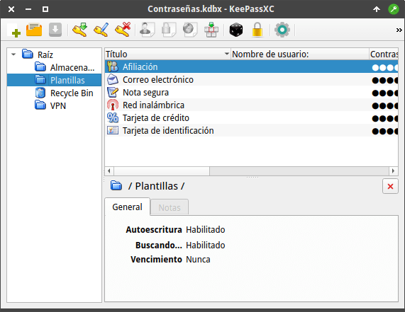](images/Abrir-keepassXC.png)

Abrimos el navegador y nos dirigimos al servicio web que queremos usar que en mi caso es Mega. Nos posicionamos encima del cuadro de texto para escribir el usuario. Presionamos el botón derecho del ratón y cuando aparezca el menú contextual posicionamos el puntero del mouse en la opción KeePassXC Browser. Acto seguido clicamos en la opción Llene nombre de Usuario y Contraseña.

[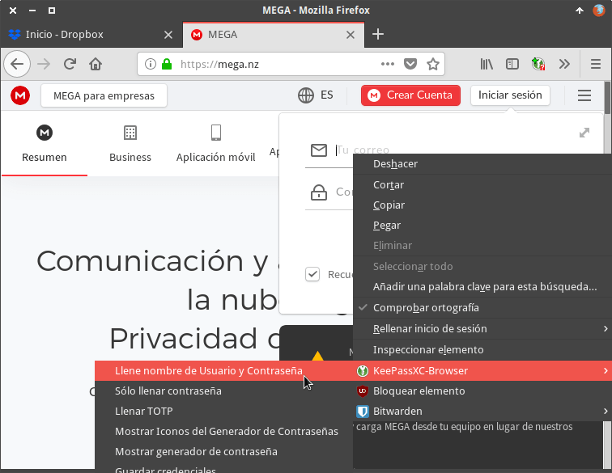](images/autorellenar-el-usuario-y-contraseña.png)

Al ser la primera vez que autorellenamos las credenciales para acceder Mega recibiremos la advertencia que Mega quiere usar nuestra base de datos de contraseñas. Frente a la advertencia tildamos la opción Recordar esta decisión y presionamos el botón Permitir. De esta forma Mega siempre tendrá permiso para acceder a las credenciales que tenemos almacenadas en nuestra base datos.

[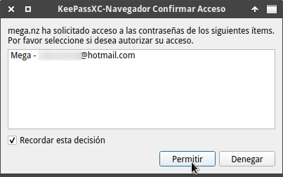](images/dar-permisos-al-servico.png)

Una vez otorgados los permisos necesarios volvemos a repetir la operación que realizamos anteriormente:

[](images/autorellenar-el-usuario-y-contraseña.png)

Acto seguido se rellenarán los campos de usuario y contraseña. En este momento tan solo tenemos que clicar sobre el botón Iniciar Sesión.

[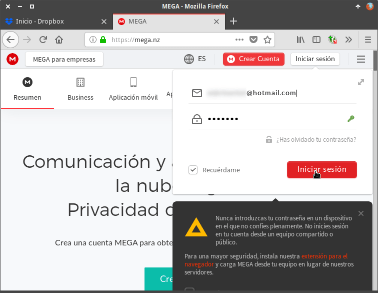](images/usuario-y-contraseña-cumplimentados.png)

### AUTOCOMPLETAR CONTRASEÑAS EN NUESTRO TELÉFONO ANDROID

En Android también podremos autorellenar fácilmente las credenciales para acceder a nuestros servicios. Para ello tienen que seguir las siguientes instrucciones.

#### Activar el teclado Keepass2Android

La primera vez que usamos Keepass2Android tendremos que añadir el teclado de KeePass2Android. Para ello nos dirigimos a la web en que tenemos que introducir el usuario y la contraseña y presionamos el botón de opciones de configuración:

[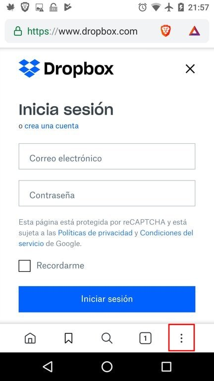](images/acceder-opciones-navegador.jpg)

Cuando se abra el menú presionamos encima de la opción Compartir...

[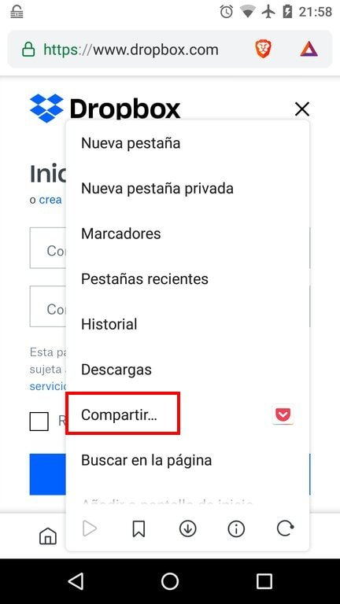](images/presionar-opcion-compartir.jpg)

Acto seguido presionamos encima de la opción Kepass2Android: Buscar.

[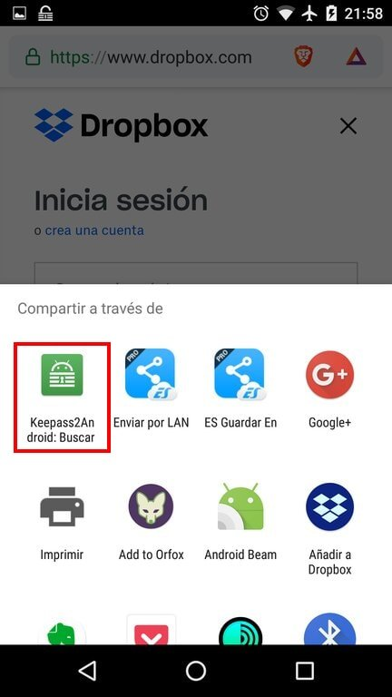](images/Seleccionar-compartir-con-keepass2android.jpg)

A continuación activamos el teclado Keepass2Android:

[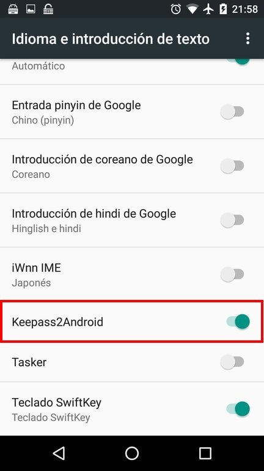](images/activar-teclado-keepass2android.jpg)

De este modo el teclado de KeePass2Android ya estará activado de forma permanente.

#### Autocompletar contraseñas en Android

Una vez finalizada la activación del teclado volvemos a clicar encima del botón de opciones de configuración:

[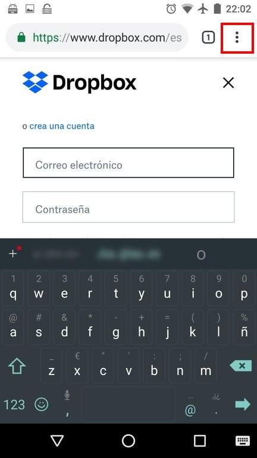](images/entrar-opciones-navegador.jpg)

Cuando se abra el menú presionamos encima de la opción Compartir...

[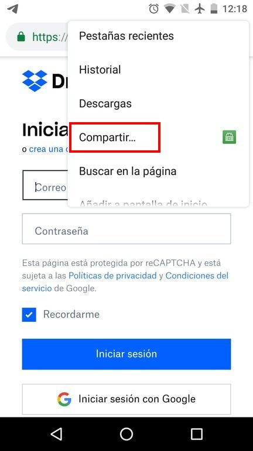](images/seleccionar-opcion-compartir.jpg)

Acto seguido presionamos encima de la opción Kepass2Android: Buscar.

[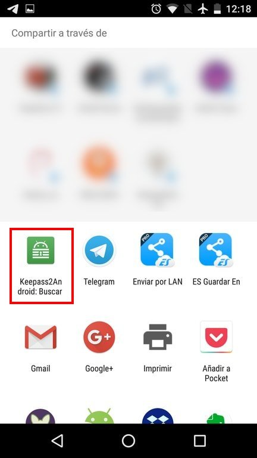](images/compartir-con-keepass2android.jpg)

A continuación seleccionamos el teclado Keepass2Android:

[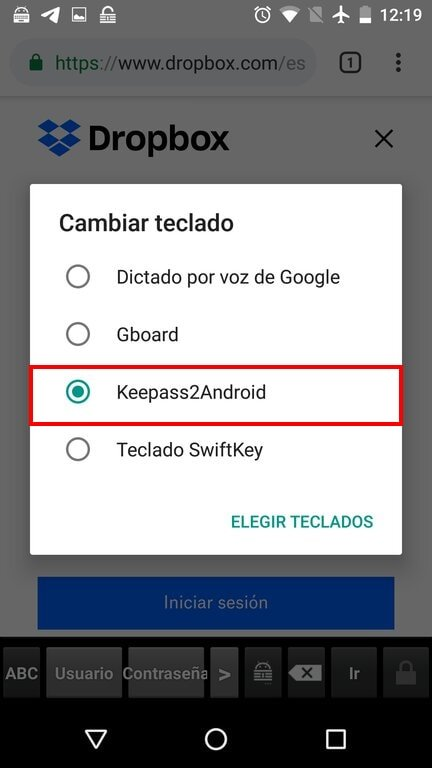](images/seleccionar-teclado-keepass2android.jpg)

Finalmente nos posicionamos en el cuadro de texto en que tenemos que introducir el usuario y presionamos el botón del teclado Usuario. Del mismo nos posicionamos dentro del cuadro de texto para introducir la contraseña y presionamos el botón Contraseña. Una vez rellenados los campos usuario y contraseña presionamos el botón Iniciar sesión para acceder a nuestro servicio.

[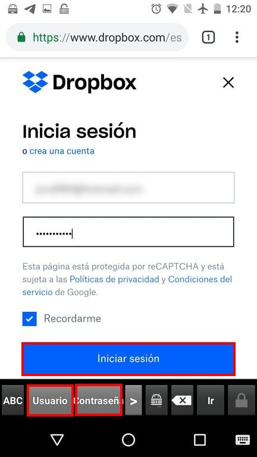](images/contraseñas-autorellenadas.jpg)

Una vez hayan accedido al servicio pueden reactivar el teclado que acostumbran a usar de forma habitual. Recuerden que pueden cambiar fácilmente de teclado clicando en el icono para cambiar el teclado.

[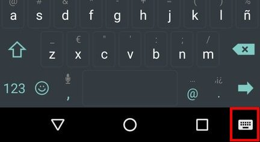](images/cambiar-teclado.jpg)

### AUTOCOMPLETAR CONTRASEÑAS CON KEEWEB

Keeweb no permite autocompletar usuarios y contraseñas. Pero tiene la utilidad de poder consultar nuestras contraseñas en cualquier equipo y en cualquier lugar. Para ello tan solo tienen que acceder a Keeweb y consultar las credenciales del servicio a que necesitan acceder:

[](images/gestionar-contraseñas-en-la-nube.png)
