Muchos de ustedes se hacen la pregunta de que  gestores de podcast que existen en Linux.

La verdad existen multitud de gestores de podcast como por ejemplo amarok, rhytmmbox, banshee, etc. Pero la realidad es que ninguno de los gestores de podcast citados se acerca al rendimiento y prestaciones que nos ofrece Gpodder. **Gpodder es un gestor de podcast que solo se puede definir como excepcional**.<!--more-->

## VENTAJAS RESPECTO OTROS GESTORES DE PODCAST Y PRESTACIONES QUE OFRECE

 

[](images/Multiplataforma.png)

1- Es un **software multiplataforma**. La podemos usar en windows, Linux, Mac, Maemo y FreeBSD.

[](images/Licencia-GPL3.png)

2- Es un gestor de podcast **liberado bajo la [licencia GPLv3](http://es.wikipedia.org/wiki/GNU_General_Public_License)**. Por lo tanto usted tiene el derecho de modificar y distribuir el Software.

[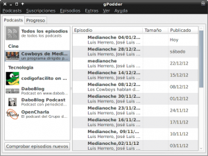](images/Gestores-de-podcast-Categorias.png)

3- Permite **clasificar nuestros podcast por temáticas** que podemos generar nosotros mismos. En la imagen podéis ver las categorías Cine y Tecnología.

[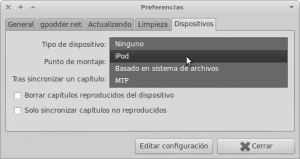](images/dispositivos.png)

4- Permite **sincronizar los podcast entre varios dispositivos**. Esto incluye tanto ordenadores de sobremesa, como laptops, reproductores mp3, etc. Por ejemplo cuando añadamos un podcast al ordenador de sobremesa también se añadira en nuestro laptop. Cuando enchufemos nuestro reproductor de mp3 al ordenador podremos sincronizar el dispositivo.

[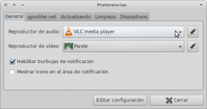](images/preferencias-Generales.png)

5- **Permite visualizar, gestionar y descargar en nuestro disco duro tanto podcast de Video como de Audio**. Soporta RSS, Atom, YouTube, Soundcloud, Vimeo y XSPF feeds. Para ello en las preferencias Generales de Gppoder le tenemos que indicar el reproductor de vídeo y de audio que vamos a usar.

[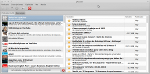](images/Control-Podcast.png)

6- Permite tener un **control de los episodios nuevos y pendientes por escuchar**. Nos informa cuando se publican nuevos podcast.

[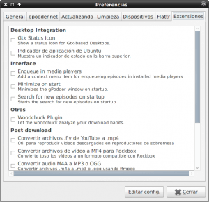](images/Plugins.png)

7- El programa **dispone de pluggins para añadir funcionalidades extra**. Se pueden consultar en su **[página web](http://wiki.gpodder.org/wiki/Extensions "Extensiones")**.

8- Podemos descubrir nuevos podcast a través del **directorio de podcast que podemos consultar desde su su  [página web](https://gpodder.net/directory/ "Búsqueda de Podcast").**

## INSTALAR GPODDER EN DEBIAN O UBUNTU

Tanto si usamos Debian como Ubuntu Gpodder esta en el repositorios de la distro. Por lo tanto simplemente tenemos que abrir una terminal y ejecutar el siguiente comando:

> ```
> sudo apt-get install gpodder
> ```

Si usamos Ubuntu y queremos la última versión del programa la pueden conseguir instalando gpodder a partir del siguiente [PPA](https://launchpad.net/~thp/+archive/gpodder "PPA Gepodder"). Por lo tanto introducimos los siguientes comandos en la terminal:

> ```
> sudo add-apt-repository ppa:thp/gpodder
>  sudo apt-get update
>  sudo apt-get install gpodder
> ```

En el caso de usar Debian y precisar de la última versión podemos mezclar paquetes de distintas ramas de Debian. Por lo tanto si estamos en estable o Testing podríamos instalar los paquetes de Gpodder de Sid. En un futuro post detallaré como realizar lo que estoy proponiendo.

## PASOS PARA SACAR EL MÁXIMO PARTIDO A GPODDER

[](images/Create-Account-gpodder.net-Google-Chrome_004.png)

1- Para usar la totalidad de funcionalidades del programa primero nos debemos **registrar en su [página web](https://gpodder.net/ "Gestores de Podcast Gpodder")** . De este modo podremos sincronizar diferentes dispositivos y tener un respaldo de nuestros podcast en el caso que tengamos que formatear el dispositivo o lo perdamos.

[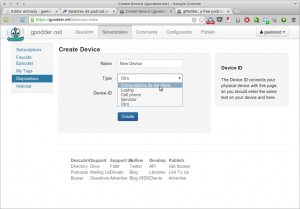](images/Gestores-de-podcast-Device.png)

2- Una vez registrados y dentro de la página debemos tenemos que clicar a al menú suscriptions, después dispositivos y a posteriori create Device. Seguidamente introducir los datos que podéis ver en la pantalla. Si tenemos 2 ordenadores tendremos que repetir 2 veces este paso. Este paso se tiene que repetir para cada uno de los dispositivos que tengamos. Así conseguiremos la sincronización.

[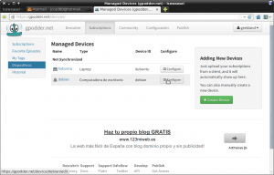](images/primero.png)

3- Una vez creados los dispositivos hay que sincronizarlos. Para **sincronizar los dispositivos** vamos al menú subscriptions, después a dispositivos y finalmente clicamos a configure del equipo denominado Debian.

[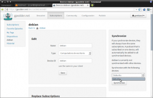](images/segundo.png)

4- En la siguiente pantalla en el desplegable de Synchronize selecciono el equipo con que quiero sincronizar Debian. En este caso lo sincronizaré con el equipo Xubuntu. **Ahora los dos 2 dispositivos ya están sincronizados**.

[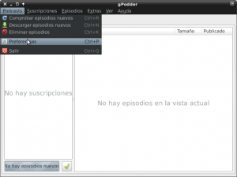](images/Preferencias-Gppoder.png)

5- Abrir el programa Gpodder. Como indica en la imagen vamos a las preferencias del programa.

[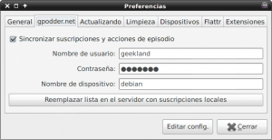](images/Captura-de-pantalla-050113-184407.png)

6- Una vez dentro de las preferencias elegimos la pestaña gpodder.net. Allí tendremos que **rellenar los datos correspondientes a nuestra cuenta de Gpodder y la identificación del dispositivo**. Este paso también hay que repetirlo en cada uno de los dispositivos que tengamos. Una vez realizado ya podemos empezar a introducir podcast.

## INTRODUCCIÓN DE PODCAST EN LOS DISPOSITIVOS

Existen varias formas para poder introducir podcast dentro del programa. Lo podéis hacer directamente desde gpodder o desde la página web. Yo prefiero realizarlo desde la página Web. Desde gppoder es muy intuitivo y vosotros mismos lo descubriréis. Desde la página web se realiza de la siguiente forma:

 [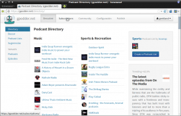](images/0.1-Vamos-a-suscripciones.png)

1- Vamos a la pestaña de suscripciones.

[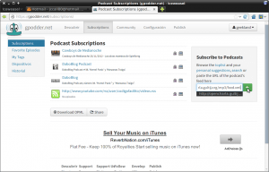](images/tercero.png)

2- En el apartado suscribe to Podscast **introducimos la URL del podcast** y le damos al símbolo +

[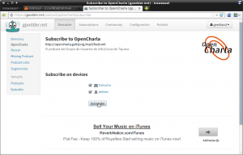](images/cuarto.png)

3- **Seleccionamos los dispositivos a los que queremos introducir el podcast** y apretamos al botón Suscribe.

[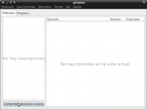](images/1-Obtener-capitulos.png)

4- Entramos al programa Gpodder y damos click al botón comprobar nuevos episodios.

[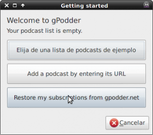](images/2-Elegimos-la-opción1.png)

5- Al ser la primera vez nos saldrá este cuadro. Elegimos la opción Restore my subscriptions from gpodder.net

[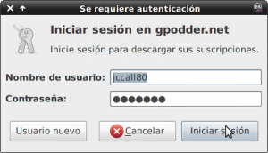](images/3-Establecer-datos-cuenta.png)

6- Seguidamente introducimos los datos de nuestra cuenta de gppoder y clicamos en iniciar sesión.

[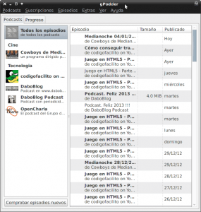](images/disponible.png)

7- Como podéis ver en la imagen los podcast ya están disponibles

En **Resumen** : De los gestores de podcast existentes en Linux gpodder bajo mi punto de vista la mejor opción. Si lo prueban verán que es intuitivo y poco a poco irán descubriendo las opciones que ofrece este software.
