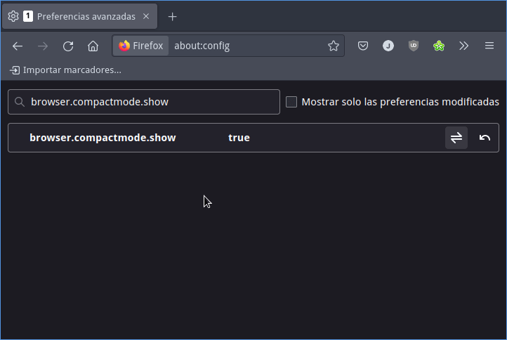
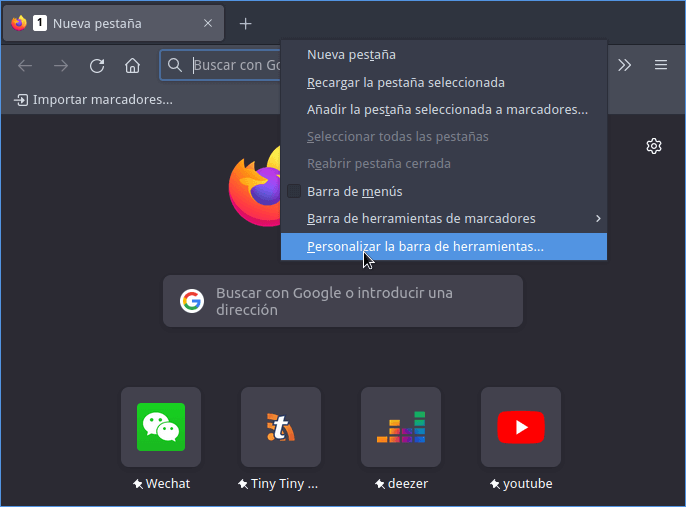
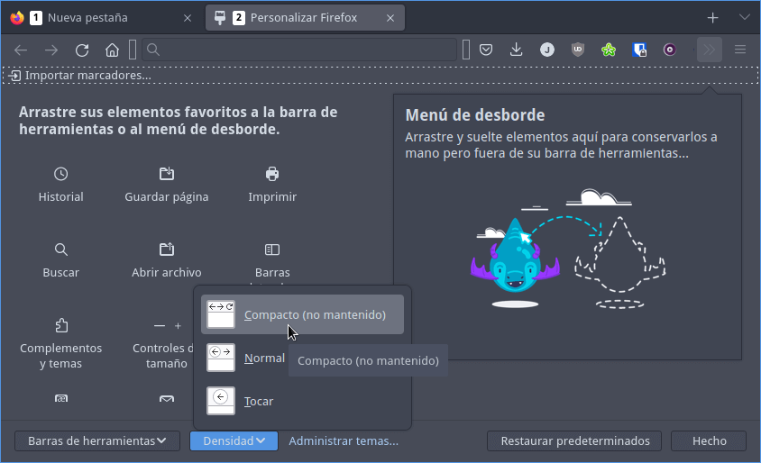

Mi navegador preferido a día de hoy es Firefox. Más que nada por temas de privacidad, porque tiene un funcionamiento digamos que aceptable y porque la aceleración gráfica por hardware funciona. No obstante algo que me molesta es que a partir de la versión 89 el tamaño de las pestañas es enorme y desperdicia tamaño del monitor. Por lo tanto en el siguiente artículo veremos los pasos a seguir para hacer las pestañas de Firefox más pequeñas.<!--more-->


## HACER LAS PESTAÑAS DE FIREFOX MÁS PEQUEÑAS

Existen varios métodos para hacer las pestañas de Firefox más pequeñas. No obstante el que considero más sencillo para la gran mayoría de usuarios es el siguiente. Inicialmente ingresamos la siguiente URL en el barra de direcciones de Firefox y presionamos la tecla enter:

```shell
about:config
```

Una vez dentro de las preferencias de Firefox buscaremos la propiedad **browser.compactmode.show** y la cambiaremos al valor **true**



Acto seguido reiniciaremos Firefox. A continuación posicionaremos el puntero del ratón a la derecha del símbolo **\+** de la barra de pestañas y presionaremos el botón derecho del ratón. Cuando aparezca el menú contextual clicaremos encima de la opción **Personalizar la barra de herramientas...**



Seguidamente en el menú desplegable del botón **Densidad** podremos seleccionar la opción **Compacto (No mantenido)**. Una vez seleccionada la opción presionan sobre el botón **Hecho**.



Acto seguido podrán ver que el tamaño de las pestañas de Firefox es sensiblemente menor y en mi caso me parece mucho mejor opción.


A partir de estos momentos podrán tener una mejor experiencia de usuario con Firefox.

## ¿Y QUE PASA SI AÚN QUIERO REDUCIR AÚN MÁS EL TAMAÑO?

Si la solución que acabáis de ver no os convence porque aún queréis hacer las pestañas más pequeñas no os preocupes. Existe una opción para que aún podáis reducir más el tamaño de las pestañas. Para ello deberéis añadir el código apropiado al fichero `userChrome.css`. Este fichero se encuentra dentro del directorio que almacena el perfil de nuestro usuario. En mi caso, el perfil de usuario de Firefox se almacena en `/home/joan/.mozilla/firefox/bttghfl2.default-release/`. Para acceder a esta ubicación ejecutaré el siguiente comando en la terminal:

```shell
cd /home/joan/.mozilla/firefox/bttghfl2.default-release/
```

Acto seguido accederé dentro del directorio `chrome` ejecutando el siguiente comando en la terminal:

```shell
cd chrome
```

**Nota:** En el caso que no exista el directorio `chrome` lo deberán crear ejecutando el comando `mkdir chrome` en la terminal.

Una vez dentro del directorio `chrome` ejecutaremos el siguiente comando para editar el contenido del fichero `userChrome.css`.

```shell
nano userChrome.css
```

Una vez se abra el editor de texto nano pegaremos el siguiente código:

```shell
/* Override font-size for tabs */
.tabbrowser-tab {
    font-size: 12px !important;
}

TabsToolbar, #tabbrowser-tabs {
    --tab-min-height: 20px !important;
}
    /* Tweak for covering a line at the bottom of the active tab on some themes 8/11/2021 */
#main-window[sizemode="normal"] #toolbar-menubar[autohide="true"] + #TabsToolbar, 
#main-window[sizemode="normal"] #toolbar-menubar[autohide="true"] + #TabsToolbar #tabbrowser-tabs {
    --tab-min-height: 21px !important;
```

Una vez pegado el código guardaremos los cambios, cerraremos el fichero y reiniciaremos Firefox. Ahora el tamaño de las pestañas es aún más reducido. Si aún queréis reducir más el tamaño deberán cambiar el tamaño de la fuente dentro del fichero `userChrome.css`. En el ejemplo el tamaño de la fuente es `11px`. Por lo tanto podríamos reemplazar `11px` por `10px` para así reducir aún más el tamaño de las pestañas.

Les aconsejo que visiten el siguiente enlace si quieren ver más trucos sobre como poder [sacar el máximo rendimiento a Firefox](https://geekland.eu/?s=firefox).

#### Fuentes

[https://www.userchrome.org/firefox-89-styling-proton-ui.html#tabstyler](https://www.userchrome.org/firefox-89-styling-proton-ui.html#tabstyler)
