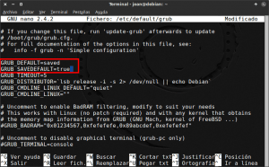
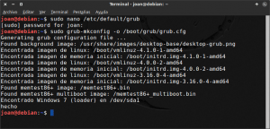

Varios de vosotros seguramente están usando distintas distribuciones linux o sistemas operativos en un mismo ordenador. Por lo tanto es más que posible que cada vez que arranquen el ordenador tengan que estar pendientes de seleccionar la distro o sistema operativo que quieren usar.<!--more-->

Sin duda esto es bastante pesado, pero existe una solución fácil para intentar minimizar este hecho. Podemos hacer que el [grub](https://www.gnu.org/software/grub/ "Explicación de lo que es el gestor de Arranque GRUB") recuerde el último sistema operativo que hayamos iniciado y hacer que el sistema operativo por defecto sea siempre el último que hayamos usado. Por lo tanto si la última vez que usamos el ordenador arrancamos Debian, cuando volvamos a iniciar el ordenador la entrada predeterminada en el Grub será Debian. Si la última vez que iniciamos el ordenador arrancamos con Manjaro, cuando volvamos a iniciar el ordenador la entrada predeterminada del Grub será Manjaro.

## HACER QUE EL GRUB RECUERDE EL ÚLTIMO SISTEMA OPERATIVO EJECUTADO

Seguidamente mostraremos los pasos a seguir para que el grub recuerde el último sistema operativo que se ha ejecutado. El procedimiento detallado en este post es válido para cualquier distribución que use GRUB como gestor de arranque.

### Copia de seguridad de los fichero modificados

El primer paso es realizar una copia de seguridad del fichero de configuración que vamos a modificar. Para ello **ejecutamos el siguiente comando en la terminal**:

> ```
> sudo cp /etc/default/grub ~/grub.old
> ```

Este comando generará una copia de seguridad del archivo grub en nuestra partición home. El nombre del archivo que contendrá la copia de seguridad será grub.old.

### Modificar la configuración del Grub

Para hacer que el Grub considere como entrada predeterminada el último sistema operativo que hemos usado es fácil. Tan solo tenemos que modificar la configuración del grub. Para ello **abrimos una terminal y ejecutamos el siguiente comando**:

> ```
> sudo nano /etc/default/grub
> ```

Una vez abierto el editor de texto tenemos que **buscar la siguiente línea**:

> ```
> GRUB_DEFAULT=0
> ```

###### Nota: Esta línea de la configuración del Grub establece la entrada del grub que se seleccionará por defecto al arrancar nuestro ordenador. Así por ejemplo si sustituyéramos el 0 por el 1, la entrada del grub seleccionada por defecto seria la segunda en lugar de la primera.

Una vez la hayamos encontrado línea **la sustituimos por la siguiente**:

> ```
> GRUB_DEFAULT=saved
> ```

###### Nota: Al sustituir 0 por saved, lo que estamos realizando es habilitar la opción GRUB\_SAVEDEFAULT para establecer el sistema operativo predeterminado.

Seguidamente, tal y como se muestra en la captura de pantalla, tenemos que **añadir la siguiente línea en el fichero de configuración**:

> ```
> GRUB_SAVEDEFAULT=true
> ```

###### Nota: Al fijar el valor de GRUB\_SAVEDEFAULT como true, lo que hacemos es que cada vez que seleccionamos una entrada en el grub, se guarde como la entrada por defecto para la próxima vez que encendamos el ordenador.

[](images/Configuración-del-archivo-grub.png)

Para finalizar con este apartado, tan solo tenemos que **guardar los cambios y cerrar el fichero**.

### Cargar la nueva configuración al gestor de arranque GRUB

El último paso a realizar es actualizar la configuración del grub para que se genere un nuevo archivo grub.cfg . Para ello **ejecutamos el siguiente comando en la terminal**:

> ```
> sudo grub-mkconfig -o /boot/grub/grub.cfg
> ```

###### Nota: Comandos alternativos al último que acabamos de ver son sudo update-grub2 y sudo update-grub

El resultado obtenido de ejecutar este comando tiene que ser parecido al siguiente:

[](images/Actualizar-configuración-del-grub.png)

Después de ejecutar este comando el proceso ha terminado. Ahora si iniciamos el ordenador con Debian, la entrada predeterminada del GRUB en el próximo arranque será Debian. Si la última vez que usamos el ordenador arrancamos con Windows, la entrada predeterminada en el próximo arranque será Windows.
