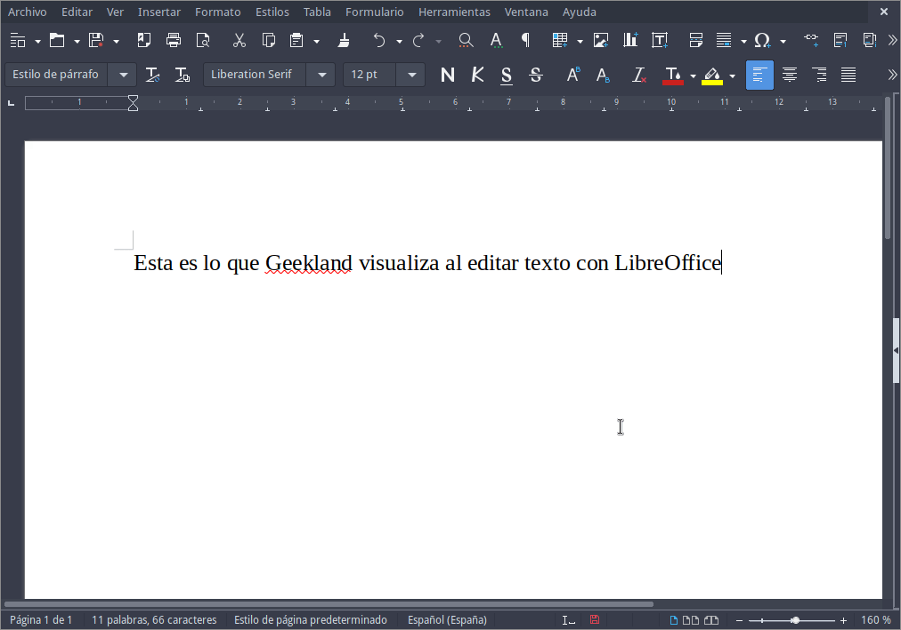
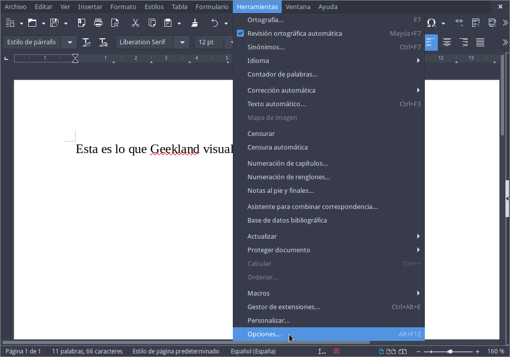
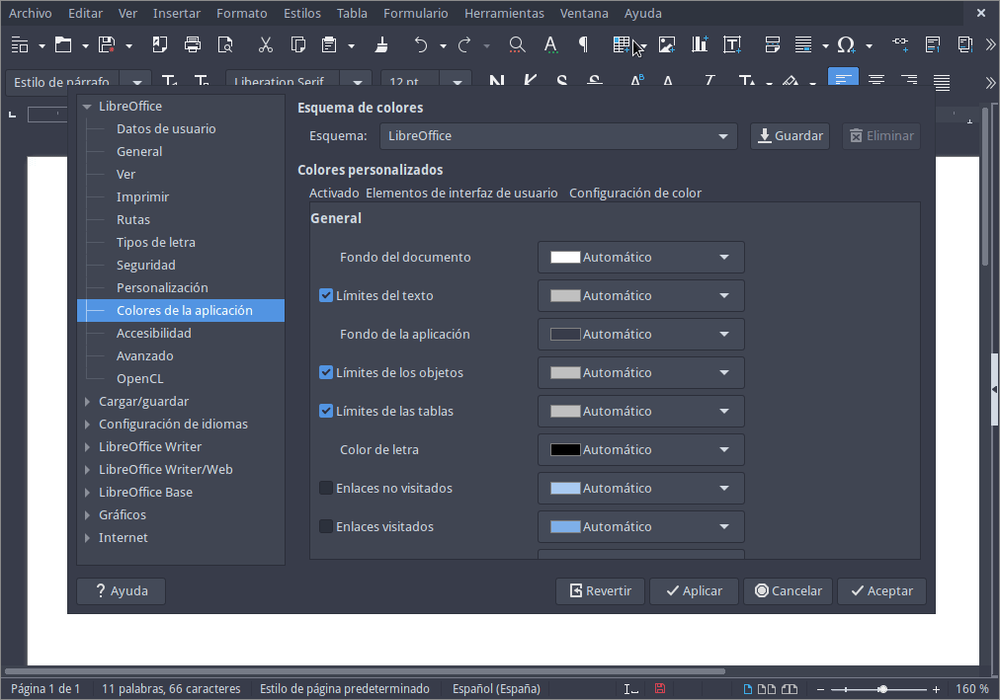
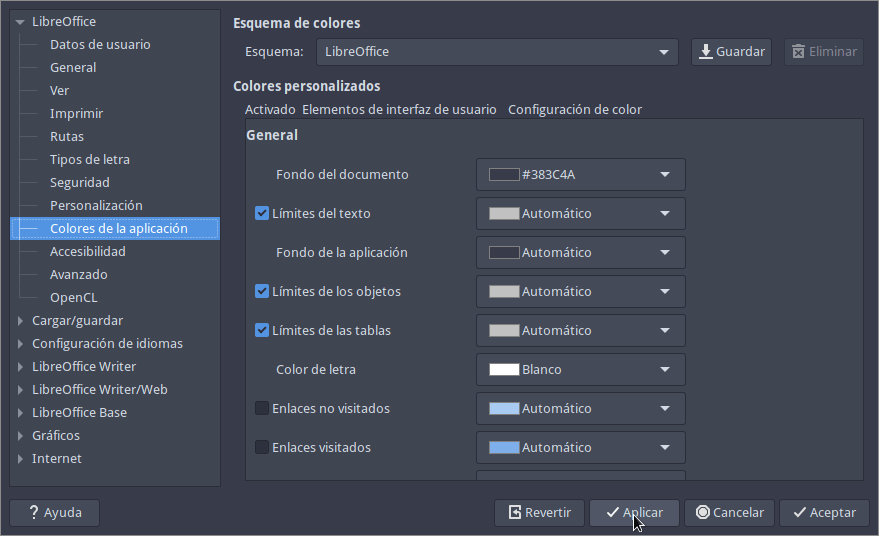
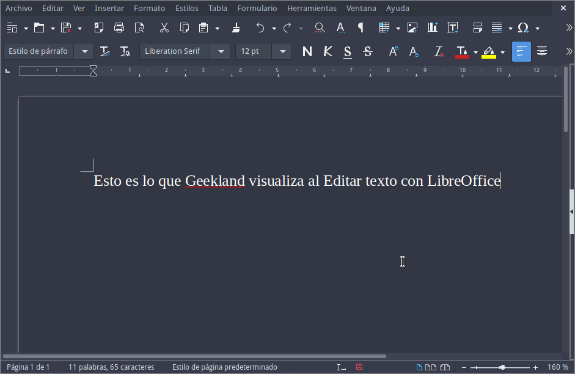

En los últimos tiempos es común usar temas de escritorio oscuros. En mi caso me resulta mucho más cómodo escribir en letra blanca sobre un fondo oscuro. Pero el problema es que ciertas aplicaciones, como por ejemplo LibreOffice, no se amoldan completamente al modo oscuro del escritorio. A continuación pueden ver que LibreOffice tiene un tema oscuro, pero el área de escritura es 100% blanca y el texto es negro.<!--more-->

[](images/color-predeterminado-Libreoffice.png)

Para que LibreOffice tenga un modo 100% oscuro tendremos que modificar su esquema de colores. Básicamente tendremos que cambiar el color del texto y del área de escritura. Para ello procederemos del siguiente modo.

## HACER QUE LIBREOFFICE TENGA UN MODO OSCURO AL 100%

Para que LibreOffice tenga un modo totalmente oscuro y consistente tenemos que realizar lo siguiente:

1. Usar un tema de escritorio oscuro.
2. Usar un tema de iconos adecuado para el modo oscuro.
3. Modificar el color del área de escritura y cambiar el color del texto.

Para realizar los pasos que acabo de citar tenemos que realizar lo siguiente.

### Hacer que el sistema operativo use un tema oscuro

Para que las ventanas de LibreOffice y de la totalidad de aplicaciones del sistema operativo sean oscuras hay que cambiar el tema del sistema operativo. Hay multitud de temas oscuros en los escritorios Linux, pero en mi caso uso arc. El procedimiento para instalar el tema arc variará en función del escritorio que usen. En mi caso uso el escritorio i3 y el procedimiento que seguí en su día en Debian Testing fue el siguiente.

Abrimos una terminal e instalamos los paquetes arc-theme y lxappearance mediante el siguiente comando:

> ```shell
> sudo apt install lxappearance arc-theme
> ```

**Nota**: El paquete `arc-theme` contiene el tema arc y el paquete `lxappearance` es un entorno gráfico que nos permite cambiar el tema de nuestro escritorio. En el caso que los paquetes mencionados no se encuentren en su distribución deberán buscar un método alternativo para instalarlos.

Una vez instalados los paquetes abrimos una terminal y ejecutamos el siguiente comando:

> ```shell
> lxappearance
> ```

A continuación seleccionamos el tema Arc-Dark o Arc-Darker y presionamos el botón Aplicar.

[](images/Cambiar-el-tema-en-i3.png)

Con estos pasos tan simples ya tendremos un tema oscuro en el entorno de escritorio i3.

### Cambiar el tema de iconos de LibreOffice

En el caso que los iconos se visualicen correctamente no hay que realizar absolutamente nada. Pero en el caso que los iconos no se integren con el tema oscuro tendrán que cambiarlos. Para cambiarlos deberán seguir el siguiente procedimiento:

https://geeklandlinux.github.io/posts/cambiar-el-tema-iconos-en-libreoffice/

**Nota:** En mi caso uso los iconos Breeze (Dark). Tal y como pueden ver en las capturas de pantalla anteriores el tema Breeze (Dark) se visualiza perfecto cuando usamos temas oscuros.

### Modificar el color del área de escritura y cambiar el color del texto para que LibreOffice tengo un modo oscuro perfecto

El primer paso a realizar es clicar sobre el menú **Herramientas** y cuando se despliegue el submenú clicamos en **Opciones...**.

[](images/acceder-a-opciones.png)

Cuando aparezca la ventana de opciones clicamos en **Colores de la aplicación** para que aparezcan las opciones para modificar el esquema de colores de LibreOffice.

[](images/colores-iniciales.png)

A continuación cambiaremos los colores que nos interesen. En mi caso serán los colores del **Fondo del documento** y **Color de la letra**. Una vez hayamos puesto los colores que nos interesen tan solo deberemos presionar en el botón **Aplicar**.

[](images/aplicar-nuevo-esquema-colores.png)

Una vez aplicado el nuevo esquema de colores verán que el aspecto visual es consiste y no tendré molestias visuales de ningún tipo. Ahora el fondo de escritura tiene un color oscuro y la letra es blanca.

[](images/LibreOffice-en-modo-Oscuro.png)

A partir de estos momentos cualquier aplicación de la Suite ofimática LibreOffice tendrá un modo oscuro perfecto y consistente.

#### Fuentes

[https://itsfoss.com/libreoffice-dark-mode/](https://itsfoss.com/libreoffice-dark-mode/)
