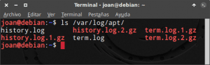
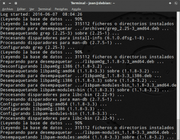

En el siguiente post veremos como consultar el historial de actualizaciones, instalaciones e desinstalaciones de paquetes en el caso que usemos el gestor de paquetes apt-get.<!--more-->

## UTILIDADES DE CONSULTAR EL HISTORIAL DE ACTUALIZACIONES DE NUESTRO ORDENADOR

las utilidades de conocer las modificaciones realizadas en los paquetes de nuestro equipo son las siguientes:

### Detectar problemas y buscar una solución

Si después de aplicar una actualización empezamos a tener problemas en nuestro ordenador es interesante consultar los paquetes actualizados, desinstalados o instalados para poder detectar el problema y buscar una solución.

### Ver la actividad de un determinado usuario

En el caso que hayan varios usuarios que tengan permisos de administrador, podemos comprobar la totalidad de operaciones realizadas por cada uno de ellos.

Los pasos a seguir para consultar el historial de actualizaciones, desinstalaciones e instalaciones son los siguientes:

## VER EL HISTORIAL DE ACTUALIZACIONES, DESINSTALACIONES E INSTALACIONES MEDIANTE LOS LOGS DE APT-GET

En el caso usemos que usemos apt-get, Synaptic, el centro de software de Ubuntu o cualquier otro front-end que utilice apt-get podemos consultar los paquetes instalados, desintalados o actualizados por cualquier usuario en los logs ubicados en**/var/log/apt/**.

Para acceder a los logs abrimos una terminal y ejecutamos el siguiente comando:

> ```
> ls -a /var/log/apt/
> ```

Después de ejecutar el comando veremos los archivos **history.log, history.log.1.gz, history.log.2.gz, term.log, term.log.1.gz y term.log.2.gz**.

[](images/Logs-generados-por-apt-get.png)

### Contenido ubicado en los archivos history.log

El contenido almacenado por los archivos **history.log** es el siguiente:

**history.log:** Log que contiene los paquetes instalados, actualizados o desinstalados mediante apt-get, o cualquier front-end que utilice apt-get, desde el inicio del mes hasta el día actual.

**history.log.1.gz:** Archivo comprimido que contiene los paquetes instalados, actualizados o desinstalados mediante apt-get, o cualquier front-end que utilice apt-get, del mes pasado.

**history.log.2.gz:** Archivo comprimido que contiene los paquetes instalados, actualizados o desinstalados mediante apt-get, o cualquier front-end que utilice apt-get, de hace 2 meses.

###### Nota: El número de archivos history.log y el periodo de datos almacenados dependerá de la configuración de nuestra política de logs. Podemos cambiar nuestra política de logs modificando el contenido del archivo /etc/logrotate.d/apt.

### Contenido ubicado en los archivos term.log

El contenido almacenado por los archivos **term.log** es el siguiente:

**term.log:** Log en el que podemos ver lo que paso y las decisiones que tomaron los usuarios en cada una de las instalaciones, actualizaciones y desinstalaciones realizadas desde el inicio del mes hasta el día de hoy.

**term.log.1.gz:** Log comprimido en el que podemos visualizar lo que paso y las decisiones que tomaron los usuarios en cada una de las instalaciones, actualizaciones y desinstalaciones realizadas durante el mes pasado.

**term.log.2.gz:** Log comprimido en el que podemos visualizar lo que paso y las decisiones que tomaron los usuarios en cada una de las instalaciones, actualizaciones y desinstalaciones realizadas 2 meses atrás.

###### Nota: El número de archivos term.log y el periodo de datos almacenados dependerá de la configuración de nuestra política de logs. Podemos cambiar nuestra política de logs modificando el contenido del archivo /etc/logrotate.d/apt.

### Consultar el historial de actualizaciones durante el presente mes

Para consultar el historial de paquetes instalados, actualizados o desinstalados tenemos que abrir una terminal y ejecutar el siguiente comando:

> ```
> less /var/log/apt/history.log
> ```

Una vez tecleado el comando podremos consultar el historial completo de operaciones realizadas con los paquetes desde el inicio del mes hasta el día de hoy.

[](images/Historial-de-actualizaciones-del-último-mes.png)

Si observamos la captura de pantalla veremos los siguientes detalles:

1. Los paquetes que se actualizaron, instalaron o desinstalaron.
2. El nombre del usuario que instalo, desinstalo o actualizo los paquetes.
3. El comando que uso el usuario para realizar las modificaciones en el sistema.
4. La fecha en la que las modificaciones fueron realizadas.
5. La versión de los paquetes que se desinstalaron, actualizaron o instalaron.

### Consultar el historial de actualizaciones del mes pasado o anteriores al mes pasado

Si tenemos necesidad de ir más atrás y consultar la totalidad de operaciones realizadas con nuestros paquetes en el pasado mes, tan solo tenemos que ejecutar el siguiente comando en la terminal:

> ```
> zless /var/log/apt/history.log.1.gz
> ```

En el caso que necesitaremos saber la totalidad de paquetes que se instalaron, desinstalaron y actualizaron hace mas de 2 meses tenemos que ejecutar el siguiente comando en la terminal:

> ```
> zless /var/log/apt/history.log.2.gz
> ```

De este modo tan sencillo podemos consultar la totalidad de paquetes que se han instalado, desinstalado o actualizado por cualquier usuario de nuestro de nuestro equipo.

Para profundizar en lo que paso en cada una de las operaciones registradas en los ficheros **history.log**, podemos consultar los ficheros **term.log**.

### Consultar que paso en las actualizaciones, instalaciones y desinstalaciones durante el presente mes

Para tener el detalle de lo que paso en cada una de las operaciones registradas en el archivo history.log desde el inicio del mes hasta el día actual tan solo tenemos que abrir una terminal y ejecutar el siguiente comando:

> ```
> sudo more /var/log/apt/term.log
> ```

Una vez ejecutado el comando los resultados son los siguientes:

[](images/Log-de-la-actualización-del-sistema-07-06-2016.png)

Si observamos la captura de pantalla podemos visualizar con exactitud y precisión la totalidad de mensajes y decisiones tomadas por el usuario en la actualización del sistema que se hizo el 07/06/2016.

### Consultar que paso en las actualizaciones, instalaciones y desinstalaciones del mes pasado o anteriores al mes pasado

Del mismo modo que en el caso anterior, si queremos consultar lo que paso en cada una de las instalaciones, actualizaciones o desinstalaciones realizadas durante el pasado mes, tan solo tenemos que ejecutar el siguiente comando en la terminal:

> ```
> sudo zmore /var/log/apt/term.log.1.gz
> ```

Si finalmente queremos visualizar lo que aconteció durante las instalaciones, desinstalaciones y actualizaciones de paquetes llevadas a término hace 2 meses tenemos que ejecutar el siguiente comando en la terminal:

> ```
> sudo zmore /var/log/apt/term.log.2.gz
> ```

## VER EL HISTORIAL DE ACTUALIZACIONES, INSTALACIONES Y DESINSTALACIONES MEDIANTE DPKG

También podemos consultar los paquetes instalados, desinstalados y actualizados mediante dpkg.

Para consultar el registro de logs de dpkg tan solo tenemos que abrir una terminal y ejecutar el siguiente comando:

> ```
> less /var/log/dpkg.log
> ```

Después de aplicar el comando obtendréis un listado largo y difícil de leer en el que podréis ver la totalidad de paquetes instalados, actualizados y desinstalados desde el inicio del mes hasta el día de hoy.

###### Nota: Dpkg también registra la actividad de otros gestores de paquetes como por ejemplo Aptitude.

### Filtrar los resultados del log dpkg

Si queréis filtrar el contenido del listado obtenido podemos ejecutar los siguientes comandos.

Para obtener únicamente los paquetes instalados desde el inicio del mes hasta el día de hoy:

> ```
> less /var/log/dpkg.log | grep " install "
> ```

Para ver los paquetes actualizados desde el inicio del mes hasta el día de hoy:

> ```
> less /var/log/dpkg.log | grep " upgrade "
> ```

Para consultar los paquetes eliminados desde el inicio del mes hasta el día de hoy:

> ```
> less /var/log/dpkg.log | grep " remove "
> ```

### Consultar las modificaciones del mes pasado o anteriores al mes pasado

Si tenemos necesidad de ir más atrás y consultar la totalidad de operaciones realizadas con nuestros paquetes en el pasado mes, tan solo tenemos que ejecutar el siguiente comando en la terminal:

> ```
> less /var/log/dpkg.log.1
> ```

En el caso que necesitaremos saber la totalidad de paquetes que se instalaron, desinstalaron y actualizaron hace 2 meses tenemos que ejecutar el siguiente comando en la terminal:

> ```
> zless /var/log/dpkg.log.2.gz
> ```

En el caso que necesitaremos saber la totalidad de paquetes que se instalaron, desinstalaron y actualizaron hace 3 meses tenemos que ejecutar el siguiente comando en la terminal:

> ```
> zless /var/log/dpkg.log.3.gz
> ```

## VER EL HISTORIAL DE INSTALACIONES, DESINSTALACIONES Y ACTUALIZACIONES EN EL CASO DE USAR SYNAPTIC

Hay gente que odia la terminal y realiza las instalaciones y actualizaciones del sistema a través de Synaptic.

Si este es vuestro caso también pueden consultar el historial de actualizaciones de la siguiente forma:

Una vez abierto Synaptic accedemos al menú **Archivo** y posteriormente clicamos encima de la opción **Histórico**:

[](images/Consultar-el-histórico-de-Synaptic.png)

Finalmente podremos ver la totalidad de paquetes que hemos instalado, desinstalado y actualizado con el gestor de paquetes Synaptic.

[](images/Histórico-actualizaciones-en-Synaptic.png)

###### Nota: Los procedimientos mostrados en este artículo son válidos para los usuarios de Debian, Ubuntu y la totalidad de distribuciones derivadas de Debian y Ubuntu.
