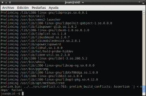
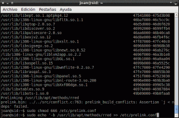

Incrementar el rendimiento con prelink es el penúltimo post de la serie que detalla como incrementar el rendimiento de nuestro ordenador. Aunque tengo en mente alguna que otra idea de momento haré un paréntesis. Posiblemente en un futuro incluya algún que otro post en la siguiente lista:<!--more-->

1. [Liberar memoria cache de nuestra RAM.]()
2. [Limitar el uso de nuestra memoria Swap y limpiarla en el caso que se active.]()
3. [Usar la RAM más eficientemente con Zram.]()
4. [Acelerar el inicio de nuestras aplicaciones con Preload.]()
5. **Acelerar el inicio de nuestras aplicaciones con Prelink.**
6. [Aligerar el rendimiento de nuestro sistema operativo con Zswap]().

## FUNCIONAMIENTO DE PRELINK

Prelink es una aplicación desarrollada por un ingeniero de Software de Red Hat llamado Jakub Jelínek. El resultado que obtendremos con Prelink es un ligero incremento de velocidad en el arranque de las aplicaciones. Lo que hace prelink para incrementar la velocidad de arranque es modificar las librerías compartidas y binarios para que nuestras aplicaciones se inicien más rápido.

Hay que tener en cuenta que la gran mayoría de aplicaciones hacen uso de las librearías compartidas. Por lo tanto cuando ejecutamos un binario estas librerías compartidas se tendrán que cargar en la memoria. Además cuando las aplicaciones se ejecuten se necesitará un tiempo para hallar su posición dentro de la memoria.

Como las operaciones para ejecutar un programa siempre son las mismas lo que hará prelink es enlazar las librerías compartidas con el fichero binario. Esto lo conseguirá asignando una dirección virtual única de espacio a cada una de la librerías compartidas. Esta dirección única será almacenada en los ficheros binarios. Así de este modo conseguiremos incrementar la velocidad de carga de las aplicaciones ya que en todo momento sabremos donde están las librerías compartidas que necesitamos para ejecutar las aplicaciones.

Por lo tanto con prelink estamos modificando los ejecutables de nuestro ordenador añadiéndoles información para enlazarlos automáticamente con las librerías compartidas.

## OBSERVACIONES DEL FUNCIONAMIENTO DE PRELINK

Una vez hemos visto, a groso modo, como funciona prelink ya podemos llegar a las siguientes conclusiones:

1. Cuantas más librerías compartidas use un programa mayor será el incremento de rendimiento que obtenemos con prelink.
2. En el caso que se modifique algún fichero binario se perderá el efecto de prelink. Como veremos más adelante hay soluciones para evitar este problema.

## INSTALAR Y CONFIGURAR PRELINK

En la mayoría de distribuciones Linux prelink viene en los repositorios oficiales. Por lo tanto para instalar prelink abrimos un terminal y tecleamos:

> ```
> sudo apt-get install prelink
> ```

Seguidamente para activar prelink tenemos que acceder a su archivo de configuración. Para acceder a su archivo de configuración tecleamos el siguiente comando en la terminal:

> ```
> sudo gedit /etc/default/prelink
> ```

Se abrirá el editor de textos. Ahora tenemos que modificar los siguientes parámetros del archivo de configuración:

Dentro del fichero veremos que hay el siguiente texto:

> ```
> PRELINKING=unknown
> ```

Tenemos que modificar esta linea y dejarla como podéis ver a continuación:

> ```
> PRELINKING=yes
> ```

###### Nota: Es posible que en vuestra distro el valor estándard de la variable PRELINKING sea 'NO' en vez de 'UNKNOWN'. Si es este el caso lo único que hay que hacer es cambiar el 'no' por 'yes'

Dentro del mismo archivo de configuración también podemos modificar las opciones de funcionamiento de prelink. Dentro del archivo de configuración veremos una linea que pone:

> ```
> PRELINK_OPTS=-mR
> ```

\-mR son las opciones de configuración estándard de prelink. En mi caso las modifico quedando del siguiente modo:

> ```
> PRELINK_OPTS=-amR
> ```

El significado de cada una de las opciones de configuración es:

**a:** Especifica que se haga un prelink de la totalidad de binarios y de las librerías especificadas en el directorio /etc/prelink.conf.

**m:** Opción que permite un ahorro de memoria cuando se enlazan los ficheros binarios y las librerías compartidas. Lo consigue de la siguiente manera. Antes hemos dicho que prelink asigna una dirección virtual única a cada una de las librerías compartidas. Pero bajo determinadas circunstancias prelink hará que distintas librerias puedan tener la misma dirección virtual única con el consecuente ahorro de memoria. Esta opción es sobretodo útil en el caso que el número de enlaces a realizar sea alto.

**R:** El proceso de asignar direcciones a las librearías compartidas lo hace de forma aleatoria.

Para tener una explicación más detallada del funcionamiento y de las diferentes opciones que tiene prelink podemos abrir una terminal y teclear:

> ```
> man prelink
> ```

De este modo podemos ver y comprender la totalidad de opciones que nos ofrece prelink.

## EJECUTAR PRELINK POR PRIMERA VEZ

Seguidamente iniciaremos prelink por primera vez. Para iniciarlo por primera vez tenemos abrir una terminal e introducir el siguiente comando:

> ```
> sudo prelink -amvR
> ```

Seguramente tendréis que esperar un buen rato ya que en este momento se están enlazando nuestras librearías compartidas con nuestros binarios. El proceso puede terminar con éxito tal y como me paso con Xubuntu. Si el proceso termina con exito ya podemos decir que la totalidad de nuestro binarios y nuestras librerías están enlazados.

También puede ser que se generen errores durante el proceso como me paso en Debian Testing y en Debian Sid. En el caso que se den errores en medio del proceso de enlace actuar del siguiente modo:

## RESOLUCIÓN DE PROBLEMAS LA PRIMERA VEZ QUE EJECUTAMOS PRELINK

El típico error que se puede dar es el que podéis observar en la siguiente captura de pantalla:

[](images/Error-Prelink.png)

Como podéis ver se trata de una librería que no puede prelinkar. Se trata de la librería **/usr/lib/apt/methods/rred**. Como no puede enlazar esta librería se para el proceso, y por lo tanto el proceso de preenlazar queda incompleto. Una solución que tenemos para hacer que se se termine el proceso es introducir las librerías que paran el proceso de enlace a la lista negra de prelink. Para introducir a la lista negra la totalidad de librerías que nos dan problemas tenemos que seguir los siguientes pasos:

**Paso 1-** Dar permisos de escritura al archivo /etc/prelink.conf. Este fichero es el que contiene las rutas de los los binarios y librerías a preenlazar y donde deberemos introducir las excepciones. Para darle permisos de escritura abrimos una terminal y tecleamos:

> ```
> sudo chmod 666 /etc/prelink.conf
> ```

**Paso 2-** Ejecutamos prelink con el siguiente comando:

> ```
> sudo prelink -amvR
> ```

Prelink se ejecuta hasta que nos da el error. Vemos que por ejemplo el error esta en la librería /usr/lib/apt/methods/rred.

**Paso 3-** Introducimos la librería que contiene el error en la lista negra introduciendo el siguiente comando en la terminal:

> ```
> sudo echo -b /usr/lib/apt/methors/rred >> /etc/prelink.conf
> ```

###### Nota: La parte de color rojo del comando se tiene que modificar en función de la librería que se quiera introducir a la lista negra.

A continuación dejo una captura de pantalla para que puedan observar como realice los pasos 2 y 3:

[](images/Solucion-error-prelink.png)

**Paso 4-** Seguidamente hay que ejecutar los pasos 2 y 3 tantas veces como sea necesario hasta que se pueda finalizar el proceso de enlazado.

Una vez finalizado el proceso si queremos podemos ver la totalidad de librerías introducidas en la lista negra. Solo tenemos que introducir el siguiente comando en la terminal:

> ```
> gedit /etc/prelink.conf
> ```

La totalidad de librerías que en el editor de textos empiezan por -b están en la lista negra de prelink.

###### Nota: Es posible que tengáis que introducir bastantes rutas de librerías en la lista negra. Por lo tanto este proceso requiere de bastante paciencia.

## ASEGURAR QUE PRELINK NO HAGA INESTABLE NUESTRO SISTEMA

Como hemos visto en la explicación inicial estamos modificando los binarios de nuestro sistema operativo para que puedan acceder a las librerías compartidas mucho más rápido de lo habitual. Esto significa que en el momento que actualicemos o recompilemos un programa se perderá el efecto de prelink ya que estaremos reemplazando el fichero binario modificado por otro completamente nuevo.

Por lo tanto después de cualquier utilización es recomendable volver a ejecutar el comando:

> ```
> sudo prelink -amvR
> ```

De este modo estaremos reconstruyendo los enlaces de las librerías compartidas con los binarios. Este proceso es necesario realizarlo periódicamente para no perder el efecto de prelink.

Si queremos evitar tener que rehacer los prenlaces cada vez que modifiquemos los paquetes de nuestro sistema tenemos una solución fácil. En el archivo de configuración /etc/default/prelink vemos que prelink viene configurado para ejecutarse automáticamente cada 7 días a través de cron.daily. Conociendo esto podemos hacer que se revisen los enlaces automáticamente cada vez que se modifiquen los ficheros de nuestro sistema. Para ello abrimos una terminal y tecleamos:

> ```
> sudo gedit /etc/apt/apt.conf
> ```

Se abrirá el editor de texto. Una vez dentro del fichero de configuración de apt tan solo tenemos que copiar el siguiente texto al final de fichero:

> ```
> DPkg::Post-Invoke {"echo Ejecutando prelink, por favor espere...;/etc/cron.daily/prelink";}
> ```

Guardamos, salimos y listo. De este modo cada vez que se actualicemos un paquete, ya sea con synaptic o con apt-get , se ejecutará prelink automáticamente y todos los binarios serán pre enlazados con las librerías correspondientes.

## DESINSTALAR PRELINK

En el caso que no estemos satisfechos con el rendimiento de prelink podemos deshacer la totalidad de acciones que hemos realizado siguiendo el siguiente proceso:

Abrimos una terminal y tecleamos:

> ```
> sudo gedit /etc/default/prelink
> ```

Una vez tengamos abierto el editor de texto buscamos la linea:

> ```
> PRELINKING=yes
> ```

y la modificamos por:

> ```
> PRELINKING=no
> ```

Guardamos el fichero. Abrimos una terminal y ejecutamos el siguiente comando:

> ```
> sudo /etc/cron.daily/prelink
> ```

Seguidamente abrimos el archivo de configuración de apt introduciendo el siguiente comando en la terminal:

> ```
> sudo gedit /etc/apt/apt.conf
> ```

Una vez abierto el editor de texto borramos la siguiente linea:

> ```
> DPkg::Post-Invoke {"echo Ejecutando prelink, por favor espere...;/etc/cron.daily/prelink";}
> ```

Finalmente ya solo nos queda ejecutar los siguientes comandos para no dejar rastro de prelink en nuestro sistema:

> ```
> prelink -au
> ```
> 
> ```
> sudo apt-get remove --purge prelink 
> ```

## PROBLEMAS CONOCIDOS CON PRELINK

1. No se aconseja usar prelink en sistemas operativos que tengan un versión de kernel inferior a 2.4.10. Creo que a día de hoy prácticamente no quedan sistemas que funcionen con esta versión de Kernel.
2. Como hemos comentado prelink estará modificando los binarios de nuestras aplicaciones. Por lo tanto si tenemos instalados los paquetes checksecurity y tripwire nos estarán dando advertencias constantemente. En principio estos paquetes no vienen instalados de serie. Los 2 paquetes realizan comprobaciones básicas de seguridad en el sistema y también comprueban la integridad de los archivos y de las carpetas.
3. Se aconseja no usar prelink en ordenadores en que tengamos problemas de espacio en el disco duro. Se recomienda un espacio mínimo de al menos 50 MB. El motivo es que prelink añade información tanto a nuestras librerías compartidas como en nuestros ficheros binarios. Por lo tanto si no hay espacio suficiente para poder realizar estas modificaciones podemos llegar a romper nuestro sistema.

###### Nota: Con todo lo citado en el post prelink puede llegar a parecer peligroso. No obstante llevo tiempo usándolo y nunca me ha dado ningún problema. Tampoco he encontrado casos en Internet de gente que le haya destrozado el sistema por el uso de prelink. En definitiva prelink siempre me ha funcionado correctamente tanto en sistemas de 32 bits como en sistemas de 64 bits.

## INCREMENTO DE RENDIMIENTO PROPORCIONADO POR PRELINK

La verdad es que ha sido difícil encontrar gente que reporte sobre las mejoras obtenidas con prelink. Únicamente  he hallado una fuente que reporta resultados. Los resultados son los siguientes:


|  |   **Sin Pelink (s)**   |   **Con Prelink (s)**   |
| --- | --- | --- |
| **Tiempo de arranque** |   **112**   |   **109**   |
| **Openoffice - writer** |   **15**   |   **12**   |
| **Firefox** |   **5**   |   **5**   |

###### Nota: Me gustaría y agradecería que la gente reportará los resultados de mejora que obtiene con Prelink. De este modo podría tener más información para cumplimentar este último apartado.

## FUENTES

[http://community.linuxmint.com/tutorial/view/473](http://community.linuxmint.com/tutorial/view/473)

[http://en.wikipedia.org/wiki/Prelink](http://en.wikipedia.org/wiki/Prelink)

[http://people.redhat.com/jakub/prelink.pdf](http://people.redhat.com/jakub/prelink.pdf)
