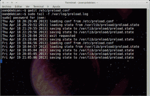
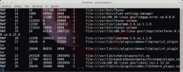

Siguiendo el plan trazado estas últimas semana hoy explicaremos como incrementar la rapidez de ejecución de nuestras aplicaciones con Preload. Cabe recordar que el plan trazado es generar un conjunto de post para explicar como optimizar el rendimiento de nuestra memoria RAM y por lo tanto de nuestro sistema. La serie de post son los siguientes:<!--more-->

1. [Liberar memoria cache de nuestra RAM.]()
2. [Limitar el uso de nuestra memoria Swap y limpiarla en el caso que se active.]()
3. [Usar la RAM más eficientemente con Zram.]()
4. **Acelerar el inicio de nuestras aplicaciones con Preload.**
5. [Acelerar el inicio de nuestras aplicaciones con Prelink.]()
6. [Aligerar el rendimiento de nuestro sistema operativo con Zswap]().

## DESCRIPCIÓN DEL FUNCIONAMIENTO DE PRELOAD

Aconsejo tener instalado el paquete preload. La función que desempeñará el demonio de preload es acelerar el arranque de las aplicaciones en nuestro sistema. ¿Cómo Preload consigue acelerar el arranque de nuestras aplicaciones?

Preload registra y monitorea las aplicaciones y procesos que más usamos y más ejecutamos. De está forma Preload puede hacer una predicción de los procesos que usaremos en un futuro y precargarlos  en nuestra memoria RAM antes de que nosotros los ejecutemos. Todo el proceso de monitorear, predecir y precargar lo hará cada 20 segundos. La frecuencia del ciclo se puede modificar accediendo a los archivos de configuración.

Con un ejemplo se verá más claro. Imaginemos que casi siempre usamos libreoffice y nuestro gestor de correo Thunderbird. Por lo tanto en el momento de arrancar nuestro sistema Preload precargará las librerías y procesos que utilizan estas aplicaciones en nuestra memoria RAM para que en el momento de arrancar estas aplicaciones inicien mucho más rápido. Estas aplicaciones arrancarán mucho más rápido porqué ya están precargadas en nuestra memoria RAM y evitamos tener que acceder a información almacenada en nuestro disco duro.

Además tenemos que tener en cuenta que Preload se está adapta constantemente a nuestras necesidades. Ahora suponemos que dejamos de usar Thunderbird y en detrimento de Thunderbird usamos otro gestor de correo. Si pasa esto preload lo detectará y dejará de precargar las librerías de Thunderbird en nuestra memoria.

Para que la gente tenga una de la mejora que puede suponer usar preload les cito el siguiente dato. La velocidad de transferencia de datos en una memoria RAM DDR3-1333 se puede aproximar a los 10664 MB/s mientras que la velocidad de transferencia de un disco duro SATA 3 es de 600 MB/s. Además tenemos que añadir que el tiempo de acceso de la información almacenada en la memoria RAM puede ser de unos 9 nano segundos mientras que si la tenemos almacenada en nuestro disco duro será de 4 milisegundos (4000000 ns). Por lo tanto si podemos arrancar las aplicaciones sin tener que acceder, o teniendo menos acceso a la información almacenada en nuestro disco duro el rendimiento será mejor.

## INSTALAR PRELOAD

Instalar Preload es muy fácil. Solamente tenemos que abrir una terminal y teclear el siguiente comando:

> ```
> sudo apt-get install preload
> ```

Tanto en Debian como en ubuntu ya no hay que hacer nada mas. A partir de este momento preload estará activo cada vez que arrancamos nuestro sistema. Así de simple. Con este simple comando se precargaran los ficheros, librerías y mapas de procesos que más usamos en nuestra memoria RAM y cuando arranquemos ciertas aplicaciones evitaremos tener que acceder a nuestro disco duro para que se inicien las aplicaciones.

###### Nota: Puede ser posible que el arranque de nuestro sistema sea un poco más lento si tenemos instalado Preload. El motivo es que Preload precargará la información que considere oportuna en nuestra memoria RAM en el arranque del sistema.

###### Nota: Hay distros linux en que no se activa automáticamente el demonio de preload. Hay que activarlo manualmente. Por ejemplo una de estas distros es Manjaro. Seguramente haya otras.

## OPCIONES DE CONFIGURACIÓN DE PRELOAD

La configuración estandard de Preload funciona a la perfección. Por lo tanto en principio no es necesario ajustar ningún parámetro. No obstante en el caso que alguien por necesidad o por experimentar quiere modificar algún parámetro lo puede realizar tranquilamente modificando los parámetros del siguiente archivo:

> ```
> sudo gedit /etc/preload.conf
> ```

###### Nota: Es altamente recomendable no tocar estos valores. Es probable que cualquiera de los nuevos valores introducidos impliquen un empeoramiento del rendimiento del sistema. En función de los cambios que se realicen el sistema operativo se puede volver inestable.

Algunos de los valores que se pueden modificar en el fichero de configuración son:

### Parámetro cycle

Este parámetro por defecto tiene un valor de **20**. Lo que significa el valor 20 es que cada 20 segundos el demonio preload analizará si la información que tenemos precargada en nuestra cache es la adecuada en función del uso que nosotros damos al ordenador. Por lo tanto preload cada 20 segundos recopila datos , hace una predicción de los datos a cargar en nuestra memoria, y finalmente los carga si es preciso.

###### Nota: Un valor demasiado bajo puede reducir el rendimiento y la estabilidad. En el fichero de configuración nos advierte que el valor de este parámetro tiene que ser un valor par.

### Parámetro Usecorrelation

Por defecto tiene el valor de **True**. Este parámetro solo puede tener como valores True o False.

Si el parámetro es true preload usará coeficientes de correlación a la hora de realizar la predicción de la información que hay que cachear y precargar en memoria. A priori si se usan coeficientes de correlación las predicciones que hará preload serán mejores.

###### Nota: Desconozco el tipo de coeficientes de correlación que usa Preload. No obstante un coeficiente de correlación que mucha gente conocerá es el de pearson. Cuando hacíamos regresiones lineales en el colegio sacábamos un coeficiente alfa o coeficiente de Pearson. Si teníamos una alfa de 0,99 quería decir que la recta se ajustaba a nuestra nube de puntos y que por lo tanto se podía realizar una predicción exacta de lo que puede pasar al tocar una de las variables.

### Parámetro Minsize

Este parámetro por defecto tiene un valor de **2000000** bytes. Este valor implica que Preload solo considerará precargar en memoria aquellos mapas de procesos con una tamaño superior a 2000000 bytes. Por lo tanto si bajamos este valor Preload cacheará multitud información para arrancar incluso las aplicaciones más ligeras mientras que si subimos mucho este valor Preload solo precargará información para el arranque de aplicaciones pesadas.

###### Nota: Si incrementamos mucho este valor es posible que preload pierde efectividad mientras que si lo bajamos mucho nuestro ordenador estará consumiendo más recursos de los deseados.

### Parámetros memtotal, memfree y memcached

Estos tres parámetros son los que determinarán el máximo de memoria RAM que podrá ser utilizada por Preload. Los valores de estos 3 parámetros se indican en % y pueden tomar un valor de -100 a 100. Los valores por defecto son respectivamente **\-10%, 100% y 30%**. El significado de estos valores es:

Usa como máximo el 100% de la memoria libre menos un 10% de la memoria total más un 30% de la memoria cache que está en uso.

###### Nota: Por lo tanto Preload nunca dejará seco de memoria RAM a nuestro ordenador. Estos parámetros nos asegurarán aprovechar al máximo la memoria RAM disponible.

### Parámetro doscan

Este parámetro tiene dos valores posibles. False o True. De forma predeterminada viene fijado en **True**. No tiene sentido fijar el valor de este parámetro en False ya que entonces Preload perdería su funcionalidad. En el caso de fijar el valor de este parámetro en False Preload dejaría de escanear los procesos que usamos más habitualmente.

### Parámetro dopredict

Este parámetro al igual que el anterior solo puede tener los valores False o True. De forma predeterminada este parámetro viene fijado en **True**. En el caso que lo fijáramos en False Preload perdería toda su funcionalidad ya que estaríamos deshabilitando la función de predicción de los mapas de procesos que hay que precargar en la RAM.

### Parámetro autosave

Este parámetro viene prefijado con un valor de **3600** segundos. Esto implica que cada 3600 segundos Preload guardará su estado en el disco. Es decir cada 3600 segundos se hará una copia de los archivos que Preload tiene cacheados. No es estrictamente necesario tener activada esta característica ya que cada vez que se apague el demonio Preload se guardará su estado en disco con el fin de poder volver a recuperar la información que tenemos cacheada una vez arranquemos el ordenador de nuevo.

### Parámetro mapprefix

El parámetro mapprefix sirve para indicar que ciertas **rutas** no sean escaneadas/monitoreadas por Preload. El valor por defecto de este parámetro es **empty list, accept all**. Por lo tanto en principio Preload escaneará y monitoreará la totalidad de rutas existentes.

En el caso de querer excluir una ruta del monitoreo de Preload lo podemos hacer con la sintaxis que se describe dentro del mismo fichero de configuración.

### Parámetro exeprefix

El parámetro exeprefix sirve para indicar que ciertos **archivos binarios** no sean escaneados/monitoreados por Preload. El valor por defecto de este parámetro es **empty list, accept all**. Por lo tanto en principio Preload escaneará y monitoreará la totalidad de ficheros binarios existentes.

En el caso de querer excluir un fichero binario de del monitoreo de Preload lo podemos hacer con la sintaxis que se describe dentro del mismo fichero de configuración.

## MONITOREAR EL FUNCIONAMIENTO DE PRELOAD

En caso de tener necesidad de monitorear los eventos que realiza preload lo podemos hacer abriendo una terminal y tecleando el siguiente comando:

> ```
> sudo tail -f /var/log/preload.log
> ```

Después de teclear este comando obtendremos el siguiente resultado:

[](images/log_preload.png)

Como se puede observar en la captura de pantalla quedan registrados datos como por ejemplo la confirmación que se arranca Preload en el momento de iniciar nuestro sistema operativo,  que se va guardando una copia de los archivos cacheados por Preload cada 3600 segundo tal y como habíamos estipulado en el fichero de configuración, etc.

En el caso de querer comprobar la totalidad de librerías que tiene cacheadas preload lo podemos realizar fácilmente. Tan solo tenemos que abrir una terminal y teclear el siguiente comando:

> ```
> sudo less /var/lib/preload/preload.state
> ```

Obtendremos el siguiente resultado:

[](images/info_cacheada.png)

Como se puede ver en la captura de pantalla tenemos una extensa lista que contiene la totalidad de librerías e información que tiene cacheada y precargada en memoria Preload. El contenido de este archivo es importante ya que cuando arrancamos nuestro sistema Preload precargará en nuestra memoria RAM las librerías que se detallan en este archivo.

## ALGUNOS EJEMPLOS DE LAS MEJORES QUE SE OBTIENEN

Según la fuente utilizada para la realización de este post podemos obtener mejoras importantes de rendimiento en el arranque de las aplicaciones. Las mejoras pueden ser del siguiente orden:

   
|  |   **Tiempo arranque en Frío (s)**   |    **Tiempo arranque en Frío Con Preload (s)**   |    **% de mejora**   |
| --- | --- | --- | --- |
| **OpenOffice** |   15   |   7   |    53   |
| **Firefox**  |   11   |   5   |    55   |
| **Evolution Email** |   9   |   4   |    55   |
| **Gedit**  |   6   |   4   |    33   |
| **Terminal Gnome** |   4   |   3   |    25   |

###### Nota: La fuente utilizada es plenamente fiable ya que es la persona que desarrollo Preload. No obstante cabe indicar que los valores indicados en la tabla no aplican actualmente ya que fueron tomados hace tiempo con un hardware que hoy en día podemos considerar obsoleto. No obstante la tabla nos da una idea de las mejoras que podemos obtener con Preload.

Como podéis ver los resultados en los tiempo de arranque en frío son espectaculares y sin ninguna duda las mejoras son espectaculares.

## LIMITACIONES DE PRELOAD

Acabo de citar y acabamos de ver que las mejoras con Preload son espectaculares pero obviamente también tiene limitaciones. Las limitaciones vendrán en el arranque en caliente de las aplicaciones. La segunda vez que arrancamos una aplicación la mejora será prácticamente imperceptible ya que en el arranque en caliente, tengamos o no tengamos preload, la gran mayoría de las librerías para arrancar un aplicación ya estarán en la memoria cache.

## FUENTES

[http://behdad.org/download/preload.pdf](http://behdad.org/download/preload.pdf "Fuente")

###### Nota: En la fuente que acabo de indicar se puede encontrar mucha más información acerca del funcionamiento de Preload.
