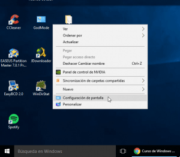
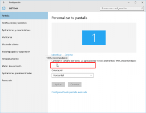
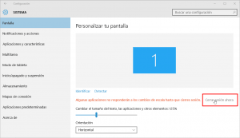
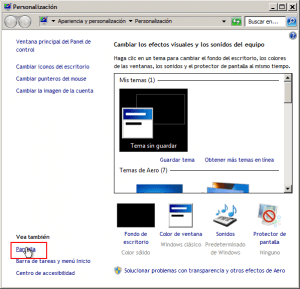
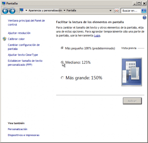
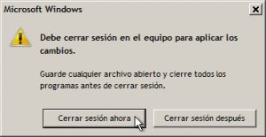

En algunas ocasiones **puede resultar tremendamente útil** el hecho de **incrementar el tamaño de letra y de la totalidad de elementos** y objetos que visualizamos en pantalla en nuestro sistema operativo Windows. Algunas de estas situaciones son las siguientes:<!--more-->

1. En el caso de **sufrir algún tipo de deficiencia visual**.
2. **En el caso que dispongamos de un monitor con una resolución muy alta** cosa que hará que visualicemos el texto muy pequeño.
3. **En el caso que realicemos Screencast** para posteriormente compartirlos por internet vía Youtube u otros medios.
4. Una simple **cuestión estética o de comodidad** ya que con un texto y unos elementos más grandes podremos trabajar con mayor comodidad.

Si este este es vuestro caso y necesitáis o creéis oportuno incrementar el tamaño de la letra y de los elementos que aparecen en pantalla tenéis que seguir los siguientes pasos.

## INCREMENTAR EL TAMAÑO DE LETRA Y DE LOS OBJETOS VISUALIZADOS EN PANTALLA EN WINDOWS 10

**En el fondo del escritorio**, tal y como se puede ver en la captura de pantalla, **presionamos el botón derecho del ratón y clicamos sobre la opción Configuración de pantalla**.

Una vez dentro de la ventana de configuración tan solo tenemos que **desplazar el puntero de la barra Cambiar el tamaño del texto las aplicaciones y otros elementos** **para incrementar el tamaño del texto y el resto de elementos que visualizamos en pantalla** en la totalidad del sistema operativo.

Si **desplazamos el puntero de la barra hasta el valor de 125%** podemos ver que el tamaño de la letra y del resto de elementos visualizados en pantalla se incrementa de forma automática. Ahora para que los cambios se apliquen de forma permanente tan solo tenemos que **presionar el botón Cerrar sesión ahora**.

Una vez se inicie la nueva sesión, el tamaño de la letra y de todos los elementos que se visualizan en pantalla serán de mayor tamaño que en la configuración estándar de Windows.

## INCREMENTAR EL TAMAÑO DE LETRA Y DE LOS ELEMENTOS VISUALIZADOS EN PANTALLA EN WINDOWS

En Windows 7 también podemos llevar a término la misma operación que acabamos de ver de la siguiente forma.

En el fondo del escritorio **presionamos el botón derecho del ratón y clicamos sobre la opción Personalizar**.

Seguidamente **clicamos en la opción Pantalla**.

Finalmente **en el apartado Facilitar la lectura de los de los elementos en pantalla**, tal y como se puede ver en la captura de pantalla, **seleccionamos el tamaño 125% o 150% y presionamos el botón Aplicar**.

Después de presionar el botón Aplicar aparecerá la siguiente ventana en la que se nos informará que para que los cambios sean efectivos se debe reiniciar la sesión. Para reiniciar la sesión de forma inmediata tenemos que **clicar encima de botón Cerrar sesión ahora**.

En el momento de reiniciar la sesión podrán observar que el tamaño de la letra y de todos los elementos que visualizamos en pantalla será mayor.
