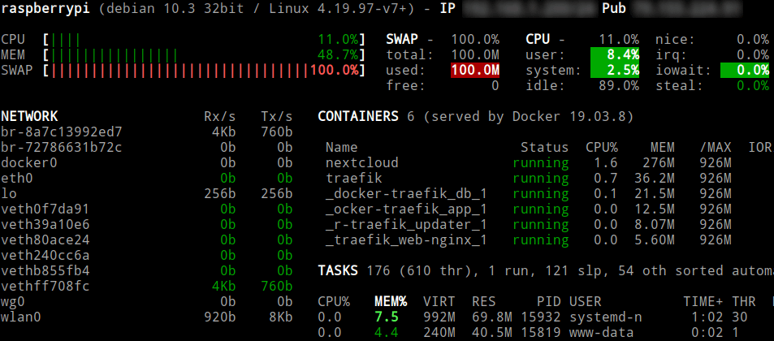
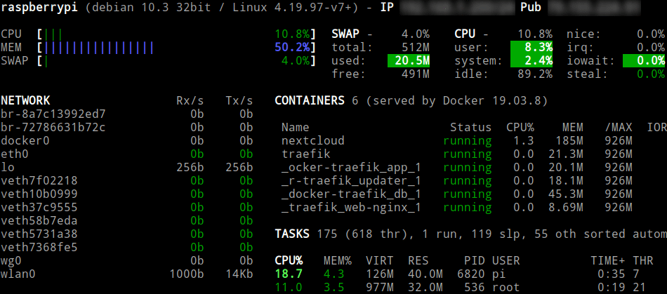

A continuación veremos los pasos a seguir para incrementar la memoria swap de una Raspberry Pi. En mi caso tengo una Raspberry Pi 3 modelo B que tan solo dispone de 1 GB de RAM. Además la configuración predeterminada de Raspbian establece una memoria de intercambio o SWAP de 100 MB. Por lo tanto a la mínima que instalamos 3 o 4 servicios como por ejemplo Nextcloud, Tiny Tiny RSS o traefik la memoria RAM se llena y el espacio de intercambio o SWAP es claramente insuficiente para un dispositivo que solo tiene 1GB de RAM.<!--more-->

[](images/memoria-swap-insuficiente.png)

## Problemas que genera tener una memoria SWAP insuficiente

Quedarse sin memoria de intercambio y sin memoria RAM puede generar los siguientes problemas:

1. Las aplicaciones o servicios de nuestra Raspberry Pi pueden dejar de funcionar por falta de memoria.
2. En el peor de los casos la Raspberry Pi se puede colgar y la tendremos que reiniciar. Este simple hecho puede causar una pérdida de información.

## Incrementar la memoria swap en una raspberry pi con Raspbian

Para comprobar la memoria SWAP disponible pueden usar un monitor de recursos como glances, [top](), htop, etc. Si no quieren instalar ningún software también pueden obtener los valores ejecutando el siguiente comando en la terminal:

> ```
> pi@raspberrypi:~ $ cat /proc/meminfo | grep Swap
> SwapCached: 102400 kB
> SwapTotal: 102400 kB
> SwapFree: 0 kB
> ```

**Nota:** Como pueden ver tengo toda la memoria SWAP ocupada.

Para incrementar la memoria swap en la Raspberry Pi tan solo tenemos que ejecutar el siguiente comando en la terminal:

> ```
> sudo nano /etc/dphys-swapfile
> ```

Cuando se abra el editor de textos nano tenemos que buscar la línea que establece la memoria Swap que Raspbian asigna a la Raspberry Pi. En mi caso la línea es la siguiente:

> ```
> CONF_SWAPSIZE=100
> ```

Si quieren incrementar la memoria de intercambio SWAP de 100 MB a 512 MB tan solo deberán reemplazar el número 100 por el 512. Por lo tanto la línea anterior deberá quedar de la siguiente forma:

> ```
> CONF_SWAPSIZE=512
> ```

Una vez realizadas las modificaciones guarden los cambios y cierren el fichero. Para que finalmente se haga efectivo el aumento de memoria SWAP tenéis 2 soluciones.

**La primera de ellas** es reiniciar la Raspberry Pi.

**La segunda** es ejecutar los siguientes comandos comandos en la terminal:

> ```
> sudo dphys-swapfile setup
> sudo dphys-swapfile swapon
> ```

Hayan elegido la primera opción o la segunda en estos momentos dispondrán de 512 MB. Para comprobarlo tan solo tenéis que ejecutar el siguiente comando en la terminal:

> ```
> pi@raspberrypi:~ $ cat /proc/meminfo | grep Swap
> SwapCached: 2476 kB
> SwapTotal: 524284 kB
> SwapFree: 513020 kB
> ```

O si lo prefieren pueden usar un monitor de recursos para verlo de forma más gráfica.

[](images/memoria-swap-incrementada.png)

## ¿Pero no hay que evitar el uso del espacio de intercambio para mejorar el rendimiento?

Es una obviedad que cuando se hace uso de la memoria SWAP el dispositivo reacciona con lentitud. Pero con un dispositivo de tan solo 1GB de RAM es imprescindible tener un espacio de intercambio superior a 100 MB. Con 1GB es fácil quedarnos sin memoria y en el caso que nos quedemos sin memoria precisaremos de un espacio de intercambio generoso.

Si veo que los 512MB asignados son insuficientes, en un futuro incrementaré el espacio de intercambio a 1024 MB.

## ¿Qué es y como funciona la memoria de intercambio SWAP?

Si quieren una explicación detallada de que es y como funciona el espacio de intercambio SWAP pueden leer siguiente artículo:

https://geekland.eu/optimizar-el-uso-de-la-memoria-swap/
