Es común que al visualizar o editar un documento ofimático en un ordenador que no es nuestro se visualice mal. El motivo acostumbra a ser que el ordenador que usamos no tiene disponible las fuentes necesarias para que el documento se visualice de forma correcta. Por este motivo a continuación le enseñaré como incrustar fuentes en un documento ofimático de LibreOffice o Microsoft Office. De esta forma conseguiremos lo siguiente:<!--more-->

1. Si pasamos una presentación o documento a una tercera persona, lo podrá visualizar correctamente.
2. Si una tercera persona edita un documento que nosotros hemos empezado lo podrá hacer con la misma tipografía que nosotros. De esta forma evitaremos presentaciones y documentos que tienen multitud de tipografías en cada una de las transparencias.

###### Nota: El tutorial que verán a continuación es aplicable a cualquier programa que forme parte de las suites Microsoft Office y LibreOffice.

## INCRUSTAR FUENTES EN UN DOCUMENTO DE MICROSOFT OFFICE

Supongamos que tenemos la siguiente presentación de Powerpoint en que hemos usado las tipografías Gotham y Dubai Medium.

[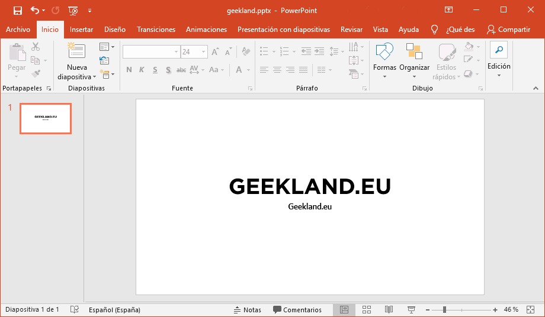](images/documento-powerpoint-finalizado.png)

Si abrimos la presentación en un ordenador que no dispone de estas tipografías veremos la visualización no será correcta.

[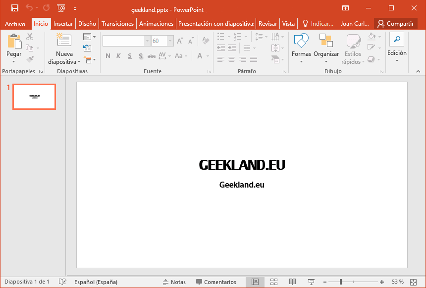](images/fuentes-visualizacion-incorrecta.png)

Para evitar este problema vamos a incrustar las fuentes Gotham y Dubai Medium en el documento del siguiente modo:

En el documento que dispone de la totalidad de fuentes clicamos sobre la pestaña Archivo:

[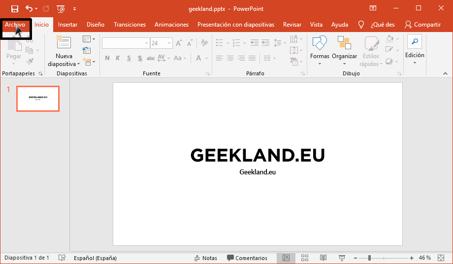](images/acceder-menu-archivo.png)

Acto seguido clicamos sobre la pestaña la opción Guardar como.

[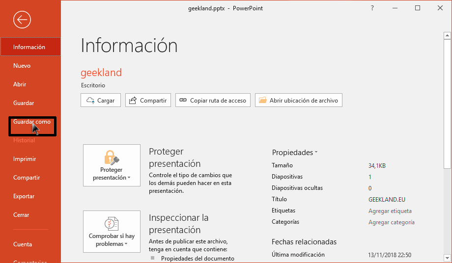](images/guardar-como.png)

A continuación seleccionamos donde queremos guardar el archivo con fuentes incrustadas. Como lo quiero guardar en el escritorio hago doble clic en Este PC.

[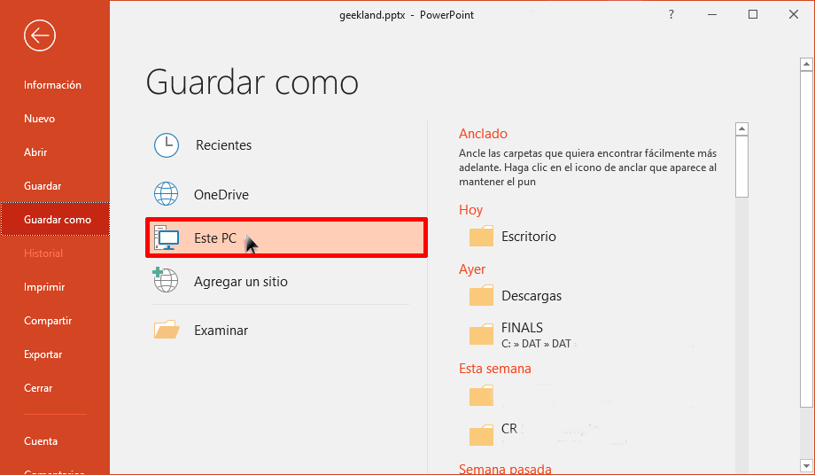](images/ubicacion-donde-queremos-guardar-archivo.png)

En la ventana de Guardar como clicaremos en el botón de Herramientas. Cuando aparezcan las opciones del botón Herramientas clicaremos en Opciones para guardar...

[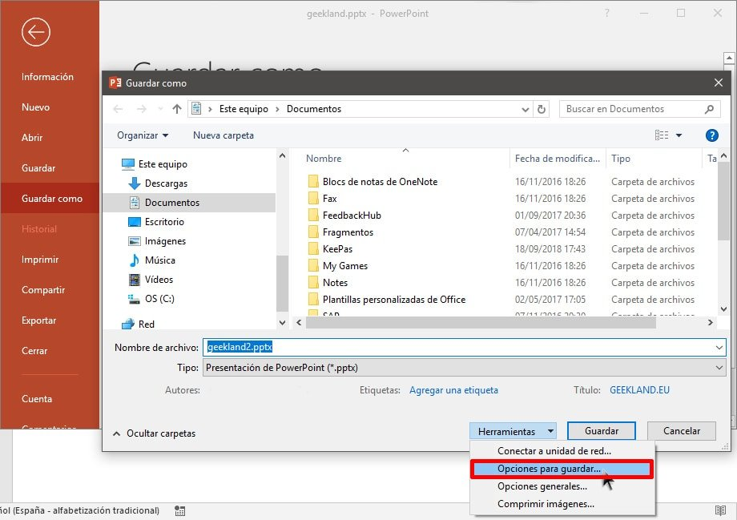](images/opciones-para-guardar-documento.jpg)

En la ventana de Opciones de Powerpoint clicaremos en Guardar, tildaremos la opción Incrustar fuentes en el archivo, acto seguido tildaremos la opción Incrustar todos los caracteres y finalmente presionaremos el botón Aceptar.

[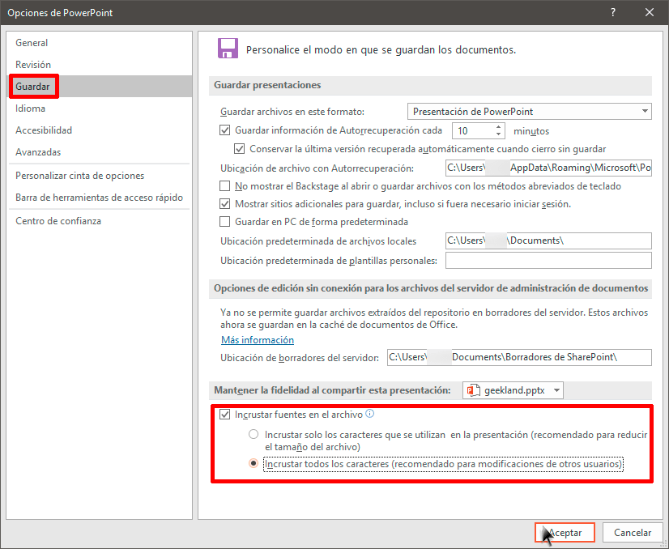](images/incrustar-fuentes-documento-microsoft-office.png)

El último paso consistirá en definir el nombre y la ubicación donde queremos guardar el archivo y presionar el botón Guardar.

[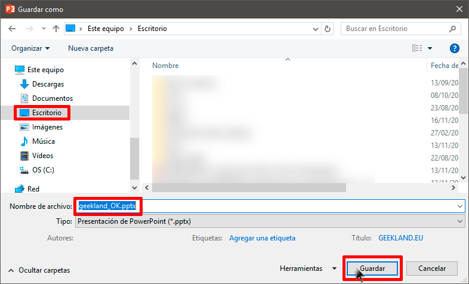](images/guardar-documento-fuentes-incrustadas.png)

En estos momentos, aunque abramos el documento en un ordenador que no disponga de las fuentes Dubai Medium y Gotham visualizaremos el documento a la perfección.

[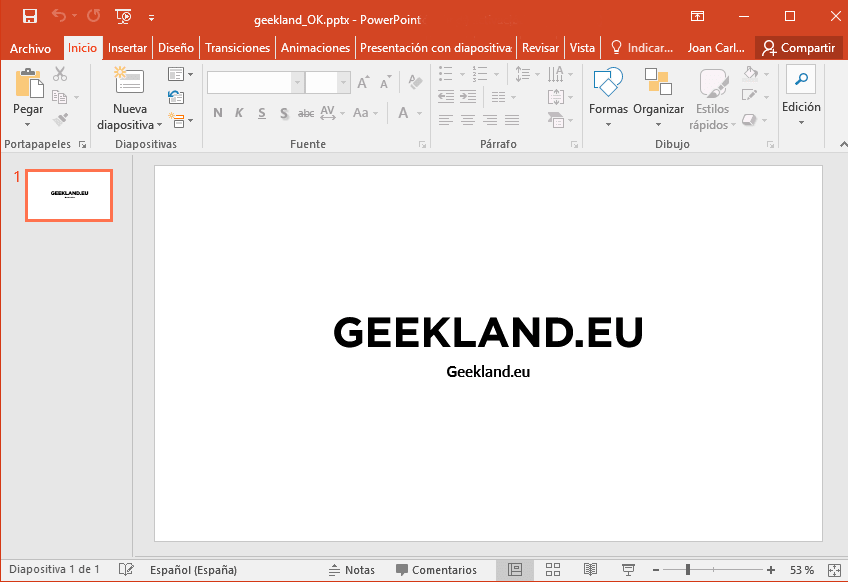](images/documento-visualizacion-perfecta.png)

Además podremos editar y modificar el documento sin ningún tipo de problema.

## INCRUSTAR FUENTES EN UN DOCUMENTO DE LIBREOFFICE

En nuestro caso tenemos el siguiente documento que hemos editado con la fuente Ubuntu.

[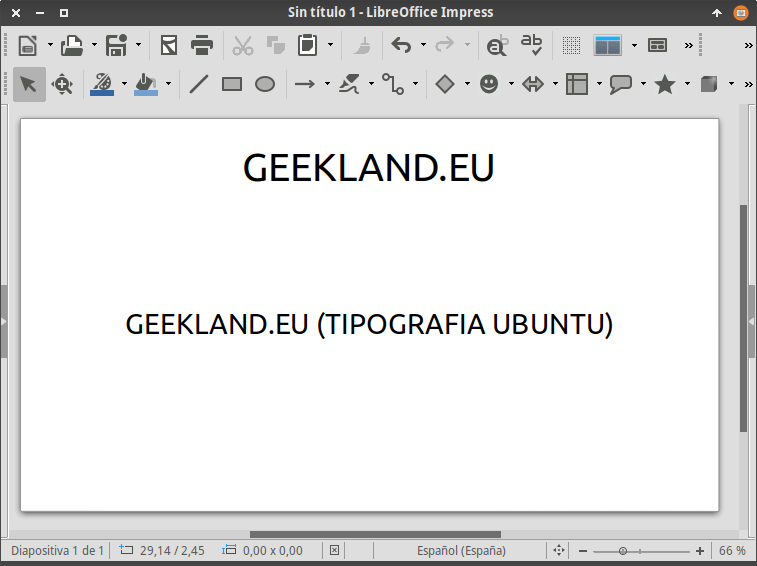](images/documento-libreoffice-finalizado.png)

Si abro el documento en un ordenador que no dispone de la fuente Ubuntu se visualizará de forma incorrecta.

[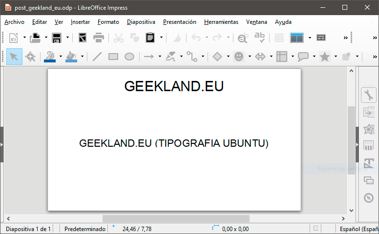](images/tipografia-incorrecta-libreoffice.png)

Si queremos evitar el problema tan solo tenemos que clicar en el menú Archivo. Cuando aparezca el submenu clicamos en la opción Propiedades.

[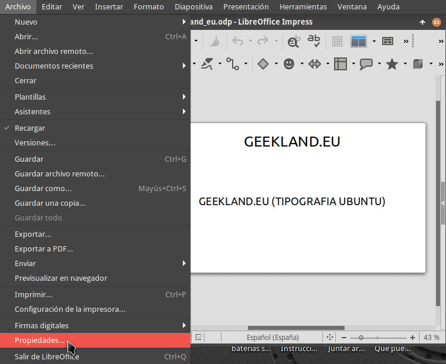](images/acceder-propiedades-documento-libreoffice.png)

En la ventana propiedades clicamos en la pestaña Tipo de Letra. Acto seguido tildamos la opción Incrustar los tipos de letra en el documento y presionamos el botón Aceptar.

[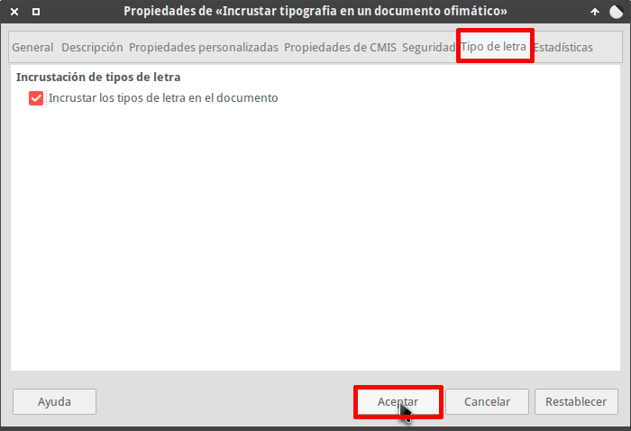](images/incrustar-fuentes-documento-libreoffice.png)

Finalmente guardamos el documento. Ahora si intentamos visualizar el documento en un ordenador que no dispone de la fuente Ubuntu no tendremos ningún problema.

[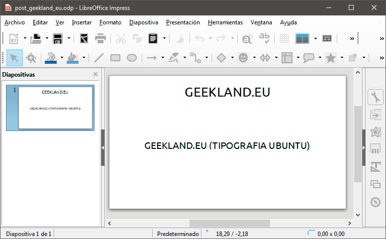](images/visualizacion-correcta-en-cualquier-ordenador.png)

Tal y como se puede ver en la captura de pantalla se visualiza a la perfección e incluso podemos seguir editando el documento con la fuente Ubuntu.

## INCONVENIENTES DE INCRUSTAR FUENTES EN UN DOCUMENTO

El único inconveniente de incrustar fuentes en un documento es que el documento ocupará más espacio. El incremento de espacio experimentado en los documentos en que he incrustado las fuentes es el siguiente:

|   | **Microsoft Office** | **LibreOffice** |
| :-- | :-- | :-- |
| **Fuentes sin incrustar** | 34,9 kB (34.928 bytes) | 12,9 kB (12.894 bytes) |
| **Fuentes incrustadas** | 3,3 MB (3.309.758 bytes) | 28,4 MB (28.385.913 bytes) |

En el caso de LibreOffice el incremento de tamaño es sustancial. No obstante creo que hoy en día el tamaño que ocupa un documento no es algo que nos deba preocupar en exceso.
