Obviamente para redactar un documento básico no es necesario trabajar con los estilos, ni realizar Índices de contenido automáticos y numerados, ni muchas otras operaciones que realizaríamos en documentos y trabajos que tienen mayor envergadura.<!--more-->

Pero si tenéis que hacer documentos extensos como por ejemplo proyectos de final de carrera universitaria, proyectos de máster, informes laborales extensos, etc, el hecho de usar un índice de contenido automático y numerado, y jugar con los estilos y niveles, os puede ahorrar muchas horas de trabajo y muchos dolores de cabeza. Además la presentación del trabajo o documento será siempre excelente.

Por lo tanto quien quiera optimizar su forma de trabajar, le aconsejo encarecidamente que utilice los índices de contenido automáticos y numerados que nos proporcionan herramientas ofimáticas como [Libreoffice](https://es.libreoffice.org/descarga/libreoffice-nuevo/ "Link de descarga del programa Libreoffice") Writer o Microsoft Word.

Para realizar un índice de contenido automático y numerado en Libreoffice Writer, tan solo hay que seguir los siguientes pasos:

## SELECCIONAR LOS ESTILOS PARA EL ÍNDICE DE CONTENIDO

Lo primero a realizar es **abrir un Documento en blanco** y definir los estilos y niveles que queremos usar. **En mi caso prepararé un documento para usar 4 Estilos y 4 Niveles.**

Para ver los estilos disponibles, podemos **ir al menú Formato y seguidamente seleccionar la opción Estilos y formato**. Otra opción para acceder a los estilos disponibles es presionar la tecla F11. Después de acceder al al menú de Estilos y formato, tal y como se puede ver en la captura de pantalla, podremos ver la totalidad de estilos disponibles.

[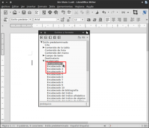](images/2-Ver-los-estilos-disponibles.png)

Después de ver la totalidad de estilos disponibles **voy a seleccionar los 4 estilos que voy a usar**. En mi caso los estilos seleccionados son:

1. **Encabezado 1**, que usaré para el nivel 1.
2. **Encabezado 2**, que usaré para el nivel 2.
3. **Encabezado 3**, que usaré para el nivel 3.
4. **Encabezado 4**, que usaré para el nivel 4.

**Para ver el formato de cada uno de los estilos**, tal y como podemos ver en la captura de pantalla, **hacemos doble click encima del estilo que queramos comprobar.**

Una vez seleccionado el estilo, tal y como se puede ver en la captura de pantalla, **escribimos una frase de prueba para ver el formato** que tiene el estilo que hemos seleccionado.

[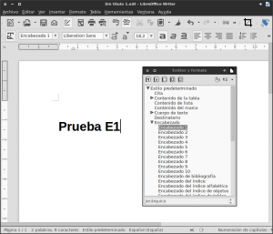](images/3-Ver-el-formato-de-los-estilos.png)

Repetimos el mismo procedimiento para poder ver el formato de los estilos Encabezado 2, Encabezado 3 y Encabezado 4. El resultado de repetir el proceso es el que se muestra en la siguiente captura de pantalla:

[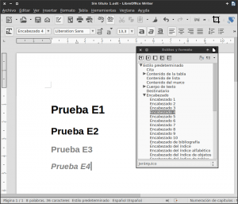](images/4-Formato-estandar-de-los-estilos-seleccionados.png)

## MODIFICAR EL FORMATO DE LOS ESTILOS

Si el formato de los estilos seleccionados nos parece bien, podemos omitir este punto y podemos pasar al siguiente. No obstante en mi caso, tal y como se puede ver en la última captura de pantalla, los estilos Encabezado 3 y Encabezado 4 tienen la letra de color gris, y además el Encabezado 4 y tiene el estilo de letra cursiva.

Para modificar estos dos aspectos es sumamente fácil. Tan solo tenemos que **ir a la ventana Estilos y formato**, seguidamente, tal y como se puede ver en la captura de pantalla, **seleccionamos el estilo que queremos modificar**, **presionamos el botón derecho del ratón y seguidamente ejecutamos la opción Modificar...** del menú contextual.

[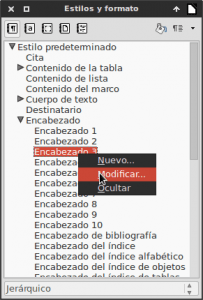](images/5-Modificar-formato-de-un-estilo.png)

Después de presionar en la opción Modificar... **aparecerá la siguiente ventana:**

[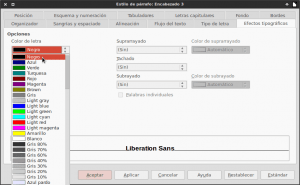](images/6-Cambiar-color-Encabezado-3.png)

**Esta ventana dispone de distintas pestañas. En cada una de las pestañas se pueden modificar diferentes aspectos del formato del estilo que estamos modificando**. En mi caso como quiero modificar el color, tal y como se puede ver en la captura de pantalla, vamos a la pestaña Efectos tipográficos, y en el apartado color de letra podremos cambiar el color de gris a negro. **Una vez hayamos cambiado todos los parámetros que deseemos presionamos el botón Aceptar.**

Una vez modificado el estilo Encabezado 3, modificaremos el estilo Encabezado 4 y el resto de estilos, del mismo modo que modificamos el estilo Encabezado 3.

Después de modificar los Estilos Encabezado 3 y Encabezado 4 a nuestro gusto,el formato de nuestros estilos pasará a ser el siguiente:

[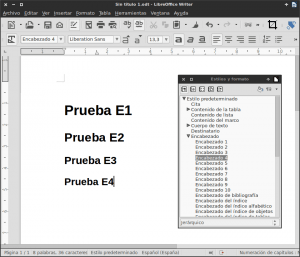](images/7-Estilos-con-el-formato-que-queremos.png)

Una vez tengamos los estilos a nuestro gusto ya podemos pasar al siguiente apartado.

## CONFIGURAR LA  NUMERACIÓN DE LOS ESTILOS

El siguiente paso es configurar la numeración de los estilos que queremos usar. Para configurar la numeración de los estilos, **nos vamos al menú Herramientas y seguidamente seleccionamos la opción Numeración de capítulos...** del menú contextual. Después de seleccionar esta opción aparecerá la siguiente ventana:

[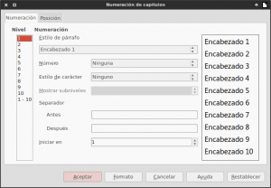](images/8-Configuración-numeración-de-capítulos.png)

En esta ventana, **para cada uno de los 4 niveles que queremos disponer, tendremos que seleccionar:**

1. **El estilo de párrafo** que queremos usar.
2. **El estilo de numeración** que queremos aplicar
3. **El número de subniveles** que queremos mostrar.

En mi caso las opciones seleccionadas para cada uno de los 4 niveles son las siguientes:

Tal y como se puede ver en la captura de pantalla, **en el Nivel 1 he seleccionado el estilo de párrafo Encabezado 1, y el estilo de numeración 1, 2, 3, …**

[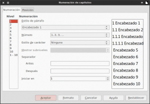](images/9-Configuración-de-la-numeración-de-capítulos-nivel-1.png)

###### Nota: En el Nivel 1 no es posible configurar la opción mostrar subniveles ya que que al estar en el Nivel 1 no existirán subniveles.

Una vez hayamos terminado de configurar las opciones del nivel 1 ya podemos configurar las opciones del Nivel 2. Para ello **seleccionamos el nivel 2 clicando encima del número 2 del apartado Nivel**.

Una vez seleccionado el nivel 2, tal y como se puede ver en la captura de pantalla, **configuramos que el estilo de párrafo del nivel 2 sea Encabezado 2, el estilo de numeración 1, 2, 3, …, y finalmente que se muestre 1 subnivel de numeración cuando insertemos el estilo encabezado 2**.

[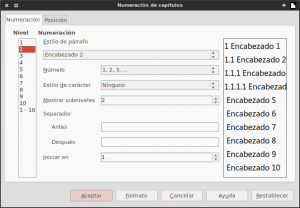](images/10-Configuración-de-la-numeración-de-capítulos-nivel-2.png)

Una vez hemos terminado con el nivel 2 **seleccionamos el nivel 3**. Una vez seleccionado el nivel 3, **configuramos que el estilo de párrafo del nivel 3 sea Encabezado 3, el estilo de numeración 1, 2, 3, …, y finalmente que se muestren 2 subniveles de numeración cuando insertemos el estilo encabezado 3.**

Finalmente solo nos falta configurar el último nivel. Para ello **seleccionamos el Nivel 4**. Una vez lo hemos seleccionado, tal y como se puede ver en la captura de pantalla, **configuramos que el estilo de párrafo del nivel 4 sea Encabezado 4, el estilo de numeración 1, 2, 3, …, y finalmente que se muestren 3 subniveles de numeración cuando insertemos el estilo Encabezado 4.**

[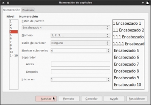](images/11-Configuración-de-la-numeración-de-capítulos-nivel-4.png)

Una vez hemos terminado con el nivel 4 el proceso ha terminado. **Una vez terminado el proceso presionamos sobre el botón Aceptar**. En estos momentos ya hemos terminado de configurar los estilos y la numeración de los estilos.

###### Nota: En el caso que necesitéis más de 4 estilos y más de 4 niveles, podéis definir más siguiendo las mismas pautas que se detallan en este artículo.

## REDACTAR EL DOCUMENTO USANDO LOS ESTILOS CREADOS

Una vez configurados los estilos y la numeración de los estilos, ya podemos empezar a redactar el documento. Imaginemos que queremos redactar un documento que contenga la siguiente estructura de índice:

1 Equipos de fútbol españoles

1.1 F.C Barcelona 1.1.1 Secciones del F.C Barcelona 1.1.1.1 Baloncesto 1.1.1.2 Fútbol

1.2 Real Madrid 1.2.1 Secciones del Real Madrid 1.2.1.1 Baloncesto 1.2.1.2 Fútbol

2 Equipos de fútbol Ingleses

2.1 Manchester United 2.1.1 Secciones del Manchester United 2.1.1.1 Baloncesto 2.1.1.2 Fútbol

2.2 Arsenal 2.2.1 Secciones del Arsenal 2.2.1.1 Baloncesto 2.2.1.2 Fútbol

Empezaremos creando el primero de los títulos del documento, y que además deberá aparecer en el índice. Para crearlo tal y como se puede ver en la captura de pantalla, tenemos que c**licar encima del desplegable Aplicar estilo**. Se abrirá el desplegable, y tal y como se puede ver en la captura de pantalla, tendremos que s**eleccionar el estilo Encabezado 1 ya que el título principal que queremos escribir corresponde al nivel 1**.

[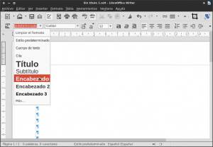](images/12-Aplicar-estilo-encabezado-1.png)

Una vez seleccionado el estilo Encabezado 1, tal y como se puede ver en la captura de pantalla, ya podemos **escribir el primero de los títulos** que se escribirá con el estilo Encabezado 1.

[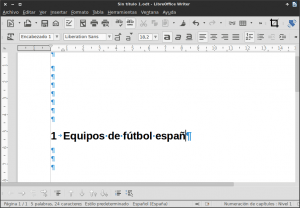](images/13-Escribiendo-el-título-encabezado-1.png)

**Una vez escrito el título presionamos Enter** y seguidamente podemos empezar a **escribir el contenido de este apartado**. Una vez hayamos terminado de escribir el contenido del primer apartado ya podemos iniciar el segundo apartado.

El título del segundo apartado, en mi caso corresponde al nivel 2. Por lo tanto, tal y como se puede ver en la captura de pantalla, tenemos que **clicar encima del menú desplegable Aplicar Estilo**. Seguidamente se abrirá el desplegable, y a diferencia del apartado anterior, en este caso tendremos que **seleccionar el estilo Encabezado 2, ya que como hemos dicho anteriormente, el título del apartado que estamos insertando corresponde al nivel 2.**

[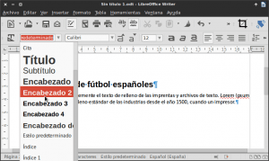](images/14-Aplicar-estilo-encabezado-2.png)

Una vez seleccionado el estilo Encabezado 2, tal y como se puede ver en la captura de pantalla, ya podemos **escribir el título del apartado y el contenido del apartado 2**.

[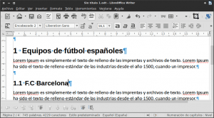](images/15-Escribir-contenido-en-los-aparados.png)

**De este mismo modo tendremos que ir creando los títulos y contenido para el resto de puntos** de nuestro documento. Cuando terminemos de redactar el documento será el momento de insertar/crear el índice de contenido.

## INSERTAR EL ÍNDICE DE CONTENIDO

Una vez hemos finalizado nuestro trabajo ya solo nos falta crear el Índice de contenido. Para ello **nos iremos a la primera página del documento que es donde queremos insertar el índice**. Una vez estamos allí tendremos que **acceder al menú Insertar**. Al acceder en este menú se desplegará un submenú en el que tendremos que **seleccionar la opción Índice y tablas**, y finalmente de desplegará otro submenú en el que tendremos que **seleccionar la opción Índices**. Una vez seleccionada la opción Índices **aparecerá la siguiente ventana:**

[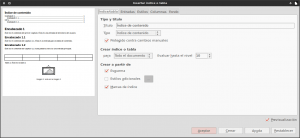](images/16-Insertar-Índice-o-tabla-de-contenido.png)

**En esta ventana prácticamente no tenemos que modificar nada ya que la configuración por defecto es la que tenemos que usar** para poder crear el índice de contenido. Los únicos parámetros que es posible que necesitéis modificar son los siguientes:

**Título:** En este apartado tenéis que poner el título que queréis que tenga el índice de contenido. En mi caso el título por defecto, que es índice de contenido, ya me parece bien.

**Protegido contra cambios manuales:** Aconsejo tildar esta opción. De esta forma el índice que insertaremos estará protegido contra cambios manuales/accidentales.

El resto de campos que no he citado, tenéis que dejar los valores por defecto. Aconsejo que comprobéis que sean los mismos que se muestran en la captura de pantalla de este apartado.

No obstante para los curiosos, y para los que les gusta probar todas las opciones, si quieren pueden modificar los siguientes apartados:

**Para:** En este ejemplo, como queremos realizar el índice de contenido de todo el documento tenemos que seleccionar la opción Todo el documento. Si solo quisiéramos insertar el índice de un capítulo, podríamos seleccionar la opción Capítulo.

**Evaluar hasta el nivel:** En este punto se definen los niveles que queremos que aparezcan en el índice. En nuestro caso solo usamos 4 niveles por lo tanto en esta celda podemos usar cualquier valor igual o superior a 4. En el caso que estuviéramos usando 10 niveles y solo quisiéramos que aparecieran 6 en el índice, tendríamos que seleccionar el valor 6 en este apartado.

**Esquema:** Esta opción tiene que estar tildada. Estando tildada hacemos que en el índice aparezcan la totalidad de niveles definidos en en el apartado de numeración de los estilos. Si desmarcamos esta opción, el índice saldrá en blanco a no ser que incluíamos nuestros estilos en en el apartado Estilos Adicionales.

**Estilos Adicionales:** En el caso que queramos que en el índice aparezcan apartados adicionales a los definidos en la numeración de estilo, lo podemos hacer activando y configurando esta opción.

**Marcas de índice:** Si tildamos esta opción, en el índice aparecerá la totalidad de texto que hayamos marcado de cualquiera de los párrafos. Para marcar un texto tan solo tenemos que seleccionar el texto que queramos marcar, una vez seleccionado tenemos que acceder al menú Insertar, dentro del menú insertar tenemos que seleccionar la opción Índices. Finalmente dentro del menú Índices tenemos que ejecutar la opción Entrada.

**Una vez se hayan configurado la totalidad de opciones ya podemos presionar el botón Aceptar**. Después de presionar el botón Aceptar, tal y como se puede ver en la captura de pantalla, el índice de contenido se insertará en el documento:

[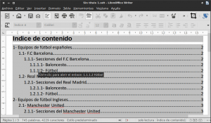](images/17-Índice-de-contenido-insertado.png)

Si miran la captura de pantalla, observaran que se trata de un índice con hiperenlaces. Por lo tanto **si posicionamos el puntero del mouse encima de uno de los apartados, y presionamos la tecla (Ctrl + clic en el botón izquierdo del mouse), veremos que automáticamente podremos ver y editar el contenido de este apartado.**

## MODIFICAR EL ASPECTO Y EL FORMATO DEL ÍNDICE

Una vez insertado el índice es posible que no nos guste su formato, o que queramos pulir ciertos aspectos. Si este es vuestro caso pueden aplicar los siguientes consejos:

### Modificar la estructura del índice

Si nos fijamos en el índice que acabamos de insertar, vemos que la numeración de cada apartado sale pegada al texto. Para solucionar este problema **posicionamos el puntero del mouse encima del índice, presionamos el botón derecho del mouse**, después de presionar el botón derecho del mouse aparecerá un menú contextual en el que deberemos **clicar la opción Editar índice/tabla**. Una vez clicada está opción volverá a aparecer la ventana de configuración de insertar Índice o tabla. En la ventana Índice o tabla tendremos que **clicar encima de la pestaña Entradas**. Una vez hayamos clicado encima de esta pestaña aparecerá la siguiente ventana:

[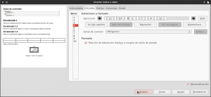](images/18-Configurar-estructura-del-índice-de-contenido.png)

Para solucionar el problema de que los números salen pegados al título, tal y como se puede en la captura de la pantalla, tendremos que **introducir el carácter – (guión + espacio), en la celda del Apartado Estructura y formato que está entre E#· y E**. Una vez realizado este paso para para el nivel 1, lo deberemos **repetir para el nivel 2, el nivel 3 y el nivel 4**. U**na vez modificados los 4 niveles presionaremos el botón Aceptar** y veremos que el problema ya se ha solucionado.

Aparte de solucionar el problema que acabamos de mencionar, **la pestaña Entradas sirve para modificar la estructura que tendrá cada una de las líneas de nuestro índice. La configuración estándar es perfecta**. No obstante si alguien lo considera necesario, **en esta pestaña se pueden modificar** ciertos **aspectos como** por ejemplo **sacar los hiperenlaces del índice, configurar las tabulaciones de las lineas del índice, introducir o sacar la numeración de los aparatados del índice, introducir o sacar la numeración de página de cada uno de los apartados del índice, etc.**

### Modificar los estilos del índice

En el caso que no nos guste el tipo de letra, las tabulaciones, las alineaciones o cualquier otro aspecto del formato del índice lo podemos modificar fácilmente.

Para ello **posicionamos el puntero del mouse encima del índice, presionamos el botón derecho del mouse**, después de presionar el botón derecho del mouse aparecerá un menú contextual en el que deberemos **clicar la opción Editar índice/tabla**. Una vez clicada está opción volverá a aparecer la ventana de configuración de insertar Índice o tabla. En la ventana Índice o tabla tendremos que **clicar encima de la pestaña Estilos**. Una vez hayamos clicado encima de esta pestaña aparecerá la siguiente ventana:

[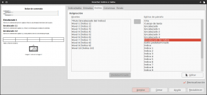](images/19-Modificar-estilos-del-índice.png)

En el apartado Niveles veremos el nombre del estilo que se aplica a cada uno de los niveles del índice.

Por lo tanto si queremos modificar alguno de los estilos, como por ejemplo, el estilo Encabezado del índice, tal y como se puede ver en la captura de pantalla, tenemos que irnos al apartado Estilos de párrafo, **seleccionar el estilo que queremos modificar**, que en mi caso es Encabezado del índice, y seguidamente una vez seleccionado **presionamos el botón Editar**. Después de presionar el botón editar aparecerá la siguiente ventana:

[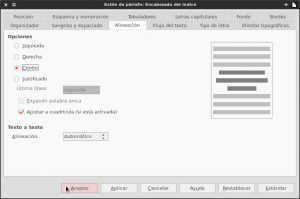](images/20-Modificar-el-estilo-encabezado-del-índice.png)

Como se puede ver en la captura de pantalla, esta ventana dispone de distintas pestañas. **En cada una de las pestañas se pueden modificar diferentes aspectos del formato del estilo que estamos modificando**. Algunos de los aspectos del formato que podemos modificar son el color de la letra, el tamaño de la letra, el color de fondo de la letra, que se escriba siempre en mayúsculas, las tabulaciones, las sangrías y espaciados, etc.

En mi caso lo único que quiero modificar es la alineación del estilo Encabezado del índice, ya que actualmente sale justificado a la izquierda y quiero que el título del índice esté centrado. Para ello, tal y como se puede ver en la captura de pantalla, clicamos encima de la pestaña Alineación, y en opciones seleccionamos la opción Centro. Una vez realizada está modificación tan solo hay que presionar el botón Aceptar.

**Una vez modificado el estilo Encabezado del índice, tan solo hace falta modificar del mismo modo el resto de estilos** que conforman el índice. Una vez tengamos a nuestro gusto los estilos Encabezado del índice, Índice 1, Índice 2, Índice 3 e Índice 4, el proceso habrá terminado.

### Presentación del índice en columnas

El índice se presenta en una sola columna. Si queremos presentar el índice en más de una columna lo podemos realizar de forma muy fácil. Tan solo **posicionamos el puntero del mouse encima del índice, presionamos el botón derecho del mouse**, después de presionar el botón derecho del mouse aparecerá un menú contextual en el que deberemos **clicar la opción Editar índice/tabla**. Una vez clicada está opción volverá a aparecer la ventana de configuración de insertar Índice o tabla. En la ventana Índice o tabla tendremos que **clicar encima de la pestaña Columnas**. Una vez hayamos clicado encima de esta pestaña aparecerá la siguiente ventana:

[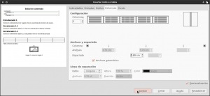](images/21-Presentar-índice-de-contenido-en-columnas.png)

En la pestaña columnas, tal y como se puede ver en la captura de pantalla, tan solo tenemos que **seleccionar el número de columnas** que queremos, que en mi caso son 2, **y el espaciado entre columnas**, que en mi caso quiero que sea sea 0,8 cm.

Una vez seleccionados estos valores el proceso ha finalizado, y tan solo tenemos que **presionar el botón Aceptar** para que se apliquen los cambios.

### Resultado final de las modificaciones

Una vez aplicados la totalidad de cambios tan solo nos falta ver el resultado final. El resultado final en mi caso es el que se muestra a continuación:

[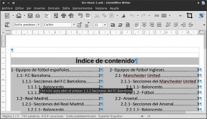](images/22-Índice-de-contenido-finalizado.png)

Como pueden ver en la captura de pantalla, si comparamos el primer índice que insertamos, y el resultado final, podremos observar que se han aplicado todas y cada una de las modificaciones de formato que queríamos realizar.

## INTRODUCIR MODIFICACIONES EN EL ÍNDICE INSERTADO

En apartados anteriores seleccionamos la opción de proteger el índice contra cambios accidentales/manuales. Por lo tanto una vez elegida esta opción es imposible introducir modificaciones manuales en el índice de forma accidental.

Si elegimos esta opción la forma de modificar el índice de contenido es la siguiente:

Si queremos introducir cambios **tenemos que modificar directamente los apartados u opciones de configuración de los estilos**. Así por lo tanto, si ahora decidimos que el documento no queremos que contenga información de los equipos Real Madrid y Arsenal, tan solo tenemos borrar todo el contenido referente al Real Madrid y al Arsenal del documento.

Una vez eliminado el contenido, tal y como se puede ver en la captura de pantalla, **nos vamos al índice, posicionamos el puntero del ratón encima del índice, presionamos el botón izquierdo del mouse y** cuando aparezca el menú contextual **presionamos sobre Actualizar índice/tabla**.

[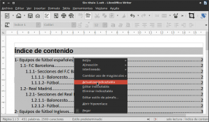](images/23-Modificar-el-Índice.png)

Tan solo realizando esta simple operación hemos modificado/actualizado nuestro índice.

## ¿ES NECESARIO REPETIR ESTOS PASOS EN TODOS LOS DOCUMENTOS QUE CREAMOS?

Obviamente **no es necesario repetir los pasos descritos en este artículo cada vez que generamos un documento**.

Mi recomendación para no tener que repetir siempre los mismos pasos, es que **guarden el documento que contiene los estilos del índice definidos en la carpeta plantillas**. De esta forma cada vez que necesitemos crear un documento, lo podremos realizar a partir de un documento que ya tenga definidos los estilos. **Para obtener más información acerca del funcionamiento de la carpeta plantillas** pueden **consultar** el siguiente enlace:

[https://geekland.eu/usar-la-carpeta-plantillas-en-linux/]()

## CONCLUSIONES FINALES

Obviamente en el ejemplo realizado en este artículo no ganamos mucho tiempo por el hecho de automatizar la realización del índice de contenido. No obstante existen casos en que el índice de contenido de un documento puede llegar a tener fácilmente una extensión de 6 o 7 páginas. En estos casos es cuando sacaremos verdadero partido al hecho de poder generar índices de contenido automáticos y numerados ya que estaremos obteniendo los siguientes beneficios:

1. La numeración y el texto de cada uno de los puntos siempre será la correcta ya que la numeración y el texto sale de forma automática.
2. Ahorraremos tiempo ya que no tendremos que buscar en que página está cada uno de los títulos.
3. Ahorraremos tiempo ya que no tendremos que ir página por página mirando que título hemos puesto en cada uno de los apartados.
4. Podremos acceder y modificar los apartados del índice más rápidamente ya que cada uno de los títulos del índice contiene un hiperenlace hacia nuestro contenido.

Por lo tanto **usando los índices de contenido sin duda conseguiremos incrementar enormemente la productividad y la calidad de los informes redactados**.
