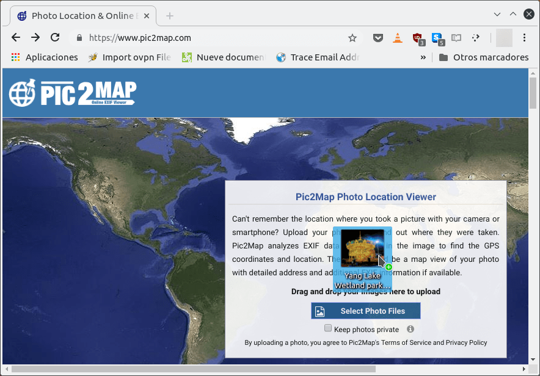
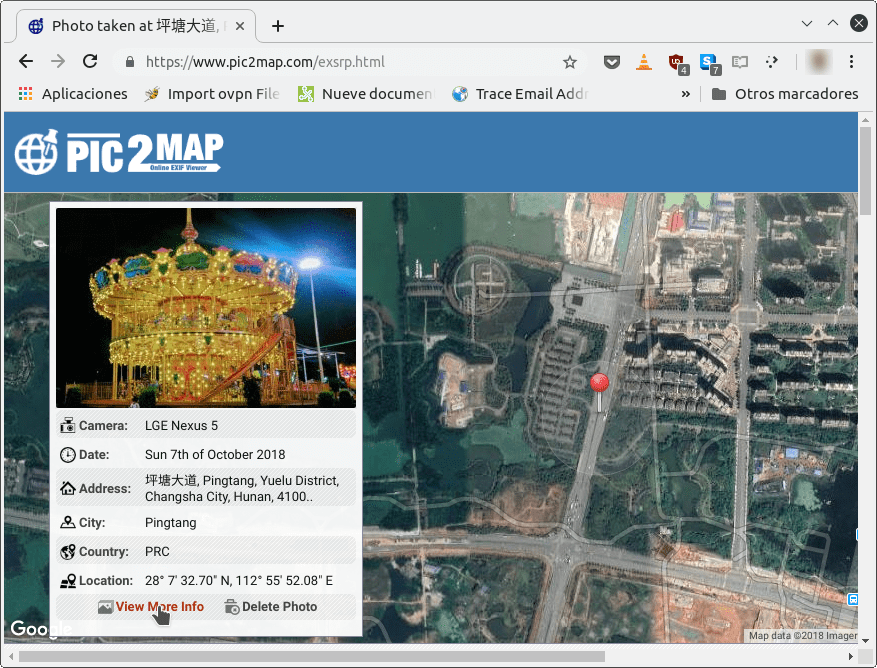
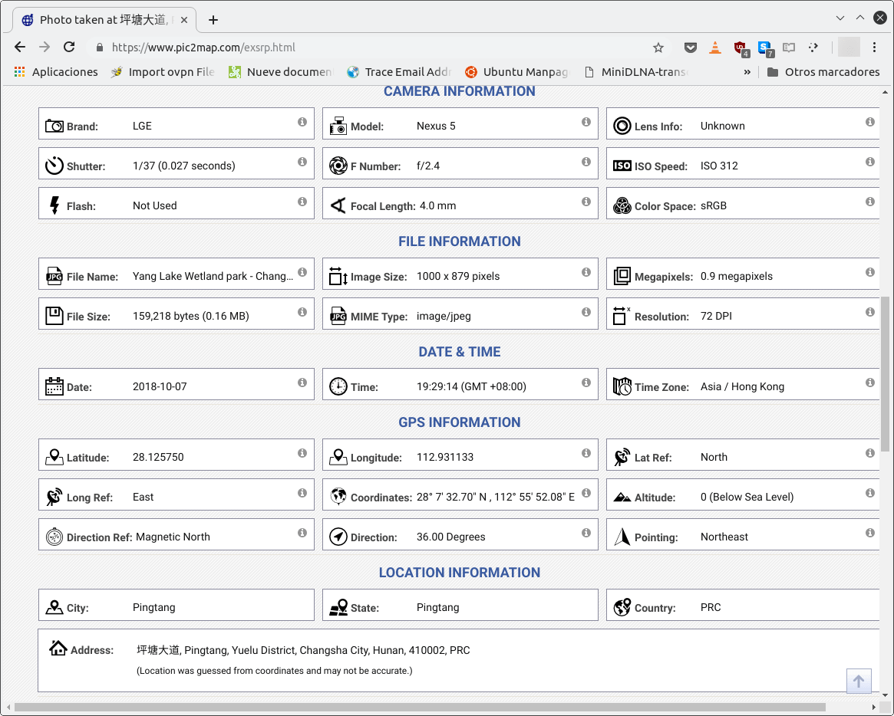

Año tras año crece de forma exponencial el número de fotos que tiran las personas. A modo de ejemplo en el año [2017 se tiraron más de 1,2 billones de fotos](https://es.statista.com/grafico/11001/este-ano-se-capturaran-12-billones-de-fotos-en-todo-el-mundo/ "Relación de las fotos realizadas el año 2017"). Esto es así porque hoy en día hay millones de adolescentes y adultos con teléfonos en sus bolsillos que inconscientemente envían y suben fotografías a la red sin ningún tipo de temor. Lo que no saben la mayoría de personas es que las fotos pueden revelar información personal de sus vidas. Mediante estándares como por ejemplo el **Exif (Exchangeable image file format)**, la totalidad de fotografías tomadas con un dispositivo digital llevan información incrustada conocida como metadatos. Cualquier archivo de imagen con el formato .jpg, .tiff, .raw, .png, etc es susceptible de contener metadatos. Por lo tanto vayan con cuidado con los metadatos de una fotografía.<!--more-->

###### Nota: Exif es solo uno de los estándares existentes para incrustar información en las fotos. Existen otros estándares como XMP. IPTC, etc.

## INFORMACIÓN QUE CONTIENEN LOS METADATOS DE UNA FOTOGRAFÍA

Los metadatos incrustados en las fotografías contienen o pueden contener la siguiente información:

1. Las **coordenadas GPS** de donde se ha tomando la fotografía. Por lo tanto cualquier persona que consiga una fotografía puede ser capaz de averiguar la ubicación exacta de donde la tomamos.
2. **Parámetros fotográficos** como por ejemplo la cámara con que se ha tirado la fotografía, la versión del firmware usada, si hemos usado flash, la distancia focal, la apertura de diafragma, el tamaño de la imagen, etc.
3. La **fecha y hora** exacta en que se tomo la fotografía.
4. El **nombre del propietario** de la cámara.
5. El **modelo de la cámara** con que se ha tomo la fotografía.
6. El **tamaño de la fotografía**.
7. Una **vista en miniatura de la fotografía**, o thumbnail.
8. Etc.

Seguro que habrá gente que pensará que proporcionar la información que acabo de citar no supone nada. Si es el caso les recomiendo que lean el siguiente apartado.

## INFORMACIÓN SENSIBLE QUE PUEDEN REVELAR LOS METADATOS DE UNA FOTOGRAFÍA

Anteriormente hemos dicho que una fotografía puede traer incrustadas las coordenadas GPS de donde se tiro la foto y la fecha de disparo. Por lo tanto mediante una fotografía se pueden llegar a averiguar varios aspectos como por ejemplo:

1. **La escuela donde van nuestros hijos**.
2. La **dirección exacta de la casa donde vivimos**.
3. **Demostrar** que un determinado día y hora estábamos en un lugar.
4. Que una persona desconocida sea capaz de **ver la casa donde vivimos**. Conociendo las coordenadas GPS de la vivienda de una persona podemos usar herramientas como Google Earth o Google Street View para ver imágenes reales de su casa.
5. Existen fotos que están retocadas digitalmente. Existen casos que mediante el Thumbnail, o imagen en miniatura, podemos **averiguar el contenido de una foto antes de ser retocada**.

A lo largo de la historia han existido casos en los que los metadatos de una fotografía han ayudado ha demostrar sucesos como por ejemplo:

1. Los [selfies de los soldados rusos](https://www.lavozdegalicia.es/noticia/internacional/2014/08/01/fotos-soldado-ruso-instagram-delatar-intromision-moscu-ucrania/00031406911954696324634.htm "Evidencia que los soldados rusos pisaron territorio de Ucrania") demostraron que estaban operando en territorio Ucraniano.
2. El [fugitivo John McAfee](https://nakedsecurity.sophos.com/es/2012/12/03/john-mcafee-location-exif/ "foto de John McAfee revela su ubicación") fue localizado a través de una fotografía.

## ¿ENTONCES LOS METADATOS SON MALOS?

Los metadatos pueden revelar información comprometedora, pero al mismo tiempo son necesarios y extremadamente útiles. Algunas de las utilidades de los metadatos son las siguientes:

1. Para **clasificar y catalogar nuestras fotografías**. Al subir nuestras fotografías a un servicio, como por ejemplo Google fotos, quedan completamente organizadas y clasificadas gracias a metadatos como la fecha de disparo, la localización GPS incrustada en la foto, etc.
2. Facilitar la **búsqueda de fotografías**. Existe software que nos permitirá realizar búsquedas de nuestras fotografías gracias a los metadatos que tienen incrustadas. De esta forma podemos hacer una búsqueda de la totalidad de fotografías tomadas en Barcelona en una fecha determinada.
3. Para **archivar y conservar nuestras fotos**. De esta forma, en un futuro lejano cualquier persona podrá consultar nuestras fotografías de forma fácil y sencilla.
4. Etc.

Por lo tanto, como han podido ver los metadatos son extremadamente útiles.

## EJEMPLO DE LA INFORMACIÓN PROPORCIONADA POR LOS METADATOS DE UNA FOTOGRAFÍA

Existen infinidad de programas para visualizar los metadatos de una fotografía. Algunos ejemplos son:

1. ExifTool.
2. Photoshop.
3. Xnview.
4. Exif Pilot.
5. Gwenview.
6. FastPreview.
7. Etc.

No obstante, la forma más fácil para ver y ser conscientes de la información que pueden proporcionar los metadatos de una fotografía es usar el servicio web Pic2map. Para ello accedemos accedemos a la siguiente URL:

[https://www.pic2map.com/](https://www.pic2map.com/ "Servicio para extraer información de una fotografía")

Una vez dentro de la web arrastramos una foto dentro de nuestro navegador.

Y sorprendentemente, por arte de magia, obtendrán la ubicación exacta donde fue tomada una fotografía. Si precisan de más información pueden presionar sobre el botón **View More Info**.

Después de presionar el botón obtendrán información adicional sobre la fotografía.

Como ven, de forma trivial y sin tener ningún conocimiento podemos extraer infinidad de información de una fotografía.

## ¿LAS REDES SOCIALES BORRAN LOS METADATOS DE LAS FOTOS?

**Twitter y Facebook** borran automáticamente la totalidad de metadatos comprometedores de las fotografías.

No obstante tengan en cuenta que tanto la [política de privacidad de Facebook](https://www.facebook.com/privacy/explanation) como de [Twitter](https://twitter.com/privacy?lang=en) especifican que pueden recolectar la ubicación y metadatos de nuestras fotos.

Si hablamos de Instagram tampoco tenemos que preocuparnos en exceso porque no permite descargarnos las fotos de terceros. No obstante al igual que Facebook y Twitter recopilarán la totalidad de metadatos de nuestras fotografías.

Tengan en cuenta que pueden existir redes sociales que no borren los metadatos. Por lo tanto, cuando empiecen a usar una red social hagan sus comprobaciones y lean cuidadosamente su política de privacidad.

Otras redes sociales, como por ejemplo **Google+ o Flikr**, no borran los metadatos y somos nosotros quien tiene que configurar si los queremos hacer públicos o no.

Por lo tanto no tenéis que preocuparos en exceso si usáis las redes sociales más convencionales. No obstante si nos debería preocupar que un atacante accediera a las fotografías que tenemos almacenadas en Google Fotos, iCloud, Flikr, etc.

## MEDIDAS PREVENTIVAS EN EL MOMENTO DE COMPARTIR FOTOGRAFÍAS

A lo largo del artículo hemos visto la información que pueden revelar los metadatos de una fotografía. Quien esté preocupado por su privacidad debería tener en cuenta los siguientes consejos:

1. **Restringir las personas con que compartimos las fotografías**. Antes de subir una fotografía a la red o enviarla a una persona hay que pensarlo 2 veces.
2. **Comprobar si la redes sociales borran los metadatos**. Si las redes sociales borran los metadatos podremos compartir fotos de forma más segura.
3. **Leer la política de privacidad** de las redes sociales y servicios donde subimos y alojamos nuestras fotografías. Recuerden que hay muchas redes sociales que ocultan los metadatos de nuestras fotos, pero los almacenan en sus servidores.
4. En caso que lo crean necesario pueden **borrar los metadatos de una fotografía** antes de compartirla. Existen herramientas como ExifTool, Exif Eraser, Easy Exif Delete, XnView, etc que nos permiten borrar las metadatos de forma sencilla.
5. **Configurar la cámara** de nuestro teléfono o dispositivo digital para evitar que incruste la ubicación GPS en las fotos.
6. **Ser cuidados**. Cualquier foto, aunque sea estúpida, puede revelar información privada.

Recordad que si decidís formatear los metadatos tampoco estáis a salvo. Cualquier persona que vea una fotografía o conjunto de fotografías puede ser capaz de reconocer donde se tiro la foto. Además sean cuidadosos con los comentarios que hagan en las redes sociales.
