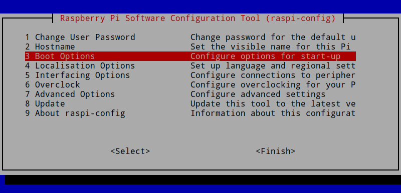
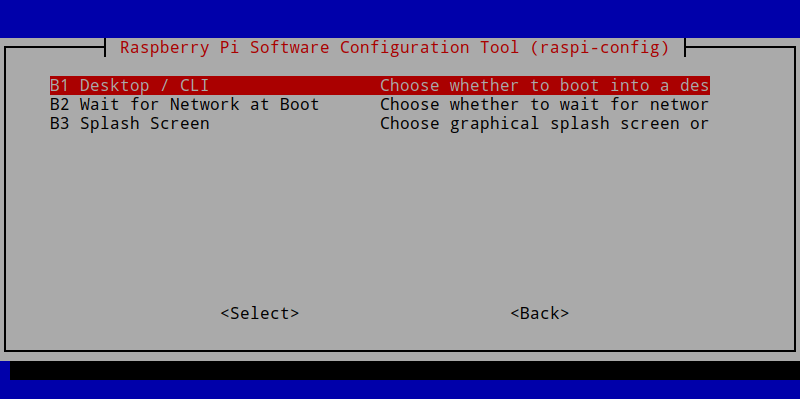
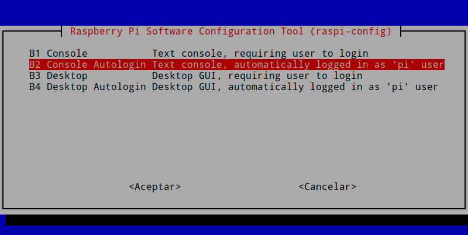

Es posible que tengáis configurada vuestra Raspberry Pi para que arranque en modo escritorio y queráis cambiarlo a modo consola o viceversa. Si este es vuestro caso tan solo hay que seguir estos simple consejos.<!--more-->

## CONFIGURAR LAS OPCIONES DE ARRANQUE DE LA RASPBERRY PI

En la terminal de la Raspberry Pi ejecutan el siguiente comando en la terminal:

> ```
> sudo raspi-config
> ```

Seguidamente aparecerá una pantalla con diferentes opciones de configuración. Con los cursores seleccionaremos la opción **Boot Options** y presionaremos Enter.

[](images/acceder-a-las-configuraciones-de-arranque.png)

A continuación seleccionaremos la opción **Desktop / CLI** y presionaremos Enter.

[](images/arranque-en-modo-consola-o-grafico.png)

Finalmente tendremos que seleccionar la opción de arranque que queramos. La opciones de arranque disponibles son las siguientes:

- **B1 Console:** La Raspberry Pi arrancará en modo consola. Justo al finalizar el arranque deberemos indicar el usuario que queremos usar e introducir su contraseña.
- **B2 Console Autologin Text console:** Nuestro dispositivo arrancará de forma automática en modo consola con el usuario Pi y sin tener que introducir ninguna contraseña.
- **B3 Desktop:** Nuestra Raspberry Pi arrancará en modo gráfico. Una vez arrancada tendremos que seleccionar el usuario e introducir su contraseña.
- **N4 Desktop Autologin:** La Raspberry Pi arrancará en modo gráfico. Justo al finalizar el arranque tendremos que seleccionar el usuario que queremos usar e introducir su contraseña.

En mi caso selecciono la opción **Console Autologin Text console** y presiono Enter. Selecciono este modo de arranque porque siempre uso mi Raspberry Pi en modo consola y porque quiero que mi Raspberry Pi se reinicie sin problemas en el caso que se interrumpa el suministro eléctrico.

[](images/cuatro-opciones-arranque-raspberry-pi.png)

## ¿CÚAL ES EL MODO DE ARRANQUE QUE DEBO USAR EN LA RASPBERRY PI?

Como hemos visto en el apartado anterior la Raspberry pi dispone de 4 modos de arranque. En función del uso que hagamos de nuestra Raspberry será más conveniente que usemos un modo u otro. Por lo tanto a continuación detallaré de forma breve en que situaciones es más conveniente usar un modo u otro.

### Situaciones en que recomiendo usar el modo gráfico

Si vuestra intención es usar la Raspberry Pi como un ordenador entonces no lo dudéis. La única opción que tenéis es seleccionar una de las 2 opciones para arrancar en modo gráfico.

De este modo podréis usar vuestra Raspberry Pi para las siguientes tareas:

1. Ofimática.
2. Aprender a programar.
3. Centro multimedia.
4. Navegar por la web.
5. Etc.

En modo gráfico también podréis realizar absolutamente todo lo que se puede realizar en modo terminal, el único inconveniente es que el consumo de recursos será bastante más elevado que en modo consola.

### Situaciones en las que recomiendo usar el modo consola

Si lo que pretendéis es usar vuestra Raspberry Pi como servidor entonces es mejor usar el modo consola. El modo consola es ideal si el uso de vuestra Raspberry Pi es el siguiente:

1. Para montaros vuestro propio servidor VPN.
2. Tener disponible vuestra nube personal con Nextcloud.
3. Para bloquear la publicidad con Pi-hole.
4. Disponer de un servidor web en casa.
5. Para tener vuestras propio servicio de notas en la nube.
6. Construir un centro multimedia.
7. Para montar un servicio que nos proporcione música en streaming.
8. Etc.

Para estos usos no precisamos para nada la terminal. Por lo tanto es mucho más eficiente y práctico arrancar en modo consola ya que el consumo de recursos será mucho menor. Obviamente el uso de la terminal requiere de una curva de aprendizaje, pero no os tenéis que preocupar porque usar la terminal es más fácil de lo que parece.
