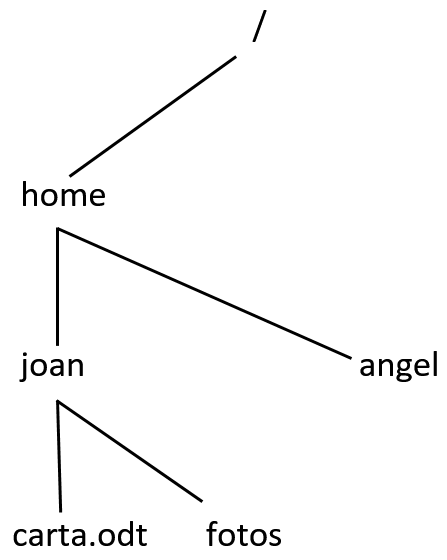
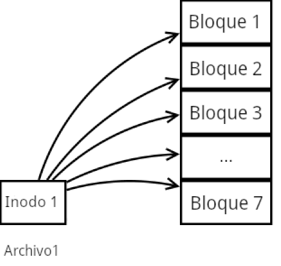
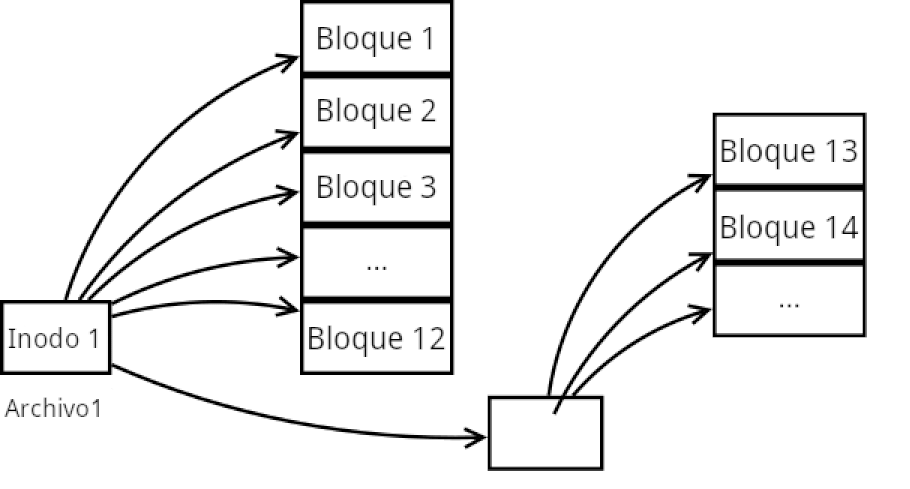
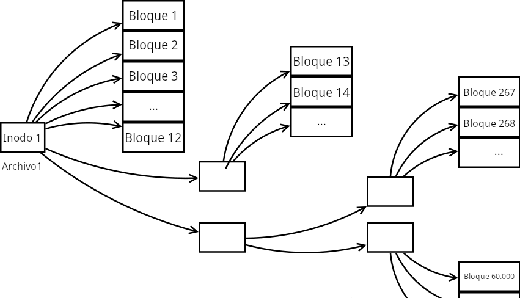
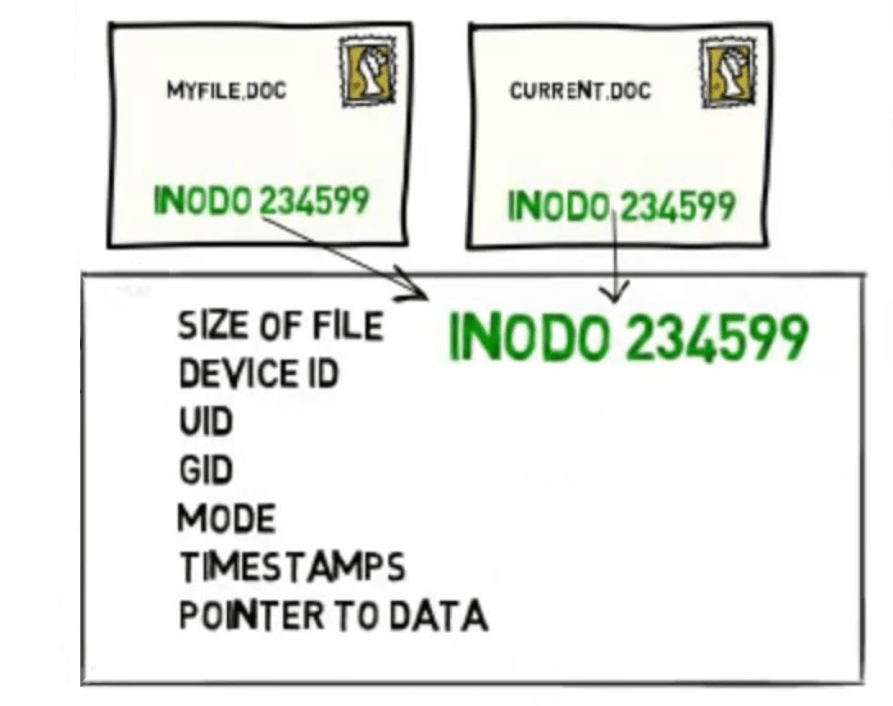

Bastantes usuarios de GNU/Linux, servidores web y/o servidores de email han escuchado a hablar de los inodos y no saben lo que son. Por este motivo, a continuación que veremos que son y como funcionan los sistemas de archivos basados en inodos.<!--more-->

## ¿QUÉ SON LOS INODOS?

Un inodo es una estructura de datos que almacena información sobre un fichero de nuestro sistema de archivos.

Un inodo no tiene nombre y se identifica mediante un número entero único. Cada inodo únicamente puede contener datos de un solo fichero del sistema de archivos. Por lo tanto, si tenemos 4 archivos y 4 directorios estaremos usando 8 inodos.

Algunos de los sistemas de archivos que trabajan con inodos son:

1. ext2/3/4.
2. UFS.
3. ReiserFS.
4. FFS.
5. XFS.
6. Btrfs.
7. etc.

Windows y MacOS no trabajan con inodos porque sus sistemas de archivos son Ntfs y HFS+. Solo trabajan con inodos sistemas operativos como por ejemplo UNIX, FreeBSD, GNU-Linux y otros sistemas operativos basados en Unix.

### ¿Qué tipo de información almacenan los inodos de los archivos y directorios?

Un inodo contiene la totalidad de metadatos de un fichero de nuestro sistema de archivos.

Los metadatos almacenados en un inodo son los siguientes:

1. **Número de inodo**. El número de inodo es un número entero único que sirve para identificar un inodo.
2. **Tamaño del fichero** así como el número de bloques que ocupa el fichero en el disco duro.
3. El **dispositivo de almacenamiento** en que está almacenado el fichero. (Device ID)
4. **Número de enlaces**. Por lo tanto si hay 2 archivos que apuntan a un mismo inodo tendremos 2 enlaces. Si tenemos un directorio que contiene 15 archivos tendremos 15 enlaces.
5. El identificador de usuario (**UID** o User ID). Por lo tanto, los inodos especifican el propietario de un fichero.
6. El identificador de grupo (**GID** o Group ID). De este modo, un inodo contiene el grupo a que pertenece un fichero.
7. **Marcas de tiempo** como por ejemplo la fecha en que se ha creado el archivo, la fecha del último acceso, etc.
8. **Tabla de direccionamiento** donde se detallan los bloques del disco duro en que está almacenado el fichero.

Mediante el comando stat podemos consultar la información que un inodo guarda sobre un fichero. Si ejecutamos el comando stat seguido del nombre de un archivo, directorio o enlace obtendremos el siguiente resultado:

| joan@debian:~$ stat archivo\_1 Fichero: archivo\_1 Tamaño: 7872     Bloques: 16     Bloque E/S: 4096        fichero regular Dispositivo: 805h/2053d      Nodo-i: 1326361      Enlaces: 1 Acceso: (0644/-rw-r--r--)     Uid: ( 1000/ joan)     Gid: ( 1000/ joan) Acceso: 2018-02-04 21:04:11.902405984 +0100 Modificación: 2016-12-25 11:24:27.051411224 +0100 Cambio: 2016-12-25 11:25:06.898576813 +0100 Creación: - |
| :-- |

Como pueden ver, la salida del comando contiene la información que almacena el inodo 1326361 sobre el archivo archivo\_1.

La principal función de la información almacenada en el inodo es que podamos acceder a la información almacenada en nuestro disco duro.

### ¿Qué tipo de información almacenan las dentries?

Las dentries tienen la función de definir la estructura de un directorio. Las dentries, conjuntamente con los inodos, serán los encargados de representar un fichero en la memoria.

Las dentries de un directorio se almacenan en una tabla. Esta tabla contiene la totalidad de nombres de los ficheros que están dentro del directorio y los asocia con su correspondiente número de inodo. Por lo tanto, una dentry es un nombre que apunta hacia un inodo.

Imaginemos que el directorio Documentos contiene 2 archivos y un directorio. El inodo que representa al directorio Documentos será el siguiente:

| **Ficheros dentro del directorio Documentes** | **Inodo** |
| :-- | :-- |
| . | 10000 |
| .. | 5000 |
| Carta.odt | 10043 |
| CV.odt | 10025 |
| Directorio 1 | 13412 |

El contenido de la tabla es simple de comprender. Únicamente es necesario comentar las entradas que tienen un punto y dos puntos.

La entrada con un punto (.) hace referencia al directorio Documentos. Por lo tanto la información del directorio Documentos está almacenada en el inodo 10000.

La entrada con 2 puntos (..) hace referencia al inodo del directorio que contiene el directorio Documentos. Por lo tanto si la carpeta Documentos está dentro de /home/user, el inodo 5000 hace referencia al directorio user.

Para comprender mejor todo lo que hemos comentado hasta el momento imaginemos la siguiente estructura:

[](images/inodos-y-dentries.png)

Las características de esta estructura son las siguientes:

1. Usa 6 inodos. El primer inodo para el directorio raíz, el segundo para el directorio home, el tercero para el directorio joan, el cuarto para el directorio angel, el quinto para el fichero carta.odt y el sexto para el directorio fotos.
2. Usa 5 dentries. La primera enlaza carta.odt con joan, la segunda enlaza fotos con joan, la tercera enlaza joan con home, la cuarta enlaza angel con home y finalmente la última enlaza home con el directorio raíz.

## ¿QUÉ ESPACIO OCUPA UN INODO?

Si quieren consultar el espacio que ocupa un inodo de su sistema de archivos tan solo tienen que realizar lo siguiente.

Inicialmente ejecutan el siguiente comando para ver las particiones del sistema de archivos:

> ```
> sudo fdisk -l
> ```

En mi caso el resultado obtenido es el siguiente:

| Disco /dev/sda: 298,1 GiB, 320072933376 bytes, 625142448 sectores Unidades: sectores de 1 \* 512 = 512 bytes Tamaño de sector (lógico/físico): 512 bytes / 512 bytes Tamaño de E/S (mínimo/óptimo): 512 bytes / 512 bytes Tipo de etiqueta de disco: dos Identificador del disco: 0x29f429f3Disposit.     Inicio    Comienzo    Final              Sectores         Tamaño  Id   Tipo /dev/sda1   \*            63                  122698574   122698512     58,5G      7      HPFS/NTFS/exFAT /dev/sda2                122699776   123619327    919552           449M      27    NTFS de WinRE oculta /dev/sda3                123620175   182916089    59295915      28,3G      83   Linux /dev/sda4                182916151    625137344    442221194    210,9G    f       W95 Ext'd (LBA) /dev/sda5                182916153    235063079   52146927      24,9G      83   Linux /dev/sda6                235063143   237296114    2232972        1,1G         82    Linux swap / Solaris /dev/sda7                237297664   237631487    333824          163M      83    Linux /dev/sda8                237633543   625137344    387503802  184,8G    7      HPFS/NTFS/exFAT |
| :-- |

De las 8 particiones miraré el tamaño de los inodos en las particiones /dev/sda5 y /dev/sda7. Para ello ejecutaré los siguientes comandos:

| joan@debian:~$ sudo tune2fs -l /dev/sda5 \| grep Inode Inode count:                     1630208 Inodes per group:             8192 Inode blocks per group:   512 Inode size:                        256 |
| :-- |

| joan@debian:~$ sudo tune2fs -l /dev/sda7 \| grep Inode Inode count:                      41832 Inodes per group:             1992 Inode blocks per group:    249 Inode size:                        128 |
| :-- |

Como pueden ver, los inodos de la partición (/dev/sda5) tienen un tamaño de 256 bytes. Esto es así porque los sistemas de archivos ext4 acostumbran a tener este tamaño predeterminado.

Por otro lado los inodos de la partición (/dev/sda7) tienen un tamaño de 128 bytes. También se trata de un tamaño habitual en sistemas de archivos ext2.

Por lo tanto si los inodos de mi partición /home tienen 256 bytes y los bloques de mi disco duro son de 4096 bytes, cada bloque de mi disco duro podrá almacenar 16 inodos.

### Modificar el número y el tamaño de los inodos en sistemas de archivos ext4

Los inodos se crean en el momento que se genera el sistema de archivos. Una vez generado el sistema de archivos no será posible añadir y/o redimensionar los inodos.

###### Nota: Existen sistemas de archivos como JFS, Btrfs o XFS que si permiten incrementar el número de inodos de un sistema de archivos.

###### Nota: En particiones LVM y en particiones tradicionales podemos incrementar el número de inodos añadiendo más espacio a una partición.

Si queremos controlar el número y el tamaño de los inodos lo podemos hacer en el momento de formatear nuestras particiones. Para ello deberán usar un comando del siguiente tipo:

> ```
> sudo mkfs.ext4 -N 2.000.000 -I 256 /dev/sdaX
> ```

Si ejecutamos este comando se formateará la partición sdaX. En el momento de formatearse se creará un sistema de archivos ext4 que contendrá 2.000.000 de inodos. Cada uno de estos inodos ocupará un tamaño de **256** bytes.

Tenemos que tener cuidado con los siguientes aspectos:

1. El tamaño de los inodos tiene que ser una potencia de 2 igual o mayor que 128 bytes. Los tamaños de inodo recomendados son 128 o 256 bytes.
2. El número de inodos ideal será en función del tamaño de la partición y de las necesidades de cada usuario.
3. Si eligen un tamaño de inodo muy grande y/o una gran cantidad de inodos, se reducirá la capacidad de almacenamiento del disco duro.
4. Existen parámetros adicionales para controlar el número de inodos generados como por ejemplo \-i bytes-per-inode, \-T usage-type\[,…\], etc.

No es recomendable que los usuarios con pocos conocimientos jueguen con estos valores. Un usuario con pocos conocimientos es mejor que use el siguiente comando para formatear un partición:

> ```
> sudo mkfs.ext4 /dev/sdaX
> ```

### ¿En qué posición se ubican los inodos en el disco duro?

La ubicación de los inodos dentro del disco duro depende del sistema de archivos que usemos. Así por ejemplo:

1. Existen sistemas de archivos que posicionan la totalidad de los inodos al inicio del disco duro.
2. Existen otros sistemas de archivos, como por ejemplo ext4, que dividen el disco duro en 4 zonas. En el inicio de cada una de las zonas se ubican las tablas de inodos. Los inodos de cada zona redireccionan a bloques del disco duro lo más cercanos la ubicación del inodo. De esta forma se minimiza el desplazamiento del cabezal en los discos duros tradicionales.

## FUNCIONAMIENTO DE LAS TABLAS DE DIRECCIONAMIENTO DE LOS INODOS EN EXT4

La función de la tabla de direccionamiento de un inodo es indicar las posición del disco duro en que está almacenado un fichero.

Los inodos tienen un tamaño fijo. Por lo tanto, el tamaño de un inodo es finito y en muchas ocasiones no es suficiente para almacenar la totalidad de datos que necesitamos para acceder a un archivo. Frente a esta situación se usan tablas de direccionamiento indirecto simples, dobles y triples.

### Tablas de direccionamiento directo en sistemas de archivo ext4

Un inodo tiene una tabla de direccionamiento de 15 entradas. 12 de las 15 entradas permiten un direccionamiento directo a un bloque de datos del disco duro.

Si un archivo se almacena en 7 bloques, un inodo nos puede direccionar de forma directa al contenido del archivo.

A modo de ejemplo, el archivo archivo1 está vinculado al inodo 1. Si consultamos el inodo 1 vemos que el contenido del archivo1 está almacenado en los bloques 1, 2, 3, 4, 5, 6 y 7. Por lo tanto, mediante un direccionamiento directo podemos acceder al contenido del archivo.

[](images/inodos-direccionamiento-directo.png)

### Tablas de direccionamiento indirectas simples

Si finalizamos el espacio que tenemos para las 12 entradas directas tendremos que usar un direccionamiento indirecto.

La treceava posición de la tabla de direccionamiento del inodo nos dirigirá a un bloque de datos que contendrá una nueva tabla de direcciones hacia los bloques que almacenan el contenido de nuestro archivo.

[](images/inodos-direccionamiento-indirecto-simple.png)

### Tablas de direccionamiento indirectas dobles y triples

Del mismo modo que se hacen direccionamientos indirectos simples, también podemos hacer direccionamientos indirectos dobles y triples con las entradas 14 y 15. A continuación se muestra la estructura de un direccionamiento indirecto doble.

[](images/inodos-direccionamiento-indirecto-doble.png)

De este modo podemos llegar a conseguir archivos con un tamaño de hasta 16TB en sistemas de ficheros ext4.

Frente a este funcionamiento podemos llegar a las siguientes conclusiones:

1. El acceso a los archivos será más lento cuando se hace un direccionamiento indirecto.
2. Podremos acceder de forma mucho más rápida y eficiente en archivos de poco tamaño. Por este motivo los sistemas de archivos basados en inodos son ideales para manejar servidores web o servidores de email.

## ENLACES DUROS GRACIAS A LOS INODOS

En Linux los ficheros no se referencian por su nombre. Se referencian por su número de inodo. Gracias a esto en Linux podemos usar [enlaces duros]().

A continuación vemos un ejemplo de 2 archivos que apuntan al mismo nodo.

[](images/enlaces-duros-linux.png)

Por lo tanto, ambos ficheros tienen exactamente el mismo contenido. Podemos borrar tranquilamente uno de los ficheros porque el otro será exactamente igual que el borrado.

## ¿POR QUÉ ALGUNOS SERVIDORES NO LIMITAN EL ESPACIO PERO SI EL NÚMERO DE INODOS USADO?

En sistemas de archivos en que existe gran cantidad de archivos pequeños puede darse el siguiente caso:

- Existen bloques libres, pero no tenemos inodos disponibles. En caso que se de la situación, no podremos copiar o generar contenido nuevo en el disco duro. La única funcionalidad de los bloques libres será que puedan crecer los archivos y ficheros presentes en el sistema de archivos.

La situación que acabo de comentar es común en servidores de correo y en servidores web. Por este motivo, cuando contratamos este tipo de servicios suelen mostrarnos tanto el espacio libre como el número de inodos disponibles.

## CONSULTAR INFORMACIÓN SOBRE LOS INODOS

A continuación verán una serie de comandos que les pueden resultar útiles para averiguar información sobre los inodos de su sistema de archivos.

### Ver los inodos libres y ocupados del sistema de ficheros

Para ver los inodos libres y ocupados de las particiones del sistema de archivos tenemos que ejecutar el siguiente comando:

| joan@debian:~$ df -i S.ficheros    Nodos-i     NUsados   NLibres     NUso%    Montado en udev           404955       531           404424      1%           /dev tmpfs          408507       870           407637      1%           /run /dev/sda3   1855952     571568     1284384    31%         / tmpfs          408507       63             408444      1%           /dev/shm tmpfs          408507       4               408503      1%           /run/lock tmpfs          408507       16             408491      1%           /sys/fs/cgroup /dev/sda5   1630208     143964     1486244     9%          /home /dev/sda7   41832         371           41461         1%          /boot /dev/sda8   70674942   7362         70667580   1%          /media/DATOS tmpfs          408507       33             408474       1%          /run/user/1000 |
| :-- |

Si observamos los resultados veremos que en mi caso no estoy ocupando una gran cantidad de inodos.

### Ver el número de inodo de cualquier fichero que tengamos almacenado

Para ver el número de inodo de todos y cada uno de los elementos contenidos en un directorio tenemos que ejecutar el siguiente comando:

| joan@debian:~$ ls -i 1326361   archivo\_1 1310734   Imágenes 1041        'Ninja IDE' 1332060   ps\_mem.py 1325239   archivo\_2 400342     jd2 1321034   nohup.out 1310731   Público 1326293   Audiobooks 322476     jdownloader …… |
| :-- |

###### Nota: La parte en color rojo corresponde al número de inodo de un archivo o un directorio.

### Averiguar el inodo que usa un archivo o carpeta

Para conocer el inodo que usa un archivo, una carpeta o un enlace, tan solo tenemos que teclear el comando ls -i seguido del nombre del archivo, carpeta o enlace.

Por lo tanto, para averiguar el inodo del archivo\_1 ejecutaremos el siguiente comando en la terminal:

joan@debian:~$ ls -i archivo\_1 1326361 archivo\_1

### Buscar el nombre de un archivo por su número de inodo

Con el comando find podemos buscar un archivo por si número de inodo. Si queremos buscar el archivo que corresponde al inodo 523580 ejecutaremos el siguiente comando:

joan@debian:~$ sudo find / -inum 523580 /var/cache/apt/pkgcache.bin

En este caso podemos ver que el inodo 523580 corresponde al archivo pkgcache.bin.
