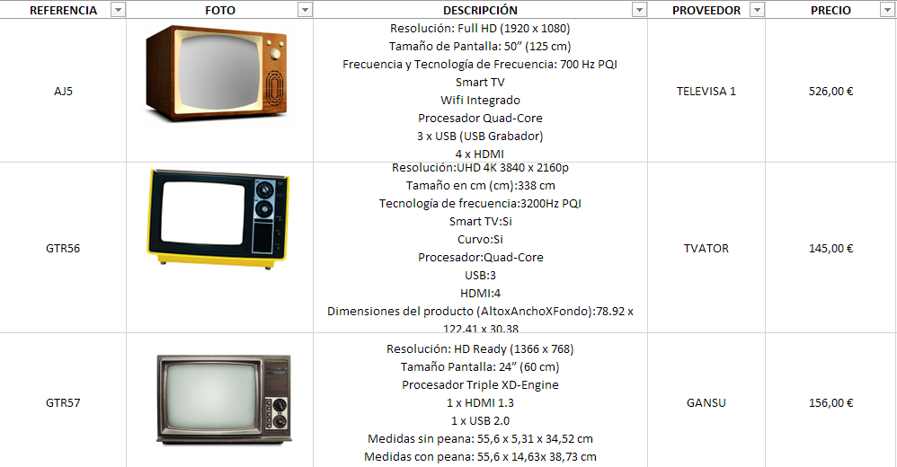
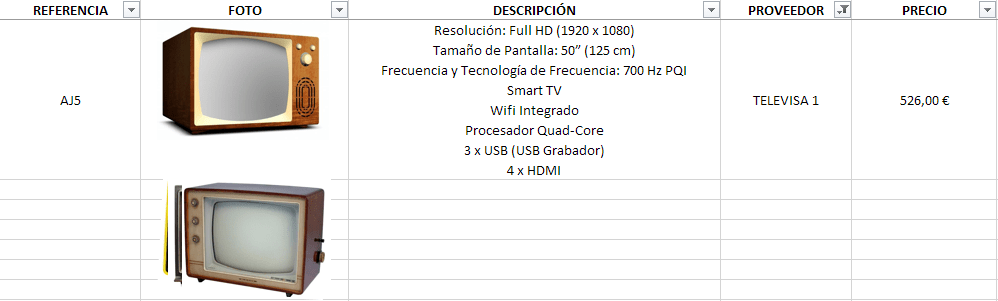
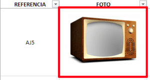
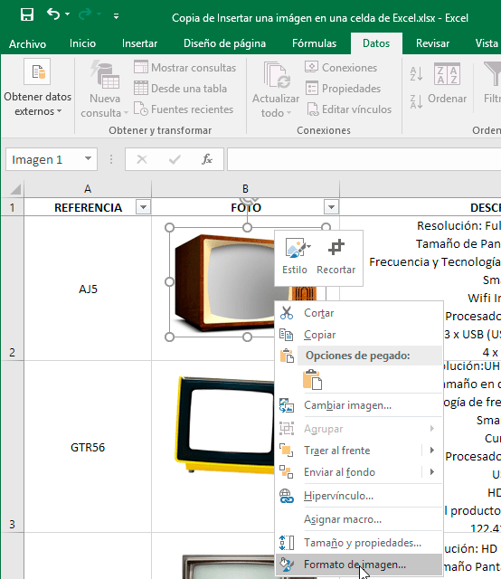
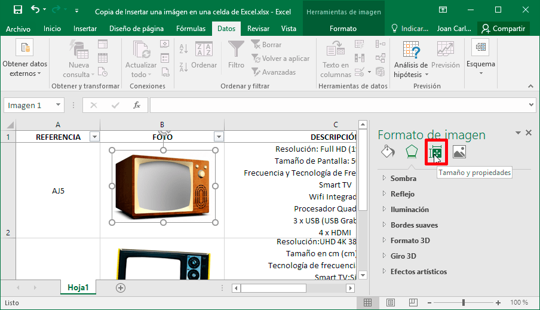
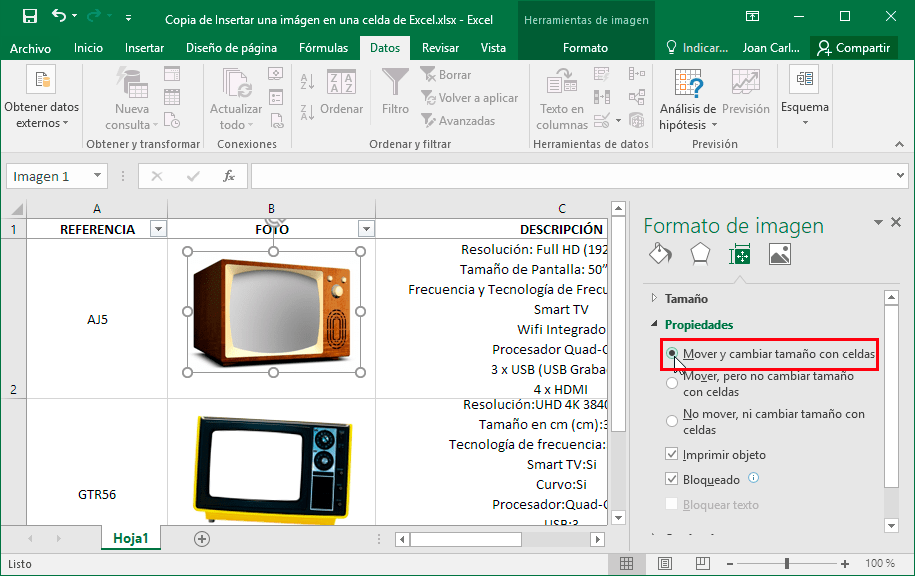
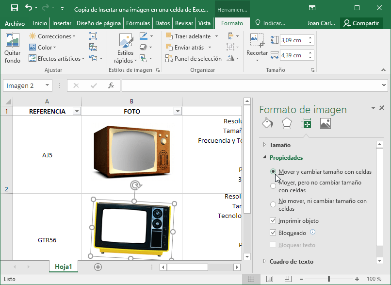
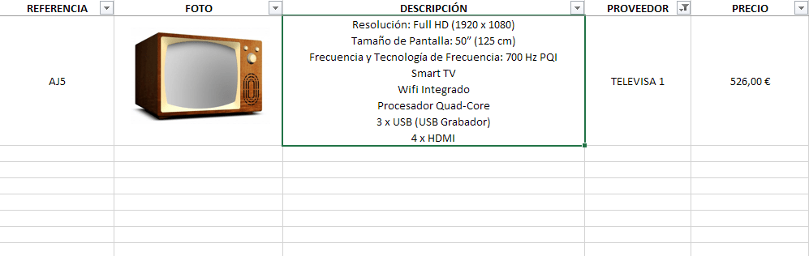

Al insertar una imagen en Microsoft Excel queda flotando encima de la hoja de cálculo. La imagen insertada se pega en una capa aparte que no guarda ningún tipo de relación con ninguna celda. Por este motivo en el siguiente artículo veremos como insertar una imagen en una celda de Excel.<!--more-->

## UTILIDADES DE INSERTAR UNA IMAGEN EN UNA CELDA

Insertar una imagen en una celda de Excel puede es útil cuando tenemos una hoja de calculo parecida la siguiente:

Como podemos ver se trata de una hoja extensa con múltiples filas y columnas que contienen imágenes. En el momento que intentemos realizar las siguientes operaciones:

1. Ordenador alfabéticamente el contenido de la tabla.
2. Ocultar varias filas y/o columnas.
3. Filtrar las celdas.
4. Etc.

Pasará lo que podéis ver en la siguiente captura de pantalla:

 Como pueden ver, al aplicar un filtro todas las imágenes han quedado desperdigadas y no se han filtrado con el resto de celdas. Para evitar este problema, la solución más fácil insertar una imagen en una celda. Para ello tienen que seguir las siguientes instrucciones.

## ¿CÓMO INSERTAR UNA IMAGEN EN UNA CELDA DE EXCEL?

Primero aseguramos que todas las imágenes están bien delimitadas dentro de los bordes de las celdas de la hoja de cálculo.

A continuación, seleccionamos la imagen dentro de la celda, presionamos el botón derecho del ratón y cuando aparezca el menú contextual clicamos en la opción Formato de imagen.

Cuando se abra la pestaña de formato de imagen clicamos encima del icono Tamaño y propiedades.

Finalmente, en propiedades clicamos sobre la opción Mover y cambiar tamaño con celdas.

El proceso para insertar el resto de imágenes en una celda es mucho más fácil. Tan solo tenemos que seleccionar la siguiente imagen y acto seguido irnos al panel lateral de formato de imagen para volver a tildar la opción Mover y cambiar tamaño con celdas.

Si lo preferimos podemos crear una macro para poder insertar una imagen dentro de una celda. De esta forma podremos insertar las imágenes de forma mucho más sencilla y rápida.

Una vez tengamos todas las imágenes insertadas en sus respectivas celdas ya podemos repetir el filtro que aplicamos en el apartado anterior y veremos que ahora el resultado es perfecto.

Por lo tanto, pueden ver que insertar una imagen dentro de una celda de Excel es fácil y además es extremadamente útil. Es una lástima que otras suites ofimáticas como por ejemplo Libreoffice no dispongan de esta característica.
