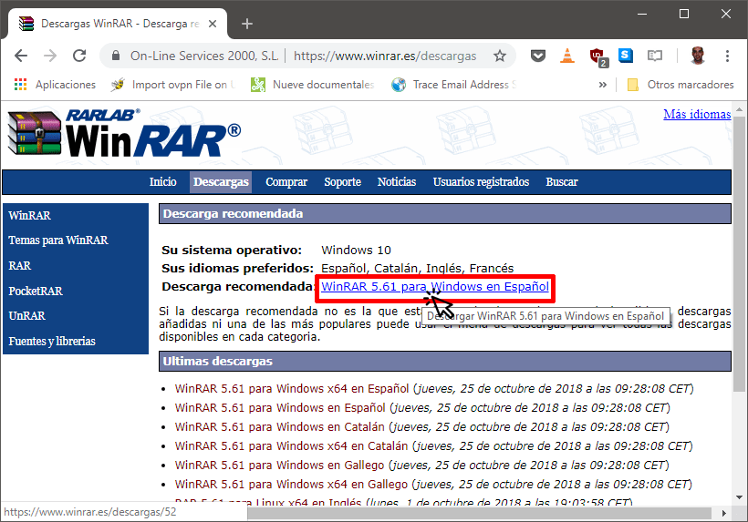
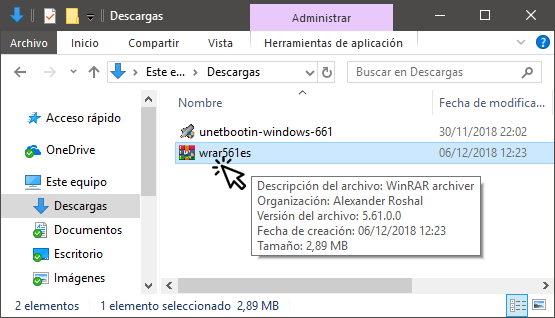
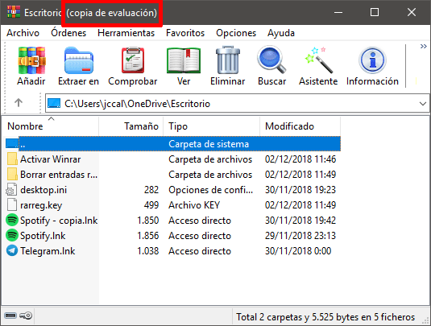
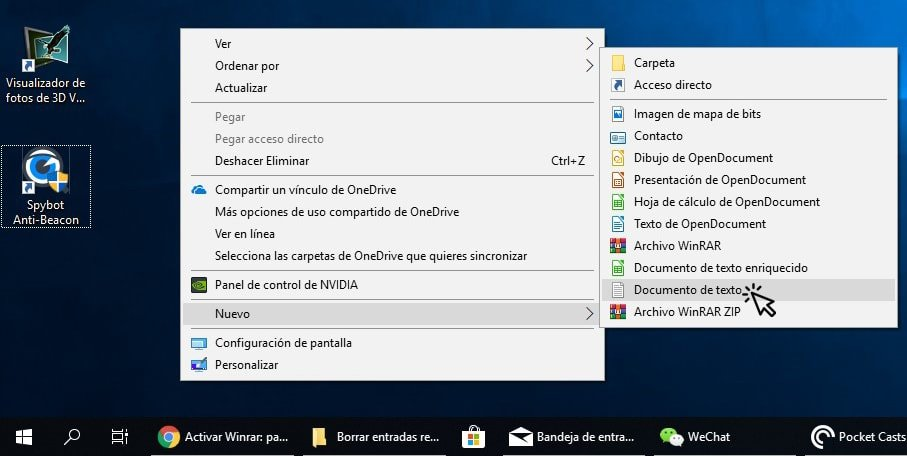
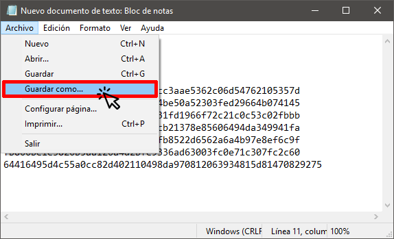
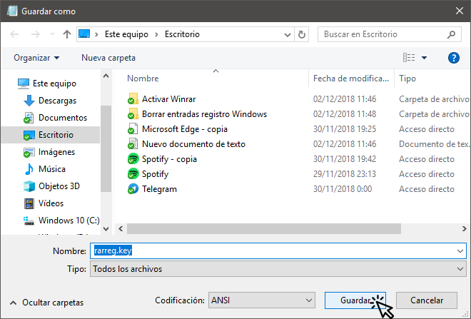
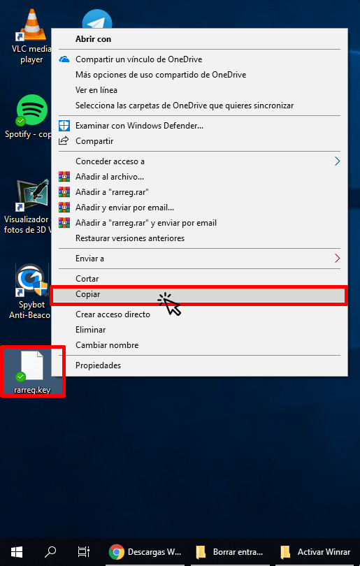
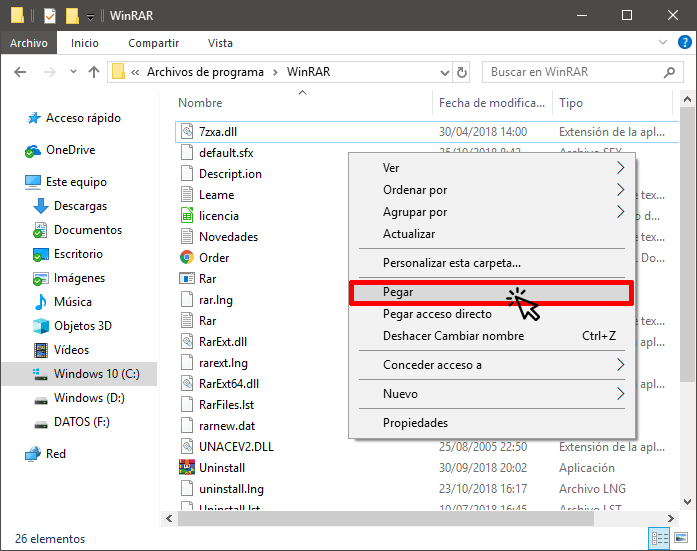
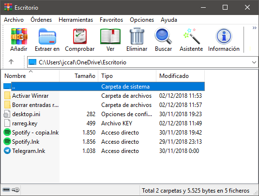

A continuación verán como pueden instalar y activar Winrar de forma segura y sencilla. No obstante recuerden que existen otras opciones igual de buenas como por ejemplo Winzip o 7-Zip.<!--more-->

## INSTALAR WINRAR EN WINDOWS

Recomiendo descargar WinRar de un sitio seguro. Por lo tanto accedan a la web oficial de WinRar clicando en el siguiente enlace:

[https://www.winrar.es/descargas](https://www.winrar.es/descargas)

A continuación cliquen sobre el enlace descarga que pueden ver en la siguiente captura de pantalla:

Una vez descargado el archivo de instalación .exe hagan doble clic sobre él para iniciar la instalación.

El proceso de instalación es sumamente fácil. Una vez se inicie el proceso de instalación tan solo tendremos que presionar sobre el botón Instalar.

## ACTIVAR WINRAR DE DE FORMA PERMANENTE

Una vez instalado el programa verán que se trata de una copia de evaluación. Por lo tanto, cuando hayan transcurrido 40 días, cada vez que abramos WinRar nos aparecerá una molesta ventana informando que tenemos que Comprar una licencia de WinRar o desinstalarlo de nuestro ordenador.

Para activar WinRar y evitar estos molestos mensajes crearemos un archivo de texto del siguiente modo:

Una vez abierto el archivo de texto pegaremos el siguiente código:

| RAR registration data Federal Agency for Education 1000000 PC usage license UID=b621cca9a84bc5deffbf 6412612250ffbf533df6db2dfe8ccc3aae5362c06d54762105357d 5e3b1489e751c76bf6e0640001014be50a52303fed29664b074145 7e567d04159ad8defc3fb6edf32831fd1966f72c21c0c53c02fbbb 2f91cfca671d9c482b11b8ac3281cb21378e85606494da349941fa e9ee328f12dc73e90b6356b921fbfb8522d6562a6a4b97e8ef6c9f fb866be1e3826b5aa126a4d2bfe9336ad63003fc0e71c307fc2c60 64416495d4c55a0cc82d402110498da970812063934815d81470829275 |
| :-- |

A continuación accedemos al menú Archivo y clicamos sobre la opción Guardar como...

Seguidamente, en el campo **Nombre** escribimos rarreg.key. En el campo **Tipo** seleccionamos Todos los archivos y finalmente presionamos sobre el botón Guardar.

Una vez guardado el archivo lo cerramos y lo copiamos del siguiente modo:

Acto seguido iremos a la carpeta donde se instalamos WinRar. En mi caso la ruta es C:\\Program Files\\WinRAR. Una vez dentro de la carpeta pegaremos el archivo rarreg.key.

La próxima vez que arranquemos WinRar ya no aparecerá el mensaje de copia de evaluación.

De esta forma tan sencilla podremos instalar y activar WinRar de forma completamente segura.
