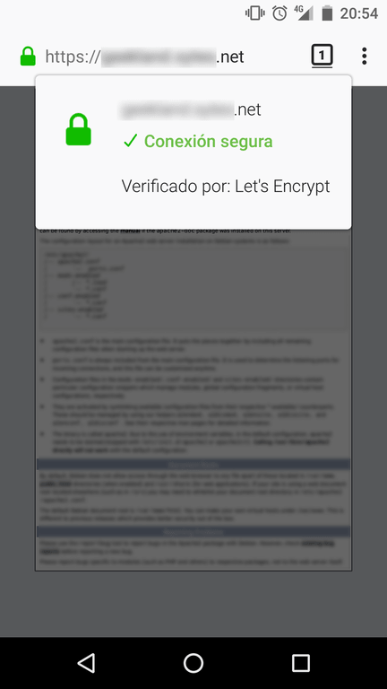
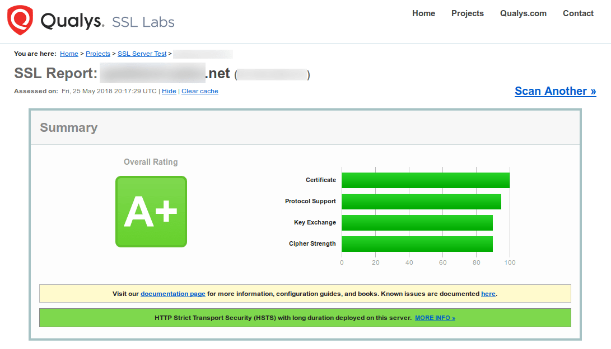

En el pasado vimos la [importancia de disponer de un certificado SLL]() para la totalidad de páginas y servicios que corren sobre un servidor web. Por este motivo veremos las instrucciones a seguir para instalar un certificado SSL gratis de Let's Encrypt en un servidor lighttpd que corre en una Raspberry Pi. Los pasos a seguir para instalar un certificado SSL de Let's Encrypt son los siguientes:<!--more-->

## INSTALAR CERTBOT EN RASPBIAN

Lo primero que tenemos que realizar es instalar Certbot. Certbot es una herramienta diseñada para emitir y gestionar certificados SSL de Let's Encrypt. Certbot nos ofrecerá las siguientes funcionalidades:

1. Generar y renovar certificados SSL de forma extremadamente fácil y sencilla. Además estos certificados serán creados por una entidad certificadora de confianza. Por lo tanto cualquier navegador los aceptará sin problema y no mostrará ningún tipo de advertencia.
2. Revocar los certificados SSL que hemos creado en el caso que sea necesario.

Para instalar Certbot instalaremos los paquetes que nos permitirán añadir las claves públicas de los repositorios que contienen Certbot. Para ello ejecutamos el siguiente comando en la terminal:

> ```
> sudo apt-get install debian-keyring raspbian-archive-keyring
> ```

Acto seguido añadiremos el repositorio Backports. El repositorio Backports es el que contiene los paquetes de instalación de certbot.

**Para añadir el repositorio Backports en Raspbian Jessie** hay que ejecutar el siguiente comando en la terminal:

> ```
> sudo sed -i "$ a\deb http://ftp.debian.org/debian jessie-backports main" /etc/apt/sources.list
> ```

**Para añadir el repositorio Backports en Raspbian Stretch** hay que ejecutar el siguiente comando en la terminal:

> ```
> sudo sed -i "$ a\deb http://ftp.debian.org/debian stretch-backports main" /etc/apt/sources.list
> ```

Una vez añadido el repositorio actualizamos nuestra lista de repositorios ejecutando el siguiente comando en la terminal:

> ```
> sudo apt-get update
> ```

Finalmente instalaremos certbot. Para ello **si usamos Raspbian Jessie** ejecutaremos el siguiente comando en la terminal:

> ```
> sudo apt-get install certbot -t jessie-backports -y --force-yes
> ```

**En el caso que sean usuarios de Raspbian Stretch** deberán ejecutar el siguiente comando en la terminal:

> ```
> sudo apt-get install certbot -t stretch-backports -y --force-yes
> ```

De esta forma tan sencilla instalaremos certbot sin ningún tipo de problema.

## INSTALAR EL SERVIDOR WEB LIGHTTPD

Existen varios servidores web, pero en mi caso uso lighttpd porque consume menos recursos que por ejemplo Apache o Nginx.

Para instalar el servidor web lighttpd tan solo tenemos que ejecutar el siguiente comando en la terminal:

> ```
> sudo apt-get install lighttpd
> ```

Una vez instalado el servidor web tendrán que configurarlo para que sea accesible desde el exterior. Cuando el servidor web sea accesible desde el exterior de nuestra red local podrán empezar con la instalación del certificado.

## GENERAR EL CERTIFICADO DE LET’S ENCRYPT

Para instalar un certificado SSL gratis de Let's Encrypt tan solo tenemos que ejecutar el siguiente comando:

> ```
> sudo certbot certonly --webroot -w /var/www/html/ -d dominio.net
> ```

El significado de cada uno de los términos del comando es el siguiente:

- **sudo certbot** : Para poder usar la herramienta certbot como usuario root.
- **certonly** : Parte del comando que da la orden de obtener o renovar el certificado SSL de Let's Encrypt.
- **\--webroot -w /var/www/html/** : Indicamos que la dirección raíz de nuestro servidor web es /var/www/html/. En vuestro caso deberéis reemplazar la parte verde del comando por la ruta de vuestro directorio raíz. La ruta raíz de vuestro servidor web la encontraréis en el fichero /etc/lighttpd/lighttpd.conf.
- **\-d dominio.net** : Introducimos el nombre del dominio para el cual queremos crear el certificado SSL de Let's Encrypt. En vuestro caso deberéis reemplazar dominio.net por el nombre de vuestro dominio.

Una vez ejecutado el comando empezará el proceso de creación del certificado SSL de Let's Encrypt. Durante el proceso de creación del certificado SSL se harán las siguientes peticiones/preguntas.

Inicialmente se nos pedirá introducir nuestra dirección de email:

|   Saving debut log to /var/log/letsencrypt/letsencrypt.log Enter email address (used for urgent renewal and security notices) (Enter 'c' to cancel):escribir\_dirección\_email\_válida   |
| --- |

Seguidamente se nos preguntará que aceptemos las condiciones de servicio de Let's Encrypt:

|   Starting new HTTPS connection (1): acme-v01.api.letsencrypt.org  \------------------------------------------------------------------------------- Please read the Terms of Service at https://letsencrypt.org/documents/LE-SA-v1.2-November-15-2017.pdf. You must agree in order to register with the ACME server at https://acme-v01.api.letsencrypt.org/directory \------------------------------------------------------------------------------- (A)gree/(C)ancel: A |
| --- |

Finalmente se crearan las claves y certificados de Let's Encrypt. Durante el proceso de creación se nos informará de la ruta en que se generan las claves y certificados:

|   Obtaining a new certificate Performing the following challenges: http-01 challenge for dominio.net Using the webroot path /var/www/html for all unmatched domains. Waiting for verification... Cleaning up challenges Generating key (2048 bits): /etc/letsencrypt/keys/0000\_key-certbot.pem Creating CSR: /etc/letsencrypt/csr/0000\_csr-certbot.pem  IMPORTANT NOTES: \- Congratulations! Your certificate and chain have been saved at /etc/letsencrypt/live/dominio.net/fullchain.pem. Your cert will expire on 2018-08-10. To obtain a new or tweaked version of this certificate in the future, simply run certbot again. To non-interactively renew \*all\* of your certificates, run "certbot renew" \- If you like Certbot, please consider supporting our work by:  Donating to ISRG / Let's Encrypt: https://letsencrypt.org/donate Donating to EFF: [https://eff.org/donate-le](https://eff.org/donate-le) |
| --- |

## COMBINAR EL CERTIFICADO SSL CON LA CLAVE PRIVADA

Si leemos los mensajes generados en la creación de los certificados veremos que la totalidad de claves y certificados se almacenan en la ruta **/etc/letsencrypt/live/dominio.net**.

Concretamente el certificado SSL **cert.pem** se halla en la siguiente ruta: **/etc/letsencrypt/live/dominio.net/cert.pem**

La clave privada **priv.key** que se usará para cifrar el contenido estará en la siguiente ubicación: **/etc/letsencrypt/live/dominio.net/privkey.pem**

Para combinar el certificado con la clave privada ejecutaremos el siguiente comando en la terminal:

> ```
> sudo cat /etc/letsencrypt/live/dominio.net/cert.pem /etc/letsencrypt/live/dominio.net/privkey.pem > /etc/letsencrypt/live/dominio.net/web.pem
> ```

###### Nota: En vuestro caso debéis reemplazar las partes rojas del comando por vuestro dominio.

De este modo crearemos un fichero web.pem que contiene tanto el certificado como la clave privada de Let's Encrypt.

## CREAR UNA CLAVE PARA REFORZAR LA SEGURIDAD DEL INTERCAMBIO DE CLAVES

Seguidamente vamos a reforzar el algoritmo de intercambio de claves Diffie-Hellman. Para ello generaremos una clave de Diffie-Hellman de 2048 bits ejecutando el siguiente comando en la terminal:

> ```
> sudo openssl dhparam -out /etc/ssl/certs/dhparam.pem 2048
> ```

###### Nota: Si quieren pueden crear una clave de 4096 bits. No obstante si están usando un dispositivo poco potente, como una Raspberry Pi, recomiendo crear una clave de 2048 bits.

Después de esperar unos minutos se generará la clave. Está clave de cifrado la usaremos durante la primera fase de la comunicación en que el cliente y el servidor se comunicarán para establecer los algoritmos criptográficos que se van a usar.

## CONFIGURAR LIGHTTPD PARA QUE USE EL NUEVO CERTIFICADO DE LET'S ENCRYPT

A continuación configuraremos el servidor lighttpd para conseguir los siguientes propósitos:

1. Activar https en el servidor web lighttpd.
2. Forzar que la totalidad de peticiones se hagan a través de https.
3. Activar TTP Strict Transport Security (HSTS) para asegurar que la totalidad de peticiones de los clientes se hagan mediante el protocolo https.
4. Realizar el intercambio inicial de claves de forma segura.
5. Deshabilitar SSLv2, SSLv3 y la compresión SSL para mejorar la seguridad del servidor.
6. Asegurar que los algoritmos criptográficos usados sean fuertes y seguros.
7. Usar elliptic curve variants para mejorar el rendimiento de las peticiones https.

Para conseguir nuestros objetivos accedemos al fichero de configuración del servidor ejecutando el siguiente comando en la terminal:

> ```
> sudo nano /etc/lighttpd/lighttpd.conf
> ```

Cuando se abra el editor de textos pegan el siguiente contenido al final del fichero:

|   > ``` > # Activar y configurar https en el servidor > $SERVER["socket"] == ":443" { >   ssl.engine = "enable" >   ssl.pemfile = "/etc/letsencrypt/live/dominio.net/web.pem" >   ssl.ca-file = "/etc/letsencrypt/live/dominio.net/chain.pem" >   server.name = "dominio.net" # Domain Name OR Virtual Host Name >   ssl.use-sslv2 = "disable" >   ssl.use-sslv3 = "disable" >   ssl.use-compression = "disable" >   ssl.cipher-list = "EECDH+AESGCM:EDH+AESGCM:ECDHE-RSA-AES128-GCM-SHA256:AES256+EECDH:AES256+EDH:ECDHE-RSA-AES256-GCM-SHA384:DHE-RSA-AES256-GCM-SHA384:DHE-RSA-AES128-GCM-SHA256:ECDHE-RSA-AES256-SHA384:ECDHE-RSA-AES128-SHA256:ECDHE-RSA-AES256-SHA:ECDHE-RSA-AES128-SHA:DHE-RSA-AES256-SHA256:DHE-RSA-AES128-SHA256:DHE-RSA-AES256-SHA:DHE-RSA-AES128-SHA:ECDHE-RSA-DES-CBC3-SHA:EDH-RSA-DES-CBC3-SHA:AES256-GCM-SHA384:AES128-GCM-SHA256:AES256-SHA256:AES128-SHA256:AES256-SHA:AES128-SHA:DES-CBC3-SHA:HIGH:!aNULL:!eNULL:!EXPORT:!DES:!MD5:!PSK:!RC4" >   ssl.dh-file = "/etc/ssl/certs/dhparam.pem"  >   ssl.ec-curve = "secp384r1" > }   >  > # forzar peticiones https > $HTTP["scheme"] == "http" { >     # capture vhost name with regex conditiona -> %0 in redirect pattern >     # must be the most inner block to the redirect rule >     $HTTP["host"] =~ ".*" { >         url.redirect = (".*" => "https://%0$0") >     } > } >  > Forzar HTTP Strict Transport Security > setenv.add-response-header = ( "Strict-Transport-Security" => "max-age=15768000; includeSubdomains" ) > ```   |
| --- |

###### Nota: En vuestro caso tendréis que reemplazar dominio.net por el nombre de vuestro dominio. Aseguren que la rutas del certificado ssl (ssl.pemfile) y la autoridad de certificación (ssl.ca-file) sean las correctas.

Acto seguido comprueben que el modulo setenv esté activado. Para ello deberán comprobar que el fichero que estamos editando contenga el siguiente código:

|   > ``` > server.modules = ( > "mod_expire", > "mod_access", > "mod_accesslog", > "mod_auth", > "mod_compress", > "mod_redirect", > "mod_setenv", > "mod_rewrite" > ) > ```   |
| --- |

Una vez realizados las modificaciones guardan los cambios y cierran el fichero. Finalmente, para que se hagan los cambios efectivos reiniciaremos el servidor web ejecutando el siguiente comando en la terminal:

> ```
> sudo service lighttpd restart
> ```

En estos momentos nuestro certificado SSL de Let's Encrypt debería estar debidamente instalado.

## COMPROBAR QUE EL CERTIFICADO SSL FUNCIONA CORRECTAMENTE

Para comprobar que todo funciona a la perfección tenemos que acceder al servicio que corre en nuestro servidor web. Si todo funciona a la perfección observarán que el navegador muestra un candado de color verde.

[](images/comprobar-funcionamiento-certificado-ssl.png)

Adicionalmente comprobaremos que el certificado se ha instalado y configurado correctamente. Para ello podemos usar el [servicio online de ssllabs](https://www.ssllabs.com/ssltest/ "Servicio para comprobar si el certificado SSL está bien instalado"). Aplicando los consejos de este artículo, tal y como se puede ver en la captura de pantalla, deberíamos conseguir la máxima calificación.

[](images/comprobar-configuracion-certificado-SSL.png)

Por lo tanto nuestro certificado Let's Encrypt está bien instalado y configurado de forma segura.

## RENOVACIÓN DEL CERTIFICADO SSL DE LET'S ENCRYPT

El certificado SSL de Let's Encrypt que acabamos de crear/instalar tiene una validez de 90 días. Una vez pasados los 90 días tendremos que renovarlo.

La buena noticia es que la renovación se puede realizar de forma automática si seguimos las siguientes instrucciones.

Inicialmente simularemos el proceso de renovación del certificado ejecutando el siguiente comando en la terminal:

> ```
> sudo certbot renew --dry-run
> ```

En mi caso el resultado obtenido es el siguiente:

|   Saving debug log to /var/log/letsencrypt/letsencrypt.log  \------------------------------------------------------------------------------- Processing /etc/letsencrypt/renewal/dominio.net.conf \------------------------------------------------------------------------------- Cert not due for renewal, but simulating renewal for dry run Starting new HTTPS connection (1): acme-staging.api.letsencrypt.org Renewing an existing certificate Performing the following challenges: http-01 challenge for dominio.net Waiting for verification... Cleaning up challenges Generating key (2048 bits): /etc/letsencrypt/keys/0001\_key-certbot.pem Creating CSR: /etc/letsencrypt/csr/0001\_csr-certbot.pem \*\* DRY RUN: simulating 'certbot renew' close to cert expiry \*\* (The test certificates below have not been saved.)  Congratulations, all renewals succeeded. The following certs have been renewed: /etc/letsencrypt/live/dominio.net/fullchain.pem (success) \*\* DRY RUN: simulating 'certbot renew' close to cert expiry \*\* (The test certificates above have not been saved.)  IMPORTANT NOTES: \- Your account credentials have been saved in your Certbot configuration directory at /etc/letsencrypt. You should make a secure backup of this folder now. This configuration directory will also contain certificates and private keys obtained by Certbot so making regular backups of this folder is ideal. |
| --- |

Como en la simulación hemos obtenido un resultado satisfactorio podemos automatizar la renovación del certificado SSL del siguiente modo.

Crearemos el fichero que contendrá el script de renovación ejecutando el siguiente comando en la terminal:

> ```
> sudo nano /etc/cron.weekly/letsencrypt.sh
> ```

Cuando se abra el editor de textos nano pegamos el siguiente código:

> ```
> #!/bin/sh
> # Actualizar certificados de Let's Encrypt en lighttpd
> # Edit webroot-path with your www folder location
> sudo certbot renew --webroot -w /var/www/html/
> # Rebuild the cert
> # Edit folder location to your domainname
> cd /etc/letsencrypt/live/dominio.net/
> sudo bash -c "cat privkey.pem cert.pem > web.pem"
> # Reload lighttpd
> sudo service lighttpd reload
> ```

###### Nota: En vuestro caso tendréis que reemplazar dominio.net por el nombre de vuestro dominio. También tendréis que reemplazar /var/www/html/ por la ruta raíz de vuestro servidor web.

Una vez creado el script guardamos los cambios y cerramos el fichero. Seguidamente damos permisos de ejecución al script ejecutando el siguiente comando en la terminal:

> ```
> sudo chmod +x /etc/cron.weekly/letsencrypt.sh
> ```

Finalmente tan solo tenemos que programar cada cuando queremos que se ejecute el script de actualización del certificado de Let's Encrypt. Para ello ejecutamos el siguiente comando en la terminal:

> ```
> crontab -e
> ```

Cuando se abra el editor de textos pegan el siguiente comando al final del archivo:

> ```
> 20 21 * * * sudo /etc/cron.weekly/letsencrypt.sh
> ```

De este modo todos los días a las 21:20 se comprobará si el certificado de Let's Encrypt está caducado o no. Si el certificado SSL está caducado se renovará de forma automática.

## FUENTES

[https://raymii.org/s/tutorials/Strong\_SSL\_Security\_On\_lighttpd.html](https://raymii.org/s/tutorials/Strong_SSL_Security_On_lighttpd.html "Mejorar la seguridad de SSL en lighttpd")
