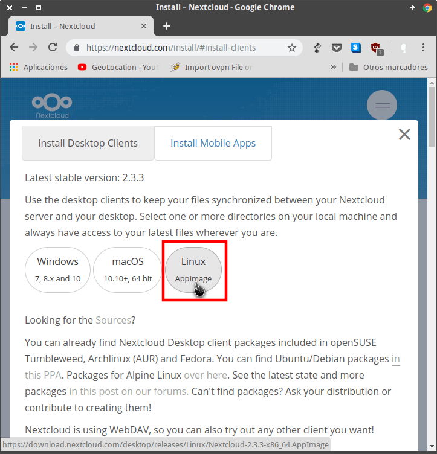
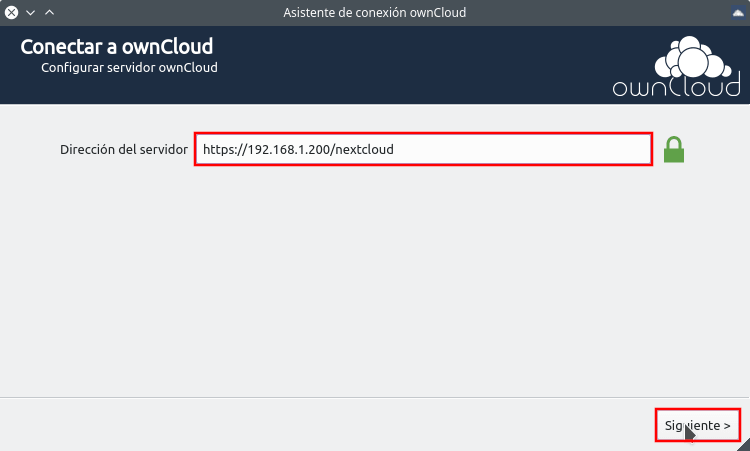
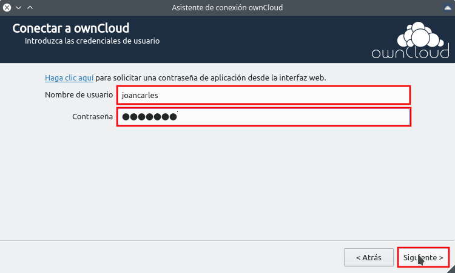
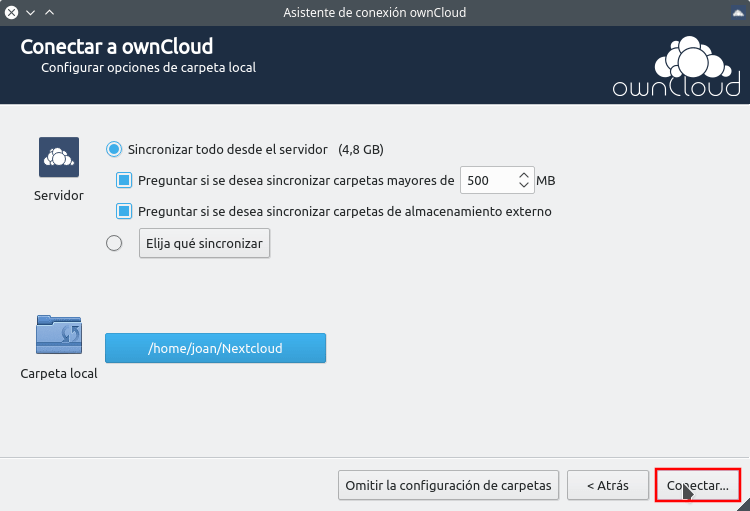
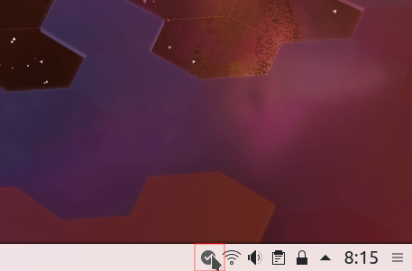
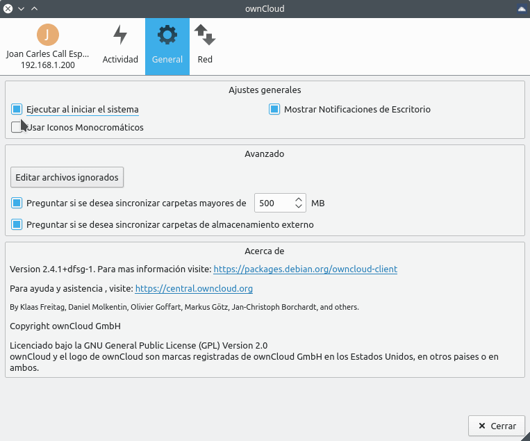

En su día detallamos el procedimiento para [instalar]() y [configurar]() una nube Nextcloud. En esta ocasión les mostraremos el procedimiento para instalar y configurar un cliente de Nextcloud en GNU-Linux.<!--more-->

## INSTALAR UN CLIENTE DE NEXTCLOUD

La mayoría de distribuciones Linux no cuentan con el cliente de Nextcloud en sus repositorios. Esto sin duda es un problema para los usuarios más noveles. No obstante tienen que saber que **el cliente de escritorio de Owncloud es 100% compatible con Nextcloud**. Por lo tanto, lo más recomendable para los usuarios noveles de Linux es instalar el cliente de Owncloud del siguiente modo.

### Instalar el cliente de Owncloud para ser usado con Nextcloud

Para instalar el cliente de Owncloud en Debian o en distribuciones derivadas de Debian tenemos que ejecutar el siguiente comando en la terminal:

> ```
> sudo apt install owncloud-client
> ```

###### Nota: Los usuarios de otras distribuciones deberán adaptar el comando de instalación en función de su gestor de paquetes.

Existe la posibilidad de integrar la nube Nextcloud con el gestor de archivos de su distribución. Para ello, en función del gestor de archivos que estén usando tendrán que instalar los siguientes paquetes:

| **Gestor de archivos** | **Comando para integrar Nextcloud en el gestor de archivos** |
| :-- | :-- |
| Dolphin |   ``` sudo apt install dolphin-owncloud ```   |
| Nautilus |   ``` sudo apt install nautilus-owncloud ```   |
| Nemo |   ``` sudo apt install nemo-owncloud ```   |
| Caja |   ``` sudo apt install caja-owncloud ```   |

###### Nota: Los usuarios de otras distribuciones deberán adaptar el comando de instalación en función de su gestor de paquetes.

De este forma podremos realizar las siguientes operaciones desde nuestro gestor de archivos:

1. **Compartir archivos** mediante el gestor de archivos de forma extremadamente sencilla.
2. **Subir contenido** de nuestro disco duro a la nube Nextcloud mediante el gestor de archivos.
3. Mediante símbolos el gestor de archivos podemos **saber si nuestros archivos están sincronizados**.
4. **Enviar emails con el enlace para compartir** un archivo o carpeta.
5. **Crear enlaces públicos** protegidos con contraseña y con una fecha de caducidad determinada.
6. **Copiar enlaces públicos para compartir** archivos y carpetas en nuestro portapapeles.
7. **Compartir un enlace únicamente con un determinado usuario o grupo** de Nextcloud.

De esta forma tan sencilla podemos disponer de un cliente de Nextcloud. No obstante, si lo prefieren pueden instalar y usar el cliente nativo de Nextcloud del siguiente modo.

### Instalar el cliente de Nextcloud en Linux

El cliente nativo de Nextcloud únicamente está disponible en formato Appimage y se instala del siguiente modo.

Inicialmente crearemos la carpeta donde guardaremos el paquete AppImage de Nextcloud. Como en mi caso quiero guardar el paquete en la ubicación ~/Appimages ejecutaré el siguiente comando en la terminal:

> ```
> mkdir ~/Appimages
> ```

Seguidamente accederemos a la siguiente URL:

[https://nextcloud.com/install/#install-clients](https://nextcloud.com/install/#install-clients "URL para descargar el paquete Appimage de Nextcloud")

A continuación descargamos el paquete Appimage de Nextcloud.

[](images/descargar-paquete-appimage-nextcloud.png)

Una vez descargado el paquete lo trasladaremos a la carpeta ~/Appimages. Acto seguido, dentro de la carpeta ~/Appimages ejecutaremos el siguiente comando para dar permisos de ejecución a Nextcloud.

> ```
> chmod a+x Nextcloud-2.5.0-x86_64.AppImage
> ```

###### Nota: Deberéis modificar la parte roja del comando en función del nombre que tenga el paquete Appimage que habéis descargado.

En estos momentos ya podemos dar por concluida la instalación del cliente nativo de Nextcloud.

###### Nota: El cliente nativo de Nextcloud no ofrece ningún tipo de integración con el gestor de archivos de nuestra distribución.

###### Nota: El cliente nativo de Nextcloud solo está disponible en Inglés.

## CONFIGURAR EL CLIENTE DE NEXTCLOUD

Da igual que hayamos instalado el cliente de Nextcloud o Owncloud ya que su proceso de configuración es el mismo.

En el caso que hayamos instalado el cliente de Nextcloud siguiendo las instrucciones de este post abriremos una terminal y ejecutaremos le siguiente comando:

> ```
> Appimages/Nextcloud-2.5.0-x86_64.AppImage
> ```

###### Nota: Deberéis modificar la parte roja del comando en función del nombre que tenga el paquete Appimage que habéis descargado.

En el caso que hayamos instalado el cliente de Owncloud tan solo tendremos que abrir una terminal y ejecutar el siguiente comando:

> ```
> owncloud
> ```

Acto seguido se iniciará el asistente de configuración que es equivalente en ambos casos. Inicialmente aparecerá una ventana parecida a la siguiente en la que deberemos **introducir la IP o el dominio de nuestra nube Nextcloud**.

[](images/direccion-del-servidor.png)

Acto seguido tendremos que **introducir el usuario y la contraseña** de la cuenta que queremos sincronizar en nuestro ordenador.

[](images/introducir-credenciales-cuenta-nextcloud.png)

Finalmente **definiremos algunas de las opciones de configuración**. En mi caso he seleccionado las siguientes opciones.

[](images/configurar-parametros-cliente-nextcloud.png)

1. En primera instancia he tildado la opción para **sincronizar todo el contenido de mi nube** a mi ordenador. Si os fijáis, el menú de configuración también ofrece la opción de únicamente sincronizar las carpetas que nosotros queramos.
2. Seguidamente tildo la opción de **pedir permiso en el momento se intenten sincronizar carpetas con un tamaño superior a 500 MB**. Si queréis podéis modificar el valor de 500 MB.
3. En tercera instancia tildamos la opción para que Nextcloud nos pregunte si queremos sincronizar contenidos que tenemos almacenados en medios externos como por ejemplo un servidor ftp, Google Drive, Dropbox, un Nexcloud externo a nuestro servidor, etc.
4. Finalmente selecciono que la totalidad del contenido sincronizado de nuestra Nextcloud se almacene en una carpeta determinada que en mi caso es /home/joan/Nextcloud.

Una vez realizada la configuración presionamos el botón Conectar y se iniciará la sincronización de nuestros datos en la carpeta /home/joan/Nextcloud.

## FUNCIONALIDADES QUE OFRECE EL CLIENTE DE NEXTCLOUD

Las funcionalidades que ofrecerá el cliente de Nextcloud son las que detallo a continuación:

1. **Seleccionar las carpetas que queremos sincronizar**. En nuestra nube podemos tener 1000 carpetas y si nos interesa sincronizar solo una lo podemos hacer sin problema.
2. **Descartar la sincronizar de determinadas extensiones de archivo** o archivos ocultos. De este modo podemos configurar que no se sincronice ningún archivo .exe.
3. Nos proporciona un **log de la actividad de nuestra nube**.
4. **Comprobar que no hayan errores de sincronización** y que por lo tanto todos los archivos estén sincronizados.
5. **Limitar la velocidad de subida y bajada** a nuestra nube. Esta opción es útil en el caso que dispongamos de conexiones de internet lentas.
6. **Configurar la conexión al servidor** en el caso que nuestra conexión a internet salga a través de un proxy.
7. **Añadir más de una cuenta de Nextcloud** en un ordenador. De esta forma un usuario puede incluso sincronizar el contenido de otros usuarios.

## HACER QUE NEXTCLOUD ARRANQUE AL INICIAR NUESTRO SISTEMA OPERATIVO

Para conseguir que el cliente de Nextcloud arranque de forma automática cada vez que arrancamos el ordenador hacemos doble clic encima del icono que aparece en el panel.

[](images/acceder-configuracion-cliente-de-nextcloud.png)

Cuando aparezca la ventana de configuración clicamos encima de la opción General y tildamos la opción Ejecutar al iniciar el sistema.

[](images/nextcloud-arranque-forma-automatica.png)

De este modo, la próxima vez que arranquemos nuestro ordenador se arrancará el cliente de Nextcloud de forma automática. Si os preocupa la estética, en la pestaña General del cliente de Nextcloud también podéis configurar los siguientes aspectos:

1. Activar y desactivar las notificaciones.
2. Activar los iconos monocromáticos en el panel de nuestro sistema operativo.

De este modo tan sencillo podremos instalar un cliente de escritorio para nuestra nube Nextcloud.
