Son muchos los usuarios que echan de menos disponer de un cliente y un servidor SSH en Windows. Para solventar este inconveniente existen alternativas, pero la más sencilla y efectiva es la que detallaré a continuación.

Para poder seguir el tutorial necesitan disponer de una versión de Windows 10 igual o superior a la 1803. Esto es así porque a partir de la versión 1803, Windows 10 incorpora un cliente y un servidor OpenSSH.<!--more-->

## VENTAJAS DE DISPONER DE UN CLIENTE Y UN SERVIDOR SSH EN WINDOWS

Las ventajas de disponer de un cliente y un servidor SSH en Windows son las que se detallan a continuación:

1. Desde nuestro equipo con Windows podremos administrar remotamente equipos con Windows, Linux y MacOS sin necesidad de usar Putty.
2. Podremos acceder y gestionar remotamente un equipo con Windows para por ejemplo realizar tareas de gestión y mantenimiento.
3. Al disponer de un cliente y un servidor SSH podremos intercambiar archivos e información entre distintos sistemas operativos de forma segura. Por lo tanto, desde un sistema operativo Linux podremos conectarnos a un equipo con Windows y traspasar información de Linux a Windows o viceversa.
4. Evitar el uso de un protocolo inseguro como es Samba. Con SSH podremos comunicarnos o traspasar información entre equipos de forma segura. Todo el tráfico que se origine entre cliente y servidor estará cifrado.
5. Ejecutar aplicaciones gráficas de forma remota. De este modo desde Windows podemos ejecutar programas como por ejemplo un gestor de correo que está instalado en un sistema operativo Linux.

## INSTALAR EL CLIENTE Y EL SERVIDOR SSH EN WINDOWS

Disponemos de varias formas para instalar un cliente y el servidor SSH en Windows. Lo podemos realizar usando Powershell o usando el entorno gráfico de Windows. En este artículo lo haremos usando el entorno gráfico.

Inicialmente presionamos la combinación de teclas **Win + I** para acceder a la configuración de Windows.

Cuando se abra el panel de configuración tenemos que presionar encima del icono de **Aplicaciones**.

[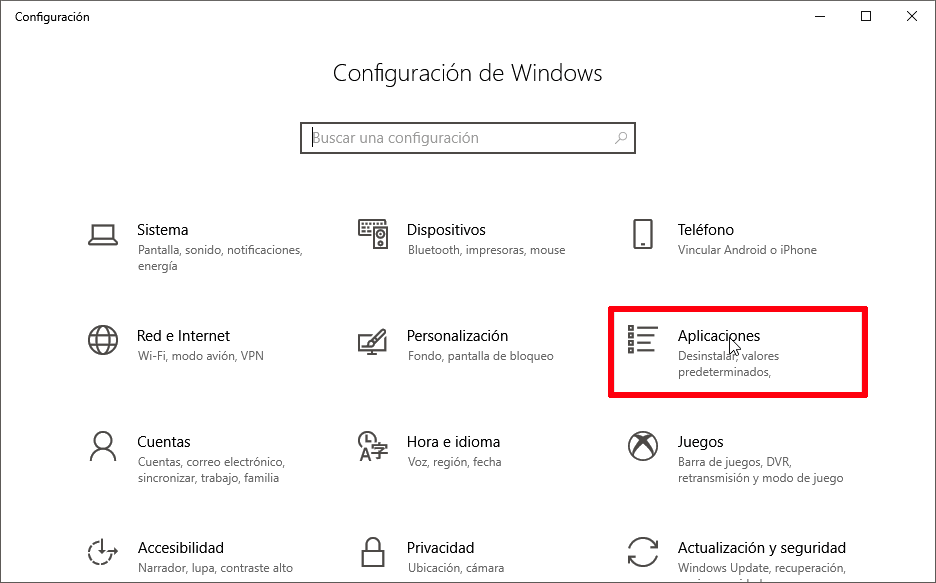](images/configuracion-aplicaciones-windows.png)

A continuación, clican encima de la opción **Administrar funciones opcionales**.

[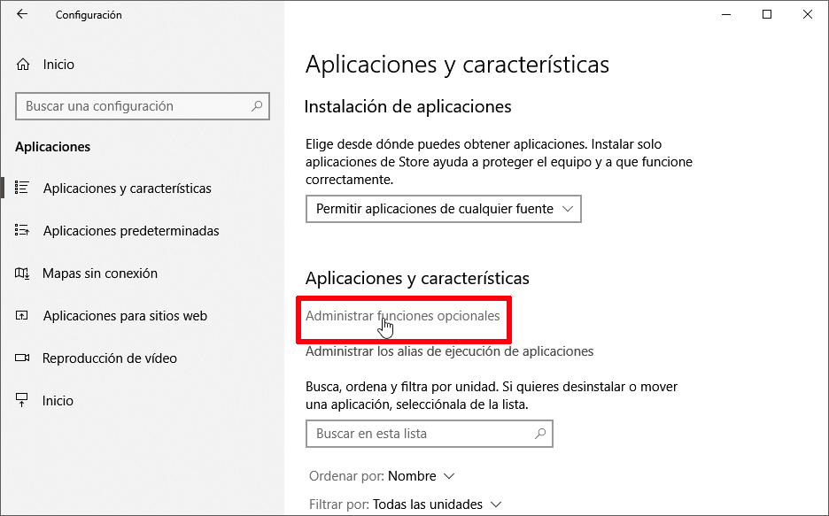](images/administrar-funciones-opcionales-windows.png)

Seguidamente verán la totalidad de características adicionales de Windows que tienen instaladas. En mi caso vemos que ya tengo instalada la opción **cliente OpenSSH**. Por lo tanto en mi caso tengo el cliente OpenSSH instalado de serie y no es necesario que realice absolutamente nada.

[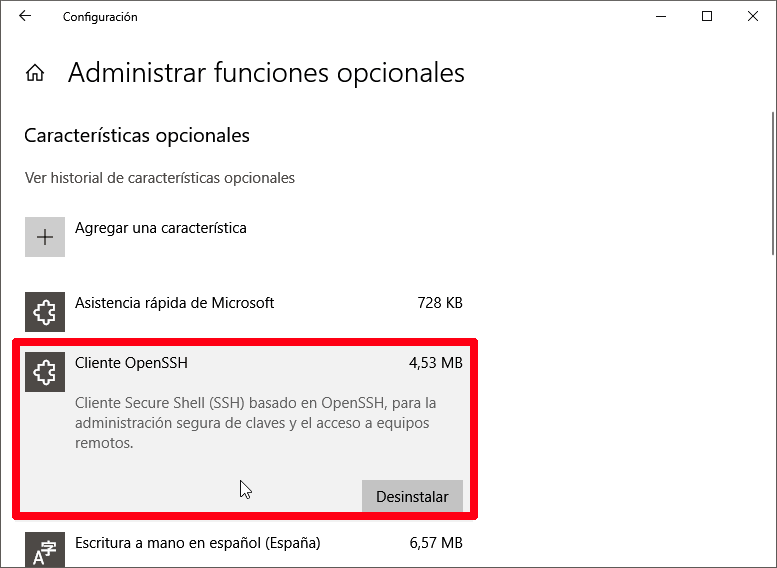](images/cliente-openssh-instalado.png)

En caso que además quieran **instalar un servidor SSH** en Windows para que terceras personas puedan acceder a nuestro ordenador de forma remota tienen que clicar encima del icono **Agregar una característica**.

[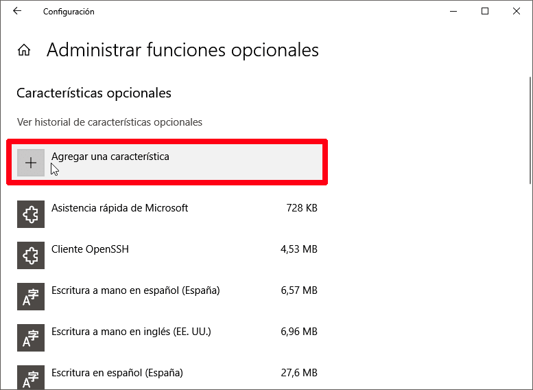](images/agregar-una-caracteristica-de-windows.png)

A continuación, buscan y clican sobre la opción **Servidor OpenSSH**. Cuando se desplieguen las opciones presionan sobre el botón **Instalar**. Acto seguido esperen unos segundos para que se realice la instalación del servidor SSH en Windows.

[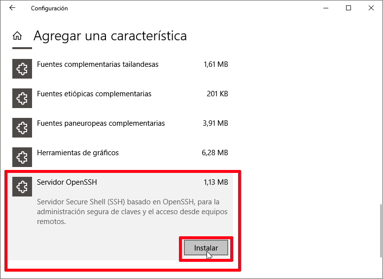](images/instalar-servidor-ssh-windows.png)

Una vez realizados los pasos indicados en este apartado reinicien el equipo.

## CONFIGURAR EL SERVIDOR SSH PARA QUE ARRANQUE AL INICIAR WINDOWS

En estos momentos tanto el cliente como el servidor SSH en Windows están instalados. Para el que servidor SSH se active cada vez que iniciamos Windows tendremos que realizar lo siguiente.

Inicialmente presionamos la combinación de teclas **Win + R**. Cuando aparezca la ventana Ejecutar escriben **services.msc** y presionan el botón **Aceptar**.

[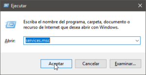](images/acceder-servicios.png)

A continuación localizaremos los servicios **OpenSSH SSH Server** y **OpenSSH Authentication Agent**. Una vez localizados los activaremos para que se inicien cada vez que arranquemos nuestro equipo.

[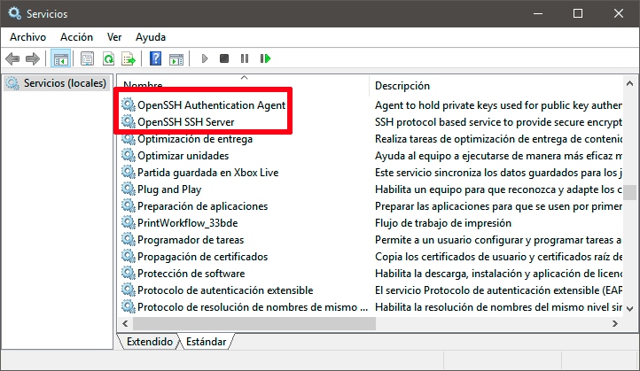](images/localizacion-servicios-ssh.png)

Para ello seleccionamos el servicio **OpenSHH SSH Server** y presionamos el botón derecho del ratón. Cuando aparezca el menú contextual clicamos encima de la opción **Propiedades**.

[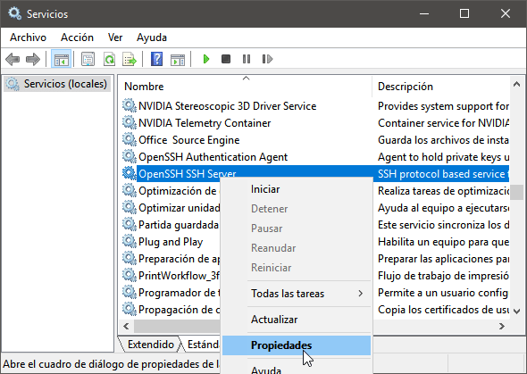](images/propiedades-servicio-openssh-server.png)

Acto seguido en **Tipo de inicio** seleccionamos la opción **Automático**. A continuación presionamos en el botón **Aplicar** y para finalizar clicamos en **Iniciar**.

[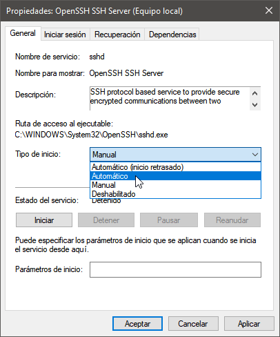](images/iniciar-servicio-openssh-ssh-server.png)

Finalmente repetiremos exactamente el mismo proceso para el **servicio OpenSSH Authentication Agent**. Por lo tanto seleccionaremos el servicio **OpenSSH Authentication Agent**. A continuación presionamos el botón derecho del ratón y cuando aparezca el menú contextual clicamos encima de la opción **Propiedades**.

[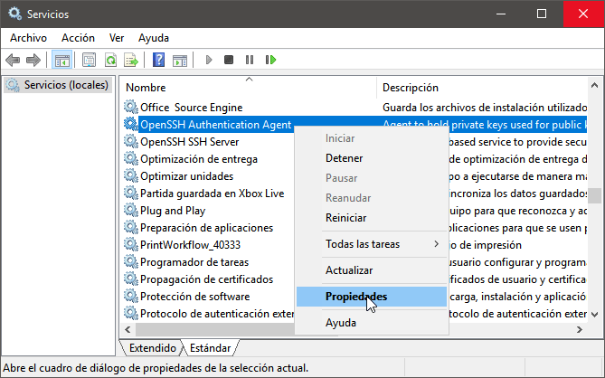](images/Acceder-a-las-propiedades-servicio-OpenSHH-authentication-agent.png)

Seguidamente en **Tipo de inicio** seleccionamos la opción **Automático**. A continuación presionamos en el botón **Aplicar** y para finalizar clicamos en **Iniciar**.

[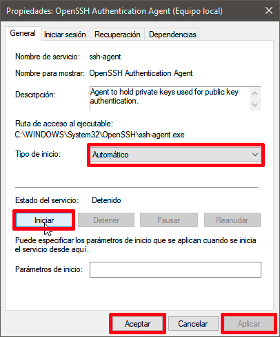](images/iniciar-proceso-openssh-authentication-agent.png)

Una vez realizados los pasos indicados reinicien el equipo.

## COMPROBAR QUE EL CLIENTE Y EL SERVIDOR SSH EN WINDOWS ESTÁN ACTIVOS

Una vez reiniciado el ordenador comprobaremos el servicio SSH está activo. Para ello abriremos un powershell como administrador.

[](images/powershell-como-administrador.png)

Acto seguido ejecutaremos el siguiente comando en la Powershell:

> ```
> Get-Service -Name *ssh*
> ```

En mi caso el resultado obtenido es el siguiente:

|   **Status      Name           DisplayName** Running    ssh-agent       OpenSSH Authentication Agent Running    sshd                 OpenSSH SSH Server   |
| --- |

Por lo tanto podemos estar seguros que nuestro cliente y servidor SSH en Windows están activos.

## CONFIGURAR EL FIREWALL DE WINDOWS PARA ACCEDER A NUESTRO SERVIDOR SSH

Para tener acceso a nuestro equipo a través de SSH tenemos que configurar el Firewall de Windows. Para ello abrimos una powershell como administrador y ejecutamos el siguiente comando:

> ```
> netsh advfirewall firewall add rule name="SSHD Port" dir=in action=allow protocol=TCP localport=22
> ```

De este modo abriremos el puerto 22 para que nos podamos conectar vía SSH a nuestro equipo con Windows 10.

## COMPROBAR QUE EL SERVICIO SSH ESTÁ ESCUCHANDO EN EL PUERTO 22

Para comprobar que el servidor SSH en Windows está activo y escuchando en el puerto 22 abrimos un powershell como administrador y ejecutamos el siguiente comando:

> ```
> netstat -bano | more
> ```

Sí después de ejecutar el comando obtenéis un resultado parecido al siguiente quiere decir que el servidor SSH está escuchando en el puerto 22.

|   **Proto    Dirección local     Dirección remota     Estado           PID** TCP         0.0.0.0:22                 0.0.0.0:0                         LISTENING       2728 TCP         0.0.0.0:135               0.0.0.0:0                         LISTENING       952 \[sshd.exe\] TCP         0.0.0.0:135               0.0.0.0:0                         LISTENING       952 RpcSs \[svchost.exe\] …..   |
| --- |

Una vez comprobado que el servidor SSH está activo y escuchando en el puerto 22 podemos pasar al siguiente apartado.

## CONECTARSE REMOTAMENTE A UN EQUIPO WINDOWS DESDE LINUX

Si desde un equipo con Linux nos queremos conectar a uno equipo con Windows vía SSH tenemos que realizar los siguientes pasos.

Inicialmente tenemos que asegurar que en Linux tenemos instalado el paquete **openssh-client**. Para ello en la terminal de Linux ejecutamos el siguiente comando:

> ```
> sudo apt-get install openssh-client
> ```

Ahora imaginemos que queremos conectarnos de forma remota al ordenador en que hemos instalado el servidor SSH. El ordenador al que nos queremos conectar dispone de la siguiente configuración:

1. El servidor SSH está activo y escuchando en el puerto **22**.
2. El nombre de usuario del equipo con Windows al que nos queremos conectar de forma remota es **jccal**.
3. La IP del ordenador al que hemos instalado el servidor SSH es la **192.168.1.55**.

Una vez conocidos los datos necesarios para la conexión abrimos una terminal de Linux y ejecutamos el siguiente comando:

> ```
> ssh -p 22 jccal@192.168.1.55
> ```

###### Nota: Las partes coloreadas del comando del comando son las que se tienen que adaptar en función de la configuración del servidor SSH.

Una vez ejecutado el comando se nos preguntará la contraseña del usuario **jccal**. Introducimos la contraseña que usa el usuario **jccal** para loguearse a Windows y presionamos Enter. Acto seguido, tal y como se puede ver en la captura de pantalla, podrán acceder remotamente al equipo con Windows.

[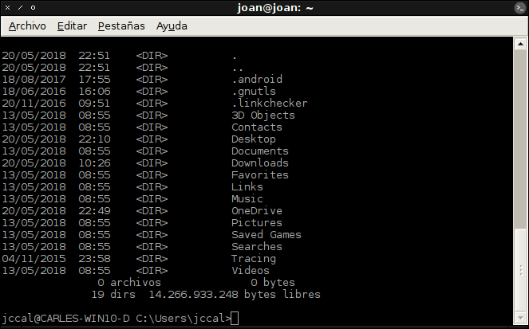](images/conectar-a-equipo-con-windows-via-ssh.png)

Si lo prefieren pueden acceder remotamente a Windows de forma gráfica. Para ello en un sistema operativo Linux presionan la combinación de teclas **Ctrl+L**.

Seguidamente en la barra de direcciones escriben el siguiente comando y presionan Enter.

> ```
> ssh://jccal@192.168.1.55:22
> ```

###### Nota: Las partes coloreadas del comando del comando son las que se tienen que adaptar en función de la configuración del servidor SSH.

Acto seguido se nos preguntará la contraseña de la sesión de usuario **jccal**. La introducimos y presionamos sobre el botón **Conectar**.

[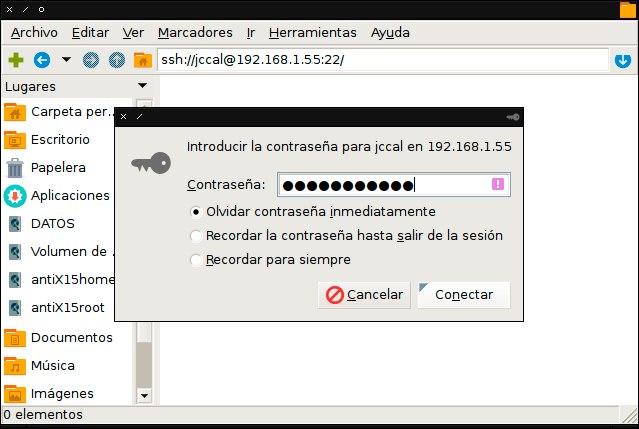](images/conetarse-remotamente-ssh-gestor-archivos.png)

Si hemos realizado los pasos de forma correcta nos conectaremos de forma remota al equipo que tiene instalado Windows.

[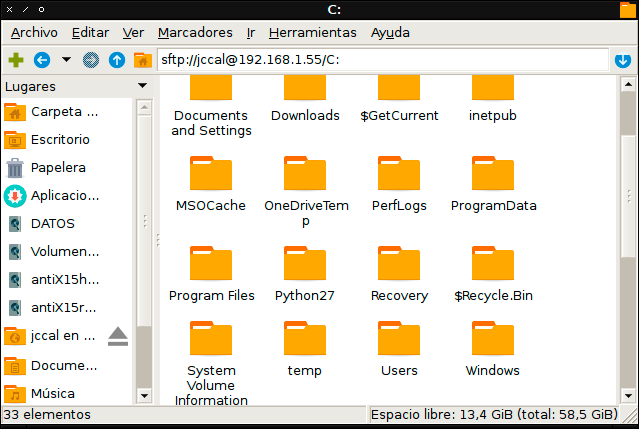](images/conectado-ssh-gestor-archivos.png)

## CONECTARSE A UN SERVIDOR SSH DESDE WINDOWS CON POWERSHELL

Son muchos usuarios de Windows 10 que cuando quieren conectarse vía SSH a un equipo remoto usan Putty. Es una buena opción, pero si hemos seguido las instrucciones de este artículo ya no es necesario usar Putty.

Supongamos que queremos conectarnos remotamente a una Raspberry Pi y disponemos de la siguiente información:

1. El usuario de la Raspberry Pi al que nos queremos conectar es **pi**.
2. La IP de la Raspberry Pi es la **192.168.1.100**
3. El servicio SSH de la Raspberry Pi está escuchando en el puerto **22**.

Una vez conocidos estos datos abrimos una powershell y ejecutamos el siguiente comando:

> ```
> ssh -p 22 pi@192.168.1.100
> ```

###### Nota: Las partes coloreadas del comando se deberán adaptar en función de los parámetros del equipo remoto al que nos queremos conectar.

Después de ejecutar el comando, tal y como se puede ver en la captura de pantalla, se establecerá la conexión remota a mi Raspberry Pi.

[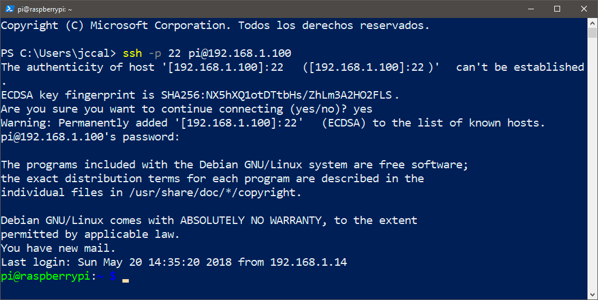](images/conectado-servidor-SSH-usando-powershell.png)

## MODIFICACIÓN DE LA CONFIGURACIÓN ESTÁNDAR DE SSH EN WINDOWS

La totalidad de claves, logs y configuración del servidor SSH se hallan en la siguiente ubicación:

> ```
> C:\ProgramData\ssh
> ```

Para modificar la configuración estándar de SSH en Windows tan solo tienen que editar el fichero **sshd\_config** con el blog de notas.

[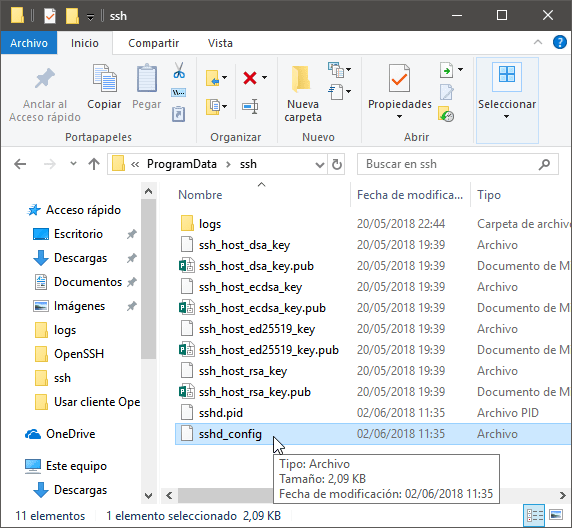](images/configuración-servidor-SSH-windows.png)

Una vez dentro del fichero **sshd\_config** tan solo tienen que ir descomentando las líneas y definir los parámetros que se quieren modificar. A modo de ejemplo podemos descomentar la línea **\# port 22** y modificarla por **port 2222**.

[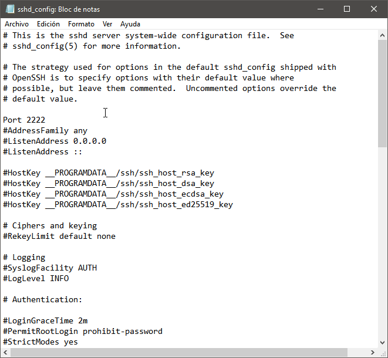](images/configuracion-servidor-ssh-modificada.png)

Finalmente guardamos los cambios, cerramos el fichero y reiniciamos el servidor SSH. Una vez finalizado el proceso el servidor SSH estará escuchando en el puerto **2222** en vez del puerto **22**.

Ahora el servidor SSH está escuchando en el puerto 2222. Por lo tanto deberemos configurar el firewall de Windows para que permita el tráfico de entrada en el puerto 2222. Para ello abrimos una powershell como administrador y ejecutamos el siguiente comando:

> ```
> netsh advfirewall firewall add rule name="SSHD Port" dir=in action=allow protocol=TCP localport=2222
> ```

Acto seguido podemos borrar la regla del firewall que permitía el tráfico en el puerto 22. Para ello ejecutamos el siguiente comando en la powershell:

> ```
> netsh advfirewall firewall delete rule name="SSHD Port"
> ```

A partir de estos momentos para conectarnos al servidor SSH deberemos cambiar los comandos anteriores por los siguientes:

> ```
> ssh -p 2222 jccal@192.168.1.55
> ```
> 
> ```
> ssh://jccal@192.168.1.55:2222
> ```
> 
> ```
> ssh -p 2222 pi@192.168.1.100
> ```

Otras modificaciones de la configuración que se pueden establecer en el archivo de configuración de SSH son las siguientes:

1. El tipo de cifrado que se aplicará en la conexión.
2. Definir si permitimos que un usuario se pueda loguear con permisos de administrador.
3. El número de logins simultáneos desde una IP concreta.
4. Etc.
