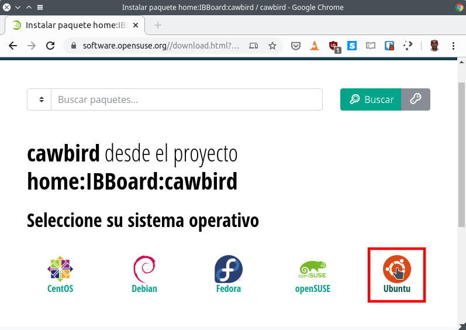
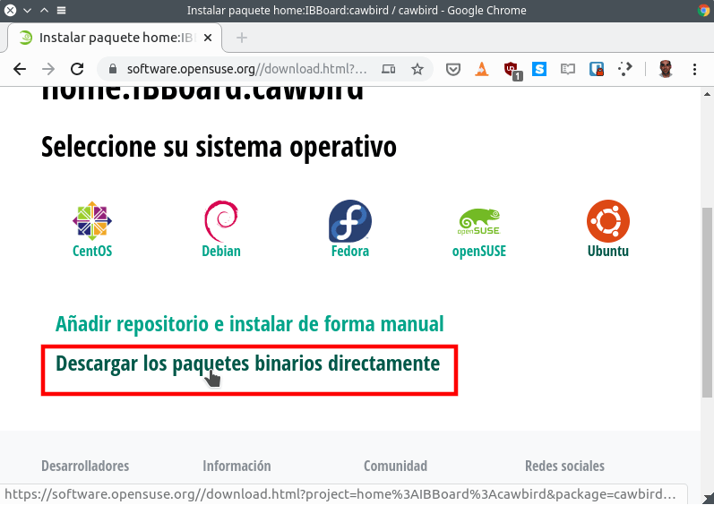
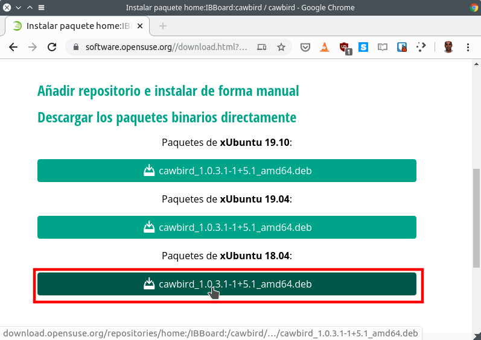
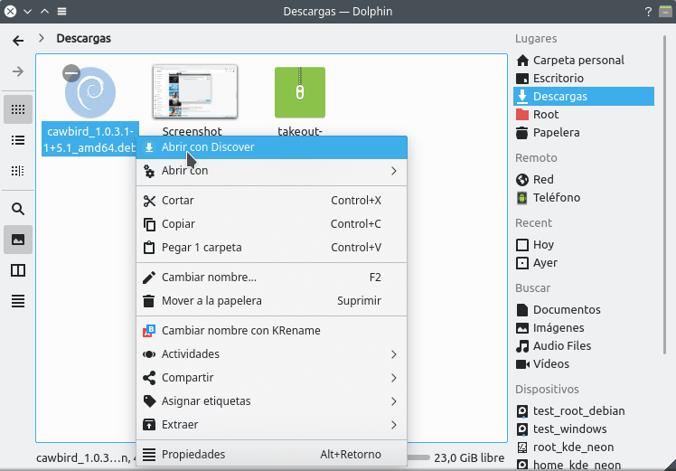
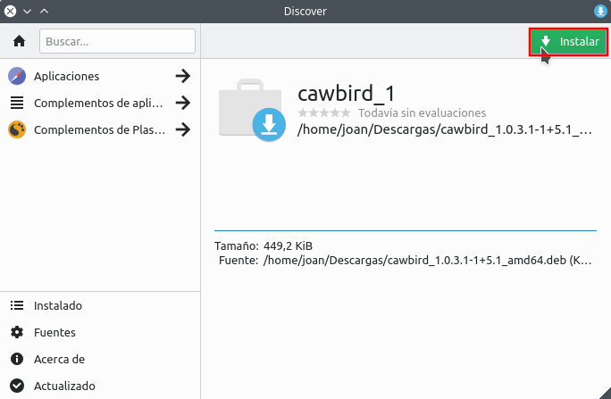

A continuación veremos la totalidad de formas que tenemos para instalar el cliente de Twitter Cawbird en Debian, Ubuntu, Linux Mint y resto de distribuciones derivadas de les que acabo de citar.<!--more-->

## ¿QUÉ ES CAWBIRD?

Bajo mi punto de vista, Cawbird es el mejor cliente de Twitter existente en la actualidad. Se trata de un cliente con las siguientes funcionalidades:

1. Buscar, visualizar, responder, citar, borrar, retwittear y añadir a favoritos los tweets.
2. Visualizar imágenes y vídeos.
3. Subir imágenes y vídeos.
4. Agregar, Eliminar y bloquear a usuarios.
5. Silenciar hashtags.
6. Enviar, borrar y recibir mensajes directos.
7. Buscar tweets y usuarios.
8. Consular el contenido de listas.
9. Crear listas.
10. Añadir y gestionar varias cuentas de Twitter.
11. Etc.

Es importante recalcar que Cawbird es un Fork del cliente de Twitter Corebird que actualmente está abandonado.

## ¿POR QUÉ ES INTERESANTE USAR E INSTALAR EL CLIENTE DE TWITTER CAWBIRD?

Es interesante usar Cawbird porque proporciona una experiencia natural al usar Twitter. **Si usamos la web de Twitter o su cliente oficial** nos encontraremos con los siguientes inconvenientes:

1. Veremos **publicidad**.
2. Los **tweets no se muestran de forma cronológica**. En los primeros puestos siempre aparecen tweets patrocinados y tweets que Twitter considera que tienen que aparecer en las primeras posiciones.

Estos simples puntos hacen que la experiencia entre usar el cliente oficial o Cawbird sea totalmente distinta. **Cawbird no mostrará anuncios y mostrará un timeline por orden cronológico** que da la misma importancia a todos los usuarios.

**Los principales inconvenientes de Cawbird** son las limitaciones que Twitter impone a las aplicaciones de terceros. Las principales limitaciones existentes son las siguientes:

1. Cawbird **no muestra los tweets a tiempo real**. El timeline de Twitter se irá autorefrescando con una periodicidad de 2 minutos. Si queremos también podemos refrescarlo de forma manual.
2. El **apartado de notificaciones está restringido**. Solo recibiremos notificaciones de tweets nuevos o en el caso que alguien nos mencione.

## INSTALAR CAWBIRD EN DEBIAN

Para instalar Cawbird en Debian nos loguearemos como usuario root. Para ello en la terminal ejecutaremos el siguiente comando:

> ```
> sudo su
> ```

Acto seguido averiguaremos la versión de Debian que están usando. Para ello ejecutaremos el siguiente comando en la terminal:

> ```
> lsb_release -a
> ```

En mi caso el resultado obtenido ha sido el siguiente:

> ```
> No LSB modules are available.
> Distributor ID: Debian
> Description: Debian GNU/Linux bullseye/sid
> Release: testing
> Codename: bullseye
> ```

Por lo tanto puedo afirmar que estoy usando la rama testing de Debian.

En función de la rama de Debian que estén usando agregarán el repositorio de Cawbird ejecutando uno de los siguientes comandos:

 
|   **Rama Debian**   |   **Comando para agregar el repositorio de Cawbird**   |
| --- | --- |
|   Testing   |   `echo 'deb http://download.opensuse.org/repositories/home:/IBBoard:/cawbird/Debian_Testing/ /' > /etc/apt/sources.list.d/home:IBBoard:cawbird.list`   |
|   Inestable   |   `echo 'deb http://download.opensuse.org/repositories/home:/IBBoard:/cawbird/Debian_Unstable/ /' > /etc/apt/sources.list.d/home:IBBoard:cawbird.list`   |

###### Nota: Si están en la rama estable de Debian les recomiendo que instalen Cawbird mediante los binarios o con snap.

Acto seguido descargaremos la clave pública del repositorio. Dependiendo de la rama de Debian que estén usando deberán descargar la clave ejecutando uno de los siguientes comandos:

 
|   **Rama Debian**   |   **Comando para descargar la del repositorio de Cawbird**   |
| --- | --- |
|   Testing   |   `wget -nv https://download.opensuse.org/repositories/home:IBBoard:cawbird/Debian_Testing/Release.key -O Release.key`   |
|   Inestable   |   `wget -nv https://download.opensuse.org/repositories/home:IBBoard:cawbird/Debian_Unstable/Release.key -O Release.key`   |

Seguidamente agregaremos la clave publica que acabamos de descargar ejecutando el siguiente comando en la terminal:

> ```
> sudo apt-key add - < Release.key
> ```

Finalmente refrescaremos los repositorios e instalaremos Cawbird ejecutando el siguiente comando en la terminal:

> ```
> sudo apt update && sudo apt install cawbird
> ```

Una vez ejecutado el comando Cawbird ya estará instalado en nuestro sistema operativo. Si todos los pasos se han realizado correctamente podemos borrar la clave publica ejecutando el siguiente comando en la terminal:

> ```
> rm Release.key
> ```

Para volvernos a loguear con nuestro usuario habitual ejecutaremos el siguiente comando en la terminal:

> ```
> exit
> ```

## INSTALAR CAWBIRD EN UBUNTU O LINUX MINT

La mejor forma de instalar Cawbird en Ubuntu o en Linux Mint es mediante repositorios ppa. Para ello lo primero que deberemos realizar es averiguar la versión de Ubuntu que estamos usando. Para ello ejecutaremos el siguiente comando en la terminal:

> ```
> lsb_release -a
> ```

El resultado obtenido en mi caso es el siguiente:

> ```
> No LSB modules are available.
> Distributor ID: neon
> Description:    KDE neon User Edition 5.17
> Release:        18.04
> Codename:       bionic
> ```

Por lo tanto en mi caso estoy usando la versión 18.04 de Ubuntu. En función de la versión de Ubuntu que estén usando agregarán el repositorio ppa de Cawbird ejecutando uno de los siguientes comandos en la terminal:

 
|   **Versión Ubuntu**   |   **Comando para agregar el repositorio ppa de Cawbird**   |
| --- | --- |
|   Ubuntu 18.04   |   `sudo sh -c "echo 'deb http://download.opensuse.org/repositories/home:/IBBoard:/cawbird/xUbuntu_18.04/ /' > /etc/apt/sources.list.d/home:IBBoard:cawbird.list"`   |
|   Ubuntu 19.04   |   `sudo sh -c "echo 'deb http://download.opensuse.org/repositories/home:/IBBoard:/cawbird/xUbuntu_19.04/ /' > /etc/apt/sources.list.d/home:IBBoard:cawbird.list"`   |
|   Ubuntu 19.10   |   `sudo sh -c "echo 'deb http://download.opensuse.org/repositories/home:/IBBoard:/cawbird/xUbuntu_19.10/ /' > /etc/apt/sources.list.d/home:IBBoard:cawbird.list"`   |

Acto seguido descargaremos la clave pública del repositorio ppa. Dependiendo de la versión de Ubuntu que estén usando deberán descargar la clave ejecutando uno de los siguientes comandos:

 
|   **Versión Ubuntu**   |   **Comando para descargar la clave pública del repositorio ppa**   |
| --- | --- |
|   Ubuntu 18.04   |   `wget -nv https://download.opensuse.org/repositories/home:IBBoard:cawbird/xUbuntu_`18.04[/](https://download.opensuse.org/repositories/home:IBBoard:cawbird/xUbuntu_18.04/)Release.key -O Release.key   |
|   Ubuntu 19.04   |   `wget -nv https://download.opensuse.org/repositories/home:IBBoard:cawbird/xUbuntu_`19.04[/](https://download.opensuse.org/repositories/home:IBBoard:cawbird/xUbuntu_19.04/)Release.key -O Release.key   |
|   Ubuntu 19.10   |   `wget -nv https://download.opensuse.org/repositories/home:IBBoard:cawbird/xUbuntu_19.10/Release.key -O Release.key`   |

Seguidamente agregaremos la clave publica que acabamos de descargar ejecutando el siguiente comando en la terminal:

> ```
> sudo apt-key add - < Release.key
> ```

Finalmente refrescaremos los repositorios e instalaremos Cawbird ejecutando el siguiente comando en la terminal:

> ```
> sudo apt update && sudo apt install cawbird
> ```

Una vez ejecutado el comando Cawbird ya estará instalado en nuestro sistema operativo. Si todos los pasos se han realizado correctamente ya se pude borrar la clave publica descargada ejecutando el siguiente comando en la terminal:

> ```
> rm Release.key
> ```

## INSTALAR CAWBIRD MEDIANTE PAQUETERÍA SNAP

En mi caso no me gustan los paquetes snap, pero a quien le guste o necesite usar paquetes snap debe proceder del siguiente modo.

Aseguramos que el demonio snapd está instalado ejecutando el siguiente comando en la terminal:

> ```
> sudo apt install snapd
> ```

Acto seguido tan solo tenemos que ejecutar el siguiente comando para instalar Cawbird:

> ```
> sudo snap install cawbird
> ```

## INSTALAR CAWBIRD A TRAVÉS DE ARCHIVOS BINARIOS

Si no quieren complicarse la vida también pueden instalar Cawbird mediante paquetes binarios .deb.

Para descargar los paquetes binarios acceden a la siguiente URL:

[https://software.opensuse.org//download.html?project=home%3AIBBoard%3Acawbird&package=cawbird](https://software.opensuse.org//download.html?project=home%3AIBBoard%3Acawbird&package=cawbird "Link para descargar los binarios de Cawbird")

Una vez dentro de la URL cliquen sobre la distribución que estén usando. Como en mi caso estoy usando KDE Neon y está basada en Ubuntu clico sobre el icono Ubuntu.

[](images/seleccionar-la-distribucion-que-usamos.png)

Acto seguido hay que clicar en la opción Descargar los paquetes binarios directamente.

[](images/descargar-los-paquetes-binarios-de-cawbird.png)

Como la actual KDE Neon está basada en Ubuntu 18.04 clico sobre el botón de descarga de la sección Paquetes de xUbuntu 18.04. Justo después de clicar se descargará el paquete binario.

[](images/seleccionar-version-paquetes-descargar.png)

Una vez descargado el paquete lo instalaremos con Gdebi o con el método que acostumbren a usar habitualmente. En mi caso como uso Kde Neon selecciono el paquete binario, presiono el botón derecho del ratón y cuando aparezca el menú contextual clico sobre la opción Abrir con Discover.

[](images/abrir-paquete-binario-discover.png)

Para finalizar tan solo tendremos que presionar sobre el botón Instalar.

[](images/instalar-el-cliente-de-twitter-cawbird.png)

Con estos métodos tan sencillos podremos instalar el cliente de Twitter Cawbird en cualquier distro que use paquetería .deb o snap.
