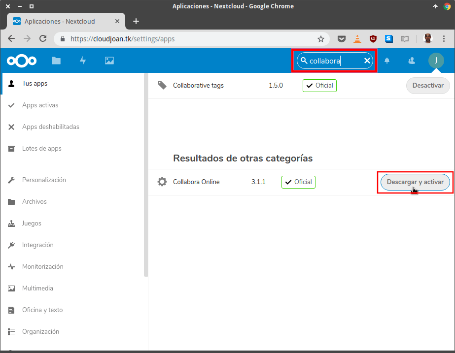
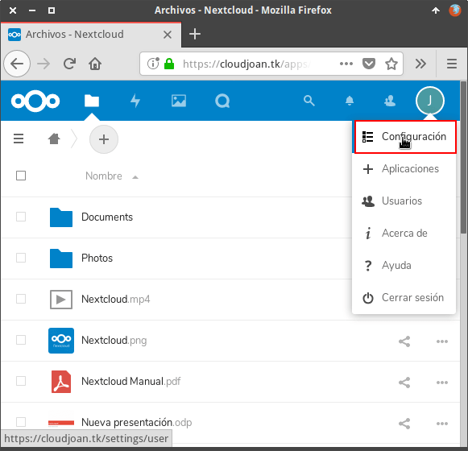
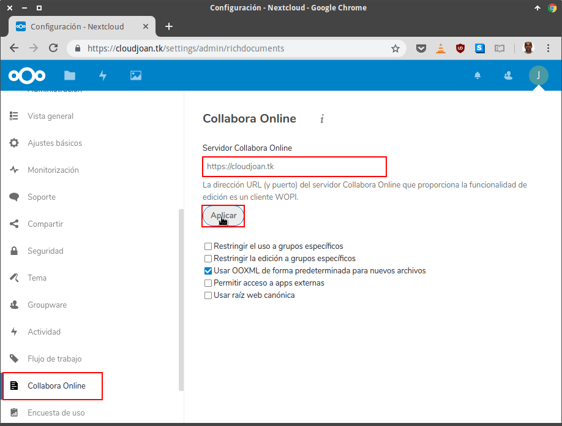
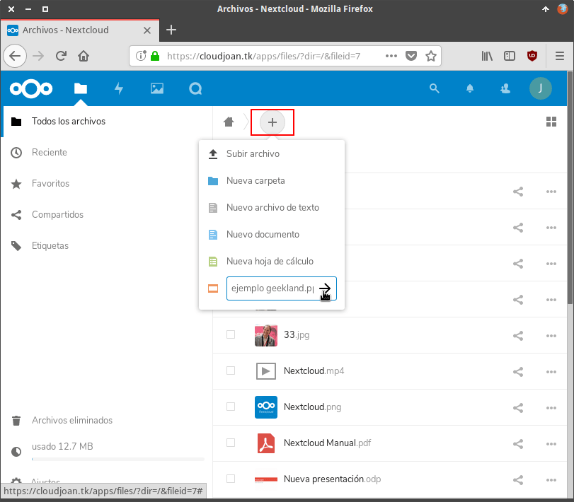
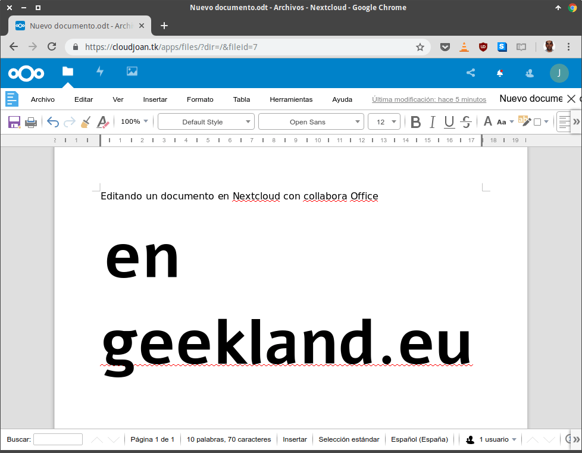
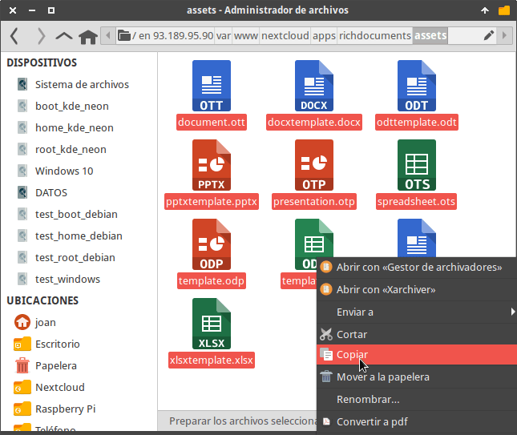
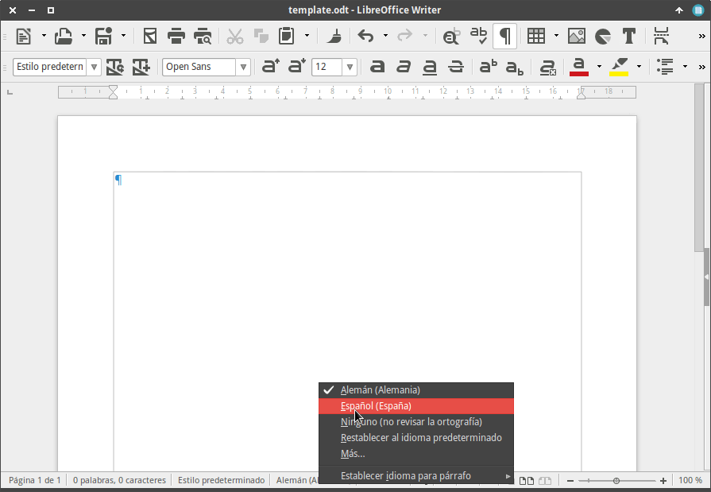

En el pasado vimos como [instalar Nextcloud]() en un servidor Ubuntu con Nginx, MariaDB y PHP. A continuación veremos el procedimiento a seguir para instalar Collabora Online en Nextcloud. De esta forma dispondremos de una suite ofimática integrada en Nextcloud y una solución parecida a Google Drive.<!--more-->

###### Nota: El tutorial que verán a continuación se puede aplicar siempre y cuando uséis el servidor web Nginx. Si usáis Apache el procedimiento es distinto.

## FUNCIONALIDADES QUE COLLABORA ONLINE AÑADIRÁ A NEXTCLOUD

Collabora Online es una Suite ofimática en la nube. Una vez esté integrada a Nextcloud tendremos nuestro propio Google Drive. De esta forma podremos:

1. **Ver y editar documentos** ofimáticos en Nextcloud. Lo único que necesitaremos para editar un documento será un navegador web.
2. Editar y visualizar todo tipo de documentos que tengan las extensiones odt, ods, odp, doc, docx, xls, xlsx, ppt, pptx, etc.
3. **Editar documentos de forma colaborativa** con otros usuarios de la nube Nextcloud.

## REQUISITOS DE HARDWARE PARA USAR COLLABORA ONLINE

Collabora Online es una solución ligera. No obstante consumirá recursos de su servidor. Cuantos más documentos tengamos abiertos y cuantos más usuarios lo usen de forma simultánea, más recursos necesitaremos. Mis recomendaciones son las siguientes:

1. En cuanto a procesador no nos tenemos que preocupar. En mi VPS solo tengo **un núcleo** y es más que suficiente.
2. El primer documento que abrimos consume 150MB de RAM. El resto de documentos que abriremos solo consumirán 50MB cada uno. Con estas indicaciones asignen la RAM que consideren oportuna. En mi caso les recomiendo tener **2GB de RAM**. Con 1GB de RAM Collabora Online es funcional, pero a veces se os colgará por falta de RAM.

###### Nota: Si solo sois un usuario podéis usar 1GB de RAM siempre y cuando tengáis un espacio de intercambio SWAP.

###### Nota: Los documentos complejos ocupan más los documentos simples o vacíos.

## RESTRICCIONES DE COLLABORA ONLINE

Que yo sepa Collabora Online cuenta con las siguientes restricciones:

1. El número máximo de documentos que puedes tener abiertos de forma simultánea son 10.
2. El número de usuarios que se pueden conectar de forma simultanea son 20.
3. No permite insertar ecuaciones ni autoformas. Faltan algunas de las opciones que aparecen en suites ofimáticas como por ejemplo LibreOffice o Microsoft Office.

En mi caso, y en la gran mayoría de casos, estás limitaciones no nos afectarán.

## INSTALAR COLLABORA ONLINE EN UN SERVIDOR NGINX

Para instalar Collabora Online en un servidor Ubuntu que esté usando el servidor Web Nginx deberemos proceder del siguiente modo.

### Instalar Docker Comunity Edition

Para que Docker funcione adecuadamente instalaremos Docker community Edition. Por lo tanto borraremos cualquier rastro de instalación de Docker ejecutando el siguiente comando en la terminal:

> ```
> sudo apt remove docker docker-engine docker.io
> ```

El repositorio de Docker utiliza https. Por esto motivos instalaremos los siguiente paquetes ejecutando el siguiente comando en la terminal:

> ```
> sudo apt install apt-transport-https ca-certificates curl software-properties-common
> ```

Para usar la última versión de Docker añadiremos el repositorio de docker a nuestra distribución Ubuntu ejecutando el siguiente comando en la terminal:

> ```
> sed -i '$adeb https://download.docker.com/linux/ubuntu bionic stable' /etc/apt/sources.list
> ```

Acto seguido descargaremos y añadiremos la clave del repositorio ejecutando el siguiente comando:

> ```
> curl -fsSL https://download.docker.com/linux/ubuntu/gpg | sudo apt-key add -
> ```

Finalmente actualizaremos los repositorios e instalaremos Docker Comunity Edition. Para ello ejecutamos le siguiente comando en la terminal:

> ```
> sudo apt update && sudo apt install docker-ce -y
> ```

### Comprobar el funcionamiento de Docker

Aseguraremos que Docker esté funcionando de forma adecuada. Para ello descargaremos y ejecutaremos el container hello-world ejecutando el siguiente comando en la terminal:

> ```
> docker run hello-world
> ```

En mi caso el resultado obtenido ha sido el siguiente:

| Hello from Docker! This message shows that your installation appears to be working correctly.To generate this message, Docker took the following steps: 1\. The Docker client contacted the Docker daemon. 2\. The Docker daemon pulled the "hello-world" image from the Docker Hub. (amd64) 3\. The Docker daemon created a new container from that image which runs the executable that produces the output you are currently reading. 4\. The Docker daemon streamed that output to the Docker client, which sent it to your terminal.To try something more ambitious, you can run an Ubuntu container with: $ docker run -it ubuntu bashShare images, automate workflows, and more with a free Docker ID: https://hub.docker.com/For more examples and ideas, visit: |
| :-- |

Por lo tanto Docker está funcionando de forma adecuada.

### Instalar Collabora Online en nuestro equipo

Para instalar Collabora Online descargaremos su imagen de Docker ejecutando el siguiente comando en la terminal:

> ```
> docker pull collabora/code
> ```

Una vez finalizada la descarga de la imagen añadiremos código al VirtualHost de Nginx. Por lo tanto en mi caso ejecutaré el siguiente comando en la terminal:

> ```
> sudo nano /etc/nginx/sites-enabled/nextcloud
> ```

Una vez se abra el editor de textos añadiremos el código marcado en color rojo:

|   > ``` > upstream php-handler { >     #server 127.0.0.1:9000; >     server unix:/run/php/php7.2-fpm.sock; > } >  > server { >     listen 80; >     listen [::]:80; >     server_name cloudjoan.tk www.cloudjoan.tk; >     return 301 https://cloudjoan.tk$request_uri; > } >  > server { >     listen 443 ssl http2; >     listen [::]:443 ssl http2; >     server_name www.cloudjoan.tk; >     return 301 https://cloudjoan.tk$request_uri; >  >     ssl_certificate /etc/letsencrypt/live/cloudjoan.tk/fullchain.pem; >     ssl_certificate_key /etc/letsencrypt/live/cloudjoan.tk/privkey.pem; > } >  > server { >     listen 443 ssl http2; >     listen [::]:443 ssl http2; >     server_name cloudjoan.tk; >  >     ssl_certificate /etc/letsencrypt/live/cloudjoan.tk/fullchain.pem; >     ssl_certificate_key /etc/letsencrypt/live/cloudjoan.tk/privkey.pem; >  >     # Add headers to serve security related headers >     # Before enabling Strict-Transport-Security headers please read into this >     # topic first. >     # add_header Strict-Transport-Security "max-age=15552000; >     # includeSubDomains; preload;"; >     # >     # WARNING: Only add the preload option once you read about >     # the consequences in https://hstspreload.org/. This option >     # will add the domain to a hardcoded list that is shipped >     # in all major browsers and getting removed from this list >     # could take several months. >     add_header X-Content-Type-Options nosniff; >     add_header X-XSS-Protection "1; mode=block"; >     add_header X-Robots-Tag none; >     add_header X-Download-Options noopen; >     add_header X-Permitted-Cross-Domain-Policies none; >     add_header Strict-Transport-Security "max-age=31536000; includeSubDomains" always; >     add_header Referrer-Policy no-referrer always; >  >     # Path to the root of your installation >     root /var/www/nextcloud/; >  >     location = /robots.txt { >         allow all; >         log_not_found off; >         access_log off; >     } >  >     # The following 2 rules are only needed for the user_webfinger app. >     # Uncomment it if you're planning to use this app. >     #rewrite ^/.well-known/host-meta /public.php?service=host-meta last; >     #rewrite ^/.well-known/host-meta.json /public.php?service=host-meta-json >     # last; >  >     location = /.well-known/carddav { >         return 301 $scheme://$host/remote.php/dav; >     } >     location = /.well-known/caldav { >         return 301 $scheme://$host/remote.php/dav; >     } >  > ### Start Collabora Online ### > location ^~ /loleaflet { > proxy_pass https://localhost:9980; > proxy_set_header Host $http_host; > } > location ^~ /hosting/discovery { > proxy_pass https://localhost:9980; > proxy_set_header Host $http_host; > } > location ^~ /lool { > proxy_pass https://localhost:9980; > proxy_set_header Host $http_host; > proxy_set_header Upgrade $http_upgrade; > proxy_set_header Connection "upgrade"; > } > location ^~ /hosting/capabilities { > proxy_pass https://localhost:9980; > proxy_set_header Host $http_host; > } > ### End Collabora Online ### >     # set max upload size >     client_max_body_size 512M; >     fastcgi_buffers 64 4K; >  >     # Enable gzip but do not remove ETag headers >     gzip on; >     gzip_vary on; >     gzip_comp_level 4; >     gzip_min_length 256; >     gzip_proxied expired no-cache no-store private no_last_modified no_etag auth; >     gzip_types application/atom+xml application/javascript application/json application/ld+json application/manifest+json application/rss+xml application/vnd.geo+json application/vnd.ms-fontobject application/x-font-ttf application/x-web-app-manifest+json application/xhtml+xml application/xml font/opentype image/bmp image/svg+xml image/x-icon text/cache-manifest text/css text/plain text/vcard text/vnd.rim.location.xloc text/vtt text/x-component text/x-cross-domain-policy; >  >     # Uncomment if your server is built with the ngx_pagespeed module >     # This module is currently not supported. >     #pagespeed off; >  >     location / { >         rewrite ^ /index.php$uri; >     } >  >     location ~ ^/(?:build\|tests\|config\|lib\|3rdparty\|templates\|data)/ { >         deny all; >     } >     location ~ ^/(?:\.\|autotest\|occ\|issue\|indie\|db_\|console) { >         deny all; >     } >  >     location ~ ^/(?:index\|remote\|public\|cron\|core/ajax/update\|status\|ocs/v[12]\|updater/.+\|ocs-provider/.+)\.php(?:$\|/) { >         fastcgi_split_path_info ^(.+\.php)(/.*)$; >         include fastcgi_params; >         fastcgi_param SCRIPT_FILENAME $document_root$fastcgi_script_name; >         fastcgi_param PATH_INFO $fastcgi_path_info; >         fastcgi_param HTTPS on; >         #Avoid sending the security headers twice >         fastcgi_param modHeadersAvailable true; >         fastcgi_param front_controller_active true; >         fastcgi_pass php-handler; >         fastcgi_intercept_errors on; >         fastcgi_request_buffering off; >     } >  >     location ~ ^/(?:updater\|ocs-provider)(?:$\|/) { >         try_files $uri/ =404; >         index index.php; >     } >  >     # Adding the cache control header for js and css files >     # Make sure it is BELOW the PHP block >     location ~ \.(?:css\|js\|woff\|svg\|gif)$ { >         try_files $uri /index.php$uri$is_args$args; >         add_header Cache-Control "public, max-age=15778463"; >         # Add headers to serve security related headers (It is intended to >         # have those duplicated to the ones above) >         # Before enabling Strict-Transport-Security headers please read into >         # this topic first. >         # add_header Strict-Transport-Security "max-age=15768000; includeSubDomains; preload;"; >         # >         # WARNING: Only add the preload option once you read about >         # the consequences in https://hstspreload.org/. This option >         # will add the domain to a hardcoded list that is shipped >         # in all major browsers and getting removed from this list >         # could take several months. >         add_header X-Content-Type-Options nosniff; >         add_header X-XSS-Protection "1; mode=block"; >         add_header X-Robots-Tag none; >         add_header X-Download-Options noopen; >         add_header X-Permitted-Cross-Domain-Policies none; >         # Optional: Don't log access to assets >         access_log off; >     } >  >     location ~ \.(?:png\|html\|ttf\|ico\|jpg\|jpeg)$ { >         try_files $uri /index.php$uri$is_args$args; >         # Optional: Don't log access to other assets >         access_log off; >     } > } > ```   |
| :-- |

Una vez realizadas las modificaciones guardamos los cambios y cerramos el fichero.

Para que la configuración se aplique reiniciamos el servidor web ejecutando el siguiente comando en la terminal:

> ```
> systemctl restart nginx
> 
> ```

### Iniciar el contenedor de Collabora Online

Finalmente iniciamos la imagen de docker ejecutando el siguiente comando en la terminal:

> ```
> docker run -t -d -p 127.0.0.1:9980:9980 -e "domain=cloudjoan.tk" -e "username=user" -e "password=password" --name=COLLABORAOFFICE --restart always --cap-add MKNOD collabora/code
> ```

Algunos valores del comando tendrán que ser modificados. Los parámetros que a priori seguro que tendréis que modificar son los siguientes:

**cloudjoan.tk:** Tenéis que sustituir cloudjoan.tk por la URL que apunta al servidor de Nextcloud. **user:** Tenéis que reemplazar user por el usuario administrador de vuestra nube Nextcloud. **password:** Es necesario que reemplacéis el término password por la contraseña del usuario administrador de Nextcloud.

Una vez iniciada la imagen Collabora Online estará plenamente operativo.

## INTEGRAR COLLABORA ONLINE EN NEXTCLOUD

Collabora Online está instalado, pero tenemos que integrarlo con Nextcloud. Para ello seguimos las siguientes instrucciones.

### Descargar e Instalar la aplicación Collabora Online en Nextcloud

Para descargar e instalar la aplicación que integrará Collabora Online con Nextcloud realizamos lo siguiente:

1. En el apartado de aplicaciones de Nextcloud buscamos la aplicación Collabora Online.
2. Una vez encontrada presionamos el botón de **Descargar y Activar**.

[](images/descargar-y-activar-collabora-online.png)

### Configurar la aplicación de Integración Collabora Online en Nextcloud

A continuación accedemos a la configuración de Nextcloud.

[](images/acceder-configuracion-nextcloud.png)

En el apartado de configuración clicamos encima de la opción **Collabora Online**. Finalmente en el campo **Servidor Collabora Online** introducimos la URL del servidor que aloja Collabora Online y presionamos el botón **Aplicar**.

[](images/configuracion-collabora-online-nextcloud.png)

###### Nota: Observar que entre las opciones de configuración existentes hemos tildado que el formato por defecto de los documentos sea .docx, .xlsx y .pptx.

Una vez finalizados todos los pasos tenemos que reiniciar nuestro servidor de Nextcloud. Para ello ejecutaremos el siguiente comando en la terminal:

> ```
> sudo reboot
> ```

## USAR COLLABORA ONLINE EN NEXTCLOUD

A partir de estos momentos la totalidad de usuarios de Nextcloud tendrán una suite ofimática integrada en su nube.

Podremos ver y editar la totalidad de documentos alojados en nuestra nube. Para ello tan solo tenemos que clicar encima del documentos que queremos visualizar/editar. Si lo preferís también podéis crear nuevos documentos desde Nextcloud.

[](images/crear-documento-collabora-online.png)

Una vez creado y abierto el documento lo podéis editar de forma sencilla e intuitiva.

[](images/editando-documento-collabora-online.png)

## ACTIVAR EL CORRECTOR EN ESPAÑOL POR DEFECTO

Las plantillas de Collabora Online tienen definido el Aléman como lenguaje estándar. Esto implica que cuando creemos un documento el corrector esté en Alemán. Para solucionar este inconveniente de forma rápida y sencilla podemos hacer lo siguiente.

Mediante nuestro gestor de archivos, o mediante Filezilla, nos conectamos al servidor que aloja Collabora Online. Seguidamente navegamos a la siguiente ubicación:

> ```
> /var/www/nextcloud/apps/richdocuments/assets
> ```

A continuación copiamos la totalidad de plantillas del servidor a nuestro propio ordenador.

[](images/copiar-plantillas-collabora-online.png)

El siguiente paso consistirá en abrir las plantillas una por una y cambiar el idioma por defecto del corrector ortográfico.

[](images/cambiar-idioma-template-y-guardar.png)

Una vez modificadas las plantillas las ubicaremos de nuevo en:

> ```
> /var/www/nextcloud/apps/richdocuments/assets
> ```

De esta forma cuando generemos un nuevo documento tendrá el español como idioma por defecto.

## ACTUALIZAR COLLABORA ONLINE

Periódicamente saldrán nuevas versiones de Collabora Online. Para actualizarse a una nueva versión deberán seguir los siguientes pasos.

Primero paren el contenedor de Collabora Online ejecutando el siguiente comando:

> ```
> docker stop COLLABORAOFFICE
> ```

Seguidamente borren el contenedor ejecutando el siguiente comando:

> ```
> docker rm COLLABORAOFFICE
> ```

A continuación descarguen el nuevo contenedor ejecutando el siguiente comando:

> ```
> docker pull collabora/code
> ```

Finalmente vuelvan a iniciar el contenedor que acaban de descargar ejecutando el comando que usaron anteriormente para iniciar la imagen:

> ```
> docker run -t -d -p 127.0.0.1:9980:9980 -e "domain=cloudjoan.tk" -e "username=user" -e "password=password" --name=COLLABORAOFFICE --restart always --cap-add MKNOD collabora/code
> ```

De esta sencilla forma siempre podremos usar la última versión de Collabora Online.

## ALTERNATIVAS A COLLABORA ONLINE

Que yo sepa al menos existe una alternativa. Esta alternativa es OnlyOffice.

**OnlyOffice** es una alternativa más completa que Collabora Online por los siguientes motivos:

1. Tiene muchas **más opciones para editar los documentos**. Podemos cifrar documentos, insertar ecuaciones, disponer de autoformas, etc.
2. Permite que **hasta 150 usuarios** se pueden conectar de forma simultánea.
3. Su **compatibilidad** con documentos de Microsoft Office es **superior**.
4. Su aspecto visual y funcionalidad es similar a Microsoft Office 2013 o a la interfaz Ribbon de LibreOffice.

No obstante **OnlyOffice exige mas recursos a nuestro servidor**. Los [recursos recomendados para OnlyOffice](https://helpcenter.onlyoffice.com/server/docker/document/system-requirements.aspx "Detalle de los requisitos mínimos de OnlyOffice") son:

1. Un procesador con un Core  de al menos 2 GHz.
2. 2 GB de RAM.
3. 40GB libres de espacio de almacenamiento.
4. 2 GB de Swap.

## Fuentes

[https://www.c-rieger.de/nextcloud-and-collabora-nginx/](https://www.c-rieger.de/nextcloud-and-collabora-nginx/ "Enlace de interés que les recomiendo consultar")
