A continuación verán de forma detallada los pasos a seguir para instalar y configurar Pi-Hole. La principal función de Pi-hole será la de bloquear la publicidad y aplicaciones maliciosas a nivel de red.<!--more-->

## ¿QUÉ ES PI-HOLE?

Pi-Hole es un servidor DNS Cache diseñado para bloquear el siguiente tipo de contenido a nivel de red:

1. Webs fraudulentas que se dedican a instalar malware o a usar nuestro hardware para minar criptomoneda.
2. Bloquear las web que no queramos que visiten nuestros hijos o la gente conectada de nuestra red local. A modo de ejemplo existen filtros que bloquearán la totalidad de páginas pornográficas, páginas relacionadas con el juego online, etc.
3. La totalidad de publicidad que aparece en páginas web y en aplicaciones de nuestros dispositivos.

## ¿QUÉ VENTAJAS NOS PROPORCIONA PI-HOLE?

Algunos de los beneficios que nos puede aportar Pi-Hole son los siguientes:

1. **Bloquear la totalidad de publicidad de los dispositivos conectados a mi red local.** Todo dispositivo que se conecte a nuestra red local y use el servidor DNS de Pi-Hole no mostrará publicidad.
2. No precisaremos de extensiones de navegador ni acceso root para bloquear la publicidad. Por lo tanto, podemos **bloquear la publicidad de dispositivos móviles** como teléfonos y tablets de forma extremadamente sencilla.
3. **Navegar de forma mucho más segura** y sin los molestos anuncios que acostumbran a existir en webs y aplicaciones
4. Podemos **reducir el consumo de ancho de banda** y de datos en dispositivos móviles.
5. Es útil para **consultar las páginas web que visita un usuario** conectado a nuestra red local.
6. **El rendimiento de nuestra conexión a internet mejorará**. El tiempo de latencia para las resoluciones de peticiones DNS será mejor.
7. Dispone de una interfaz web que nos informa de forma minuciosa y atractiva de las peticiones DNS aceptadas y bloqueadas en cada uno de los los clientes. El registro será útil para poner más url en la Blacklist, las webs que ha visitado una determinada persona, etc.
8. También **podemos usar Pi-hole como un servidor DHCP**. En mi caso no utilizo está funcionalidad ya que todos los routers la pueden realizar.
9. **Las web que visitemos no serán capaces de detectar que estamos bloqueando la publicidad**.

## LIMITACIONES DE PI-HOLE

Obviamente Pi-Hole tiene limitaciones. Pi-hole bloqueará prácticamente la totalidad de los anuncios, pero habrá casos en que es imposible.

### Pi-Hole no bloqueará el 100% de los anuncios

El bloqueo de Pi-hole se basa en listas de filtrado. Existen aplicaciones y servicios tienen los anuncios incrustados en la propia aplicación o en el contenido. En otras palabras el contenido o servicio que usamos/visualizamos y los anuncios provienen de la misma dirección IP. Por lo tanto al bloquear la publicidad, la aplicación o servicio puede dejar de funcionar correctamente.

### Solo bloquea los anuncios cuando estamos en nuestra red local

Solo funciona en dispositivos que están conectados a la red local. Por lo tanto, cuando estemos fuera de nuestra red local o usemos los datos de nuestro dispositivo móvil no podremos bloquear la publicidad.

Obviamente existe la posibilidad de usar Pi-hole fuera de nuestra red local, pero implica conectarse a nuestra red local a través de una conexión VPN. Esta opción para mi tiene 2 inconvenientes:

1. El primero de ellos es que la velocidad de conexión a internet será más lenta.
2. El segundo es que el consumo de batería de nuestro dispositivo móvil será elevado.

###### Nota: También existe la posibilidad de usar Pi-Hole mediante Port Forwarding. En términos de seguridad no es una opción recomendable.

## ASIGNAR UNA IP-FIJA AL DISPOSITIVO EN QUE INSTALAMOS PI-HOLE

Es indispensable que el dispositivo en que instalamos Pi-hole esté siempre localizado dentro de la red local. Por lo tanto deberemos asignarle una IP Fija.

A continuación les dejo 3 enlaces. En cada uno de ellos encontrarán un método diferente para hacer que su dispositivo tenga una IP Fija.

[https://geekland.eu/ip-fija-servidor-dhcp-router/]()

[https://geekland.eu/instalar-configurar-servidor-torrent/]()

[https://geekland.eu/configurar-ip-fija\_o\_estatica\_ipv4/]()

En mi caso he configurado mi Raspberry Pi para que tenga la IP 192.168.1.200.

## ACCEDER A NUESTRA RASPBERRY PI U ORDENADOR

Para iniciar la instalación de Pi-hole necesitamos acceder a la terminal de nuestro dispositivo. En mi caso accedo a mi raspberry pi vía SSH ejecutando el siguiente comando en la terminal:

> ```
> ssh pi@192.168.1.200
> ```

Una vez estemos en la terminal podemos iniciar la instalación de Pi-Hole.

## INSTALAR PI-HOLE

A continuación instalaremos Pi-hole mediante la descarga y ejecución de un script. Para descargar el script necesitaremos la herramienta Curl. Para asegurar que tenemos esta herramienta disponible e instalada ejecutamos el siguiente comando en la terminal

> ```
> sudo apt-get install curl
> ```

A continuación descargamos e instalamos el script ejecutando el siguiente comando en la terminal:

> ```
> curl -sSL https://install.pi-hole.net | sudo bash
> ```

Justo después de ejecutar el comando nos aparecerá la siguiente pantalla que nos informará que nuestro dispositivo se convertirá en un bloqueador de publicidad a nivel de red local.

[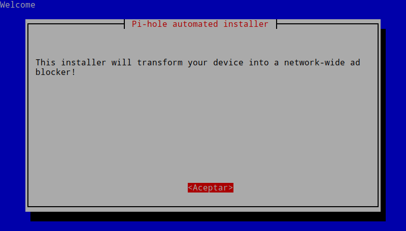](images/bienvenida-instalador-pi-hole.png)

Seguidamente se nos invitará a realizar una donación a los desarrolladores del proyecto.

[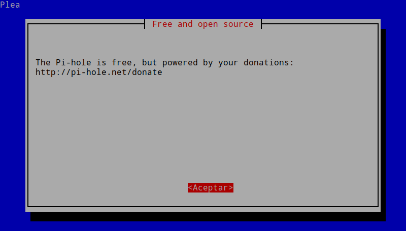](images/donacion-al-proyecto-pi-hole.png)

En la tercera pantalla se nos advertirá que nuestro ordenador o Raspberry Pi precisa de una IP estática para funcionar de forma adecuada.

[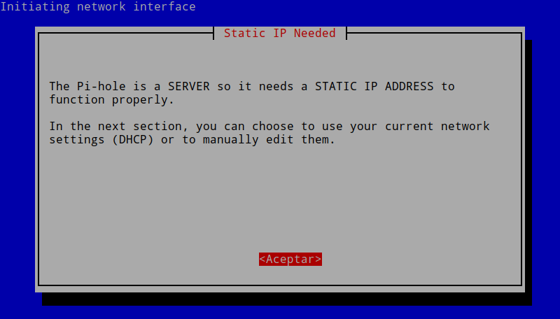](images/necesidad-ip-estatica.png)

Seguidamente tenemos que **seleccionar la interfaz de red** que usa el equipo en que estamos instalando Pi-hole. Como en mi caso estoy usando la red wifi selecciono la opción **wlan0** y presiono la tecla Enter.

[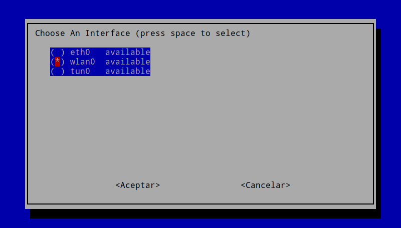](images/seleccionar-interfaz-red-pi-hole.png)

En el siguiente paso deberemos **seleccionar los servidores DNS que queremos** que use Pi-hole para resolver las peticiones DNS. En mi caso selecciono los servidores de **OpenDNS** y presiono la tecla Enter.

[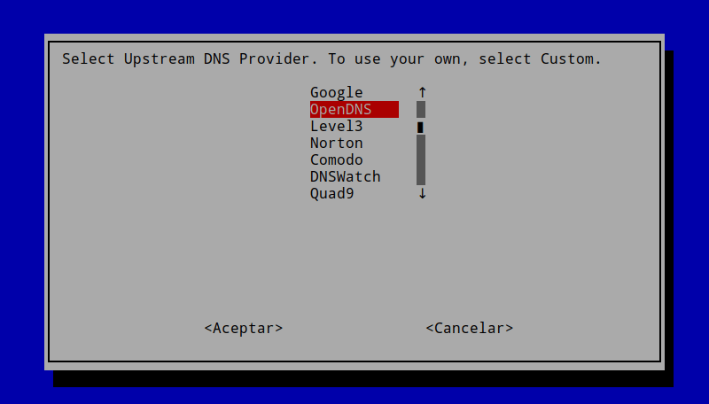](images/seleccionar-los-servidores-dns.png)

###### Nota: Utilizo los servidores de OpenDNS porque son los que me parecen más respetuosos con la privacidad de los usuarios. Si en un futuro queremos cambiar los DNS que elegimos en la instalación lo podremos realizar fácilmente mediante el panel de administración web.

A continuación deberemos **seleccionar los protocolos de internet en que queremos filtrar el contenido** y bloquear la publicidad. Como podemos ver, en nuestro caso seleccionaremos tanto **IPv4** como **IPv6** y presionaremos Enter.

[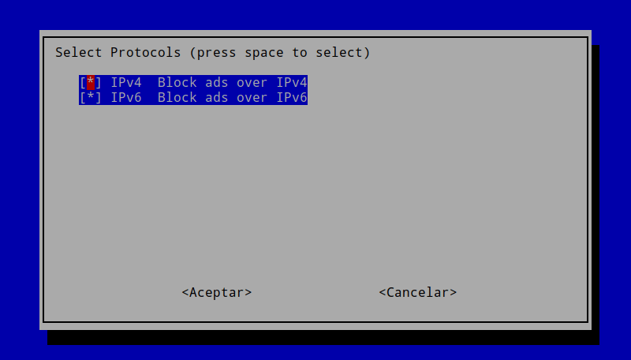](images/protocolos-filtrado-contenido.png)

En la siguiente pantalla se nos pregunta si queremos que la IP 192.168.1.200 sea la IP de fija de Pi-hole. En nuestro caso seleccionamos la opción **Sí** y presionamos Enter.

[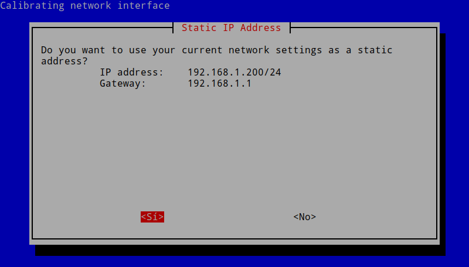](images/confirmacion-ip-estatica.png)

###### Nota: En mi caso puedo seleccionar la opción Sí. El motivo es que en apartados anteriores configure el servidor DHCP de mi router para que asigne la IP 192.168.1.200 al dispositivo en que estamos instalando Pi-hole.

Seguidamente veremos un mensaje de advertencia. El mensaje nos advierte que es posible que nuestro Router asigne la IP 192.168.1.200 de Pi-hole a otro dispositivo. Como he configurado correctamente el servidor DHCP de mi router no tengo que preocuparme y tan solo tenemos que presionar en **Aceptar** para seguir adelante.

[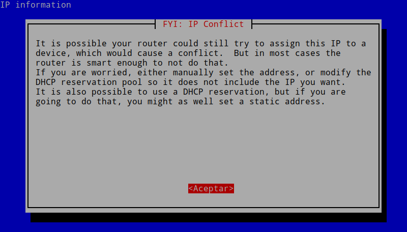](images/advertencia-conflicto-ip.png)

A continuación seleccionamos la opción **On** y presionamos Enter. De esta forma instalaremos una interfaz web que nos será útil para monitorizar y consultar los logs de Pi-hole, modificar la configuración, monitorizar el rendimiento de nuestro dispositivo, etc.

[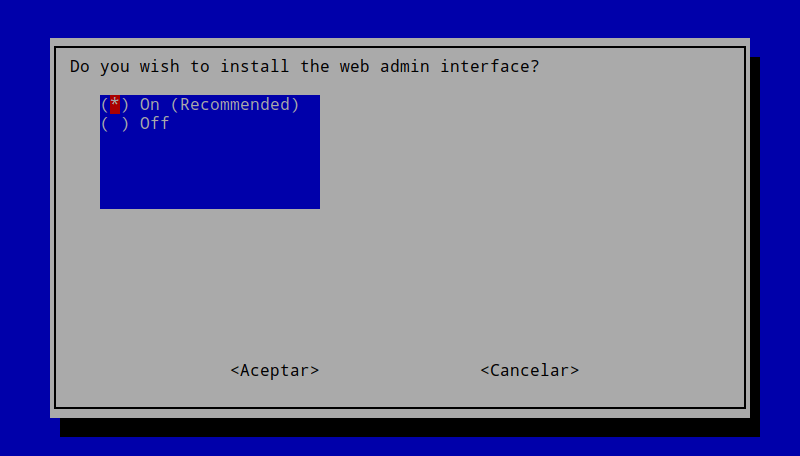](images/instalacion-interfaz-web.png)

Finalmente seleccionamos la opción **On** y presionamos Enter. De este modo guardaremos un registro de logs de las peticiones DNS aceptadas y rechazadas.

[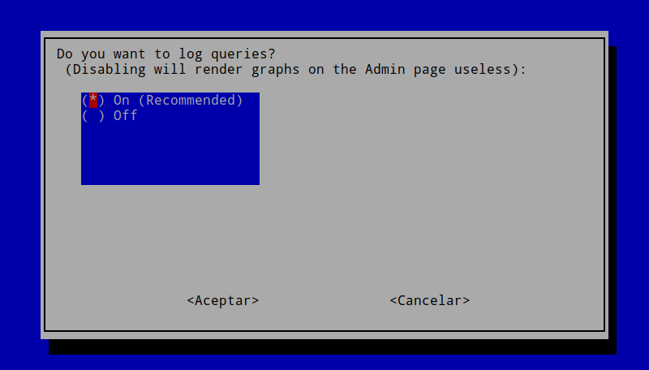](images/registro-peticiones-dns.png)

Una vez definidas las opciones de configuración se procederá a la instalación de los paquetes necesarios para que Pi-hole funcione de forma adecuada. Una vez finalizada la instalación lean y revisen la totalidad de mensajes de la terminal para asegurar que no hayan errores durante el proceso instalación.

[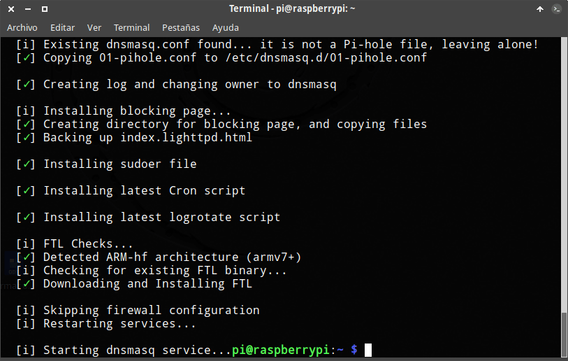](images/inicio-instalacion-pi-hole.png)

## CONFIGURAR PI-HOLE

En estos momentos Pi-Hole tiene que estar activo y funcionando sin ningún tipo de problema. Lo único que nos falta es configurarlo a nuestra medida del siguiente modo:

### Fijar una contraseña de administrador

El primer paso para configurar Pi-hole es fijar una contraseña para acceder al panel de administración. Para ello ejecutamos el siguiente comando en la terminal:

> ```
> pi@raspberrypi:~ $ pihole -a -p
>  Enter New Password (Blank for no password):
>  Confirm Password:
>  [✓] New password set
> ```

Después de ejecutar el comando escribimos la que queremos que sea nuestra contraseña y presionamos la tecla Enter. Acto seguido reiniciamos nuestro dispositivo ejecutando el siguiente comando en la terminal:

> ```
> sudo reboot
> ```

### Acceder al panel de administrador

Desde cualquier equipo conectado a nuestra red local podemos acceder a la interfaz web para administrar de forma gráfica Pi-hole.

Para acceder el panel de administración ingresamos la siguiente URL en el navegador y presionamos la tecla Enter:

> ```
> http://192.168.1.200/admin/
> ```

###### Nota: En vuestro caso tendréis que reemplazar 192.168.1.200 por la ip del dispositivo en el que habéis instalado Pi-hole.

Acto seguido les aparecerá el panel de administración en el que podrán administrar Pi-hole.

[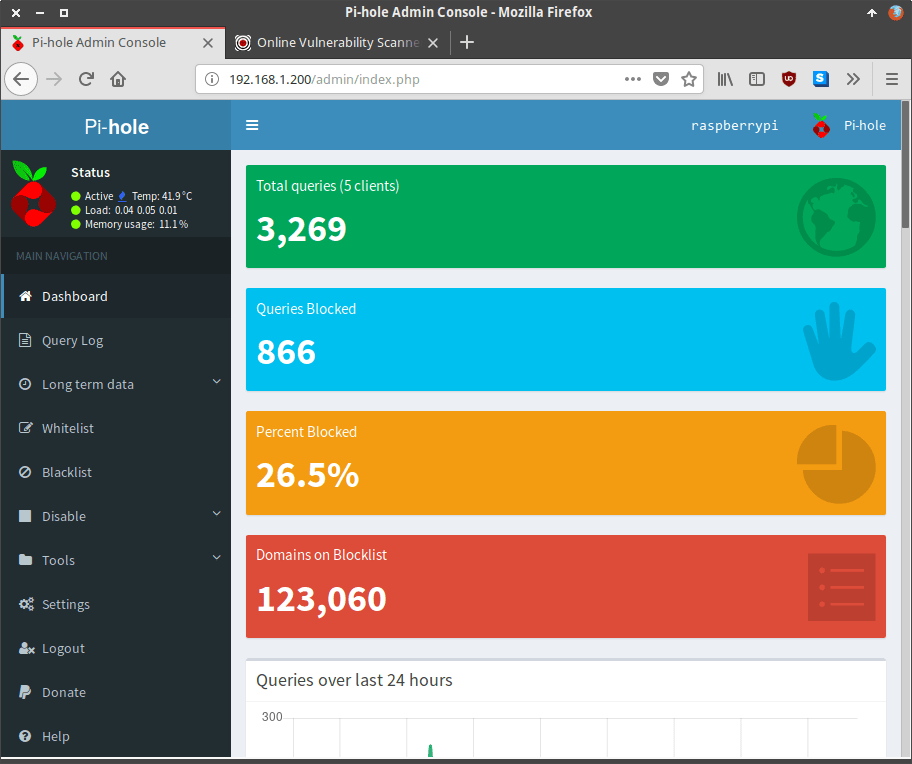](images/panel-de-admnistracion-de-pihole.png)

###### Nota: Dentro del panel de administración podrán configurar multitud de parámetros de forma totalmente intuitiva.

### Actualizar las listas para filtrar y bloquear los anuncios

En la ubicación /etc/cron.d/pihole hay configurado un cronjob que actualiza nuestras listas de bloqueo de forma automática. En mi caso la actualización se realiza todos los domingos a las 3h y 6 minutos de la madrugada.

Si alguna vez queremos realizar una actualización manual tenemos dos opciones.

La primera de ellas es ejecutar el siguiente comando en la terminal del dispositivo que tiene instalado pi-hole:

> ```
> pihole -g
> ```

La segunda opción es accediendo al panel de administración web. En el panel de administración clican sobre el menú **Tools**. Cuando se despliegue el submenú clican en **Update Lists**. Finalmente clican en la opción **Update Lists** y se actualizaran la totalidad de listas a que estamos suscritos.

[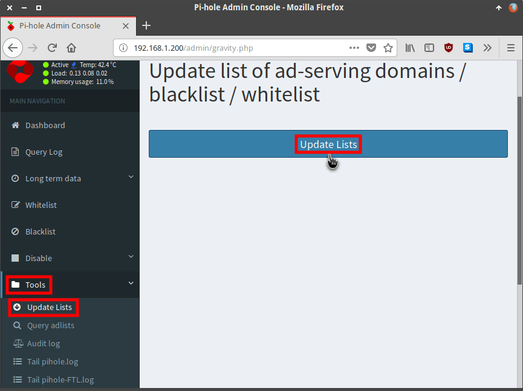](images/Actualizar-filtros-pi-hole.png)

### Añadir filtros o listas adicionales a Pi-hole

Los filtros de serie bloquean prácticamente la totalidad de los anuncios. No obstante si queremos podemos añadir más filtros. A continuación tienen una serie de URL en la que podrán encontrar infinidad de filtros que pueden aplicar:

[https://github.com/StevenBlack/hosts](https://github.com/StevenBlack/hosts)

[https://discourse.pihole.net/t/i-concatenated-every-blocklist-i-could-find/5184/13](https://discourse.pi-hole.net/t/i-concatenated-every-blocklist-i-could-find/5184/13)

[https://wally3k.github.io/](https://wally3k.github.io/)

[https://github.com/pihole/pihole/wiki/Customising-sources-for-ad-lists](https://github.com/pi-hole/pi-hole/wiki/Customising-sources-for-ad-lists)

No recomiendo añadir más filtros de los que son estrictamente necesarios. Cuando más filtros añadamos más carga de trabajo tendrá el dispositivo que tiene instalado Pi-Hole.

Primero entramos en una de las páginas web que he recomendado. A continuación accedemos dentro de una las listas.

[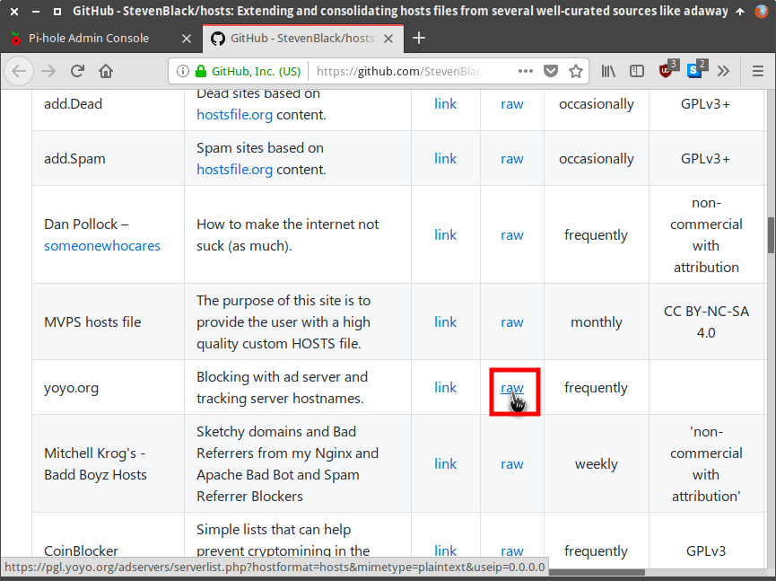](images/acceder-dentro-lista-de-bloqueo.png)

Una vez dentro de la lista copiamos su URL.

[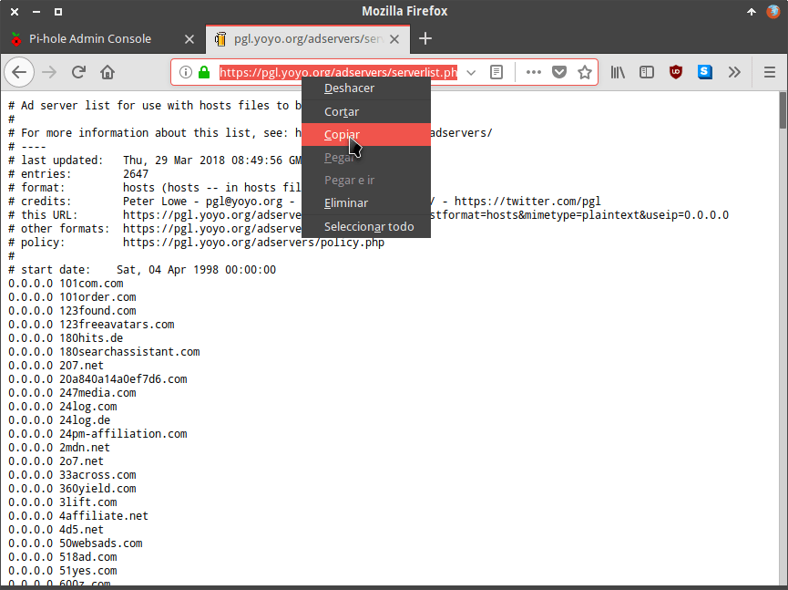](images/copiar-url-de-la-lista.png)

A continuación accedemos a la interfaz web de Pi-hole. Una vez dentro clican sobre el menú **Settings**. Seguidamente clican sobre el apartado **Block Lists**.

[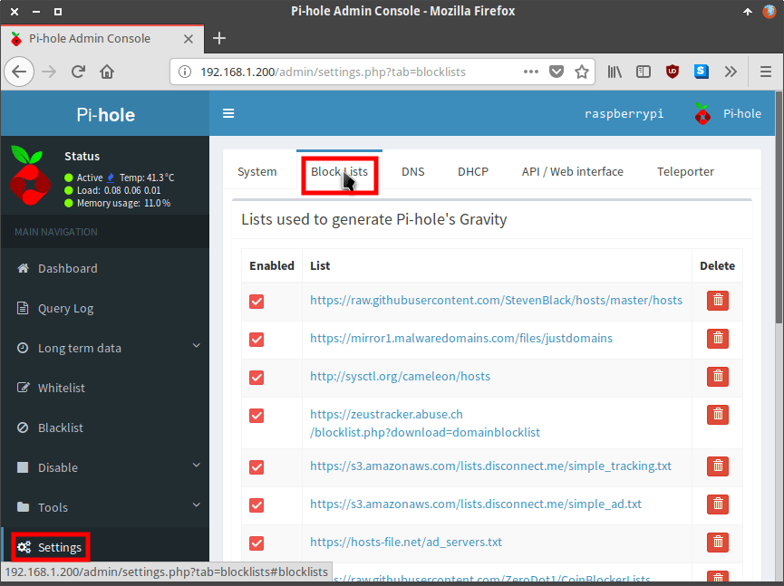](images/acceder-listas-bloqueo.png)

Finalmente pegan la URL de la lista en el sitio correspondiente y presionan encima del botón **Save and Update**.

[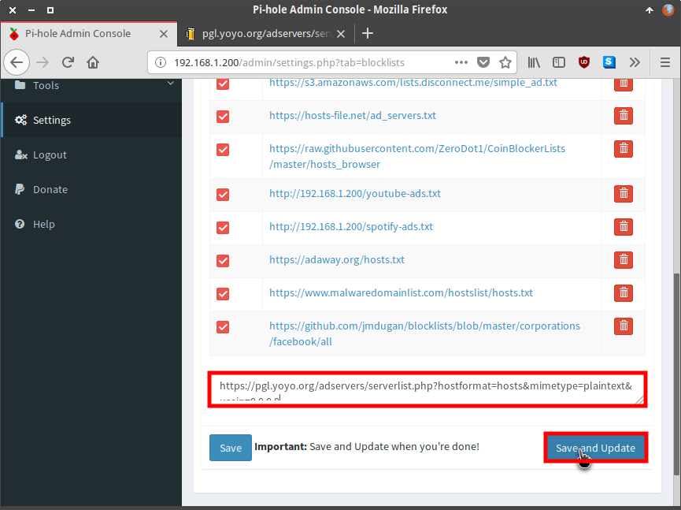](images/añadir-y-actualizar-listas.png)

De esta forma tan simple podremos añadir más listas y seremos capaces de bloquear más contenido.

###### Nota: Si quieren pueden consultar las listas que usan uBlock o Adblock Plus y añadirlas a su Pi-hole.

## RESOLUCIÓN DE PROBLEMAS QUE SE PUEDEN ENCONTRAR

Los usuarios que instalen Pi-hole en sistemas operativos como Raspbian Jessie tendrán problemas y Pi-hole sencillamente no funcionará. Algunos de los problemas que se encontrarán son los siguientes:

### Resolución de problemas con Dnsmasq

La versión 3.3 de Pi-hole precisa de una versión de DNSmasq igual o superior a la 2.76. Por lo tanto la última versión de Pi-Hole es posible que no funcione en sistemas operativos como Raspbian Jessie. Para solucionar este problema instalaremos la versión 2.76 de DNSmasq del siguiente modo:

Inicialmente descargaremos los paquetes necesarios para actualizar DNSmasq ejecutando los siguientes comandos en la terminal:

> ```
> wget https://archive.raspberrypi.org/debian/pool/main/d/dnsmasq/dnsmasq-base_2.76-5+rpi1_armhf.deb
> ```
> 
> ```
> wget https://archive.raspberrypi.org/debian/pool/main/d/dnsmasq/dnsmasq_2.76-5+rpi1_all.deb
> ```

A continuación instalaremos las dependencias necesarias para asegurar el funcionamiento de DNSmasq. Para ello ejecutaremos el siguiente comando en la terminal:

> ```
> sudo apt-get install libnetfilter-conntrack3 libmnl0
> ```

Finalmente instalaremos la nueva versión de Dnsmasq ejecutando los siguientes comandos en la terminal:

> ```
> sudo dpkg -i dnsmasq-base_2.76-5+rpi1_armhf.deb
> ```
> 
> ```
> sudo dpkg -i dnsmasq_2.76-5+rpi1_all.deb
> ```

Ahora tan solo tenemos que reiniciar la Raspberry Pi ejecutando el siguiente comando:

> ```
> sudo reboot
> ```

A partir de ahora todo debería funciona a la perfección.

### Solucionar problemas con la medición de la temperatura y la carga del servidor

Otro de los problemas que nos podemos encontrar es que la interfaz de administración web no mida la temperatura y carga de nuestro servidor:

[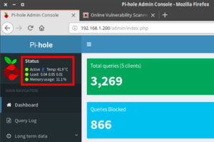](images/medicion-carga-y-temperatura.png)

Para solucionar este problema lo único que tenemos que realizar es habilitar el servicio pihole-FTL. Para iniciarlo tan solo tenemos que ejecutar el siguiente comando en la terminal:

> ```
> sudo service pihole-FTL start
> ```

## COMO CONFIGURAR NUESTRO DISPOSITIVO PARA QUE USAR PI-HOLE

A estas alturas Pi-hole tiene que estar correctamente instalado y configurado. Ahora tan solo falta configurar nuestros equipos para que hagan uso de Pi-Hole. Para ello en un futuro cercano publicaré otro artículo en el que detallaré paso por paso como hacerlo.

###### Nota: El procedimiento detallado en este artículo se ha realizado en una Raspberry Pi. No obstante, el proceso de instalación y configuración también debería ser válido para otras distros Linux como Ubuntu o Debian.
