A continuación veremos los pasos a seguir para montar un servidor torrent de de forma fácil y sencilla en una raspberry pi. Pero antes veremos una pequeña introducción porque es interesante hacerlo en una raspberry Pi y no en un ordenador.<!--more-->

## RAZONES PARA MONTAR UN SERVIDOR TORRENT EN LA RASPERRY PI

El principal motivo para montar nuestro servidor torrent en una Rasperry Pi es el consumo energético.

El consumo energético de los distintos modelos de Raspberry Pi son los siguientes:

    
|   **Raspberry Pi 1 Modelo A**   |   **Raspberry Pi 1 Modelo B**   |   **Raspberry Pi 1 Modelo B+**   |   **Raspberry Pi 2 Modelo B**   |   **Raspberry Pi 3 Modelo B**   |
| --- | --- | --- | --- | --- |
|   800 mA, (4.0 W)   |   700 mA, (3.5 W)   |   600 mA, (3.0 W)   |   800 mA, (4.0 W)   |   800 mA, (4.0 W)   |

**Fuente:** [https://es.wikipedia.org/wiki/Raspberry\_Pi](https://es.wikipedia.org/wiki/Raspberry_Pi "Datos del consumo energético de una Raspberry Pi")

Los datos de la tabla son considerando consumos energéticos máximos. En el caso que la Raspberry Pi esté en reposo o realice tareas poco pesadas el consumo será mucho menor.

Como pueden ver el consumo máximo de una Raspberry Pi es de unos 4W, mientras que el de un ordenador trabajando a pleno rendimiento puede llegar a consumir alrededor de unos 300W o más.

Si quieren más información sobre el consumo energético de la Raspberry Pi pueden consultar el siguiente [enlace](http://raspi.tv/2017/how-much-power-does-pi-zero-w-use "Datos sobre el consumo energético de una Raspberry Pi").

Otros motivos más secundarios para usar una Raspberry pi como servidor Torrent son los siguientes:

1. Los ordenadores que estan en habitaciones pequeñas acostumbran a ser una fuente de calor importante en verano. En verano toda fuente de calor es molesta.
2. Prácticamente no ocupa espacio y no precisa de ningún monitor para su funcionamiento.
3. Aparte de usar la Raspberry Pi como servidor torrent la podemos usar como servidor DLNA. De este modo podemos reproducir archivos de vídeo y audio en nuestro televisor sin ningún tipo de problema.

## AÑADIR UN MEDIO DE ALMACENAMIENTO A NUESTRA RASPBERRY PI

Para montar un servidor torrent es interesante añadir un disco duro de gran capacidad a nuestra Raspberry Pi. Un pendrive de alta capacidad también puede ser una excelente alternativa ya que su consumo es mucho menor.

### Formatear el disco duro o pendrive

El primer paso que debemos hacer es [formatear el disco duro o pendrive](). En mi caso lo formatearé con el formato NTFS. Selecciono este formato porque es funcional en prácticamente la totalidad de sistemas operativos.

Una vez formateado el disco duro ya lo podemos enchufar a nuestra Raspberry Pi.

Recuerden que si quieren usar el formato de archivos NTFS tienen que instalar el paquete ntfs-3g. Para ello tan solo tienen que ejecutar el siguiente comando en la terminal de su Raspberry Pi:

> ```
> sudo apt-get install ntfs-3g
> ```

### Averiguar el nombre con que se reconoce nuestro dispositivo de almacenamiento

Seguidamente tenemos que averiguar el nombre con que se reconoce el disco duro o pendrive que acabamos de enchufar. Para ello ejecuto el siguiente comando en la terminal:

> ```
> sudo fdisk -l
> ```

El resultado obtenido es el siguiente:

|   Device                   Boot    Start          End           Sectors      Size     Id     Type /dev/mmcblk0p1              8192        2474609    2466418    1,2G    e      W95 FAT16 (LBA) /dev/mmcblk0p2              2474610  31422463  28947854  13,8G  5      Extended /dev/mmcblk0p5              2482176  2547709    65534        32M    83    Linux /dev/mmcblk0p6              2547712  2682879    135168      66M    c      W95 FAT32 (LBA) /dev/mmcblk0p7              2686976  31422463  28735488  13,7G  83    Linux  Disk /dev/sda: 14,5 GiB, 15512174592 bytes, 30297216 sectors Units: sectors of 1 \* 512 = 512 bytes Sector size (logical/physical): 512 bytes / 512 bytes I/O size (minimum/optimal): 512 bytes / 512 bytes Disklabel type: dos Disk identifier: 0x4637499f  Device             Boot   Start    End              Sectors       Size       Id     Type /dev/sda1                   63        30296447  30296385  14,5G     7      HPFS/NTFS/exFAT |
| --- |

De forma muy fácil vemos que nuestro dispositivo de almacenamiento se reconoce como /dev/sda1. Es fácil de identificar porque conozco el tamaño del disco duro y porque es el único sistema de archivos NTFS existente.

### Crear la carpeta dónde se montará nuestro disco duro

A continuación tenemos que crear la carpeta donde montaremos nuestro disco duro. En mi caso quiero montar mi disco duro en la carpeta /media/downloads. Por lo tanto ejecutaré el siguiente comando en la terminal:

> ```
> sudo mkdir /media/downloads
> ```

### Montar la carpeta de descargas al iniciar nuestra Raspberry Pi

El siguiente paso consiste en que cada vez que se arranque nuestra Raspberry se automonte el disco duro de descargas. Para ello editaremos el fichero /etc/fstab ejecutando el siguiente comando en la terminal:

> ```
> sudo nano /etc/fstab
> ```

Una vez se abra el editor de textos nano añadiremos una línea del siguiente tipo al final del fichero:

> ```
> nombre del disco duro /media/carpeta_de_montaje ntfs-3g defaults 0 0
> ```

Como nuestro disco duro es reconocido como /dev/sda1 y se montará en la carpeta /media/downloads, el comando a pegar en mi caso será el siguiente:

> ```
> /dev/sda1 /media/downloads ntfs-3g defaults 0 0
> ```

Una vez realizadas las modificaciones tan solo tenemos que guardar los cambios, cerrar el fichero y reiniciar nuestra Raspberry Pi.

###### Nota: Para reiniciar la Raspberry Pi pueden utilizar el comando sudo reboot.

## CREAR LAS CARPETAS DONDE SE DESCARGARAN LOS TORRENT

Después de reiniciar nuestra Raspberry Pi el disco duro ya estará montado. Por lo tanto ahora podemos crear las carpetas donde se descargaran nuestros archivos.

En mi caso quiero que les descargas parciales se almacenen en la carpeta /media/downloads/incompletos. También quiero que las descargas finalizadas se guarden en la carpeta /media/downloads/finalizados. Por lo tanto ejecutaré los siguientes comandos en la terminal:

> ```
> mkdir /media/downloads/finalizados
> ```
> 
> ```
> mkdir /media/downloads/incompletos
> ```

A continuación ya podemos empezar con la instalación del servidor.

## INSTALAR EL SERVIDOR TORRENT TRANSMISSION

Inicialmente actualizaremos los repositorios de nuestra distro. Para ello ejecutamos el siguiente comando en la terminal:

> ```
> sudo apt-get update
> ```

Seguidamente ejecutamos el siguiente comando para actualizar el sistema operativo:

> ```
> sudo apt-get dist-upgrade
> ```

A continuación instalamos el demonio de transmission ejecutando el siguiente comando en la terminal:

> ```
> sudo apt-get install transmission-daemon
> ```

Una vez instalado el demonio lo detenemos ejecutando el siguiente comando en la terminal:

> ```
> sudo /etc/init.d/transmission-daemon stop
> ```

Con el demonio inactivo iniciaremos la configuración de nuestro servidor torrent.

## CONFIGURAR EL SERVIDOR TORRENT

Seguidamente editamos el fichero de configuración de Transmission ejecutando el siguiente comando en la terminal:

> ```
> sudo nano /etc/transmission-daemon/settings.json
> ```

Dentro del fichero de configuración, como mínimo configuraremos los siguientes parámetros:

|   "cache-size-mb": 10, “download-dir": "/media/downloads/finalizados", "incomplete-dir": "/media/downloads/incompletos", "incomplete-dir-enabled": true, "peer-port": 51413, "preallocation": 2, "rpc-enabled": true, "rpc-password": "contraseña", "rpc-port": 9091, "rpc-username": "nombre\_usuario", "rpc-whitelist": "127.0.0.1,192.168.1.\*,10.8.0.\*", "rpc-whitelist-enabled": true, "umask": 2,   |
| --- |

###### Nota: En función de nuestro propósito se pueden añadir/modificar muchos más parámetros del fichero de configuración. Pueden consultar el siguiente enlace para conocer más acerca de los [parámetros de configuración](https://github.com/transmission/transmission/wiki/Editing-Configuration-Files "Explicación de los parámetros de configuración de Transmission") de Transmission.

###### Nota: Los parámetros de configuración en color rojo son los que deberéis modificar en función de vuestras necesidades.

Cada uno de los parámetros que acabamos de ver tienen el siguiente significado:

 
|   **Parámetro**   |   **Significado**   |
| --- | --- |
|   "cache-size-mb": 10,   |   Se establece que el tamaño de memoria cache de transmission es de 10 MB. Cuanto más grande sea la memoria cache asignada, menos accesos se tendrá que hacer a nuestro disco duro, pero mayor será el consumo de memoria RAM.   |
|   “download-dir": "/media/downloads/finalizados",   |   Definimos el directorio que almacenera los ficheros una vez finalizada la descarga.   |
|   "incomplete-dir": "/media/downloads/incompletos",   |   Definimos el directorio que almacenará las descargas parciales o incompletas.   |
|   "incomplete-dir-enabled": true,   |   Activamos la carpeta incompletos. De este modo los Torrent se descargan en la carpeta incompletos. Cuando el Torrent se haya descargado por completo se trasladará a la carpeta finalizados.   |
|   "peer-port": 51413,   |   Definimos que el puerto que usará nuestro servidor de Torrent es el 51413. |
|   "preallocation": 2,   |   Podemos seleccionar los valores 0,1,2. Seleccionamos 2 porque minimizará la fragmentación de nuestro sistema de archivos.   |
|   "rpc-enabled": true,   |   Definimos el valor true para habilitar el acceso al servidor de torrent vía web   |
|   "rpc-password": "contraseña",   |   Definición de la contraseña que usaremos para conectarnos de forma remota a nuestro servidor de torrent. Una vez escrita, transmission aplicará un hash a nuestra contraseña para ocultarla.   |
|   "rpc-port": 9091,   |   Definimos que el puerto que usaremos para conectarnos a la interfaz web es el 9091. |
|   "rpc-username": "nombre\_usuario",   |   Definición del nombre de usuario para conectarnos de forma remota a nuestro servidor torrent.   |
|   "rpc-whitelist": "127.0.0.1,192.168.1.\*,10.8.0.\*",   |   Definimos el rango de direcciones IP que tendrán acceso a gestionar nuestro servidor torrent. Con los rangos seleccionados me podré conectar remotamente al servidor desde mi red local, desde la Raspberry Pi y desde el exterior siempre y cuando con anterioridad me haya conectado a mi servidor VPN.   |
|   "rpc-whitelist-enabled": true,   |   Habilitamos la característica que únicamente un determinado rango de IP puedan conectarse remotamente al servidor Torrent. En el caso de elegir false, todo el mundo se podría conectar al servidor torrent sin necesidad de introducir ningún usuario ni contraseña   |
|   "umask": 2,   |   Establecemos los permisos de los archivos descargados. Seleccionando el valor de 2, los archivos descargados tendrán los permisos 644 y los directorios 755. Si queremos que todo el mundo tenga permisos de lectura, escritura y ejecución, en vez del valor 2 deberemos seleccionar el valor 0   |

A continuación os muestro el contenido de mi fichero de configuración /etc/transmission-daemon/settings.json. Es posible que a alguien le pueda ayudar

|   { "alt-speed-down": 50, "alt-speed-enabled": false, "alt-speed-time-begin": 540, "alt-speed-time-day": 127, "alt-speed-time-enabled": false, "alt-speed-time-end": 1022, "alt-speed-up": 50, "bind-address-ipv4": "0.0.0.0", "bind-address-ipv6": "::", "blocklist-enabled": false, "blocklist-url": "http://www.example.com/blocklist", "cache-size-mb": 10, "dht-enabled": true, "download-dir": "/media/downloads/finalizados", "download-queue-enabled": true, "download-queue-size": 5, "encryption": 1, "idle-seeding-limit": 30, "idle-seeding-limit-enabled": false, "incomplete-dir": "/media/downloads/incompletos", "incomplete-dir-enabled": true, "lpd-enabled": false, "message-level": 1, "peer-congestion-algorithm": "", "peer-id-ttl-hours": 6, "peer-limit-global": 200, "peer-limit-per-torrent": 50, "peer-port": 51413, "peer-port-random-high": 65535, "peer-port-random-low": 49152, "peer-port-random-on-start": false, "peer-socket-tos": "default", "pex-enabled": true, "port-forwarding-enabled": true, "preallocation": 2, "prefetch-enabled": 1, "queue-stalled-enabled": true, "queue-stalled-minutes": 30, "ratio-limit": 2, "ratio-limit-enabled": false, "rename-partial-files": true, "rpc-authentication-required": true, "rpc-bind-address": "0.0.0.0", "rpc-enabled": true, "rpc-password": "contraseña", "rpc-port": 9091, "rpc-url": "/transmission/", "rpc-username": "usuario", "rpc-whitelist": "127.0.0.1,192.168.1.\*,10.8.0.\*", "rpc-whitelist-enabled": false, "scrape-paused-torrents-enabled": true, "script-torrent-done-enabled": false, "script-torrent-done-filename": "", "seed-queue-enabled": false, "seed-queue-size": 10, "speed-limit-down": 100, "speed-limit-down-enabled": false, "speed-limit-up": 100, "speed-limit-up-enabled": false, "start-added-torrents": true, "trash-original-torrent-files": false, "umask": 2, "upload-slots-per-torrent": 14, "utp-enabled": true }   |
| --- |

## OTORGAR LOS PERMISOS NECESARIOS A NUESTRO USUARIO

En mi caso uso mi Raspberry Pi con el usuario pi. Para asegurar no tener ningún tipo de problema al usar mi servidor torrent añadiré el usuario pi al grupo debian-transmission. Para ello ejecutaré el siguiente comando en la terminal:

> ```
> sudo usermod -a -G pi debian-transmission
> ```

Para no tener problemas de permisos de escritura en mi disco NTFS añadiré el usuario debian-transmission al grupo plugdev. Para ello ejecutaré el siguiente comando en la terminal:

> ```
> sudo usermod -g plugdev debian-transmission
> ```

## HACER QUE NUESTRA RASPBERRY PI DISPONGA DE UNA IP FIJA

Para poder acceder fuera y dentro de nuestra red local es importante que nuestro servidor de Torrent disponga de una IP fija.

Les recomiendo que sigan las instrucciones del siguiente enlace para poder [disponer de una IP fija](). Si siguen las instrucciones pertinentes vuestra Raspberry Pi tendrá la IP Fija 192.168.1.200.

## ABRIR LOS PUERTOS DEL SERVIDOR TORRENT AL ROUTER

En el archivo de configuración hemos definido que el puerto que usará nuestro servidor de Torrent es el 51413. Este puerto lo hemos definido mediante el siguiente parámetro:

> ```
> "peer-port": 51413,
> ```

Por lo tanto ahora deberemos abrir el puerto 51413 en nuestro Router. En el caso de disponer de un Router Comtrend los pasos a seguir serán similares a los siguientes:

Inicialmente abriremos nuestro navegador, teclearemos la puerta de entrada de nuestro router y presionaremos la tecla Enter. Una vez realizado esto, tal y como se puede ver en la captura de pantalla, se abrirá una ventana que nos pedirá el nombre de usuario y contraseña de nuestro router:

[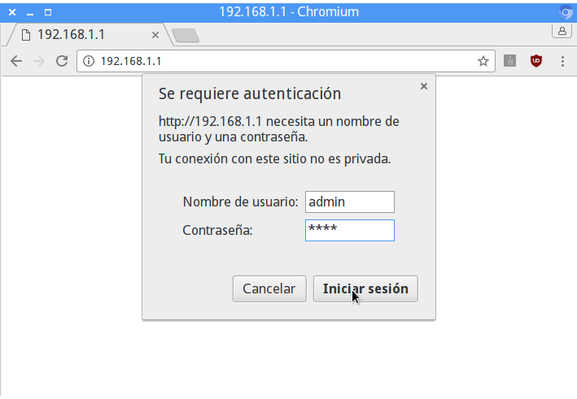](images/entrar-configuración-router.png)

Una vez introducida la información accederemos a la configuración de nuestro router. Seguidamente, tal y como se puede ver en la captura de pantalla, tenemos que acceder a los menús Advanced / NAT / Virtual Servers y presionar el botón Add.

[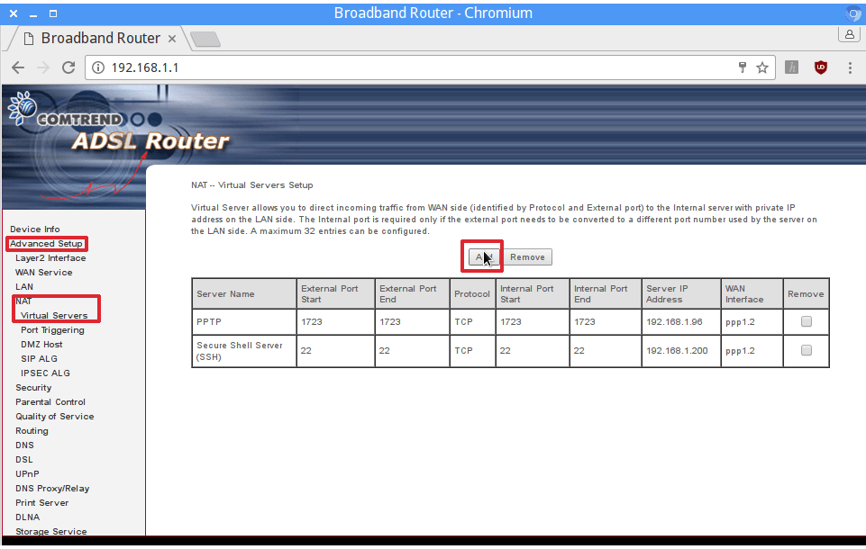](images/anadir-puerto-servidor-torrent.png)

En en el campo custom server hay que escribir un nombre cualquiera. En mi caso como se puede ver en la captura de pantalla he escrito Transmission.

Seguidamente en el campo Server IP Address tenemos que escribir la IP del servidor torrent. En mi caso he configurado que nuestro servidor tenga la IP estática 192.168.1.200. Por lo tanto en este campo debo escribir la IP 192.168.200.

En mi caso quiero que el servidor torrent funcione en el puerto 51413. Por lo tanto, tal y como se puede ver en la captura de pantalla, seleccionamos el protocolo TCP/UDP y escribimos el puerto de nuestro servidor torrent en los puertos internos y externos.

Presionamos el botón Apply/Save y de esta forma nuestro servidor torrent estará totalmente operativo.

[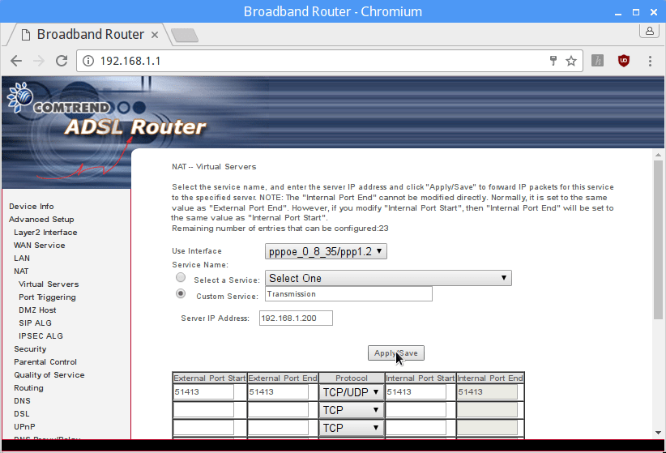](images/abriendo-puerto-servidor-torrent.png)

## INICIAR EL SERVIDOR TORRENT

En estos momentos el trabajo ya está hecho. Ahora tan solo tenemos que iniciar el servidor. Para ello ejecutaremos el siguiente comando en la terminal:

> ```
> sudo /etc/init.d/transmission-daemon start
> ```

A partir de estos momentos nuestro servidor torrent ya está 100% operativo. Para usarlo tan solo tenemos que seguir las instrucciones que veremos a continuación.

## CONECTARSE DE FORMA REMOTA AL SERVIDOR EN NUESTRA RED LOCAL

La gestión de nuestro servidor torrent se puede realizar sin problemas en prácticamente la totalidad de sistemas operativos existentes. Para ello tan solo tenemos que seguir las siguientes indicaciones.

### Descargar y gestionar nuestros torrent mediante cualquier navegador web

Mediante cualquier navegador web podemos gestionar nuestro servidor torrent. Para ello tenemos que tener en cuenta 2 datos importantes:

1. Tenemos que saber **la IP de nuestra servidor de Torrent**. En apartados anteriores hemos definido que la IP de nuestro servidor sea la 192.168.1.200
2. Hay que saber **el puerto en que está escuchando la interfaz web** de nuestro servidor de Torrent. En el fichero de configuración, mediante el codigo "rpc-port": 9091, hemos definido que este puerto es el 9091.

Una vez conocidos estos datos, en la barra de direcciones del navegador escribimos la siguiente dirección y presionamos Enter.

> ```
> http://192.168.1.200:9091
> ```

Justo después tendremos que escribir el usuario y la contraseña que definimos en el fichero de configuración.

[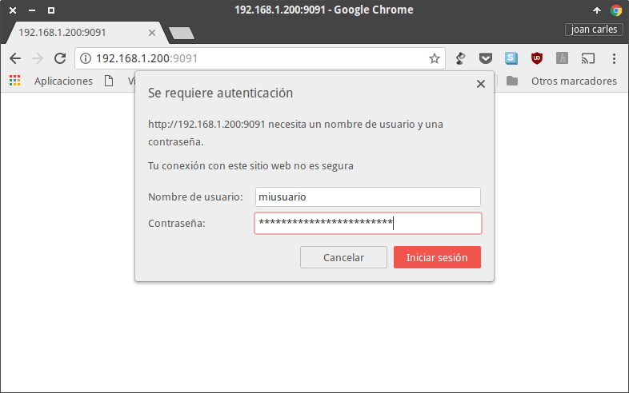](images/acceder-al-servidor-torrent-via-web.png)

Finalmente ya podremos añadir, gestionar y añadir descargas a nuestro servidor torrent. Para ello tenemos que seguir los siguientes pasos:

1. Clicamos encima del icono de la carpeta.
2. Seguidamente se abrirá una ventana que nos ofrecerá 2 opciones. La primera es indicar la URL en que se halla el Torrent. La segunda es presionar en el botón Elegir archivos para seleccionar los archivos de torrent que podamos tener localmente en nuestro equipo.
3. En mi caso elijo la primera opción introduciendo la URL para descargar el archivo torrent de Kubuntu. Seguidamente presiono en el botón Upload.

[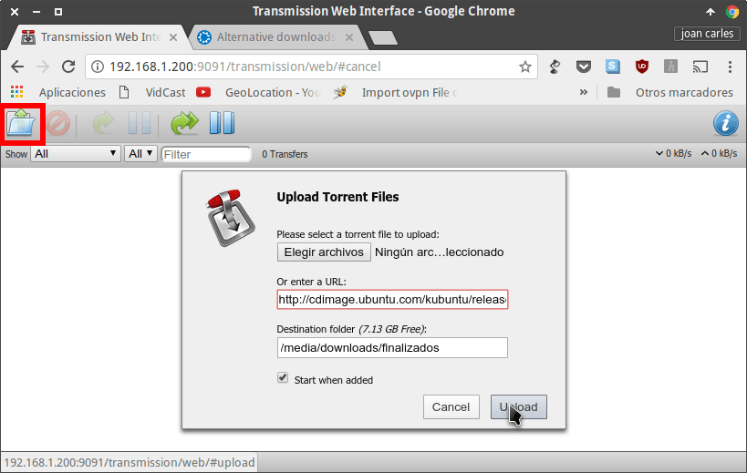](images/anadir-una-descarga-al-servidor-torrent.png)

Justo después empezará la descarga de nuestro archivo Torrent.

[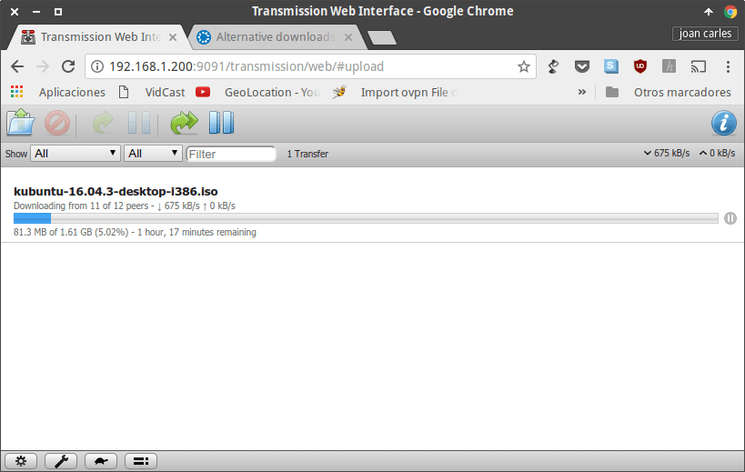](images/descargando-un-torrent.png)

Si os fijáis, la interfaz web también os permitirá cambiar varios parámetros de vuestro servidor de Torrent. Tan solo tenéis que clicar encima del icono de la llave inglesa y podréis modificar los parámetros de descarga que se configuran habitualmente.

[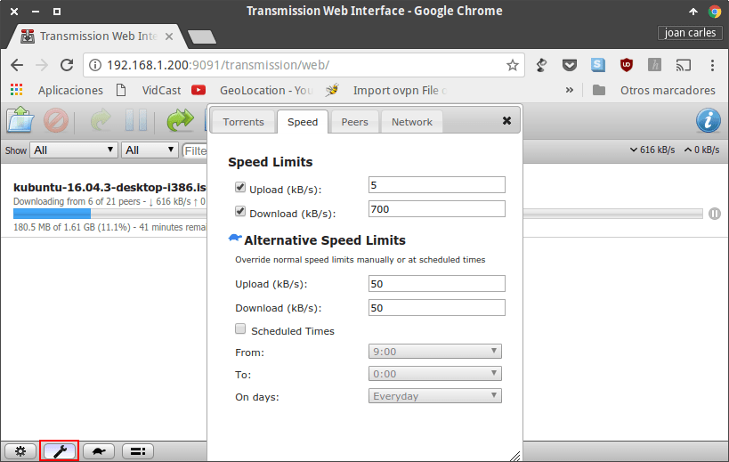](images/configuracion-servidor-torrent-transmission.png)

Aparte del icono de la llave existen otros iconos que os permitirán configurar la totalidad de parámetros que tocáis habitualmente.

### Gestionar el servidor de Torrent mediante aplicaciones móviles en Android

Si no les gusta la interfaz web, los usuarios de Android tenemos la posibilidad de usar aplicaciones móviles.

En Android existen muchas aplicaciones, pero la que a mi me gusta es Transmission Remote. Para instalar la aplicación que menciono pueden usar el siguiente [enlace](https://play.google.com/store/apps/details?id=net.yupol.transmissionremote.app&hl=es "Enlace para descargar la App transmission Remote"):

La primera vez que abran la aplicación les aparecerá la siguiente pantalla en la que deberán presionar sobre el botón Agregar servidor.

[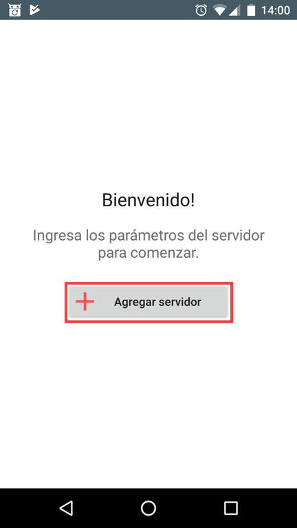](images/agregar-servidor-torrent.png)

A continuación deberán rellenar los datos necesarios para que nos podamos conectar a nuestro servidor torrent. Los datos a rellenar son los siguientes:

1. Poner un nombre identificativo a nuestro servidor de torrent. En mi caso el nombre elegido ha sido raspberry pi.
2. La IP de nuestro servidor. Como hemos visto en el apartado anterior la IP de nuestro servidor es 192.168.1.200.
3. El puerto en que estará escuchando la interfaz web de Transmisson. Como hemos visto en el apartado anterior el puerto es el 9091.
4. El usuario y la contraseña que definimos en el fichero de configuración para poder acceder al servidor.

Una vez introducidos todos tan solo tenemos que presionar encima del botón Aceptar.

[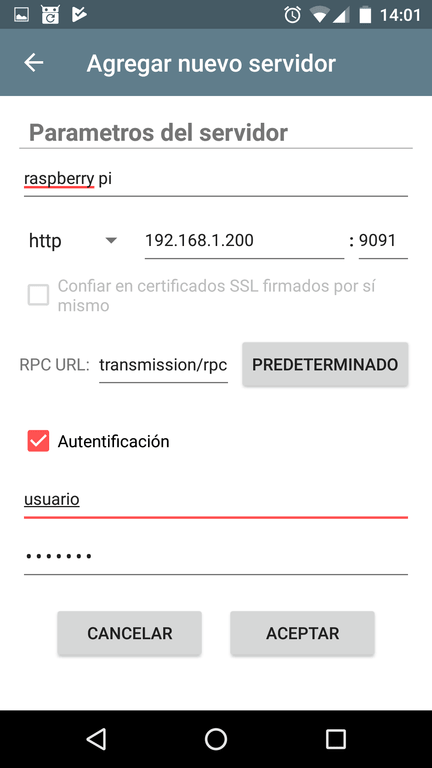](images/datos-conexion-servidor-torrent.png)

A continuación presionamos el botón + que aparecerá en la parte inferior derecha de la pantalla.

[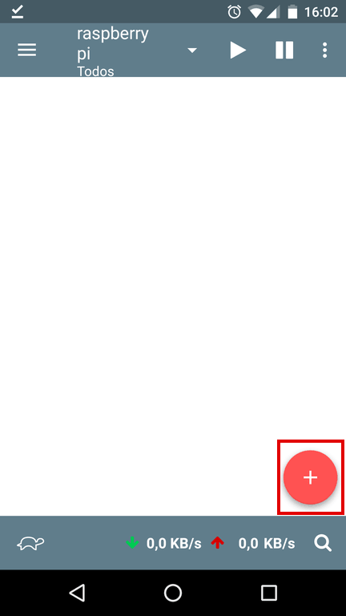](images/agregar-un-torrent-android.png)

Seguidamente podemos elegir el método para añadir el torrent a nuestro servidor. Podemos seleccionar mediante archivo o mediante URL. En mi caso elijo la opción mediante URL.

[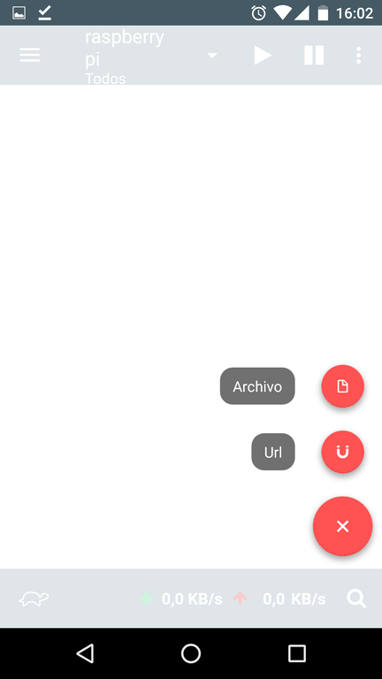](images/agregar-mediante-archivo-u-url.png)

Finalmente pego la dirección URL que contiene el torrent y presiono el botón Abrir.

[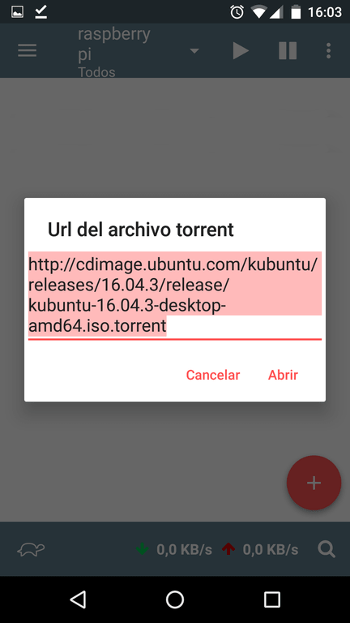](images/url-descarga-torrent.png)

Una vez realizados estos pasos empezará la descarga de nuestro torrent sin ningún tipo de problema.

[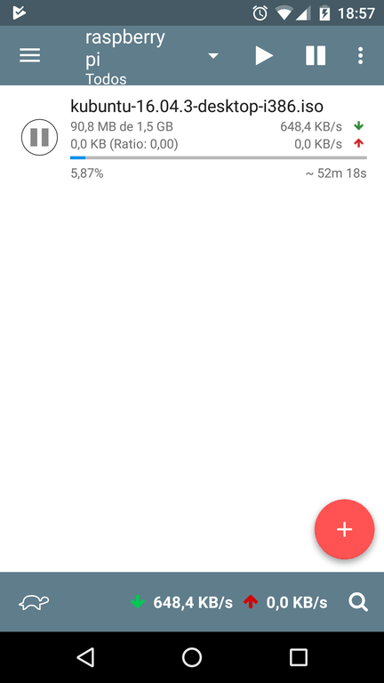](images/descargando-torrent-en-android.png)

Al igual que en la interfaz web, la aplicación de móvil también nos permitirá configurar los parámetros más habituales de nuestro servidor de descargas.

###### Nota: Según mi conocimiento no existen aplicaciones equivalentes para el sistema operativo iOS

## CONECTARSE AL SERVIDOR TORRENT FUERA DE NUESTRA RED LOCAL

Existen varias formas para conectarnos al servidor torrent fuera de nuestra red local.

1. La primera de ellas es mediante un [dominio de redireccionamiento DNS]().
2. La segunda es mediante un servidor VPN.

En este caso he seleccionado la segunda opción por los siguientes motivos:

1. Montar un servidor VPN en una Raspberry Pi es muy sencillo.
2. Evitamos tener que abrir puertos adicionales en el Router.

Tan solo tienen que seguir los siguientes pasos para [montar un servidor OpenVPN en una Raspberry Pi]().

Una vez conectados al servidor OpenVPN es como si estuviéramos conectados a la red local.

Por lo tanto para acceder al servidor torrent tan solo tenemos que seguir las mismas instrucciones que en el apartado Conectarse de forma remota al servidor de Torrent en nuestra red local.

Recuerden que al conectarse a través del servidor VPN nuestro servidor tendrá una IP del tipo 10.8.0.\*. Por lo tanto recuerden añadir este rango de IP en el parámetro rpc-whitelist del fichero de configuración de Transmission.
