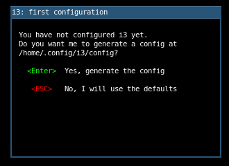
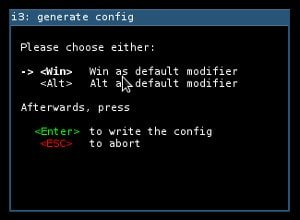
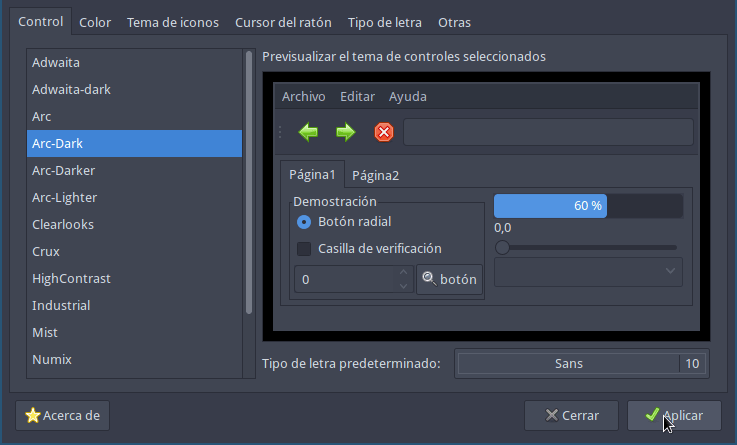
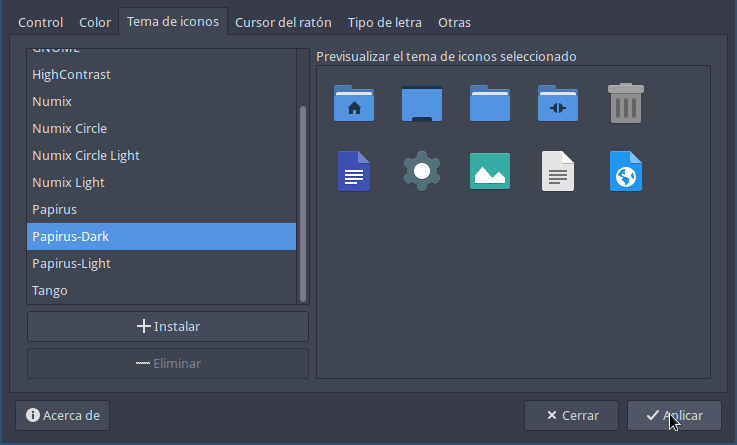
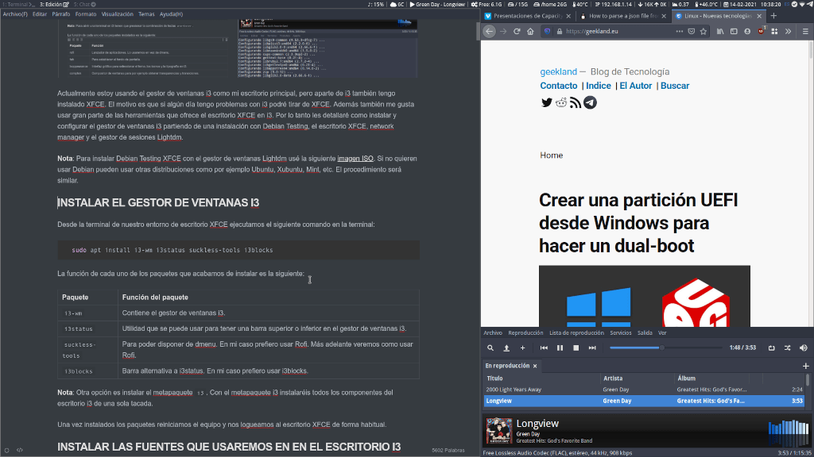

Actualmente estoy usando el gestor de ventanas i3 como mi escritorio principal, pero aparte de i3 también tengo instalado XFCE. El motivo es que si algún día tengo problemas con i3 podré tirar de XFCE. Además también me gusta usar gran parte de las herramientas que ofrece el escritorio XFCE en i3. Por lo tanto les detallaré como instalar y configurar el gestor de ventanas i3 partiendo de una instalación con Debian Testing, el escritorio XFCE, network manager y el gestor de sesiones Lightdm.<!--more-->

**Nota**: Para instalar Debian Testing XFCE con el gestor de ventanas Lightdm usé la siguiente [imagen ISO](https://cdimage.debian.org/cdimage/unofficial/non-free/cd-including-firmware/weekly-live-builds/amd64/iso-hybrid/). Si no quieren usar Debian pueden usar otras distribuciones como por ejemplo Ubuntu, Xubuntu, Mint, etc. El procedimiento el mismo, o prácticamente el mismo.

## INSTALAR EL GESTOR DE VENTANAS I3

Desde la terminal de nuestro entorno de escritorio XFCE ejecutamos el siguiente comando en la terminal:

> ```shell
> sudo apt install i3-wm i3status suckless-tools i3blocks 
> ```

La función de cada uno de los paquetes que acabamos de instalar es la siguiente:

| Paquete | Función del paquete |
| --- | --- |
| `i3-wm` | Contiene el gestor de ventanas i3. |
| `i3status` | Utilidad que se puede usar para tener una barra superior o inferior en el gestor de ventanas i3. |
| `suckless-tools` | Para poder disponer de dmenu. En mi caso prefiero usar Rofi. Más adelante veremos como usar Rofi. |
| `i3blocks` | Barra alternativa a i3status. En mi caso prefiero usar i3blocks. |

**Nota**: Otra opción es instalar el metapaquete `i3`. Con el metapaquete i3 instalaréis todos los componentes del gestor de ventanas i3 de una sola tacada.

Una vez instalados los paquetes reiniciamos el equipo y nos logueamos al escritorio XFCE de forma habitual.

## INSTALAR LAS FUENTES QUE USAREMOS EN EL GESTOR DE VENTANAS I3

En el gestor de ventanas i3 uso las fuentes Yosemite San Francisco y Font-Awesome. Para instalar estas fuentes procederemos del siguiente modo.

**Nota**: La fuente Font-Awesome es indispensable para introducir iconos gráficos en nuestra barra de tareas.

Para descargar cada una de las fuente ejecutaremos los siguientes comandos:

> ```shell
> joan@gk55:~$ wget https://github.com/supermarin/YosemiteSanFranciscoFont/archive/master.zip
> 
> joan@gk55:~$ wget https://github.com/FortAwesome/Font-Awesome/releases/download/5.15.2/fontawesome-free-5.15.2-web.zip
> ```

Acto seguido descomprimimos los ficheros que acabamos de descargar:

> ```shell
> joan@gk55:~$ unzip master.zip
> 
> joan@gk55:~$ unzip fontawesome-free-5.15.2-web.zip
> ```

A continuación creamos el directorio `~/.fonts` ejecutando el siguiente comando en la terminal:

> ```shell
> joan@gk55:~$ mkdir ~/.fonts
> ```

Seguidamente movemos las fuentes que acabamos de descomprimir a la ubicación `~/.fonts`

> ```shell
> joan@gk55:~$ mv ~/YosemiteSanFranciscoFont-master/*.ttf ~/.fonts
> 
> joan@gk55:~$ mv ~/fontawesome-free-5.15.2-web/webfonts/*.ttf ~/.fonts
> ```

Ahora ya podemos refrescar la cache de las fuentes. Para ello ejecutaremos el siguiente comando:

> ```shell
> joan@gk55:~$ fc-cache -f -v
> ```

Finalmente borramos la totalidad de ficheros que descargamos mediante los siguientes comandos.

> `**joan@gk55:~$ sudo rm -r fontawesome-free-5.15.2-web  joan@gk55:~$ rm fontawesome-free-5.15.2-web.zip   joan@gk55:~$ sudo rm -r YosemiteSanFranciscoFont-master/  joan@gk55:~$ rm master.zip**`

A partir de estos momentos ya podemos usar las fuentes Yosemite San Francisco y Font Awesome.

**Nota**: Debian Testing dispone de la tipografía FontAwesome en sus repositorios. Para instalarla tan solo tienen que instalar el paquete `fonts-font-awesome`. En mi caso aunque esté en los repositorios prefiero instalarla manualmente.

## CAMBIAR LA IMAGEN DEL FONDO DE PANTALLA DE LIGHTDM

Para que les quede un sistema operativo a su gusto pueden cambiar la imagen de fondo de LightDM. Para ello pueden seguir las instrucciones que se indican en el siguiente enlace.

https://geekland.eu/personalizar-y-configurar-lightdm/

## HACER QUE I3 SEA EL ESCRITORIO QUE ARRANCA DE FORMA PREDETERMINADA

En el momento que el gestor de sesiones LightDM nos pide la contraseña para loguearnos a nuestro equipo tenemos que clicar el . Una vez se despliegue el menú clicaremos sobre la opción escritorio i3

Una vez seleccionado el escritorio con que queremos arrancar introducimos nuestro usuarios y contraseña para loguearnos a nuestro sistema operativo.

## GENERAR LA CONFIGURACIÓN PREDETERMINADA LA PRIMERA VEZ QUE ARRANCAMOS EL GESTOR DE VENTANAS I3

La primera vez que iniciamos i3 veremos la siguiente ventana que nos pedirá si queremos generar un archivo de configuración estándar. Para generarlo tenéis que presionar la tecla Enter.

[](images/generar-configuracion-predeterminada-i3.png)

A continuación aparecerá otra ventana en que tendremos que definir la tecla principal `<Mod>`. Para seguir este tutorial seleccionad la tecla de Windows `Win` y presionad `Enter`.

[](images/definir-la-tecla-principal-en-el-escritorio-i3.jpg)

Finalmente podréis ver y usar el entorno de escritorio i3.

[](images/aspecto-inicial-del-escritorio-i3.png)

## INSTALAR LOS PAQUETES QUE NECESITAREMOS PARA LA CONFIGURACIÓN DE I3

Una vez logueados al escritorio i3 abriremos una terminal e instalaremos una serie de paquetes ejecutando el siguiente comando en la terminal:

> ```shell
> joan@gk55:~$ sudo apt install rofi feh lxappearance compton numlockx pulseaudio-utils pavucontrol arc-theme papirus-icon-theme blueman
> ```

**Nota**: Para abrir una terminal en i3 tienen que presionar la combinación de teclas `Win+Enter`. **Nota**: En el caso que no usen Debian testing es posible que no puedan instalar ni el tema arc ni los iconos papirus. En tal caso tendrán que realizar una instalación manual.

La función de cada uno de los paquetes instalados es la siguiente:

| Paquete | Función |
| --- | --- |
| `rofi` | Lanzador de aplicaciones. Lo usaremos en vez de dmenu. |
| `feh` | Para establecer el fondo de pantalla. |
| `lxappearance` | Interfaz gráfica para seleccionar el tema, los iconos y la tipografía en i3. |
| `compton` | Compositor de ventanas para por ejemplo obtener transparencias y transiciones. |
| `numlockx` | Activar el teclado numérico cada vez que iniciamos o reiniciamos i3. |
| `pavucontrol` | Controlador de audio de pulseaudio. |
| `arc-theme` | Instala el tema Arc. |
| `papirus-icon-theme` | Instala el tema de iconos Papirus. |
| `blueman` | Administrador de dispositivos y conexiones a través de Bluetooth. Si vuestro equipo no tiene Bluetooth no hace falta instalar este paquete. |

En el caso que hayan instalado Blueman ejecuten los siguientes comandos para asegurar que Blueman funcione de forma adecuada.

> ```shell
> joan@gk55:~$ sudo apt-get install pulseaudio-module-bluetooth
> 
> joan@gk55:~$ pactl load-module module-bluetooth-discover
> ```

A continuación empezaremos a configurar el escritorio i3 para que tenga un mejor aspecto.

## PERSONALIZAR LA APARIENCIA DE NUESTRO ESCRITORIO I3

Una vez instalados la totalidad de paquetes ejecutamos el comando `lxappearence` en la terminal:

> ```shell
> joan@gk55:~$ lxappearence
> ```

Cuando se abra la interfaz gráfica de lxappearence seleccionan el tema `Arc-Dark`. A continuación modifican la tipografía y el tamaño de la tipografía. Da igual la tipografía que elijan porque lo único que buscamos al cambiar la tipografía es que se genere el fichero `~/.gtkrc-2.0`.

[](images/Cambiar-el-tema-en-i3.png)

Acto seguido en la pestaña **Tema de iconos** seleccionamos los `Papirus-Dark` y presionamos el botón `Aplicar`.

[](images/Cambiar-los-iconos-en-i3.png)

### Cambiar la tipografía del sistema operativo

Para cambiar y usar la tipografía Yosemite San Francisco ejecutamos el siguiente comando en la terminal:

> ```shell
> joan@gk55:~$ nano ~/.gtkrc-2.0 
> ```

Cuando se abra el editor de textos nano vemos que en mi caso la tipografía actual es la Sans 10:

> ```shell
> # DO NOT EDIT! This file will be overwritten by LXAppearance.
> # Any customization should be done in ~/.gtkrc-2.0.mine instead.
> 
> include "/home/joan/.gtkrc-2.0.mine"
> gtk-theme-name="Arc-Dark"
> gtk-icon-theme-name="Papirus-Dark"
> gtk-font-name="Sans 10"
> gtk-cursor-theme-name="Adwaita"
> gtk-cursor-theme-size=0
> gtk-toolbar-style=GTK_TOOLBAR_BOTH
> gtk-toolbar-icon-size=GTK_ICON_SIZE_LARGE_TOOLBAR
> gtk-button-images=1
> gtk-menu-images=1
> gtk-enable-event-sounds=1
> gtk-enable-input-feedback-sounds=1
> gtk-xft-antialias=1
> gtk-xft-hinting=1
> gtk-xft-hintstyle="hintslight"
> gtk-xft-rgba="rgb"
> ```

A continuación reemplazamos la fuente `Sans 10` por la `System San Francisco Display 10`. De este modo estaremos definiendo que la tipografía de las aplicaciones que usan GTK2 es la System San Francisco y el tamaño de la fuente será 10.

> ```shell
> # DO NOT EDIT! This file will be overwritten by LXAppearance.
> # Any customization should be done in ~/.gtkrc-2.0.mine instead.
> 
> include "/home/joan/.gtkrc-2.0.mine"
> gtk-theme-name="Arc-Dark"
> gtk-icon-theme-name="Papirus-Dark"
> gtk-font-name="System San Francisco Display 10"
> gtk-cursor-theme-name="Adwaita"
> gtk-cursor-theme-size=0
> gtk-toolbar-style=GTK_TOOLBAR_BOTH
> gtk-toolbar-icon-size=GTK_ICON_SIZE_LARGE_TOOLBAR
> gtk-button-images=1
> gtk-menu-images=1
> gtk-enable-event-sounds=1
> gtk-enable-input-feedback-sounds=1
> gtk-xft-antialias=1
> gtk-xft-hinting=1
> gtk-xft-hintstyle="hintslight"
> gtk-xft-rgba="rgb"
> ```

Para cambiar la fuente de los programas que usan GTK3 ejecutaremos el siguiente comando en la terminal:

> ```shell
> joan@gk55:~$ nano ~/.config/gtk-3.0/settings.ini
> ```

Una vez se abra el editor de textos nano veremos que la fuente que tengo predefinida es la `Sans 10`.

> ```shell
> [Settings]
> gtk-theme-name=Arc-Dark
> gtk-icon-theme-name=Papirus-Dark
> gtk-font-name=Sans 10
> gtk-cursor-theme-name=Adwaita
> gtk-cursor-theme-size=0
> gtk-toolbar-style=GTK_TOOLBAR_BOTH
> gtk-toolbar-icon-size=GTK_ICON_SIZE_LARGE_TOOLBAR
> gtk-button-images=1
> gtk-menu-images=1
> gtk-enable-event-sounds=1
> gtk-enable-input-feedback-sounds=1
> gtk-xft-antialias=1
> gtk-xft-hinting=1
> gtk-xft-hintstyle=hintslight
> gtk-xft-rgba=rgb
> ```

Del mismo modo que hicimos anteriormente reemplazamos la tipografía `Sans 10` por la `System San Francisco 10`:

> ```shell
> [Settings]
> gtk-theme-name=Arc-Dark
> gtk-icon-theme-name=Papirus-Dark
> gtk-font-name=System San Francisco Display 10
> gtk-cursor-theme-name=Adwaita
> gtk-cursor-theme-size=0
> gtk-toolbar-style=GTK_TOOLBAR_BOTH
> gtk-toolbar-icon-size=GTK_ICON_SIZE_LARGE_TOOLBAR
> gtk-button-images=1
> gtk-menu-images=1
> gtk-enable-event-sounds=1
> gtk-enable-input-feedback-sounds=1
> gtk-xft-antialias=1
> gtk-xft-hinting=1
> gtk-xft-hintstyle=hintslight
> gtk-xft-rgba=rgb
> ```

A partir de estos momentos ya estaremos usando las nuevas tipografías en nuestro sistema operativo.

## EDITAR EL FICHERO DE CONFIGURACIÓN DEL GESTOR DE VENTANAS I3

A estas alturas ya podemos empezar a trabajar con los archivos de configuración. Inicialmente configuraremos la barra de herramientas i3blocks y a posteriori trabajaremos con el fichero de configuración de i3.

**Nota**: Algunas partes de los archivos de configuración están comentadas. Si lo piden en futuros artículos veremos como descomentarlas y de este modo añadir funcionalidades adicionales.

### Configurar la barra de herramientas de i3blocks

En el fichero de configuración de i3blocks podremos hacer que en la barra de nuestro escritorio aparezca:

1. El nivel de volumen.
2. La temperatura de la CPU y los discos duros.
3. La carga de CPU de nuestro equipo.
4. El uso de memoria RAM que estamos realizando.
5. El espacio libre que tenemos en disco y en memoria.
6. Mostrar la hora y un calendario.
7. Ver el nivel de batería.
8. etc.

Para editar la configuración de i3blocks crearemos un fichero de configuración en `~/.config/i3`. Para acceder a esta ubicación ejecutamos el siguiente comando:

> ```shell
> joan@gk55:~$ cd .config/i3
> ```

A continuación ejecutamos el siguiente comando para editar el archivo de configuración:

> ```shell
> joan@gk55:~/.config/i3$ nano i3blocks.conf
> ```

Una vez se abra el editor de textos nano borramos todo el contenido y pegamos el siguiente:

> ```shell
> # i3blocks config file
> #
> # Please see man i3blocks for a complete reference!
> # The man page is also hosted at http://vivien.github.io/i3blocks
> #
> # List of valid properties:
> #
> # align
> # color
> # command
> # full_text
> # instance
> # interval
> # label
> # min_width
> # name
> # separator
> # separator_block_width
> # short_text
> # signal
> # urgent
> 
> # Global properties
> #
> # The top properties below are applied to every block, but can be overridden.
> # Each block command defaults to the script name to avoid boilerplate.
> # Para elegir la separación entre los distintos bloques que aparecen en el panel
> command=/usr/share/i3blocks/$BLOCK_NAME
> separator_block_width=15
> markup=none
> 
> # Volume indicator
> #
> # The first parameter sets the step (and units to display)
> # The second parameter overrides the mixer selection
> # See the script for details.
> # Para mostrar el nivel de volumen
> [volume]
> label=♪:
> instance=Master
> #instance=PCM
> interval=1
> signal=10
> command=/usr/share/i3blocks/volume 5 pulse
> 
> # Weahter
> # Muestra la temperatura en la zona donde vivimos
> # [Weather]
> # command=bash ~/.config/i3/scripts/weather.sh "38007_pc"
> # interval=1800
> #color=#c9c9ff
> #border=#535353
> 
> # Generic media player support
> #
> # This displays "ARTIST - SONG" if a music is playing.
> # Supported players are: spotify, vlc, audacious, xmms2, mplayer, and others.
> # En el panel aparece el artista y canción que estamos reproduciendo
> #[mediaplayer]
> #label=
> #label=
> #instance=spotify
> #instance=vlc
> #command=perl ~/.config/i3/scripts/mediaplayer
> #instance=audacious
> #interval=5
> #signal=10
> 
> # Memory usage
> #
> # The type defaults to "mem" if the instance is not specified.
> # Muestra la memoria que tenemos libre
> [memory]
> label= Free:
> separator=false
> interval=30
> separator=true
> 
> # Muestra la memoria SWAP que estamos usando
> #[memory]
> #label=SWAP
> #instance=swap
> #separator=false
> #interval=30
> 
> # Disk usage
> # Mostramos el espacio que tenemos libre en la partición root y en la partición home
> # The directory defaults to $HOME if the instance is not specified.
> # The script may be called with a optional argument to set the alert
> # (defaults to 10 for 10%).
> [disk]
> label= /
> instance=/
> interval=30
> separator=false
> 
> # Disk usage
> # Muestra el espacio libre de la partición /home
> # The directory defaults to $HOME if the instance is not specified.
> # The script may be called with a optional argument to set the alert
> # (defaults to 10 for 10%).
> [disk]
> label= /home
> #instance=/mnt/data
> separator=false
> interval=30
> 
> # Temperature
> # Mostramos la temperatura de nuestro disco duro
> # Support multiple chips, though lm-sensors.
> # The script may be called with -w and -c switches to specify thresholds,
> # see the script for details.
> [temperature]
> label=
> interval=10
> command=~/.config/i3/scripts/temperature
> 
> # Network interface monitoring
> # Mostramos la IP interna con el que nuestro equipo está conectado a la red local
> # If the instance is not specified, use the interface used for default route.
> # The address can be forced to IPv4 or IPv6 with -4 or -6 switches.
> [iface]
> #instance=wlan0
> label= IP
> interval=10
> #separator=false
> 
> [wifi]
> #instance=wlp3s0
> label=
> interval=10
> 
> # Si indicamos la instancia adecuada nos muestra la velocidad de subida o bajada
> # [bandwidth]
> # #instance=eth0
> # interval=5
> 
> # CPU usage
> #
> # The script may be called with -w and -c switches to specify thresholds,
> # see the script for details.
> # Permite ver el % de CPU que el equipo está usando
> # [cpu_usage]
> # label=CPU
> # interval=10
> # min_width=CPU: 100.00%
> # separator=false
> 
> # Imprime el primero de los valores del comando uptime. Da una idea de la carga del procesador
> [load_average]
> label=
> interval=10
> separator=false
> 
> # Muestra la temperatura del procesador
> [temperature]
> label=
> interval=10
> command=~/.config/i3/scripts/temperatureprocessor
> 
> # Battery indicator
> #
> # The battery instance defaults to 0.
> #[battery]
> #label=
> #label=⚡
> #instance=1
> #interval=30
> 
> # Date Time
> # Para mostrar el dia y la hora en que estamos
> [time]
> label=
> command=date '+%d-%m-%Y   %H:%M:%S'
> interval=5
> 
> # Muestra el dia y la hora actual. también puede mostrar un calendario
> #[rofi-calendar]
> #command=/home/joan/.config/i3/scripts/rofi_calendar.sh
> #interval=3600
> #DATEFTM=+%a %d %b %Y
> #SHORTFMT=+%d/%m/%Y
> #LABEL= 
> #FONT=Monospace 10
> #LEFTCLICK_PREV_MONTH=false
> #PREV_MONTH_TEXT=« previous month «
> #NEXT_MONTH_TEXT=» next month »
> #ROFI_CONFIG_FILE=/dev/null
> 
> # OpenVPN support
> #
> # Support multiple VPN, with colors.
> #[openvpn]
> #interval=20
> 
> # Añadir indicadores al panel i3blocks para saber si las mayúsculas y teclado númerico están activados
> # Key indicators
> #
> # Add the following bindings to i3 config file:
> #
> # bindsym --release Caps_Lock exec pkill -SIGRTMIN+11 i3blocks
> # bindsym --release Num_Lock  exec pkill -SIGRTMIN+11 i3blocks
> #[keyindicator]
> #instance=CAPS
> #interval=once
> #signal=11
> 
> #[keyindicator]
> #instance=NUM
> #interval=once
> #signal=11
> ```

**Nota**: Si leéis el código tenéis una breve explicación en español de lo que hace cada parte del fichero de configuración.

### Generar los scripts para que i3blocks muestre la temperatura de la CPU y el disco duro

Para que i3blocks muestre la temperatura del disco duro y del procesador es necesario crear un par de scripts. Pero antes de generar los scripts tenemos que saber como obtener los valores de temperatura desde la terminal. Para ello abrimos una terminal y ejecutamos los comandos `sensors` y `/usr/sbin/hddtemp /dev/sda`. Tal y como veréis a continuación estos comandos muestran las temperaturas de nuestro disco y de la CPU.

> ```shell
> joan@gk55:~$ sensors
> iwlwifi_1-virtual-0
> Adapter: Virtual device
> temp1:        +47.0°C  
> 
> acpitz-acpi-0
> Adapter: ACPI interface
> temp1:        +42.0°C  (crit = +95.0°C)
> 
> coretemp-isa-0000
> Adapter: ISA adapter
> Package id 0:  +43.0°C  (high = +105.0°C, crit = +105.0°C)
> Core 0:        +43.0°C  (high = +105.0°C, crit = +105.0°C)
> Core 1:        +43.0°C  (high = +105.0°C, crit = +105.0°C)
> Core 2:        +43.0°C  (high = +105.0°C, crit = +105.0°C)
> Core 3:        +43.0°C  (high = +105.0°C, crit = +105.0°C)
> 
> joan@gk55:~$ /usr/sbin/hddtemp /dev/sda
> /dev/sda: SSD 256GB: 40°C
> ```

**Nota:** En caso que nuestro usuario no tenga permisos para ejecutar `hddtemp` ejecutad el comando `sudo chmod +s /usr/sbin/hddtemp`.

Si sabemos un poco de bash sabremos que para extraer únicamente el valor numérico de temperatura de la CPU y del disco duro tenemos que ejecutar los siguientes comandos:

> ```shell
> joan@gk55:~$ sensors | grep 'Package id' | cut -d' ' -f5
> +43.0°C
> 
> joan@gk55:~$ /usr/sbin/hddtemp /dev/sda | cut -d' ' -f4
> 40°C
> ```

**Nota**: Es posible que tengáis que modificar ligeramente los comandos.

Una vez tenemos claros los comandos para que la terminal muestre la temperatura del procesador y del disco duro generaremos los scripts para que i3 pueda mostrar las temperaturas en el panel. Para ello dentro de la ubicación `~/.config/i3` generaremos el directorio scripts para almacenar todos los scripts.

> ```shell
> joan@gk55:~/.config/i3$ mkdir scripts
> ```

A continuación accederemos dentro del directorios que acabamos de crear.

> ```shell
> joan@gk55:~/.config/i3$ cd scripts
> ```

Acto seguido ejecutaremos los siguientes comandos para crear los ficheros que contendrán el código para mostrar la temperatura.

> **`joan@gk55:~/.config/i3/scripts$ touch temperatureprocessor  joan@gk55:~/.config/i3/scripts$ touch temperature`**

El siguiente paso consiste en introducir el código dentro de los ficheros que acabamos de crear. El código será el comando que usábamos para mostrar las temperaturas en la terminal. Por lo tanto tan solo tendremos que ejecutar los siguientes comandos:

> ```shell
> joan@gk55:~/.config/i3/scripts$ echo "sensors | grep 'Package id' | cut -d' ' -f5" > temperatureprocessor
> 
> joan@gk55:~/.config/i3/scripts$ echo "/usr/sbin/hddtemp /dev/sda | cut -d' ' -f4" > temperature
> ```

Una vez introducido el código haremos que los ficheros sean ejecutables. Para ello ejecutamos los siguientes comandos:

> ```shell
> joan@gk55:~/.config/i3/scripts$ chmod +x temperature
> 
> joan@gk55:~/.config/i3/scripts$ chmod +x temperatureprocessor
> ```

### Editar el archivo de configuración del gestor de ventanas i3

El archivo de configuración de i3 está ubicado en `~/.config/i3/config`. Dentro de este archivo podemos configurar parámetros como por ejemplo los siguientes:

1. Combinaciones de teclado para hacer todo tipo de operaciones como por ejemplo subir el volumen, seleccionar la ventana activa, pasar una ventana de un espacio de trabajo a otro, etc.
2. Programas que se inician al arrancar el ordenador.
3. Espacios de trabajo que tendremos dentro del escritorio i3.
4. El lanzador de aplicaciones que queremos usar.
5. etc.

Para editar la configuración ejecutan el siguiente comando:

> ```shell
> joan@gk55:~/.config/i3$  nano ~/.config/i3/config
> ```

Una vez se abra el editor de texto nano borren todo el contenido y peguen el siguiente:

> ```shell
> # i3wm config file
> # Autor:
> #       Joan Carles "Geekland"
> # Version:
> #       v1.0: 01/02/2021 - Primera configuración i3
> 
> # Establecemos que la tecla principal para trabajar con i3 sea la de Windows
> set $mod Mod4
> 
> # Establecemos que la fuente del sistema sea la System San Francisco y que el tamaño sea 10
> font pango:System San Francisco Display 10
>  
> # Al tener como mínimo 2 ventanas abiertas presionamos la tecla Windows, Posicionamos el ratón en uno de los bordes de la ventana, presionamos el botón derecho del ratón y lo arrastramos para modificar el tamaños de las ventanas
> floating_modifier $mod
> 
> # El atajo de teclado para abrir una terminal será windows + Enter. Aquí también podemos seleccionar la terminal que queremos que se abra.
> bindsym $mod+Return exec i3-sensible-terminal
> 
> # La combinación de teclas para cerrar una ventana activa es windows+shift+q
> bindsym $mod+Shift+q kill
> 
> # Definimos el tema y los atajos de teclado para el funcionamiento de Rofi. Si cuando Rofi está abierto presionamos Shift+cursores derecha e izquierda obtendremos funcionalidades adicionales.
> set $rofi_theme "/usr/share/rofi/themes/Arc-Dark.rasi"
> bindsym Ctrl+space exec rofi -show drun -config $rofi_theme -show-icons -font "System San Francisco Display 15"
> bindsym Ctrl+Shift+space exec rofi -show window -config $rofi_theme -show-icons
> 
> # Combinación de teclas a usar para movernos entre ventanas. En mi caso uso la tecla windows+los cursores. En vez de los cursores también se pueden usar j,k,l y ñ
> bindsym $mod+j focus left
> bindsym $mod+k focus down
> bindsym $mod+l focus up
> bindsym $mod+ntilde focus right
> bindsym $mod+Left focus left
> bindsym $mod+Down focus down
> bindsym $mod+Up focus up
> bindsym $mod+Right focus right
> 
> # Para mover la ventana seleccionada arriba, abajo izquierda o derecha presionando la tecla Win+Shift+cursores. En vez de los cursores también se pueden usar j,k,l y ñ
> bindsym $mod+Shift+j move left
> bindsym $mod+Shift+k move down
> bindsym $mod+Shift+l move up
> bindsym $mod+Shift+ntilde move right
> bindsym $mod+Shift+Left move left
> bindsym $mod+Shift+Down move down
> bindsym $mod+Shift+Up move up
> bindsym $mod+Shift+Right move right
> 
> # Para definir que la siguiente ventana que abramos lo haga abajo o al lado de la actual que tenemos activa. Si os fijáis bien veréis un marco de color verde que indicará la posición donde se ubicará la nueva ventana
> bindsym $mod+h split h
> bindsym $mod+v split v
> 
> # Para poner la ventana seleccionada a pantalla completa presionar Win+f
> bindsym $mod+f fullscreen toggle
> 
> # Para hacer que las ventanas se dispongan/abran en modo tiling, pestaña o apiladas. La opción predeterminada es el modo tiling
> bindsym $mod+s layout stacking
> bindsym $mod+w layout tabbed
> bindsym $mod+e layout toggle split
> 
> # Para transformar una ventana de anclada a flotante y viceversa
> bindsym $mod+Shift+space floating toggle
> 
> # Si la ventana activa actual está en modo tiling y queremos que la ventana activa sea una ventana flotante deberemos presionar Win+Espacio
> bindsym $mod+space focus mode_toggle
> 
> # La tecla Win+a sirve para agrupar ventanas. Una vez agrupadas podremos insertar nuevas ventanas en la posición que exactamente necesitemos.
> bindsym $mod+a focus parent
> 
> # Dar un nombre a los distintos espacios de trabajo o escritorios virtuales
> set $workspace1 "1: Terminal "
> set $workspace2 "2: Navegación "
> set $workspace3 "3: Edición "
> set $workspace4 "4: Music "
> set $workspace5 "5: Chat "
> set $workspace6 "6: Email "
> set $workspace7 "7: Folders "
> set $workspace8 "8" 
> set $workspace9 "9"
> set $workspace10 "10"
> 
> # Para irse a un espacio de trabajo determinado tecla Win + Número de espacio que queremos ir
> bindsym $mod+1 workspace $workspace1
> bindsym $mod+2 workspace $workspace2
> bindsym $mod+3 workspace $workspace3
> bindsym $mod+4 workspace $workspace4
> bindsym $mod+5 workspace $workspace5
> bindsym $mod+6 workspace $workspace6
> bindsym $mod+7 workspace $workspace7
> bindsym $mod+8 workspace $workspace8
> bindsym $mod+9 workspace $workspace9
> bindsym $mod+0 workspace $workspace10
> 
> # Irse a un espacio de trabajo determinado usando el teclado numérico
> bindsym $mod+Mod2+KP_1 workspace $workspace1
> bindsym $mod+Mod2+KP_2 workspace $workspace2
> bindsym $mod+Mod2+KP_3 workspace $workspace3
> bindsym $mod+Mod2+KP_4 workspace $workspace4
> bindsym $mod+Mod2+KP_5 workspace $workspace5
> bindsym $mod+Mod2+KP_6 workspace $workspace6
> bindsym $mod+Mod2+KP_7 workspace $workspace7
> bindsym $mod+Mod2+KP_8 workspace $workspace8
> bindsym $mod+Mod2+KP_9 workspace $workspace9
> bindsym $mod+Mod2+KP_0 workspace $workspace10
> 
> # Para mover una ventana activa al espacio de trabajo que queremos. Win+Shift+Número_de_espacio_de_trabajo
> bindsym $mod+Shift+1 move container to workspace $workspace1
> bindsym $mod+Shift+2 move container to workspace $workspace2
> bindsym $mod+Shift+3 move container to workspace $workspace3
> bindsym $mod+Shift+4 move container to workspace $workspace4
> bindsym $mod+Shift+5 move container to workspace $workspace5
> bindsym $mod+Shift+6 move container to workspace $workspace6
> bindsym $mod+Shift+7 move container to workspace $workspace7
> bindsym $mod+Shift+8 move container to workspace $workspace8
> bindsym $mod+Shift+9 move container to workspace $workspace9
> bindsym $mod+Shift+0 move container to workspace $workspace10
> 
> # Para mover una ventana activa al espacio de trabajo que queremos con el teclado numérico. Win+Shift+Número_de_espacio_de_trabajo
> bindsym $mod+Shift+Mod2+KP_End move container to workspace $workspace1
> bindsym $mod+Shift+Mod2+KP_Down move container to workspace $workspace2
> bindsym $mod+Shift+Mod2+KP_Next move container to workspace $workspace3
> bindsym $mod+Shift+Mod2+KP_Left move container to workspace $workspace4
> bindsym $mod+Shift+Mod2+KP_Begin move container to workspace $workspace5
> bindsym $mod+Shift+Mod2+KP_Right move container to workspace $workspace6
> bindsym $mod+Shift+Mod2+KP_Home move container to workspace $workspace7
> bindsym $mod+Shift+Mod2+KP_Up move container to workspace $workspace8
> bindsym $mod+Shift+Mod2+KP_Prior move container to workspace $workspace9
> bindsym $mod+Shift+Mod2+KP_Insert move container to workspace $workspace10
> 
> # Para intercambiar los 2 últimos escritorios en que hemos estado
> bindsym $mod+Tab workspace back_and_forth
> # Hacer que un programa determinado se abra en un espacio de trabajo determinado. Con el comando xprop podremos averiguar la class de cada uno de los programas.
> # Firefox y Chrome se abrirán en el espacio de trabajo 2
> assign [class="Firefox"] $workspace2
> assign [class="Google-chrome"] $workspace2
> # Typora se abrirá en el espacio de trabajo 3
> #assign [class="Atom"] $workspace3
> assign [class="Typora"] $workspace3
> #assign [class="Mousepad"] $workspace3
> # Thunar se abrirá en el espacio de trabajo 4
> #assign [class="Thunar"] $workspace4
> # Deezer se abrirá en el expacio de trabajo 4
> #assign [class="Audacious"] $workspace4
> assign [class="deezer"] $workspace4
> # Telegram se abrirá en el espacio de trabajo 5
> assign [class="TelegramDesktop"] $workspace5
> # El espacio de trabajo 6 lo usaré para enviar emails con thunderbird
> assign [class="thunderbird"] $workspace6
> 
> # Atajo de teclado para recargar el archivo de configuración de i3
> bindsym $mod+Shift+c reload
> 
> # Atajo de teclado para reiniciar por completo el escritorio i3. No te saca de la sesión ni pierdes ningún tipo de información.
> bindsym $mod+Shift+r restart
> 
> # Atajo de teclado para cerrar completamente la sesión de i3. Una vez cerrada la sesión veremos la ventana de login de Lightdm
> bindsym $mod+Shift+e exec "i3-nagbar -t warning -m 'You pressed the exit shortcut. Do you really want to exit i3? This will end your X session.' -b 'Yes, exit i3' 'i3-msg exit'"
> 
> # Configuración para redimensionar las ventanas
> mode "resize" {
>         # Vim bindings
>         bindsym j resize shrink width 3 px or 3 ppt
>         bindsym k resize grow height 3 px or 3 ppt
>         bindsym l resize shrink height 3 px or 3 ppt
>         bindsym ntilde resize grow width 3 px or 3 ppt
> 
>         # Arrow bindings
>         bindsym Left resize shrink width 3 px or 3 ppt
>         bindsym Down resize grow height 3 px or 3 ppt
>         bindsym Up resize shrink height 3 px or 3 ppt
>         bindsym Right resize grow width 3 px or 3 ppt
> 
>         # back to normal: Enter or Escape
>         bindsym Return mode "default"
>         bindsym Escape mode "default"
> }
> 
> # Combinación de teclas para activar el modo redimensionar ventans
> bindsym $mod+r mode "resize"
> 
> # Configuración de colores mostrados en pantalla
> set $bg-color	          #2f343f
> set $border-focus	  #5294e2
> set $inactive-bg-color   #2f343f
> set $text-color          #f3f4f5
> set $inactive-text-color #676E7D
> set $urgent-bg-color     #E53935
> set $blue-color          #5DA8F4
> 
> # Colores de las ventanas
> #                       Border              Background         text                 indicator
> client.focused          $border-focus       $border-focus      $text-color          #00ff00
> client.unfocused        $inactive-bg-color  $inactive-bg-color $inactive-text-color #00ff00
> client.focused_inactive $inactive-bg-color  $inactive-bg-color $inactive-text-color #00ff00
> client.urgent           $blue-color         $blue-color        $text-color          #00ff00
> 
> # Se define parte de la configuración de la barra i3blocks
> bar {
>         # Bar program
> #       status_command i3blocks -c ~/.i3/i3blocks.conf
> 	    font xft: FontAwesome 9
> 
> #       status_command i3status
>         status_command i3blocks -c ~/.config/i3/i3blocks.conf
> 
>         # Position of the bar
>         position top
>         
>         # Bar colors
>         colors {
> 		background $bg-color
> 	    	separator #757575
> 		#                  border             background         text
> 		focused_workspace  $bg-color          $bg-color          $text-color
> 		inactive_workspace $inactive-bg-color $inactive-bg-color $inactive-text-color
> 	        urgent_workspace   $blue-color        $blue-color        $text-color
>         }
> }
> 
> # Quita la ventana de título y se define el grosor del borde que recubre las ventanas
> for_window [class="^.*"] border pixel 2
> 
> # Mutear, incrementar y bajar el volúmen con el teclado "pactl tiene que estar instalado"
> #bindsym XF86AudioRaiseVolume exec --no-startup-id pactl set-sink-volume 0 +5% #increase sound volume
> #bindsym XF86AudioLowerVolume exec --no-startup-id pactl set-sink-volume 0 -5% #decrease sound volume
> #bindsym XF86AudioMute exec --no-startup-id pactl set-sink-mute 0 toggle # mute sound
> bindsym Mod1+Up exec --no-startup-id pactl set-sink-volume @DEFAULT_SINK@ +5% #increase sound volume
> bindsym Mod1+Down exec --no-startup-id pactl set-sink-volume @DEFAULT_SINK@ -5% #decrease sound volume
> bindsym Mod1+m exec --no-startup-id pactl set-sink-mute @DEFAULT_SINK@ toggle # mute sound
> 
> # Win+F9 para ir cambiando la salida de audio
> #bindsym $mod+F9  exec ~/.config/i3/scripts/toggle_sink.sh
> 
> # Para incrementar o disminuir el brillo del monitor. Hace falta tener instalado xbacklight. Como no uso la opción la descomento
> #bindsym XF86MonBrightnessUp exec xbacklight -inc 20 # increase screen brightness
> #bindsym XF86MonBrightnessDown exec xbacklight -dec 20 # decrease screen brightness
> 
> # Touchpad controls
> #bindsym XF86TouchpadToggle exec /home/joan/bin/toggletouchpad # toggle touchpad
> 
> # Invertir el scroll del trackpad "Solo activar en equipos con trackpad"
> # exec_always --no-startup-id synclient NaturalScrolling=1 VertScrollDelta=-113 
> 
> # Deshabitar el trackpad mientras escribimos "Solo activar en equipos con trackpad"
> # exec syndaemon -i 0.3 -t -K -R
> 
> # Asignación de las teclas multimedia
> #bindsym XF86AudioPlay exec play_pause
> #bindsym XF86AudioPause exec play_pause
> #bindsym XF86AudioNext exec playerctl next
> #bindsym XF86AudioPrev exec playerctl previous
> 
> # Atajos de teclado para lanzar programas.
> #bindsym $mod+x exec i3lock --color "$bg-color" (i3lock es otra opción para bloquear la pantalla, para usarlo hay que instalar el paquete i3lock)
> bindsym $mod+Shift+f exec firefox
> bindsym $mod+Shift+p exec firefox -private
> #bindsym $mod+Shift+b exec blueman-manager
> 
> # Seleccionar las aplicaciones que arrancar al iniciar i3
> exec telegram-desktop
> 
> # Para añadir el applet de Nework manager en el panel
> exec --no-startup-id nm-applet
> #exec --no-startup-id nextcloud
> #exec --no-startup-id redshift-gtk
> 
> # Hacer que se active el teclado númerico cada que que se rearranque el gestor de ventanas i3. Hay que tener instalado el paquete numlockx
> exec_always --no-startup-id numlockx on
> 
> # Para establecer un fondo escritorio cada vez que se arranque o rearranque i3. "sudo apt install feh"
> exec_always feh --bg-scale https://images.unsplash.com/photo-1477346611705-65d1883cee1e?ixlib=rb-1.2.1&ixid=eyJhcHBfaWQiOjEyMDd9&auto=format&fit=crop&w=1350&q=80
> 
> # Hacer que la ventana de redacción de un email en thunderbird se abra en modo flotante "para ver las clases de las ventanas podemos usar xprop"
> for_window [window_role="Msgcompose" class="(?i)Thunderbird"] floating enable
> 
> # Fijamos que la tecla imprimir pantalla sea encargada de realizar capturas de pantalla con la utilidad de XFCE. Una alternatica es usar flameshot
> bindsym Print exec --no-startup-id xfce4-screenshooter
> #bindsym Control+Print exec --no-startup-id flameshot gui
> 
> # Habilitar geoclue
> # exec --no-startup-id /usr/lib/geoclue-2.0/demos/agent
> 
> # Combinación de teclas para bloquear la pantalla (Requiere el uso de Lightdm)
> bindsym $mod+shift+F2 exec dm-tool lock
> 
> # Habilitar un compositor para tener transparencias y transiciones suaves. "sudo apt install compton"
> exec compton -f
> #exec compton --config /home/joan/.config/compton/compton.confexec compton --config /home/joan/.config/compton/compton.conf
> 
> # Esconder la barra de i3 en el caso que lo consideremos oportuno
> bindsym $mod+m bar mode toggle
> # Para cerrar el ordenador presionar la combinación de teclas Ctrl+Alt+S
> bindsym $mod+mod1+s exec  /sbin/poweroff
> #bindsym $mod+Shift+e exec i3-msg exit
> ```

Una vez pegado el código leedlo y es autoexplicativo. Adapten el código a sus necesidades. Por ejemplo si no usan el gestor de correo Thunderbird no es necesario tener las entradas que hacen referencia a Thunderbird dentro del fichero de configuración.

Una vez estén convencidos que la configuración es la correcta guardan los cambios y cierran el fichero. Acto seguido presionamos la combinación de teclas para reiniciar el escritorio i3.

> ```shell
> Ctrl + Shift + r
> ```

## RESULTADOS FINALES DE NUESTRA CONFIGURACIÓN

Después de realizar la configuración mencionada en este artículo tendréis un escritorio con el siguiente aspecto:

**[](images/aspecto-del-escritorio-i3-con-la-configuracion-finalizada.png)**

**Nota**: En vuestro caso no veréis la totalidad de elementos mostrados en el escritorio porque requieren de configuración adicional. Si lo piden generaré más artículos en los que detallaré.

## ATAJOS DE TECLADO DEL GESTOR DE VENTANAS I3 SEGÚN LA CONFIGURACIÓN APLICADA

Según la configuración que hemos definido, los atajos de teclado para movernos en nuestro escritorio i3 son los siguientes:

| Atajos de teclado | Función del atajo de teclado |
| --- | --- |
| `Win + Shift + Enter` | Poner una ventana en modo flotante. Si lo presionamos 2 veces se volverá a poner en modo tiling. |
| `Win + Botón Izquierdo del mouse con el puntero sobre la ventana + Desplazar el ratón` | Desplazar una ventana flotante. |
| `Win + Shift + cursores` | Al igual que en el caso anterior es para desplazar una ventana flotante, pero esta vez sin hacer uso del ratón. Como alternativa a los cursores podemos usar las teclas `j`, `k`, `l`, `ñ`. |
| `Win + Botón Derecho del mouse con el puntero en un extremo de la ventana + Desplazar el ratón` | Redimensionar una ventana flotante. |
| `Win + Botón Derecho del mouse con el puntero del ratón en borde de una ventana + desplazar el ratón` | Redimensionar en ventana en modo tiling. |
| `Win + espacio` | Cambiar el foco entre una ventana flotante y otra en modo tiling. |
| `Win + Enter` | Abrir una terminal. |
| `Win + Shift + q` | Cerrar una ventana que está activa. |
| `Ctrl + Espacio` | Abrir el lanzador de aplicaciones Rofi. |
| `Ctrl + Shift + Espacio` | Se abre Rofi mostrando todas las ventanas abiertas. |
| `Win + cursores` | Para movernos de una ventana a otra. |
| `Win + Shift + cursores` | Para mover de posición una ventana en modo tiling. Por ejemplo si tenemos una ventana ubicada a la derecha, la podemos mover y ubicar a la izquierda. Como alternativa a los cursores podemos usar las teclas `j`, `k`, `l`, `ñ`. |
| `Win + h` | Para que la siguiente ventana que abramos se abra a la derecha de la ventana actual. |
| `Win + v` | Para que la siguiente ventana que abramos abajo de la ventana actual. |
| `Win + f` | Hacer que la ventana activa se muestre en pantalla completa. Para salir del modo de pantalla completa hay que presionar de nuevo `Win + f`. |
| `Win + s` | Todas las ventas abiertas se apilan y solo una queda visible. Para cambiarse entre ventanas se puede realizar con la tecla `Win + cursores`. Como alternativa a los cursores podemos usar las teclas `j`, `k`, `l`, `ñ`. |
| `Win + w` | Todas las ventas abiertas se agrupan por pestañas como en un navegador y únicamente la ventana activa es visible. Para cambiarse entre ventanas se puede realizar con la tecla `Win + cursores`. Como alternativa a los cursores podemos usar las teclas `j`, `k`, `l`, `ñ`. |
| `Win + e` | Es el modo tiling por defecto de i3. |
| `Win + a` | Agrupar ventanas para poder abrir una nueva ventana en la posición que deseemos. |
| `Win + números del 1 al 10` | Para moverse entre los distintos espacios de trabajo. |
| `Win + Shift + números del 1 al 10` | Mover la ventana activa al espacio de trabajo que nosotros queramos. |
| `Win + r` | Para entrar en el modo redimensionar ventanas. Una vez activado el modo podremos redimensionar las ventanas con los `cursores`o las teclas `j`, `k`, `l` `ñ`. Para salir del modo redimensionar ventanas volvemos a presionar la combinación de teclas `Win + r`. |
| `Alt + cursores arriba y abajo` | Subir y bajar el volumen. |
| `Alt + m` | Mutear el sonido de nuestro equipo. |
| `Mod + F9` | Para cambiar la fuente de salida del audio. Requiere configuración adicional no aplicada en este tutorial. |
| `Win + Shift + f` | Abrir Firefox. |
| `Win + Shift + p` | Abrir Firefox en modo privado. |
| `Impr Pant` | Para hacer capturas de pantalla con el programa que especifiquemos en el fichero de configuración. |
| `Win + Shift + F2` | Bloquear la pantalla con dm-tool. Para desbloquear la pantalla se tendrá que introducir de nuevo la contraseña para iniciar la sesión. |
| `Win + Shift + c` | Recargar el archivo de configuración de i3. |
| `Win + Shift + r` | Reiniciar por completo el escritorio i3. No se perderá ninguno de los trabajos que estamos realizando. También se reiniciará la configuración de i3blocks. |
| `Win + Shift + e` | Atajo de teclado para cerrar la sesión de i3. Si se cierra la sesión y no guardamos previamente la información perderemos información. |
| `Win + Ctrl + s` | Apagar el ordenador. |

Para terminar consulten las fuentes. En las fuentes que les dejo verán ejemplos y vídeos del proceso de configuración. También entrarán scripts para poder añadir funcionalidades a la barra i3blocks.

## OTRAS CONFIGURACIONES QUE PUEDEN APLICAR A I3

A continuación les dejo otros enlaces que también les ayudarán a personalizar su entorno de escritorio i3:

1. [Configurar separación entre ventanas y los bordes en i3]()
2. [Mostrar el título de las ventanas en el panel de i3]()

#### Fuentes

[https://i3wm.org/docs/userguide.html](https://i3wm.org/docs/userguide.html) [https://www.youtube.com/playlist?list=PL5ze0DjYv5DbCv9vNEzFmP6sU7ZmkGzcf](https://www.youtube.com/playlist?list=PL5ze0DjYv5DbCv9vNEzFmP6sU7ZmkGzcf) [https://github.com/vivien/i3blocks-contrib](https://github.com/vivien/i3blocks-contrib)
